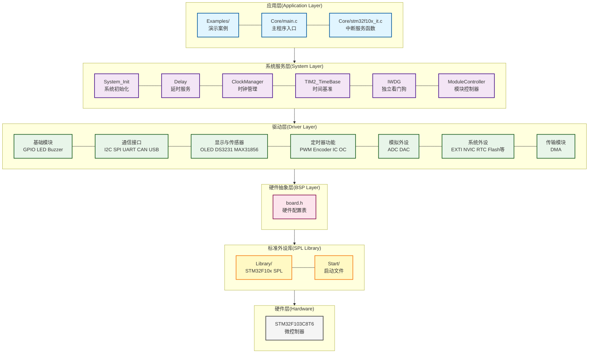
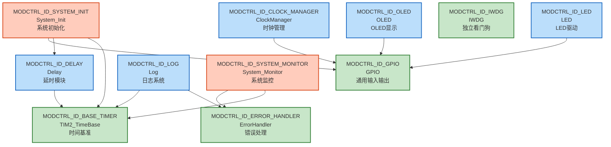
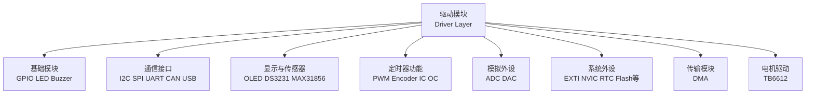

# 项目关系图文档

**版本**：1.0.0  
**更新日期**：2024-01-01  
**格式**：Mermaid（GitHub/GitLab原生支持）

---

## 一、分层架构图

项目采用清晰的分层架构，严格遵循AUTOSAR分层思想：

### 各层详细模块列表

| 层级 | 目录/文件 | 主要模块 | 说明 |
|------|---------|---------|------|
| **应用层** | `Examples/` | 演示案例 | 18个独立工程案例 |
| **应用层** | `Core/main.c` | 主程序入口 | 应用主函数 |
| **应用层** | `Core/stm32f10x_it.c` | 中断服务函数 | 中断向量表 |
| **系统服务层** | `System/system_init.c` | 系统初始化 | 统一初始化框架 |
| **系统服务层** | `System/delay.c` | 延时服务 | 阻塞式+非阻塞式延时 |
| **系统服务层** | `System/clock_manager.c` | 时钟管理 | DVFS自动调频 |
| **系统服务层** | `Drivers/timer/TIM2_TimeBase.c` | TIM2时间基准 | 系统心跳，1ms中断 |
| **系统服务层** | `System/iwdg.c` | 独立看门狗 | 看门狗管理 |
| **系统服务层** | `System/module_controller.c` | 模块控制器 | 模块状态管理 |
| **系统服务层** | `System/system_monitor.c` | 系统监控 | CPU/内存监控 |
| **驱动层** | `Drivers/` | 35个驱动模块 | 详见下方驱动层模块分类表 |
| **硬件抽象层** | `BSP/board.h` | 硬件配置表 | 统一硬件配置管理 |
| **标准外设库** | `Library/` | STM32F10x SPL | STM32标准外设库 |
| **标准外设库** | `Start/` | 启动文件 | 系统启动和初始化 |
| **硬件层** | - | STM32F103C8T6 | 微控制器硬件 |

### 驱动层模块分类详情

| 分类 | 模块数量 | 模块列表 |
|------|---------|---------|
| **基础模块** | 3 | GPIO, LED, Buzzer |
| **通信接口** | 7 | I2C_HW, I2C_SW, SPI_HW, SPI_SW, UART, CAN, USB |
| **显示与传感器** | 3 | OLED_SSD1306, DS3231, MAX31856 |
| **定时器功能** | 5 | TIM2_TimeBase, PWM, Encoder, Input Capture, Output Compare |
| **模拟外设** | 2 | ADC, DAC |
| **系统外设** | 13 | EXTI, NVIC, RTC, WWDG, BKP, PWR, Flash, CRC, DBGMCU, SDIO, FSMC, CEC |
| **传输模块** | 1 | DMA |
| **电机驱动** | 1 | TB6612 |
| **总计** | **35** | - |

---

## 二、模块依赖关系图（核心模块）

基于 `System/module_controller.c` 中定义的11个核心模块依赖关系：

### 依赖关系说明

| 模块 | 依赖模块 | 说明 |
|------|---------|------|
| **BASE_TIMER** | 无 | 时间基准模块，系统最底层 |
| **GPIO** | 无 | GPIO驱动，基础硬件抽象 |
| **ERROR_HANDLER** | 无 | 错误处理框架，独立模块 |
| **IWDG** | 无 | 独立看门狗，独立模块 |
| **DELAY** | BASE_TIMER | 延时功能依赖时间基准 |
| **LED** | GPIO | LED控制依赖GPIO |
| **OLED** | GPIO | OLED显示依赖GPIO（I2C通过GPIO实现） |
| **CLOCK_MANAGER** | GPIO | 时钟管理依赖GPIO（用于状态指示） |
| **LOG** | ERROR_HANDLER, BASE_TIMER | 日志系统依赖错误处理和时间基准 |
| **SYSTEM_INIT** | BASE_TIMER, DELAY, GPIO | 系统初始化依赖多个基础模块 |
| **SYSTEM_MONITOR** | BASE_TIMER, ERROR_HANDLER | 系统监控依赖时间基准和错误处理 |

---

## 三、模块分类组织图

基于 `Drivers/` 目录结构的模块分类：

### 模块分类统计

| 分类 | 模块数量 | 模块列表 |
|------|---------|---------|
| **基础模块** | 3 | GPIO, LED, Buzzer |
| **通信接口** | 7 | I2C_HW, I2C_SW, SPI_HW, SPI_SW, UART, CAN, USB |
| **显示与传感器** | 3 | OLED_SSD1306, DS3231, MAX31856 |
| **定时器功能** | 5 | TIM2_TimeBase, PWM, Encoder, Input Capture, Output Compare |
| **模拟外设** | 2 | ADC, DAC |
| **系统外设** | 13 | EXTI, NVIC, RTC, WWDG, BKP, PWR, Flash, CRC, DBGMCU, SDIO, FSMC, CEC |
| **传输模块** | 1 | DMA |
| **电机驱动** | 1 | TB6612 |
| **总计** | **35** | - |

---

## 说明

### 图例说明

- **实线箭头**：表示直接依赖关系（模块A调用模块B的API）
- **虚线箭头**：表示配置依赖关系（模块A使用模块B的配置）
- **颜色区分**：
  - 蓝色：应用层
  - 紫色：系统服务层
  - 绿色：驱动层
  - 橙色：调试工具层
  - 粉色：硬件抽象层

### 依赖关系规则

1. **初始化顺序**：按照依赖关系从底层到上层初始化
   - 基础模块（GPIO、TIM2_TimeBase）→ 系统服务（Delay、System_Init）→ 驱动模块 → 应用层

2. **配置依赖**：所有硬件相关模块都依赖 `BSP/board.h` 中的配置表

3. **可选依赖**：某些模块的依赖是可选的（如OLED可以使用软硬I2C）

---

**最后更新**：2024-01-01
