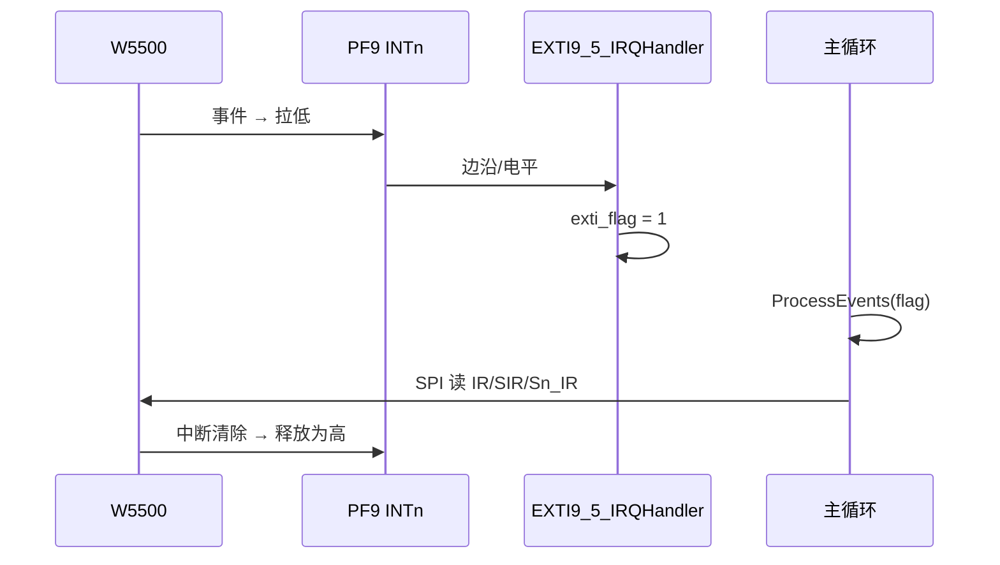

# W5500 以太网驱动

基于 SPI 的 W5500 以太网控制器驱动，符合主工程分层规范（`board.h` 配置表驱动）。

---

## 职责

- W5500 芯片寄存器读写（SPI VDM 帧格式）
- 硬件/软件复位、PHY 链路检测、版本校验（期望 `0x04`）
- 静态 IP 配置、网关 ARP 探测（可选）
- **Socket0**：TCP Listen/Connect、UDP、收发
- Socket 事件处理：轮询或 **EXTI + `W5500_ProcessEvents()`**

---

## 依赖模块

| 模块 | 说明 |
|------|------|
| `spi_hw` | SPI 总线 |
| `gpio` | CS、INT、RST 引脚 |
| `delay` | 超时与 Socket 命令间隔 |

案例层可另需 `exti`（中断模式）。

---

## 核心 API

### 初始化与网络

| 函数 | 说明 |
|------|------|
| `W5500_Init()` | SPI、CS、INT 引脚、软复位、版本检查 |
| `W5500_HardwareReset()` | RST 引脚复位；`rst_port==NULL` 时仅等待 PHY LINK |
| `W5500_SetNetConfig()` | 写入 IP / 网关 / 掩码 / MAC |
| `W5500_GetLinkStatus()` | 读 PHY 链路 |
| `W5500_PhySoftwareReset()` | 写 PHY 配置寄存器触发 PHY 软复位（无 RST 引脚时插回网线用） |
| `W5500_WaitLinkUp(timeout_ms)` | 阻塞等待 PHY LINK=1 |
| `W5500_PhyMonitor_*()` | **拔插网线监控**（Net01~05 共用，见下文） |
| `W5500_ReadVersion()` | 读 `VERR` 寄存器 |

### Socket0

| 函数 | 说明 |
|------|------|
| `W5500_SocketInit()` | 保存端口等配置并 `reinit` |
| `W5500_SocketListen()` | TCP Server；非 `CLOSED/INIT` 时先 `force_close` |
| `W5500_SocketConnect()` | TCP Client |
| `W5500_SocketOpenUdp()` | UDP 打开 Socket |
| `W5500_SocketSetPeer()` | UDP 更新目标 IP/端口（回显前调用） |
| `W5500_SocketRead()` / `W5500_SocketWrite()` | 收发 |
| `W5500_SocketClose()` | 关闭 Socket |

### 事件与中断

| 函数 | 说明 |
|------|------|
| `W5500_EnableChipInterrupt()` | 写 `IMR` / `SIMR` / `Sn_IMR`，使能 Socket0 中断 |
| `W5500_ConfigureIntPin()` | INT 引脚恢复**上拉输入**（EXTI 初始化后必须调用） |
| `W5500_InterruptProcess()` | 读 `IR` / `SIR` / `Sn_IR`，处理 CON/DISCON/RECV 等 |
| `W5500_ProcessEvents(exti_hint)` | **推荐**：EXTI 提示或 INTn 低电平时排空中断；否则 `SyncSocketState` |
| `W5500_SyncSocketState()` | 读 `Sn_SR` 同步 `flags`（补漏检） |
| `W5500_IsInterruptActive()` | INTn 是否为低（有效） |
| `W5500_GetSocketStatus()` | 取软件 `flags` / `events` |
| `W5500_ClearSocketEvents()` | 清除软件事件位 |

### 状态标志（`W5500_SocketStatus_t`）

| 宏 | 含义 |
|----|------|
| `W5500_SOCK_FLAG_INIT` | Socket 已初始化 / 监听中 |
| `W5500_SOCK_FLAG_CONN` | TCP 已连接 |
| `W5500_SOCK_EVT_RECEIVE` | 有收包事件 |
| `W5500_SOCK_EVT_TX_OK` | 发送完成 |

---

## PHY 链路监控（拔插网线）

部分 W5500 模块**无 RST GPIO**。拔网线后 TCP Socket 会僵死；插回后 PHY 状态位有时不刷新。`W5500_PhyMonitor_*` 由驱动统一处理，Net01~05 案例共用。

### API

| 函数 | 说明 |
|------|------|
| `W5500_PhyMonitor_Init()` | 绑定 `net_cfg`、初始链路、DOWN/UP/Socket 丢失回调 |
| `W5500_PhyMonitor_Process()` | **主循环每圈调用**；轮询 PHY、DOWN 时快轮询 + 周期性软复位 |
| `W5500_PhyMonitor_SetSocketWatch()` | 可选：监视 Socket0 是否仍保持 INIT / CONN |
| `W5500_PhyMonitor_RecoverNetwork()` | PHY 软复位 → `WaitLinkUp` → `SetNetConfig` |
| `W5500_PhyMonitor_IsLinked()` | 当前软件链路状态（0=DOWN） |

### 监视模式（`W5500_PhyWatchMode_t`）

| 枚举 | 适用 | 丢失条件 |
|------|------|----------|
| `W5500_PHY_WATCH_NONE` | Net01/02 Server | 不监视 Socket |
| `W5500_PHY_WATCH_TCP_CONN` | Net03 Client、Net05 MQTT | `CONN` 标志清零 |
| `W5500_PHY_WATCH_SOCKET_INIT` | Net04 UDP | `INIT` 标志清零 |

### 时序参数（`w5500.h`）

| 宏 | 默认 | 含义 |
|----|------|------|
| `W5500_PHY_MON_CHECK_MS` | 200ms | 链路 UP 时轮询间隔 |
| `W5500_PHY_MON_CHECK_DOWN_MS` | 50ms | 链路 DOWN 时快轮询 |
| `W5500_PHY_MON_RECOVER_MS` | 1000ms | DOWN 期间 PHY 软复位周期 |
| `W5500_PHY_MON_WAIT_LOG_MS` | 5000ms | `waiting PHY link UP...` 日志间隔 |
| `W5500_PHY_MON_WAIT_LINK_MS` | 3000ms | `WaitLinkUp` 单次超时 |

### 案例层接入模板

```c
static W5500_PhyMonitor_t g_phy_mon;

static void Net_OnPhyLinkDown(void *ctx)
{
    (void)ctx;
    (void)W5500_SocketClose(W5500_SOCKET_0);
    /* 清理 client_on / mqtt_ready 等应用状态 */
}

static void Net_OnPhyLinkUp(void *ctx)
{
    (void)ctx;
    (void)Net_StartTcpListen();   /* Net03: Connect；Net04: OpenUdp；Net05: MQTT_ForceReconnect */
}

/* 初始化末尾 */
W5500_PhyMonitor_Init(&g_phy_mon, &net, phy_linked,
                      Net_OnPhyLinkDown, Net_OnPhyLinkUp, Net_OnSocketLost, NULL);

while (1) {
    W5500_ProcessEvents(exti_hint);   /* 或 InterruptProcess */
    W5500_PhyMonitor_Process(&g_phy_mon);
    if (W5500_PhyMonitor_IsLinked(&g_phy_mon) == 0U) {
        continue;
    }
    /* 业务收发 ... */
    W5500_PhyMonitor_SetSocketWatch(&g_phy_mon, W5500_PHY_WATCH_TCP_CONN, app_connected);
}
```

### 典型串口日志

```text
[WARN ][NET] PHY link DOWN
[INFO ][NET] waiting PHY link UP...    /* 每 5s，表示主循环未卡死 */
[INFO ][NET] PHY link UP, recover net
/* 随后案例回调恢复 Listen / Connect / UDP / MQTT */
```

### 各案例恢复行为

| 案例 | Socket 监视 | 插回网线后 |
|------|-------------|------------|
| Net01/02 | 无 | `SocketClose` → `SocketListen` |
| Net03 | `TCP_CONN` | `SocketClose` → `SocketConnect` |
| Net04 | `SOCKET_INIT` | `SocketClose` → `SocketOpenUdp` |
| Net05 | `TCP_CONN`（MQTT 活跃时） | `MQTT_Client_ForceReconnect` + `Drain` |

---

## 初始化顺序

### 轮询模式（Net01）

```c
W5500_Init();
W5500_SetNetConfig(&net);
W5500_HardwareReset();
W5500_SocketInit(W5500_SOCKET_0, &sock_cfg);
W5500_SocketListen(W5500_SOCKET_0);

while (1) {
    W5500_InterruptProcess();
    W5500_PhyMonitor_Process(&g_phy_mon);
    if (!W5500_PhyMonitor_IsLinked(&g_phy_mon)) continue;
    W5500_GetSocketStatus(W5500_SOCKET_0, &st);
    /* 处理收发、重 Listen */
}
```

### 中断模式（Net02）

```c
W5500_Init();
W5500_SetNetConfig(&net);
W5500_HardwareReset();
W5500_SocketInit(W5500_SOCKET_0, &sock_cfg);
W5500_SocketListen(W5500_SOCKET_0);
W5500_EnableChipInterrupt();
W5500_ProcessEvents(1);           /* 清除残留中断 */

EXTI_HW_Init(EXTI_LINE_9, ...);   /* 案例层：PF9 */
EXTI_SetCallback(...);
EXTI_Enable(...);
W5500_ConfigureIntPin();          /* 恢复 INT 上拉 */

while (1) {
    W5500_ProcessEvents(exti_flag); /* exti_flag 由 ISR 置位 */
    W5500_PhyMonitor_Process(&g_phy_mon);
    if (!W5500_PhyMonitor_IsLinked(&g_phy_mon)) continue;
    /* 业务：GetSocketStatus、收发、重 Listen */
}
```

---

## INTn 与 EXTI 协作要点

W5500 **INTn 为开漏、低电平有效**：有未处理中断时引脚保持低电平。

| 注意 | 说明 |
|------|------|
| 不能仅靠下降沿 | 电平保持期间不会再产生下降沿；需 `W5500_IsInterruptActive()` 或 `ProcessEvents` 排空 |
| EXTI 后恢复上拉 | `exti.c` 将 GPIO 配为浮空输入，必须调用 `W5500_ConfigureIntPin()` |
| ISR 宜简短 | ISR 仅置标志；SPI 读寄存器放在主循环 |
| 断开重连 | `DISCON` / `TIMEOUT` 走 `force_close`，等待 `Sn_SR=CLOSED` 后再 `SocketListen` |



---

## 硬件配置

通过案例或 `BSP/board.h` 的 `W5500_CONFIG` 宏配置，**禁止在驱动内硬编码引脚**。

小精灵 F103ZE 案例（Net01/Net02）：

| 信号 | 引脚 |
|------|------|
| SCK / MISO / MOSI | PB3 / PB4 / PB5（SPI1 重映射） |
| CS | PF11 |
| INT | PF9 |
| RST | 无 GPIO（模块上电复位） |

主工程默认模板引脚（PA4~PA7 / PC14~15）见 `BSP/board.h`，与案例板不同。

---

## 模块开关

```c
#define CONFIG_MODULE_W5500_ENABLED  1
#define CONFIG_MODULE_SPI_ENABLED    1
/* 中断模式另需 */
#define CONFIG_MODULE_EXTI_ENABLED   1
#define CONFIG_MODULE_NVIC_ENABLED   1
```

---

## 错误码（基值 `ERROR_BASE_W5500 = -4600`）

| 码 | 宏 | 常见原因 |
|----|-----|----------|
| -4602 | `W5500_ERROR_SPI_FAILED` | 接线、CS、时钟 |
| -4606 | `W5500_ERROR_INIT_FAILED` | 版本非 0x04、INT 配置失败 |
| -4607 | `W5500_ERROR_LINK_DOWN` | 网线未接 |
| -4608 | `W5500_ERROR_GATEWAY` | 网关 ARP 失败 |
| -4609 | `W5500_ERROR_SOCKET` | Listen/Open 失败、CLOSE 超时 |

---

## 注意事项

1. **SPI 总线**：与其他 SPI 从设备不可共用同一 CS；引脚冲突时在 `board.h` 隔离。
2. **Socket 范围**：仅 Socket0 完整实现；Socket1~7 返回 `W5500_ERROR_NOT_IMPLEMENTED`。
3. **无 DHCP**：仅静态 IP。
4. **Keil**：将 `w5500.c` 加入工程；EXTI 模式另加 `exti.c`、`stm32f10x_exti.c`。
5. **F103 HD 与 `ETH_WKUP_IRQn`**：Connectivity Line 专有；`exti.c` 已用 `#ifdef ETH_WKUP_IRQn` 规避编译错误。

---

## 演示案例

| 案例 | 路径 | 说明 |
|------|------|------|
| Net01 轮询 Server | `Examples/Net/Net01_W5500_Server_polling/` | 轮询、TCP 回显 |
| Net02 EXTI Server | `Examples/Net/Net02_W5500_Server_EXTI/` | EXTI + TCP Server |
| Net03 EXTI Client | `Examples/Net/Net03_W5500_Client/` | TCP Client 自动重连 |
| Net04 UDP | `Examples/Net/Net04_W5500_UDP/` | UDP 收发回显 |
| Net05 MQTT | `Examples/Net/Net05_W5500_MQTT_C/` | MQTT-C 客户端 |

---

## 相关文件

| 文件 | 说明 |
|------|------|
| `w5500.h` / `w5500.c` | 驱动 API 与实现 |
| `w5500_regs.h` | 寄存器地址与位定义 |

---

**最后更新**：2026-06-30
