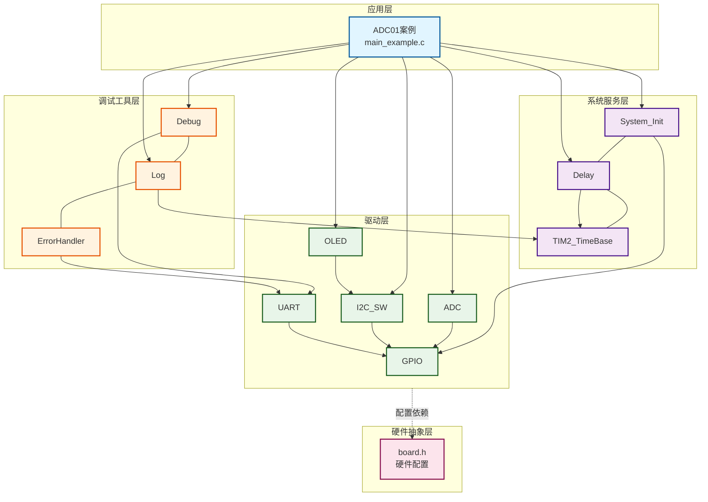
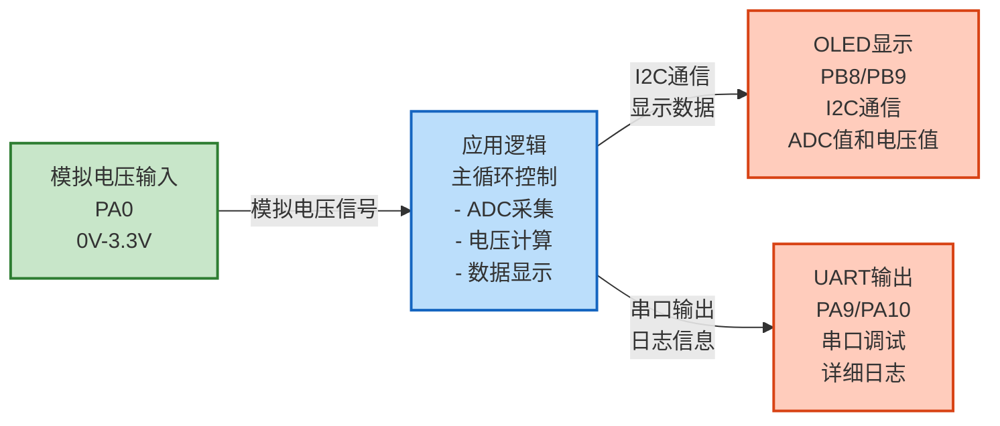
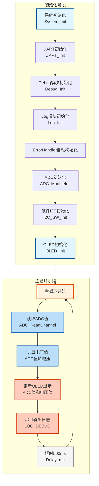

# ADC01 - 单通道电压采集示例

## 📋 案例目的

- **核心目标**
  - 演示如何使用ADC驱动模块进行单通道电压采集，包括ADC初始化、单次转换读取、电压值计算和显示

- **学习重点**
  - 理解ADC驱动模块的基本使用方法
  - 掌握ADC初始化和单次转换读取流程
  - 学习ADC原始值到电压值的转换计算
  - 了解OLED显示与ADC数据采集的结合使用
  - 学习系统初始化和错误处理的使用

- **应用场景**：适用于需要采集模拟电压信号的应用，如传感器数据采集、电压监测、信号调理等

---

## 🔧 硬件要求

### 必需外设

- **ADC输入信号源**：
  - ADC输入连接到`PA0`（ADC_Channel_0）
  - 输入电压范围：0V - 3.3V（不得超过3.3V，否则可能损坏芯片）

- **OLED显示屏**（SSD1306，软件I2C接口）：
  - SCL：`PB8`（软件I2C）
  - SDA：`PB9`（软件I2C）
  - VCC：3.3V
  - GND：GND
  - 用于显示ADC值和电压值

- **USART1**（串口调试）：
  - TX：`PA9`
  - RX：`PA10`
  - 波特率：`115200`
  - 用于串口调试和日志输出

### 硬件连接

**ADC输入连接方法**：

**方法1：使用可调电位器（推荐）**
```
3.3V ──[电位器上端]
GND  ──[电位器下端]
PA0  ──[电位器中间抽头]
```
旋转电位器可调节电压在0V-3.3V之间变化。

**方法2：使用电池（简单测试）**
```
电池正极 ─── PA0
电池负极 ─── GND
```
- **1.5V电池**（干电池/纽扣电池）：可直接连接，预期读数约1.5V
- **3V电池**（两节1.5V串联）：可直接连接，预期读数约3.0V
- **⚠️ 注意**：9V或更高电压电池需要使用分压电路，否则会损坏芯片

**方法3：使用分压电路（固定电压测试）**
```
GND ──[1kΩ]──┬── PA0
              │
           [1kΩ]
              │
            3.3V
```
- 两个相同阻值电阻串联，PA0接中间点
- 预期读数：约1.65V（3.3V的一半）
- 优点：电压稳定，不会短路，安全可靠
- 注意：两个电阻阻值相同时分压为1/2，不同阻值可得到不同电压

**方法4：直接短接测试**
```
PA0 ─── GND   (预期读数：0.000V)
PA0 ─── 3.3V  (预期读数：3.300V)
```

### 硬件连接表

| STM32F103C8T6 | 外设/模块 | 说明 |
|--------------|----------|------|
| PA0 | ADC输入 | ADC_Channel_0，0V-3.3V范围 |
| PB8 | OLED SCL | 软件I2C时钟线 |
| PB9 | OLED SDA | 软件I2C数据线 |
| PA9 | USART1 TX | 串口发送（调试） |
| PA10 | USART1 RX | 串口接收（调试） |
| 3.3V | VCC | 电源 |
| GND | GND | 地线 |

**⚠️ 重要提示**：

- **电压范围限制**：ADC输入电压必须在0V-3.3V范围内，超过3.3V可能损坏芯片
- **输入阻抗**：ADC输入阻抗较高，适合连接高阻抗信号源
- **采样时间**：采样时间越长，转换精度越高，但转换速度越慢
- 案例是独立工程，硬件配置在案例目录下的 `board.h` 中
- 如果硬件引脚不同，直接修改 `Examples/ADC/ADC01_SingleChannelVoltage/board.h` 中的配置即可
- **新项目必须配置UART**：所有新项目必须包含UART_CONFIGS配置（用于串口调试和日志输出）

### 硬件配置

**⚠️ 重要说明**：案例是独立工程，硬件配置在案例目录下的 `board.h` 中。
如果硬件引脚不同，直接修改 `Examples/ADC/ADC01_SingleChannelVoltage/board.h` 中的配置即可。

**ADC配置**（单通道）：
```c
/* ADC统一配置表 */
#define ADC_CONFIGS { \
    {ADC1, {ADC_Channel_0}, 1, ADC_SampleTime_55Cycles5, 1},  /* ADC1：PA0，单通道，55.5周期采样，启用 */ \
}
```

**配置说明**：
- `adc_periph`: `ADC1`（ADC外设）
- `channels`: `{ADC_Channel_0}`（通道数组，单通道）
- `channel_count`: `1`（通道数量）
- `sample_time`: `ADC_SampleTime_55Cycles5`（采样时间，55.5周期，平衡精度和速度）
- `enabled`: `1`（启用标志）

**OLED配置**（已包含在board.h中）：
```c
/* OLED I2C配置 */
#define OLED_I2C_CONFIG {      \
    GPIOB,                     \
    GPIO_Pin_8, /* SCL: PB8 */ \
    GPIOB,                     \
    GPIO_Pin_9, /* SDA: PB9 */ \
}
```

**UART配置**（已包含在board.h中，新项目必须）：
```c
/* UART统一配置表 - 标准配置：USART1，PA9/PA10，115200，8N1 */
#define UART_CONFIGS { \
    {USART1, GPIOA, GPIO_Pin_9, GPIOA, GPIO_Pin_10, 115200, USART_WordLength_8b, USART_StopBits_1, USART_Parity_No, 1}, \
}
```

**注意**：
- 根据实际硬件修改ADC通道（`ADC_Channel_0`等）
- 根据实际硬件修改OLED引脚（`GPIO_Pin_8`、`GPIO_Pin_9`等）
- 根据实际需求调整采样时间（`ADC_SampleTime_55Cycles5`等）

---

## 📦 模块依赖

### 模块依赖关系图

展示本案例使用的模块及其依赖关系：



### 模块列表

本案例使用以下模块：

- `adc`：ADC驱动模块（核心功能，单通道电压采集）
- `gpio`：GPIO驱动模块（ADC、UART、OLED依赖）
- `uart`：UART驱动模块（串口调试，新项目必须）
- `debug`：Debug模块（printf重定向，新项目必须）
- `log`：日志模块（分级日志系统，新项目必须）
- `error_handler`：错误处理模块（统一错误处理，新项目必须）
- `oled_ssd1306`：OLED显示驱动模块（状态显示）
- `i2c_sw`：软件I2C驱动模块（OLED使用）
- `delay`：延时模块（用于实现时间间隔）
- `system_init`：系统初始化模块

### 模块使用说明

| 模块分类 | 模块名称 | 用途 | 依赖关系 |
|---------|---------|------|----------|
| **系统服务** | System_Init | 系统初始化 | 依赖GPIO、Delay |
| **系统服务** | Delay | 延时功能 | 依赖TIM2_TimeBase |
| **系统服务** | TIM2_TimeBase | 时间基准 | 无依赖 |
| **基础驱动** | GPIO | GPIO操作 | 依赖BSP配置 |
| **模拟驱动** | ADC | ADC采集 | 依赖GPIO |
| **通信驱动** | UART | 串口调试 | 依赖GPIO |
| **通信驱动** | I2C_SW | 软件I2C | 依赖GPIO |
| **显示驱动** | OLED_SSD1306 | OLED显示 | 依赖I2C_SW |
| **调试工具** | Debug | 调试输出 | 依赖UART |
| **调试工具** | Log | 日志系统 | 依赖ErrorHandler、TIM2_TimeBase |
| **调试工具** | ErrorHandler | 错误处理 | 无依赖 |

---

## 🔄 实现流程

### 整体逻辑

本案例通过标准初始化流程和主循环，全面演示ADC单通道电压采集的完整流程：

1. **系统初始化阶段**：
   - 系统初始化（System_Init）
   - UART初始化（串口调试）
   - Debug模块初始化（printf重定向）
   - Log模块初始化（分级日志）
   - ErrorHandler自动初始化（错误处理）

2. **ADC初始化阶段**：
   - ADC初始化（ADC_ModuleInit）
   - 配置ADC通道和采样时间
   - ADC校准（自动完成）

3. **显示初始化阶段**：
   - 软件I2C初始化（OLED需要）
   - OLED初始化（状态显示）

4. **主循环阶段**：
   - 每500ms采集一次ADC值
   - 计算电压值（12位ADC，0-4095对应0V-3.3V）
   - OLED显示ADC原始值和电压值
   - 串口输出详细日志

### 数据流向图

展示本案例的数据流向：输入设备 → 处理 → 输出设备



**数据流说明**：

1. **输入设备**：
   - **模拟电压输入**（PA0）：通过ADC通道0采集0V-3.3V范围的模拟电压信号

2. **应用逻辑**：
   - 主循环中调用ADC读取函数
   - 将12位ADC原始值（0-4095）转换为电压值（0V-3.3V）
   - 格式化数据用于显示

3. **输出设备**：
   - **OLED**：显示ADC原始值和计算后的电压值
   - **UART**：输出详细日志信息（支持中文）

### 关键方法

- **标准初始化流程**：按照System_Init → UART → Debug → Log → ADC → OLED的顺序初始化
- **错误处理集成**：通过ErrorHandler模块统一处理错误，并输出错误日志
- **分级日志输出**：通过Log模块实现不同级别的日志输出，便于调试和监控
- **串口与OLED输出分工**：串口输出详细日志（中文），OLED输出关键数据（英文）
- **电压值计算**：使用公式 `电压(V) = (ADC值 / 4095) * 3.3V` 计算实际电压

### 工作流程示意



---

## 📚 关键函数说明

### ADC相关函数

- **`ADC_ModuleInit()`**：初始化ADC驱动模块
  - 在本案例中用于初始化ADC1，配置PA0为ADC输入
  - 根据配置表自动初始化所有enabled=1的ADC实例
  - 返回ADC_Status_t错误码，需要检查返回值
  - 初始化失败必须停止程序（ADC是核心功能）

- **`ADC_ReadChannel()`**：单通道单次转换读取
  - 在本案例中用于读取PA0（ADC_Channel_0）的ADC值
  - 参数：ADC实例、通道号、输出缓冲区、超时时间
  - 返回ADC_Status_t错误码，需要检查返回值
  - 返回12位ADC值（0-4095）

### UART相关函数

- **`UART_Init()`**：初始化UART外设
  - 在本案例中用于初始化USART1，配置为115200波特率、8N1格式
  - 参数：UART实例索引（UART_INSTANCE_1）
  - 返回UART_Status_t错误码，初始化失败必须停止程序

### Debug模块相关函数

- **`Debug_Init()`**：初始化Debug模块（UART模式）
  - 在本案例中用于初始化Debug模块，配置为UART输出模式
  - 参数：输出模式（DEBUG_MODE_UART）、波特率
  - 返回int类型，0表示成功，非0表示失败，初始化失败必须停止程序

### Log模块相关函数

- **`Log_Init()`**：初始化日志系统
  - 在本案例中用于初始化日志系统，配置日志级别和功能开关
  - 参数：日志配置结构体指针
  - 返回Log_Status_t错误码，初始化失败可以继续运行

- **`LOG_DEBUG()`** / **`LOG_INFO()`** / **`LOG_WARN()`** / **`LOG_ERROR()`**：分级日志宏
  - 在本案例中用于输出不同级别的日志
  - 参数：模块名称、格式字符串、参数列表
  - 串口输出详细日志（支持中文）

### 错误处理相关函数

- **`ErrorHandler_Handle()`**：处理错误
  - 在本案例中用于处理各种错误，并输出错误日志
  - 参数：错误码、模块名称
  - ErrorHandler模块在编译时自动初始化，无需显式调用

### 软件I2C相关函数

- **`I2C_SW_Init()`**：初始化软件I2C驱动模块
  - 在本案例中用于初始化软件I2C，为OLED提供I2C通信接口
  - 参数：软件I2C实例索引（SOFT_I2C_INSTANCE_1）
  - 返回SoftI2C_Status_t错误码，需要检查返回值
  - 初始化失败时OLED无法使用，但ADC仍可工作

### OLED相关函数

- **`OLED_Init()`**：初始化OLED显示模块
  - 在本案例中用于初始化OLED显示
  - 返回OLED_Status_t错误码，需要检查返回值

- **`OLED_Clear()`**：清屏
  - 在本案例中用于清除OLED显示内容

- **`OLED_ShowString()`**：显示字符串
  - 在本案例中用于显示ADC值和电压值
  - 参数：行号、列号、字符串（全英文，ASCII字符）

### 延时相关函数

- **`Delay_ms()`**：毫秒级延时（阻塞式）
  - 在本案例中用于实现时间间隔（500ms采集一次）
  - 参数：延时时间（毫秒）
  - 阻塞式延时，会占用CPU时间

**详细函数实现和调用示例请参考**：`main_example.c` 中的代码

---

## ⚠️ 注意事项与重点

### ⚠️ 重要提示

1. **电压范围限制**：ADC输入电压必须在0V-3.3V范围内，超过3.3V可能损坏芯片
2. **初始化顺序**：必须严格按照 System_Init → UART → Debug → Log → ADC → OLED 的顺序初始化
3. **UART配置**：新项目必须包含UART_CONFIGS配置（用于串口调试和日志输出）
4. **错误处理**：所有模块初始化函数必须检查返回值，使用ErrorHandler统一处理错误
5. **硬件配置**：案例是独立工程，硬件配置在案例目录下的 `board.h` 中

### 🔑 关键点

1. **标准初始化流程**：
   - 系统初始化（System_Init）
   - UART初始化（UART_Init）
   - Debug模块初始化（Debug_Init，UART模式）
   - Log模块初始化（Log_Init）
   - ErrorHandler自动初始化（无需显式调用）
   - ADC初始化（ADC_ModuleInit）
   - 其他模块初始化（按依赖顺序）

2. **错误处理策略**：
   - UART/Debug初始化失败：必须停止程序（进入死循环）
   - Log初始化失败：可以继续运行（使用UART直接输出）
   - ADC初始化失败：必须停止程序（ADC是核心功能）
   - OLED初始化失败：可以继续运行（ADC仍可工作）

3. **输出分工规范**：
   - **串口（UART）**：详细日志、调试信息、错误详情（支持中文，GB2312编码）
   - **OLED**：关键状态、实时数据、简要提示（全英文，ASCII字符）
   - **双边输出**：系统启动信息、关键错误、重要状态变化

4. **ADC使用要点**：
   - ADC值为12位（0-4095），对应0V-3.3V
   - 采样时间越长，精度越高，但转换速度越慢
   - 单次转换模式适合低频采集，连续转换模式适合高频采集
   - 内部通道（16、17）不需要GPIO配置

5. **电压计算公式**：
   ```
   电压(V) = (ADC值 / 4095) * 参考电压(3.3V)
   ```

### 💡 调试技巧

1. **没有日志输出**：
   - 检查UART是否正确初始化
   - 检查Debug模块是否正确初始化
   - 检查串口助手配置是否正确（115200, 8N1）
   - 检查硬件连接是否正确（PA9/PA10）

2. **ADC值始终为0或4095**：
   - 检查ADC输入连接是否正确（PA0）
   - 检查输入电压是否在0V-3.3V范围内
   - 检查ADC初始化是否成功
   - 检查ADC通道配置是否正确

3. **ADC值不稳定**：
   - 增加采样时间（提高精度）
   - 检查输入信号是否稳定
   - 实现软件滤波（滑动平均等）
   - 检查电源是否稳定

4. **OLED不显示**：
   - 检查OLED连接是否正确（SCL: PB8, SDA: PB9）
   - 检查软件I2C模块是否已启用
   - 检查OLED模块是否已启用

---

## 🔍 常见问题排查

### ADC值始终为0或4095

- **可能原因**：
  - ADC输入连接错误
  - 输入电压超出范围
  - ADC初始化失败
  - ADC通道配置错误

- **解决方法**：
  - 检查ADC输入连接是否正确（PA0）
  - 检查输入电压是否在0V-3.3V范围内
  - 检查ADC初始化是否成功（检查返回值）
  - 检查ADC通道配置是否正确（ADC_Channel_0）

### ADC值不稳定

- **可能原因**：
  - 采样时间过短
  - 输入信号不稳定
  - 电源不稳定
  - 未实现软件滤波

- **解决方法**：
  - 增加采样时间（修改 `board.h` 中的 `sample_time`，使用更长的采样时间）
  - 检查输入信号是否稳定，无干扰
  - 检查电源是否稳定，无纹波
  - 在主循环中实现滑动平均滤波

### OLED不显示

- **可能原因**：
  - OLED连接错误
  - 软件I2C模块未启用
  - OLED模块未启用
  - I2C通信失败

- **解决方法**：
  - 检查OLED连接是否正确（SCL: PB8, SDA: PB9）
  - 检查软件I2C模块是否已启用（`CONFIG_MODULE_SOFT_I2C_ENABLED = 1`）
  - 检查OLED模块是否已启用（`CONFIG_MODULE_OLED_ENABLED = 1`）
  - 检查I2C时序配置（延时参数）

### 编译错误

- **可能原因**：
  - 缺少必要的头文件
  - 模块未启用
  - 配置错误

- **解决方法**：
  - 确保已包含必要的头文件
  - 确保 `System_Init()` 和 `ADC_ModuleInit()` 已正确调用
  - 确保ADC模块已启用（`CONFIG_MODULE_ADC_ENABLED = 1`）
  - 确保OLED模块已启用（`CONFIG_MODULE_OLED_ENABLED = 1`）
  - 确保软件I2C模块已启用（`CONFIG_MODULE_SOFT_I2C_ENABLED = 1`）
  - 确保UART模块已启用（`CONFIG_MODULE_UART_ENABLED = 1`）
  - 确保Log模块已启用（`CONFIG_MODULE_LOG_ENABLED = 1`）
  - 确保ErrorHandler模块已启用（`CONFIG_MODULE_ERROR_HANDLER_ENABLED = 1`）

---

## 💡 扩展练习

### 循序渐进理解本案例

1. **修改采样时间**：修改 `board.h` 中的 `sample_time`，观察精度和速度的变化，理解采样时间对ADC精度的影响
2. **多通道采集**：修改配置为多通道，实现多路电压采集，理解多通道ADC的配置和使用
3. **连续转换模式**：使用 `ADC_StartContinuous()` 实现连续转换，提高采集频率，理解连续转换模式的优势

### 实际场景中的常见坑点

4. **ADC值抖动问题**：ADC采样值可能存在抖动，导致读数不稳定。如何实现有效的滤波算法（如滑动平均、中值滤波）？如何平衡滤波效果和响应速度？
5. **多通道切换延迟**：当切换ADC通道时，需要等待采样电容稳定，否则可能读取到上一个通道的值。如何确保通道切换后采样值的准确性？如何处理通道切换的稳定时间？
6. **ADC参考电压稳定性**：ADC的参考电压（VREF）如果不稳定，会影响所有通道的精度。如何检测参考电压是否稳定？如何处理参考电压漂移？

---

## 📖 相关文档

- **模块文档**：
  - **ADC驱动**：`Drivers/analog/adc.c/h`
  - **GPIO驱动**：`Drivers/basic/gpio.c/h`
  - **UART驱动**：`Drivers/uart/uart.c/h`
  - **Debug模块**：`Debug/debug.c/h`
  - **Log模块**：`Debug/log.c/h`
  - **ErrorHandler模块**：`Common/error_handler.c/h`
  - **OLED驱动**：`Drivers/display/oled_ssd1306.c/h`
  - **OLED字库**：`Drivers/display/oled_font_ascii8x16.c/h`
  - **软件I2C驱动**：`Drivers/i2c/i2c_sw.c/h`
  - **延时功能**：`System/delay.c/h`
  - **系统初始化**：`System/system_init.c/h`

- **业务文档**：
  - **主程序代码**：`Examples/ADC/ADC01_SingleChannelVoltage/main_example.c`
  - **硬件配置**：`Examples/ADC/ADC01_SingleChannelVoltage/board.h`
  - **模块配置**：`Examples/ADC/ADC01_SingleChannelVoltage/config.h`
  - **项目规范文档**：`../../AI/README.md`（AI规则体系）
  - **案例参考**：`Examples/README.md`

---

## 📝 更新日志

- **2024-01-01**：
  - 初始版本，包含ADC单通道电压采集示例
  - 演示ADC初始化、单次转换读取、电压值计算和显示
  - 集成UART、Debug、Log、ErrorHandler等基础模块
