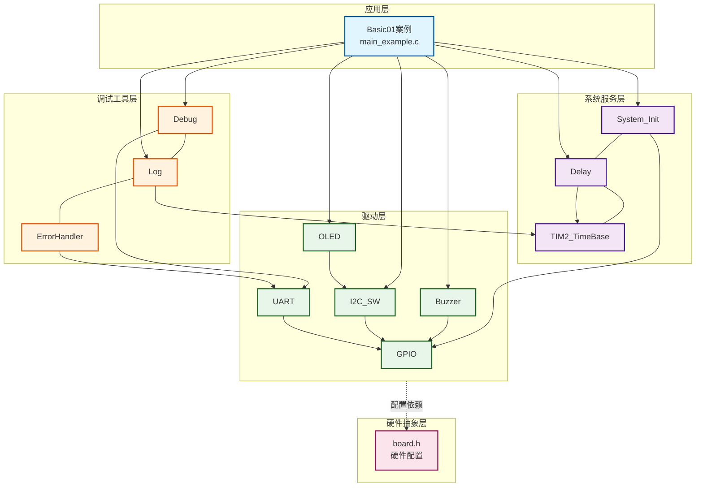
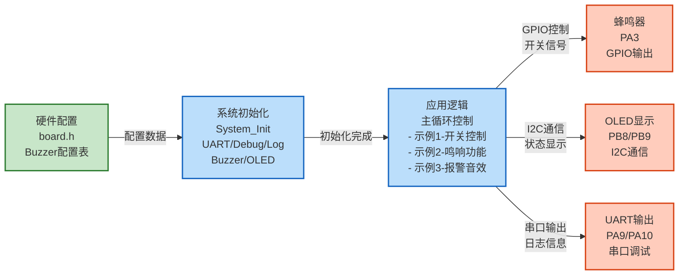

# Basic01 - 有源蜂鸣器控制示例

## 📋 案例目的

- **核心目标**
  - 演示如何使用Buzzer驱动模块进行GPIO模式的控制，包括简单开关控制、鸣响功能、报警音效

- **核心功能**：
  - GPIO模式Buzzer的简单开关控制（开启/关闭）
  - 单次鸣响功能（指定时长）
  - 连续短鸣响功能（多声短鸣）
  - 报警音效模式（三短一长）
  - OLED显示操作状态和提示信息

- **学习重点**：
  - 理解Buzzer驱动模块的基本使用方法
  - 掌握GPIO模式Buzzer的控制方法
  - 学习Buzzer快捷宏的使用（`BUZZER1_On()`, `BUZZER1_Off()`, `BUZZER1_Beep()`）
  - 了解OLED显示与Buzzer控制的结合使用
  - 学习系统初始化和延时功能的使用
  - 掌握标准初始化流程（System_Init → UART → Debug → Log → 其他模块）

- **应用场景**：适用于需要声音提示的应用，如报警系统、按键反馈、状态提示等

---

## 🔧 硬件要求

### 必需外设

- **有源蜂鸣器**：
  - 正极：`PA3`（GPIO输出）
  - 负极：`GND`
  - **⚠️ 重要提示**：
    - **必须使用有源蜂鸣器**：有源蜂鸣器内部有振荡电路，通电即响，频率固定（通常2-4kHz）
    - GPIO模式只能控制开关，无法改变频率和音调
    - 如果使用无源蜂鸣器，请使用Basic02案例（PWM模式）

- **LED1**（可选）：`PA1`（系统状态指示，本案例未使用）

### 传感器/模块

- **OLED显示屏**（SSD1306，软件I2C接口）：
  - SCL：`PB8`（软件I2C）
  - SDA：`PB9`（软件I2C）
  - VCC：3.3V
  - GND：GND
  - 用于显示操作状态和提示信息

- **USART1**（串口调试）：
  - TX：`PA9`
  - RX：`PA10`
  - 波特率：`115200`
  - 用于串口调试和日志输出

### 硬件连接

| STM32F103C8T6 | 外设 | 说明 |
|--------------|------|------|
| PA3 | 有源蜂鸣器正极 | GPIO输出，低电平有效 |
| GND | 有源蜂鸣器负极 | 公共地 |
| PB8 | OLED SCL | 软件I2C时钟线 |
| PB9 | OLED SDA | 软件I2C数据线 |
| PA9 | USART1 TX | 串口发送（调试） |
| PA10 | USART1 RX | 串口接收（调试） |
| 3.3V | VCC | 电源 |
| GND | GND | 地线 |

**⚠️ 重要提示**：

- 案例是独立工程，硬件配置在案例目录下的 `board.h` 中
- 如果硬件引脚不同，直接修改 `Examples/Basic/Basic01_ActiveBuzzer/board.h` 中的配置即可
- Buzzer配置中的 `active_level` 参数：`Bit_RESET` 为低电平有效，`Bit_SET` 为高电平有效
- 根据实际硬件修改有效电平配置（`Bit_RESET`/`Bit_SET`）
- **新项目必须配置UART**：所有新项目必须包含UART_CONFIGS配置（用于串口调试和日志输出）

---

## 📦 模块依赖

### 模块依赖关系图

展示本案例使用的模块及其依赖关系：

### 模块列表

本案例使用以下模块：

- `buzzer`：Buzzer驱动模块（核心功能，GPIO模式）
- `gpio`：GPIO驱动模块（Buzzer、UART依赖）
- `uart`：UART驱动模块（串口调试，新项目必须）
- `oled_ssd1306`：OLED显示驱动模块（状态显示）
- `i2c_sw`：软件I2C驱动模块（OLED使用）
- `delay`：延时模块（用于实现时间间隔）
- `system_init`：系统初始化模块
- `debug`：Debug模块（printf重定向，新项目必须）
- `log`：日志模块（分级日志系统，新项目必须）
- `error_handler`：错误处理模块（统一错误处理，新项目必须）

### 模块使用说明

| 模块分类 | 模块名称 | 用途 | 依赖关系 |
|---------|---------|------|----------|
| **系统服务** | System_Init | 系统初始化 | 依赖GPIO、Delay |
| **系统服务** | Delay | 延时功能 | 依赖TIM2_TimeBase |
| **系统服务** | TIM2_TimeBase | 时间基准 | 无依赖 |
| **基础驱动** | GPIO | GPIO操作 | 依赖BSP配置 |
| **基础驱动** | Buzzer | 蜂鸣器控制 | 依赖GPIO |
| **通信驱动** | UART | 串口调试 | 依赖GPIO |
| **通信驱动** | I2C_SW | 软件I2C | 依赖GPIO |
| **显示驱动** | OLED_SSD1306 | OLED显示 | 依赖I2C_SW |
| **调试工具** | Debug | 调试输出 | 依赖UART |
| **调试工具** | Log | 日志系统 | 依赖ErrorHandler、TIM2_TimeBase |
| **调试工具** | ErrorHandler | 错误处理 | 无依赖 |

---

## 🔄 实现流程

### 整体逻辑

本案例通过3个示例阶段，全面演示Buzzer GPIO模式的各种功能。每个示例阶段展示不同的功能点：

1. **初始化阶段**：
   - 系统初始化（System_Init）
   - UART初始化（UART_Init）
   - Debug模块初始化（Debug_Init，UART模式）
   - Log模块初始化（Log_Init）
   - ErrorHandler模块自动初始化
   - Buzzer初始化（Buzzer_Init）
   - 软件I2C初始化（I2C_SW_Init）
   - OLED初始化（OLED_Init）

2. **主循环阶段**：
   - 示例1：简单开关控制（开启500ms，关闭500ms）
   - 示例2：鸣响功能（单次300ms，连续三声100ms）
   - 示例3：报警音效（三短一长）
   - 循环执行上述操作

### 数据流向图

展示本案例的数据流向：配置数据 → 初始化 → 主循环 → 输出设备

**数据流说明**：

1. **配置数据**：
   - **硬件配置**（`board.h`）：Buzzer配置表定义GPIO引脚、有效电平等参数

2. **初始化阶段**：
   - 系统初始化：初始化GPIO、延时等基础功能
   - UART/Debug/Log初始化：建立串口调试通道
   - Buzzer初始化：根据配置表初始化Buzzer驱动
   - OLED初始化：初始化显示模块

3. **应用逻辑**：
   - 主循环中按顺序执行三个示例
   - 每个示例控制Buzzer状态并更新显示

4. **输出设备**：
   - **蜂鸣器**：GPIO控制，输出开关信号
   - **OLED**：显示当前操作状态和提示信息
   - **UART**：输出详细日志信息

### 关键方法

1. **标准初始化流程**：按照 System_Init → UART → Debug → Log → 其他模块 的顺序初始化
2. **错误处理集成**：通过ErrorHandler模块统一处理错误，并输出错误日志
3. **分级日志输出**：通过Log模块实现不同级别的日志输出，便于调试和监控
4. **串口与OLED输出分工**：串口输出详细日志（中文），OLED输出简要状态（英文）
5. **快捷宏使用**：使用 `BUZZER1_On()`, `BUZZER1_Off()`, `BUZZER1_Beep()` 简化代码

### 工作流程示意

```mermaid
flowchart TD
    %% 初始化阶段
    subgraph INIT[初始化阶段]
        direction TB
        START[系统初始化<br/>System_Init]
        START --> UART_INIT[UART初始化<br/>UART_Init]
        UART_INIT --> DEBUG_INIT[Debug模块初始化<br/>Debug_Init]
        DEBUG_INIT --> LOG_INIT[Log模块初始化<br/>Log_Init]
        LOG_INIT --> ERROR_INIT[ErrorHandler自动初始化]
        ERROR_INIT --> BUZZER_INIT[Buzzer初始化<br/>Buzzer_Init]
        BUZZER_INIT --> I2C_INIT[软件I2C初始化<br/>I2C_SW_Init]
        I2C_INIT --> OLED_INIT[OLED初始化<br/>OLED_Init]
    end
    
    %% 主循环阶段
    subgraph LOOP[主循环阶段]
        direction TB
        MAIN_LOOP[主循环开始]
        
        %% 示例1
        MAIN_LOOP --> EX1_START[示例1-简单开关控制]
        EX1_START --> EX1_DISP1[OLED显示<br/>On/Off Ctrl]
        EX1_DISP1 --> EX1_ON[Buzzer开启<br/>BUZZER1_On]
        EX1_ON --> EX1_DELAY1[延时500ms]
        EX1_DELAY1 --> EX1_DISP2[OLED显示<br/>Buzzer OFF]
        EX1_DISP2 --> EX1_OFF[Buzzer关闭<br/>BUZZER1_Off]
        EX1_OFF --> EX1_DELAY2[延时500ms]
        
        %% 示例2
        EX1_DELAY2 --> EX2_START[示例2-鸣响功能]
        EX2_START --> EX2_DISP1[OLED显示<br/>Beep 300ms]
        EX2_DISP1 --> EX2_BEEP1[单次鸣响300ms<br/>BUZZER1_Beep]
        EX2_BEEP1 --> EX2_DISP2[OLED显示<br/>3x Short]
        EX2_DISP2 --> EX2_BEEP2[连续三声100ms<br/>BUZZER1_Beep x3]
        EX2_BEEP2 --> EX2_DELAY[延时500ms]
        
        %% 示例3
        EX2_DELAY --> EX3_START[示例3-报警音效]
        EX3_START --> EX3_DISP[OLED显示<br/>Alarm Sound]
        EX3_DISP --> EX3_BEEP[三短一长<br/>100ms x3 + 500ms]
        EX3_BEEP --> EX3_DELAY[延时1000ms]
        
        %% 循环
        EX3_DELAY --> MAIN_LOOP
    end
    
    %% 连接
    OLED_INIT --> MAIN_LOOP
    
    %% 样式 - 初始化
    style START fill:#e1f5ff,stroke:#01579b,stroke-width:2px
    style OLED_INIT fill:#e1f5ff,stroke:#01579b,stroke-width:2px
    
    %% 样式 - 主循环
    style MAIN_LOOP fill:#fff3e0,stroke:#e65100,stroke-width:3px
    style EX1_START fill:#c8e6c9,stroke:#2e7d32,stroke-width:2px
    style EX2_START fill:#c8e6c9,stroke:#2e7d32,stroke-width:2px
    style EX3_START fill:#c8e6c9,stroke:#2e7d32,stroke-width:2px
    style EX1_ON fill:#bbdefb,stroke:#1565c0,stroke-width:2px
    style EX1_OFF fill:#bbdefb,stroke:#1565c0,stroke-width:2px
    style EX2_BEEP1 fill:#bbdefb,stroke:#1565c0,stroke-width:2px
    style EX2_BEEP2 fill:#bbdefb,stroke:#1565c0,stroke-width:2px
    style EX3_BEEP fill:#bbdefb,stroke:#1565c0,stroke-width:2px
    style EX1_DISP1 fill:#ffccbc,stroke:#d84315,stroke-width:2px
    style EX1_DISP2 fill:#ffccbc,stroke:#d84315,stroke-width:2px
    style EX2_DISP1 fill:#ffccbc,stroke:#d84315,stroke-width:2px
    style EX2_DISP2 fill:#ffccbc,stroke:#d84315,stroke-width:2px
    style EX3_DISP fill:#ffccbc,stroke:#d84315,stroke-width:2px
    style EX1_DELAY1 fill:#f5f5f5,stroke:#757575,stroke-width:1px
    style EX1_DELAY2 fill:#f5f5f5,stroke:#757575,stroke-width:1px
    style EX2_DELAY fill:#f5f5f5,stroke:#757575,stroke-width:1px
    style EX3_DELAY fill:#f5f5f5,stroke:#757575,stroke-width:1px
```

---

## 📚 关键函数说明

### Buzzer相关函数

- **`Buzzer_Init()`**：初始化Buzzer驱动模块
  - 在本案例中用于初始化GPIO模式的Buzzer
  - 根据配置表自动初始化所有enabled=1的Buzzer
  - 返回Buzzer_Status_t错误码，需要检查返回值

- **`BUZZER1_On()`**：开启Buzzer（快捷宏）
  - 在本案例中用于开启Buzzer输出
  - 根据配置的有效电平自动设置GPIO状态

- **`BUZZER1_Off()`**：关闭Buzzer（快捷宏）
  - 在本案例中用于关闭Buzzer输出
  - 根据配置的有效电平自动设置GPIO状态

- **`BUZZER1_Beep()`**：鸣响Buzzer（快捷宏）
  - 在本案例中用于实现单次鸣响和报警音效
  - 参数：持续时间（毫秒）
  - 内部实现：开启 → 延时 → 关闭

### UART相关函数

- **`UART_Init()`**：初始化UART外设
  - 在本案例中用于初始化USART1，配置为115200波特率、8N1格式
  - 参数：UART实例索引（UART_INSTANCE_1）
  - 返回UART_Status_t错误码，初始化失败必须停止程序

### Debug模块相关函数

- **`Debug_Init()`**：初始化Debug模块（UART模式）
  - 在本案例中用于初始化Debug模块，配置为UART输出模式
  - 参数：输出模式（DEBUG_MODE_UART）、波特率
  - 返回int类型，0表示成功，非0表示失败，初始化失败必须停止程序

### Log模块相关函数

- **`Log_Init()`**：初始化日志系统
  - 在本案例中用于初始化日志系统，配置日志级别和功能开关
  - 参数：日志配置结构体指针
  - 返回Log_Status_t错误码，初始化失败可以继续运行

- **`LOG_DEBUG()`** / **`LOG_INFO()`** / **`LOG_WARN()`** / **`LOG_ERROR()`**：分级日志宏
  - 在本案例中用于输出不同级别的日志
  - 参数：模块名称、格式字符串、参数列表
  - 串口输出详细日志（支持中文）

### 错误处理相关函数

- **`ErrorHandler_Handle()`**：处理错误
  - 在本案例中用于处理各种错误，并输出错误日志
  - 参数：错误码、模块名称
  - ErrorHandler模块在编译时自动初始化，无需显式调用

### OLED相关函数

- **`OLED_Init()`**：初始化OLED显示模块
  - 在本案例中用于初始化OLED显示
  - 返回OLED_Status_t错误码，需要检查返回值

- **`OLED_Clear()`**：清屏
  - 在本案例中用于清除OLED显示内容

- **`OLED_ShowString()`**：显示字符串
  - 在本案例中用于显示操作状态和提示信息
  - 参数：行号、列号、字符串（全英文，ASCII字符）

### 延时相关函数

- **`Delay_ms()`**：毫秒级延时
  - 在本案例中用于实现时间间隔（Buzzer开启时长、鸣响间隔等）
  - 参数：延时毫秒数

**详细函数实现和调用示例请参考**：`main_example.c` 中的代码

---

## ⚠️ 注意事项与重点

### ⚠️ 重要提示

1. **必须使用有源蜂鸣器**：GPIO模式必须使用有源蜂鸣器，无源蜂鸣器无法通过GPIO控制
2. **初始化顺序**：必须严格按照 System_Init → UART → Debug → Log → 其他模块 的顺序初始化
3. **UART配置**：新项目必须包含UART_CONFIGS配置（用于串口调试和日志输出）
4. **错误处理**：所有模块初始化函数必须检查返回值，使用ErrorHandler统一处理错误
5. **硬件配置**：案例是独立工程，硬件配置在案例目录下的 `board.h` 中

### 🔑 关键点

1. **标准初始化流程**：
   - 系统初始化（System_Init）
   - UART初始化（UART_Init）
   - Debug模块初始化（Debug_Init，UART模式）
   - Log模块初始化（Log_Init）
   - ErrorHandler自动初始化（无需显式调用）
   - 其他模块初始化（按依赖顺序）

2. **错误处理策略**：
   - UART/Debug初始化失败：必须停止程序（进入死循环）
   - Log初始化失败：可以继续运行（使用UART直接输出）
   - 其他模块初始化失败：根据模块重要性决定是否继续运行

3. **输出分工规范**：
   - **串口（UART）**：详细日志、调试信息、错误详情（支持中文，GB2312编码）
   - **OLED**：关键状态、实时数据、简要提示（全英文，ASCII字符）
   - **双边输出**：系统启动信息、关键错误、重要状态变化

4. **GPIO模式特点**：
   - 只能控制开关，无法改变频率和音调
   - 适用于有源蜂鸣器（内部有振荡电路）
   - 控制简单，响应快速

5. **日志输出**：
   - 开发阶段使用LOG_LEVEL_DEBUG（显示所有日志）
   - 发布时改为LOG_LEVEL_INFO或LOG_LEVEL_WARN
   - 日志调用必须包含模块名字符串

---

## 🔍 常见问题排查

### Buzzer不响

- **可能原因**：
  - 使用了无源蜂鸣器（必须使用有源蜂鸣器）
  - Buzzer引脚配置错误（检查 `board.h` 中的配置）
  - Buzzer的 `enabled` 标志为0（应设置为1）
  - 有效电平配置错误（`Bit_RESET`/`Bit_SET` 与实际硬件不匹配）
  - 硬件连接错误（正负极接反）

- **解决方法**：
  - 确认使用有源蜂鸣器（内部有振荡电路，通电即响）
  - 检查案例目录下的 `board.h` 中的Buzzer配置是否正确（PA3）
  - 检查Buzzer引脚是否与硬件连接一致
  - 检查Buzzer有效电平配置（低电平有效/高电平有效）
  - 检查Buzzer的 `enabled` 标志是否为1
  - 如果使用无源蜂鸣器，请使用Basic02案例（PWM模式）

### OLED不显示

- **可能原因**：
  - OLED连接错误（SCL/SDA引脚接错）
  - 软件I2C模块未启用
  - OLED模块未启用
  - I2C通信失败

- **解决方法**：
  - 检查OLED连接是否正确（SCL: PB8, SDA: PB9）
  - 检查软件I2C模块是否已启用（`CONFIG_MODULE_SOFT_I2C_ENABLED = 1`）
  - 检查OLED模块是否已启用（`CONFIG_MODULE_OLED_ENABLED = 1`）
  - 检查I2C时序配置（延时参数）

### 没有日志输出

- **可能原因**：
  - UART未正确初始化
  - Debug模块未正确初始化
  - 串口助手配置错误
  - 硬件连接错误

- **解决方法**：
  - 检查UART是否正确初始化（UART_Init返回值）
  - 检查Debug模块是否正确初始化（Debug_Init返回值）
  - 检查串口助手配置是否正确（115200, 8N1）
  - 检查硬件连接是否正确（PA9/PA10）

### 编译错误

- **可能原因**：
  - 缺少必要的头文件
  - 模块未启用
  - 配置错误

- **解决方法**：
  - 确保已包含必要的头文件
  - 确保 `System_Init()` 和 `Buzzer_Init()` 已正确调用
  - 确保Buzzer模块已启用（`CONFIG_MODULE_BUZZER_ENABLED = 1`）
  - 确保OLED模块已启用（`CONFIG_MODULE_OLED_ENABLED = 1`）
  - 确保软件I2C模块已启用（`CONFIG_MODULE_SOFT_I2C_ENABLED = 1`）
  - 确保UART模块已启用（`CONFIG_MODULE_UART_ENABLED = 1`）
  - 确保Log模块已启用（`CONFIG_MODULE_LOG_ENABLED = 1`）
  - 确保ErrorHandler模块已启用（`CONFIG_MODULE_ERROR_HANDLER_ENABLED = 1`）

---

## 💡 扩展练习

### 循序渐进理解本案例

1. **修改鸣响时长**：修改 `BUZZER1_Beep()` 的参数，改变单次鸣响的时长，观察效果变化
2. **修改报警音模式**：尝试不同的报警音组合（如两短一长、四短一长等），理解节奏控制的方法
3. **添加更多Buzzer**：在 `board.h` 中配置多个Buzzer，实现多声部效果（如同时鸣响、交替鸣响等）

### 实际场景坑点部分

4. **边界条件处理**：当 `BUZZER1_Beep()` 的参数为0或负数时会发生什么？如何处理这种情况？在实际应用中，如果用户输入了无效参数，应该如何保护系统？
5. **异常情况处理**：如果Buzzer初始化失败，但程序继续运行，主循环中的Buzzer控制函数调用会发生什么？如何优雅地处理这种情况，避免程序崩溃？
6. **性能优化**：如果需要在主循环中频繁调用 `BUZZER1_Beep()`，且主循环还有其他耗时操作，如何避免阻塞？考虑使用状态机或定时器中断来实现非阻塞的Buzzer控制

---

## 📖 相关文档

- **模块文档**：
  - **Buzzer驱动**：`Drivers/basic/buzzer.c/h`
  - **GPIO驱动**：`Drivers/basic/gpio.c/h`
  - **UART驱动**：`Drivers/uart/uart.c/h`
  - **Debug模块**：`Debug/debug.c/h`
  - **Log模块**：`Debug/log.c/h`
  - **ErrorHandler模块**：`Common/error_handler.c/h`
  - **OLED驱动**：`Drivers/display/oled_ssd1306.c/h`
  - **OLED字库**：`Drivers/display/oled_font_ascii8x16.c/h`
  - **软件I2C驱动**：`Drivers/i2c/i2c_sw.c/h`
  - **延时功能**：`System/delay.c/h`
  - **系统初始化**：`System/system_init.c/h`

- **业务文档**：
  - **主程序代码**：`Examples/Basic/Basic01_ActiveBuzzer/main_example.c`
  - **硬件配置**：`Examples/Basic/Basic01_ActiveBuzzer/board.h`
  - **模块配置**：`Examples/Basic/Basic01_ActiveBuzzer/config.h`
  - **项目规范文档**：`PROJECT_KEYWORDS.md`
  - **案例参考**：`Examples/README.md`

---

## 📝 更新日志

- **2024-01-01**：
  - 初始版本，包含GPIO模式Buzzer控制示例
  - 演示简单开关、鸣响功能、报警音效
  - 集成UART、Debug、Log、ErrorHandler等基础模块
