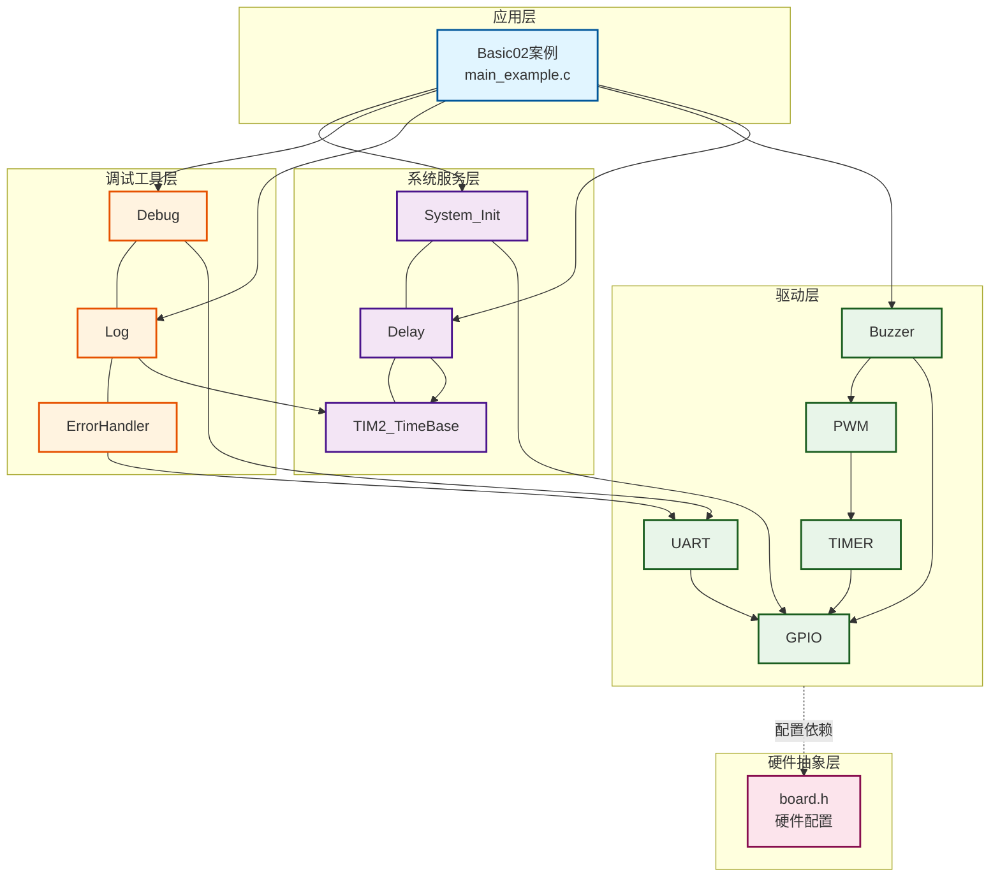
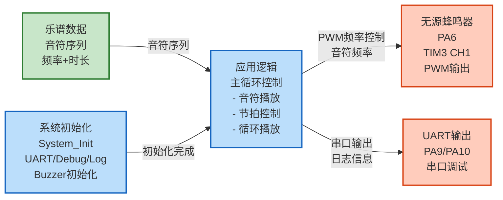
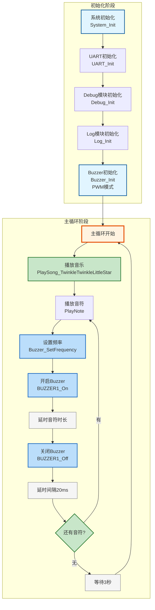

# Basic02 - 无源蜂鸣器播放完整音乐

## 📋 案例目的

- **核心目标**
  - 演示如何使用无源蜂鸣器播放一首完整的音乐

- **核心功能**：
- 完整音乐播放（播放《小星星》完整版，6段歌词）
- 音符频率控制（支持C3-C6音域的音符播放）
- 节拍控制（支持全音符、二分音符、四分音符、八分音符、十六分音符）
- 循环播放（播放完成后自动重复）

- **学习重点**：
  - 理解无源蜂鸣器PWM模式的工作原理
  - 掌握音符频率与PWM频率的对应关系
  - 学习如何将乐谱转换为代码实现
  - 学习节拍控制和音乐播放的实现方法
- **应用场景**：适用于需要播放音乐、音效提示、报警音等应用

---

## 🔧 硬件要求

### 必需外设

- **无源蜂鸣器**：
  - 正极：`PA6`（TIM3 CH1，PWM输出）
  - 负极：`GND`
  - **⚠️ 重要提示**：
    - **必须使用无源蜂鸣器**：无源蜂鸣器需要外部驱动信号，通过改变PWM频率控制音调
    - 有源蜂鸣器无法通过PWM控制频率，无法播放音乐
    - 如果使用有源蜂鸣器，请使用Basic01案例（GPIO模式）

### 硬件连接

| STM32F103C8T6 | 外设 | 说明 |
|--------------|------|------|
| PA6 | 无源蜂鸣器正极 | TIM3 CH1，PWM输出 |
| GND | 无源蜂鸣器负极 | 公共地 |
| 3.3V | VCC | 电源 |
| GND | GND | 地线 |

**⚠️ 重要提示**：

- 案例是独立工程，硬件配置在案例目录下的 `board.h` 中
- 如果硬件引脚不同，直接修改 `Examples/Basic/Basic02_PWM_PassiveBuzzer/board.h` 中的配置即可

### 硬件配置

**⚠️ 重要说明**：案例是独立工程，硬件配置在案例目录下的 `board.h` 中。
如果硬件引脚不同，直接修改 `Examples/Basic/Basic02_PWM_PassiveBuzzer/board.h` 中的配置即可。

**Buzzer配置**（PWM模式）：
```c
/* Buzzer统一配置表 */
#define BUZZER_CONFIGS { \
    {BUZZER_MODE_PWM, NULL, 0, 1, 0, Bit_RESET, 1},  /* PWM模式，TIM3(实例1)通道1，启用 */ \
}
```

**配置说明**：
- `mode`: `BUZZER_MODE_PWM`（PWM模式）
- `port`/`pin`: PWM模式下可为NULL和0（忽略）
- `pwm_instance`: 1表示TIM3（0=TIM1, 1=TIM3, 2=TIM4）
- `pwm_channel`: 0表示通道1（0=CH1, 1=CH2, 2=CH3, 3=CH4）
- `active_level`: `Bit_RESET`为低电平有效，`Bit_SET`为高电平有效
- `enabled`: 1表示启用该Buzzer，0表示禁用

**PWM配置**（已包含在board.h中）：
```c
/* PWM统一配置表 */
#define PWM_CONFIGS { \
    {TIM3, {{GPIOA, GPIO_Pin_6, 1}, {GPIOA, GPIO_Pin_0, 0}, {GPIOA, GPIO_Pin_0, 0}, {GPIOA, GPIO_Pin_0, 0}}, 1}, /* TIM3：PA6(CH1)，启用 */ \
}
```

**注意**：
- **必须使用无源蜂鸣器**，有源蜂鸣器无法通过PWM控制频率
- 根据实际硬件修改PWM引脚（`GPIO_Pin_6`等）
- 根据实际硬件修改PWM实例和通道（`pwm_instance`、`pwm_channel`）

---

## 📦 模块依赖

### 模块依赖关系图

展示本案例使用的模块及其依赖关系：



### 模块列表

本案例使用以下模块：

- **驱动层**：
  - `buzzer`：Buzzer驱动模块（核心功能，PWM模式）
  - `timer_pwm`：PWM驱动模块（Buzzer依赖）
  - `gpio`：GPIO驱动模块（PWM、UART依赖）
  - `uart`：UART驱动模块（串口调试，新项目必须）

- **系统服务层**：
  - `delay`：延时模块（用于实现时间间隔）
  - `system_init`：系统初始化模块

- **调试工具层**：
  - `debug`：Debug模块（printf重定向，新项目必须）
  - `log`：日志模块（分级日志系统，新项目必须）
  - `error_handler`：错误处理模块（统一错误处理，新项目必须）

### 模块使用说明

| 模块分类 | 模块名称 | 用途 | 依赖关系 |
|---------|---------|------|----------|
| **系统服务** | System_Init | 系统初始化 | 依赖GPIO、Delay |
| **系统服务** | Delay | 延时功能 | 依赖TIM2_TimeBase |
| **系统服务** | TIM2_TimeBase | 时间基准 | 无依赖 |
| **基础驱动** | GPIO | GPIO操作 | 依赖BSP配置 |
| **定时器驱动** | TIMER | 定时器基础 | 依赖GPIO |
| **定时器驱动** | PWM | PWM输出 | 依赖TIMER |
| **基础驱动** | Buzzer | 蜂鸣器控制 | 依赖PWM、GPIO |
| **通信驱动** | UART | 串口调试 | 依赖GPIO |
| **调试工具** | Debug | 调试输出 | 依赖UART |
| **调试工具** | Log | 日志系统 | 依赖ErrorHandler、TIM2_TimeBase |
| **调试工具** | ErrorHandler | 错误处理 | 无依赖 |

---

## 🔄 实现流程

### 整体逻辑

本案例通过以下步骤实现完整音乐播放：

1. **系统初始化**：初始化系统时钟、延时模块
2. **UART初始化**：初始化串口用于日志输出
3. **Buzzer初始化**：初始化PWM模式的Buzzer
4. **音乐播放**：按照乐谱顺序播放每个音符
5. **循环播放**：播放完成后等待3秒，自动重复

### 数据流向图

展示本案例的数据流向：乐谱数据 → 初始化 → 主循环 → 输出设备



**数据流说明**：

1. **乐谱数据**：
   - 音符序列：定义每个音符的频率和时长
   - 节拍定义：TEMPO定义每分钟拍数，计算各种音符的时长

2. **初始化阶段**：
   - 系统初始化：初始化GPIO、延时等基础功能
   - UART/Debug/Log初始化：建立串口调试通道
   - Buzzer初始化：初始化PWM模式Buzzer驱动

3. **应用逻辑**：
   - 主循环中按顺序播放每个音符
   - 根据音符频率设置PWM频率
   - 根据音符时长控制播放时间
   - 播放完成后等待3秒，循环播放

4. **输出设备**：
   - **无源蜂鸣器**：PWM控制，通过频率变化产生不同音调
   - **UART**：输出详细日志信息

### 关键方法

- **音符频率映射**：将音符（C3-C6）映射到对应的频率（Hz）
- **节拍控制**：通过延时控制每个音符的持续时间
- **音符播放函数**：`PlayNote()` 函数实现单个音符的播放
- **音乐播放函数**：`PlaySong_TwinkleTwinkleLittleStar()` 实现完整音乐播放

### 工作流程示意



---

## 📚 关键函数说明

### Buzzer相关函数

- **`Buzzer_Init()`**：初始化Buzzer驱动模块
  - 在本案例中用于初始化PWM模式的Buzzer
  - 根据配置表自动初始化所有enabled=1的Buzzer
  - 返回Buzzer_Status_t错误码，需要检查返回值

- **`Buzzer_SetFrequency()`**：设置Buzzer频率（PWM模式）
  - 在本案例中用于设置每个音符的频率
  - 参数：Buzzer编号、频率值（Hz）
  - 返回Buzzer_Status_t错误码，需要检查返回值

- **`BUZZER1_On()`** / **`BUZZER1_Off()`**：开启/关闭Buzzer（快捷宏）
  - 在本案例中用于控制音符的开始和结束

### 自定义函数

- **`PlayNote()`**：播放单个音符
  - 参数：频率（Hz）、持续时间（毫秒）
  - 频率为0时表示休止符
  - 自动处理音符间隔

- **`PlaySong_TwinkleTwinkleLittleStar()`**：播放《小星星》完整版
  - 按照乐谱顺序调用 `PlayNote()` 播放所有音符
  - 包含6段歌词的完整旋律

**详细函数实现和调用示例请参考**：`main_example.c` 中的代码

---

## ⚠️ 注意事项与重点

### ⚠️ 重要提示

1. **必须使用无源蜂鸣器**：PWM模式必须使用无源蜂鸣器，有源蜂鸣器无法通过PWM控制频率
2. **PWM配置正确性**：确保PWM实例和通道配置正确（TIM3 CH1对应PA6）
3. **初始化顺序**：必须严格按照 System_Init → UART → Debug → Log → Buzzer 的顺序初始化
4. **音符频率准确性**：确保音符频率定义准确，以获得正确的音调

### 🔑 关键点

1. **音符频率映射**：
   - C4 = 262 Hz（中央C）
   - 每个半音频率比约为 2^(1/12)
   - 标准音A4 = 440 Hz

2. **节拍控制**：
   - TEMPO定义每分钟的拍数
   - 四分音符时长 = 60000 / TEMPO（毫秒）
   - 其他音符时长按比例计算

3. **音符间隔**：
   - 每个音符播放后需要短暂间隔（20ms）
   - 避免音符粘连，保证音质

4. **音乐播放**：
   - 按照乐谱顺序播放每个音符
   - 支持休止符（频率为0）
   - 支持不同时长的音符

### 💡 调试技巧

1. **没有声音**：
   - 检查蜂鸣器类型（必须使用无源蜂鸣器）
   - 检查PWM配置是否正确（TIM3 CH1，PA6）
   - 检查Buzzer的enabled标志是否为1
   - 检查定时器模块是否已启用

2. **音调不正确**：
   - 检查音符频率定义是否正确
   - 检查系统时钟配置是否正确
   - 检查PWM频率设置是否在有效范围内

3. **节拍不准确**：
   - 检查TEMPO定义是否正确
   - 检查延时函数是否正常工作
   - 检查音符间隔是否合适

---

## 🔍 常见问题排查

### 蜂鸣器不响

- **可能原因**：
  - 使用了有源蜂鸣器（必须使用无源蜂鸣器）
  - Buzzer配置错误（PWM实例或通道配置错误）
  - PWM配置错误（引脚配置错误）
  - 模块未启用

- **解决方法**：
  - 确认使用无源蜂鸣器（需要外部驱动信号，可通过PWM控制频率）
  - 检查案例目录下的 `board.h` 中的Buzzer配置是否正确
  - 检查PWM实例和通道配置（`pwm_instance`、`pwm_channel`）
  - 检查PWM配置（`PWM_CONFIGS`）中的引脚是否正确（PA6）
  - 检查Buzzer的 `enabled` 标志是否为1
  - 检查定时器模块是否已启用（`CONFIG_MODULE_TIMER_ENABLED = 1`）

### 音调不正确

- **可能原因**：
  - 音符频率定义错误
  - 系统时钟配置错误
  - PWM频率设置超出有效范围

- **解决方法**：
  - 检查音符频率定义是否正确（C4=262Hz，A4=440Hz）
  - 检查系统时钟配置是否正确
  - 检查PWM频率设置是否在有效范围内（1Hz ~ 72MHz）

### 节拍不准确

- **可能原因**：
  - TEMPO定义错误
  - 延时函数不准确
  - 音符间隔不合适

- **解决方法**：
  - 检查TEMPO定义是否正确（每分钟拍数）
  - 检查延时函数是否正常工作
  - 检查音符间隔是否合适（建议20ms）

### 编译错误

- **可能原因**：
  - 缺少必要的头文件
  - 模块未启用
  - 函数调用错误

- **解决方法**：
  - 确保已包含必要的头文件
  - 确保 `System_Init()` 和 `Buzzer_Init()` 已正确调用
  - 确保Buzzer模块已启用（`CONFIG_MODULE_BUZZER_ENABLED = 1`）
  - 确保定时器模块已启用（`CONFIG_MODULE_TIMER_ENABLED = 1`）

---

## 💡 扩展练习

### 循序渐进理解本案例

1. **修改音乐**：将 `PlaySong_TwinkleTwinkleLittleStar()` 函数中的音符序列替换为其他简单的歌曲，理解音符序列与音乐旋律的对应关系
2. **调整节拍**：修改 `TEMPO` 宏定义，改变播放速度，观察不同节拍对音乐效果的影响
3. **添加更多音符**：扩展音符频率表，支持更多音域（如低音、高音），理解音符频率的计算方法

### 实际场景中的常见坑点

4. **音符间隔处理**：当快速切换音符频率时，如果PWM频率设置函数执行时间较长，可能导致音符播放不完整。如何处理这种情况，确保每个音符都能完整播放？
5. **节拍精度问题**：使用 `Delay_ms()` 实现的节拍控制精度有限，当TEMPO较高时，误差会累积。如何提高节拍精度，或者如何处理节拍误差的累积？
6. **内存占用优化**：如果播放更长的音乐，音符序列会占用大量内存。如何优化内存占用，比如使用压缩算法或者从外部存储读取乐谱？

---

## 📖 相关文档

- **模块文档**：
  - **Buzzer驱动**：`Drivers/basic/buzzer.c/h`
  - **PWM驱动**：`Drivers/timer/timer_pwm.c/h`
  - **GPIO驱动**：`Drivers/basic/gpio.c/h`
  - **UART驱动**：`Drivers/uart/uart.c/h`
  - **Debug模块**：`Debug/debug.c/h`
  - **Log模块**：`Debug/log.c/h`
  - **ErrorHandler模块**：`Common/error_handler.c/h`
  - **延时功能**：`System/delay.c/h`
  - **系统初始化**：`System/system_init.c/h`

- **业务文档**：
  - **主程序代码**：`Examples/Basic/Basic02_PWM_PassiveBuzzer/main_example.c`
  - **硬件配置**：`Examples/Basic/Basic02_PWM_PassiveBuzzer/board.h`
  - **模块配置**：`Examples/Basic/Basic02_PWM_PassiveBuzzer/config.h`
  - **项目规范文档**：`../../AI/README.md`（AI规则体系）
  - **案例参考**：`Examples/README.md`

---

## 📝 更新日志

- **2024-01-01**：
  - 初始版本，包含PWM模式Buzzer音乐播放示例
  - 演示完整音乐播放、音符频率控制、节拍控制
  - 集成UART、Debug、Log、ErrorHandler等基础模块
