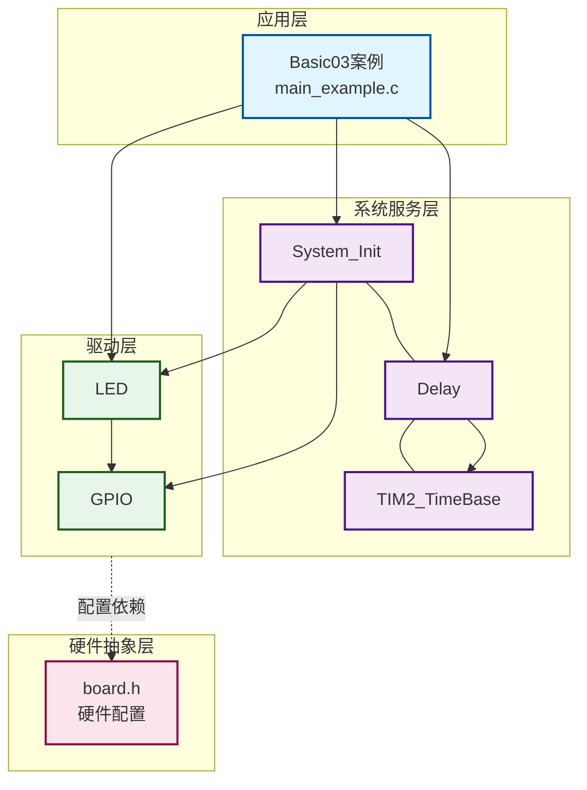
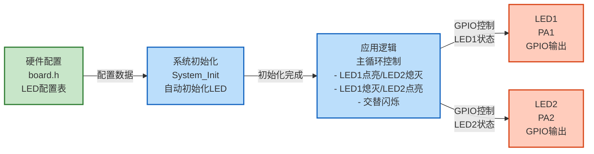
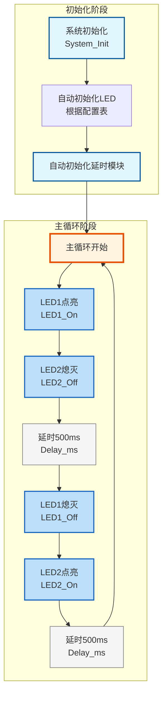

# Basic03 - LED交替闪烁示例

## 📋 案例目的

- **核心目标**
  - 演示如何使用LED驱动模块控制两个LED交替闪烁，学习LED驱动的基本使用方法

- **学习重点**：
  - 理解LED驱动模块的基本使用方法
  - 掌握LED快捷宏的使用（LED1_On、LED1_Off等）
  - 学习系统初始化和延时功能的使用
  - 了解LED配置表的使用方法
  - 学习简单的循环控制逻辑
- **应用场景**：适用于需要LED状态指示的应用，如系统运行指示、状态提示、简单的视觉效果等

---

## 🔧 硬件要求

### 必需外设

- **LED1**：`PA1`（第一个LED）
- **LED2**：`PA2`（第二个LED）

### 硬件连接

| STM32F103C8T6 | LED | 说明 |
|--------------|-----|------|
| PA1 | LED1正极 | LED1负极接GND |
| PA2 | LED2正极 | LED2负极接GND |
| GND | LED负极 | 共地 |

**⚠️ 重要提示**：
- 案例是独立工程，硬件配置在案例目录下的 `board.h` 中
- 如果硬件引脚不同，直接修改 `Examples/Basic/Basic03_blink/board.h` 中的配置即可

### 硬件配置

**LED配置**（在 `board.h` 中）：
```c
/* LED统一配置表 */
#define LED_CONFIGS { \
    {GPIOA, GPIO_Pin_1, Bit_RESET, 1},  /* LED1：PA1，低电平点亮，启用 */ \
    {GPIOA, GPIO_Pin_2, Bit_RESET, 1},  /* LED2：PA2，低电平点亮，启用 */ \
}
```

**配置说明**：
- `port`/`pin`：指定端口和引脚（GPIOA, GPIO_Pin_1）
- `active_level`：`Bit_RESET`为低电平有效，`Bit_SET`为高电平有效
- `enabled`：1表示启用该LED，0表示禁用

**注意**：
- 根据实际硬件修改引脚（`GPIO_Pin_1`、`GPIO_Pin_2`）
- 根据实际硬件修改有效电平（`Bit_RESET`/`Bit_SET`）

---

## 📦 模块依赖

### 模块依赖关系图

展示本案例使用的模块及其依赖关系：



### 模块列表

- `led`：LED驱动模块（核心功能）
- `gpio`：GPIO驱动模块（LED依赖）
- `delay`：延时模块（用于实现闪烁间隔）
- `system_init`：系统初始化模块
- `base_timer`：基时定时器模块（delay依赖）

### 模块使用说明

| 模块分类 | 模块名称 | 用途 | 依赖关系 |
|---------|---------|------|----------|
| **系统服务** | System_Init | 系统初始化 | 依赖GPIO、LED、Delay |
| **系统服务** | Delay | 延时功能 | 依赖TIM2_TimeBase |
| **系统服务** | TIM2_TimeBase | 时间基准 | 无依赖 |
| **基础驱动** | GPIO | GPIO操作 | 依赖BSP配置 |
| **基础驱动** | LED | LED控制 | 依赖GPIO |

---

## 🔄 实现流程

### 整体逻辑

本案例通过LED1和LED2交替闪烁，演示LED驱动的基本使用方法。程序流程非常简单：

1. **初始化阶段**
   - 系统初始化（自动初始化LED和延时模块）

2. **主循环**
   - LED1点亮，LED2熄灭，延时500ms
   - LED1熄灭，LED2点亮，延时500ms
   - 循环执行

### 数据流向图

展示本案例的数据流向：配置数据 → 初始化 → 主循环 → 输出设备



**数据流说明**：

1. **配置数据**：
   - **硬件配置**（`board.h`）：LED配置表定义GPIO引脚、有效电平等参数

2. **初始化阶段**：
   - 系统初始化：自动初始化所有enabled=1的LED

3. **应用逻辑**：
   - 主循环中交替控制两个LED的状态
   - 通过延时控制闪烁频率

4. **输出设备**：
   - **LED1**：GPIO控制，交替闪烁
   - **LED2**：GPIO控制，交替闪烁

### 关键方法

- **LED快捷宏**：使用LED1_On()、LED1_Off()等快捷宏，简化代码
- **交替闪烁**：通过控制两个LED的状态，实现交替闪烁效果
- **延时控制**：使用Delay_ms()控制闪烁间隔

### 工作流程示意



---

## 📚 关键函数说明

### LED相关函数

- **`LED1_On()`**：开启LED1（快捷宏）
  - 在本案例中用于点亮LED1
  - 是LED驱动的快捷宏，简化代码

- **`LED1_Off()`**：关闭LED1（快捷宏）
  - 在本案例中用于熄灭LED1
  - 是LED驱动的快捷宏，简化代码

- **`LED2_On()`** / **`LED2_Off()`**：LED2控制函数（快捷宏）
  - 在本案例中用于控制LED2的状态
  - 实现与LED1的交替闪烁

### 延时相关函数

- **`Delay_ms()`**：毫秒级延时函数
  - 在本案例中用于实现LED闪烁的时间间隔（500ms）
  - 控制LED闪烁频率

### 系统初始化函数

- **`System_Init()`**：系统初始化函数
  - 在本案例中用于初始化SysTick延时模块和LED驱动
  - 自动初始化所有enabled=1的LED

**详细函数实现和调用示例请参考**：`main_example.c` 中的代码

---

## ⚠️ 注意事项与重点

### ⚠️ 重要提示

1. **硬件配置**：
   - 案例是独立工程，硬件配置在案例目录下的 `board.h` 中
   - 如果硬件引脚不同，需要修改 `board.h` 中的配置

2. **LED有效电平**：
   - 根据实际硬件选择有效电平（`Bit_RESET`为低电平有效，`Bit_SET`为高电平有效）
   - 如果LED不亮，检查有效电平配置是否正确

3. **LED使能标志**：
   - `enabled` 为1表示启用该LED，为0表示禁用
   - 禁用的LED不会被初始化

4. **闪烁频率**：
   - 通过修改 `Delay_ms()` 的参数可以改变闪烁频率
   - 当前设置为500ms间隔

### 🔑 关键点

1. **LED快捷宏**：
   - 使用LED1_On()、LED1_Off()等快捷宏，代码更简洁
   - 也可以使用LED_On()、LED_Off()函数，需要传入LED编号

2. **交替闪烁逻辑**：
   - 通过控制两个LED的状态，实现交替闪烁
   - 一个LED点亮时，另一个LED熄灭

3. **系统初始化**：
   - System_Init()会自动初始化所有enabled=1的LED
   - 无需手动调用LED_Init()

### 💡 调试技巧

1. **LED不亮排查**：
   - 检查 `board.h` 中的LED配置是否正确
   - 检查LED引脚是否与硬件连接一致
   - 检查LED有效电平配置
   - 检查LED的 `enabled` 标志是否为1

2. **闪烁频率不对**：
   - 检查延时时间是否正确
   - 检查系统时钟配置

---

## 🔍 常见问题排查

### LED不亮

- **可能原因**：
  - LED配置错误（引脚、有效电平配置错误）
  - LED未启用（enabled标志为0）
  - 硬件连接错误

- **解决方法**：
  - 检查 `board.h` 中的LED配置是否正确
  - 检查LED引脚是否与硬件连接一致
  - 检查LED有效电平配置（`Bit_RESET`/`Bit_SET`）
  - 检查LED的 `enabled` 标志是否为1

### 闪烁频率不对

- **可能原因**：
  - 延时时间设置错误
  - 系统时钟配置错误

- **解决方法**：
  - 检查延时时间是否正确
  - 检查系统时钟配置是否正确

### 编译错误

- **可能原因**：
  - 缺少必要的头文件
  - 模块未启用

- **解决方法**：
  - 确保已包含必要的头文件
  - 确保 `System_Init()` 已正确调用
  - 确保LED模块已启用（`CONFIG_MODULE_LED_ENABLED = 1`）

---

## 💡 扩展练习

### 循序渐进理解本案例

1. **修改闪烁频率**：修改 `Delay_ms()` 的参数，改变闪烁频率（如100ms、1000ms等），观察LED闪烁效果的变化
2. **同时闪烁**：让两个LED同时点亮/熄灭，实现同步闪烁效果
3. **流水灯效果**：添加更多LED（LED3、LED4等），实现流水灯效果（LED1→LED2→LED3→LED4→LED1...）

### 实际场景中的常见坑点

4. **延时阻塞问题**：使用 `Delay_ms()` 会阻塞主循环，如果需要在闪烁的同时处理其他任务（如按键检测），如何实现非阻塞的LED控制？
5. **LED状态同步**：如果多个地方同时控制同一个LED（如主循环和中断），可能导致状态不一致。如何保证LED状态的同步和一致性？
6. **闪烁频率精度**：当需要精确控制闪烁频率时，`Delay_ms()` 的精度可能不够。如何实现更高精度的定时控制，或者如何处理频率误差？

---

## 📖 相关文档

- **模块文档**：
  - **LED驱动**：`Drivers/basic/led.c/h`
  - **GPIO驱动**：`Drivers/basic/gpio.c/h`
  - **延时功能**：`System/delay.c/h`
  - **系统初始化**：`System/system_init.c/h`
  - **基时定时器**：`Drivers/timer/TIM2_TimeBase.c/h`

- **业务文档**：
  - **主程序代码**：`Examples/Basic/Basic03_blink/main_example.c`
  - **硬件配置**：`Examples/Basic/Basic03_blink/board.h`
  - **模块配置**：`Examples/Basic/Basic03_blink/config.h`
  - **项目规范文档**：`PROJECT_KEYWORDS.md`
  - **案例参考**：`Examples/README.md`

---

## 📝 更新日志

- **2024-01-01**：
  - 初始版本，包含LED交替闪烁示例
  - 演示LED驱动的基本使用方法
  - 集成系统初始化和延时功能
