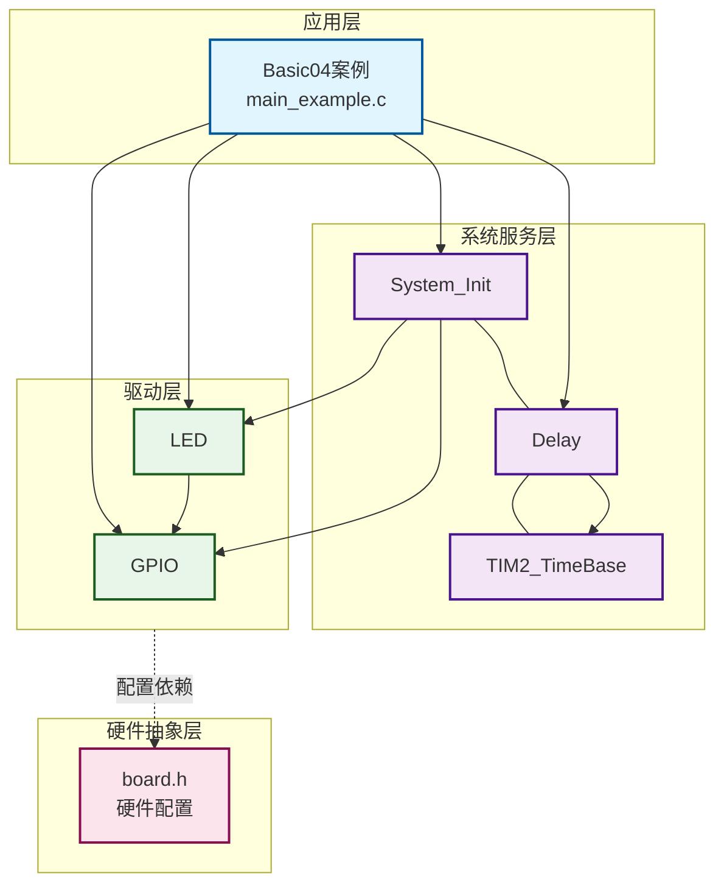
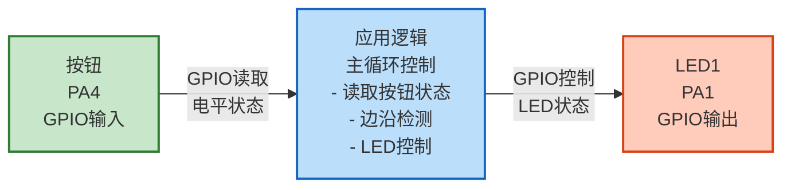
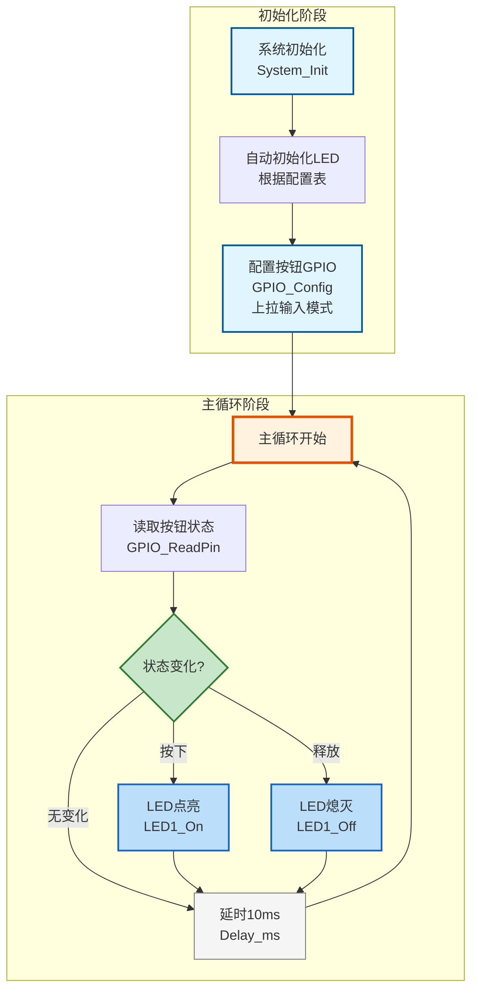

# Basic04 - 按钮控制LED示例

## 📋 案例目的

- **核心目标**
  - 演示GPIO输入模式的使用，实现按钮控制LED的开关

- **学习重点**：
  - GPIO输入模式的配置（上拉输入）
  - GPIO引脚电平读取方法
  - 按钮状态检测和消抖处理
  - LED控制与按钮状态联动
  - 边沿检测（按下/释放检测）
- **应用场景**：适用于需要按键输入控制输出设备的场景，如开关控制、模式切换等

---

## 🔧 硬件要求

### 必需外设

- **LED1**：连接到PA1
  - LED正极通过限流电阻连接到PA1
  - LED负极连接到GND
  - 低电平点亮（根据LED_CONFIGS配置）

- **按钮**：连接到PA4
  - 按钮一端连接到PA4
  - 按钮另一端连接到GND
  - 使用上拉输入模式，按下时为低电平

### 硬件连接

**LED连接**：
- LED正极 → 限流电阻（220Ω-1kΩ） → PA1
- LED负极 → GND

**按钮连接**：
- 按钮一端 → PA4
- 按钮另一端 → GND

### 硬件配置

**⚠️ 重要说明**：案例是独立工程，硬件配置在案例目录下的 `board.h` 中。
如果硬件引脚不同，直接修改 `Examples/Basic/Basic04_ButtonControlLED/board.h` 中的配置即可。

**LED配置**：
```c
/* LED统一配置表 */
#define LED_CONFIGS { \
    {GPIOA, GPIO_Pin_1, Bit_RESET, 1},  /* LED1：PA1，低电平点亮，启用 */ \
}
```

**按钮配置**：
```c
/* 按钮引脚定义 */
#define BUTTON_PORT  GPIOA   /* 按钮GPIO端口 */
#define BUTTON_PIN   GPIO_Pin_4  /* 按钮GPIO引脚（PA4） */
```

**配置说明**：
- LED配置：`port`/`pin`指定端口和引脚，`active_level`为`Bit_RESET`表示低电平点亮
- 按钮配置：使用上拉输入模式，按下时引脚为低电平（`Bit_RESET`），未按下时为高电平（`Bit_SET`）
- 如果硬件连接不同，修改对应的端口和引脚号即可

---

## 📦 模块依赖

### 模块依赖关系图

展示本案例使用的模块及其依赖关系：



### 模块列表

- **GPIO模块**：用于配置按钮输入引脚和LED输出引脚
- **LED模块**：用于控制LED的开关
- **延时模块**：用于消抖和降低CPU占用率
- **系统初始化模块**：用于初始化系统基础功能

### 模块使用说明

| 模块分类 | 模块名称 | 用途 | 依赖关系 |
|---------|---------|------|----------|
| **系统服务** | System_Init | 系统初始化 | 依赖GPIO、LED、Delay |
| **系统服务** | Delay | 延时功能 | 依赖TIM2_TimeBase |
| **系统服务** | TIM2_TimeBase | 时间基准 | 无依赖 |
| **基础驱动** | GPIO | GPIO操作 | 依赖BSP配置 |
| **基础驱动** | LED | LED控制 | 依赖GPIO |

---

## 🔄 实现流程

### 整体逻辑

1. **系统初始化阶段**：
   - 调用 `System_Init()` 初始化系统基础功能（SysTick、延时模块）
   - 自动初始化LED驱动（根据配置表初始化所有启用的LED）

2. **GPIO配置阶段**：
   - 配置按钮引脚为输入上拉模式
   - 上拉输入模式下，按钮未按下时引脚为高电平，按下时为低电平

3. **主循环阶段**：
   - 循环读取按钮引脚电平
   - 检测按钮状态变化（边沿检测）
   - 按钮按下时点亮LED，按钮释放时熄灭LED
   - 延时10ms用于消抖和降低CPU占用率

### 数据流向图

展示本案例的数据流向：输入设备 → 处理 → 输出设备



**数据流说明**：

1. **输入设备**：
   - **按钮**（PA4）：通过GPIO输入模式读取按钮状态

2. **应用逻辑**：
   - 主循环中读取按钮引脚电平
   - 通过边沿检测判断按钮按下/释放事件
   - 根据按钮状态控制LED

3. **输出设备**：
   - **LED1**：GPIO控制，按钮按下时点亮，释放时熄灭

### 关键方法

1. **GPIO输入配置**：使用 `GPIO_Config()` 配置按钮引脚为上拉输入模式
2. **电平读取**：使用 `GPIO_ReadPin()` 读取按钮引脚当前电平
3. **边沿检测**：通过比较当前状态和上次状态，检测按钮按下/释放事件
4. **LED控制**：使用 `LED1_On()` 和 `LED1_Off()` 控制LED状态
5. **消抖处理**：通过延时10ms降低CPU占用率，同时起到一定的消抖作用

### 工作流程示意



---

## 📚 关键函数说明

### GPIO相关函数

- **`GPIO_Config()`**：配置GPIO引脚的模式和速度
  - 在本案例中用于配置按钮引脚为上拉输入模式（`GPIO_MODE_INPUT_PULLUP`）
  - 上拉输入模式：按钮未按下时引脚为高电平，按下时为低电平
  - 速度参数对输入模式影响不大，使用`GPIO_SPEED_2MHz`即可

- **`GPIO_ReadPin()`**：读取GPIO引脚当前电平
  - 在本案例中用于读取按钮引脚的电平状态
  - 返回值：`Bit_SET`（高电平）或`Bit_RESET`（低电平）
  - 上拉输入模式下，未按下返回`Bit_SET`，按下返回`Bit_RESET`

### LED相关函数

- **`LED1_On()`**：点亮LED1
  - 在本案例中用于按钮按下时点亮LED
  - 自动处理有效电平（根据配置表自动判断高电平有效或低电平有效）

- **`LED1_Off()`**：熄灭LED1
  - 在本案例中用于按钮释放时熄灭LED
  - 自动处理有效电平

### 系统相关函数

- **`System_Init()`**：系统初始化函数
  - 在本案例中用于初始化系统基础功能（SysTick、延时模块、LED驱动）
  - 自动初始化所有启用的LED（根据配置表）

- **`Delay_ms()`**：毫秒级延时函数
  - 在本案例中用于延时10ms，降低CPU占用率并起到一定的消抖作用
  - 阻塞式延时，执行期间CPU不处理其他任务

**详细函数实现和调用示例请参考**：`main_example.c` 中的代码

---

## ⚠️ 注意事项与重点

### ⚠️ 重要提示

1. **按钮连接方式**：本案例使用上拉输入模式，按钮按下时连接到GND，未按下时引脚被上拉至高电平
2. **边沿检测**：通过比较当前状态和上次状态实现边沿检测，避免重复触发
3. **消抖处理**：本案例使用简单的延时消抖，实际应用中可能需要更复杂的消抖算法
4. **硬件配置**：如果硬件引脚不同，必须修改案例目录下的 `board.h` 中的配置
5. **有效电平**：LED的有效电平配置必须与硬件连接匹配（高电平有效/低电平有效）

### 🔑 关键点

1. **GPIO输入模式选择**：上拉输入模式适合按钮按下时连接到GND的场景
2. **边沿检测逻辑**：通过保存上次状态，比较当前状态和上次状态，检测状态变化
3. **消抖处理**：简单的延时消抖可以降低CPU占用率，但可能无法完全消除抖动
4. **状态保存**：使用静态变量或全局变量保存上次按钮状态，用于边沿检测
5. **延时时间选择**：10ms延时既能降低CPU占用率，又能起到一定的消抖作用

### 💡 调试技巧

1. **按钮不响应**：
   - 检查按钮连接是否正确（一端接PA4，另一端接GND）
   - 检查GPIO配置是否正确（上拉输入模式）
   - 使用万用表测量按钮按下时PA4引脚是否为低电平

2. **LED不亮**：
   - 检查LED连接是否正确（正极通过限流电阻接PA1，负极接GND）
   - 检查LED配置是否正确（有效电平、引脚号）
   - 检查LED的`enabled`标志是否为1

3. **按钮状态不稳定**：
   - 增加延时时间（如改为20ms或50ms）
   - 检查按钮硬件是否有问题
   - 考虑使用更复杂的消抖算法（如多次采样）

---

## 🔍 常见问题排查

### 按钮不响应

- **可能原因**：
  - 按钮连接错误（一端接PA4，另一端接GND）
  - GPIO配置错误（未配置为上拉输入模式）
  - 按钮硬件故障

- **解决方法**：
  - 检查按钮连接是否正确
  - 检查GPIO配置是否正确（`GPIO_MODE_INPUT_PULLUP`）
  - 使用万用表测量按钮按下时PA4引脚是否为低电平

### LED不亮

- **可能原因**：
  - LED连接错误
  - LED配置错误（有效电平、引脚号）
  - LED未启用

- **解决方法**：
  - 检查LED连接是否正确（正极通过限流电阻接PA1，负极接GND）
  - 检查LED配置是否正确（`board.h`中的LED_CONFIGS）
  - 检查LED的`enabled`标志是否为1

### 按钮状态不稳定

- **可能原因**：
  - 消抖时间过短
  - 按钮硬件问题

- **解决方法**：
  - 增加延时时间（如改为20ms或50ms）
  - 检查按钮硬件是否有问题
  - 考虑使用更复杂的消抖算法（如多次采样）

---

## 💡 扩展练习

### 循序渐进理解本案例

1. **修改控制逻辑**：改为按钮按下时熄灭LED，释放时点亮LED，理解GPIO输入读取和LED控制的联动关系
2. **添加多个按钮**：添加第二个按钮，实现不同的控制功能（如一个按钮控制LED1，另一个控制LED2），理解多输入处理
3. **改进消抖算法**：实现多次采样消抖算法，提高按钮检测的可靠性，理解软件消抖的原理

### 实际场景中的常见坑点

4. **消抖时间选择**：消抖时间设置过短会导致误触发，设置过长会导致响应延迟。如何根据实际按钮特性选择合适的消抖时间？如何处理不同按钮的不同特性？
5. **按钮状态丢失**：如果主循环执行时间较长，可能错过按钮的快速按下/释放。如何确保不丢失按钮状态变化？使用中断方式是否一定能解决这个问题？
6. **多按钮冲突**：当多个按钮同时按下时，如何处理优先级和冲突？如何实现按钮组合功能（如同时按下两个按钮触发特殊功能）？

---

## 📖 相关文档

- **模块文档**：
  - **LED驱动**：`Drivers/basic/led.c/h`
  - **GPIO驱动**：`Drivers/basic/gpio.c/h`
  - **延时功能**：`System/delay.c/h`
  - **系统初始化**：`System/system_init.c/h`

- **业务文档**：
  - **主程序代码**：`Examples/Basic/Basic04_ButtonControlLED/main_example.c`
  - **硬件配置**：`Examples/Basic/Basic04_ButtonControlLED/board.h`
  - **模块配置**：`Examples/Basic/Basic04_ButtonControlLED/config.h`
  - **项目规范文档**：`../../AI/README.md`（AI规则体系）
  - **案例参考**：`Examples/README.md`

---

## 📝 更新日志

- **2024-01-01**：
  - 初始版本，包含按钮控制LED示例
  - 演示GPIO输入模式、边沿检测、LED控制
