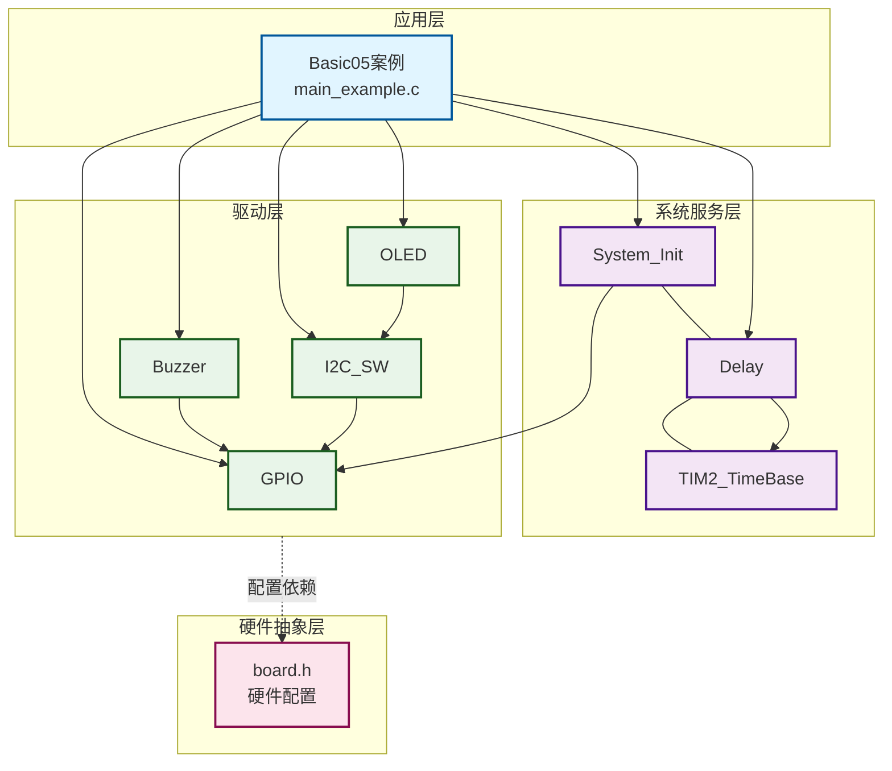
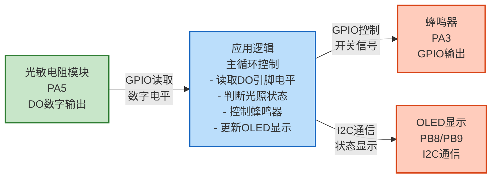
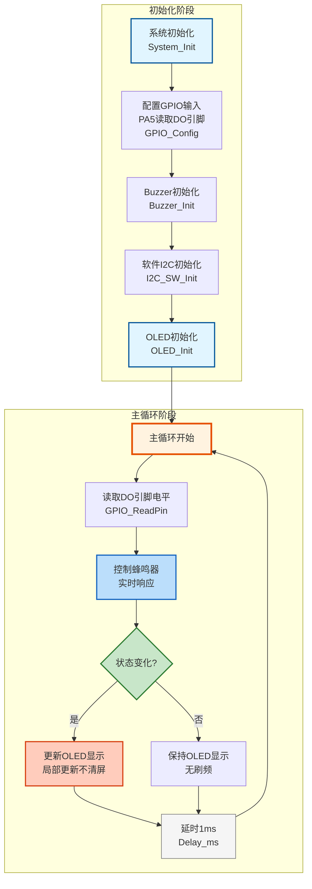

# Basic05 - 光敏电阻控制蜂鸣器示例

## 📋 案例目的

- **核心目标**
  - 演示如何使用GPIO读取光敏电阻DO（数字输出）引脚的电平，并根据光照状态实时控制蜂鸣器

- **学习重点**：
- GPIO输入模式的使用方法（读取数字信号）
- 光敏电阻模块DO引脚的工作原理和电平读取
- 根据传感器状态实时控制执行器（蜂鸣器）
- 非阻塞式编程在传感器应用中的使用
- OLED显示优化（只在状态变化时更新，避免刷频）

- **应用场景**：
  - 光照检测和报警系统
  - 自动照明控制系统
  - 环境监测设备
  - 传感器与执行器联动应用

---

## 🔧 硬件要求

### 必需外设

- **STM32F103C8T6开发板**
- **光敏电阻模块**（四引脚模块）
  - 光敏电阻模块VCC连接到3.3V（正极，已连接）
  - 光敏电阻模块GND连接到GND（负极，已连接）
  - 光敏电阻模块DO（数字输出）连接到PA5（GPIO输入）
  - 光敏电阻模块AO（模拟输出）不需要连接（可用于其他用途）
  - **⚠️ 重要提示**：使用DO引脚输出数字信号，光照暗时输出高电平，光照亮时输出低电平
- **Buzzer（三引脚有源蜂鸣器模块）**
  - Buzzer模块VCC连接到3.3V（正极已连接）
  - Buzzer模块GND连接到GND（负极已连接）
  - Buzzer模块控制引脚（中间引脚，通常标记为SIG或IN）连接到PA3
- **OLED显示屏（SSD1306，I2C接口）**
  - SCL连接到PB8
  - SDA连接到PB9
  - VCC连接到3.3V
  - GND连接到GND

### 硬件连接

**光敏电阻连接**（四引脚光敏电阻模块）：
- 光敏电阻模块VCC → 3.3V（正极，已连接）
- 光敏电阻模块GND → GND（负极，已连接）
- 光敏电阻模块DO（数字输出） → PA5（GPIO输入）
- 光敏电阻模块AO（模拟输出） → 不连接（可用于其他用途）

**Buzzer连接**（三引脚有源蜂鸣器模块）：
- Buzzer模块VCC → 3.3V（正极，已连接）
- Buzzer模块GND → GND（负极，已连接）
- Buzzer模块控制引脚（中间引脚，SIG/IN） → PA3

**OLED连接**：
- SCL → PB8
- SDA → PB9
- VCC → 3.3V
- GND → GND

### 硬件配置

**⚠️ 重要说明**：案例是独立工程，硬件配置在案例目录下的 `board.h` 中。
如果硬件引脚不同，直接修改 `Examples/Basic/Basic05_PhotoresistorControlBuzzer/board.h` 中的配置即可。

**光敏电阻DO引脚配置**：
```c
/* 光敏电阻DO（数字输出）引脚配置 */
/* 注意：四引脚光敏电阻模块，VCC和GND已连接，DO（数字输出）连接到PA5 */
#define PHOTO_DO_PORT  GPIOA
#define PHOTO_DO_PIN   GPIO_Pin_5
```

**Buzzer配置**（GPIO模式）：
```c
/* Buzzer统一配置表 */
/* 注意：三引脚有源蜂鸣器模块，VCC和GND已连接，控制引脚（中间引脚，SIG/IN）连接到PA3 */
#define BUZZER_CONFIGS { \
    {BUZZER_MODE_GPIO, GPIOA, GPIO_Pin_3, 0, 0, Bit_RESET, 1},  /* GPIO模式，PA3（控制引脚），低电平有效，启用 */ \
}
```

**配置说明**：
- PA5引脚配置为GPIO输入上拉模式（连接光敏电阻模块DO输出）
- 四引脚光敏电阻模块：VCC和GND已连接，只需连接DO（数字输出）到PA5
  - 光照暗时DO输出高电平，光照亮时DO输出低电平
- Buzzer使用GPIO模式，PA3引脚（控制引脚），低电平有效
- 三引脚有源蜂鸣器模块：VCC和GND已连接，只需连接控制引脚（中间引脚，SIG/IN）到PA3
- 根据实际硬件修改引脚配置

---

## 📦 模块依赖

### 模块依赖关系图

展示本案例使用的模块及其依赖关系：



### 模块列表

本案例使用以下模块：

- **GPIO模块**（`Drivers/basic/gpio.c/h`）：读取光敏电阻DO引脚的数字电平
- **Buzzer模块**（`Drivers/basic/buzzer.c/h`）：控制蜂鸣器
- **OLED模块**（`Drivers/display/oled_ssd1306.c/h`）：显示光照状态和蜂鸣器状态
- **软件I2C模块**（`Drivers/i2c/i2c_sw.c/h`）：OLED通信接口
- **延时模块**（`System/delay.c/h`）：延时和时间管理
- **系统初始化模块**（`System/system_init.c/h`）：系统初始化

### 模块使用说明

| 模块分类 | 模块名称 | 用途 | 依赖关系 |
|---------|---------|------|----------|
| **系统服务** | System_Init | 系统初始化 | 依赖GPIO、Delay |
| **系统服务** | Delay | 延时功能 | 依赖TIM2_TimeBase |
| **系统服务** | TIM2_TimeBase | 时间基准 | 无依赖 |
| **基础驱动** | GPIO | GPIO操作 | 依赖BSP配置 |
| **基础驱动** | Buzzer | 蜂鸣器控制 | 依赖GPIO |
| **通信驱动** | I2C_SW | 软件I2C | 依赖GPIO |
| **显示驱动** | OLED_SSD1306 | OLED显示 | 依赖I2C_SW |

---

## 🔄 实现流程

### 整体逻辑

1. **系统初始化阶段**：
   - 调用 `System_Init()` 初始化系统基础模块
   - 配置光敏电阻DO引脚为GPIO输入上拉模式
   - 初始化Buzzer模块（控制蜂鸣器）
   - 初始化软件I2C和OLED（显示状态）

2. **主循环阶段**（非阻塞式）：
   - 读取DO引脚电平（光敏电阻数字输出，1ms间隔）
   - 实时控制蜂鸣器：高电平（光照暗）时立即开启，低电平（光照亮）时立即关闭
   - 只在状态变化时更新OLED显示（避免刷频，显示更流畅）
   - 延时1ms后继续循环

### 数据流向图

展示本案例的数据流向：输入设备 → 处理 → 输出设备



**数据流说明**：

1. **输入设备**：
   - **光敏电阻模块**（PA5）：通过DO引脚输出数字信号，光照暗时输出高电平，光照亮时输出低电平

2. **应用逻辑**：
   - 主循环中读取DO引脚电平
   - 根据电平判断光照状态
   - 实时控制蜂鸣器状态
   - 只在状态变化时更新OLED显示

3. **输出设备**：
   - **蜂鸣器**：GPIO控制，光照暗时开启，光照亮时关闭
   - **OLED**：显示当前光照状态和蜂鸣器状态

### 关键方法

1. **GPIO电平读取**：使用 `GPIO_ReadPin()` 读取光敏电阻DO引脚的数字电平
2. **光照状态判断**：根据DO引脚电平判断光照状态（高电平=光照暗，低电平=光照亮）
3. **蜂鸣器控制**：光照暗（高电平）时开启蜂鸣器，光照亮（低电平）时关闭蜂鸣器
4. **状态显示**：在OLED上实时显示光照状态和蜂鸣器状态

### 工作流程示意



---

## 📚 关键函数说明

### GPIO相关函数

- **`GPIO_Config()`**：配置GPIO引脚模式
  - 在本案例中用于配置PA5为输入上拉模式，读取光敏电阻DO引脚电平
  - 上拉输入模式：光照亮时DO输出低电平，光照暗时DO输出高电平
  - 必须在读取引脚电平之前调用

- **`GPIO_ReadPin()`**：读取GPIO引脚电平
  - 在本案例中用于读取光敏电阻DO引脚的电平（PA5）
  - 返回 `Bit_SET`（高电平）或 `Bit_RESET`（低电平）
  - 光照暗时返回 `Bit_SET`（高电平），光照亮时返回 `Bit_RESET`（低电平）

### Buzzer相关函数

- **`Buzzer_Init()`**：初始化Buzzer驱动
  - 在本案例中用于初始化GPIO模式的蜂鸣器
  - 根据board.h中的配置自动初始化所有启用的Buzzer
  - 必须在控制Buzzer之前调用

- **`BUZZER1_On()`**：开启Buzzer
  - 在本案例中用于光照暗时开启蜂鸣器
  - 立即响应，不阻塞主循环

- **`BUZZER1_Off()`**：关闭Buzzer
  - 在本案例中用于光照亮时关闭蜂鸣器
  - 立即响应，不阻塞主循环

### 延时相关函数

- **`Delay_ms()`**：毫秒级精确延时（阻塞式）
  - 在本案例中用于主循环延时，降低CPU占用率
  - 阻塞式函数，延时期间CPU不处理其他任务

### OLED相关函数

- **`OLED_Init()`**：初始化OLED显示屏
  - 在本案例中用于初始化OLED显示，显示光照状态和蜂鸣器状态
  - 需要先初始化软件I2C模块

- **`OLED_Clear()`**：清屏
  - 在本案例中仅在首次显示时使用，后续使用局部更新避免刷频

- **`OLED_ShowString()`**：显示字符串
  - 在本案例中用于显示状态文本（如"Status: Bright"、"Buzzer: ON"等）
  - 只在状态变化时调用，实现局部更新，避免刷频

**详细函数实现和调用示例请参考**：`main_example.c` 中的代码

---

## ⚠️ 注意事项与重点

### ⚠️ 重要提示

1. **光敏电阻连接**：四引脚光敏电阻模块，VCC和GND已连接，只需连接DO（数字输出）引脚到PA5。模块内部已处理好阈值比较，直接输出数字信号。光照暗时DO输出高电平，光照亮时DO输出低电平。
2. **DO引脚电平**：DO引脚输出数字信号，光照暗时输出高电平（Bit_SET），光照亮时输出低电平（Bit_RESET）。
3. **控制逻辑**：光照暗（高电平）时蜂鸣器响，光照亮（低电平）时蜂鸣器不响。
4. **OLED显示**：OLED用于显示实时状态，如果不需要显示可以注释掉OLED相关代码。

### 🔑 关键点

1. **GPIO配置**：配置PA5为输入上拉模式，用于读取光敏电阻DO引脚电平。
2. **实时响应**：蜂鸣器控制不阻塞，每次循环都检查并立即响应，响应时间约1ms。
3. **OLED优化**：只在状态变化时更新OLED显示，使用局部更新不清屏，避免刷频感。
4. **非阻塞式编程**：主循环延时仅1ms，保证快速响应，OLED更新不阻塞主循环。
5. **状态检测**：通过比较当前状态和上次状态，只在变化时更新显示，提高效率。

### 💡 调试技巧

1. **DO引脚电平观察**：通过OLED观察光照状态，确认光敏电阻工作正常。
2. **阈值调整**：如果光敏电阻模块有灵敏度调节电位器，可以调整触发阈值。
3. **硬件检查**：
   - 如果状态始终不变，检查光敏电阻模块DO引脚是否连接到PA5
   - 确认光敏电阻模块VCC和GND已正确连接
   - 检查光敏电阻模块是否正常工作（可用万用表测量DO引脚电压，光照暗时应为高电平，光照亮时应为低电平）

---

## 🔍 常见问题排查

### 光敏电阻无响应

- **可能原因**：
  - DO引脚连接错误
  - GPIO配置错误
  - 光敏电阻模块故障

- **解决方法**：
  - 检查DO引脚是否连接到PA5
  - 检查GPIO配置是否正确（上拉输入模式）
  - 检查光敏电阻模块VCC和GND连接
  - 使用万用表测量DO引脚电压

### 蜂鸣器不响

- **可能原因**：
  - Buzzer配置错误
  - 控制逻辑错误

- **解决方法**：
  - 检查Buzzer配置是否正确（`board.h`中的BUZZER_CONFIGS）
  - 检查控制逻辑是否正确（光照暗时开启，光照亮时关闭）

### OLED不显示

- **可能原因**：
  - OLED连接错误
  - I2C通信失败

- **解决方法**：
  - 检查OLED连接是否正确（SCL: PB8, SDA: PB9）
  - 检查软件I2C模块是否已启用
  - 检查OLED模块是否已启用

---

## 💡 扩展练习

### 循序渐进理解本案例

1. **添加状态变化提示**：当光照状态变化时，蜂鸣器短鸣提示，理解传感器状态变化检测
2. **添加LED指示**：添加LED指示当前光照状态（亮/暗），理解多输出设备的协调控制
3. **延时消抖**：添加状态变化延时消抖，避免快速切换时蜂鸣器频繁开关，理解传感器信号稳定性处理

### 实际场景中的常见坑点

4. **传感器信号抖动**：当光照在临界值附近时，传感器输出可能在高低电平之间快速切换，导致蜂鸣器频繁开关。如何实现更稳定的状态检测，避免这种抖动？
5. **响应延迟问题**：如果主循环执行时间较长，传感器状态变化可能无法及时响应。如何保证实时响应？使用中断方式是否适合这种场景？
6. **多传感器协调**：如果同时使用多个传感器（如光照、温度、湿度），如何协调它们的响应，避免冲突和资源竞争？

---

## 📖 相关文档

- **模块文档**：
  - **Buzzer驱动**：`Drivers/basic/buzzer.c/h`
  - **GPIO驱动**：`Drivers/basic/gpio.c/h`
  - **OLED驱动**：`Drivers/display/oled_ssd1306.c/h`
  - **OLED字库**：`Drivers/display/oled_font_ascii8x16.c/h`
  - **软件I2C驱动**：`Drivers/i2c/i2c_sw.c/h`
  - **延时功能**：`System/delay.c/h`
  - **系统初始化**：`System/system_init.c/h`

- **业务文档**：
  - **主程序代码**：`Examples/Basic/Basic05_PhotoresistorControlBuzzer/main_example.c`
  - **硬件配置**：`Examples/Basic/Basic05_PhotoresistorControlBuzzer/board.h`
  - **模块配置**：`Examples/Basic/Basic05_PhotoresistorControlBuzzer/config.h`
  - **项目规范文档**：`PROJECT_KEYWORDS.md`
  - **案例参考**：`Examples/README.md`

---

## 📝 更新日志

- **2024-01-01**：
  - 初始版本，包含光敏电阻控制蜂鸣器示例
  - 演示传感器输入、执行器控制、OLED显示
