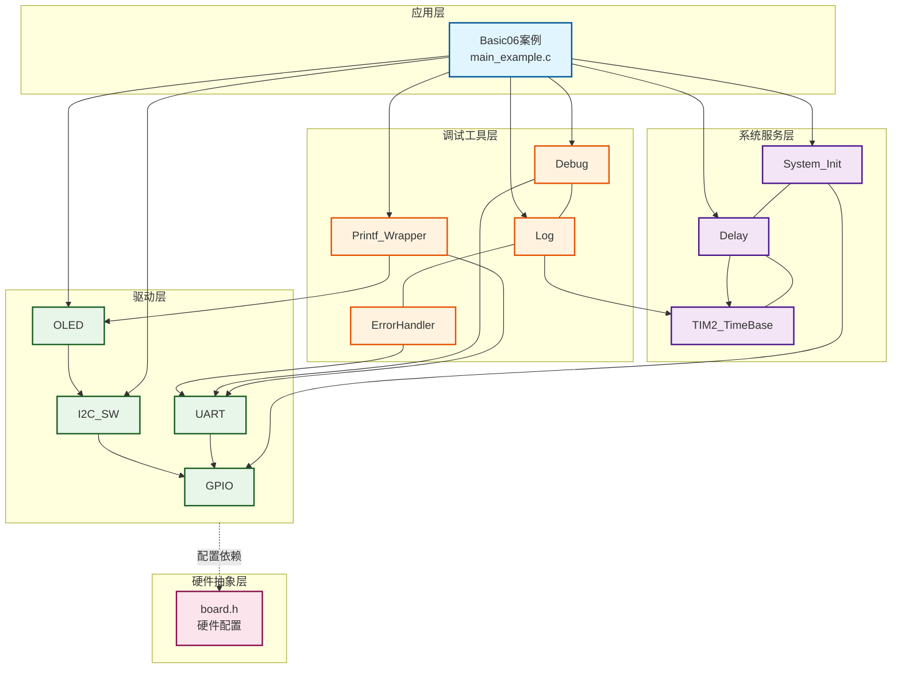
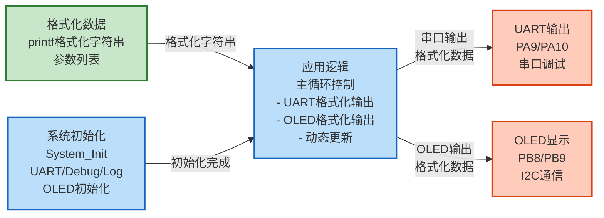
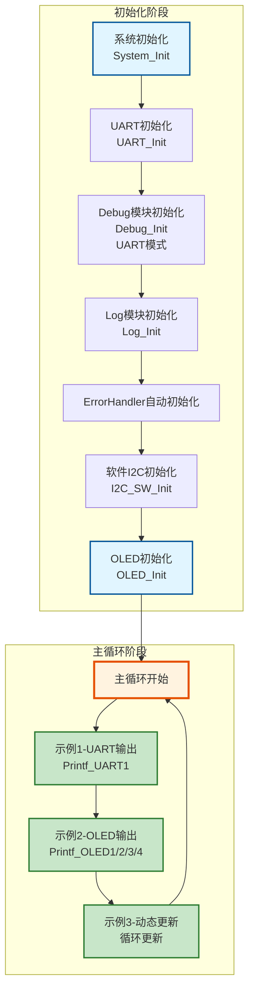

# Basic06 - printf封装模块使用示例

## 📋 案例目的

- **核心目标**
  - 演示printf封装模块的使用方法，包括Printf_UART和Printf_OLED函数，提供便捷的格式化输出功能

- **学习重点**：
  - 理解printf封装模块的基本使用方法
  - 掌握Printf_UART1/2/3函数的使用（输出到串口）
  - 掌握Printf_OLED1/2/3/4函数的使用（输出到OLED指定行）
  - 学习格式化字符串的使用（整数、浮点数、字符串等）
  - 了解OLED输出自动截断机制（16字符限制）
- **应用场景**：适用于需要便捷格式化输出的应用，如调试信息输出、状态显示、数据监控等

---

## 🔧 硬件要求

### 必需外设

- **USART1**：
  - TX：`PA9`
  - RX：`PA10`
  - 波特率：`115200`
  - 数据格式：`8N1`（8位数据位，无校验，1位停止位）

- **OLED显示屏（SSD1306，I2C接口）**：
  - SCL连接到`PB8`
  - SDA连接到`PB9`
  - 用于显示格式化输出内容

### 硬件连接

| STM32F103C8T6 | 外设/模块 | 说明 |
|--------------|----------|------|
| PA9 | USB转串口模块 TX | UART发送引脚 |
| PA10 | USB转串口模块 RX | UART接收引脚 |
| PB8 | OLED SCL | I2C时钟线 |
| PB9 | OLED SDA | I2C数据线 |
| 3.3V | USB转串口模块 VCC | 电源（如果模块需要） |
| 3.3V | OLED VCC | 电源 |
| GND | USB转串口模块 GND | 地线 |
| GND | OLED GND | 地线 |

**⚠️ 重要提示**：
- 案例是独立工程，硬件配置在案例目录下的 `board.h` 中
- 如果硬件引脚不同，直接修改 `Examples/Basic/Basic06_Printf/board.h` 中的配置即可
- 需要USB转串口模块（如CH340、CP2102等）连接到电脑，通过串口助手查看输出
- OLED显示屏用于显示格式化输出内容，每行最多16个字符（超出部分自动截断）

### 硬件配置

**⚠️ 重要说明**：案例是独立工程，硬件配置在案例目录下的 `board.h` 中。
如果硬件引脚不同，直接修改 `Examples/Basic/Basic06_Printf/board.h` 中的配置即可。

**UART配置**（已包含在board.h中）：
```c
/* UART统一配置表 - 标准配置：USART1，PA9/PA10，115200，8N1 */
#define UART_CONFIGS { \
    {USART1, GPIOA, GPIO_Pin_9, GPIOA, GPIO_Pin_10, 115200, USART_WordLength_8b, USART_StopBits_1, USART_Parity_No, 1}, \
}
```

**OLED配置**（已包含在board.h中）：
```c
/* OLED I2C配置 */
#define OLED_I2C_CONFIG {      \
    GPIOB,                     \
    GPIO_Pin_8, /* SCL: PB8 */ \
    GPIOB,                     \
    GPIO_Pin_9, /* SDA: PB9 */ \
}
```

**软件I2C配置**（OLED使用）：
```c
/* 软件I2C统一配置表 */
#define SOFT_I2C_CONFIGS { \
    {GPIOB, GPIO_Pin_8, GPIOB, GPIO_Pin_9, 5, 1}, /* SOFT_I2C1：PB8(SCL), PB9(SDA)，5us延时，启用 */ \
}
```

**注意**：
- 根据实际硬件修改UART引脚（`GPIO_Pin_9`、`GPIO_Pin_10`等）
- 根据实际硬件修改OLED引脚（`GPIO_Pin_8`、`GPIO_Pin_9`等）
- 根据实际硬件修改软件I2C引脚和延时参数

---

## 📦 模块依赖

### 模块依赖关系图

展示本案例使用的模块及其依赖关系：



### 模块列表

本案例使用以下模块：

- `uart`：UART驱动模块（串口通信，printf输出到串口）
- `oled_ssd1306`：OLED显示驱动模块（printf输出到OLED）
- `i2c_sw`：软件I2C驱动模块（OLED使用）
- `printf_wrapper`：printf封装模块（核心功能，格式化输出）
- `debug`：Debug模块（printf重定向，新项目必须）
- `log`：日志模块（分级日志系统，新项目必须）
- `error_handler`：错误处理模块（统一错误处理，新项目必须）
- `gpio`：GPIO驱动模块（UART、I2C依赖）
- `delay`：延时模块（用于实现时间间隔）
- `system_init`：系统初始化模块

### 模块使用说明

| 模块分类 | 模块名称 | 用途 | 依赖关系 |
|---------|---------|------|----------|
| **系统服务** | System_Init | 系统初始化 | 依赖GPIO、Delay |
| **系统服务** | Delay | 延时功能 | 依赖TIM2_TimeBase |
| **系统服务** | TIM2_TimeBase | 时间基准 | 无依赖 |
| **基础驱动** | GPIO | GPIO操作 | 依赖BSP配置 |
| **通信驱动** | UART | 串口通信 | 依赖GPIO |
| **通信驱动** | I2C_SW | 软件I2C | 依赖GPIO |
| **显示驱动** | OLED_SSD1306 | OLED显示 | 依赖I2C_SW |
| **调试工具** | Debug | 调试输出 | 依赖UART |
| **调试工具** | Log | 日志系统 | 依赖ErrorHandler、TIM2_TimeBase |
| **调试工具** | ErrorHandler | 错误处理 | 无依赖 |
| **调试工具** | Printf_Wrapper | 格式化输出 | 依赖OLED、UART |

---

## 🔄 实现流程

### 整体逻辑

本案例通过多个示例阶段，全面演示printf封装模块的各种功能：

1. **示例1：UART输出演示**
   - 演示Printf_UART1函数的使用
   - 展示各种格式化输出（整数、浮点数、字符串、十六进制等）
   - 串口输出详细日志信息

2. **示例2：OLED输出演示**
   - 演示Printf_OLED1/2/3/4函数的使用
   - 展示OLED每行格式化输出
   - 演示自动截断机制（超出16字符自动截断）

3. **示例3：动态更新演示**
   - 演示实时数据更新
   - 展示UART和OLED同时输出
   - 展示循环更新和格式化输出

### 数据流向图

展示本案例的数据流向：格式化数据 → 初始化 → 主循环 → 输出设备



**数据流说明**：

1. **格式化数据**：
   - printf格式化字符串和参数列表
   - 支持标准printf格式化语法

2. **初始化阶段**：
   - 系统初始化：初始化GPIO、延时等基础功能
   - UART/Debug/Log初始化：建立串口调试通道
   - OLED初始化：初始化显示模块

3. **应用逻辑**：
   - 主循环中调用printf封装函数
   - 同时输出到UART和OLED

4. **输出设备**：
   - **UART**：输出详细日志信息（支持中文）
   - **OLED**：显示关键信息（全英文，每行16字符）

### 关键方法

- **标准初始化流程**：按照System_Init → UART → Debug → Log → 其他模块的顺序初始化
- **printf格式化输出**：使用标准printf格式化语法，支持%d、%f、%s、%X等格式
- **自动截断机制**：OLED输出时，字符串超过16字符自动截断，确保显示正常
- **多通道输出**：可以同时输出到多个UART实例和OLED多行

### 工作流程示意



---

## 📚 关键函数说明

### printf封装模块相关函数

- **`Printf_UART1()`**：输出格式化字符串到UART1
  - 在本案例中用于输出详细日志信息到串口
  - 支持标准printf格式化语法（%d、%f、%s、%X等）
  - 输出内容通过串口助手查看

- **`Printf_UART2()`**：输出格式化字符串到UART2
  - 功能与Printf_UART1相同，但输出到UART2
  - 本案例未使用，但可以用于多串口输出场景

- **`Printf_UART3()`**：输出格式化字符串到UART3
  - 功能与Printf_UART1相同，但输出到UART3
  - 本案例未使用，但可以用于多串口输出场景

- **`Printf_OLED1()`**：输出格式化字符串到OLED第1行
  - 在本案例中用于显示计数器、温度等关键信息
  - 字符串自动截断到16字符（OLED每行限制）
  - 从第1列开始显示

- **`Printf_OLED2()`**：输出格式化字符串到OLED第2行
  - 功能与Printf_OLED1相同，但显示在第2行
  - 在本案例中用于显示温度信息

- **`Printf_OLED3()`**：输出格式化字符串到OLED第3行
  - 功能与Printf_OLED1相同，但显示在第3行
  - 在本案例中用于显示湿度信息

- **`Printf_OLED4()`**：输出格式化字符串到OLED第4行
  - 功能与Printf_OLED1相同，但显示在第4行
  - 在本案例中用于显示电压信息

**详细函数实现和调用示例请参考**：`main_example.c` 中的代码

---

## ⚠️ 注意事项与重点

### ⚠️ 重要提示

1. **OLED输出限制**：
   - OLED每行最多显示16个字符
   - 超出16字符的字符串会自动截断
   - 建议格式化字符串时控制长度，避免重要信息被截断

2. **UART输出编码**：
   - 串口输出支持中文（GB2312编码）
   - 建议串口助手配置为GB2312编码
   - OLED输出仅支持ASCII字符（不支持中文）

3. **初始化顺序**：
   - 必须按照System_Init → UART → Debug → Log → 其他模块的顺序初始化
   - UART和OLED必须初始化后才能使用printf封装函数
   - 如果模块未初始化，printf函数会静默失败（不输出）

4. **格式化字符串**：
   - 使用标准printf格式化语法
   - 支持%d（整数）、%f（浮点数）、%s（字符串）、%X（十六进制）等格式
   - OLED输出时注意控制字符串长度

5. **性能考虑**：
   - printf格式化输出是阻塞式的，会占用CPU时间
   - 实时性要求高的场景慎用
   - 建议在非关键路径使用

### 🔑 关键点

1. **便捷性**：printf封装函数提供了便捷的输出方式，无需手动格式化字符串
2. **多通道支持**：支持多个UART实例和OLED多行同时输出
3. **自动截断**：OLED输出自动截断机制，确保显示正常
4. **错误处理**：函数内部会检查模块初始化状态，未初始化时静默失败
5. **格式化灵活**：支持标准printf格式化语法，使用灵活

### 💡 调试技巧

1. **串口输出调试**：
   - 使用Printf_UART1输出详细调试信息
   - 可以通过串口助手实时查看输出
   - 支持中文输出，便于调试

2. **OLED显示调试**：
   - 使用Printf_OLED1/2/3/4显示关键状态
   - 注意字符串长度，避免被截断
   - 可以同时显示多行信息

3. **格式化字符串调试**：
   - 如果输出不正确，检查格式化字符串是否正确
   - 检查参数类型是否匹配（如%d对应整数，%f对应浮点数）
   - 检查参数数量是否匹配

---

## 🔍 常见问题排查

### 串口无输出

- **可能原因**：
  - UART未正确初始化
  - Debug模块未正确初始化
  - 串口助手配置错误
  - 硬件连接错误

- **解决方法**：
  - 检查UART是否正确初始化（UART_Init返回值）
  - 检查Debug模块是否正确初始化（Debug_Init返回值）
  - 检查串口助手配置是否正确（115200, 8N1）
  - 检查硬件连接是否正确（PA9/PA10）

### OLED不显示

- **可能原因**：
  - OLED连接错误（SCL/SDA引脚接错）
  - 软件I2C模块未启用
  - OLED模块未启用
  - I2C通信失败

- **解决方法**：
  - 检查OLED连接是否正确（SCL: PB8, SDA: PB9）
  - 检查软件I2C模块是否已启用（`CONFIG_MODULE_SOFT_I2C_ENABLED = 1`）
  - 检查OLED模块是否已启用（`CONFIG_MODULE_OLED_ENABLED = 1`）
  - 检查printf封装函数是否在OLED初始化后调用

### 编译错误

- **可能原因**：
  - 缺少必要的头文件
  - 模块未启用
  - 函数调用错误

- **解决方法**：
  - 确保已包含必要的头文件
  - 确保printf_wrapper模块已启用
  - 确保UART模块已启用
  - 确保OLED模块已启用
  - 确保软件I2C模块已启用

---

## 💡 扩展练习

### 循序渐进理解本案例

1. **多UART输出**：尝试使用Printf_UART2和Printf_UART3输出到其他串口，实现不同串口输出不同内容，理解多串口配置
2. **格式化字符串练习**：尝试使用不同的格式化选项（%d、%f、%s、%X、%o等），尝试控制输出精度（如%.2f保留两位小数），理解格式化字符串的使用
3. **OLED显示优化**：设计更美观的显示格式，实现多行信息的协调显示，理解OLED显示的限制和优化方法

### 实际场景中的常见坑点

4. **输出缓冲区溢出**：当输出内容过多或输出速度过快时，可能导致缓冲区溢出或输出丢失。如何检测和处理缓冲区溢出？如何实现动态缓冲区管理？
5. **输出阻塞问题**：printf函数是阻塞的，如果UART或OLED通信失败，可能导致程序卡死。如何实现非阻塞输出？如何处理通信失败的情况？
6. **多输出目标同步**：当同时输出到UART和OLED时，如果其中一个失败，另一个可能继续输出，导致信息不一致。如何保证多输出目标的同步和一致性？

---

## 📖 相关文档

- **模块文档**：
  - **printf封装模块**：`Debug/printf_wrapper.c/h`
  - **UART驱动模块**：`Drivers/uart/uart.c/h`
  - **OLED显示驱动模块**：`Drivers/display/oled_ssd1306.c/h`
  - **软件I2C驱动模块**：`Drivers/i2c/i2c_sw.c/h`
  - **Debug模块**：`Debug/debug.c/h`
  - **Log模块**：`Debug/log.c/h`
  - **错误处理模块**：`Common/error_handler.c/h`

- **业务文档**：
  - **主程序代码**：`Examples/Basic/Basic06_Printf/main_example.c`
  - **硬件配置**：`Examples/Basic/Basic06_Printf/board.h`
  - **模块配置**：`Examples/Basic/Basic06_Printf/config.h`
  - **项目规范文档**：`../../AI/README.md`（AI规则体系）
  - **案例参考**：`Examples/README.md`
- **ErrorHandler模块文档**：`Common/error_handler.c/h`
- **项目规范文档**：`../../AI/README.md`（AI规则体系）
- **案例参考**：`Examples/README.md`

---

## 📝 更新日志

- **2024-01-01**：
  - 初始版本，包含printf封装模块使用示例
  - 演示UART和OLED格式化输出
  - 集成UART、Debug、Log、ErrorHandler等基础模块
