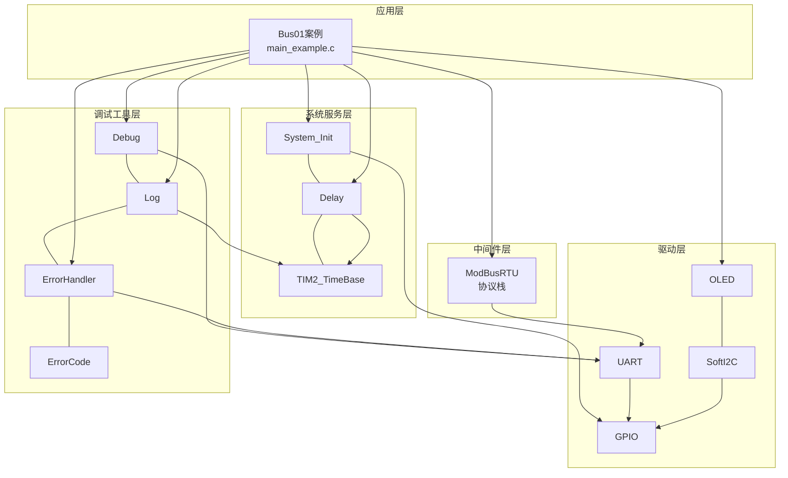
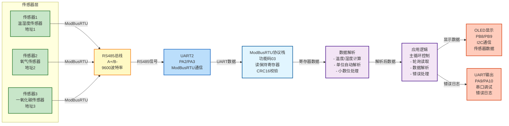
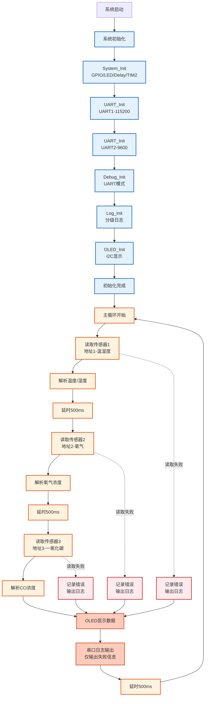

# Bus01 - ModBusRTU气体传感器读取示例

## 📋 案例目的

- **核心目标**：演示如何使用ModBusRTU协议通过UART2（RS485）读取多个气体传感器数据，并在OLED上显示

- **学习重点**：
  - 理解ModBusRTU协议的基本使用方法
  - 掌握ModBusRTU模块的API调用（读保持寄存器）
  - 学习多传感器轮询读取的实现方法
  - 了解传感器数据解析和显示
  - 学习标准初始化流程（System_Init → UART → Debug → Log → ErrorHandler → OLED）

- **应用场景**：适用于工业环境监测、气体检测、多传感器数据采集等应用场景

## 🔧 硬件要求

### 必需外设

- **USART1**：
  - TX：`PA9`
  - RX：`PA10`
  - 波特率：`115200`
  - 数据格式：`8N1`（用于Debug输出）

- **USART2**：
  - TX：`PA2`
  - RX：`PA3`
  - 波特率：`9600`
  - 数据格式：`8N1`（用于ModBusRTU通信）

- **RS485模块**：
  - 连接UART2（PA2/PA3）
  - 支持自动方向控制（或手动控制DE/RE引脚）

- **OLED显示屏**：
  - SCL：`PB8`
  - SDA：`PB9`
  - 接口：软件I2C

- **气体传感器**（3个）：
  - 地址1：温湿度传感器
  - 地址2：氧气传感器
  - 地址3：一氧化碳传感器
  - 地址4：二氧化碳传感器（可选）
  - 地址5：甲烷传感器（可选）
  - 地址6：氢气传感器（可选）
  - 协议：ModBusRTU，功能码03
  - 注意：支持部分传感器未连接的情况

### 硬件连接

| STM32F103C8T6 | 外设/模块 | 说明 |
|--------------|----------|------|
| PA9 | USB转串口模块 TX | UART1发送引脚（Debug输出） |
| PA10 | USB转串口模块 RX | UART1接收引脚（Debug输入） |
| PA2 | RS485模块 TX | UART2发送引脚（ModBusRTU通信） |
| PA3 | RS485模块 RX | UART2接收引脚（ModBusRTU通信） |
| PB8 | OLED SCL | 软件I2C时钟线 |
| PB9 | OLED SDA | 软件I2C数据线 |
| 5V | RS485模块 VCC | RS485模块电源 |
| GND | RS485模块 GND | 地线 |
| A+ | 传感器总线 A+ | RS485总线正极 |
| B- | 传感器总线 B- | RS485总线负极 |

**⚠️ 重要提示**：
- 案例是独立工程，硬件配置在案例目录下的 `board.h`
- 如果硬件引脚不同，直接修改 `Examples/Bus/Bus01_ModBusRTU_GasSensor/board.h` 中的配置即可
- RS485模块需要正确连接到UART2，并确保总线终端电阻配置正确
- 传感器地址必须已正确配置（地址1-3，支持部分传感器未连接）

## 📦 模块依赖

### 模块依赖关系图

展示本案例使用的模块及其依赖关系：



### 模块列表

本案例使用以下模块：

- `modbus_rtu`：ModBusRTU协议栈模块（核心功能）
- `uart`：UART驱动模块（ModBusRTU依赖）
- `oled_ssd1306`：OLED显示模块
- `soft_i2c`：软件I2C模块（OLED依赖）
- `debug`：Debug模块（UART输出功能）
- `log`：日志模块（分级日志输出）
- `error_handler`：错误处理模块（统一错误处理）
- `error_code`：错误码定义模块
- `delay`：延时模块
- `TIM2_TimeBase`：TIM2时间基准模块（delay依赖）
- `gpio`：GPIO驱动模块（UART、I2C依赖）
- `system_init`：系统初始化模块

## 🔄 实现流程

### 整体逻辑

1. **系统初始化阶段**：
   - System_Init()：系统初始化（GPIO、LED、delay、TIM2_TimeBase）
   - UART_Init()：初始化UART1和UART2
   - Debug_Init()：初始化Debug模块（UART模式）
   - Log_Init()：初始化Log模块
   - ErrorHandler：自动初始化
   - OLED_Init()：初始化OLED显示

2. **主循环阶段**：
   - 轮询读取3个传感器数据（地址1-3）
   - 每个传感器读取间隔500ms（符合协议要求）
   - 解析传感器数据（温度、湿度、气体浓度等）
   - 根据寄存器0的单位配置自动解析单位和小数位数
   - 在OLED上显示传感器数据（3个传感器直接显示）
   - 通过串口输出日志信息（仅输出失败信息，成功不输出）
   - 所有传感器读取完成后，等待500ms再开始下一轮读取

### 传感器数据解析

根据PROTOCOL.md协议文档：
- **温度值**：`温度(℃) = (寄存器7数值 - 500) / 10`
- **湿度值**：`湿度(%) = 寄存器9数值 / 10`
- **气体浓度**：寄存器1数值（根据寄存器0的单位定义）
- **气体类型**：寄存器8高8位（5=CO，6=CO2，11=CH4等）
- **传感器状态**：寄存器5低8位（0x00=预热，0x01=正常，0x05=低报等）

### OLED显示内容

- **第1行**：案例标题 "Bus01 ModBusRTU"
- **第2-4行**：显示3个传感器数据

显示格式示例：
```
Bus01 ModBusRTU
1:TempHum T:24.6 H:51.0
2:O2 20.9%VOL
3:CO 0ppm
```

**显示说明**：
- 传感器1（温湿度）：显示温度（℃）和湿度（%）
- 传感器2（氧气）：根据单位配置自动显示为%VOL（如20.9%VOL）
- 传感器3（一氧化碳）：根据单位配置自动显示为ppm（如0ppm）
- 单位和小数位数根据寄存器0的配置自动解析

### 数据流向图

展示本案例的数据流向：传感器设备 → ModBusRTU通信 → 数据解析 → 显示输出



**数据流说明**：
1. **传感器层**：
   - 3个传感器通过RS485总线连接（地址1-3）
   - 每个传感器支持ModBusRTU协议（功能码03）

2. **通信层**：
   - RS485总线传输ModBusRTU数据
   - UART2接收/发送RS485信号（9600波特率）

3. **协议栈层**：
   - ModBusRTU协议栈解析数据帧
   - 验证CRC16校验
   - 提取寄存器数据

4. **数据解析层**：
   - 解析温度、湿度、气体浓度
   - 根据寄存器0配置自动解析单位和小数位数
   - 计算实际物理值

5. **应用逻辑层**：
   - 主循环轮询读取3个传感器
   - 处理错误和重试
   - 管理显示更新

6. **输出设备层**：
   - **OLED显示**：实时显示传感器数据
   - **UART输出**：输出错误日志（成功不输出）

### 关键方法

1. **ModBusRTU_ReadHoldingRegisters()**：
   - 使用场景：读取传感器保持寄存器数据
   - 注意事项：必须指定正确的UART实例、传感器地址、寄存器地址和数量
   - 超时时间建议设置为1000ms以上

2. **数据解析方法**：
   - 温度计算：`(寄存器7 - 500) / 10`
   - 湿度计算：`寄存器9 / 10`
   - 单位解析：从寄存器0的Bit15-12提取单位类型
   - 小数位解析：从寄存器0的Bit11-8提取小数位数

3. **轮询读取策略**：
   - 每个传感器读取间隔500ms（符合协议要求）
   - 支持部分传感器未连接的情况（显示Error）
   - 读取失败时输出错误日志，成功时不输出（减少串口输出）

### 工作流程示意图

展示完整的工作流程，包括初始化、主循环、中断处理等阶段：



## 📚 关键函数说明

### ModBusRTU相关函数

- **`ModBusRTU_ReadHoldingRegisters()`**：读取保持寄存器数据
  - 在本案例中用于读取传感器数据（10个寄存器：0x0000-0x0009）
  - 必须指定正确的UART实例（UART_INSTANCE_2）、传感器地址、寄存器地址和数量
  - 超时时间建议设置为1000ms以上，确保有足够时间等待传感器响应
  - 函数会自动重试（默认3次），提高通信可靠性

### UART相关函数

- **`UART_Init()`**：初始化UART外设
  - 在本案例中用于初始化UART1（Debug输出）和UART2（ModBusRTU通信）
  - 必须按照标准初始化流程，先初始化UART，再初始化Debug模块
  - UART配置在`board.h`中定义，包括引脚、波特率、数据格式等

### OLED相关函数

- **`OLED_Init()`**：初始化OLED显示模块
  - 在本案例中用于初始化OLED显示，显示传感器数据
  - 使用软件I2C接口（PB8/PB9），配置在`board.h`中定义

- **`OLED_ShowString()`**：显示字符串
  - 在本案例中用于显示传感器数据（温度、湿度、气体浓度等）
  - 支持ASCII字符显示，每行最多显示16个字符

- **`OLED_Clear()`**：清空OLED显示
  - 在本案例中用于每次更新显示前清空屏幕，确保显示内容正确

### 日志相关函数

- **`LOG_INFO()`**：输出信息级别日志
  - 在本案例中用于输出系统初始化信息和传感器数据（成功时）
  - 日志级别设置为DEBUG，显示所有日志信息

- **`LOG_ERROR()`**：输出错误级别日志
  - 在本案例中用于输出传感器读取失败的错误信息
  - 读取失败时才输出日志，成功时不输出（减少串口输出）

### 错误处理相关函数

- **`ErrorHandler_Handle()`**：处理错误
  - 在本案例中用于处理传感器读取失败等错误
  - 自动统计错误次数，便于问题排查

**详细函数实现和调用示例请参考**：`main_example.c` 中的代码

## ⚠️ 注意事项与重点

### ⚠️ 重要提示

1. **标准初始化流程**：
   - 必须遵循 System_Init → UART → Debug → Log → ErrorHandler → OLED 的顺序
   - 这是项目规范要求的标准初始化流程，不能改变顺序

2. **RS485方向控制**：
   - 如果使用自动方向控制的RS485模块，无需额外配置
   - 如果需要手动控制DE/RE引脚，需要添加GPIO控制代码

3. **轮询间隔**：
   - PROTOCOL.md建议每个地址问询间隔500ms以上
   - 本案例在每个传感器读取后等待500ms，符合协议要求
   - 所有传感器读取完成后，等待500ms再开始下一轮读取

4. **传感器地址配置**：
   - 当前配置支持3个传感器（地址1-3）
   - 如果地址不同，需要修改代码中的传感器配置
   - 支持部分传感器未连接的情况（会显示"Error"）
   - 传感器4-6的配置已预留（代码中已注释），需要时可取消注释

5. **数据单位自动解析**：
   - 代码会根据寄存器0的配置自动解析单位和小数位数
   - 氧气传感器通常使用%VOL单位，需要除以10得到百分比
   - 一氧化碳传感器通常使用ppm单位，直接显示原始值
   - 显示时会自动使用正确的单位（%VOL、ppm等）

### 🔑 关键点

1. **ModBusRTU协议栈使用**：
   - 使用功能码03（读保持寄存器）读取传感器数据
   - 必须正确配置UART参数（9600波特率，8N1格式）
   - CRC16校验由协议栈自动处理，无需手动计算

2. **数据解析方法**：
   - 温度值：`(寄存器7 - 500) / 10`（℃）
   - 湿度值：`寄存器9 / 10`（%）
   - 气体浓度：根据寄存器0的单位和小数位配置自动解析
   - 单位类型：从寄存器0的Bit15-12提取（0=ppm，4=%VOL等）
   - 小数位数：从寄存器0的Bit11-8提取（0=无小数，4=一位小数等）

3. **错误处理策略**：
   - 读取失败时输出错误日志，便于排查问题
   - 读取成功时不输出日志，减少串口输出
   - 支持部分传感器未连接的情况，显示"Error"而不是崩溃

4. **显示更新优化**：
   - 每次轮询读取完成后统一更新OLED显示
   - 使用`OLED_Clear()`清空屏幕，确保显示内容正确
   - 显示格式简洁明了，适合小屏幕显示

## 🔍 常见问题排查

### 问题1：传感器读取失败

**现象**：OLED显示 "Error"，串口输出读取失败错误

**可能原因**：
- RS485模块连接不正确
- 传感器地址配置错误
- 传感器未上电
- RS485总线终端电阻配置不正确
- UART2配置错误（波特率、数据格式等）

**解决方法**：
1. 检查RS485模块连接是否正确（PA2/PA3）
2. 检查传感器地址是否正确（地址1-3）
3. 检查传感器是否上电（5V电源）
4. 检查RS485总线终端电阻配置（建议120Ω）
5. 使用串口助手查看UART2的通信数据，确认是否有数据收发
6. 检查`board.h`中的UART2配置是否正确（9600波特率，8N1格式）

### 问题2：OLED无显示

**现象**：OLED屏幕无显示

**可能原因**：
- OLED连接不正确（PB8/PB9）
- OLED未上电
- 软件I2C配置不正确
- OLED初始化失败

**解决方法**：
1. 检查OLED连接是否正确（PB8=SCL，PB9=SDA）
2. 检查OLED是否上电（3.3V或5V电源）
3. 检查软件I2C配置是否正确（`board.h`中的`SOFT_I2C_CONFIGS`）
4. 查看串口日志，确认OLED初始化是否成功
5. 如果初始化失败，检查错误码并参考OLED模块文档

### 问题3：数据解析错误

**现象**：显示的数据明显不正确

**可能原因**：
- 寄存器数据读取错误
- 数据解析公式错误
- 单位配置解析错误
- 小数位数解析错误

**解决方法**：
1. 检查寄存器数据是否正确读取（查看串口日志中的原始寄存器数据）
2. 检查数据解析公式是否正确（参考PROTOCOL.md协议文档）
3. 检查寄存器0的单位配置解析是否正确（Bit15-12为单位，Bit11-8为小数位）
4. 参考PROTOCOL.md确认数据格式和解析方法
5. 使用串口助手查看ModBusRTU通信数据，确认传感器返回的数据是否正确

### 问题4：串口无输出

**现象**：串口助手无任何输出

**可能原因**：
- UART1连接不正确（PA9/PA10）
- 波特率配置错误（应为115200）
- Debug模块初始化失败
- Log模块初始化失败

**解决方法**：
1. 检查UART1连接是否正确（PA9=TX，PA10=RX）
2. 检查串口助手波特率是否设置为115200
3. 检查`board.h`中的UART1配置是否正确
4. 查看系统启动时的LED指示，确认程序是否正常运行
5. 如果Debug模块初始化失败，检查错误码并参考Debug模块文档

## 💡 扩展练习

### 循序渐进部分

1. **添加更多传感器**：
   - 扩展代码支持更多传感器（地址4-6等）
   - 实现动态传感器配置（通过配置文件或串口命令配置传感器地址）
   - 优化显示布局，支持分页显示（每页显示3个传感器）

2. **数据存储功能**：
   - 添加数据存储功能（如Flash存储或SD卡存储）
   - 实现历史数据记录（每分钟记录一次数据）
   - 添加数据查询功能（通过串口命令查询历史数据）

3. **报警功能**：
   - 根据传感器状态实现报警功能（LED闪烁或蜂鸣器报警）
   - 添加阈值报警（温度、湿度、气体浓度超限报警）
   - 实现报警记录功能（记录报警时间和报警值）

### 实际场景坑点部分

4. **通信可靠性优化**：
   - 实现通信超时重试机制（读取失败时自动重试3次）
   - 添加通信质量监测（统计成功率和失败率）
   - 实现通信故障自动恢复（检测到通信故障时自动重新初始化）

5. **数据异常处理**：
   - 实现数据有效性检查（检查数据是否在合理范围内）
   - 添加数据平滑处理（使用滑动平均滤波，避免数据跳变）
   - 实现异常数据标记（标记异常数据，不参与显示和统计）

6. **性能优化**：
   - 优化轮询策略（根据传感器类型设置不同的轮询间隔）
   - 实现非阻塞读取（使用中断或DMA方式读取，避免阻塞主循环）
   - 添加数据缓存机制（缓存最近N次读取的数据，减少重复读取）

## 📖 相关文档

### 模块文档

- **ModBusRTU模块**：`Middlewares/protocols/modbus_rtu/modbus_rtu.c/h`
- **UART模块**：`Drivers/uart/uart.c/h`
- **OLED模块**：`Drivers/display/oled_ssd1306/oled_ssd1306.c/h`
- **软件I2C模块**：`Drivers/i2c/i2c_sw.c/h`
- **Debug模块**：`Debug/debug.c/h`
- **Log模块**：`Debug/log.c/h`
- **ErrorHandler模块**：`Common/error_handler.c/h`

### 业务文档

- **主程序代码**：`Examples/Bus/Bus01_ModBusRTU_GasSensor/main_example.c`
- **硬件配置**：`Examples/Bus/Bus01_ModBusRTU_GasSensor/board.h`
- **模块配置**：`Examples/Bus/Bus01_ModBusRTU_GasSensor/config.h`
- **协议文档**：`Examples/Bus/Bus01_ModBusRTU_GasSensor/PROTOCOL.md`
- **项目规范**：`../../AI/README.md`（AI规则体系）
- **案例参考**：`Examples/README.md`

## 🔗 相关案例

- **UART01_Error_Log_Output**：UART错误日志输出示例
- **OLED01_helloword**：OLED显示测试

---

**最后更新**：2024-01-01


