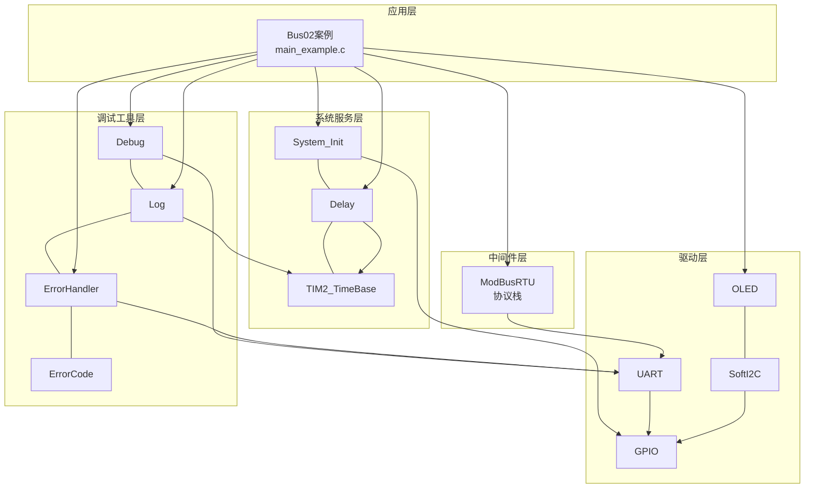
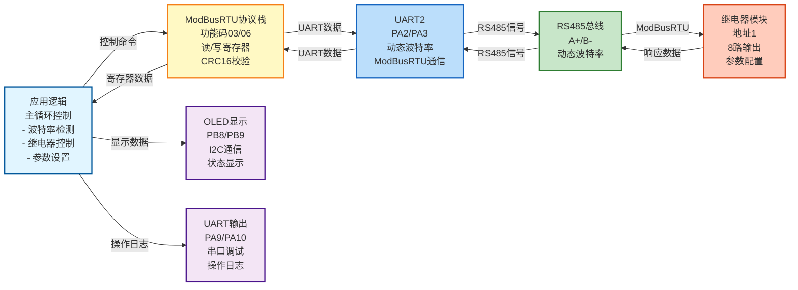

# Bus02 - ModBusRTU继电器控制示例

## 📋 案例目的

- **核心目标**：演示如何使用ModBusRTU协议通过UART2（RS485）控制继电器模块，包括自动波特率检测、继电器开关控制、批量控制、通信时间测试、波特率切换等功能

- **学习重点**：
  - 理解ModBusRTU协议的基本使用方法
  - 掌握ModBusRTU模块的API调用（读保持寄存器、写单个寄存器）
  - 学习自动波特率检测的实现方法（支持失败重试）
  - 学习批量控制寄存器的使用方法（按位控制多个通道）
  - 学习精确时间控制的实现方法（批量关闭时的时序控制）
  - 了解继电器模块的参数配置（站点地址、波特率）
  - 学习标准初始化流程（System_Init → UART → Debug → Log → ErrorHandler → OLED）

- **应用场景**：适用于工业控制、自动化设备、继电器控制等应用场景

## 🔧 硬件要求

### 必需外设

- **USART1**：
  - TX：`PA9`
  - RX：`PA10`
  - 波特率：`115200`
  - 数据格式：`8N1`（用于Debug输出）

- **USART2**：
  - TX：`PA2`
  - RX：`PA3`
  - 波特率：`动态`（自动检测：9600、38400、115200）
  - 数据格式：`8N1`（用于ModBusRTU通信）

- **RS485模块**：
  - 连接UART2（PA2/PA3）
  - 支持自动方向控制（或手动控制DE/RE引脚）

- **OLED显示屏**：
  - SCL：`PB8`
  - SDA：`PB9`
  - 接口：软件I2C

- **继电器模块**（汇控电子数字量IO模块）：
  - 默认地址：`1`
  - 默认波特率：`38400bps`（支持自动检测）
  - 通道数量：`8路`（可扩展到48路）
  - 协议：ModBusRTU，功能码03/06

### 硬件连接

| STM32F103C8T6 | 外设/模块 | 说明 |
|--------------|----------|------|
| PA9 | USB转串口模块 TX | UART1发送引脚（Debug输出） |
| PA10 | USB转串口模块 RX | UART1接收引脚（Debug输入） |
| PA2 | RS485模块 TX | UART2发送引脚（ModBusRTU通信） |
| PA3 | RS485模块 RX | UART2接收引脚（ModBusRTU通信） |
| PB8 | OLED SCL | 软件I2C时钟线 |
| PB9 | OLED SDA | 软件I2C数据线 |
| 5V | RS485模块 VCC | RS485模块电源 |
| GND | RS485模块 GND | 地线 |
| A+ | 继电器模块总线 A+ | RS485总线正极 |
| B- | 继电器模块总线 B- | RS485总线负极 |

**⚠️ 重要提示**：
- 案例是独立工程，硬件配置在案例目录下的 `board.h`
- 如果硬件引脚不同，直接修改 `Examples/Bus/Bus02_ModBusRTU_Relay/board.h` 中的配置即可
- RS485模块需要正确连接到UART2，并确保总线终端电阻配置正确
- 继电器模块地址默认为1，如果不同请修改代码中的`RELAY_SLAVE_ADDRESS`

## 📦 模块依赖

### 模块依赖关系图

展示本案例使用的模块及其依赖关系：



### 模块列表

本案例使用以下模块：

- `modbus_rtu`：ModBusRTU协议栈模块（核心功能）
- `uart`：UART驱动模块（ModBusRTU依赖）
- `oled_ssd1306`：OLED显示模块
- `soft_i2c`：软件I2C模块（OLED依赖）
- `debug`：Debug模块（UART输出功能）
- `log`：日志模块（分级日志输出）
- `error_handler`：错误处理模块（统一错误处理）
- `error_code`：错误码定义模块
- `delay`：延时模块
- `TIM2_TimeBase`：TIM2时间基准模块（delay依赖）
- `gpio`：GPIO驱动模块（UART、I2C依赖）
- `system_init`：系统初始化模块

## 🔄 实现流程

### 整体逻辑

程序按顺序执行以下步骤，执行完成后进入等待状态：

1. **系统初始化阶段**：
   - System_Init()：系统初始化（GPIO、LED、delay、TIM2_TimeBase）
   - UART_Init()：初始化UART1和UART2
   - Debug_Init()：初始化Debug模块（UART模式）
   - Log_Init()：初始化Log模块
   - ErrorHandler：自动初始化
   - OLED_Init()：初始化OLED显示

2. **波特率自动检测阶段**：
   - 依次尝试9600、38400、115200波特率
   - 通过读取继电器模块的站点地址寄存器（0x0032）来验证通信
   - 如果第一次检测失败，等待5秒后再次检测
   - 检测成功后使用该波特率进行后续通信

3. **ModBusRTU通信时间测试阶段**：
   - 测试9600波特率下，发送一个WriteSingleRegister命令到接收返回数据的完整时间
   - 输出平均时间、最短时间、最长时间等统计信息

4. **继电器开关测试阶段**：
   - 依次开启继电器1-8（间隔500ms）
   - 依次关闭继电器1-8（间隔500ms）
   - 在OLED上显示当前状态（波特率、通道、状态）
   - 通过串口输出操作日志

5. **批量控制测试阶段**：
   - 使用批量控制寄存器（0x0035H）一次性开启所有通道1-8
   - 等待2秒后，按顺序关闭通道（通道1:100ms后，通道2:200ms后...通道8:800ms后）
   - 关闭阶段不更新OLED显示，避免刷新延迟影响时间精度
   - 所有通道关闭后，读取寄存器验证状态

6. **波特率切换阶段**：
   - 根据当前波特率切换到下一个波特率（9600→38400→115200→9600循环）
   - 写入新的波特率值到寄存器0x0033H
   - 输出提示信息："已切换波特率，请重启继电器与单片机"

7. **程序完成**：
   - 进入死循环等待重启
   - 提示用户重启继电器和单片机以使新波特率生效

### 继电器寄存器地址

根据开发指令速查文档：

| 寄存器地址 | 功能 | 说明 |
|----------|------|------|
| `0x0000` | 通道1输出控制 | 写1=ON，写0=OFF |
| `0x0001` | 通道2输出控制 | 写1=ON，写0=OFF |
| ... | ... | ... |
| `0x0007` | 通道8输出控制 | 写1=ON，写0=OFF |
| `0x0032` | RS485地址寄存器 | 范围1-255，掉电保存 |
| `0x0033` | 波特率寄存器 | 0=4800, 1=9600, 4=38400, 7=115200等 |
| `0x0034` | 批量控制（全开/全关） | 0=全关，1=全开 |
| `0x0035` | 批量控制通道1~16（按位） | 位0=通道1，位1=通道2...位7=通道8 |

### OLED显示内容

- **第1行**：案例标题 "Bus02 ModBusRTU"
- **第2行**：当前波特率（如 "Baud: 38400"）
- **第3行**：当前操作的通道和状态（如 "Ch1: ON " 或 "Ready"）
- **第4行**：继电器模块地址（如 "Addr: 1"）

显示格式示例：
```
Bus02 ModBusRTU
Baud: 38400
Ch1: ON 
Addr: 1
```

### 数据流向图

展示本案例的数据流向：STM32 → ModBusRTU通信 → 继电器模块控制



### 工作流程示意图

展示完整的工作流程，包括初始化、波特率检测、测试、波特率切换等阶段：

```mermaid
%%{init: {'flowchart': {'curve': 'basis'}}}%%
flowchart TD
    START[系统启动] --> INIT[系统初始化]
    
    INIT --> INIT_SYS[System_Init<br/>GPIO/LED/Delay/TIM2]
    INIT_SYS --> INIT_UART1[UART_Init<br/>UART1-115200]
    INIT_UART1 --> INIT_UART2[UART_Init<br/>UART2-9600初始值]
    INIT_UART2 --> INIT_DEBUG[Debug_Init<br/>UART模式]
    INIT_DEBUG --> INIT_LOG[Log_Init<br/>分级日志]
    INIT_LOG --> INIT_OLED[OLED_Init<br/>I2C显示]
    INIT_OLED --> INIT_DONE[初始化完成]
    
    INIT_DONE --> DETECT[波特率自动检测]
    
    DETECT --> TRY_9600[尝试9600波特率]
    TRY_9600 --> CHECK1{检测成功?}
    CHECK1 -->|是| SET_BAUD[设置检测到的波特率]
    CHECK1 -->|否| TRY_38400[尝试38400波特率]
    TRY_38400 --> CHECK2{检测成功?}
    CHECK2 -->|是| SET_BAUD
    CHECK2 -->|否| TRY_115200[尝试115200波特率]
    TRY_115200 --> CHECK3{检测成功?}
    CHECK3 -->|是| SET_BAUD
    CHECK3 -->|否| RETRY{第一次检测?}
    RETRY -->|是| WAIT_RETRY[等待5秒]
    WAIT_RETRY --> DETECT
    RETRY -->|否| ERROR[检测失败<br/>程序停止]
    
    SET_BAUD --> TEST_TIME[测试ModBusRTU通信时间<br/>测量9600波特率下通信延迟]
    TEST_TIME --> WAIT1[等待3秒]
    WAIT1 --> TEST_SWITCH[测试继电器开关<br/>依次开启/关闭1-8通道]
    TEST_SWITCH --> WAIT2[等待5秒]
    WAIT2 --> TEST_BATCH[批量控制测试<br/>全开后按顺序关闭]
    TEST_BATCH --> WAIT3[等待2秒]
    WAIT3 --> SWITCH_BAUD[切换继电器波特率<br/>9600到38400到115200到9600]
    SWITCH_BAUD --> DONE[程序执行完成<br/>等待重启]
    
    %% 样式
    classDef init fill:#e3f2fd,stroke:#1565c0,stroke-width:2px
    classDef detect fill:#fff3e0,stroke:#e65100,stroke-width:2px
    classDef test fill:#e8f5e9,stroke:#2e7d32,stroke-width:2px
    classDef switch fill:#f3e5f5,stroke:#4a148c,stroke-width:2px
    classDef error fill:#ffebee,stroke:#c62828,stroke-width:2px
    classDef wait fill:#fff9c4,stroke:#f57f17,stroke-width:2px
    
    class INIT,INIT_SYS,INIT_UART1,INIT_UART2,INIT_DEBUG,INIT_LOG,INIT_OLED,INIT_DONE init
    class DETECT,TRY_9600,TRY_38400,TRY_115200,CHECK1,CHECK2,CHECK3,SET_BAUD,RETRY,WAIT_RETRY detect
    class TEST_TIME,TEST_SWITCH,TEST_BATCH test
    class SWITCH_BAUD switch
    class WAIT1,WAIT2,WAIT3 wait
    class ERROR error
    class DONE switch
```



## 📚 关键函数说明

### ModBusRTU相关函数

- **`ModBusRTU_ReadHoldingRegisters()`**：读取保持寄存器数据
  - 在本案例中用于读取继电器模块的站点地址寄存器（0x0032）和波特率寄存器（0x0033）
  - 用于波特率检测和参数验证

- **`ModBusRTU_WriteSingleRegister()`**：写单个寄存器
  - 在本案例中用于控制继电器通道（0x0000-0x0007）和设置参数（0x0032、0x0033）
  - 功能码06，用于单个寄存器写入

### UART相关函数

- **`UART_Init()`**：初始化UART外设
  - 在本案例中用于初始化UART1（Debug输出）和UART2（ModBusRTU通信）
  - 必须按照标准初始化流程，先初始化UART，再初始化Debug模块

- **`UART_SetBaudRate()`**：动态设置UART波特率
  - 在本案例中用于波特率自动检测，动态切换UART2的波特率

### OLED相关函数

- **`OLED_Init()`**：初始化OLED显示模块
  - 在本案例中用于初始化OLED显示，显示继电器状态
  - 使用软件I2C接口（PB8/PB9），配置在`board.h`中定义

- **`OLED_ShowString()`**：显示字符串
  - 在本案例中用于显示波特率、通道状态等信息

- **`OLED_Clear()`**：清空OLED显示
  - 在本案例中用于每次更新显示前清空屏幕，确保显示内容正确

### 日志相关函数

- **`LOG_INFO()`**：输出信息级别日志
  - 在本案例中用于输出系统初始化信息、波特率检测过程、继电器操作日志

- **`LOG_ERROR()`**：输出错误级别日志
  - 在本案例中用于输出通信失败、操作失败等错误信息

### 错误处理相关函数

- **`ErrorHandler_Handle()`**：处理错误
  - 在本案例中用于处理ModBusRTU通信失败等错误
  - 自动统计错误次数，便于问题排查

**详细函数实现和调用示例请参考**：`main_example.c` 中的代码

## ⚠️ 注意事项与重点

### ⚠️ 重要提示

1. **标准初始化流程**：
   - 必须遵循 System_Init → UART → Debug → Log → ErrorHandler → OLED 的顺序
   - 这是项目规范要求的标准初始化流程，不能改变顺序

2. **波特率自动检测**：
   - 继电器模块默认波特率为38400bps
   - 程序会自动尝试9600、38400、115200三个波特率
   - 检测方法：通过读取站点地址寄存器（0x0032）来验证通信是否成功
   - 如果检测失败，请检查RS485连接和继电器模块是否上电

3. **继电器控制间隔**：
   - 单个通道控制：每个继电器操作间隔500ms，符合ModBusRTU协议要求
   - 批量控制：关闭阶段使用精确时间控制（通道1:100ms，通道2:200ms...通道8:800ms）
   - 批量控制关闭阶段不更新OLED显示，避免刷新延迟影响时间精度

4. **波特率切换注意事项**：
   - 程序执行完所有测试后，会自动切换继电器波特率
   - 切换规则：9600→38400→115200→9600（循环）
   - 切换后需要重启继电器模块和单片机才能生效
   - 程序会输出提示信息："已切换波特率，请重启继电器与单片机"

5. **RS485方向控制**：
   - 如果使用自动方向控制的RS485模块，无需额外配置
   - 如果需要手动控制DE/RE引脚，需要添加GPIO控制代码

### 🔑 关键点

1. **ModBusRTU协议栈使用**：
   - 使用功能码03（读保持寄存器）读取参数
   - 使用功能码06（写单个寄存器）控制继电器和设置参数
   - CRC16校验由协议栈自动处理，无需手动计算

2. **波特率动态切换**：
   - 使用`UART_SetBaudRate()`动态切换UART2波特率
   - 切换后需要等待一段时间让波特率稳定
   - 切换前需要清空UART接收缓冲区，避免干扰

3. **错误处理策略**：
   - 波特率检测失败时程序会停止运行，避免后续操作失败
   - 继电器操作失败时会输出错误日志，但不会停止程序
   - 支持部分操作失败的情况，继续执行后续操作

4. **显示更新优化**：
   - 每次操作后立即更新OLED显示
   - 使用`OLED_Clear()`清空屏幕，确保显示内容正确
   - 显示格式简洁明了，适合小屏幕显示

## 🔍 常见问题排查

### 问题1：波特率检测失败

**现象**：OLED显示 "Detecting..."，串口输出检测失败错误

**可能原因**：
- RS485模块连接不正确
- 继电器模块未上电
- RS485总线终端电阻配置不正确
- 继电器模块地址不是1
- 继电器模块波特率不在测试列表中（9600、38400、115200）

**解决方法**：
1. 检查RS485模块连接是否正确（PA2/PA3）
2. 检查继电器模块是否上电（5V或12V电源）
3. 检查RS485总线终端电阻配置（建议120Ω）
4. 检查继电器模块地址是否为1（如果不是，修改代码中的`RELAY_SLAVE_ADDRESS`）
5. 如果继电器模块使用其他波特率（如4800、19200等），需要修改代码中的波特率测试列表
6. 使用串口助手查看UART2的通信数据，确认是否有数据收发

### 问题2：继电器控制失败

**现象**：串口输出控制失败错误，继电器无响应

**可能原因**：
- 波特率检测失败，使用了错误的波特率
- 继电器模块地址配置错误
- 寄存器地址错误
- RS485通信故障

**解决方法**：
1. 检查波特率检测是否成功（查看串口日志）
2. 检查继电器模块地址是否正确（默认应为1）
3. 检查寄存器地址是否正确（通道1=0x0000，通道2=0x0001...）
4. 使用串口助手查看ModBusRTU通信数据，确认命令是否正确发送
5. 检查继电器模块是否支持该功能码（功能码06）

### 问题3：OLED无显示

**现象**：OLED屏幕无显示

**可能原因**：
- OLED连接不正确（PB8/PB9）
- OLED未上电
- 软件I2C配置不正确
- OLED初始化失败

**解决方法**：
1. 检查OLED连接是否正确（PB8=SCL，PB9=SDA）
2. 检查OLED是否上电（3.3V或5V电源）
3. 检查软件I2C配置是否正确（`board.h`中的`SOFT_I2C_CONFIGS`）
4. 查看串口日志，确认OLED初始化是否成功
5. 如果初始化失败，检查错误码并参考OLED模块文档

### 问题4：参数设置无效

**现象**：设置站点地址或波特率后，读取值不匹配

**可能原因**：
- 参数修改后需要重启继电器模块才能生效
- 读取验证时使用了错误的地址或波特率

**解决方法**：
1. 设置参数后，重启继电器模块（断电再上电）
2. 使用新地址或新波特率重新通信验证
3. 参考开发指令速查文档，确认参数设置方法是否正确
4. 某些继电器模块可能需要特定的设置序列才能生效

## 💡 扩展练习

### 循序渐进部分

1. **批量控制功能优化**：
   - 当前已实现批量控制功能（使用0x0035H寄存器按位控制）
   - 可扩展支持更多通道（16路、32路、48路）
   - 优化显示布局，支持分页显示

2. **输入状态读取**：
   - 添加读取继电器模块输入状态的功能（功能码04）
   - 在OLED上显示输入状态
   - 实现输入状态变化检测和报警

3. **参数配置界面**：
   - 实现通过串口命令配置继电器模块参数
   - 添加参数保存和恢复功能
   - 实现参数验证和错误提示

### 实际场景坑点部分

4. **通信可靠性优化**：
   - 实现通信超时重试机制（操作失败时自动重试）
   - 添加通信质量监测（统计成功率和失败率）
   - 实现通信故障自动恢复（检测到通信故障时自动重新初始化）

5. **状态管理优化**：
   - 实现继电器状态缓存（避免重复读取）
   - 添加状态变化检测（只在状态变化时更新显示）
   - 实现状态历史记录（记录最近N次操作）

6. **性能优化**：
   - 优化波特率检测策略（根据历史记录优先尝试常用波特率）
   - 实现非阻塞操作（使用中断或DMA方式，避免阻塞主循环）
   - 添加操作队列机制（支持批量操作和异步操作）

## 📖 相关文档

### 模块文档

- **ModBusRTU模块**：`Middlewares/protocols/modbus_rtu/modbus_rtu.c/h`
- **UART模块**：`Drivers/uart/uart.c/h`
- **OLED模块**：`Drivers/display/oled_ssd1306/oled_ssd1306.c/h`
- **软件I2C模块**：`Drivers/i2c/i2c_sw.c/h`
- **Debug模块**：`Debug/debug.c/h`
- **Log模块**：`Debug/log.c/h`
- **ErrorHandler模块**：`Common/error_handler.c/h`

### 业务文档

- **主程序代码**：`Examples/Bus/Bus02_ModBusRTU_Relay/main_example.c`
- **硬件配置**：`Examples/Bus/Bus02_ModBusRTU_Relay/board.h`
- **模块配置**：`Examples/Bus/Bus02_ModBusRTU_Relay/config.h`
- **开发指令速查**：`Examples/Bus/Bus02_ModBusRTU_Relay/开发指令速查.md`
- **项目规范**：`../../AI/README.md`（AI规则体系）
- **案例参考**：`Examples/README.md`

## 🔗 相关案例

- **Bus01_ModBusRTU_GasSensor**：ModBusRTU传感器读取示例
- **UART01_Error_Log_Output**：UART错误日志输出示例
- **OLED01_helloword**：OLED显示测试

---

**最后更新**：2024-01-01
