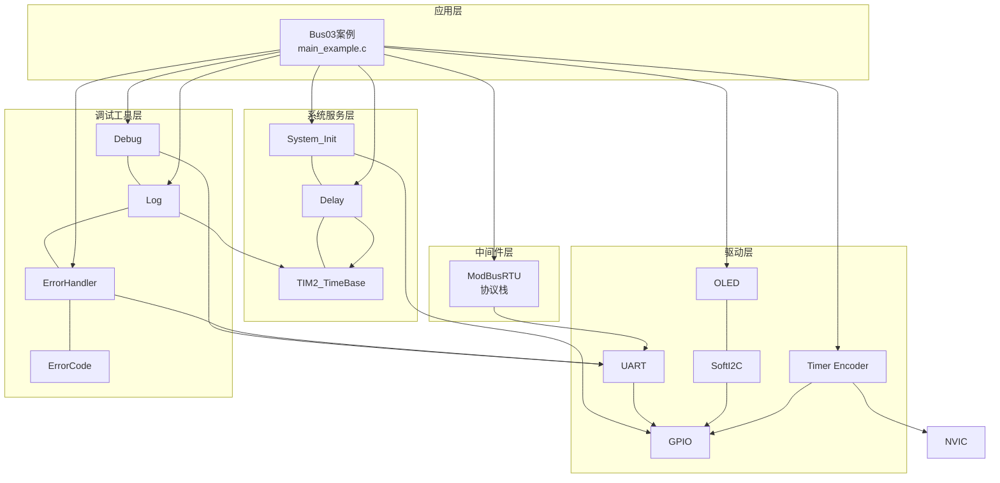
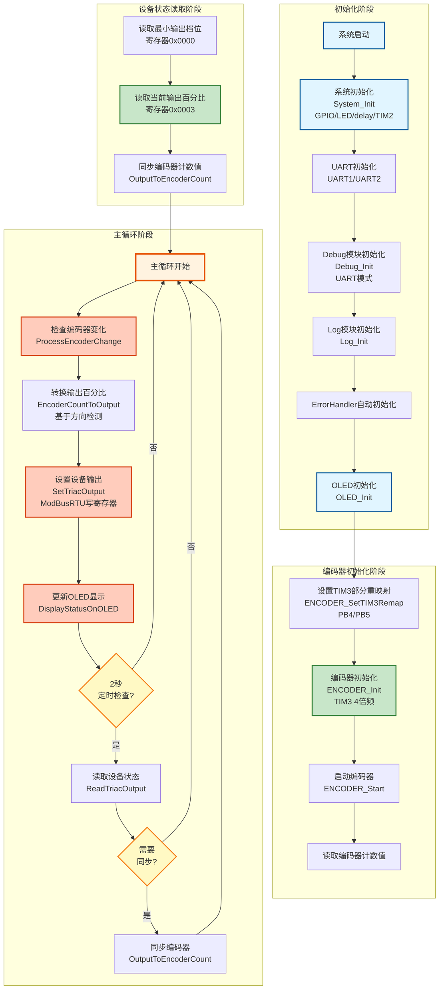
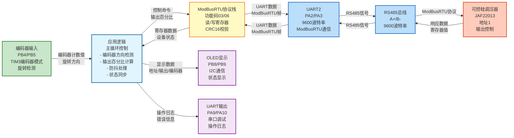

# Bus03 - ModBusRTU可控硅调压器控制示例

## 📋 案例目的

- **核心目标**：演示如何使用ModBusRTU协议通过UART2（RS485）控制JAF22013型可控硅数字调压器，通过编码器（PB4/PB5）控制输出百分比

- **学习重点**：
  - 理解ModBusRTU协议的基本使用方法
  - 掌握ModBusRTU模块的API调用（读保持寄存器、写单个寄存器）
  - 学习编码器接口的使用方法（TIM3编码器模式，PB4/PB5引脚）
  - 学习编码器计数值到输出百分比的映射和转换
  - 了解可控硅调压器的参数配置（地址、波特率、输出范围）
  - 学习标准初始化流程（System_Init → UART → Debug → Log → ErrorHandler → OLED → Encoder）

- **应用场景**：适用于工业调压控制、220V交流调压、电机调速、加热器功率控制等应用场景

## 🔧 硬件要求

### 必需外设

- **USART1**：
  - TX：`PA9`
  - RX：`PA10`
  - 波特率：`115200`
  - 数据格式：`8N1`（用于Debug输出）

- **USART2**：
  - TX：`PA2`
  - RX：`PA3`
  - 波特率：`9600`
  - 数据格式：`8N1`（用于ModBusRTU通信）

- **RS485模块**：
  - 连接UART2（PA2/PA3）
  - 支持自动方向控制（或手动控制DE/RE引脚）

- **OLED显示屏**：
  - SCL：`PB8`
  - SDA：`PB9`
  - 接口：软件I2C

- **编码器**：
  - A相：`PB4`（TIM3_CH1，部分重映射）
  - B相：`PB5`（TIM3_CH2，部分重映射）
  - 模式：4倍频（ENCODER_MODE_TI12）

- **JAF22013型可控硅数字调压器**：
  - 默认地址：`1`
  - 默认波特率：`9600bps`
  - 输入电压：AC 220V/110V，50/60Hz自适应
  - 最大驱动电流：5A（建议长时间运行≤4A）
  - 功率限制：220V时≤900W，110V时≤450W
  - 协议：ModBusRTU，功能码03/06

### 硬件连接

| STM32F103C8T6 | 外设/模块 | 说明 |
|--------------|----------|------|
| PA9 | USB转串口模块 TX | UART1发送引脚（Debug输出） |
| PA10 | USB转串口模块 RX | UART1接收引脚（Debug输入） |
| PA2 | RS485模块 TX | UART2发送引脚（ModBusRTU通信） |
| PA3 | RS485模块 RX | UART2接收引脚（ModBusRTU通信） |
| PB8 | OLED SCL | 软件I2C时钟线 |
| PB9 | OLED SDA | 软件I2C数据线 |
| PB4 | 编码器 A相 | TIM3_CH1（部分重映射） |
| PB5 | 编码器 B相 | TIM3_CH2（部分重映射） |
| 5V | RS485模块 VCC | RS485模块电源 |
| GND | RS485模块 GND | 地线 |
| A+ | 调压器总线 A+ | RS485总线正极 |
| B- | 调压器总线 B- | RS485总线负极 |

**⚠️ 重要提示**：
- 案例是独立工程，硬件配置在案例目录下的 `board.h`
- 如果硬件引脚不同，直接修改 `Examples/Bus/Bus03_ModBusRTU_220V_TRIAC/board.h` 中的配置即可
- RS485模块需要正确连接到UART2，并确保总线终端电阻配置正确
- 调压器地址默认为1，如果不同请修改代码中的`TRIAC_SLAVE_ADDRESS`
- **安全警告**：可控硅调压器连接220V交流电，操作时必须断电接线，严禁带电操作
- 编码器使用TIM3的部分重映射功能（PB4/PB5），需要在初始化前调用`ENCODER_SetTIM3Remap()`

## 📦 模块依赖

### 模块依赖关系图

展示本案例使用的模块及其依赖关系：



### 模块列表

本案例使用以下模块：

- `modbus_rtu`：ModBusRTU协议栈模块（核心功能）
- `uart`：UART驱动模块（ModBusRTU依赖）
- `timer_encoder`：定时器编码器模块（编码器接口）
- `oled_ssd1306`：OLED显示模块
- `soft_i2c`：软件I2C模块（OLED依赖）
- `debug`：Debug模块（UART输出功能）
- `log`：日志模块（分级日志输出）
- `error_handler`：错误处理模块（统一错误处理）
- `error_code`：错误码定义模块
- `delay`：延时模块
- `TIM2_TimeBase`：TIM2时间基准模块（delay依赖）
- `gpio`：GPIO驱动模块（UART、I2C、编码器依赖）
- `nvic`：NVIC中断管理模块（编码器中断依赖）
- `system_init`：系统初始化模块

## 🔄 实现流程

### 工作流程示意图

展示程序的完整执行流程：从初始化到主循环的各个阶段。



### 整体逻辑

程序按顺序执行以下步骤，然后进入主循环：

1. **系统初始化阶段**：
   - System_Init()：系统初始化（GPIO、LED、delay、TIM2_TimeBase）
   - UART_Init()：初始化UART1和UART2
   - Debug_Init()：初始化Debug模块（UART模式）
   - Log_Init()：初始化Log模块
   - ErrorHandler：自动初始化
   - OLED_Init()：初始化OLED显示

2. **编码器初始化阶段**：
   - ENCODER_SetTIM3Remap()：设置TIM3部分重映射（PB4/PB5）
   - ENCODER_Init()：初始化编码器（TIM3，4倍频模式）
   - ENCODER_Start()：启动编码器
   - 读取当前计数值并同步到设备输出值

3. **设备状态读取阶段**：
   - 读取最小输出档位（寄存器0x0000）
   - 读取当前输出百分比（寄存器0x0003）
   - 将设备输出值同步到编码器计数值

4. **主循环阶段**：
   - 持续监控编码器计数值变化
   - 基于当前输出值和编码器旋转方向，计算下一个输出百分比
   - 通过ModBusRTU设置设备输出百分比（0%, 20%~80%, 100%）
   - 每2秒读取一次设备状态，确保同步
   - 在OLED上显示当前状态（地址、输出百分比、编码器计数值）

### 关键功能实现

#### 1. 编码器到输出百分比的映射

编码器使用4倍频模式（ENCODER_MODE_TI12），每转产生4个计数。映射规则：

- **编码器计数值范围**：0~400（对应0%~100%）
- **输出百分比有效值**（按5%步进）：
  - 0%：寄存器值 `0x0000`
  - 20%~80%：寄存器值 `0x0014`~`0x0050`（按5%步进：20%, 25%, 30%, 35%, 40%, 45%, 50%, 55%, 60%, 65%, 70%, 75%, 80%）
  - 100%：寄存器值 `0x0064`
  - **注意**：设备不支持85%、90%、95%，从80%直接跳到100%

**编码器控制逻辑**（基于方向检测，扭一下就要有效果）：
- 从0%顺时针旋转：直接跳到20%
- 从20%开始：按5%步进（20% → 25% → 30% → ... → 75% → 80%）
- 从80%顺时针旋转：直接跳到100%
- 从100%逆时针旋转：直接跳到80%
- 从20%逆时针旋转：直接跳到0%

转换函数基于当前输出值和编码器旋转方向，确保每次旋转都有立即效果：
```c
static uint16_t EncoderCountToOutput(int32_t encoder_count, uint16_t current_output)
{
    // 检测编码器旋转方向
    int32_t encoder_delta = encoder_count - g_last_encoder_count;
    int16_t direction = (encoder_delta > 0) ? 1 : -1;  // 1=顺时针, -1=逆时针
    
    // 根据当前输出值和旋转方向决定下一个输出值
    if (current_percent == 0) {
        return (direction > 0) ? 20 : 0;  // 0% → 20% 或保持0%
    } else if (current_percent == 100) {
        return (direction > 0) ? 100 : 80;  // 100% → 80% 或保持100%
    } else if (current_percent == 80) {
        return (direction > 0) ? 100 : 75;  // 80% → 100% 或 80% → 75%
    } else {
        // 25%~75%之间，按5%步进
        return (direction > 0) ? (current_percent + 5) : (current_percent - 5);
    }
}
```

#### 2. 方向检测和步进控制

编码器控制采用方向检测机制，确保每次旋转都有立即效果：

- 检测编码器旋转方向（通过比较当前计数值和上次计数值）
- 根据当前输出值和旋转方向，计算下一个输出值
- 实现快速跳转：0% ↔ 20%、80% ↔ 100%
- 实现精确步进：20% ↔ 80%之间按5%步进

#### 3. 防抖处理

为避免编码器抖动导致频繁通信，实现防抖机制：

- 检查编码器计数值是否变化
- 检查时间间隔（至少100ms才更新一次）
- 检查目标输出值与当前值是否相同

#### 4. 状态同步

主循环中每2秒读取一次设备状态，确保编码器与设备输出值同步：

- 如果设备输出值被其他方式修改（如手动按键），自动同步编码器计数值
- 如果编码器旋转，自动更新设备输出值

### 数据流向图

展示本案例的数据流向：编码器输入 → 应用逻辑 → ModBusRTU通信 → 调压器控制，以及状态显示。



**数据流说明**：

1. **编码器输入**：
   - 编码器旋转产生计数值变化
   - TIM3编码器模式检测旋转方向和计数值

2. **应用逻辑处理**：
   - 检测编码器旋转方向（顺时针/逆时针）
   - 根据当前输出值和旋转方向计算下一个输出值
   - 实现快速跳转（0% ↔ 20%、80% ↔ 100%）和精确步进（20% ↔ 80%）
   - 防抖处理，避免频繁通信

3. **ModBusRTU通信**：
   - 将输出百分比转换为ModBusRTU写寄存器命令
   - 通过UART2发送到RS485总线
   - 读取设备状态，同步编码器计数值

4. **设备控制**：
   - 可控硅调压器接收ModBusRTU命令
   - 设置输出百分比（0%, 20%~80%, 100%）
   - 返回当前状态

5. **状态显示**：
   - OLED显示设备地址、当前输出百分比、编码器计数值
   - 串口输出操作日志和错误信息

## 📊 ModBusRTU寄存器说明

根据JAF22013型可控硅数字调压器开发资料，主要寄存器如下：

| 寄存器地址 | 功能说明 | 取值范围 | 功能码 |
| :--------- | :------- | :------- | :----- |
| **0x0000** | 最小输出档位 | 0x0000, 0x0014~0x0050, 0x0064 | 03/06 |
| **0x0001** | 波特率设置 | 0x0001~0x0003（1=4800,2=9600,3=19200） | 03/06 |
| **0x0002** | MODBUS地址 | 0x0001~0x00FE | 03/06 |
| **0x0003** | 输出值（百分比） | 0x0000, 0x0014~0x0050, 0x0064 | 03/06 |
| **0x0004** | 上电默认输出 | 0x0000, 0x000A~0x0032, 0x0064 | 03/06 |
| **0x0005** | 输出校准 | 0x0000, 0x0005, 0x000A, 0x000F, 0x0014 | 03/06 |
| **0x0020** | 复位重启 | 写入0x00AA触发复位 | 06（只写） |

### 输出百分比说明

- **0%**：寄存器值 `0x0000`
- **20%~80%**：寄存器值 `0x0014`~`0x0050`（按5%步进：20, 25, 30, 35, 40, 45, 50, 55, 60, 65, 70, 75, 80）
- **100%**：寄存器值 `0x0064`

**重要说明**：
- 设备只支持0%、20%~80%、100%，不支持85%、90%、95%
- 输出百分比与电压呈非线性关系
- 编码器控制采用方向检测机制，每次旋转都有立即效果
- 从80%顺时针旋转直接跳到100%，从100%逆时针旋转直接跳到80%

## 🎯 使用方法

### 1. 硬件连接

按照"硬件连接"表格连接所有硬件，特别注意：
- RS485模块正确连接到UART2
- 编码器A相连接到PB4，B相连接到PB5
- 可控硅调压器正确连接到RS485总线
- **安全警告**：调压器连接220V交流电，必须断电操作

### 2. 编译和下载

1. 使用Keil MDK打开工程文件（需要从其他案例复制.uvprojx文件）
2. 编译工程
3. 下载到STM32F103C8T6
4. 复位运行

### 3. 操作说明

1. **上电初始化**：
   - 系统自动初始化所有模块
   - 读取调压器当前状态
   - 同步编码器计数值到设备输出值

2. **控制输出**：
   - 旋转编码器可控制输出百分比
   - 顺时针旋转：增加输出百分比
   - 逆时针旋转：减少输出百分比
   - 输出范围：0%, 20%~80%, 100%（按5%步进：20%, 25%, 30%, ..., 75%, 80%, 100%）
   - **步进逻辑**：
     - 0% ↔ 20%：快速跳转（扭一下）
     - 20% ↔ 80%：按5%步进（每扭一下变化5%）
     - 80% ↔ 100%：快速跳转（扭一下）

3. **状态显示**：
   - OLED显示：设备地址、当前输出百分比、编码器计数值
   - 串口输出：操作日志和错误信息

### 4. 调试提示

- 如果无法通信，检查RS485模块连接和总线终端电阻
- 如果编码器无响应，检查PB4/PB5连接和TIM3重映射配置
- 如果输出值不正确，检查最小输出档位设置
- 查看串口日志了解详细运行状态

## ⚠️ 注意事项

1. **安全警告**：
   - 可控硅调压器连接220V交流电，操作时必须断电接线
   - 严禁带电操作，即使输出0V也禁止触摸输出端口
   - 必须接入负载才能正常工作

2. **负载要求**：
   - 支持纯阻性负载（电阻、热水棒、钨丝灯等）
   - 支持感性负载（交流风机风扇、单相电机、水泵等）
   - 不支持LED灯、电源适配器等电子设备

3. **输出限制**：
   - 220V时最大功率≤900W
   - 110V时最大功率≤450W
   - 建议长时间运行电流≤4A

4. **编码器使用**：
   - 编码器使用TIM3的部分重映射功能（PB4/PB5）
   - 必须在ENCODER_Init()之前调用ENCODER_SetTIM3Remap()
   - 编码器使用4倍频模式，每转4个计数

5. **参数修改**：
   - 修改波特率或地址后需发送复位指令（0x0020=0x00AA）生效
   - 建议不要修改校准参数（0x0005），除非必要

## 📚 参考资料

- JAF22013型可控硅数字调压器开发资料（见案例目录下的开发资料文档）
- ModBusRTU协议栈模块文档：`Middlewares/protocols/modbus_rtu/README.md`
- 编码器模块文档：`Drivers/timer/README.md`
- OLED模块文档：`Drivers/display/README.md`

## 🔍 故障排查

### 问题1：无法与调压器通信

**可能原因**：
- RS485模块未正确连接
- 总线终端电阻未配置
- 调压器地址不正确
- 波特率不匹配

**解决方法**：
- 检查RS485模块连接（A+/B-）
- 检查总线终端电阻（建议120Ω）
- 确认调压器地址（默认1）
- 确认波特率（默认9600）

### 问题2：编码器无响应

**可能原因**：
- 编码器未正确连接（PB4/PB5）
- TIM3重映射未配置
- 编码器初始化失败

**解决方法**：
- 检查编码器连接
- 确认在ENCODER_Init()之前调用了ENCODER_SetTIM3Remap()
- 查看串口日志确认编码器初始化状态

### 问题3：输出值不正确

**可能原因**：
- 最小输出档位设置不正确
- 编码器计数值映射错误
- 设备输出值被其他方式修改

**解决方法**：
- 读取并检查最小输出档位（寄存器0x0000）
- 检查编码器计数值映射逻辑
- 查看串口日志确认设备状态

## 📝 版本历史

- **v1.1.0** (2024-01-01)：优化版本
  - 优化编码器控制逻辑，采用方向检测机制
  - 实现快速跳转：0% ↔ 20%、80% ↔ 100%
  - 实现精确步进：20% ↔ 80%之间按5%步进
  - 确保每次旋转都有立即效果
  - 修复设备不支持85%、90%、95%的问题

- **v1.0.0** (2024-01-01)：初始版本
  - 实现ModBusRTU通信控制
  - 实现编码器控制输出百分比
  - 实现OLED状态显示
  - 实现状态同步机制

