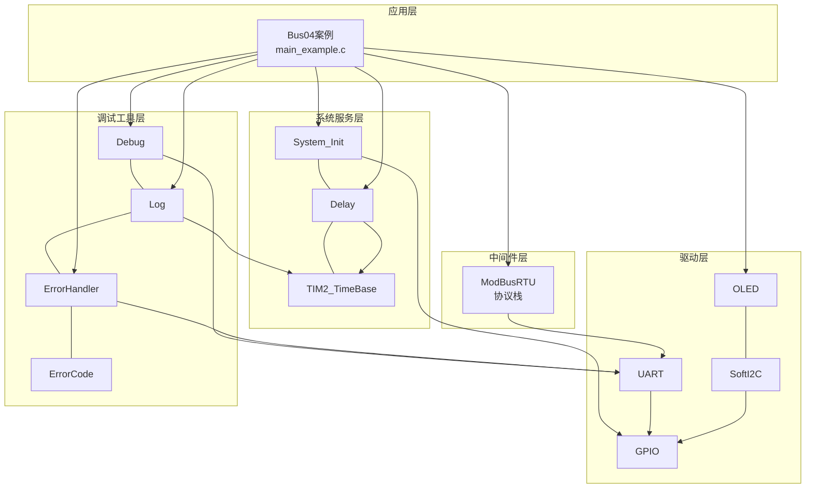
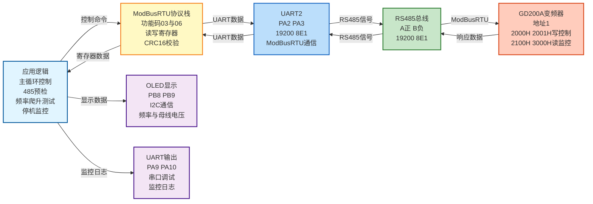

# Bus04 - ModBusRTU英威腾GD200A变频器485通讯示例

## 📋 案例目的

- **核心目标**：演示如何使用ModBusRTU协议通过UART2（RS485）与英威腾**GD200A**变频器通讯，完成485链路验证、运行数据批量监控、频率爬升正反转自动测试

- **学习重点**：
  - 理解ModBusRTU协议在工业变频器上的应用（功能码03读、06写）
  - 掌握19200 8E1偶校验在STM32 SPL上的正确配置（9位字长）
  - 学习英威腾GD200A寄存器地址与数据比例（2000H/2001H写控制，2100H/3000H读监控）
  - 学习运行中调频与换向的写寄存器顺序（先2001H设频，再2000H启停/换向）
  - 学习批量读寄存器与一参数一行日志输出格式
  - 学习标准初始化流程（System_Init → UART → Debug → Log → ErrorHandler → OLED）

- **应用场景**：适用于变频器485监控、ModBus主站开发验证、工业电机正反转测试、设备数据采集等场景

| 阶段 | 内容 | 状态 |
|------|------|------|
| 阶段 1 | FC03读寄存器，验证485通讯 | ✅ 已完成 |
| 阶段 2 | 批量读取监控数据，串口一参数一行输出 | ✅ 已完成 |
| 阶段 3 | 正转25→35Hz每5s加5Hz，再反转25→35Hz，最后停机监控 | ✅ 已实现 |

**详细寄存器与RTU帧**：见 [开发指令速查.md](开发指令速查.md)

## 🔧 硬件要求

### 必需外设

- **USART1**：
  - TX：`PA9`
  - RX：`PA10`
  - 波特率：`115200`
  - 数据格式：`8N1`（用于Debug输出）

- **USART2**：
  - TX：`PA2`
  - RX：`PA3`
  - 波特率：`19200`（固定，须与GD200A P14.01一致）
  - 数据格式：`8E1`（偶校验，STM32须配置为9位字长）

- **RS485模块**：
  - 连接UART2（PA2/PA3）
  - 支持自动方向控制（或手动控制DE/RE引脚）

- **OLED显示屏**：
  - SCL：`PB8`
  - SDA：`PB9`
  - 接口：软件I2C

- **英威腾GD200A变频器**：
  - 默认地址：`1`（P14.00）
  - 通讯波特率：`19200bps`（P14.01=4）
  - 数据格式：`8E1`（P14.02=1）
  - 识别码：`0x0107`（2103H读取）
  - 协议：ModBusRTU，功能码03/06

### 硬件连接

| STM32F103C8T6 | 外设/模块 | 说明 |
|--------------|----------|------|
| PA9 | USB转串口模块 TX | UART1发送引脚（Debug输出） |
| PA10 | USB转串口模块 RX | UART1接收引脚（Debug输入） |
| PA2 | RS485模块 TX | UART2发送引脚（ModBusRTU通信） |
| PA3 | RS485模块 RX | UART2接收引脚（ModBusRTU通信） |
| PB8 | OLED SCL | 软件I2C时钟线 |
| PB9 | OLED SDA | 软件I2C数据线 |
| 5V | RS485模块 VCC | RS485模块电源 |
| GND | RS485模块 GND + GD200A SG | **必须共地** |
| A+ | GD200A 485+ | RS485总线正极 |
| B- | GD200A 485- | RS485总线负极 |

**⚠️ 重要提示**：
- 案例是独立工程，硬件配置在案例目录下的 `board.h`
- 如果硬件引脚不同，直接修改 `Examples/Bus/Bus04_ModBusRTU_Invt_GD200A/board.h` 中的配置即可
- RS485模块需要正确连接到UART2，长距离总线建议末端加120Ω终端电阻
- GD200A从站地址默认为1，如果不同请修改代码中的`INVT_SLAVE_ADDRESS`
- **安全警告**：阶段3会自动正反转运行电机，测试前确认负载可安全换向，测试时人在旁监护
- A/B接反会导致无响应或CRC错误，不通时对调A/B

### 变频器参数（必须与代码一致）

#### P14 通讯组

| 参数 | 值 | 说明 |
|------|-----|------|
| P14.00 | **1** | 从站地址 |
| P14.01 | **4** | 19200bps |
| P14.02 | **1** | 偶校验8E1 |
| P14.05 | 1 | 传输错误不报警（建议） |
| P14.06 | 0x000 | 使用标准寄存器地址 |

#### P00 组（阶段3写控制必配）

| 参数 | 值 | 说明 |
|------|-----|------|
| P00.01 | **2** | 运行指令通道 = 通讯 |
| P00.06 | **8** | 频率源 = ModBus通讯设定 |

## 📦 模块依赖

### 模块依赖关系图

展示本案例使用的模块及其依赖关系：



### 模块列表

本案例使用以下模块：

- `modbus_rtu`：ModBusRTU协议栈模块（核心功能）
- `uart`：UART驱动模块（ModBusRTU依赖，含RTU紧凑收包）
- `oled_ssd1306`：OLED显示模块
- `soft_i2c`：软件I2C模块（OLED依赖）
- `debug`：Debug模块（UART输出功能）
- `log`：日志模块（分级日志输出）
- `error_handler`：错误处理模块（统一错误处理）
- `error_code`：错误码定义模块
- `delay`：延时模块（含非阻塞延时）
- `TIM2_TimeBase`：TIM2时间基准模块（delay依赖）
- `gpio`：GPIO驱动模块（UART、I2C依赖）
- `system_init`：系统初始化模块

## 🔄 实现流程

### 整体逻辑

程序按顺序执行以下步骤，测试完成后进入停机监控循环：

1. **系统初始化阶段**：
   - System_Init()：系统初始化（GPIO、LED、delay、TIM2_TimeBase）
   - UART_Init()：初始化UART1和UART2
   - Debug_Init()：初始化Debug模块（UART模式）
   - Log_Init()：初始化Log模块
   - ErrorHandler：自动初始化
   - OLED_Init()：初始化OLED显示

2. **485通讯预检阶段**（阶段1/2）：
   - 批量读取2100H~2103H（状态块）和3000H~300FH（监控块）
   - 额外读取3010H（高速脉冲）、3012H（多段速）
   - 验证识别码2103H = 0x0107（GD200A）
   - 预检失败则停止运行，避免后续误操作

3. **频率爬升正反转测试阶段**（阶段3）：
   - 预停机（2000H=0005H），等待1秒
   - **正转爬升**：25→30→35Hz，每档保持5秒
     - 首档：写2001H设频 + 写2000H=0001H启动
     - 后续档：只写2001H加频（运行中调频）
   - **反转爬升**：25→30→35Hz，每档保持5秒
     - 首档：写2001H设频 + 写2000H=0002H换向
     - 后续档：只写2001H加频
   - 写2000H=0005H停机
   - 总时长约30秒（正转15s + 反转15s）

4. **停机监控阶段**（阶段2/3结束后）：
   - 每2秒批量读取全量寄存器
   - 串口一参数一行输出（LogInvtSnapshot）
   - OLED显示运行频率与母线电压
   - 通讯失败时显示错误并自动重试

### GD200A寄存器地址

根据开发指令速查文档：

| 寄存器地址 | 功能 | 说明 |
|----------|------|------|
| `0x2000` | 通讯运行命令 | 0001=正转，0002=反转，0005=停机 |
| `0x2001` | 通讯设定频率 | 比例0.01Hz（25Hz→2500） |
| `0x2100` | 状态字1 | 0001=正转运行，0002=反转，0003=停机，0004=故障 |
| `0x2101` | 状态字2 | 控制源、运行就绪等 |
| `0x2102` | 故障码 | 非零表示故障 |
| `0x2103` | 识别码 | **0x0107=GD200A**（勿与2102混淆） |
| `0x3000` | 运行频率 | 比例0.01Hz |
| `0x3001` | 设定频率 | 比例0.01Hz |
| `0x3002` | 母线电压 | 比例**0.1V**（5840→584.0V） |
| `0x3003`~`0x300F` | 输出电压/电流/转速/IO/AI等 | 见开发指令速查 |
| `0x3010` | 高速脉冲输入 | 比例0.01kHz |
| `0x3012` | 多段速当前段 | 无效时显示N/A |

### 频率爬升明细

| 阶段 | 频率 (Hz) | 每档保持 | 说明 |
|------|-----------|----------|------|
| 正转 | 25 → 30 → 35 | 各 5s | 首档写2001H+0001H，后续只写2001H |
| 反转 | 25 → 30 → 35 | 各 5s | 换向时写2001H+0002H，后续只写2001H |

测试参数可在 `main_example.c` 中修改：

```c
#define INVT_TEST_FREQ_START_HZ     25
#define INVT_TEST_FREQ_END_HZ       35
#define INVT_TEST_FREQ_STEP_HZ      5
#define INVT_TEST_STEP_MS           5000    /* 每档保持时间 ms */
```

### OLED显示内容

- **第1行**：案例标题 "Bus04 GD200A"
- **第2行**：通讯状态（"RS485: OK" 或 "RS485: FAIL"）
- **第3行**：运行频率（如 "Run:25.00Hz"）或错误信息
- **第4行**：母线电压（如 "Udc:584V"）或 "Retrying..."

显示格式示例：
```
Bus04 GD200A
RS485: OK
Run:25.00Hz
Udc:584V
```

### 串口输出格式

#### 运行中（阶段3简要日志）

```text
[INFO ][INVT] >> 正转 启动 25 Hz
[INFO ][INVT]    保持 25 Hz (正转) 5秒...
[INFO ][INVT] >> 正转 加频至 30 Hz
[INFO ][INVT] >> 正转 加频至 35 Hz
[INFO ][INVT] << 正转 爬升结束
[INFO ][INVT] >> 反转 启动 25 Hz
...
[INFO ][INVT] << 反转 爬升结束
[INFO ][MAIN] === 频率爬升测试完成，已停机 ===
```

#### 停机监控（一参数一行）

```text
[INFO ][INVT] ---------- GD200A #1 ----------
[INFO ][INVT] 状态字1(2100H): 0x0003 停机
[INFO ][INVT] 运行频率(3000H): 0.00 Hz
[INFO ][INVT] 母线电压(3002H): 583.9 V
[INFO ][INVT] 识别码(2103H): 0x0107 GD200A
[INFO ][INVT] ...
[INFO ][INVT] --------------------------------
```

### 数据流向图

展示本案例的数据流向：STM32 → ModBusRTU通信 → GD200A变频器



### 工作流程示意图

展示完整的工作流程，包括初始化、预检、频率爬升测试、停机监控等阶段：

```mermaid
%%{init: {'flowchart': {'curve': 'basis'}}}%%
flowchart TD
    START[系统启动] --> INIT[系统初始化]
    
    INIT --> INIT_SYS[System_Init<br/>GPIO LED Delay TIM2]
    INIT_SYS --> INIT_UART1[UART_Init<br/>UART1 115200]
    INIT_UART1 --> INIT_UART2[UART_Init<br/>UART2 19200 8E1]
    INIT_UART2 --> INIT_DEBUG[Debug_Init<br/>UART模式]
    INIT_DEBUG --> INIT_LOG[Log_Init<br/>分级日志]
    INIT_LOG --> INIT_OLED[OLED_Init<br/>I2C显示]
    INIT_OLED --> INIT_DONE[初始化完成]
    
    INIT_DONE --> PRECHECK[485通讯预检<br/>读2100H与3000H]
    PRECHECK --> CHECK_OK{预检成功}
    CHECK_OK -->|否| ERROR_STOP[停止运行<br/>等待排查]
    CHECK_OK -->|是| PRE_STOP[预停机<br/>2000H写0005H]
    
    PRE_STOP --> FWD_RAMP[正转频率爬升<br/>25到30到35Hz<br/>每档5秒]
    FWD_RAMP --> REV_RAMP[反转频率爬升<br/>25到30到35Hz<br/>每档5秒]
    REV_RAMP --> STOP_CMD[写停机<br/>2000H写0005H]
    STOP_CMD --> MONITOR[停机监控循环<br/>每2秒读全量]
    
    MONITOR --> READ_DATA[ReadInvtSnapshot<br/>批量读寄存器]
    READ_DATA --> LOG_OUT[LogInvtSnapshot<br/>一参数一行输出]
    LOG_OUT --> OLED_UPDATE[DisplaySnapshotOnOLED<br/>更新显示]
    OLED_UPDATE --> WAIT[延时2秒]
    WAIT --> MONITOR
    
    classDef styleInit fill:#e3f2fd,stroke:#1565c0,stroke-width:2px
    classDef styleCheck fill:#fff3e0,stroke:#e65100,stroke-width:2px
    classDef styleTest fill:#e8f5e9,stroke:#2e7d32,stroke-width:2px
    classDef styleMonitor fill:#f3e5f5,stroke:#4a148c,stroke-width:2px
    classDef styleError fill:#ffebee,stroke:#c62828,stroke-width:2px
    
    class INIT,INIT_SYS,INIT_UART1,INIT_UART2,INIT_DEBUG,INIT_LOG,INIT_OLED,INIT_DONE styleInit
    class PRECHECK,CHECK_OK,PRE_STOP styleCheck
    class FWD_RAMP,REV_RAMP,STOP_CMD styleTest
    class MONITOR,READ_DATA,LOG_OUT,OLED_UPDATE,WAIT styleMonitor
    class ERROR_STOP styleError
```



## 📚 关键函数说明

### ModBusRTU相关函数

- **`ModBusRTU_ReadHoldingRegisters()`**：读取保持寄存器数据
  - 在本案例中用于批量读取2100H状态块、3000H监控块、3010H/3012H扩展寄存器
  - 通过`ReadHoldingRegsRetry()`封装，支持失败重试

- **`ModBusRTU_WriteSingleRegister()`**：写单个寄存器
  - 在本案例中用于写2001H设频、2000H启停/换向命令
  - 通过`WriteRegRetry()`封装，支持失败重试

### 案例私有函数

- **`ReadInvtSnapshot()`**：批量读取GD200A全量监控数据，填充`InvtSnapshot_t`结构体

- **`LogInvtSnapshot()`**：将快照数据按寄存器地址一参数一行输出到串口

- **`InvtSetFrequencyHz()`**：写2001H设定频率（Hz×100）

- **`InvtSendRunCmd()`**：写2000H发送正转/反转/停机命令

- **`RunFreqRampPhase()`**：单方向频率爬升（25→30→35Hz，每档5秒）

- **`RunInvtFreqRampTest()`**：完整测试流程（正转爬升→反转爬升→停机）

- **`DisplaySnapshotOnOLED()`**：在OLED上显示通讯状态、运行频率、母线电压

### UART相关函数

- **`UART_Init()`**：初始化UART外设
  - 在本案例中用于初始化UART1（Debug输出）和UART2（ModBusRTU通信）
  - 必须按照标准初始化流程，先初始化UART，再初始化Debug模块

- **`UART_ReceiveRtuFrame()`**：紧凑轮询接收RTU帧
  - 在本案例中用于避免485 Overrun错误，收包时序见uart.c

### OLED相关函数

- **`OLED_Init()`**：初始化OLED显示模块
  - 使用软件I2C接口（PB8/PB9），配置在`board.h`中定义

- **`OLED_ShowString()`**：显示字符串
  - 在本案例中用于显示运行频率、母线电压等信息

### 日志相关函数

- **`LOG_INFO()`**：输出信息级别日志
  - 在本案例中用于输出预检结果、频率爬升过程、监控数据

- **`LOG_ERROR()`**：输出错误级别日志
  - 在本案例中用于输出通讯失败、设频失败等错误信息

**详细函数实现和调用示例请参考**：`main_example.c` 中的代码

## ⚠️ 注意事项与重点

### ⚠️ 重要提示

1. **标准初始化流程**：
   - 必须遵循 System_Init → UART → Debug → Log → ErrorHandler → OLED 的顺序
   - 这是项目规范要求的标准初始化流程，不能改变顺序

2. **19200 8E1配置**：
   - GD200A P14.01=4、P14.02=1，对应19200 8E1
   - STM32偶校验**必须**使用9位字长：`USART_WordLength_9b` + `USART_Parity_Even`
   - 配置错误会导致BadRsp、CRC错误或Overrun

3. **写控制顺序（官方要求）**：
   - 先写2001H设频 → 延时≥80ms → 再写2000H启停/换向
   - 运行中调频只需写2001H，不必停机
   - 换向时可直接写2000H=0002H，变频器内部会减速换向

4. **P00参数必配（阶段3）**：
   - P00.01=2（运行指令通道=通讯）
   - P00.06=8（频率源=ModBus通讯设定）
   - 未配置时只能读不能写控制

5. **安全提示**：
   - 阶段3会自动正反转运行电机，测试前确认负载可安全换向
   - 测试时人在旁监护，随时准备按变频器面板急停
   - 识别码读2103H（0x0107），2102H是故障码不是识别码

6. **Keil工程配置**：
   - 若目录下无`Examples.uvprojx`，请从Bus02复制并修改路径
   - AI禁止直接写入`.uvprojx`文件

### 🔑 关键点

1. **ModBusRTU协议栈使用**：
   - 使用功能码03（读保持寄存器）读取监控数据
   - 使用功能码06（写单个寄存器）设频和控制启停
   - CRC16校验由协议栈自动处理，无需手动计算

2. **数据比例理解**：
   - 2001H/3000H/3001H：0.01Hz（2500→25.00Hz）
   - 3002H母线电压：0.1V（5840→584.0V，**不是**5840V）
   - 3004H输出电流：0.1A
   - AI通道0xFFFF表示无效，应显示N/A

3. **485收包时序**：
   - 发送后不可长时间Delay_ms阻塞，否则RX溢出（Overrun -910）
   - 使用`UART_ReceiveRtuFrame`紧凑轮询收包
   - 发送时丢弃RX回波，避免误判

4. **错误处理策略**：
   - 预检失败时程序停止，避免对未知设备写控制
   - 测试中止时自动发送停机命令
   - 监控阶段通讯失败不停止，显示错误并自动重试

## 🔍 常见问题排查

### 问题1：485通讯预检失败（Timeout）

**现象**：串口输出"通讯预检失败: Timeout"，程序停止

**可能原因**：
- RS485模块连接不正确
- GD200A未上电或P14参数未配置
- 波特率/校验与P14不一致（须19200 8E1）
- RS485总线A/B接反或未共地
- 从站地址不是1

**解决方法**：
1. 检查RS485模块连接是否正确（PA2/PA3）
2. 检查GD200A是否上电，面板无故障
3. 核对P14.00=1、P14.01=4、P14.02=1
4. 确认`board.h`中UART2为19200 9b+Even
5. 检查GND与GD200A SG共地，A/B不通时对调
6. 使用串口助手查看UART2收发数据

### 问题2：BadRsp / Overrun错误

**现象**：串口输出"BadRsp"或"Overrun (-910)"

**可能原因**：
- 8E1未用9位字长配置
- MCU收包时序不当，发送后长时间阻塞
- RS485方向控制异常

**解决方法**：
1. 确认`board.h`使用`USART_WordLength_9b` + `USART_Parity_Even`
2. 确认已使用最新`uart.c`和`modbus_rtu.c`（紧凑收包）
3. 检查RS485模块自动方向是否正常
4. 参考Bus02案例对比485模块接线

### 问题3：能设频但不运行

**现象**：写2001H成功，写2000H后电机不转

**可能原因**：
- P00.01≠2（运行指令通道不是通讯）
- P00.06≠8（频率源不是ModBus）
- 变频器处于故障状态（2100H=0004）
- 写顺序错误（先2000H后2001H）

**解决方法**：
1. 设置P00.01=2、P00.06=8
2. 读2100H确认非故障状态，2102H查故障码
3. 严格按"先2001H设频→延时80ms→再2000H命令"顺序
4. 参考开发指令速查文档核对寄存器值

### 问题4：母线电压显示异常大

**现象**：母线电压显示5839V等异常值

**可能原因**：
- 数据比例理解错误
- 读取了错误寄存器

**解决方法**：
1. 3002H单位为**0.1V**，5840表示584.0V
2. 确认读取地址为3002H而非其他寄存器
3. 参考`InvtBusVoltageV()`函数的实现

### 问题5：识别码读取错误

**现象**：识别码显示非0x0107，或误把2102H当识别码

**可能原因**：
- 2102H是故障码，2103H才是识别码
- 寄存器地址偏移错误

**解决方法**：
1. 识别码读**2103H**，GD200A正确值为**0x0107**
2. 2102H为故障码，非零表示有故障
3. 参考开发指令速查第四节寄存器表

### 问题6：OLED无显示

**现象**：OLED屏幕无显示

**可能原因**：
- OLED连接不正确（PB8/PB9）
- OLED未上电
- 软件I2C配置不正确

**解决方法**：
1. 检查OLED连接是否正确（PB8=SCL，PB9=SDA）
2. 检查OLED是否上电（3.3V或5V电源）
3. 检查`board.h`中的`SOFT_I2C_CONFIGS`配置
4. 查看串口日志，确认OLED初始化是否成功

## 💡 扩展练习

### 循序渐进部分

1. **参数化测试配置**：
   - 通过串口命令动态修改起始/结束频率、步进、保持时间
   - 添加测试次数计数和累计运行时间统计

2. **故障监测与报警**：
   - 实时监测2102H故障码，故障时自动停机并输出故障描述
   - 在OLED上显示故障状态

3. **多段速控制**：
   - 利用3012H多段速寄存器实现更复杂的速度曲线
   - 结合3010H高速脉冲输入做闭环控制

### 实际场景坑点部分

4. **通讯可靠性优化**：
   - 实现通讯质量统计（成功率、平均响应时间）
   - 添加通讯故障自动恢复（连续失败N次后重新初始化UART）

5. **非阻塞主循环**：
   - 将频率爬升测试改为状态机，避免阻塞Delay
   - 监控与测试可并行，提高系统响应性

6. **数据记录与导出**：
   - 将监控快照写入外部Flash或SD卡
   - 实现历史数据曲线分析（频率、电流、母线电压趋势）

## 📖 相关文档

### 模块文档

- **ModBusRTU模块**：`Middlewares/protocols/modbus_rtu/modbus_rtu.c/h`
- **UART模块**：`Drivers/uart/uart.c/h`
- **OLED模块**：`Drivers/display/oled_ssd1306/oled_ssd1306.c/h`
- **软件I2C模块**：`Drivers/i2c/i2c_sw.c/h`
- **Debug模块**：`Debug/debug.c/h`
- **Log模块**：`Debug/log.c/h`
- **ErrorHandler模块**：`Common/error_handler.c/h`

### 业务文档

- **主程序代码**：`Examples/Bus/Bus04_ModBusRTU_Invt_GD200A/main_example.c`
- **硬件配置**：`Examples/Bus/Bus04_ModBusRTU_Invt_GD200A/board.h`
- **模块配置**：`Examples/Bus/Bus04_ModBusRTU_Invt_GD200A/config.h`
- **开发指令速查**：`Examples/Bus/Bus04_ModBusRTU_Invt_GD200A/开发指令速查.md`
- **项目规范**：`../../AI/README.md`（AI规则体系）
- **案例参考**：`Examples/README.md`

## 🔗 相关案例

- **Bus02_ModBusRTU_Relay**：ModBusRTU继电器控制示例（485基础、Keil工程模板）
- **Bus01_ModBusRTU_GasSensor**：ModBusRTU传感器读取示例
- **Bus03_ModBusRTU_220V_TRIAC**：ModBusRTU可控硅调压器控制示例

---

**最后更新**：2026-06-20
