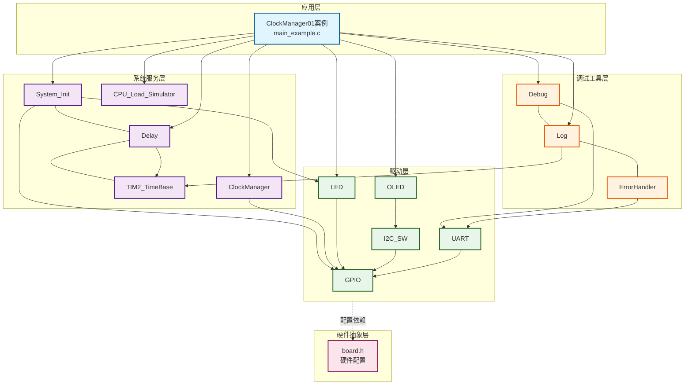
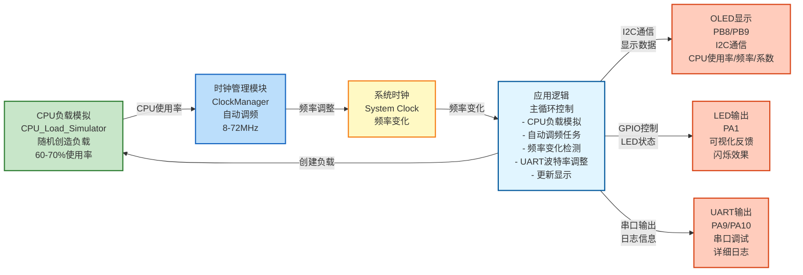
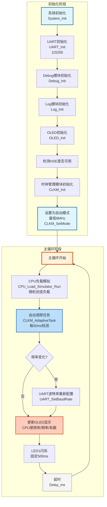

# ClockManager01_AdaptiveFrequency - 时钟管理自适应频率调整

## 📋 案例目的

- **核心目标**：测试clock_manager模块的自动调频功能，通过CPU负载模拟验证自动调频策略
- **学习重点**：
  - 理解时钟管理模块的自动调频机制
  - 掌握CPU负载检测和频率调整策略
  - 学习时钟管理模块的初始化和配置
  - 了解不同频率档位的特性和应用场景
  - 学习CPU负载模拟和可视化反馈
  - **重点**：理解频率变化时UART波特率的动态调整原理
- **应用场景**：适用于需要动态功耗管理的应用，如电池供电设备、低功耗系统等

## 🔧 硬件要求

### 必需外设

- **LED1**：`PA1`（固定500ms闪烁，用于观察延时）

### 传感器/模块

- **OLED显示屏**（SSD1306，I2C接口）
  - SCL：`PB8`
  - SDA：`PB9`
  - VCC：3.3V
  - GND：GND

### 外部晶振要求

- **有外部晶振（HSE，8MHz）**：可以切换到72MHz，自动调频功能完整
- **无外部晶振**：自动保持8MHz，调频功能受限（只能使用HSI频率）

### 硬件连接

| STM32F103C8T6 | 外设/模块 | 说明 |
|--------------|----------|------|
| PA1 | LED1正极 | LED1负极接GND |
| PA9 | UART1 TX | 串口发送（连接USB转串口模块RX） |
| PA10 | UART1 RX | 串口接收（连接USB转串口模块TX） |
| PB8 | OLED SCL | I2C时钟线 |
| PB9 | OLED SDA | I2C数据线 |
| 3.3V | OLED VCC | 电源 |
| GND | OLED GND | 地线 |

**⚠️ 重要提示**：
- 案例是独立工程，硬件配置在案例目录下的 `board.h` 中
- 如果硬件引脚不同，直接修改 `Examples/ClockManager/ClockManager01_AdaptiveFrequency/board.h` 中的配置即可

## 📦 模块依赖

### 模块依赖关系图

展示本案例使用的模块及其依赖关系：



### 模块列表

本案例使用以下模块：

- `clock_manager`：时钟管理模块（核心功能）
- `cpu_load_simulator`：CPU负载模拟模块（用于测试）
- `oled`：OLED显示驱动模块（用于显示状态）
- `i2c_sw`：软件I2C驱动模块（OLED使用）
- `led`：LED驱动模块（用于可视化反馈）
- `delay`：延时模块
- `TIM2_TimeBase`：TIM2时间基准模块（delay依赖）
- `gpio`：GPIO驱动模块（所有模块依赖）
- `system_init`：系统初始化模块
- `uart`：UART串口通信模块（串口调试，新项目必须）
- `debug`：Debug模块（printf重定向，新项目必须）
- `log`：日志模块（分级日志系统，新项目必须）
- `error_handler`：错误处理模块（统一错误处理，新项目必须）

## 🔄 实现流程

### 整体逻辑

本案例通过CPU负载模拟和自动调频功能，演示时钟管理模块的动态功耗管理。整体流程如下：

1. **初始化阶段**
   - 系统初始化
   - UART初始化（115200波特率）
   - Debug和Log模块初始化
   - OLED初始化
   - 检测HSE是否可用
   - 时钟管理模块初始化
   - 设置为自动模式（最低8MHz）

2. **主循环**
   - CPU负载模拟（60秒周期内随机启动，运行1-5秒）
   - 自动调频任务（每50ms检测一次CPU负载）
   - 频率变化检测和UART波特率重新配置
   - 更新OLED显示（CPU使用率、系数、频率等）
   - 控制LED1闪烁（固定500ms）

### 关键方法

- **自动调频策略**：
  - CPU使用率 > 50%：升频3档，升频间隔1秒，最高72MHz
  - CPU使用率 < 30%：降频1档，降频间隔5秒，最低8MHz

- **CPU负载模拟**：
  - 60秒周期内随机时间创造CPU使用率60-70%
  - 每次运行1-5秒不等
  - 随机间隔启动

- **频率变化时的UART波特率调整**：
  - 检测到频率变化时，自动调用`UART_SetBaudRate()`重新配置UART波特率
  - 确保串口输出在频率变化后仍然正常

### 数据流向图

展示本案例的数据流向：CPU负载模拟 → 时钟管理 → 频率调整 → 输出显示



**数据流说明**：

1. **CPU负载模拟**：
   - **CPU_Load_Simulator模块**：随机创造CPU负载（60-70%使用率）
   - 60秒周期内随机时间启动，每次运行1-5秒

2. **时钟管理**：
   - **ClockManager模块**：根据CPU使用率自动调整系统频率
   - CPU使用率 > 50%：升频3档（最高72MHz）
   - CPU使用率 < 30%：降频1档（最低8MHz）

3. **系统时钟**：
   - **系统时钟**：频率在8MHz-72MHz之间动态调整
   - 频率变化时，UART波特率自动重新配置

4. **应用逻辑**：
   - 主循环中执行CPU负载模拟、自动调频任务
   - 检测频率变化并调整UART波特率
   - 更新OLED显示和LED状态

5. **输出设备**：
   - **OLED**：显示CPU使用率、当前频率、系数等信息
   - **LED**：通过GPIO控制，可视化反馈（固定500ms闪烁）
   - **UART**：输出详细日志信息（支持中文）

### 工作流程示意



## 📚 关键函数说明

### 时钟管理相关函数

- **`CLKM_Init()`**：初始化时钟管理模块
  - 在本案例中用于初始化时钟管理模块
  - 设置默认频率为72MHz（系数1）

- **`CLKM_SetMode()`**：设置时钟管理模式
  - 在本案例中用于设置为自动模式，最低频率为8MHz
  - 参数：CLKM_MODE_AUTO（自动模式），CLKM_LVL_8MHZ（最低8MHz）

- **`CLKM_AdaptiveTask()`**：自适应任务
  - 在本案例中用于每50ms检测一次CPU负载，根据负载自动调整频率
  - 新策略：<30%降频1档（5秒），>50%升频3档（1秒）

- **`CLKM_GetCurrentFrequency()`**：获取当前系统频率
  - 在本案例中用于检测频率变化
  - 返回当前系统时钟频率（Hz）

- **`CLKM_IdleHook()`**：空闲钩子函数
  - 在本案例中用于在低负载时调用，统计空闲时间
  - 用于计算CPU使用率

### UART波特率动态调整相关函数

- **`UART_SetBaudRate(USART_TypeDef *uart_periph, uint32_t baudrate)`**：动态修改UART波特率
  - **功能**：在系统频率变化后，重新配置UART波特率，确保串口通信正常
  - **实现原理**：
    1. **获取当前APB时钟频率**：通过`RCC_GetClocksFreq()`获取当前UART的PCLK时钟频率
       - USART1使用PCLK2（APB2时钟）
       - USART2/3使用PCLK1（APB1时钟）
    2. **计算BRR寄存器值**：`BRR = (PCLK + baudrate/2) / baudrate`（四舍五入）
       - STM32F1系列UART使用16倍过采样，BRR直接等于PCLK/波特率
       - 四舍五入确保波特率误差最小
    3. **等待发送完成**：检查`USART_FLAG_TC`标志，确保当前数据发送完成
    4. **清空接收缓冲区**：检查`USART_FLAG_RXNE`标志，清空接收到的数据
    5. **短暂关闭UART**：清除`USART_CR1_UE`位，防止修改BRR时数据错乱
    6. **写入新BRR值**：直接写入`USART_BRR`寄存器
    7. **重新使能UART**：设置`USART_CR1_UE`位，UART恢复正常工作
  - **执行时间**：< 1μs（仅修改寄存器，不重新初始化）
  - **优势**：
    - 不影响UART其他配置（数据位、停止位、校验位等）
    - 不丢失发送/接收状态
    - 执行速度快，适合在频率变化时实时调用
  - **使用场景**：系统频率变化后必须调用，否则串口输出会乱码
  - **在本案例中的使用**：
    ```c
    if (current_freq != last_freq) {
        last_freq = current_freq;
        UART_SetBaudRate(USART1, UART_DEFAULT_BAUDRATE);  // 115200
    }
    ```

### CPU负载模拟相关函数

- **`SimulateHighLoad()`**：模拟CPU高负载
  - 在本案例中用于模拟60-70%的CPU使用率
  - 在指定时间内，60-70%时间执行空循环，30-40%时间调用空闲钩子

### OLED相关函数

- **`OLED_Init()`**：初始化OLED显示屏
  - 在本案例中用于初始化OLED，显示CPU使用率、系数、频率等信息

- **`OLED_ShowString()`**：显示字符串
  - 在本案例中用于显示CPU使用率、系数、频率、任务状态等信息

### LED相关函数

- **`LED1_On()`** / **`LED1_Off()`**：LED1控制函数
  - 在本案例中用于固定500ms闪烁，用于观察延时

**详细函数实现和调用示例请参考**：`main_example.c` 中的代码

## 🔄 标准初始化流程

本案例遵循新项目标准初始化模板，初始化顺序如下：

```
1. System_Init()          // 系统初始化（GPIO、LED、delay、TIM2_TimeBase）
2. UART_Init()            // UART初始化（串口通信，115200波特率）
3. Debug_Init()           // Debug模块初始化（UART模式，printf重定向）
4. Log_Init()             // Log模块初始化（分级日志系统）
5. ErrorHandler初始化     // 错误处理模块（自动初始化，无需显式调用）
6. OLED_Init()            // OLED初始化（显示状态）
7. CLKM_Init()            // 时钟管理模块初始化
8. CLKM_SetMode()         // 设置时钟管理模式（自动模式）
```

**输出分工规范**：
- **串口（UART）**：详细日志、调试信息、错误详情（支持中文，GB2312编码）
- **OLED**：关键状态、实时数据、简要提示（全英文，ASCII字符）
- **双边输出**：系统启动信息、关键错误、重要状态变化

## 🔧 UART_SetBaudRate实现原理详解

### 为什么需要动态调整UART波特率？

当系统频率变化时，UART的时钟源（PCLK1或PCLK2）也会随之变化。UART的波特率计算公式为：

```
实际波特率 = PCLK / BRR
```

其中：
- **PCLK**：UART的时钟源频率（USART1使用PCLK2，USART2/3使用PCLK1）
- **BRR**：UART波特率寄存器值

如果系统频率从72MHz降到8MHz，PCLK也会相应变化，但BRR寄存器值保持不变，导致实际波特率发生变化，串口输出就会乱码。

### UART_SetBaudRate实现步骤

#### 1. 获取当前APB时钟频率

```c
RCC_GetClocksFreq(&RCC_ClocksStatus);
if (uart_periph == USART1) {
    clock = RCC_ClocksStatus.PCLK2_Frequency;  // USART1使用PCLK2
} else {
    clock = RCC_ClocksStatus.PCLK1_Frequency;  // USART2/3使用PCLK1
}
```

**关键点**：
- `RCC_GetClocksFreq()`会读取RCC寄存器，计算当前实际的APB时钟频率
- 频率变化后，`clock_manager`模块会调用`SystemCoreClockUpdate()`更新系统时钟
- 因此`RCC_GetClocksFreq()`能获取到正确的当前频率

#### 2. 计算BRR寄存器值

```c
brr = (clock + baudrate / 2) / baudrate;  // 四舍五入
```

**计算公式说明**：
- STM32F1系列UART使用16倍过采样模式
- BRR寄存器值 = PCLK / 目标波特率
- 使用`(clock + baudrate/2)`实现四舍五入，减小波特率误差

**示例**：
- PCLK = 72MHz，目标波特率 = 115200
- BRR = (72000000 + 115200/2) / 115200 = 72057600 / 115200 = 625.5 ≈ 626
- 实际波特率 = 72000000 / 626 = 115015.97 Hz（误差 < 0.2%）

#### 3. 等待发送完成

```c
while (USART_GetFlagStatus(uart_periph, USART_FLAG_TC) == RESET);
```

**目的**：确保当前正在发送的数据完全发送完成，避免数据丢失或错乱

#### 4. 清空接收缓冲区

```c
while (USART_GetFlagStatus(uart_periph, USART_FLAG_RXNE) == SET) {
    volatile uint8_t dummy = USART_ReceiveData(uart_periph);
    (void)dummy;
}
```

**目的**：清空接收缓冲区中的数据，避免在修改BRR时产生数据错乱

#### 5. 短暂关闭UART

```c
uart_periph->CR1 &= ~USART_CR1_UE;
```

**目的**：
- 清除UART使能位，防止在修改BRR寄存器时UART继续工作
- 确保BRR寄存器修改的安全性

#### 6. 写入新BRR值

```c
uart_periph->BRR = brr;
```

**目的**：直接写入计算好的BRR值，立即生效

#### 7. 重新使能UART

```c
uart_periph->CR1 |= USART_CR1_UE;
```

**目的**：重新使能UART，使用新的BRR值开始工作

### 实现优势

1. **执行速度快**：仅修改寄存器，不重新初始化，执行时间 < 1μs
2. **不影响其他配置**：数据位、停止位、校验位等配置保持不变
3. **不丢失状态**：发送/接收状态保持，不会中断通信
4. **实时性好**：适合在频率变化时立即调用，确保串口通信正常

### 使用注意事项

1. **必须在频率变化后调用**：系统频率变化后，必须调用`UART_SetBaudRate()`重新配置波特率
2. **使用固定波特率**：虽然PCLK变化，但BRR会自动适应，实际波特率保持不变
3. **等待时钟稳定**：频率变化后，建议等待一小段时间（如10ms）再调用，确保时钟稳定
4. **检查返回值**：虽然本案例未检查，但建议检查返回值，确保配置成功

## ⚠️ 功能限制说明

本案例使用的所有模块函数均已实现，**无占位空函数**。

所有使用的函数包括：
- `CLKM_Init()`、`CLKM_SetMode()`、`CLKM_AdaptiveTask()`、`CLKM_IdleHook()`、`CLKM_GetCurrentFrequency()` - 时钟管理模块函数（已实现）
- `OLED_Init()`、`OLED_ShowString()`、`OLED_ShowNum()` - OLED显示函数（已实现）
- `LED1_On()`、`LED1_Off()` - LED控制函数（已实现）
- `CPU_SimulateHighLoad50ms()` - CPU负载模拟函数（已实现）
- `UART_SetBaudRate()` - UART波特率动态调整函数（已实现）

## ⚠️ 注意事项与重点

### ⚠️ 重要提示

1. **外部晶振**：
   - 有外部晶振（HSE，8MHz）：可以切换到72MHz，自动调频功能完整
   - 无外部晶振：自动保持8MHz，调频功能受限（只能使用HSI频率）

2. **自动调频策略**：
   - CPU使用率 > 50%：升频3档，升频间隔1秒，最高72MHz
   - CPU使用率 < 30%：降频1档，降频间隔5秒，最低8MHz
   - 检测周期：50ms

3. **CPU负载模拟**：
   - 60秒周期内随机时间创造CPU使用率60-70%
   - 每次运行1-5秒不等
   - 随机间隔启动

4. **频率档位**：
   - 系数1：72MHz（PLL，x9倍频）
   - 系数9：8MHz（HSI）
   - 中间档位：64MHz、56MHz、48MHz、40MHz、32MHz、24MHz、16MHz

5. **UART波特率调整**：
   - **必须**在频率变化后调用`UART_SetBaudRate()`重新配置波特率
   - 否则串口输出会乱码
   - 本案例在检测到频率变化时自动调用

### 🔑 关键点

1. **自动调频机制**：
   - 根据CPU负载自动调整频率，节省功耗
   - 高负载时快速升频，保证性能
   - 低负载时渐进式降频，避免突然变化

2. **可视化反馈**：
   - OLED显示实时状态（CPU使用率、系数、频率等）
   - LED1固定500ms闪烁，用于观察延时准确性

3. **CPU负载统计**：
   - 通过空闲钩子函数统计空闲时间
   - 计算CPU使用率：使用率 = (总时间 - 空闲时间) / 总时间

4. **UART波特率动态调整**：
   - 频率变化时自动重新计算BRR寄存器值
   - 确保串口通信在频率变化后仍然正常
   - 使用固定波特率（115200），BRR自动适应新频率

### 💡 调试技巧

1. **频率不变排查**：
   - 检查负载模拟是否生效（OLED应显示"Task: Running"）
   - 检查`CLKM_AdaptiveTask()`是否被调用
   - 检查CPU负载统计是否正常（OLED应显示CPU使用率）
   - 检查是否有外部晶振（无外部晶振时只能使用HSI频率）
   - 检查调频间隔是否满足（升频1秒，降频5秒）

2. **CPU使用率始终为0或100%**：
   - 检查`CLKM_IdleHook()`是否在低负载时被调用
   - 检查负载模拟函数是否正常工作
   - 检查`g_task_tick`是否正常递增

3. **OLED不显示**：
   - 检查OLED连接（SCL=PB8, SDA=PB9）
   - 检查`board.h`中OLED配置
   - 检查OLED初始化是否成功

4. **LED不闪烁**：
   - 检查`board.h`中LED配置
   - 检查LED引脚是否与硬件连接一致
   - 检查LED有效电平配置

5. **串口输出乱码**：
   - 检查频率变化时是否调用了`UART_SetBaudRate()`
   - 检查串口助手波特率设置是否为115200
   - 检查`RCC_GetClocksFreq()`是否获取到正确的频率
   - 检查BRR计算是否正确

## 💡 扩展练习

### 循序渐进理解本案例

1. **修改负载阈值**：调整`CLKM_LOAD_THRESHOLD_HIGH`和`CLKM_LOAD_THRESHOLD_LOW`，观察调频行为的变化，理解负载阈值对调频策略的影响
2. **修改切换间隔**：调整`CLKM_SWITCH_INTERVAL_UP`和`CLKM_SWITCH_INTERVAL_DOWN`，观察调频响应速度的变化，理解切换间隔对调频稳定性的影响
3. **使用实际负载**：替换模拟负载为实际任务负载，观察实际应用场景下的调频行为，理解自适应调频的实际应用

### 实际场景中的常见坑点

4. **频率切换时的系统稳定性**：当系统频率切换时，可能影响定时器、延时函数等依赖系统时钟的功能。如何保证频率切换时系统的稳定性？如何处理频率切换对现有功能的影响？
5. **负载检测的准确性**：负载检测的准确性直接影响调频策略的效果。如何提高负载检测的准确性？如何处理负载检测的噪声和抖动？
6. **调频策略的优化**：不同的应用场景可能需要不同的调频策略。如何根据应用特点优化调频策略？如何实现调频策略的动态调整？如何平衡性能和功耗？
   - 对比手动模式和自动模式的效果

6. **优化显示**：
   - 改进OLED显示格式
   - 添加更多信息显示（如平均频率、调频次数等）

7. **测试不同波特率**：
   - 修改`UART_DEFAULT_BAUDRATE`为其他值（如9600、57600等）
   - 观察频率变化时串口通信是否正常

## 📖 相关文档

- **模块文档**：
  - **时钟管理**：`../../System/clock_manager.c/h`
  - **UART驱动**：`../../Drivers/uart/uart.c/h`
  - **CPU负载模拟**：`../../Common/cpu_load_simulator.c/h`
  - **延时功能**：`../../System/delay.c/h`
  - **基时定时器**：`../../Drivers/timer/TIM2_TimeBase.c/h`

- **业务文档**：
  - **主程序代码**：`main_example.c`
  - **硬件配置**：`board.h`
  - **模块配置**：`config.h`
  - **项目规范文档**：`../../AI/README.md`（AI规则体系）
  - **案例参考**：`Examples/README.md`
- **OLED驱动**：`../../Drivers/display/oled_ssd1306.c/h`
- **OLED字库**：`../../Drivers/display/oled_font_ascii8x16.c/h`
- **软件I2C驱动**：`../../Drivers/i2c/i2c_sw.c/h`
- **LED驱动**：`../../Drivers/basic/led.c/h`
- **GPIO驱动**：`../../Drivers/basic/gpio.c/h`
- **系统初始化**：`../../System/system_init.c/h`
- **硬件配置**：案例目录下的 `board.h`
- **模块配置**：案例目录下的 `config.h`
