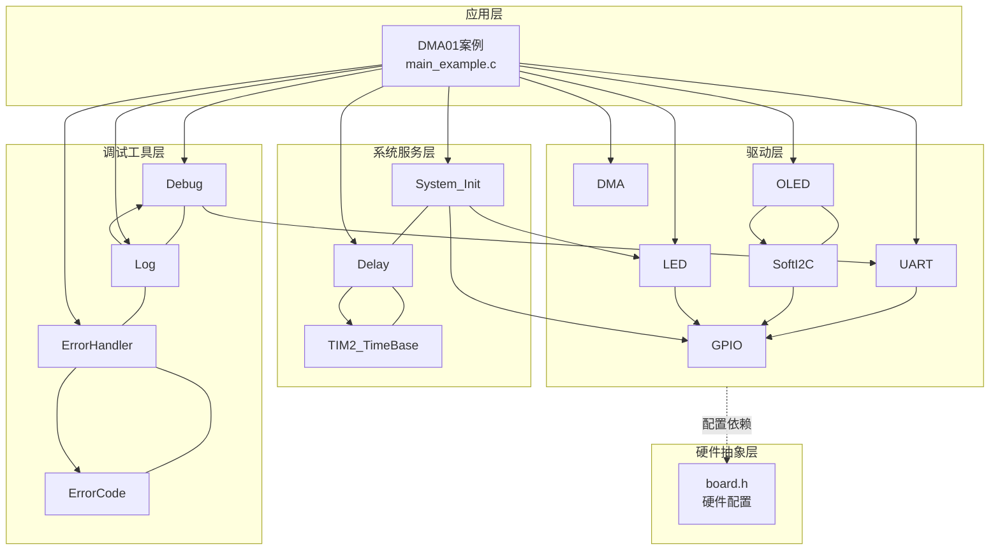
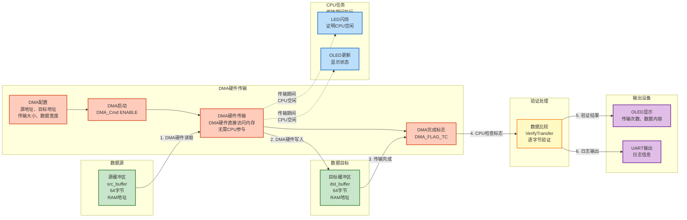
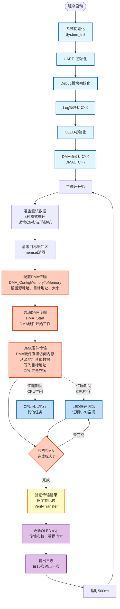

# DMA01 - 内存到内存数据搬运示例

## 📋 案例目的

- **核心目标**：演示如何使用DMA硬件实现内存到内存数据搬运，展示DMA硬件传输的工作原理和优势
- **核心功能**：
  - 使用DMA1_CH7通道实现内存到内存数据搬运（硬件传输，无需CPU参与）
  - 在主循环中反复进行DMA传输，展示动态效果
  - 传输过程中CPU可以执行其他任务（LED闪烁），证明是DMA硬件在搬运
  - 传输完成后验证数据正确性
  - 在OLED上实时显示传输状态、次数和数据内容
  - 通过串口输出详细的传输信息
- **学习重点**：
  - 理解DMA硬件传输的工作原理（DMA硬件直接访问内存，无需CPU参与）
  - 掌握DMA内存到内存传输的配置方法（DMA1_CH7通道）
  - 学习如何在DMA传输期间让CPU执行其他任务
  - 了解DMA传输与CPU复制的区别和优势
  - 学习DMA传输结果验证方法
- **应用场景**：适用于需要通过DMA高效搬运内存数据的应用，如数据缓存、缓冲区复制、数据预处理、图像处理等需要大量数据传输的场景

## 🔧 硬件要求

### 必需外设

- **DMA1_CH7**：内存到内存传输通道（芯片内部硬件，无需外部连接）
- **UART1**：
  - TX：`PA9`
  - RX：`PA10`
  - 波特率：`115200`
  - 数据格式：`8N1`（8位数据位，无校验，1位停止位）
- **OLED**：I2C接口（PB8/PB9），用于实时显示传输状态
- **LED1**：`PA1`，用于指示传输状态（传输期间闪烁）

### 硬件连接

| STM32F103C8T6 | 外设/模块 | 说明 |
|--------------|----------|------|
| PA9 | USB转串口模块 RX | UART1发送引脚（串口调试） |
| PA10 | USB转串口模块 TX | UART1接收引脚（串口调试） |
| PB8 | OLED SCL | I2C时钟线 |
| PB9 | OLED SDA | I2C数据线 |
| PA1 | LED1正极 | LED1负极接GND（传输状态指示） |
| 3.3V | USB转串口模块 VCC | 电源（如果模块需要） |
| 3.3V | OLED VCC | 电源 |
| GND | USB转串口模块 GND | 地线 |
| GND | OLED GND | 地线 |

**⚠️ 重要提示**：
- 案例是独立工程，硬件配置在案例目录下的 `board.h` 中
- 如果硬件引脚不同，直接修改 `Examples/DMA/DMA01_MemoryToMemory/board.h` 中的配置即可
- **DMA内存到内存传输无需外部硬件连接**，完全在芯片内部完成，是纯软件演示案例

## 📦 模块依赖

### 模块依赖关系图

### 模块列表

| 模块分类 | 模块名称 | 用途 | 依赖关系 |
|---------|---------|------|----------|
| 系统服务层 | System_Init | 系统初始化（GPIO、LED、delay、TIM2_TimeBase） | 无 |
| 系统服务层 | Delay | 延时功能 | TIM2_TimeBase |
| 驱动层 | GPIO | GPIO配置（UART、OLED、LED引脚） | 无 |
| 驱动层 | UART | UART1通信（串口调试） | GPIO |
| 驱动层 | DMA | DMA传输（内存到内存） | 无 |
| 驱动层 | LED | LED控制（传输状态指示） | GPIO |
| 驱动层 | OLED | OLED显示（结果显示） | SoftI2C |
| 驱动层 | SoftI2C | 软件I2C接口（OLED使用） | GPIO |
| 调试工具层 | Debug | UART输出（printf重定向） | UART |
| 调试工具层 | Log | 分级日志系统 | Debug |
| 调试工具层 | ErrorHandler | 错误处理 | ErrorCode |

## 🔄 实现流程

### 整体逻辑

程序执行流程分为三个阶段：

1. **系统初始化阶段**：
   - 系统初始化（System_Init）
   - UART1初始化
   - Debug模块初始化（UART模式）
   - Log模块初始化
   - OLED初始化
   - DMA通道初始化（DMA1_CH7）

2. **主循环阶段**（反复执行）：
   - 准备测试数据（4种模式循环：递增、递减、波形、随机）
   - 清零目标缓冲区
   - 配置DMA内存到内存传输
   - 启动DMA传输（硬件开始搬运数据）
   - **等待DMA完成期间**：CPU执行LED闪烁等任务（证明DMA硬件在工作）
   - 验证传输结果
   - 更新OLED显示（传输次数、数据内容）

3. **DMA硬件传输过程**（关键）：
   - DMA硬件直接从源地址读取数据
   - DMA硬件直接将数据写入目标地址
   - CPU在此期间可以执行其他任务
   - 传输完成后DMA硬件设置完成标志

### DMA搬运过程详解

**DMA（Direct Memory Access，直接内存访问）的工作原理**：

DMA是一种硬件外设，可以在不占用CPU的情况下，直接在内存和外设之间传输数据。本案例演示的是内存到内存传输，即DMA硬件直接从源内存地址读取数据，然后写入目标内存地址。

**DMA搬运的详细步骤**：

1. **配置阶段**（CPU执行）：
   - 设置源地址（src_buffer的地址）
   - 设置目标地址（dst_buffer的地址）
   - 设置传输大小（64字节）
   - 设置数据宽度（1字节）
   - 设置地址递增模式（源和目标都递增）
   - 设置传输模式（正常模式）

2. **启动阶段**（CPU执行）：
   - 调用`DMA_Start()`使能DMA通道
   - DMA硬件开始工作

3. **传输阶段**（DMA硬件执行，CPU空闲）：
   - **DMA硬件自动执行以下操作**：
     - 从源地址读取1字节数据
     - 写入目标地址
     - 源地址和目标地址自动递增
     - 传输计数器递减
     - 重复上述步骤，直到传输完成
   - **CPU在此期间可以执行其他任务**：
     - LED闪烁（本案例中实现）
     - 处理其他中断
     - 执行其他计算任务

4. **完成阶段**（CPU检查）：
   - CPU检查DMA完成标志位
   - 如果完成，验证传输结果
   - 如果未完成，继续等待

**DMA搬运 vs CPU复制**：

| 特性 | DMA硬件搬运 | CPU复制（memcpy） |
|------|------------|------------------|
| **执行主体** | DMA硬件外设 | CPU核心 |
| **CPU占用** | 不占用CPU | 占用CPU |
| **传输速度** | 快（硬件直接访问） | 相对较慢（需要CPU指令） |
| **CPU可执行其他任务** | 可以（传输期间CPU空闲） | 不可以（CPU被占用） |
| **适用场景** | 大量数据传输 | 少量数据复制 |

### 数据流向图

**数据流说明**：

1. **数据源**：
   - 源缓冲区（src_buffer）位于RAM中，包含64字节测试数据
   - 数据模式循环变化（递增、递减、波形、随机）

2. **DMA硬件传输**（核心过程）：
   - **配置阶段**：CPU配置DMA通道参数（源地址、目标地址、传输大小等）
   - **启动阶段**：CPU使能DMA通道，DMA硬件开始工作
   - **传输阶段**：**DMA硬件直接访问内存**，从源地址读取数据，写入目标地址，**CPU完全空闲**
   - **完成标志**：DMA硬件传输完成后，自动设置完成标志位（DMA_FLAG_TC）

3. **CPU任务**（传输期间执行）：
   - LED快速闪烁（证明CPU空闲，可以执行其他任务）
   - OLED显示更新（显示传输状态）

4. **验证处理**：
   - 传输完成后，CPU逐字节比较源数据和目标数据
   - 验证DMA传输的正确性

5. **输出设备**：
   - OLED显示：传输次数、第一个字节的数据内容（实时变化）
   - UART输出：详细的传输日志和验证结果

### 关键方法

1. **DMA内存到内存传输配置**：
   - 方法名称：`DMA_ConfigMemoryToMemory()`
   - 使用场景：配置DMA1_CH7通道进行内存到内存传输
   - 关键参数：
     - 源地址：src_buffer的地址
     - 目标地址：dst_buffer的地址
     - 传输大小：64字节
     - 数据宽度：1字节（字节传输）
   - 注意事项：
     - 内存到内存传输必须使用正常模式（不支持循环模式）
     - 源地址和目标地址都必须设置为递增模式
     - 必须使用DMA1_CH7通道（专门用于内存到内存传输）

2. **DMA传输启动**：
   - 方法名称：`DMA_Start()`
   - 使用场景：启动DMA硬件传输
   - 工作原理：
     - 使能DMA通道（`DMA_Cmd(ENABLE)`）
     - DMA硬件开始自动传输数据
     - 函数立即返回，不等待传输完成
   - 注意事项：
     - 启动后DMA硬件立即开始工作
     - CPU可以继续执行其他任务

3. **DMA传输完成检查**：
   - 方法名称：`DMA_IsComplete()`
   - 使用场景：非阻塞式检查DMA传输是否完成
   - 工作原理：
     - 检查DMA硬件标志位（DMA_FLAG_TC）
     - 如果标志位被设置，说明传输完成
     - 返回1表示完成，0表示未完成
   - 注意事项：
     - 可以在循环中反复检查，期间CPU可以执行其他任务
     - 本案例在等待期间让LED闪烁，证明CPU空闲

4. **传输结果验证**：
   - 方法名称：`VerifyTransfer()`
   - 使用场景：验证DMA传输的数据正确性
   - 工作原理：
     - 逐字节比较源缓冲区和目标缓冲区
     - 如果所有字节都匹配，验证成功
     - 如果发现不匹配，记录第一个错误位置
   - 注意事项：
     - 必须在DMA传输完成后才能验证
     - 验证失败时输出详细的错误信息

### 工作流程示意图

**工作流程说明**：

1. **初始化阶段**：
   - 系统初始化、UART初始化、Debug/Log初始化、OLED初始化
   - DMA通道初始化（DMA1_CH7）

2. **主循环阶段**：
   - 准备测试数据（4种模式循环）
   - 清零目标缓冲区
   - 配置并启动DMA传输

3. **DMA硬件传输阶段**（关键）：
   - DMA硬件自动从源地址读取数据，写入目标地址
   - **CPU在此期间完全空闲**，可以执行LED闪烁等任务
   - CPU循环检查DMA完成标志位

4. **验证和显示阶段**：
   - 传输完成后，验证数据正确性
   - 更新OLED显示（传输次数、数据内容）
   - 输出日志信息

## 📚 关键函数说明

### DMA相关函数

- **`DMA_HW_Init()`**：初始化DMA通道
  - 在本案例中用于初始化DMA1_CH7（内存到内存传输专用通道）
  - 根据board.h中的配置初始化DMA通道
  - 必须在使用DMA前调用
  - 初始化包括：使能DMA时钟、配置DMA通道参数

- **`DMA_ConfigMemoryToMemory()`**：配置DMA内存到内存传输
  - 在本案例中用于配置内存到内存传输参数
  - 需要指定源地址、目标地址、传输大小、数据宽度
  - 关键配置：
    - `DMA_M2M = DMA_M2M_Enable`（启用内存到内存模式）
    - `DMA_PeripheralInc = Enable`（源地址递增）
    - `DMA_MemoryInc = Enable`（目标地址递增）
    - `DMA_Mode = Normal`（正常模式，内存到内存不支持循环模式）
  - 配置完成后，DMA硬件就绪，等待启动

- **`DMA_Start()`**：启动DMA传输
  - 在本案例中用于启动内存到内存传输
  - 工作原理：
    - 设置传输计数器（DMA_SetCurrDataCounter）
    - 清除DMA标志位
    - 使能DMA通道（`DMA_Cmd(ENABLE)`）
    - DMA硬件立即开始传输，函数立即返回
  - 启动后，DMA硬件自动执行数据传输，CPU可以执行其他任务

- **`DMA_IsComplete()`**：非阻塞式检查DMA传输是否完成
  - 在本案例中用于在循环中检查传输完成状态
  - 工作原理：
    - 检查DMA硬件标志位（DMA_FLAG_TC）
    - 如果标志位被设置，返回1（完成）
    - 如果标志位未设置，返回0（未完成）
  - 可以在循环中反复调用，期间CPU可以执行其他任务（如LED闪烁）

- **`DMA_WaitComplete()`**：阻塞式等待DMA传输完成
  - 在本案例的早期版本中使用，当前版本使用`DMA_IsComplete()`实现非阻塞等待
  - 工作原理：
    - 循环检查DMA完成标志位
    - 如果超时，返回错误
    - 如果完成，返回成功
  - 注意：虽然函数名是"等待"，但内部实现是轮询检查，CPU仍然可以执行其他任务

### OLED相关函数

- **`OLED_Init()`**：初始化OLED显示模块
  - 在本案例中用于初始化OLED显示
  - 必须在使用OLED前调用

- **`OLED_ShowString()`**：显示字符串
  - 在本案例中用于显示传输状态、传输次数、数据内容
  - 支持ASCII字符显示

- **`OLED_ShowNum()`**：显示数字
  - 在本案例中可用于显示传输次数（当前使用ShowString显示）

### 验证相关函数

- **`VerifyTransfer()`**：验证传输结果
  - 在本案例中用于验证DMA传输的数据正确性
  - 工作原理：
    - 逐字节比较源缓冲区和目标缓冲区
    - 如果所有字节都匹配，返回1（验证成功）
    - 如果发现不匹配，记录第一个错误位置，返回0（验证失败）
  - 验证失败时输出详细的错误信息（错误位置、源数据、目标数据）

**详细函数实现和调用示例请参考**：`main_example.c` 中的代码

## ⚠️ 注意事项与重点

### ⚠️ 重要提示

1. **标准初始化流程**：必须严格按照 System_Init → UART → Debug → Log → OLED → DMA 的顺序初始化
2. **DMA通道配置**：DMA1_CH7必须配置为内存到内存模式，源地址和目标地址都必须递增
3. **传输模式限制**：内存到内存传输只能使用正常模式，不支持循环模式
4. **数据宽度**：本案例使用字节传输（1字节），无需对齐要求
5. **CPU空闲验证**：在DMA传输期间，LED会快速闪烁，这证明CPU空闲，DMA硬件在工作

### 🔑 关键点

1. **DMA硬件传输原理**：
   - DMA是硬件外设，可以直接访问内存，无需CPU参与
   - DMA传输期间，CPU完全空闲，可以执行其他任务
   - 这是DMA与CPU复制（memcpy）的根本区别

2. **DMA通道选择**：
   - DMA1_CH7专门用于内存到内存传输
   - 必须在board.h中正确配置DMA1_CH7（`DMA_PeripheralInc_Enable`）

3. **传输配置要点**：
   - 源地址和目标地址都必须递增（`DMA_PeripheralInc_Enable`和`DMA_MemoryInc_Enable`）
   - 数据宽度选择字节传输，简单易用，无需对齐
   - 传输大小必须是数据宽度的整数倍

4. **验证DMA硬件工作的方法**：
   - 在DMA传输期间让CPU执行其他任务（如LED闪烁）
   - 如果LED能够闪烁，说明CPU空闲，证明是DMA硬件在传输
   - 如果使用CPU复制（memcpy），CPU会被占用，LED无法闪烁

5. **动态效果展示**：
   - 主循环中反复进行DMA传输
   - 每次传输使用不同的数据模式（递增、递减、波形、随机）
   - OLED上实时显示传输次数和数据内容，让效果更直观

## 🔍 常见问题排查

### 问题1：DMA传输失败

**可能原因**：
- DMA通道未初始化
- DMA配置错误（源地址或目标地址无效）
- 传输大小配置错误

**解决方法**：
1. 检查`DMA_HW_Init()`返回值，确认初始化成功
2. 检查board.h中的DMA配置（DMA1_CH7必须启用）
3. 检查源地址和目标地址是否有效（非NULL）
4. 检查传输大小是否合理（不能为0，必须是数据宽度的整数倍）

### 问题2：数据验证失败

**可能原因**：
- DMA传输未完成就开始验证
- 源数据和目标数据缓冲区重叠
- 传输大小配置错误

**解决方法**：
1. 确保使用`DMA_IsComplete()`或`DMA_WaitComplete()`等待传输完成
2. 检查源缓冲区和目标缓冲区是否重叠（地址范围）
3. 检查传输大小配置是否正确
4. 查看串口日志中的错误位置信息

### 问题3：LED不闪烁（无法验证DMA工作）

**可能原因**：
- LED未初始化
- LED引脚配置错误
- 等待DMA完成的方式错误（使用了阻塞式等待）

**解决方法**：
1. 检查LED初始化（System_Init会自动初始化）
2. 检查board.h中的LED配置（PA1是否正确配置）
3. 确认使用`DMA_IsComplete()`在循环中检查，而不是`DMA_WaitComplete()`阻塞等待
4. 在循环中添加LED闪烁代码

### 问题4：OLED显示异常

**可能原因**：
- OLED初始化失败
- I2C通信异常
- 硬件连接问题

**解决方法**：
1. 检查OLED初始化返回值
2. 检查I2C引脚连接（PB8/PB9）
3. 检查board.h中的OLED配置
4. 使用串口日志查看详细错误信息

### 问题5：程序运行异常

**可能原因**：
- 初始化顺序错误
- 模块未启用
- 硬件配置错误

**解决方法**：
1. 检查初始化顺序（System_Init → UART → Debug → Log → OLED → DMA）
2. 检查config.h中的模块开关
3. 检查board.h中的硬件配置

## 💡 扩展练习

### 循序渐进部分

1. **修改传输大小**：
   - 将缓冲区大小从64字节改为128字节或256字节
   - 观察传输时间和LED闪烁次数
   - 理解传输大小对性能的影响

2. **修改数据宽度**：
   - 将字节传输改为半字传输（2字节）或字传输（4字节）
   - 观察传输效率的变化
   - 理解数据宽度对传输性能的影响（字传输比字节传输快）

3. **添加传输统计**：
   - 统计传输次数
   - 统计传输总字节数
   - 计算平均传输速度
   - 输出统计信息到日志和OLED

### 实际场景坑点部分

4. **处理缓冲区重叠**：
   - 当源缓冲区和目标缓冲区重叠时如何处理
   - 实现安全的缓冲区复制（考虑重叠情况）
   - 处理边界条件（源地址在目标地址之前或之后）

5. **优化传输性能**：
   - 使用更大的数据宽度（半字或字）提高传输效率
   - 使用DMA传输完成中断替代轮询检查
   - 平衡CPU占用和响应速度
   - 测量并对比不同数据宽度的传输速度

6. **实现连续传输**：
   - 实现多次连续传输（传输队列）
   - 处理传输完成回调
   - 实现传输错误处理和重试机制
   - 处理传输超时情况

## 📖 相关文档

### 模块文档

- **DMA模块**：`Drivers/dma/dma.c/h`
- **UART模块**：`Drivers/uart/uart.c/h`
- **OLED模块**：`Drivers/display/oled_ssd1306.c/h`
- **LED模块**：`Drivers/basic/led.c/h`
- **Debug模块**：`Debug/debug.c/h`
- **Log模块**：`Debug/log.c/h`
- **ErrorHandler模块**：`Common/error_handler.c/h`

### 业务文档

- **主程序代码**：`Examples/DMA/DMA01_MemoryToMemory/main_example.c`
- **硬件配置**：`Examples/DMA/DMA01_MemoryToMemory/board.h`
- **模块配置**：`Examples/DMA/DMA01_MemoryToMemory/config.h`
- **项目规范**：`../../AI/README.md`（AI规则体系）
- **案例参考**：`Examples/README.md`

---

**最后更新**：2024-01-01
