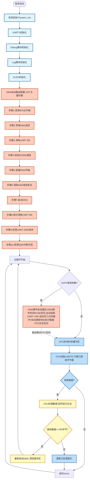

# DMA02 - UART1 DMA接收示例

## 📋 案例目的

- **核心目标**：演示如何使用DMA硬件实现UART1自动接收数据，展示DMA自动搬运的工作原理和优势
- **核心功能**?  - UART1接收数据时，DMA硬件自动将数据从UART->DR搬运到内存缓冲区（无需CPU参与?  - CPU轮询内存缓冲区，检查是否有新数据到?  - 接收到的数据通过串口回传（Echo功能?  - 接收到的数据实时显示在OLED上（十六进制格式?- **学习重点**?  - 理解DMA自动搬运的工作原理（UART接收数据时，DMA硬件自动响应并搬运到内存?  - 掌握UART DMA接收的配置流程（10个关键步骤，严格按照硬件时序要求?  - 学习DMA循环模式的使用（缓冲区自动回绕，实现连续接收?  - 了解CPU轮询内存缓冲区的方式（DMA负责搬运，CPU负责处理?  - 理解DMA自动搬运与UART中断接收的区别和优势
- **应用场景**：适用于需要高效接收大量UART数据的应用，如串口通信、数据采集、协议解析等需要连续接收数据的场景

## 🔧 硬件要求

### 必需外设

- **UART1**?  - TX：`PA9`
  - RX：`PA10`
  - 波特率：`115200`
  - 数据格式：`8N1`?位数据位，无校验?位停止位?- **DMA1_CH5**：UART1 RX专用DMA通道（芯片内部硬件，STM32F103固定映射?- **OLED**：I2C接口（PB8/PB9），用于实时显示接收数据
- **LED1**：`PA1`，用于指示程序运行状?
### 硬件连接

| STM32F103C8T6 | 外设/模块 | 说明 |
|--------------|----------|------|
| PA9 | USB转串口模?RX | UART1发送引脚（串口调试?|
| PA10 | USB转串口模?TX | UART1接收引脚（串口调试） |
| PB8 | OLED SCL | I2C时钟?|
| PB9 | OLED SDA | I2C数据?|
| PA1 | LED1正极 | LED1负极接GND（程序运行指示） |
| 3.3V | USB转串口模?VCC | 电源（如果模块需要） |
| 3.3V | OLED VCC | 电源 |
| GND | USB转串口模?GND | 地线 |
| GND | OLED GND | 地线 |

**⚠️ 重要提示**?- 案例是独立工程，硬件配置在案例目录下?`board.h` ?- 如果硬件引脚不同，直接修?`Examples/DMA/DMA02_UART1toMemory/board.h` 中的配置即可
- **DMA通道映射**：STM32F103的USART1_RX固定使用DMA1_Channel5，必须在board.h中正确配?
## 📦 模块依赖

### 模块依赖关系?
```mermaid
%%{init: {'flowchart': {'curve': 'basis'}}}%%
flowchart TB
    %% 应用?    subgraph APP_LAYER[应用层]
        APP[DMA02案例-main_example.c]
    end
    
    %% 系统服务?    subgraph SYS_LAYER[系统服务层]
        direction LR
        SYS_INIT[System_Init]
        DELAY[Delay]
        BASE_TIMER[TIM2_TimeBase]
        SYS_INIT --- DELAY
        DELAY --- BASE_TIMER
    end
    
    %% 驱动?    subgraph DRV_LAYER[驱动层]
        direction LR
        GPIO[GPIO]
        UART[UART]
        DMA[DMA]
        OLED[OLED]
        SOFT_I2C[SoftI2C]
        LED[LED]
        OLED --- SOFT_I2C
    end
    
    %% 调试工具?    subgraph DEBUG_LAYER[调试工具层]
        direction LR
        DEBUG[Debug]
        LOG[Log]
        ERROR[ErrorHandler]
        ERROR_CODE[ErrorCode]
        DEBUG --- LOG
        LOG --- ERROR
        ERROR --- ERROR_CODE
    end
    
    %% 硬件抽象?    subgraph BSP_LAYER[硬件抽象层]
        BSP[board.h-硬件配置]
    end
    
    %% 应用层依?    APP --> SYS_INIT
    APP --> DEBUG
    APP --> LOG
    APP --> ERROR
    APP --> DELAY
    APP --> UART
    APP --> DMA
    APP --> OLED
    APP --> LED
    
    %% 系统服务层依?    SYS_INIT --> GPIO
    SYS_INIT --> LED
    DELAY --> BASE_TIMER
    
    %% 驱动层依?    UART --> GPIO
    OLED --> SOFT_I2C
    SOFT_I2C --> GPIO
    LED --> GPIO
    UART -.->|DMA接收| DMA
    
    %% 调试工具层依?    DEBUG --> UART
    LOG --> DEBUG
    ERROR --> ERROR_CODE
    
    %% BSP配置依赖
    DRV_LAYER -.->|配置依赖| BSP
```

### 模块列表

| 模块分类 | 模块名称 | 用?| 依赖关系 |
|---------|---------|------|----------|
| 系统服务?| System_Init | 系统初始化（GPIO、LED、delay、TIM2_TimeBase?| ?|
| 系统服务?| Delay | 延时功能 | TIM2_TimeBase |
| 驱动?| GPIO | GPIO配置（UART、OLED、LED引脚?| ?|
| 驱动?| UART | UART1通信（串口调试和接收?| GPIO |
| 驱动?| DMA | DMA传输（UART1 RX自动搬运?| ?|
| 驱动?| LED | LED控制（程序运行指示） | GPIO |
| 驱动?| OLED | OLED显示（接收数据显示） | SoftI2C |
| 驱动?| SoftI2C | 软件I2C接口（OLED使用?| GPIO |
| 调试工具?| Debug | UART输出（printf重定向） | UART |
| 调试工具?| Log | 分级日志系统 | Debug |
| 调试工具?| ErrorHandler | 错误处理 | ErrorCode |

## 🔄 实现流程

### 整体逻辑

程序执行流程分为三个阶段?
1. **系统初始化阶?*?   - 系统初始化（System_Init?   - UART1初始?   - Debug模块初始化（UART模式?   - Log模块初始?   - OLED初始?   - **DMA自动搬运配置**?0个关键步骤，严格按照硬件时序要求?
2. **DMA自动搬运阶段**（硬件自动执行）?   - UART接收到数据时，硬件自动设置RXNE标志?   - DMA硬件检测到RXNE信号，自动发起传输请?   - DMA硬件自动从UART->DR读取数据，写入内存缓冲区
   - DMA硬件自动更新内存地址和传输计数器
   - 循环模式下，缓冲区满时自动回绕到开头继续接?
3. **CPU轮询处理阶段**（主循环）：
   - CPU轮询内存缓冲区，检查是否有新数据到?   - 如果有新数据，CPU处理数据（回传、显示、日志）
   - CPU更新已处理索引，继续轮询

### DMA自动搬运过程详解

**DMA（Direct Memory Access，直接内存访问）自动搬运的工作原?*?
DMA是一种硬件外设，可以在不占用CPU的情况下，自动响应外设的数据请求，直接将数据从外设寄存器搬运到内存。本案例演示的是UART DMA接收，即UART接收到数据时，DMA硬件自动将数据从UART->DR搬运到内存缓冲区?
**DMA自动搬运的详细步?*?
1. **配置阶段**（CPU执行，一次性配置）?   - 禁用UART的RXNE中断（确保DMA能正常工作）
   - 清除UART DR中的残留数据（确保DMA启动时DR为空?   - 初始化DMA通道（DMA1_CH5，UART1 RX专用?   - 配置DMA传输参数（源地址=UART->DR，目标地址=内存缓冲区，传输方向=外设到内存，循环模式?   - 先启动DMA（EN=1），再启用UART DMA请求（确保时序正确）

2. **自动搬运阶段**（DMA硬件自动执行，无需CPU参与）：
   - **UART接收数据**?     - UART RX引脚检测到起始?     - UART硬件自动接收数据?     - 接收完成后，UART硬件自动将数据写入DR寄存?     - UART硬件自动设置RXNE标志位（接收数据寄存器非空）
   - **DMA硬件响应**?     - DMA硬件检测到UART的RXNE信号（DMA请求信号?     - DMA硬件自动发起总线读操作：读取`UART->DR`（读取后，UART硬件自动清除RXNE标志位）
     - DMA硬件自动发起总线写操作：写入`内存缓冲区[CMAR]`
     - DMA硬件自动更新内存地址（CMAR递增1?     - DMA硬件自动更新传输计数器（CNDTR递减1?   - **循环模式自动回绕**?     - 当CNDTR递减?时，DMA硬件自动将CNDTR重置为初始值（缓冲区大小）
     - DMA硬件自动将CMAR重置为初始地址（缓冲区开头）
     - DMA硬件继续接收数据，实现连续接?
3. **CPU轮询处理阶段**（主循环中执行）?   - CPU读取DMA的CNDTR寄存器，计算已接收的字节?   - CPU比较已接收字节数和已处理字节数，判断是否有新数据
   - 如果有新数据，CPU处理数据（回传、显示、日志）
   - CPU更新已处理索引，继续轮询

**DMA自动搬运 vs UART中断接收**?
| 特?| DMA自动搬运 | UART中断接收 |
|------|------------|-------------|
| **执行主体** | DMA硬件外设 | CPU核心 |
| **CPU占用** | 不占用CPU（搬运期间CPU空闲?| 占用CPU（每次接收都触发中断?|
| **响应速度** | 快（硬件直接响应，延?1μs?| 相对较慢（需要CPU响应中断，延?1μs?|
| **CPU可执行其他任?* | 可以（搬运期间CPU空闲?| 不可以（频繁中断占用CPU?|
| **适用场景** | 大量数据连续接收 | 少量数据接收 |
| **缓冲区管?* | 硬件自动管理（循环模式） | 软件手动管理 |

### DMA自动搬运配置流程?0个关键步骤）

**⚠️ 重要**：DMA自动搬运的配置必须严格按照硬件时序要求，否则DMA无法正确响应UART的数据请求?
**步骤1：禁用UART的RXNE中断**
```c
USART_ITConfig(uart_periph, USART_IT_RXNE, DISABLE);
```
- **目的**：确保UART接收到数据时，不会触发RXNE中断，而是由DMA响应
- **原因**：如果RXNE中断启用，CPU会在中断中读取DR，导致DMA无法获取数据

**步骤2：临时禁用UART DMA请求**
```c
USART_DMACmd(uart_periph, USART_DMAReq_Rx, DISABLE);
```
- **目的**：准备重新配置DMA，先禁用DMA请求，避免配置期间有数据到达

**步骤3：清除UART DR中的残留数据**
```c
while (uart_periph->SR & USART_FLAG_RXNE) {
    volatile uint16_t dummy = uart_periph->DR;
    (void)dummy;
}
```
- **目的**：确保DMA启动时，UART DR为空，避免DMA错过第一个数?- **原因**：如果DR中有残留数据，DMA启动时可能无法正确响应RXNE信号

**步骤4：初始化DMA通道**
```c
DMA_HW_Init(DMA_CHANNEL_1_5);
```
- **目的**：初始化DMA1_CH5通道（UART1 RX专用通道?- **配置内容**：使能DMA时钟、配置DMA通道参数（根据board.h配置?
**步骤5：配置DMA传输参数**
```c
DMA_ConfigTransfer(DMA_CHANNEL_1_5, 
                    (uint32_t)&uart_periph->DR,  // 源地址：UART->DR
                    (uint32_t)uart1_rx_buffer,   // 目标地址：内存缓冲区
                    UART1_RX_BUFFER_SIZE,        // 传输大小：缓冲区大小
                    DMA_DIR_PERIPHERAL_TO_MEMORY, // 传输方向：外设到内存
                    1);                           // 数据宽度?字节
```
- **关键配置**?  - 源地址：`&uart_periph->DR`（UART数据寄存器地址?  - 目标地址：`uart1_rx_buffer`（内存缓冲区地址?  - 传输方向：`DMA_DIR_PERIPHERAL_TO_MEMORY`（外设到内存?  - 传输模式：`DMA_Mode_Circular`（循环模式，自动回绕?  - 优先级：`DMA_Priority_VeryHigh`（最高优先级，确保及时响应）

**步骤6：清除DMA错误标志**
```c
DMA1->IFCR = DMA_IFCR_CGIF5 | DMA_IFCR_CTCIF5 | DMA_IFCR_CHTIF5 | DMA_IFCR_CTEIF5;
```
- **目的**：清除可能的错误标志，确保DMA处于干净状?
**步骤7：先启动DMA（EN=1?*
```c
DMA_Start(DMA_CHANNEL_1_5);
```
- **目的**：使能DMA通道，让DMA硬件准备好响应请?- **关键**：必须在启用UART DMA请求之前启动DMA，确保时序正?- **验证**：检查DMA的CCR寄存器，确认EN位已设置

**步骤8：再次清除UART DR**
```c
while (uart_periph->SR & USART_FLAG_RXNE) {
    volatile uint16_t dummy = uart_periph->DR;
    (void)dummy;
}
```
- **目的**：确保DMA启动后，UART DR仍然为空，避免DMA错过数据

**步骤9：启用UART DMA接收请求**
```c
USART_DMACmd(uart_periph, USART_DMAReq_Rx, ENABLE);
```
- **目的**：启用UART的DMA请求功能，当UART接收到数据时，自动向DMA发送请?- **关键**：必须在DMA启动后，再启用UART DMA请求，确保时序正?- **验证**：检查UART的CR3寄存器，确认DMAR位已设置

**步骤10：启用DMA传输完成中断（可选）**
```c
DMA_EnableIT(DMA_CHANNEL_1_5, DMA_IT_TYPE_TC);
```
- **目的**：当DMA传输完成时（循环模式下为缓冲区满时），触发中?- **用?*：主要用于调试和监控，本案例使用轮询方式，不依赖中断

**配置流程的关键时序要?*?
1. **必须先启动DMA，再启用UART DMA请求**?   - 如果先启用UART DMA请求，再启动DMA，UART可能在DMA未准备好时发送请求，导致DMA无法响应
   - 正确顺序：DMA_Start() ?USART_DMACmd(ENABLE)

2. **必须清除UART DR中的残留数据**?   - 如果DR中有残留数据，DMA启动时可能无法正确响应RXNE信号
   - 清除时机：配置前清除一次，DMA启动后再次清?
3. **必须禁用UART的RXNE中断**?   - 如果RXNE中断启用，CPU会在中断中读取DR，导致DMA无法获取数据
   - 禁用时机：在配置DMA之前禁用

### 数据流向?
```mermaid
%%{init: {'flowchart': {'curve': 'basis'}}}%%
flowchart LR
    %% 数据?    subgraph UART_HW[UART硬件]
        direction TB
        UART_RX[UART RX引脚-PA10]
        UART_DR[UART数据寄存?USART1->DR-地址0x40013804]
        UART_RXNE[RXNE标志?接收数据寄存器非空]
        UART_RX -->|接收数据| UART_DR
        UART_DR -->|数据到达| UART_RXNE
    end
    
    %% DMA硬件自动搬运
    subgraph DMA_HW[DMA硬件自动搬运]
        direction TB
        DMA_REQ[DMA请求信号-检测RXNE]
        DMA_READ[DMA硬件读取-读取UART->DR-自动清除RXNE]
        DMA_WRITE[DMA硬件写入-写入内存缓冲?CMAR自动递增]
        DMA_CNT[DMA传输计数?CNDTR自动递减]
        DMA_WRAP[循环模式回绕-CNDTR=0时自动重置]
        DMA_REQ --> DMA_READ
        DMA_READ --> DMA_WRITE
        DMA_WRITE --> DMA_CNT
        DMA_CNT -->|CNDTR=0| DMA_WRAP
        DMA_WRAP -->|重置地址和计数器| DMA_REQ
    end
    
    %% 内存缓冲?    subgraph MEM_BUF[内存缓冲区]
        RX_BUF[接收缓冲?uart1_rx_buffer-1024字节-RAM地址]
    end
    
    %% CPU轮询处理
    subgraph CPU_POLL[CPU轮询处理]
        direction TB
        CPU_READ[CPU读取CNDTR-计算已接收字节数]
        CPU_CHECK[CPU检查新数据-比较已接收和已处理]
        CPU_PROC[CPU处理数据-回传显示日志]
        CPU_UPDATE[CPU更新已处理索引]
        CPU_READ --> CPU_CHECK
        CPU_CHECK -->|有新数据| CPU_PROC
        CPU_PROC --> CPU_UPDATE
        CPU_UPDATE --> CPU_READ
    end
    
    %% 输出设备
    subgraph OUTPUT[输出设备]
        OLED_DISP[OLED显示-接收数据十六进制]
        UART_ECHO[UART回传-Echo功能]
        UART_LOG[UART日志-详细接收信息]
    end
    
    %% 数据?    UART_RXNE -->|DMA请求信号| DMA_REQ
    DMA_WRITE -->|自动写入| RX_BUF
    
    %% CPU处理?    RX_BUF -->|CPU轮询读取| CPU_READ
    CPU_PROC -->|回传数据| UART_ECHO
    CPU_PROC -->|显示数据| OLED_DISP
    CPU_PROC -->|输出日志| UART_LOG
    
    %% 样式
    classDef uart fill:#c8e6c9,stroke:#2e7d32,stroke-width:2px
    classDef dma fill:#ffccbc,stroke:#d84315,stroke-width:2px
    classDef mem fill:#c8e6c9,stroke:#2e7d32,stroke-width:2px
    classDef cpu fill:#bbdefb,stroke:#1565c0,stroke-width:2px
    classDef output fill:#e1bee7,stroke:#6a1b9a,stroke-width:2px
    
    class UART_RX,UART_DR,UART_RXNE uart
    class DMA_REQ,DMA_READ,DMA_WRITE,DMA_CNT,DMA_WRAP dma
    class RX_BUF mem
    class CPU_READ,CPU_CHECK,CPU_PROC,CPU_UPDATE cpu
    class OLED_DISP,UART_ECHO,UART_LOG output
```

**数据流说?*?
1. **UART硬件接收**?   - UART RX引脚（PA10）接收到数据
   - UART硬件自动将数据写入DR寄存?   - UART硬件自动设置RXNE标志?
2. **DMA硬件自动搬运**（核心过程）?   - **DMA请求**：DMA硬件检测到UART的RXNE信号（DMA请求信号?   - **DMA读取**：DMA硬件自动从UART->DR读取数据（读取后，UART硬件自动清除RXNE标志位）
   - **DMA写入**：DMA硬件自动将数据写入内存缓冲区（CMAR地址自动递增?   - **计数器更?*：DMA硬件自动更新传输计数器（CNDTR递减?   - **循环回绕**：当CNDTR=0时，DMA硬件自动重置CNDTR和CMAR，继续接?
3. **CPU轮询处理**?   - CPU读取DMA的CNDTR寄存器，计算已接收的字节?   - CPU比较已接收字节数和已处理字节数，判断是否有新数据
   - 如果有新数据，CPU处理数据（回传、显示、日志）
   - CPU更新已处理索引，继续轮询

4. **输出设备**?   - OLED显示：接收数据的十六进制格式
   - UART回传：将接收到的数据原样发送回串口（Echo功能?   - UART日志：输出详细的接收信息

### 关键方法

1. **DMA自动搬运配置**?   - 方法名称：`UART1_DMA_Init()`
   - 使用场景：初始化UART1 DMA接收，配置DMA自动搬运
   - 关键步骤?0个关键步骤，严格按照硬件时序要求
   - 注意事项?     - 必须先启动DMA，再启用UART DMA请求
     - 必须清除UART DR中的残留数据
     - 必须禁用UART的RXNE中断

2. **DMA传输配置**?   - 方法名称：`DMA_ConfigTransfer()`
   - 使用场景：配置DMA传输参数（源地址、目标地址、传输大小、传输方向）
   - 关键参数?     - 源地址：`&uart_periph->DR`（UART数据寄存器地址?     - 目标地址：`uart1_rx_buffer`（内存缓冲区地址?     - 传输方向：`DMA_DIR_PERIPHERAL_TO_MEMORY`（外设到内存?     - 传输模式：`DMA_Mode_Circular`（循环模式，自动回绕?   - 注意事项?     - 必须使用循环模式，实现连续接?     - 必须设置最高优先级，确保及时响?
3. **CPU轮询内存缓冲?*?   - 方法名称：`DMA_GetRemainingDataSize()`
   - 使用场景：获取DMA传输剩余字节数，计算已接收字节数
   - 工作原理?     - 读取DMA的CNDTR寄存器（传输计数器）
     - 计算已接收字节数：`已接?= 缓冲区大?- CNDTR`
     - 比较已接收字节数和已处理字节数，判断是否有新数据
   - 注意事项?     - 必须在主循环中定期轮?     - 轮询频率要适中，既要及时处理数据，又不能占用太多CPU

4. **数据处理**?   - 方法名称：主循环中的数据处理逻辑
   - 使用场景：处理新接收的数据（回传、显示、日志）
   - 工作原理?     - 检查是否有新数据（已接?> 已处理）
     - 如果有新数据，逐字节处理（从已处理位置到当前接收位置）
     - 更新已处理索?   - 注意事项?     - 必须及时处理数据，避免缓冲区溢出
     - 当接收数据达?00字节时，处理并清空缓冲区，防止卡?
### 工作流程示意?


**工作流程说明**?
1. **初始化阶?*?   - 系统初始化、UART初始化、Debug/Log初始化、OLED初始?   - **DMA自动搬运配置**?0个关键步骤，严格按照硬件时序要求?
2. **DMA自动搬运阶段**（硬件自动执行）?   - UART接收到数据时，硬件自动设置RXNE标志?   - DMA硬件检测到RXNE信号，自动发起传输请?   - DMA硬件自动从UART->DR读取数据，写入内存缓冲区
   - DMA硬件自动更新内存地址和传输计数器
   - **CPU在此期间完全空闲**，可以执行其他任?
3. **CPU轮询处理阶段**（主循环）：
   - CPU读取DMA的CNDTR寄存器，计算已接收的字节?   - CPU比较已接收字节数和已处理字节数，判断是否有新数据
   - 如果有新数据，CPU处理数据（回传、显示、日志）
   - 当接收数据达?00字节时，处理并清空缓冲区，防止卡?
## 📚 关键函数说明

### DMA相关函数

- **`DMA_HW_Init()`**：初始化DMA通道
  - 在本案例中用于初始化DMA1_CH5（UART1 RX专用通道?  - 根据board.h中的配置初始化DMA通道
  - 必须在使用DMA前调?  - 初始化包括：使能DMA时钟、配置DMA通道参数

- **`DMA_ConfigTransfer()`**：配置DMA传输参数
  - 在本案例中用于配置UART DMA接收参数
  - 需要指定源地址（UART->DR）、目标地址（内存缓冲区）、传输大小、传输方?  - 关键配置?    - `DMA_DIR_PERIPHERAL_TO_MEMORY`（外设到内存?    - `DMA_Mode_Circular`（循环模式，自动回绕?    - `DMA_Priority_VeryHigh`（最高优先级，确保及时响应）
  - 配置完成后，DMA硬件就绪，等待UART数据请求

- **`DMA_Start()`**：启动DMA传输
  - 在本案例中用于启动UART DMA接收
  - 工作原理?    - 设置传输计数器（DMA_SetCurrDataCounter?    - 清除DMA标志?    - 使能DMA通道（`DMA_Cmd(ENABLE)`?    - DMA硬件立即准备响应UART的数据请?  - 启动后，DMA硬件自动响应UART的RXNE信号，自动搬运数?
- **`DMA_GetRemainingDataSize()`**：获取DMA传输剩余字节?  - 在本案例中用于计算已接收的字节数
  - 工作原理?    - 读取DMA的CNDTR寄存器（传输计数器）
    - 返回剩余字节?    - 计算已接收字节数：`已接?= 缓冲区大?- 剩余`
  - 可以在循环中反复调用，用于轮询检查新数据

### UART相关函数

- **`UART_Init()`**：初始化UART外设
  - 在本案例中用于初始化UART1（PA9/PA10?15200?  - 必须在使用UART前调?
- **`UART_ReceiveDMA()`**：启动UART DMA接收（UART驱动提供?  - 在本案例的早期版本中使用，当前版本使用自定义的`UART1_DMA_Init()`
  - 工作原理?    - 配置DMA传输参数
    - 启用UART DMA接收请求
    - 启动DMA传输
  - 注意：本案例使用自定义初始化函数，确保严格按照硬件时序要求配?
- **`USART_DMACmd()`**：启?禁用UART DMA请求
  - 在本案例中用于启用UART的DMA接收请求
  - 关键：必须在DMA启动后，再启用UART DMA请求，确保时序正?
- **`USART_ITConfig()`**：启?禁用UART中断
  - 在本案例中用于禁用UART的RXNE中断
  - 关键：必须禁用RXNE中断，确保DMA能正常工?
### OLED相关函数

- **`OLED_Init()`**：初始化OLED显示模块
  - 在本案例中用于初始化OLED显示
  - 必须在使用OLED前调?
- **`OLED_ShowHexNum()`**：显示十六进制数?  - 在本案例中用于显示接收数据的十六进制格式
  - 支持ASCII字符显示

**详细函数实现和调用示例请参?*：`main_example.c` 中的代码

## ⚠️ 注意事项与重?
### ⚠️ 重要提示

1. **标准初始化流?*：必须严格按?System_Init ?UART ?Debug ?Log ?OLED ?DMA 的顺序初始化
2. **DMA通道映射**：STM32F103的USART1_RX固定使用DMA1_Channel5，必须在board.h中正确配?3. **配置时序要求**：必须先启动DMA，再启用UART DMA请求，确保时序正?4. **UART DR清除**：必须在DMA启动前和启动后清除UART DR中的残留数据
5. **RXNE中断禁用**：必须禁用UART的RXNE中断，确保DMA能正常工?
### 🔑 关键?
1. **DMA自动搬运原理**?   - DMA是硬件外设，可以自动响应UART的数据请?   - UART接收到数据时，硬件自动设置RXNE标志?   - DMA硬件检测到RXNE信号，自动发起传输请?   - DMA硬件自动从UART->DR读取数据，写入内存缓冲区
   - **CPU在此期间完全空闲**，可以执行其他任?
2. **DMA通道选择**?   - DMA1_CH5专门用于UART1 RX（STM32F103固定映射?   - 必须在board.h中正确配置DMA1_CH5（`DMA_Mode_Circular`，`DMA_Priority_VeryHigh`?
3. **配置流程要点**?   - 10个关键步骤，严格按照硬件时序要求
   - 必须先启动DMA，再启用UART DMA请求
   - 必须清除UART DR中的残留数据
   - 必须禁用UART的RXNE中断

4. **CPU轮询方式**?   - CPU轮询内存缓冲区，检查是否有新数据到?   - 轮询频率要适中，既要及时处理数据，又不能占用太多CPU
   - 当接收数据达?00字节时，处理并清空缓冲区，防止卡?
5. **循环模式优势**?   - 循环模式下，缓冲区满时自动回绕到开头继续接?   - 实现连续接收，无需手动重启DMA
   - 适合大量数据连续接收的场?
## 🔍 常见问题排查

### 问题1：DMA不响应UART数据请求

**可能原因**?- DMA通道映射错误（USART1_RX必须使用DMA1_CH5?- 配置时序错误（必须先启动DMA，再启用UART DMA请求?- UART DR中有残留数据（DMA启动时DR不为空）
- UART的RXNE中断未禁用（CPU在中断中读取DR，导致DMA无法获取数据?
**解决方法**?1. 检查board.h中的DMA配置（DMA1_CH5必须启用，且配置正确?2. 检查配置流程的时序（严格按?0个关键步骤）
3. 检查UART DR清除代码（配置前清除一次，DMA启动后再次清除）
4. 检查UART的RXNE中断是否已禁用（`USART_ITConfig(uart_periph, USART_IT_RXNE, DISABLE)`?
### 问题2：数据接收不完整

**可能原因**?- DMA缓冲区太?- CPU处理数据太慢，导致缓冲区溢出
- DMA优先级太低，无法及时响应UART请求

**解决方法**?1. 增加DMA缓冲区大小（当前?024字节?2. 优化CPU处理逻辑，提高处理速度
3. 设置DMA优先级为最高（`DMA_Priority_VeryHigh`?
### 问题3：程序卡?
**可能原因**?- 接收数据过多，缓冲区满且未及时处?- 循环模式下，缓冲区满时未正确处理

**解决方法**?1. 当接收数据达?00字节时，处理并清空缓冲区（代码中已实现）
2. 优化CPU处理逻辑，提高处理速度
3. 增加DMA缓冲区大?
### 问题4：OLED显示异常

**可能原因**?- OLED初始化失?- I2C通信异常
- 硬件连接问题

**解决方法**?1. 检查OLED初始化返回?2. 检查I2C引脚连接（PB8/PB9?3. 检查board.h中的OLED配置
4. 使用串口日志查看详细错误信息

### 问题5：程序运行异?
**可能原因**?- 初始化顺序错?- 模块未启?- 硬件配置错误

**解决方法**?1. 检查初始化顺序（System_Init ?UART ?Debug ?Log ?OLED ?DMA?2. 检查config.h中的模块开?3. 检查board.h中的硬件配置

## 💡 扩展练习

### 循序渐进部分

1. **修改缓冲区大?*?   - 将缓冲区大小?024字节改为512字节?048字节
   - 观察接收效果和处理速度
   - 理解缓冲区大小对性能的影?
2. **修改处理逻辑**?   - 添加数据过滤功能（只处理特定字符?   - 添加数据解析功能（解析特定协议）
   - 添加数据统计功能（统计接收字节数、错误数等）

3. **添加传输完成中断**?   - 使用DMA传输完成中断替代轮询方式
   - 在中断中处理数据，提高响应速度
   - 理解中断方式与轮询方式的区别

### 实际场景坑点部分

4. **处理缓冲区溢?*?   - 当缓冲区满时如何处理新数?   - 实现数据丢弃或覆盖策?   - 处理边界条件（缓冲区满时的数据丢失）

5. **优化CPU处理性能**?   - 使用DMA传输完成中断替代轮询方式
   - 批量处理数据，减少处理次?   - 平衡CPU占用和响应速度

6. **实现数据协议解析**?   - 在接收缓冲区中查找特定协议帧
   - 处理不完整帧和错误帧
   - 实现协议解析状态机

## 📖 相关文档

### 模块文档

- **DMA模块**：`Drivers/dma/dma.c/h`
- **UART模块**：`Drivers/uart/uart.c/h`
- **OLED模块**：`Drivers/display/oled_ssd1306.c/h`
- **LED模块**：`Drivers/basic/led.c/h`
- **Debug模块**：`Debug/debug.c/h`
- **Log模块**：`Debug/log.c/h`
- **ErrorHandler模块**：`Common/error_handler.c/h`

### 业务文档

- **主程序代?*：`Examples/DMA/DMA02_UART1toMemory/main_example.c`
- **硬件配置**：`Examples/DMA/DMA02_UART1toMemory/board.h`
- **模块配置**：`Examples/DMA/DMA02_UART1toMemory/config.h`
- **项目规范**：`PROJECT_KEYWORDS.md`
- **案例参?*：`Examples/DMA/DMA01_MemoryToMemory/README.md`（内存到内存DMA示例?
---

**最后更?*?024-01-01
