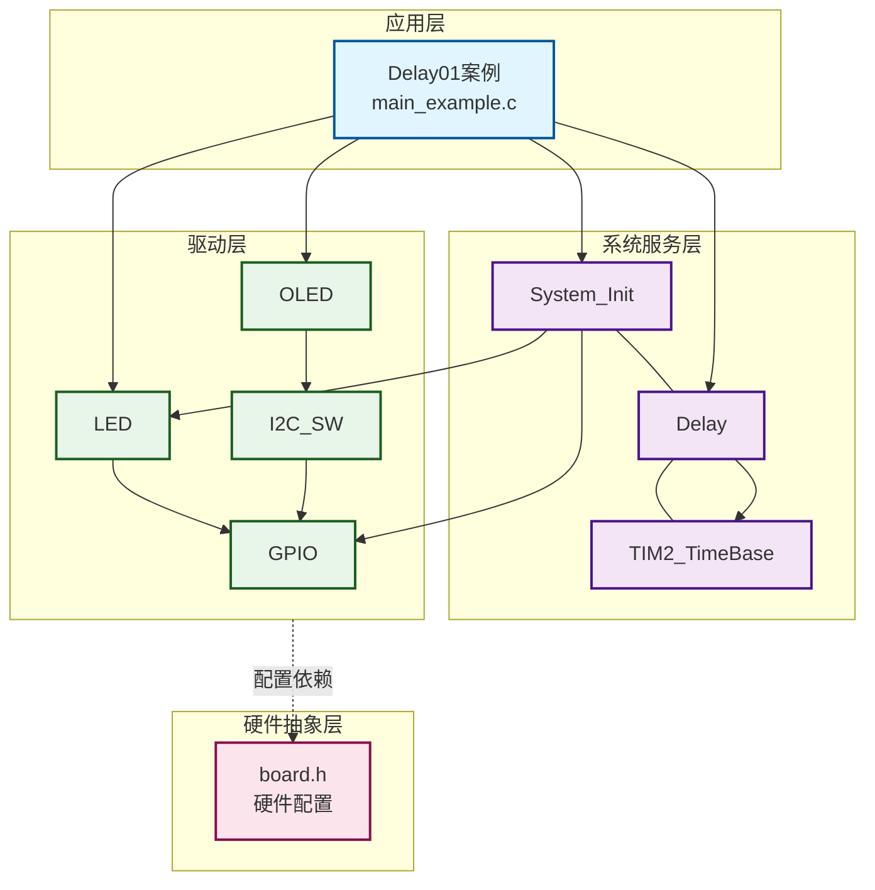
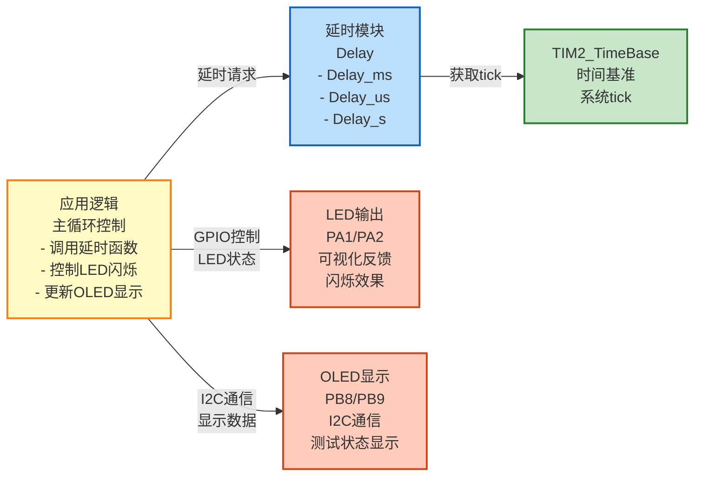

# Delay01 - Delay延时功能测试（带OLED显示）

## 📋 案例目的

- **核心目标**：测试Delay模块的各种延时功能，包括毫秒、微秒、秒级延时，使用OLED显示当前测试状态
- **学习重点**：
  - 理解Delay模块的三种延时函数（Delay_ms、Delay_us、Delay_s）的使用方法
  - 掌握不同延时时间的应用场景
  - 学习如何使用LED可视化延时效果
  - 了解阻塞式延时的特性
  - 学习OLED显示与延时功能的结合使用
- **应用场景**：适用于需要精确时序控制的应用，如LED闪烁控制、按键消抖、传感器采样间隔等

## 🔧 硬件要求

### 必需外设

- **LED1**：`PA1`（用于可视化延时效果）
- **LED2**：`PA2`（可选，用于交替闪烁演示）

### 传感器/模块

- **OLED显示屏**（SSD1306，I2C接口）
  - SCL：`PB8`
  - SDA：`PB9`
  - VCC：3.3V
  - GND：GND

### 硬件连接

| STM32F103C8T6 | 外设/模块 | 说明 |
|--------------|----------|------|
| PA1 | LED1正极 | LED1负极接GND |
| PA2 | LED2正极 | LED2负极接GND（可选） |
| PB8 | OLED SCL | I2C时钟线 |
| PB9 | OLED SDA | I2C数据线 |
| 3.3V | OLED VCC | 电源 |
| GND | OLED GND | 地线 |

**⚠️ 重要提示**：
- 案例是独立工程，硬件配置在案例目录下的 `board.h` 中
- 如果硬件引脚不同，直接修改 `Examples/Delay/Delay01_blink/board.h` 中的配置即可
- LED2为可选，如果只有一个LED，可以在配置中禁用LED2（enabled=0）

## 📦 模块依赖

### 模块依赖关系图

展示本案例使用的模块及其依赖关系：

### 模块列表

本案例使用以下模块：

- `delay`：延时模块（核心功能）
- `led`：LED驱动模块（用于可视化延时效果）
- `oled`：OLED显示驱动模块（用于显示测试状态）
- `i2c_sw`：软件I2C驱动模块（OLED使用）
- `gpio`：GPIO驱动模块（LED和I2C依赖）
- `system_init`：系统初始化模块
- `base_timer`：基时定时器模块（delay依赖）

## 🔄 实现流程

### 整体逻辑

本案例通过LED闪烁和OLED显示，直观地演示Delay模块的三种延时功能。程序分为四个测试阶段：

1. **测试1：毫秒级延时（Delay_ms）**
   - 快速闪烁（100ms间隔）
   - 中速闪烁（500ms间隔）
   - 慢速闪烁（1000ms间隔）

2. **测试2：微秒级延时（Delay_us）**
   - 快速闪烁（10ms间隔，使用微秒延时）
   - 中速闪烁（50ms间隔，使用微秒延时）

3. **测试3：秒级延时（Delay_s）**
   - 慢速闪烁（1秒间隔）

4. **测试4：主循环（不同延时时间组合）**
   - 快速闪烁3次（100ms）
   - 延时500ms
   - 中速闪烁3次（500ms）
   - 延时1秒
   - LED1和LED2交替闪烁5次（200ms）

### 关键方法

- **分阶段测试**：通过四个测试阶段，逐步演示不同延时函数和延时时间的效果
- **可视化反馈**：使用LED闪烁和OLED显示，让延时效果更直观
- **交替闪烁**：使用LED1和LED2交替闪烁，增强视觉效果
- **OLED状态显示**：实时显示当前测试阶段、延时时间、LED状态等信息

### 数据流向图

展示本案例的数据流向：应用逻辑 → 延时控制 → LED/OLED输出

**数据流说明**：

1. **应用逻辑**：
   - 主循环中调用延时函数（Delay_ms、Delay_us、Delay_s）
   - 控制LED闪烁（LED1_On/Off、LED2_On/Off）
   - 更新OLED显示测试状态

2. **延时模块**：
   - **Delay模块**：提供毫秒、微秒、秒级延时功能
   - 基于TIM2_TimeBase获取系统tick进行延时

3. **时间基准**：
   - **TIM2_TimeBase**：提供系统时间基准，用于延时计时

4. **输出设备**：
   - **LED**：通过GPIO控制，可视化延时效果（闪烁）
   - **OLED**：通过I2C通信，显示测试阶段、延时时间、LED状态等信息

### 工作流程示意

```mermaid
flowchart TD
    %% 初始化阶段
    subgraph INIT[初始化阶段]
        direction TB
        START[系统初始化<br/>System_Init]
        START --> OLED_INIT[OLED初始化<br/>OLED_Init]
    end
    
    %% 测试阶段
    subgraph TEST1[测试1：毫秒级延时]
        direction TB
        TEST1_START[测试1开始]
        TEST1_START --> FAST[快速闪烁<br/>100ms间隔<br/>LED闪烁]
        FAST --> MEDIUM[中速闪烁<br/>500ms间隔<br/>LED闪烁]
        MEDIUM --> SLOW[慢速闪烁<br/>1000ms间隔<br/>LED闪烁]
    end
    
    subgraph TEST2[测试2：微秒级延时]
        direction TB
        TEST2_START[测试2开始]
        TEST2_START --> US_FAST[快速闪烁<br/>10ms间隔<br/>Delay_us]
        US_FAST --> US_MEDIUM[中速闪烁<br/>50ms间隔<br/>Delay_us]
    end
    
    subgraph TEST3[测试3：秒级延时]
        direction TB
        TEST3_START[测试3开始]
        TEST3_START --> SEC[慢速闪烁<br/>1秒间隔<br/>Delay_s]
    end
    
    subgraph TEST4[测试4：主循环]
        direction TB
        TEST4_START[测试4开始]
        TEST4_START --> FAST3[快速闪烁3次<br/>100ms]
        FAST3 --> DELAY500[延时500ms]
        DELAY500 --> MEDIUM3[中速闪烁3次<br/>500ms]
        MEDIUM3 --> DELAY1S[延时1秒]
        DELAY1S --> ALT5[LED1和LED2<br/>交替闪烁5次<br/>200ms]
        ALT5 --> DELAY_LOOP[延时]
        DELAY_LOOP --> TEST4_START
    end
    
    %% 连接
    OLED_INIT --> TEST1_START
    SLOW --> TEST2_START
    US_MEDIUM --> TEST3_START
    SEC --> TEST4_START
    
    %% 样式
    style START fill:#e1f5ff,stroke:#01579b,stroke-width:2px
    style OLED_INIT fill:#e1f5ff,stroke:#01579b,stroke-width:2px
    style TEST1_START fill:#fff3e0,stroke:#e65100,stroke-width:2px
    style TEST4_START fill:#fff3e0,stroke:#e65100,stroke-width:3px
    style DELAY_LOOP fill:#f5f5f5,stroke:#757575,stroke-width:1px
```

## 📚 关键函数说明

### Delay相关函数

- **`Delay_ms()`**：毫秒级延时函数
  - 在本案例中用于实现LED闪烁的时间间隔（100ms、500ms、1000ms等）
  - 是最常用的延时函数，适用于大多数应用场景
  - 支持0~4294967295ms范围，自动分段处理

- **`Delay_us()`**：微秒级延时函数
  - 在本案例中用于实现精确的短时间延时（10ms、50ms）
  - 适用于需要高精度延时的场景
  - 支持0~1864135us范围（@72MHz）

- **`Delay_s()`**：秒级延时函数
  - 在本案例中用于实现长时间延时（1秒）
  - 适用于需要长时间等待的场景
  - 通过循环调用Delay_ms实现

### LED相关函数

- **`LED1_On()`**：开启LED1
  - 在本案例中用于点亮LED1，配合延时实现闪烁效果

- **`LED1_Off()`**：关闭LED1
  - 在本案例中用于熄灭LED1，配合延时实现闪烁效果

- **`LED2_On()`** / **`LED2_Off()`**：LED2控制函数
  - 在本案例中用于实现LED1和LED2的交替闪烁效果

### OLED相关函数

- **`OLED_Init()`**：初始化OLED显示屏
  - 在本案例中用于初始化OLED，为显示测试状态做准备

- **`OLED_Clear()`**：清屏函数
  - 在本案例中用于清除屏幕内容，准备显示新的测试信息

- **`OLED_ShowString()`**：显示字符串函数
  - 在本案例中用于显示测试阶段、延时时间、LED状态等信息

- **`OLED_ShowNum()`**：显示数字函数
  - 在本案例中用于显示闪烁计数

### 系统初始化函数

- **`System_Init()`**：系统初始化函数
  - 在本案例中用于初始化SysTick延时模块和LED驱动
  - 自动初始化所有enabled=1的模块

**详细函数实现和调用示例请参考**：`main_example.c` 中的代码

## ⚠️ 注意事项与重点

### ⚠️ 重要提示

1. **延时精度**：
   - 微秒级延时精度取决于系统时钟频率（72MHz）
   - 毫秒级延时通过循环调用微秒延时实现
   - 秒级延时通过循环调用毫秒延时实现

2. **阻塞特性**：
   - 所有延时函数都是**阻塞式**的
   - 延时期间CPU不处理其他任务
   - 如需非阻塞延时，请使用定时器中断或RTOS

3. **延时范围**：
   - `Delay_us()`：范围0~1864135us（@72MHz）
   - `Delay_ms()`：范围0~4294967295ms（自动分段处理）
   - `Delay_s()`：范围0~4294967295s

4. **硬件配置**：
   - 案例是独立工程，硬件配置在案例目录下的 `board.h` 中
   - 如果硬件引脚不同，需要修改 `board.h` 中的配置

5. **OLED初始化失败处理**：
   - 如果OLED初始化失败，LED1会快速闪烁提示错误

### 🔑 关键点

1. **延时函数选择**：
   - 毫秒级延时：最常用，适用于大多数场景
   - 微秒级延时：需要高精度时使用
   - 秒级延时：长时间等待时使用

2. **可视化反馈**：
   - 使用LED闪烁可以直观地观察延时效果
   - 使用OLED显示可以了解当前测试状态和延时时间

3. **交替闪烁**：
   - LED1和LED2交替闪烁可以增强视觉效果
   - 便于观察不同延时时间的差异

### 💡 调试技巧

1. **观察LED闪烁**：
   - 快速闪烁（100ms）应该能看到明显的闪烁
   - 慢速闪烁（1000ms）应该能看到明显的间隔

2. **使用示波器**：
   - 可以测量LED引脚的实际延时时间
   - 验证延时精度

3. **OLED显示检查**：
   - 如果OLED不显示，检查I2C连接和配置
   - 检查软件I2C模块是否已启用

## 💡 扩展练习

### 循序渐进理解本案例

1. **修改延时时间**：尝试不同的延时时间（50ms、200ms、2000ms等），观察LED闪烁效果的变化，理解延时时间对程序执行的影响
2. **测试延时精度**：使用示波器测量LED引脚的实际延时时间，验证不同延时时间的准确性，理解延时函数的精度
3. **创建自定义节奏**：设计自己的LED闪烁节奏，使用不同的延时时间组合，理解延时在程序控制中的应用

### 实际场景中的常见坑点

4. **延时阻塞问题**：`Delay_ms()` 是阻塞函数，会占用CPU时间，如果需要在延时的同时处理其他任务（如按键检测、传感器读取），如何实现非阻塞延时？如何实现多任务协调？
5. **延时精度问题**：当系统时钟频率变化时，延时精度会受到影响。如何保证延时精度？如何处理系统时钟切换对延时的影响？
6. **长时间延时溢出**：当延时时间很长时（如数小时），如果使用毫秒级延时，参数可能溢出。如何实现长时间延时？如何处理延时参数的溢出问题？
   - 尝试流水灯效果

6. **结合其他功能**：
   - 将延时功能与其他模块结合（如按键、传感器等）
   - 实现更复杂的应用场景

## 📖 相关文档

- **模块文档**：
  - **延时功能**：`../../System/delay.c/h`
  - **系统初始化**：`../../System/system_init.c/h`
  - **LED驱动**：`../../Drivers/basic/led.c/h`
  - **OLED驱动**：`../../Drivers/display/oled_ssd1306.c/h`
  - **OLED字库**：`../../Drivers/display/oled_font_ascii8x16.c/h`

- **业务文档**：
  - **主程序代码**：`main_example.c`
  - **硬件配置**：`board.h`
  - **模块配置**：`config.h`
  - **项目规范文档**：`../../AI/README.md`（AI规则体系）
  - **案例参考**：`Examples/README.md`
- **软件I2C驱动**：`../../Drivers/i2c/i2c_sw.c/h`
- **GPIO驱动**：`../../Drivers/basic/gpio.c/h`
- **硬件配置**：案例目录下的 `board.h`
- **模块配置**：案例目录下的 `config.h`
