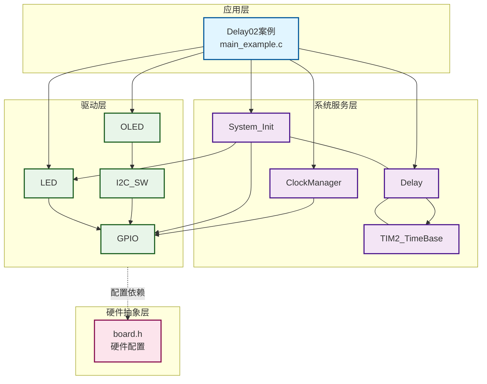
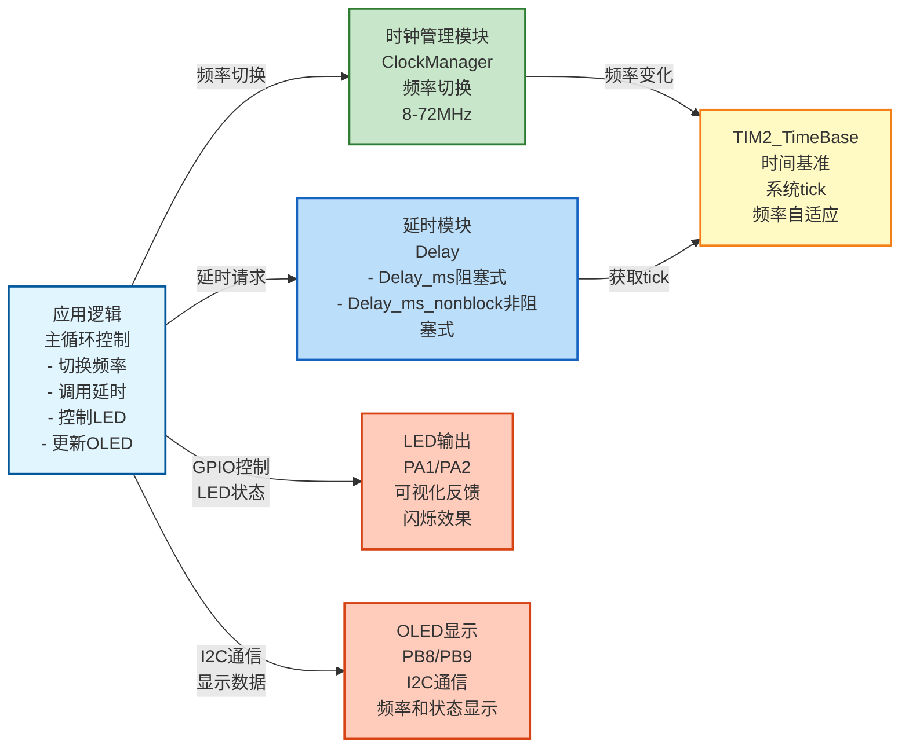
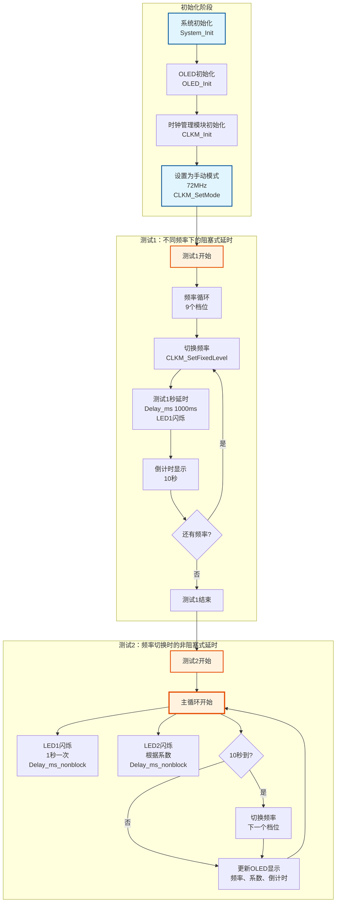

# Delay02 - delay模块手动调频测试

## 📋 案例目的

- **核心目标**：测试delay模块在不同频率下的延时准确性，验证频率变化时1秒永远是1秒
- **学习重点**：
  - 理解delay模块在不同频率下的工作原理
  - 掌握阻塞式延时（Delay_ms）和非阻塞式延时（Delay_ms_nonblock）的使用
  - 学习时钟管理模块的手动调频功能
  - 了解频率切换时延时时间的自动适配机制
  - 学习使用LED可视化延时效果和频率状态
- **应用场景**：适用于需要验证延时准确性的应用，如定时任务、频率切换场景等

**模块说明**：
- **TIM2_TimeBase**：TIM2外设定时器，提供1ms时间基准，频率切换时自动适配
- **delay**：阻塞式延时（基于SysTick）+ 非阻塞式延时（基于TIM2_TimeBase），频率切换时自动适配
- **clock_manager**：时钟管理模块，支持手动调频（本案例使用）

## 🔧 硬件要求

### 必需外设

- **LED1**：`PA1`（用于可视化延时效果）
- **LED2**：`PA2`（用于显示当前频率状态）

### 传感器/模块

- **OLED显示屏**（SSD1306，I2C接口）
  - SCL：`PB8`
  - SDA：`PB9`
  - VCC：3.3V
  - GND：GND

### 硬件连接

| STM32F103C8T6 | 外设/模块 | 说明 |
|--------------|----------|------|
| PA1 | LED1正极 | LED1负极接GND |
| PA2 | LED2正极 | LED2负极接GND |
| PB8 | OLED SCL | I2C时钟线 |
| PB9 | OLED SDA | I2C数据线 |
| 3.3V | OLED VCC | 电源 |
| GND | OLED GND | 地线 |

**⚠️ 重要提示**：
- 案例是独立工程，硬件配置在案例目录下的 `board.h` 中
- 如果硬件引脚不同，直接修改 `Examples/Delay/Delay02_LED_Freq_Sync/board.h` 中的配置即可

## 📦 模块依赖

### 模块依赖关系图

展示本案例使用的模块及其依赖关系：

### 模块列表

本案例使用以下模块：

- `delay`：延时模块（核心功能）
- `clock_manager`：时钟管理模块（用于手动调频）
- `TIM2_TimeBase`：TIM2时间基准模块（delay依赖，提供非阻塞延时）
- `oled`：OLED显示驱动模块（用于显示状态）
- `i2c_sw`：软件I2C驱动模块（OLED使用）
- `led`：LED驱动模块（用于可视化反馈）
- `gpio`：GPIO驱动模块（所有模块依赖）
- `system_init`：系统初始化模块

## 🔄 实现流程

### 整体逻辑

本案例通过在不同频率下测试延时功能，验证频率切换时延时时间的自动适配。程序分为两个测试阶段：

1. **测试1：不同频率下的阻塞式延时**
   - 依次切换到9个频率档位（72MHz、64MHz、56MHz、48MHz、40MHz、32MHz、24MHz、16MHz、8MHz）
   - 在每个频率下测试1秒延时（LED1闪烁）
   - 每个频率停留10秒，倒计时显示
   - LED2根据系数闪烁（系数1闪9次/秒，系数9闪1次/秒）

2. **测试2：频率切换时的非阻塞式延时**
   - LED1：1000ms（1秒）闪烁一次
   - LED2：根据系数闪烁（频率高闪得快，频率低闪得慢）
   - 每10秒自动切换一次频率（9个档位循环）
   - OLED显示当前频率、系数、倒计时

### 关键方法

- **频率切换测试**：通过手动切换频率，测试延时在不同频率下的准确性
- **阻塞式延时测试**：使用Delay_ms()测试阻塞式延时的准确性
- **非阻塞式延时测试**：使用Delay_ms_nonblock()测试非阻塞式延时的准确性
- **可视化反馈**：使用LED闪烁和OLED显示，直观观察延时效果

### 数据流向图

展示本案例的数据流向：时钟管理 → 延时控制 → LED/OLED输出

**数据流说明**：

1. **时钟管理**：
   - **ClockManager模块**：手动切换系统频率（8MHz-72MHz，9个档位）
   - 频率变化时，TIM2_TimeBase自动适配系数

2. **延时模块**：
   - **Delay模块**：提供阻塞式和非阻塞式延时功能
   - 基于TIM2_TimeBase获取系统tick，频率切换时自动适配

3. **时间基准**：
   - **TIM2_TimeBase**：提供系统时间基准，频率切换时自动调整系数
   - 确保延时时间在不同频率下保持一致

4. **应用逻辑**：
   - 主循环中切换频率、调用延时函数、控制LED闪烁、更新OLED显示

5. **输出设备**：
   - **LED**：通过GPIO控制，可视化延时效果（LED1固定1秒，LED2根据系数）
   - **OLED**：通过I2C通信，显示当前频率、系数、倒计时等信息

### 工作流程示意

## 📚 关键函数说明

### 延时相关函数

- **`Delay_ms()`**：阻塞式毫秒级延时函数
  - 在本案例中用于测试阻塞式延时的准确性
  - 基于SysTick，频率切换时自动适配系数
  - 确保1秒永远是1秒

- **`Delay_ms_nonblock()`**：非阻塞式毫秒级延时函数
  - 在本案例中用于测试非阻塞式延时的准确性
  - 基于TIM2_TimeBase，频率切换时自动适配
  - 确保1秒永远是1秒

- **`Delay_GetTick()`**：获取当前系统tick值
  - 在本案例中用于非阻塞延时的计时
  - 返回系统启动后的毫秒数

- **`Delay_GetElapsed()`**：计算经过的时间
  - 在本案例中用于计算倒计时
  - 参数：当前tick、开始tick
  - 返回值：经过的毫秒数

### 时钟管理相关函数

- **`CLKM_Init()`**：初始化时钟管理模块
  - 在本案例中用于初始化时钟管理模块

- **`CLKM_SetMode()`**：设置时钟管理模式
  - 在本案例中用于设置为手动模式
  - 参数：CLKM_MODE_MANUAL（手动模式）

- **`CLKM_SetFixedLevel()`**：设置固定频率档位
  - 在本案例中用于切换到指定的频率档位
  - 参数：频率档位（CLKM_LVL_72MHZ等）

- **`CLKM_GetCurrentFrequency()`**：获取当前频率
  - 在本案例中用于获取当前系统频率并显示
  - 返回值：当前频率（Hz）

- **`CLKM_GetCurrentLevel()`**：获取当前频率档位
  - 在本案例中用于获取当前系数并显示
  - 返回值：档位（0-8对应系数1-9）

### OLED相关函数

- **`OLED_Init()`**：初始化OLED显示屏
  - 在本案例中用于初始化OLED，显示测试状态

- **`OLED_ShowString()`**：显示字符串
  - 在本案例中用于显示测试阶段、频率、系数等信息

- **`OLED_ShowNum()`**：显示数字
  - 在本案例中用于显示频率、系数、倒计时等

### LED相关函数

- **`LED1_On()`** / **`LED1_Off()`**：LED1控制函数
  - 在本案例中用于1秒闪烁一次，验证延时准确性

- **`LED2_On()`** / **`LED2_Off()`**：LED2控制函数
  - 在本案例中用于根据系数闪烁（频率高闪得快，频率低闪得慢）

**详细函数实现和调用示例请参考**：`main_example.c` 中的代码

## ⚠️ 注意事项与重点

### ⚠️ 重要提示

1. **频率切换间隔**：
   - 频率切换需要一定时间（约200ms）
   - 切换后需要等待稳定，再开始测试

2. **延时精度**：
   - **阻塞式延时**（Delay_ms）：基于SysTick，频率切换时自动适配系数，确保延时准确
   - **非阻塞式延时**（Delay_ms_nonblock）：基于TIM2_TimeBase的1ms中断，频率切换时自动适配，确保1秒永远是1秒

3. **观察方法**：
   - 建议使用秒表或手机计时器辅助观察
   - 重点观察频率切换时，LED闪烁节奏是否保持不变

4. **频率档位**：
   - 系数1：72MHz（PLL，x9倍频）
   - 系数9：8MHz（HSI）
   - 中间档位：64MHz、56MHz、48MHz、40MHz、32MHz、24MHz、16MHz

### 🔑 关键点

1. **延时自动适配**：
   - delay模块在频率切换时自动适配系数
   - 确保无论频率如何变化，1秒永远是1秒

2. **阻塞式 vs 非阻塞式**：
   - 阻塞式延时：CPU被占用，无法处理其他任务
   - 非阻塞式延时：CPU可以处理其他任务，适合多任务场景

3. **可视化反馈**：
   - LED1闪烁速度反映延时准确性（应该始终1秒闪烁一次）
   - LED2闪烁速度反映频率变化（频率高闪得快，频率低闪得慢）

### 💡 调试技巧

1. **延时不准确排查**：
   - 检查频率切换是否成功（OLED应显示正确的频率）
   - 检查TIM2_TimeBase是否正常工作
   - 检查SysTick配置是否正确

2. **频率切换失败排查**：
   - 检查是否有外部晶振（无外部晶振时只能使用HSI频率）
   - 检查时钟管理模块是否已正确初始化
   - 检查频率切换超时保护

3. **LED闪烁异常排查**：
   - 检查LED配置是否正确
   - 检查延时函数是否被正确调用
   - 使用示波器测量LED引脚的实际延时时间

## 💡 扩展练习

### 循序渐进理解本案例

1. **测试更多频率档位**：修改测试频率列表，测试所有9个档位，观察不同频率下的延时准确性，理解系统频率对延时精度的影响
2. **测试微秒级延时**：添加微秒级延时测试（Delay_us），观察微秒级延时在不同频率下的准确性，理解微秒级延时的实现和精度
3. **优化显示**：改进OLED显示格式，添加更多信息显示（如延时误差、频率切换次数等），理解延时性能监控

### 实际场景中的常见坑点

4. **频率切换时的延时误差**：当系统频率切换时，延时函数可能需要重新校准，否则会产生误差。如何检测频率切换？如何实现延时函数的自动校准？
5. **延时精度与功耗平衡**：高频率下延时精度高但功耗也高，低频率下功耗低但精度较低。如何根据应用需求选择合适的频率？如何实现动态调频？
6. **多频率环境下的延时一致性**：如果程序需要在不同频率下运行，如何保证延时的一致性？如何实现延时时间的标准化（如无论频率如何，延时时间都准确）？
   - 对比手动模式和自动模式的效果

6. **性能测试**：
   - 测试频率切换对系统性能的影响
   - 测试延时精度在不同负载下的表现

## 📖 相关文档

- **模块文档**：
  - **延时功能**：`../../System/delay.c/h`
  - **时钟管理**：`../../System/clock_manager.c/h`
  - **TIM2时间基准**：`../../Drivers/timer/TIM2_TimeBase.c/h`
  - **OLED驱动**：`../../Drivers/display/oled_ssd1306.c/h`
  - **OLED字库**：`../../Drivers/display/oled_font_ascii8x16.c/h`

- **业务文档**：
  - **主程序代码**：`main_example.c`
  - **硬件配置**：`board.h`
  - **模块配置**：`config.h`
  - **项目规范文档**：`../../AI/README.md`（AI规则体系）
  - **案例参考**：`Examples/README.md`
- **软件I2C驱动**：`../../Drivers/i2c/i2c_sw.c/h`
- **LED驱动**：`../../Drivers/basic/led.c/h`
- **GPIO驱动**：`../../Drivers/basic/gpio.c/h`
- **系统初始化**：`../../System/system_init.c/h`
- **硬件配置**：案例目录下的 `board.h`
- **模块配置**：案例目录下的 `config.h`
