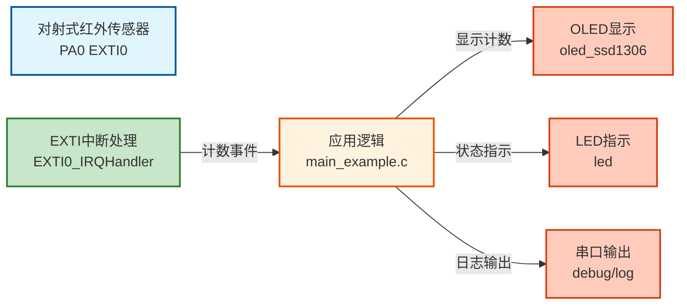

# EXTI01 - 对射式红外传感器计次示例

使用外部中断（EXTI）实现对射式红外传感器的计次功能�?
---

## 📋 案例目的

- **核心目标**
  - 演示如何使用外部中断（EXTI）实现对射式红外传感器的计次功能

- **学习重点**�?  - EXTI外部中断的配置和使用方法
  - EXTI中断回调函数的编�?  - 中断中只做简单操作（计数），复杂操作在主循环处理
  - 理解中断服务程序（ISR）已在Core层实现，案例只需写回调函�?- **应用场景**：适用于需要快速响应外部事件的场景，如物体计数、触发检测等

---

## 🔧 硬件要求

### 必需外设

- **LED1**：`PA1`（状态指示，计数时闪烁）

### 传感�?模块

- **对射式红外传感器模块**
  - OUT：`PA0`（EXTI Line 0，外部中断输入）
  - VCC�?.3V�?V（根据传感器规格�?  - GND：GND
  - **注意**�?    - 对射式红外传感器输出逻辑可能不同，本案例使用**双边沿触�?*（`EXTI_TRIGGER_RISING_FALLING`�?    - 双边沿触发可以在电平变化时（上升沿或下降沿）都触发中断，适用于各种传感器输出逻辑
    - 如果传感器输出逻辑已知，也可以使用单边沿触发（上升沿或下降沿）

- **OLED显示�?*（SSD1306，软件I2C接口，可选）
  - SCL：`PB8`
  - SDA：`PB9`
  - VCC�?.3V
  - GND：GND

### 硬件连接

| STM32F103C8T6 | 对射式红外传感器 | 说明 |
|--------------|----------------|------|
| PA0 | OUT（输出信号） | EXTI Line 0，双边沿触发 |
| 3.3V | VCC | 电源（根据传感器规格，可能是3.3V�?V�?|
| GND | GND | 地线 |

**⚠️ 重要提示**�?- PA0配置�?*上拉输入**（`GPIO_MODE_INPUT_PULLUP`），适用于开漏输出的传感�?- 如果传感器内部已有上拉，可以改为浮空输入（`GPIO_MODE_INPUT_FLOATING`�?
**⚠️ 重要提示**�?- 案例是独立工程，硬件配置在案例目录下�?`board.h` �?- 如果硬件引脚不同，直接修�?`Examples/EXTI/EXTI01_Infrared_Counter/board.h` 中的配置即可
- 本案例使�?*双边沿触�?*，适用于各种传感器输出逻辑（遮挡时高电平或低电平都能触发）
- 如果传感器输出逻辑已知，可以改为单边沿触发以提高效�?
---

## 📦 模块依赖

### 模块依赖关系�?
```mermaid
graph TB
    %% 应用�?    subgraph APP[应用层]
        MAIN[main_example.c<br/>主程序]
    end
    
    %% 系统服务�?    subgraph SYS[系统服务层]
        DELAY[delay<br/>延时模块]
        SYS_INIT[system_init<br/>系统初始化]
    end
    
    %% 驱动�?    subgraph DRV[驱动层]
        EXTI[exti<br/>外部中断模块]
        GPIO[gpio<br/>GPIO驱动]
        LED[led<br/>LED驱动]
        OLED[oled_ssd1306<br/>OLED显示驱动]
        I2C_SW[i2c_sw<br/>软件I2C驱动]
    end
    
    %% 调试工具�?    subgraph DEBUG[调试工具层]
        DEBUG_MOD[debug<br/>Debug模块]
        LOG[log<br/>日志模块]
        ERROR[error_handler<br/>错误处理]
    end
    
    %% 硬件抽象�?    subgraph BSP[硬件抽象层]
        BOARD[board.h<br/>硬件配置]
    end
    
    %% 依赖关系
    MAIN --> EXTI
    MAIN --> LED
    MAIN --> OLED
    MAIN --> DELAY
    MAIN --> SYS_INIT
    
    EXTI --> GPIO
    OLED --> I2C_SW
    I2C_SW --> GPIO
    LED --> GPIO
    
    SYS_INIT --> GPIO
    SYS_INIT --> LED
    SYS_INIT --> DELAY
    
    EXTI -.-> BOARD
    GPIO -.-> BOARD
    LED -.-> BOARD
    OLED -.-> BOARD
    I2C_SW -.-> BOARD
    
    %% 样式
    style MAIN fill:#e1f5ff,stroke:#01579b,stroke-width:2px
    style EXTI fill:#c8e6c9,stroke:#2e7d32,stroke-width:2px
    style GPIO fill:#c8e6c9,stroke:#2e7d32,stroke-width:2px
    style LED fill:#c8e6c9,stroke:#2e7d32,stroke-width:2px
    style OLED fill:#c8e6c9,stroke:#2e7d32,stroke-width:2px
    style BOARD fill:#fff3e0,stroke:#e65100,stroke-width:2px
```

### 模块列表

- `exti`：外部中断模块（核心功能�?- `gpio`：GPIO模块（EXTI依赖�?- `led`：LED驱动模块（状态指示）
- `oled`：OLED显示驱动模块（显示计数，可选）
- `soft_i2c`：软件I2C模块（OLED依赖�?- `delay`：延时模�?- `system_init`：系统初始化模块

---

## 🔄 实现流程

### 整体逻辑

1. **系统初始化阶�?*�?   - 调用 `System_Init()` 初始化系统基础功能
   - 初始化OLED显示（可选）
   - 初始化EXTI0（PA0，双边沿触发，中断模式）
   - 重新配置PA0为上拉输入（EXTI初始化会将GPIO配置为浮空输入）
   - 设置EXTI中断回调函数
   - 使能EXTI中断

2. **主循环阶�?*�?   - 检查计数器是否变化
   - 更新OLED显示（如果使用）
   - LED闪烁反馈
   - 延时降低CPU占用�?
3. **中断处理阶段**（自动触发）�?   - 对射式红外传感器检测到物体通过
   - 触发EXTI0中断
   - Core层的 `EXTI0_IRQHandler()` 自动调用 `EXTI_IRQHandler(EXTI_LINE_0)`
   - EXTI模块调用用户回调函数 `InfraredSensor_Callback()`
   - 回调函数中只做简单操作：计数器递增

### 数据流向�?


### 关键方法

1. **EXTI初始�?*：使�?`EXTI_HW_Init()` 初始化EXTI�?   - 参数：EXTI线号、触发模式（上升�?下降�?双边沿）、模式（中断/事件�?
2. **EXTI回调设置**：使�?`EXTI_SetCallback()` 设置中断回调函数
   - 回调函数在中断中调用，应尽可能简�?   - 只做简单操作（如计数、设置标志），复杂操作在主循环处�?
3. **EXTI使能**：使�?`EXTI_Enable()` 使能EXTI中断
   - 使能后，EXTI中断才会触发

### 工作流程示意�?
```mermaid
flowchart TD
    %% 初始化阶�?    subgraph INIT[初始化阶段]
        direction TB
        START[系统初始�?br/>System_Init]
        START --> OLED_INIT[OLED初始�?br/>OLED_Init]
        OLED_INIT --> EXTI_INIT[EXTI0初始�?br/>EXTI_HW_Init<br/>PA0 双边沿触发]
        EXTI_INIT --> SET_CALLBACK[设置EXTI回调函数<br/>EXTI_SetCallback]
        SET_CALLBACK --> ENABLE_EXTI[使能EXTI中断<br/>EXTI_Enable]
    end
    
    %% 主循环阶�?    subgraph LOOP[主循环阶段]
        direction TB
        MAIN_LOOP[主循环开始]
        MAIN_LOOP --> CHECK_COUNT{计数变化?}
        CHECK_COUNT -->|是| UPDATE_OLED[更新OLED显示]
        CHECK_COUNT -->|否| LED_BLINK[LED闪烁]
        UPDATE_OLED --> LED_BLINK
        LED_BLINK --> DELAY[延时降低CPU占用]
        DELAY --> MAIN_LOOP
    end
    
    %% 中断处理阶段
    subgraph INT[中断处理阶段]
        direction TB
        SENSOR_TRIGGER[物体通过<br/>传感器输出边沿变化]
        SENSOR_TRIGGER --> EXTI0_ISR[EXTI0中断触发<br/>EXTI0_IRQHandler]
        EXTI0_ISR --> EXTI_HANDLER[EXTI模块处理<br/>EXTI_IRQHandler]
        EXTI_HANDLER --> CALLBACK[用户回调函数<br/>InfraredSensor_Callback]
        CALLBACK --> COUNT_INC[计数器递增]
    end
    
    %% 连接
    ENABLE_EXTI --> MAIN_LOOP
    COUNT_INC -.->|异步事件| CHECK_COUNT
    
    %% 样式 - 初始�?    style START fill:#e1f5ff,stroke:#01579b,stroke-width:2px
    style ENABLE_EXTI fill:#e1f5ff,stroke:#01579b,stroke-width:2px
    
    %% 样式 - 主循�?    style MAIN_LOOP fill:#fff3e0,stroke:#e65100,stroke-width:3px
    style CHECK_COUNT fill:#c8e6c9,stroke:#2e7d32,stroke-width:2px
    style UPDATE_OLED fill:#ffccbc,stroke:#d84315,stroke-width:2px
    style DELAY fill:#f5f5f5,stroke:#757575,stroke-width:1px
    
    %% 样式 - 中断处理
    style SENSOR_TRIGGER fill:#e1f5ff,stroke:#01579b,stroke-width:2px
    style CALLBACK fill:#bbdefb,stroke:#1565c0,stroke-width:2px
    style COUNT_INC fill:#bbdefb,stroke:#1565c0,stroke-width:2px
```

---

## 📚 关键函数说明

### EXTI相关函数

- **`EXTI_HW_Init()`**：初始化外部中断
  - 参数：EXTI线号、触发模式、模式（中断/事件�?  - 返回值：`EXTI_OK`表示成功

- **`EXTI_SetCallback()`**：设置EXTI中断回调函数
  - 参数：EXTI线号、回调函数指针、用户数据指�?  - 回调函数在中断中调用，应尽可能简�?
- **`EXTI_Enable()`**：使能EXTI中断
  - 使能后，EXTI中断才会触发

- **`EXTI_Disable()`**：禁用EXTI中断
  - 禁用后，EXTI中断不会触发

### 中断服务程序（ISR�?
**⚠️ 重要说明**�?- EXTI的ISR已在 `Core/stm32f10x_it.c` 中实�?- 案例**不需�?*实现ISR，只需要写回调函数
- ISR会自动调用EXTI模块的处理函数，然后调用用户回调函数

**ISR实现位置**�?- `Core/stm32f10x_it.c`：包含所有EXTI ISR实现
  - EXTI0-4：独立中断向量（`EXTI0_IRQHandler` ~ `EXTI4_IRQHandler`�?  - EXTI5-9：共享中断向量（`EXTI9_5_IRQHandler`�?  - EXTI10-15：共享中断向量（`EXTI15_10_IRQHandler`�?
---

## 💻 代码说明

### 中断回调函数

```c
static void InfraredSensor_Callback(EXTI_Line_t line, void *user_data)
{
    (void)line;
    (void)user_data;
    
    /* 在中断回调中只做简单操作：计数 */
    g_counter++;
    
    /* 注意：不要在这里执行复杂操作（如OLED显示），复杂操作在主循环处理 */
}
```

**设计原则**�?- �?只做简单操作：计数、设置标志等
- �?不要执行复杂操作：OLED显示、延时、阻塞操作等
- �?复杂操作在主循环处理

### 主循环逻辑

```c
while(1)
{
    /* 检查计数器是否变化 */
    if (g_counter != last_counter)
    {
        last_counter = g_counter;
        
        /* 更新OLED显示 */
        OLED_ShowNum(2, 7, g_counter, 5);
        
        /* LED闪烁反馈 */
        LED1_Toggle();
    }
    
    /* 延时降低CPU占用�?*/
    Delay_ms(10);
}
```

---

## 🚀 使用方法

### 步骤1：硬件准�?
- STM32F103C8T6开发板（或兼容板）
- 对射式红外传感器模块
- OLED显示屏（可选）
- USB数据线（用于下载程序�?
### 步骤2：硬件连�?
- 对射式红外传感器OUT �?PA0
- 传感器VCC �?3.3V�?V
- 传感器GND �?GND
- OLED SCL �?PB8（可选）
- OLED SDA �?PB9（可选）

### 步骤3：打开案例工程

- 双击 `Examples/EXTI/EXTI01_Infrared_Counter/Examples.uvprojx` 打开Keil工程

### 步骤4：检�?修改硬件配置

- 检查案例目录下�?`board.h` 配置是否正确
- 如果硬件引脚不同，直接修�?`board.h` 中的配置

### 步骤5：编译项�?
- 点击工具栏的 **编译按钮**（或�?`F7`�?- 等待编译完成，应该显示：`0 Error(s), 0 Warning(s)`

### 步骤6：下载到开发板

- 点击工具栏的 **下载按钮**（或�?`F8`�?- 等待下载完成，程序会自动运行

### 步骤7：观察效�?
- 当物体通过对射式红外传感器时，计数器会递增
- OLED显示计数（如果使用）
- LED闪烁反馈（每次计数时闪烁�?
---

## ⚠️ 常见问题排查

### 问题1：计数器不递增

**可能原因**�?- EXTI初始化失�?- 传感器未正确连接
- GPIO配置问题（需要上拉输入）

**解决方法**�?1. 检�?`board.h` 中的EXTI配置是否正确（应使用 `EXTI_TRIGGER_RISING_FALLING`�?2. 检查PA0连接是否正确
3. 确认PA0配置为上拉输入（`GPIO_MODE_INPUT_PULLUP`�?4. 使用万用表测量PA0引脚电平，确认传感器输出有变�?5. 检查传感器电源和地线连�?
### 问题2：EXTI初始化失�?
**现象**：LED快速闪烁（100ms间隔�?
**可能原因**�?- GPIO配置错误
- EXTI配置错误

**解决方法**�?1. 检�?`board.h` 中的EXTI配置
2. 检查GPIO是否已正确初始化
3. 查看错误处理日志（如果启用）

### 问题3：计数不准确（重复计数或漏计数）

**可能原因**�?- 传感器输出抖�?- 物体通过速度过快

**解决方法**�?1. 检查传感器输出是否稳定
2. 本案例已使用双边沿触发，可以检测所有电平变�?3. 如果传感器输出有抖动，可以在回调函数中添加软件消抖（不推荐，会增加中断处理时间）
4. 检查传感器安装位置和角度，确保物体通过时信号稳�?
---

## 💡 扩展练习

### 循序渐进理解本案�?
1. **修改触发模式**：如果传感器输出逻辑已知，可以改为单边沿触发（`EXTI_TRIGGER_RISING` �?`EXTI_TRIGGER_FALLING`），理解不同触发模式的应用场�?2. **使用其他EXTI�?*：尝试使用PA1（EXTI Line 1）或PB0（EXTI Line 0，但不同端口），理解EXTI线号与GPIO引脚的对应关�?3. **添加消抖功能**：在主循环中添加软件消抖逻辑，或使用定时器实现硬件消抖，理解消抖的必要性和实现方法

### 实际场景中的常见坑点

4. **快速计数丢�?*：当物体快速通过传感器时，如果中断处理时间较长，可能丢失计数。如何确保不丢失快速计数？如何处理中断嵌套和优先级问题�?5. **传感器信号干�?*：在实际应用中，传感器信号可能受到电磁干扰，导致误触发。如何提高抗干扰能力？如何区分真实触发和干扰信号�?6. **多传感器冲突**：如果使用多个EXTI线连接多个传感器，当它们同时触发时，如何处理中断冲突和资源竞争？如何实现多传感器的协调管理？

---

## 📖 相关文档

- **模块文档**�?  - **EXTI模块文档**：`Drivers/peripheral/exti/README.md`

- **业务文档**�?  - **主程序代�?*：`main_example.c`
  - **硬件配置**：`board.h`
  - **模块配置**：`config.h`
  - **项目规范文档**：`PROJECT_KEYWORDS.md`
  - **案例参�?*：`Examples/README.md`

---

## ⚠️ 重要说明

1. **ISR已在Core层实�?*�?   - EXTI的ISR已在 `Core/stm32f10x_it.c` 中实�?   - 案例**不需�?*实现ISR，只需要写回调函数

2. **中断回调函数应简�?*�?   - 在中断回调中只做简单操作（计数、设置标志）
   - 不要执行复杂操作（OLED显示、延时等�?
3. **性能开销**�?   - EXTI0使用独立中断向量，开销很小（约0.14-0.28微秒�?   - 对于对射式红外传感器（低频中断），开销完全可以忽略

4. **硬件配置**�?   - 案例是独立工程，硬件配置在案例目录下�?`board.h` �?   - 如果硬件引脚不同，直接修�?`board.h` 中的配置即可

---

---

## �?测试状�?
**测试日期**�?024-01-01  
**测试结果**：✅ 测试通过，功能正�?
**测试内容**�?- �?EXTI初始化正�?- �?中断触发正常（遮挡和离开都能触发�?- �?计数器递增正常（遮�?1，离开+1�?- �?OLED显示正常
- �?LED反馈正常

**注意事项**�?- PA0配置为上拉输入，适用于开漏输出的传感�?- 使用双边沿触发，适用于各种传感器输出逻辑
- 中断回调函数只做计数操作，符合设计原�?
---

**最后更�?*�?024-01-01
