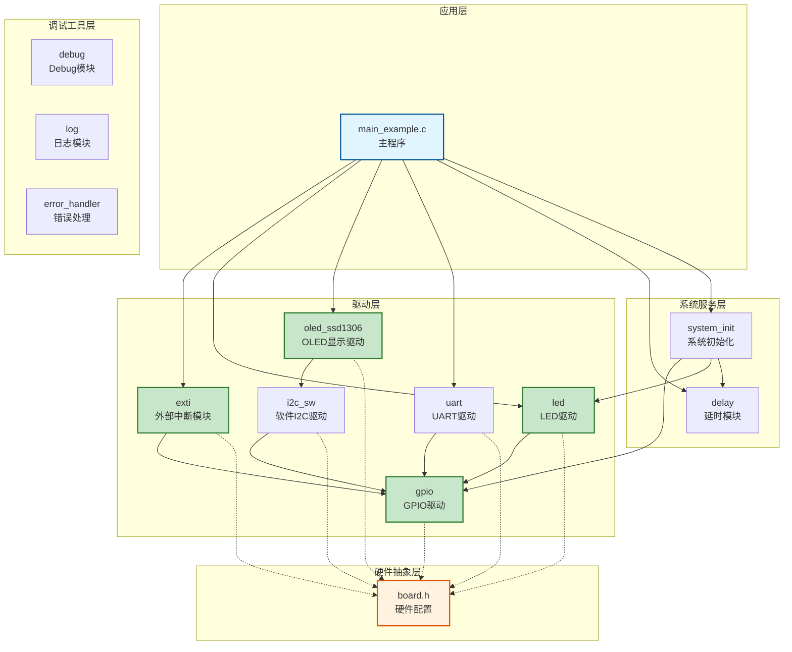
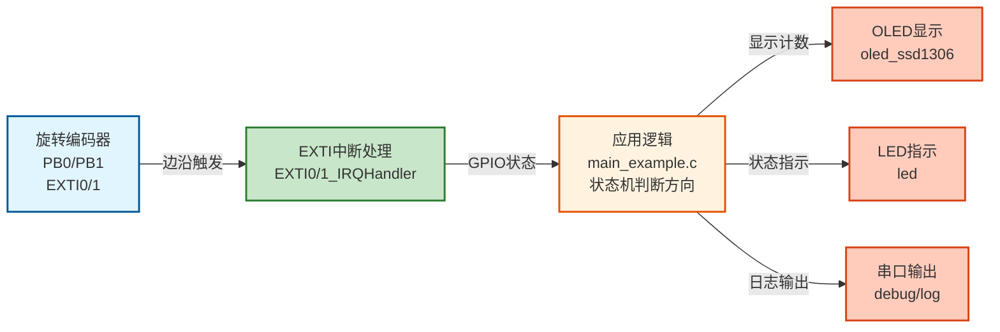
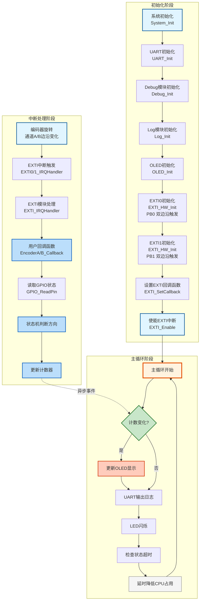

# EXTI02 - 旋转编码器计数示例

使用外部中断（EXTI）实现旋转编码器的计数功能，通过状态机方法读取两个通道的当前状态，根据状态变化模式判断旋转方向。

---

## 📋 案例目的

- **核心目标**
  - 演示如何使用外部中断（EXTI）实现旋转编码器的计数功能，通过状态机方法读取两个通道的当前状态，根据状态变化模式判断旋转方向

- **学习重点**：
  - EXTI外部中断的配置和使用方法（双通道配置）
  - EXTI中断回调函数的编写（两个通道的回调函数）
  - 状态机方法判断旋转方向的算法（读取GPIO状态，根据状态变化模式判断）
  - 中断中只做简单操作（读取状态、更新计数），复杂操作在主循环处理
  - 理解中断服务程序（ISR）已在Core层实现，案例只需写回调函数
- **应用场景**：适用于需要检测旋转方向和计数的场景，如音量调节、参数设置、位置检测等

---

## 🔧 硬件要求

### 必需外设

- **LED1**：`PA1`（状态指示，计数时闪烁）

### 传感器/模块

- **旋转编码器模块**
  - 通道A：`PB0`（EXTI Line 0，外部中断输入）
  - 通道B：`PB1`（EXTI Line 1，外部中断输入）
  - VCC：独立供电（不依赖STM32）
  - GND：GND
  - **注意**：
    - 旋转编码器输出正交信号，两个通道相位差90度
    - 本案例使用**双边沿触发**（`EXTI_TRIGGER_RISING_FALLING`）
    - 使用状态机方法：在中断中读取两个通道的当前状态，根据状态变化模式判断方向
    - 正转：状态变化 `00 -> 01` → 计数器+1
    - 反转：状态变化 `00 -> 10` → 计数器-1
    - 每个步进只计数一次（避免重复计数）

- **OLED显示屏**（SSD1306，软件I2C接口，可选）
  - SCL：`PB8`
  - SDA：`PB9`
  - VCC：3.3V
  - GND：GND

### 硬件连接

| STM32F103C8T6 | 旋转编码器 | 说明 |
|--------------|-----------|------|
| PB0 | 通道A（输出信号） | EXTI Line 0，双边沿触发 |
| PB1 | 通道B（输出信号） | EXTI Line 1，双边沿触发 |
| 3.3V | VCC | 电源（编码器独立供电，此引脚可选） |
| GND | GND | 地线 |

**?? 重要提示**：
- PB0和PB1配置为**上拉输入**（`GPIO_MODE_INPUT_PULLUP`），适用于开漏输出的编码器
- 如果编码器内部已有上拉，可以改为浮空输入（`GPIO_MODE_INPUT_FLOATING`）
- 编码器电源独立供电，不依赖STM32

**?? 重要提示**：
- 案例是独立工程，硬件配置在案例目录下的 `board.h` 中
- 如果硬件引脚不同，直接修改 `Examples/EXTI/EXTI02_RotaryEncoder_Counter/board.h` 中的配置即可
- 本案例使用**双边沿触发**，检测所有边沿变化
- 使用状态机方法：在中断中读取GPIO状态，根据状态变化模式判断方向

---

## 📦 模块依赖

### 模块依赖关系图



### 模块列表

- `exti`：外部中断模块（核心功能）
- `gpio`：GPIO模块（EXTI依赖）
- `led`：LED驱动模块（状态指示）
- `oled`：OLED显示驱动模块（显示计数，可选）
- `soft_i2c`：软件I2C模块（OLED依赖）
- `uart`：UART模块（串口调试）
- `debug`：Debug模块（printf重定向）
- `log`：Log模块（分级日志）
- `error_handler`：错误处理模块
- `delay`：延时模块
- `system_init`：系统初始化模块

---

## 🔄 实现流程

### 整体逻辑

1. **系统初始化阶段**：
   - 调用 `System_Init()` 初始化系统基础功能
   - 初始化UART、Debug、Log、ErrorHandler（新项目标准初始化流程）
   - 初始化OLED显示（可选）
   - 初始化EXTI0（PB0，双边沿触发，中断模式）
   - 初始化EXTI1（PB1，双边沿触发，中断模式）
   - 重新配置PB0和PB1为上拉输入（EXTI初始化会将GPIO配置为浮空输入）
   - 设置EXTI中断回调函数（EncoderA_Callback和EncoderB_Callback）
   - 使能EXTI中断

2. **主循环阶段**：
   - 检查计数器是否变化
   - 更新OLED显示（如果使用）
   - 通过UART输出详细日志
   - LED闪烁反馈
   - 检查编码器状态超时（清除超时的状态）
   - 延时降低CPU占用率

3. **中断处理阶段**（自动触发）：
   - 旋转编码器旋转，产生边沿变化
   - 触发EXTI0或EXTI1中断
   - Core层的 `EXTI0_IRQHandler()` 或 `EXTI1_IRQHandler()` 自动调用 `EXTI_IRQHandler()`
   - EXTI模块调用用户回调函数（`EncoderA_Callback()` 或 `EncoderB_Callback()`）
   - 回调函数中：
     - 读取两个通道的当前GPIO状态
     - 使用状态机方法判断状态变化
     - 根据状态变化模式判断方向并更新计数器

### 关键方法

1. **EXTI初始化**：使用 `EXTI_HW_Init()` 初始化EXTI线
   - 参数：EXTI线号、触发模式（上升沿/下降沿/双边沿）、模式（中断/事件）
   - 本案例使用双边沿触发（`EXTI_TRIGGER_RISING_FALLING`）

2. **EXTI回调设置**：使用 `EXTI_SetCallback()` 设置中断回调函数
   - 回调函数在中断中调用，应尽可能简短
   - 只做简单操作（如记录状态、更新计数），复杂操作在主循环处理

3. **EXTI使能**：使用 `EXTI_Enable()` 使能EXTI中断
   - 使能后，EXTI中断才会触发

4. **方向检测算法**：使用状态机方法判断旋转方向
   - 在中断中读取两个通道的当前GPIO状态
   - 根据状态变化模式判断方向：
     - 正转：状态变化 `00 -> 01` → 计数器+1
     - 反转：状态变化 `00 -> 10` → 计数器-1
   - 每个步进只计数一次（避免重复计数）
   - 不依赖时间窗口，更可靠

### 数据流向图



### 工作流程示意图



---

## 📚 关键函数说明

### EXTI相关函数

- **`EXTI_HW_Init()`**：初始化外部中断
  - 参数：EXTI线号、触发模式、模式（中断/事件）
  - 返回值：`EXTI_OK`表示成功
  - 在本案例中用于初始化EXTI0和EXTI1，都使用双边沿触发

- **`EXTI_SetCallback()`**：设置EXTI中断回调函数
  - 参数：EXTI线号、回调函数指针、用户数据指针
  - 回调函数在中断中调用，应尽可能简短
  - 在本案例中用于设置EncoderA_Callback和EncoderB_Callback

- **`EXTI_Enable()`**：使能EXTI中断
  - 使能后，EXTI中断才会触发

- **`EXTI_Disable()`**：禁用EXTI中断
  - 禁用后，EXTI中断不会触发

### 中断服务程序（ISR）

**?? 重要说明**：
- EXTI的ISR已在 `Core/stm32f10x_it.c` 中实现
- 案例**不需要**实现ISR，只需要写回调函数
- ISR会自动调用EXTI模块的处理函数，然后调用用户回调函数

**ISR实现位置**：
- `Core/stm32f10x_it.c`：包含所有EXTI ISR实现
  - EXTI0-4：独立中断向量（`EXTI0_IRQHandler` ~ `EXTI4_IRQHandler`）
  - EXTI5-9：共享中断向量（`EXTI9_5_IRQHandler`）
  - EXTI10-15：共享中断向量（`EXTI15_10_IRQHandler`）

### 方向检测算法

**核心原理**：
- 旋转编码器两个通道（A和B）输出正交信号，旋转时产生相位差90度的方波
- 使用状态机方法：在中断中读取两个通道的当前状态，根据状态变化模式判断方向

**状态变化模式**：
- 正转：`00 -> 01 -> 11 -> 10 -> 00`（循环）
- 反转：`00 -> 10 -> 11 -> 01 -> 00`（循环）
- 状态编码：bit0=通道A(PB0)，bit1=通道B(PB1)

**实现方法**：
- 在中断回调函数中读取两个通道的当前GPIO状态
- 与上一次状态比较，判断状态变化
- 只在特定状态变化时计数（避免重复计数）：
  - 正转：只在 `00 -> 01` 时计数+1
  - 反转：只在 `00 -> 10` 时计数-1
- 每个步进只计数一次，确保计数准确

**优势**：
- 不依赖时间窗口，更可靠
- 快速旋转时也能准确计数
- 自然过滤编码器抖动

---

## 📝 代码说明

### 中断回调函数

```c
static void EncoderA_Callback(EXTI_Line_t line, void *user_data)
{
    /* 读取两个通道的当前状态 */
    uint8_t state_a = GPIO_ReadPin(GPIOB, GPIO_Pin_0) ? 1 : 0;  /* 通道A状态 */
    uint8_t state_b = GPIO_ReadPin(GPIOB, GPIO_Pin_1) ? 1 : 0;  /* 通道B状态 */
    uint8_t current_state = (state_a) | (state_b << 1);  /* 组合状态：bit0=A, bit1=B */
    
    /* 使用状态机判断方向 */
    Encoder_ProcessState(current_state);
}
```

**状态机处理函数**：
```c
static void Encoder_ProcessState(uint8_t current_state)
{
    uint8_t last_state = g_encoder_last_state;
    
    /* 只在从00状态变化时计数（避免重复计数） */
    if (last_state == 0x00)
    {
        if (current_state == 0x01)  /* 00 -> 01（正转） */
        {
            g_counter++;  /* 正转：+1 */
        }
        else if (current_state == 0x02)  /* 00 -> 10（反转） */
        {
            g_counter--;  /* 反转：-1 */
        }
    }
    
    /* 更新上一次状态 */
    g_encoder_last_state = current_state;
}
```

**设计原则**：
- **只做简单操作**：读取GPIO状态、更新计数等
- **不要执行复杂操作**：OLED显示、延时、阻塞操作等
- **复杂操作在主循环处理**

### 主循环逻辑

```c
while(1)
{
    /* 检查计数器是否变化 */
    if (g_counter != last_counter)
    {
        /* 判断方向（根据计数器变化） */
        if (g_counter > last_counter)
        {
            strcpy(direction_str, "CW ");  /* 顺时针（正转） */
        }
        else
        {
            strcpy(direction_str, "CCW"); /* 逆时针（反转） */
        }
        
        /* 更新OLED显示（使用有符号数显示，支持负数） */
        OLED_ShowSignedNum(3, 10, g_counter, 5);
        OLED_ShowString(4, 5, direction_str);
        
        /* UART日志输出 */
        LOG_INFO("ENCODER", "计数器: %d, 方向: %s", g_counter, direction_str);
        
        /* LED闪烁反馈 */
        LED1_Toggle();
        
        /* 更新last_counter */
        last_counter = g_counter;
    }
    
    /* 延时降低CPU占用率 */
    Delay_ms(10);
}
```

---

## 🚀 使用方法

### 步骤1：硬件准备

- STM32F103C8T6开发板（或兼容板）
- 旋转编码器模块
- OLED显示屏（可选）
- USB数据线（用于下载程序）

### 步骤2：硬件连接

- 编码器通道A → PB0
- 编码器通道B → PB1
- 编码器VCC → 独立电源（不依赖STM32）
- 编码器GND → GND
- OLED SCL → PB8（可选）
- OLED SDA → PB9（可选）

### 步骤3：打开案例工程

- 双击 `Examples/EXTI/EXTI02_RotaryEncoder_Counter/Examples.uvprojx` 打开Keil工程

### 步骤4：检查/修改硬件配置

- 检查案例目录下的 `board.h` 配置是否正确
- 如果硬件引脚不同，直接修改 `board.h` 中的配置

### 步骤5：编译项目

- 点击工具栏的 **编译按钮**（或按 `F7`）
- 等待编译完成，应该显示：`0 Error(s), 0 Warning(s)`

### 步骤6：下载到开发板

- 点击工具栏的 **下载按钮**（或按 `F8`）
- 等待下载完成，程序会自动运行

### 步骤7：观察效果

- 旋转编码器时，计数器会根据方向加减
- OLED显示计数和方向（如果使用）
- UART输出详细日志
- LED闪烁反馈（每次计数时闪烁）

---

## 🔍 常见问题排查

### 问题1：计数器不变化

**可能原因**：
- EXTI初始化失败
- 编码器未正确连接
- GPIO配置问题（需要上拉输入）

**解决方法**：
1. 检查 `board.h` 中的EXTI配置是否正确（应使用 `EXTI_TRIGGER_RISING_FALLING`）
2. 检查PB0和PB1连接是否正确
3. 确认PB0和PB1配置为上拉输入（`GPIO_MODE_INPUT_PULLUP`）
4. 使用万用表测量PB0和PB1引脚电平，确认编码器输出有变化
5. 检查编码器电源和地线连接

### 问题2：EXTI初始化失败

**现象**：LED快速闪烁（100ms间隔）

**可能原因**：
- GPIO配置错误
- EXTI配置错误

**解决方法**：
1. 检查 `board.h` 中的EXTI配置
2. 检查GPIO是否已正确初始化
3. 查看错误处理日志（如果启用）

### 问题3：计数方向错误

**可能原因**：
- 编码器通道A和B接反
- 状态机判断逻辑需要调整

**解决方法**：
1. 交换编码器通道A和B的连接
2. 或者修改代码中的状态机判断逻辑（交换+1和-1）

### 问题4：计数不准确（每个步进计数多次）

**可能原因**：
- 编码器旋转一个步进会产生4个状态变化，如果每个状态变化都计数会导致计数+4

**解决方法**：
1. 检查代码是否只在特定状态变化时计数（如00->01或00->10）
2. 确保每个步进只计数一次

### 问题5：负数显示不正确

**可能原因**：
- 使用了`OLED_ShowNum()`（无符号数显示函数）

**解决方法**：
1. 使用`OLED_ShowSignedNum()`显示有符号数，支持负数显示

---

## 💡 扩展练习

1. **修改时间窗口**：
   - 尝试不同的时间窗口值（3ms、5ms、10ms、20ms）
   - 观察对计数准确性的影响

2. **使用其他EXTI线**：
   - 尝试使用其他EXTI线（如PA0/PA1）
   - 注意EXTI线号与GPIO引脚的对应关系

3. **添加消抖功能**：
   - 在主循环中添加软件消抖逻辑
   - 使用定时器实现硬件消抖

4. **多编码器计数**：
   - 使用多个EXTI线连接多个编码器
   - 实现多通道计数

5. **方向指示**：
   - 使用LED或OLED显示当前旋转方向
   - 添加方向变化统计

---

## 📖 相关文档

- **模块文档**：
  - **EXTI模块文档**：`Drivers/peripheral/exti/README.md`

- **业务文档**：
  - **主程序代码**：`main_example.c`
  - **硬件配置**：`board.h`
  - **模块配置**：`config.h`
  - **项目规范文档**：`PROJECT_KEYWORDS.md`
  - **案例参考**：`Examples/README.md`

---

## ⚠️ 注意事项与重点

1. **ISR已在Core层实现**：
   - EXTI的ISR已在 `Core/stm32f10x_it.c` 中实现
   - 案例**不需要**实现ISR，只需要写回调函数

2. **中断回调函数应简短**：
   - 在中断回调中只做简单操作（记录状态、更新计数）
   - 不要执行复杂操作（OLED显示、延时等）

3. **性能开销**：
   - EXTI0和EXTI1使用独立中断向量，开销很小（约0.14-0.28微秒）
   - 对于旋转编码器（低频中断），开销完全可以忽略

4. **硬件配置**：
   - 案例是独立工程，硬件配置在案例目录下的 `board.h` 中
   - 如果硬件引脚不同，直接修改 `board.h` 中的配置即可

5. **方向检测原理**：
   - 使用状态机方法：在中断中读取GPIO状态，根据状态变化模式判断方向
   - 只在特定状态变化时计数（00->01或00->10），确保每个步进只计数一次
   - 不依赖时间窗口，更可靠，快速旋转时也能准确计数

---

## 📝 更新日志

**测试日期**：待测试  
**测试结果**：待测试

**测试内容**：
- [ ] EXTI初始化正常
- [ ] 中断触发正常（两个通道都能触发）
- [ ] 方向检测正常（正转+1，反转-1）
- [ ] 计数器更新正常（每个步进只计数一次）
- [ ] 负数显示正常（使用OLED_ShowSignedNum）
- [ ] OLED显示正常
- [ ] UART日志输出正常
- [ ] LED反馈正常

**注意事项**：
- PB0和PB1配置为上拉输入，适用于开漏输出的编码器
- 使用双边沿触发，检测所有边沿变化
- 使用状态机方法判断方向，在中断中读取GPIO状态
- 只在特定状态变化时计数（00->01或00->10），确保每个步进只计数一次
- 使用OLED_ShowSignedNum显示有符号数，支持负数显示
- 中断回调函数只做简单操作，符合设计原则

---

**最后更新**：2024-01-01

