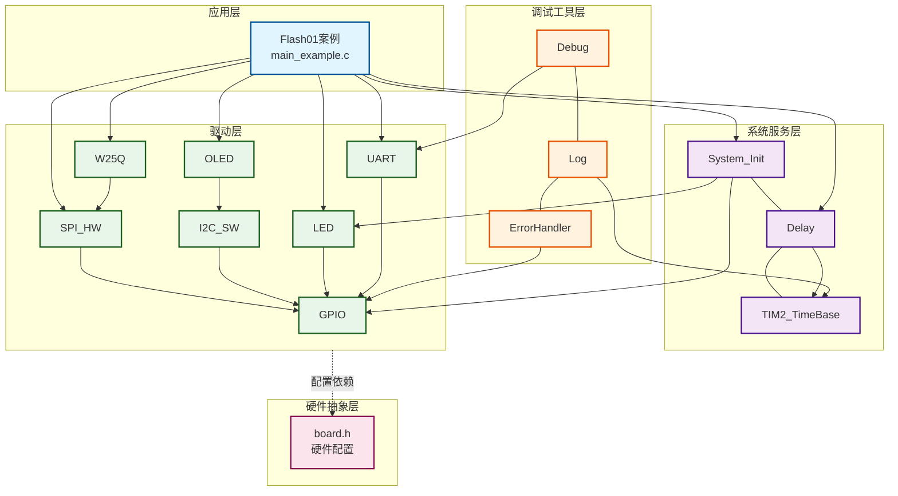
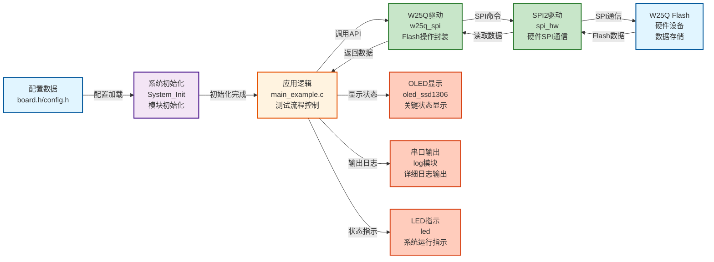
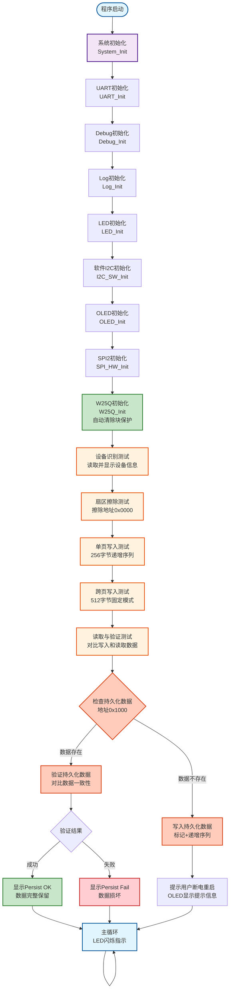

# Flash01 - W25Q SPI Flash模块演示

## 📋 案例目的

- **核心目标**：演示如何使用W25Q SPI Flash驱动模块，展示完整的"擦→写→读→比"生命周期，包括设备识别、扇区擦除、页编程、数据读取和断电重启测试

### 核心功能

1. **设备识别**：读取厂商ID和设备ID，验证SPI通信链路，显示设备容量、地址字节数、4字节模式状态
2. **扇区擦除**：演示4KB扇区擦除操作，体现Flash"先擦后写"特性，显示擦除耗时
3. **页编程**：
   - **单页写入**：256字节页写入测试（递增序列）
   - **跨页写入**：512字节跨页写入测试（自动处理页边界，固定模式）
4. **数据读取与验证**：读取写入的数据，使用`memcmp()`对比数据，显示匹配/不匹配结果和错误字节位置
5. **断电重启测试**：写入持久化数据到固定地址，重启后读取并验证数据是否保留，确保Flash的非易失性特性

### 学习重点

- 理解W25Q Flash的基本特性和操作流程
- 掌握Flash"先擦后写"的特性（必须先擦除才能写入）
- 学习扇区擦除（4KB）和页编程（256字节）的使用方法
- 了解跨页写入的自动处理机制
- 学习数据持久性验证方法（断电重启测试）
- 掌握Flash读写测试的完整流程和错误排查方法

### 应用场景

适用于需要外部Flash存储的应用，如数据日志、配置存储、固件备份、参数保存等场景。

## 🔧 硬件要求

### 必需外设

- **LED1**：连接到 `PA1`（系统状态指示）

### 传感器/模块

#### W25Q SPI Flash模块

| 引脚 | STM32连接 | 说明 |
|------|-----------|------|
| CS | PA11 | 片选信号（软件NSS模式） |
| SCK | PB13 | SPI2时钟信号 |
| MISO | PB14 | SPI2主入从出（数据接收） |
| MOSI | PB15 | SPI2主出从入（数据发送） |
| VCC | 3.3V | **⚠️ 重要：必须使用3.3V，不能使用5V！** |
| GND | GND | 电源地 |

**⚠️ 重要提示**：
- W25Q系列Flash使用3.3V供电，使用5V会损坏芯片
- CS引脚使用软件NSS模式，由软件控制拉低/拉高
- 确保电源稳定，避免写入过程中断电

#### OLED显示屏（软件I2C接口）

| 引脚 | STM32连接 | 说明 |
|------|-----------|------|
| SCL | PB8 | 软件I2C时钟线 |
| SDA | PB9 | 软件I2C数据线 |
| VCC | 3.3V | 电源 |
| GND | GND | 电源地 |

#### UART1（用于详细日志输出）

| 引脚 | STM32连接 | 说明 |
|------|-----------|------|
| TX | PA9 | UART1发送 |
| RX | PA10 | UART1接收 |
| 波特率 | 115200 | 串口通信波特率 |

**连接说明**：将UART1连接到USB转串口模块，用于查看详细日志输出。

## 📦 模块依赖

### 模块依赖关系图

### 模块列表

本案例使用以下模块：

- **`w25q_spi`**：W25Q SPI Flash驱动模块（核心模块）
- **`spi_hw`**：硬件SPI驱动模块（W25Q使用SPI2）
- **`gpio`**：GPIO驱动模块（SPI、I2C、UART、LED依赖）
- **`led`**：LED驱动模块（状态指示）
- **`oled_ssd1306`**：OLED显示模块（关键信息显示）
- **`uart`**：UART驱动模块（详细日志输出）
- **`i2c_sw`**：软件I2C驱动模块（OLED使用）
- **`delay`**：延时模块（非阻塞延时）
- **`error_handler`**：错误处理模块（统一错误处理）
- **`log`**：日志模块（分级日志输出）

## 🔄 实现流程

### 整体逻辑

本案例通过SPI2接口与W25Q Flash通信，演示Flash的完整使用流程。程序执行分为以下几个阶段：

1. **系统初始化阶段**：
   - 调用`System_Init()`初始化系统基础模块（GPIO、LED、delay、TIM2）
   - 初始化UART1用于串口日志输出
   - 初始化Debug和Log模块
   - 初始化软件I2C和OLED用于状态显示
   - 初始化SPI2和W25Q模块

2. **设备识别阶段**：
   - 调用`W25Q_GetInfo()`获取设备信息
   - 在OLED和UART上显示设备ID、容量、地址字节数、4字节模式状态

3. **擦除操作阶段**：
   - 擦除测试扇区（地址0x0000，4KB）
   - 等待擦除完成，显示擦除耗时

4. **写入操作阶段**：
   - **单页写入**：在地址0x0000写入256字节递增序列数据
   - **跨页写入**：在地址0x0100写入512字节固定模式数据（跨页边界）

5. **验证操作阶段**：
   - 读取写入的数据
   - 使用`memcmp()`对比数据
   - 显示验证结果和错误信息

6. **断电重启测试阶段**：
   - 第一次运行：写入持久化数据到地址0x1000，提示用户断电重启
   - 第二次运行：读取并验证数据是否保留

### 数据流向图

### 关键方法

1. **Flash"先擦后写"特性**：
   - Flash必须先擦除才能写入，擦除单位是4KB扇区
   - 写入操作只能将1变为0，不能将0变为1
   - 使用场景：所有写入操作前必须先调用`W25Q_EraseSector()`擦除目标扇区
   - 注意事项：擦除地址必须是4KB对齐（0x0000, 0x1000, 0x2000...）

2. **跨页写入自动处理**：
   - W25Q驱动会自动处理跨页写入，将数据分割为多个页编程操作
   - 使用场景：写入长度超过256字节或起始地址不在页边界时
   - 注意事项：虽然驱动会自动处理，但建议按页对齐写入以提高性能

3. **批量传输性能优化**：
   - 读写操作均使用批量传输（`SPI_MasterTransmit`/`SPI_MasterReceive`），而非单字节传输
   - 性能提升：256字节写入可提升10-20%性能（减少函数调用开销）
   - 读取支持最大65535字节的单次批量传输
   - 使用场景：所有读写操作自动使用批量传输，无需用户干预

4. **数据验证方法**：
   - 使用`memcmp()`对比写入和读取的数据
   - 显示详细的错误信息（错误字节数、首个错误位置、期望值和实际值）
   - 使用场景：所有写入操作后都应进行数据验证

5. **块保护自动清除**：
   - 驱动在`W25Q_Init()`时自动检测并清除块保护位（BP[3:0]）
   - 使用场景：初始化时自动处理，无需用户干预
   - 注意事项：如果清除失败，会记录错误日志，可能导致后续写入失败

6. **断电重启测试**：
   - 使用固定地址和标记数据验证Flash的非易失性
   - 使用场景：验证数据持久性和Flash可靠性
   - 注意事项：确保写入操作完成后再断电（等待`W25Q_WaitReady()`返回成功）

### 工作流程示意图

## 📚 关键函数说明

### W25Q相关函数

- **`W25Q_Init()`**：初始化W25Q模块
  - 在本案例中用于初始化W25Q，自动识别型号、配置4字节模式（如果需要）、清除块保护位
  - 必须在使用W25Q前调用，初始化失败时模块进入UNINITIALIZED状态
  - 初始化时会自动检测并清除块保护位（BP[3:0]），如果清除失败会记录错误日志

- **`W25Q_GetInfo()`**：获取设备信息（只读指针）
  - 在本案例中用于读取设备ID、容量、地址字节数、4字节模式状态等信息
  - 返回只读指针，包含设备的所有信息，未初始化时返回NULL

- **`W25Q_EraseSector()`**：擦除4KB扇区
  - 在本案例中用于擦除测试扇区，为写入操作做准备
  - 地址必须是4KB对齐（0x0000, 0x1000, 0x2000...），地址越界会返回错误
  - 擦除操作会自动处理写使能和忙等待

- **`W25Q_Write()`**：写入数据
  - 在本案例中用于写入测试数据（单页和跨页）
  - 自动处理跨页边界，将数据分割为多个页编程操作
  - 地址越界会返回错误，写入前必须确保目标扇区已擦除
  - **性能优化**：使用批量传输（`SPI_MasterTransmit`），相比单字节传输可提升10-20%性能

- **`W25Q_Read()`**：读取数据
  - 在本案例中用于读取写入的数据，进行验证
  - 支持任意地址和长度的读取，自动处理跨页读取
  - 地址越界会返回错误
  - **性能优化**：使用批量传输（`SPI_MasterReceive`），支持最大65535字节的单次传输

- **`W25Q_WaitReady()`**：等待Flash就绪
  - 在本案例中用于等待擦除/写入操作完成
  - 动态超时补偿，Gb级芯片使用更长超时时间
  - 超时时间参数为0时使用默认超时时间

### OLED相关函数

- **`OLED_Init()`**：初始化OLED显示屏
  - 在本案例中用于初始化OLED，显示关键状态信息
  - 使用软件I2C接口（PB8/9）

- **`OLED_ShowString()`**：显示字符串
  - 在本案例中用于显示设备信息、操作状态、验证结果等
  - 输出内容为全英文ASCII字符，符合项目规范

- **`OLED_Clear()`**：清屏
  - 在本案例中用于清除屏幕内容，准备显示新信息

### UART相关函数

- **`LOG_INFO()`**：Log模块的信息级别输出
  - 在本案例中用于输出详细日志、设备信息、操作进度等
  - 遵循项目规范的串口输出规范（使用Log模块，支持中文GB2312编码）

- **`LOG_ERROR()`**：Log模块的错误级别输出
  - 在本案例中用于输出错误信息、验证失败信息等
  - 支持中文描述，便于开发调试

**详细函数实现和调用示例请参考**：`main_example.c` 中的代码

## ⚠️ 注意事项与重点

### ⚠️ 重要提示

1. **Flash"先擦后写"特性**：
   - Flash必须先擦除才能写入，擦除单位是4KB扇区
   - 写入操作只能将1变为0，不能将0变为1，必须先擦除
   - 如果写入前未擦除，数据可能不正确或写入失败

2. **地址对齐要求**：
   - 扇区擦除地址必须是4KB对齐（0x0000, 0x1000, 0x2000...）
   - 建议写入地址按页对齐（256字节）以提高性能
   - 地址未对齐可能导致操作失败或性能下降

3. **电源要求**：
   - W25Q系列Flash使用3.3V供电，**不能使用5V**（会损坏芯片）
   - 确保电源稳定，避免写入过程中断电
   - 写入过程中断电可能导致数据损坏

4. **SPI配置**：
   - 本案例使用SPI2，引脚：PB13(SCK), PB14(MISO), PB15(MOSI), PA11(CS)
   - 使用软件NSS模式，CS引脚由软件控制（`SPI_NSS_Low()`/`SPI_NSS_High()`）
   - SPI模式：CPOL=Low, CPHA=1Edge（模式0）
   - 时钟频率：建议≤50MHz（本案例使用Prescaler_128，约0.56MHz）

5. **⚠️ 块保护（Block Protection）问题**（最容易浪费时间的坑点）：
   - **问题描述**：W25Q Flash的状态寄存器中有块保护位（BP[3:0]），如果这些位被设置，会阻止写入和擦除操作
   - **常见症状**：
     - 写入操作返回成功，但读取的数据仍然是0xFF（未写入）
     - 擦除操作返回成功，但扇区未被擦除
     - 所有写入/擦除操作都失败，但SPI通信正常
   - **原因**：Flash可能在上次使用中被设置了块保护，或者出厂时块保护被启用
   - **自动处理**：本驱动在`W25Q_Init()`时会自动检测并清除块保护位（BP[3:0]）
   - **处理时机**：仅在初始化时清除，不在每次操作时检查（块保护是持久性的，不会自动恢复）
   - **不会恢复保护**：`W25Q_Deinit()`不会恢复块保护，块保护清除后保持清除状态
   - **如何检测**：如果初始化后仍然无法写入，检查串口日志是否有"Block Protection clear failed"错误
   - **手动清除**：如果自动清除失败，可以使用Flash编程器手动清除块保护，或检查硬件连接
   - **⚠️ 重要**：如果不了解块保护，很容易调试几个小时都找不到问题原因！

6. **断电重启测试**：
   - 第一次运行会写入持久化数据，提示用户断电重启
   - 第二次运行会读取并验证数据，确认Flash的非易失性
   - 如果验证失败，可能是Flash损坏、电源不稳定或写入操作未完成

### 🔑 关键点

1. **"先擦后写"特性**：
   - Flash必须先擦除才能写入
   - 擦除操作会擦除整个扇区（4KB），不能单独擦除某个字节
   - 写入操作只能将1变为0，不能将0变为1

2. **跨页写入处理**：
   - W25Q驱动会自动处理跨页写入，将数据分割为多个页编程操作
   - 但建议按页对齐写入以提高性能和可靠性
   - 跨页写入会增加操作时间

3. **数据验证方法**：
   - 写入后必须读取验证
   - 使用`memcmp()`对比数据，显示详细的错误信息（错误字节数、首个错误位置、期望值和实际值）
   - 验证失败时应检查擦除操作、地址对齐、块保护状态等

4. **持久性测试**：
   - 使用固定地址（0x1000）和标记数据（0xDEADBEEF）验证Flash的非易失性
   - 重启后检查标记，确认数据是否保留
   - 确保写入操作完成后再断电（等待`W25Q_WaitReady()`返回成功）

5. **块保护处理机制**：
   - 块保护在`W25Q_Init()`时自动清除，不在每次操作时检查
   - 清除失败会记录错误日志，但不会阻止初始化继续（可能导致后续操作失败）
   - 块保护清除后不会自动恢复，`W25Q_Deinit()`不会恢复块保护

## 🔍 常见问题排查

#### 问题1：写入操作返回成功，但读取的数据是0xFF（未写入）

**可能原因**：
- **块保护已启用**（最常见！）：状态寄存器的BP[3:0]位被设置，阻止写入操作
- 写入前未擦除扇区（Flash必须先擦除才能写入）
- SPI通信问题（MISO引脚未正确连接或配置错误）

**解决方法**：
1. **首先检查块保护**：
   - 查看串口日志，检查是否有"Block Protection clear failed"错误
   - 如果驱动自动清除失败，尝试使用Flash编程器手动清除块保护
   - 检查`W25Q_Init()`是否成功返回`W25Q_OK`
2. **检查擦除操作**：
   - 确保写入前已调用`W25Q_EraseSector()`擦除目标扇区
   - 等待`W25Q_WaitReady()`返回成功后再写入
3. **检查SPI通信**：
   - 检查MISO引脚（PB14）连接是否正确
   - 检查SPI配置是否正确（模式0，CPOL=Low, CPHA=1Edge）
   - 使用示波器检查SPI信号

#### 问题2：擦除操作返回成功，但扇区未被擦除

**可能原因**：
- **块保护已启用**（最常见！）：BP[3:0]位阻止擦除操作
- 擦除地址未对齐（必须是4KB对齐）
- SPI通信问题

**解决方法**：
1. **检查块保护**：同问题1的检查方法
2. **检查地址对齐**：
   - 确保擦除地址是4KB对齐（0x0000, 0x1000, 0x2000...）
   - 检查`W25Q_EraseSector()`的参数是否正确
3. **检查SPI通信**：同问题1的检查方法

#### 问题3：SPI通信失败（无法读取设备ID）

**可能原因**：
- SPI引脚连接错误
- CS引脚未正确控制（软件NSS模式需要手动控制CS）
- SPI配置错误（模式、时钟频率等）
- Flash电源未连接或电压不正确

**解决方法**：
1. **检查硬件连接**：
   - CS：PA11 → W25Q CS
   - SCK：PB13 → W25Q SCK
   - MISO：PB14 → W25Q MISO
   - MOSI：PB15 → W25Q MOSI
   - VCC：3.3V → W25Q VCC（⚠️ 不能使用5V！）
   - GND：GND → W25Q GND
2. **检查CS引脚控制**：
   - 确保`SPI_NSS_Low()`和`SPI_NSS_High()`正确控制CS引脚
   - 检查`board.h`中SPI配置的CS引脚是否正确（本案例使用PA11）
3. **检查SPI配置**：
   - 模式：CPOL=Low, CPHA=1Edge（模式0）
   - 时钟频率：建议≤50MHz（本案例使用Prescaler_128，约0.56MHz）
4. **检查电源**：
   - 确保Flash使用3.3V供电
   - 检查电源是否稳定

#### 问题4：数据验证失败（写入和读取的数据不一致）

**可能原因**：
- 写入前未擦除扇区
- 地址重叠（如测试地址重叠导致数据冲突）
- Flash损坏

**解决方法**：
1. **检查擦除操作**：
   - 确保写入前已擦除目标扇区
   - 等待擦除完成后再写入
2. **检查地址重叠**：
   - 确保测试地址不重叠（本案例：TEST_PAGE_ADDR=0x0000, TEST_CROSS_PAGE_ADDR=0x0100）
   - 检查测试地址是否在同一个扇区内（可能导致数据冲突）
3. **检查Flash状态**：
   - 尝试重新擦除和写入
   - 如果问题持续，可能是Flash损坏

#### 问题5：断电重启测试失败（数据未保留）

**可能原因**：
- 写入操作未完成（未等待`W25Q_WaitReady()`）
- Flash损坏
- 电源不稳定导致写入失败

**解决方法**：
1. **检查写入完成**：
   - 确保写入后调用`W25Q_WaitReady()`并等待返回成功
   - 检查写入操作的返回值是否为`W25Q_OK`
2. **检查Flash状态**：
   - 尝试重新写入持久化数据
   - 如果问题持续，可能是Flash损坏
3. **检查电源**：
   - 确保写入过程中电源稳定
   - 避免写入过程中断电

## 💡 扩展练习

### 循序渐进理解本案例

1. **修改测试数据模式**：尝试不同的数据模式（随机数据、固定模式、递增序列等），理解Flash的数据存储特性
2. **测试不同地址范围**：尝试在不同地址写入和读取数据，理解Flash的地址映射和扇区分布
3. **测试大容量写入**：尝试写入更大的数据块（如1KB、2KB、4KB），理解跨页和跨扇区处理机制

### 实际场景中的常见坑点

4. **块保护问题**（⚠️ 最容易浪费时间的坑点）：
   - 如果Flash的块保护位（BP[3:0]）被设置，所有写入和擦除操作都会失败，但不会报错
   - 症状：写入返回成功，但读取的数据是0xFF；擦除返回成功，但扇区未被擦除
   - 如何检测：查看状态寄存器1的BP[3:0]位，如果非0则块保护已启用
   - 如何处理：驱动会自动清除，但如果自动清除失败，需要使用Flash编程器手动清除
   - **教训**：如果不了解块保护，很容易调试几个小时都找不到问题原因！

5. **写入前未擦除**：如果写入前未擦除，数据可能不正确。如何检测和处理这种情况？如何实现自动擦除机制？

6. **扇区对齐问题**：如果扇区擦除地址未对齐，会发生什么？如何检测和处理？如何实现地址自动对齐？

7. **断电保护机制**：在实际应用中，如何确保写入操作在断电前完成？如何实现写入保护机制？如何检测写入是否完成？

8. **地址重叠冲突**：如果测试地址重叠，会导致数据冲突。如何检测地址重叠？如何设计测试用例避免冲突？

## 📖 相关文档

- **模块文档**：
  - **W25Q驱动**：`../../Drivers/flash/w25q_spi.c/h`
  - **W25Q模块文档**：`../../Drivers/flash/README.md`
  - **SPI驱动**：`../../Drivers/spi/spi_hw.c/h`
  - **OLED驱动**：`../../Drivers/display/oled_ssd1306.c/h`
  - **UART驱动**：`../../Drivers/uart/uart.c/h`
  - **软件I2C驱动**：`../../Drivers/i2c/i2c_sw.c/h`

- **业务文档**：
  - **主程序代码**：`main_example.c`
  - **硬件配置**：`board.h`
  - **模块配置**：`config.h`
  - **项目规范文档**：`../../../.cursor/rules/README.md`（AI规则体系）
  - **案例参考**：`../../Examples/README.md`

- **其他模块**：
  - **LED驱动**：`../../Drivers/basic/led.c/h`
  - **GPIO驱动**：`../../Drivers/basic/gpio.c/h`
  - **延时功能**：`../../System/delay.c/h`
  - **系统初始化**：`../../System/system_init.c/h`
  - **错误处理**：`../../Common/error_handler.c/h`
  - **日志模块**：`../../Debug/log.c/h`
