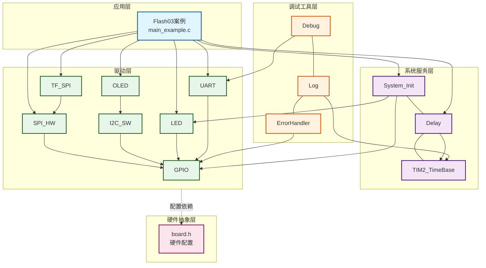
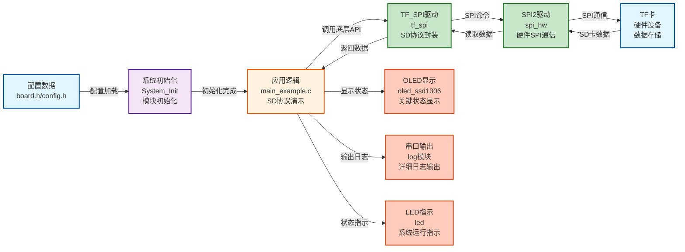
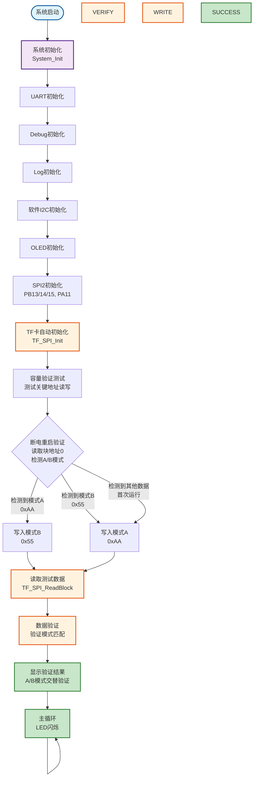

# Flash03 - TF卡（MicroSD卡）SPI自动初始化读写示例

## 📌 案例目的

- **核心目标**：演示TF卡自动初始化（使用`TF_SPI_Init()`）和基本的读写操作，以及断电重启后验证写入数据是否生效

### 核心功能

1. **自动初始化**：使用`TF_SPI_Init()`自动完成SD卡的初始化流程（上电复位、版本识别、初始化、设备识别）
2. **容量验证**：检测SD卡是否虚标容量，测试关键地址（块1、50%、75%、90%、100%）的读写功能
3. **单块写入**：写入固定测试数据到指定块地址（块地址0，用于A/B模式验证）
4. **单块读取**：读取写入的数据进行验证
5. **数据验证**：写入后立即验证数据一致性
6. **断电重启验证**：断电重启后自动验证之前写入的数据是否持久化保存，支持A/B模式交替写入验证

### 学习重点

- 理解TF_SPI模块的高级API使用方法（`TF_SPI_Init()`、`TF_SPI_ReadBlock()`、`TF_SPI_WriteBlock()`）
- 掌握SD卡的基本读写操作流程
- 学习数据持久化验证方法（断电重启后验证，A/B模式交替写入）
- 了解SD卡容量验证方法（检测虚标容量）
- 了解SD卡数据存储的可靠性

### 应用场景

适用于需要SD卡存储的应用，如数据日志、配置存储、固件备份、参数保存等场景。特别适合需要验证数据持久化的应用。

**⚠️ 重要说明**：
- 本示例使用TF_SPI模块的高级API（`TF_SPI_Init()`、`TF_SPI_ReadBlock()`、`TF_SPI_WriteBlock()`）
- 自动初始化简化了SD卡的使用流程，适合实际应用开发
- 断电重启验证功能可以验证数据是否成功写入并持久化保存

## 🔧 硬件要求

### 必需外设

- **LED1**：连接到 `PA1`（系统状态指示）

### 传感器/模块

#### TF卡（MicroSD卡）模块

| 引脚 | STM32连接 | 说明 |
|------|-----------|------|
| CS | PA11 | 片选信号（软件NSS模式） |
| SCK | PB13 | SPI2时钟信号 |
| MISO | PB14 | SPI2主入从出（数据接收） |
| MOSI | PB15 | SPI2主出从入（数据发送） |
| VCC | 3.3V | **⚠️ 重要：必须使用3.3V，不能使用5V！** |
| GND | GND | 电源地 |

**⚠️ 重要提示**：
- TF卡使用3.3V供电，使用5V会损坏卡
- CS引脚使用软件NSS模式，由软件控制拉低/拉高
- 确保电源稳定，避免写入过程中断电
- 初始化时使用低速（≤400kHz），初始化完成后可以切换到高速

**⚠️ 读卡器选择（单设备SPI连接方式）**：
- **方法1**：选择有电阻的简单读卡器，不要用带芯片的复杂读卡器
- **方法2**：DO（MISO）电压低于2.8V的一律不用
- 简单读卡器通常只有必要的电阻和电容，适合SPI模式直接连接
- 复杂读卡器可能包含SDIO控制器芯片，不适合SPI模式使用
- DO电压过低可能导致通信不稳定或失败

#### OLED显示屏（软件I2C接口）

| 引脚 | STM32连接 | 说明 |
|------|-----------|------|
| SCL | PB8 | 软件I2C时钟线 |
| SDA | PB9 | 软件I2C数据线 |
| VCC | 3.3V | 电源 |
| GND | GND | 电源地 |

#### UART1（用于详细日志输出）

| 引脚 | STM32连接 | 说明 |
|------|-----------|------|
| TX | PA9 | UART1发送 |
| RX | PA10 | UART1接收 |
| 波特率 | 115200 | 串口通信波特率 |

**连接说明**：将UART1连接到USB转串口模块，用于查看详细日志输出。

## 📦 模块依赖

### 模块依赖关系图

### 模块列表

本案例使用以下模块：

- **`tf_spi`**：TF卡SPI驱动模块（核心模块）
- **`spi_hw`**：硬件SPI驱动模块（TF卡使用SPI2）
- **`gpio`**：GPIO驱动模块（SPI、I2C、UART、LED依赖）
- **`led`**：LED驱动模块（状态指示）
- **`oled_ssd1306`**：OLED显示模块（关键信息显示）
- **`uart`**：UART驱动模块（详细日志输出）
- **`i2c_sw`**：软件I2C驱动模块（OLED使用）
- **`delay`**：延时模块（非阻塞延时）
- **`error_handler`**：错误处理模块（统一错误处理）
- **`log`**：日志模块（分级日志输出）

## 🔄 实现流程

### 整体逻辑

本案例通过SPI2接口与TF卡通信，演示自动初始化和基本的读写操作。程序执行分为以下几个阶段：

1. **系统初始化阶段**：
   - 调用`System_Init()`初始化系统基础模块（GPIO、LED、delay、TIM2）
   - 初始化UART1用于串口日志输出
   - 初始化Debug和Log模块
   - 初始化软件I2C和OLED用于状态显示
   - 初始化SPI2（TF卡使用，PB13/14/15，PA11作为CS）

2. **TF卡自动初始化阶段**：
   - 调用`TF_SPI_Init()`自动完成SD卡的初始化流程
   - `TF_SPI_Init()`内部会执行：上电复位、版本识别、初始化、设备识别等步骤
   - 获取SD卡信息（容量、块大小、卡类型等）

3. **容量验证阶段**：
   - 测试5个关键地址的读写功能（块1、50%、75%、90%、100%）
   - 检测SD卡是否虚标容量（实际可用容量小于声明容量）
   - 每个地址写入测试数据（0x5A），然后读取验证
   - 如果所有地址验证通过，说明容量未虚标

4. **断电重启验证阶段**：
   - 读取块地址0的数据，检测是否为A/B模式（0xAA或0x55）
   - 如果检测到模式A（0xAA），说明上次写入的是A，本次写入模式B（0x55）
   - 如果检测到模式B（0x55），说明上次写入的是B，本次写入模式A（0xAA）
   - 如果检测到其他数据，说明是首次运行或数据被修改，写入模式A（0xAA）
   - 通过A/B模式交替写入，可以验证数据持久化保存

5. **写入和读取操作阶段**（每次启动都执行）：
   - 根据检测到的模式，写入相反的模式（A→B，B→A，其他→A）
   - 写入到块地址0（专门用于A/B模式验证）
   - 读取写入的数据进行验证
   - 使用模式匹配验证512字节数据
   - 显示验证结果

5. **主循环阶段**：
   - LED闪烁指示系统运行
   - 显示运行状态（首次运行或数据已验证）

### 数据流向图

### 关键方法

1. **自动初始化流程**：
   - 使用`TF_SPI_Init()`自动完成SD卡的初始化流程
   - 初始化过程包括：上电复位、版本识别、初始化、设备识别等
   - 初始化成功后可以获取SD卡信息（容量、块大小、卡类型等）

2. **块读写操作**：
   - 使用TF_SPI模块的高级API进行块读写（`TF_SPI_ReadBlock()`、`TF_SPI_WriteBlock()`）
   - 支持单块读写操作
   - 数据验证使用memcmp()对比

3. **容量验证**：
   - 测试5个关键地址的读写功能（块1、50%、75%、90%、100%）
   - 每个地址写入测试数据（0x5A），然后读取验证
   - 如果所有地址验证通过，说明容量未虚标
   - 注意：不使用块地址0，避免覆盖A/B模式验证数据

4. **断电重启验证（A/B模式交替写入）**：
   - 程序启动时自动读取块地址0的数据，检测是否为A/B模式
   - 模式A：0xAA（512字节全部为0xAA）
   - 模式B：0x55（512字节全部为0x55）
   - 如果检测到模式A，写入模式B；如果检测到模式B，写入模式A；如果检测到其他数据，写入模式A
   - 通过A/B模式交替写入，可以验证数据持久化保存
   - 每次断电重启后，都能检测到上次写入的模式，并写入相反的模式

### 工作流程示意图

## 📚 关键函数说明

### TF_SPI模块相关函数

- **`TF_SPI_Init()`**：自动初始化SD卡（高级API）
  - 在本案例中用于自动完成SD卡的初始化流程
  - 内部会执行：上电复位、版本识别、初始化、设备识别等步骤
  - 初始化成功后可以获取SD卡信息（容量、块大小、卡类型等）
  - 返回`TF_SPI_OK`表示初始化成功

- **`TF_SPI_GetInfo()`**：获取SD卡信息（高级API）
  - 在本案例中用于获取SD卡的容量、块大小、卡类型等信息
  - 返回`tf_spi_dev_t`结构体指针，包含卡的所有信息

- **`TF_SPI_ReadBlock()`**：读取单个块（高级API）
  - 在本案例中用于读取写入的数据，进行验证
  - 支持任意块地址的读取
  - 断电重启验证时使用此函数读取之前写入的数据

- **`TF_SPI_WriteBlock()`**：写入单个块（高级API）
  - 在本案例中用于写入测试数据
  - 支持任意块地址的写入
  - 首次运行时使用此函数写入固定测试数据

### OLED相关函数

- **`OLED_Init()`**：初始化OLED显示屏
  - 在本案例中用于初始化OLED，显示关键状态信息
  - 使用软件I2C接口（PB8/9）

- **`OLED_ShowString()`**：显示字符串
  - 在本案例中用于显示设备信息、操作状态、验证结果等
  - 输出内容为全英文ASCII字符，符合项目规范

- **`OLED_Clear()`**：清屏
  - 在本案例中用于清除屏幕内容，准备显示新信息

### UART相关函数

- **`LOG_INFO()`**：Log模块的信息级别输出
  - 在本案例中用于输出详细日志、设备信息、操作进度等
  - 遵循项目规范的串口输出规范（使用Log模块，支持中文GB2312编码）

- **`LOG_ERROR()`**：Log模块的错误级别输出
  - 在本案例中用于输出错误信息、验证失败信息等
  - 支持中文描述，便于开发调试

**详细函数实现和调用示例请参考**：`main_example.c` 中的代码

## ⚠️ 注意事项与重点

### ⚠️ 重要提示

1. **自动初始化**：
   - 使用`TF_SPI_Init()`自动完成SD卡的初始化流程
   - 初始化过程包括：上电复位、版本识别、初始化、设备识别等
   - 初始化成功后可以获取SD卡信息（容量、块大小、卡类型等）

2. **SPI配置**：
   - 使用SPI2：PB13(SCK), PB14(MISO), PB15(MOSI), PA11(CS)
   - 初始化时使用低速（≤400kHz，建议Prescaler_128或256）
   - 初始化完成后可以切换到高速
   - SPI模式：CPOL=0, CPHA=0（模式0）
   - 使用软件NSS模式，PA11作为CS引脚需要手动配置为GPIO输出

3. **CS控制**：
   - PA11引脚需要手动配置为GPIO输出（推挽输出，50MHz）
   - 使用软件NSS模式，由TF_SPI模块自动控制CS
   - CS控制错误会导致SD卡无法响应

4. **电源要求**：
   - TF卡使用3.3V供电，**不能使用5V**（会损坏卡）
   - 确保电源稳定，避免写入过程中断电
   - 写入过程中断电可能导致数据损坏

5. **地址模式**：
   - SDSC卡使用字节地址（块地址 × 512）
   - SDHC/SDXC卡使用块地址（直接使用块地址）
   - TF_SPI模块会自动处理地址转换

6. **块地址分配**：
   - **块地址0**：专门用于A/B模式断电重启验证（模式A：0xAA，模式B：0x55）
   - **块地址1、50%、75%、90%、100%**：用于容量验证测试（测试数据：0x5A）
   - 容量验证测试不使用块地址0，避免覆盖A/B模式验证数据

7. **断电重启验证（A/B模式交替写入）**：
   - 程序启动时会自动读取块地址0的数据，检测是否为A/B模式
   - 如果检测到模式A（0xAA），说明上次写入的是A，本次写入模式B（0x55）
   - 如果检测到模式B（0x55），说明上次写入的是B，本次写入模式A（0xAA）
   - 如果检测到其他数据，说明是首次运行或数据被修改，写入模式A（0xAA）
   - 通过A/B模式交替写入，可以验证数据持久化保存，即使多次断电重启也能验证

### 🔑 关键点

1. **SD协议命令格式**：
   - 命令格式：6字节（命令+地址+CRC）
   - 响应格式：R1（1字节）、R2（2字节）、R3/R7（5字节）
   - 数据令牌：0xFE（单块）、0xFC（多块写入开始）、0xFD（多块写入停止）
   - 数据响应：0x05（接受）、0x0B（CRC错误）、0x0D（写入错误）

2. **CSD寄存器解析**：
   - CSD版本1.0（SDSC）：容量计算公式 `(C_SIZE + 1) * 512 * 2^(C_SIZE_MULT + 2)`
   - CSD版本2.0（SDHC/SDXC）：容量计算公式 `(C_SIZE + 1) * 512KB`
   - 速度等级：从CSD寄存器解析

3. **CID寄存器解析**：
   - 厂商ID：CID[0]
   - OEM：CID[1-2]
   - 产品名：CID[3-8]
   - 序列号：CID[9-12]
   - 制造日期：CID[13-14]

4. **状态查询（CMD13）**：
   - R1响应：1字节状态
   - R2响应：2字节状态（包含更多错误信息）
   - 状态位解析：写保护、锁定、错误标志等

5. **数据验证方法**：
   - 写入后必须回读验证
   - 使用memcmp()对比数据，显示详细的错误信息
   - 验证失败时应检查初始化状态、地址模式、CS控制等

## 🔍 常见问题排查

#### 问题1：TF_SPI_Init()初始化失败

**可能原因**：
- CS控制错误（未正确拉低/拉高）
- SPI通信问题（MISO引脚未正确连接或配置错误）
- 电源问题（未使用3.3V或电源不稳定）
- 卡未插入或损坏

**解决方法**：
1. 检查CS引脚（PA11）是否正确配置为GPIO输出
2. 检查SPI引脚连接（PB13/14/15）
3. 检查电源电压（必须使用3.3V）
4. 检查SPI初始化是否成功
5. 检查SD卡是否插入且未损坏

#### 问题2：写入操作失败

**可能原因**：
- 卡写保护
- 地址越界
- 卡未初始化

**解决方法**：
1. 检查卡是否写保护（物理写保护开关）
2. 检查块地址是否在有效范围内
3. 确保`TF_SPI_Init()`初始化成功

#### 问题3：数据验证失败

**可能原因**：
- 写入操作未完成
- 地址模式错误（SDSC使用字节地址，SDHC/SDXC使用块地址）
- 卡损坏

**解决方法**：
1. 确保写入操作完成（等待卡忙结束）
2. 检查地址模式是否正确（TF_SPI模块会自动处理）
3. 尝试其他块地址
4. 检查卡是否损坏

#### 问题4：断电重启验证失败

**可能原因**：
- 首次运行（数据未写入）
- 写入的数据被覆盖（容量验证测试可能覆盖了块地址0）
- 卡损坏或数据丢失

**解决方法**：
1. 首次运行是正常的，会执行写入操作
2. 确保写入操作成功完成
3. 检查容量验证测试是否使用了块地址0（应该使用块地址1）
4. 检查卡是否损坏
5. 尝试重新写入数据并验证

#### 问题5：容量验证失败

**可能原因**：
- SD卡虚标容量（实际可用容量小于声明容量）
- 测试地址越界
- 卡损坏

**解决方法**：
1. 如果某个测试地址验证失败，说明该地址不可用，容量可能虚标
2. 检查测试地址是否在有效范围内
3. 检查卡是否损坏
4. 尝试使用其他SD卡进行对比测试

## 🎯 扩展练习

### 循序渐进部分

1. **修改测试数据**：
   - 修改A/B模式的数据模式（当前使用0xAA和0x55）
   - 使用不同的数据模式验证断电重启功能

2. **修改测试块地址**：
   - 修改A/B模式验证的块地址（当前使用块地址0）
   - 测试多个块地址的断电重启验证
   - 注意：确保容量验证测试不使用A/B模式验证的块地址

3. **添加基础功能**：
   - 添加SD卡信息显示（容量、块大小、卡类型等）
   - 添加写入和读取的时间统计

### 实际场景坑点部分

4. **边界条件处理**：
   - 测试块地址0和最大块地址的读写
   - 处理地址越界错误
   - 测试不同容量的SD卡

5. **异常情况处理**：
   - 处理卡未插入的情况（`TF_SPI_Init()`返回错误）
   - 处理卡写保护的情况
   - 处理初始化超时的情况

6. **断电重启验证增强**：
   - 实现多个块地址的断电重启验证
   - 添加数据校验和（CRC）验证
   - 实现数据版本管理（写入版本号，验证时检查版本）
   - 实现更多模式的交替写入（A/B/C/D模式）

7. **容量验证增强**：
   - 增加更多测试地址（如25%、10%、95%等）
   - 实现连续地址测试（检测是否有坏块）
   - 添加测试时间统计
   - 实现测试结果报告（生成测试报告）

## 📖 相关文档

### 模块文档

- **TF_SPI模块**：`Drivers/flash/tf_spi.c/h` - TF卡SPI驱动模块
- **SPI驱动模块**：`Drivers/spi/spi_hw.c/h` - 硬件SPI驱动
- **OLED显示模块**：`Drivers/display/oled_ssd1306.c/h` - OLED显示驱动
- **UART驱动模块**：`Drivers/uart/uart.c/h` - UART驱动

### 业务文档

- **主程序代码**：`Examples/Flash/Flash03_TF_SPI_AutoInitReadWrite/main_example.c`
- **硬件配置**：`BSP/board.h`
- **模块配置**：`System/config.h`
- **项目规范**：`PROJECT_KEYWORDS.md`
- **参考案例**：
  - `Examples/Flash/Flash04_TF_SPI_ManualInitReadWrite/` - TF卡手动初始化示例
  - `Examples/Flash/Flash01_W25Q_ReadWrite/` - W25Q Flash示例

### SD协议规范

- **SD卡物理层规范**：SD Physical Layer Specification
- **SD卡SPI模式规范**：SD Card SPI Mode Specification
