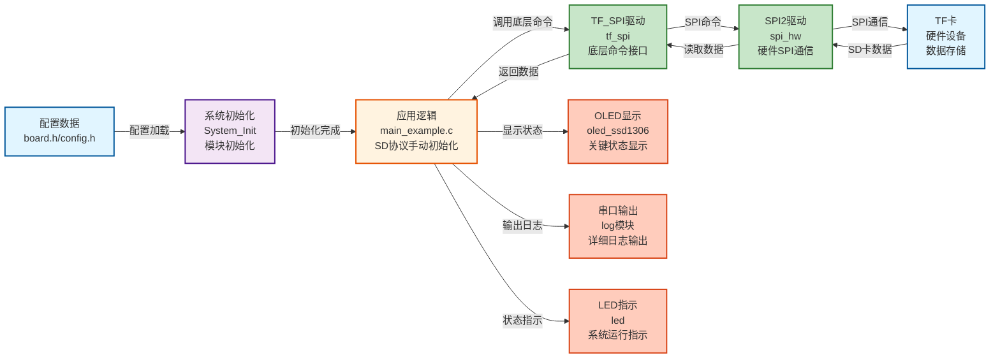

# Flash04 - TF卡（MicroSD卡）SPI手动初始化读写示例

## 📌 案例目的

- **核心目标**：演示TF卡手动初始化流程（不使用`TF_SPI_Init()`）和完整的SD协议底层操作，包括上电复位、版本识别、手动初始化、设备识别、状态查询、块读写和验证

### 核心功能

1. **手动初始化**：不使用`TF_SPI_Init()`，手动执行完整的SD卡初始化流程（上电复位、CMD0、CMD8、ACMD41循环、读取OCR、读取CSD）
2. **上电复位测试**：发送74+个时钟脉冲（10个0xFF），发送CMD0进入SPI模式
3. **版本识别测试**：发送CMD8检测SD卡版本（v1.0或v2.0+），读取OCR寄存器确认卡类型
4. **手动初始化测试**：手动执行ACMD41循环初始化，等待卡就绪，使用`TF_SPI_SetDeviceInfoFromCSD()`设置设备信息
5. **设备识别测试**：读取CSD和CID寄存器，解析容量、块大小、厂商信息等
6. **状态查询测试**：发送CMD13查询卡状态，解析状态位
7. **单块读写测试**：使用CMD24写入单个块，使用CMD17读取单个块
8. **多块读写测试**：使用CMD25写入多个块，使用CMD18读取多个块
9. **数据验证测试**：写入后回读验证数据一致性（单块和多块）
10. **边界测试**：测试最后一个块的读写功能

### 学习重点

- 理解SD协议底层命令和响应格式（CMD0、CMD8、CMD55、ACMD41、CMD9、CMD10、CMD13、CMD17、CMD24、CMD25、CMD58等）
- 掌握SD卡手动初始化流程（上电复位、版本识别、ACMD41循环、设备识别）
- 学习CSD和CID寄存器的解析方法
- 了解SD卡状态查询和错误处理
- 学习SD卡块读写操作的底层实现
- 理解ACMD命令的正确发送方式（CMD55和ACMD必须在同一个CS低周期内发送）

### 应用场景

适用于需要深入理解SD协议底层细节的应用，如SD卡驱动开发、协议调试、故障排查等场景。特别适合需要自定义初始化流程或调试SD卡通信问题的应用。

**⚠️ 重要说明**：
- 本示例使用纯手动初始化，不使用`TF_SPI_Init()`自动初始化
- 手动初始化展示了SD协议的完整流程，适合学习和调试
- 实际应用应优先使用TF_SPI模块的高级API（如`TF_SPI_Init()`、`TF_SPI_ReadBlock()`等）
- 与Flash03的区别：Flash03使用`TF_SPI_Init()`自动初始化，Flash04使用纯手动初始化

## 🔧 硬件要求

### 必需外设

- **LED1**：连接到 `PA1`（系统状态指示）

### 传感器/模块

#### TF卡（MicroSD卡）模块

| 引脚 | STM32连接 | 说明 |
|------|-----------|------|
| CS | PA11 | 片选信号（软件NSS模式） |
| SCK | PB13 | SPI2时钟信号 |
| MISO | PB14 | SPI2主入从出（数据接收） |
| MOSI | PB15 | SPI2主出从入（数据发送） |
| VCC | 3.3V | **⚠️ 重要：必须使用3.3V，不能使用5V！** |
| GND | GND | 电源地 |

**⚠️ 重要提示**：
- TF卡使用3.3V供电，使用5V会损坏卡
- CS引脚使用软件NSS模式，由软件控制拉低/拉高
- 确保电源稳定，避免写入过程中断电
- 初始化时使用低速（≤400kHz），初始化完成后可以切换到高速

**⚠️ 读卡器选择（SPI连接方式）**：
- **方法1**：选择有电阻的简单读卡器，不要用带芯片的复杂读卡器
- **方法2**：DO（MISO）电压低于2.8V的一律不用
- 简单读卡器通常只有必要的电阻和电容，适合SPI模式直接连接
- 复杂读卡器可能包含SDIO控制器芯片，不适合SPI模式使用
- DO电压过低可能导致通信不稳定或失败

#### OLED显示屏（软件I2C接口）

| 引脚 | STM32连接 | 说明 |
|------|-----------|------|
| SCL | PB8 | 软件I2C时钟线 |
| SDA | PB9 | 软件I2C数据线 |
| VCC | 3.3V | 电源 |
| GND | GND | 电源地 |

#### UART1（用于详细日志输出）

| 引脚 | STM32连接 | 说明 |
|------|-----------|------|
| TX | PA9 | UART1发送 |
| RX | PA10 | UART1接收 |
| 波特率 | 115200 | 串口通信波特率 |

**连接说明**：将UART1连接到USB转串口模块，用于查看详细日志输出。

## 📦 模块依赖

### 模块依赖关系图

### 模块列表

本案例使用以下模块：

- **`tf_spi`**：TF卡SPI驱动模块（核心模块，使用底层命令接口）
- **`spi_hw`**：硬件SPI驱动模块（TF卡使用SPI2）
- **`gpio`**：GPIO驱动模块（SPI、I2C、UART、LED依赖）
- **`led`**：LED驱动模块（状态指示）
- **`oled_ssd1306`**：OLED显示模块（关键信息显示）
- **`uart`**：UART驱动模块（详细日志输出）
- **`i2c_sw`**：软件I2C驱动模块（OLED使用）
- **`delay`**：延时模块（非阻塞延时）
- **`error_handler`**：错误处理模块（统一错误处理）
- **`log`**：日志模块（分级日志输出）

## 🔄 实现流程

### 整体逻辑

本案例通过SPI2接口与TF卡通信，演示手动初始化和完整的SD协议底层操作。程序执行分为以下几个阶段：

1. **系统初始化阶段**：
   - 调用`System_Init()`初始化系统基础模块（GPIO、LED、delay、TIM2）
   - 初始化UART1用于串口日志输出
   - 初始化Debug和Log模块
   - 初始化软件I2C和OLED用于状态显示
   - 初始化SPI2（TF卡使用，PB13/14/15，PA11作为CS）

2. **上电复位测试阶段**：
   - 拉高CS（PA11）
   - 发送10个0xFF作为上电复位时钟脉冲（74+个时钟脉冲）
   - 等待10ms让卡稳定
   - 发送CMD0进入SPI模式，检查R1响应（应为0x01，IDLE_STATE）

3. **版本识别测试阶段**：
   - 手动发送CMD8命令（检查电压兼容性，SD卡v2.0+）
   - 等待R1响应，读取R7响应（5字节：R1+保留+电压+检查模式）
   - 解析R7响应，判断SD卡版本（v1.0或v2.0+）
   - 发送CMD58读取OCR寄存器，解析电压范围和卡类型（CCS位）

4. **手动初始化测试阶段**：
   - 再次发送CMD8确认SD卡版本
   - 手动执行ACMD41循环初始化：
     - 先尝试使用HCS位（bit 30）初始化（支持SDHC/SDXC）
     - 如果失败，尝试不使用HCS位初始化（兼容SDSC v2.0）
     - CMD55和ACMD41必须在同一个CS低周期内发送
     - 循环发送ACMD41，直到响应为0x00（卡就绪）或超时（200次，30秒）
   - 读取OCR确认初始化完成（bit 31应为1，表示卡就绪）
   - 读取CSD获取设备信息
   - 调用`TF_SPI_SetDeviceInfoFromCSD()`设置设备信息和状态

5. **设备识别测试阶段**：
   - 读取CSD寄存器（CMD9），解析容量、块大小、块数量
   - 读取CID寄存器（CMD10），解析厂商ID、OEM、产品名、序列号

6. **状态查询测试阶段**：
   - 发送CMD13查询卡状态
   - 解析状态位（IDLE_STATE、ERASE_RESET、ILLEGAL_CMD等）

7. **块读写测试阶段**：
   - 单块写入测试（CMD24）：写入递增序列数据（0x00-0xFF）
   - 单块读取测试（CMD17）：读取数据并显示前16字节
   - 多块写入测试（CMD25）：写入4个块（2KB），测量写入速度
   - 多块读取测试（CMD18）：读取4个块，测量读取速度

8. **数据验证测试阶段**：
   - 单块数据验证：写入后回读，对比数据一致性
   - 多块数据验证：写入后回读，对比数据一致性，计算校验和

9. **边界测试阶段**：
   - 测试最后一个块的读写功能
   - 验证边界地址的正确性

10. **主循环阶段**：
    - LED闪烁指示系统运行

### 数据流向图

### 关键方法

1. **手动初始化流程**：
   - **上电复位**：拉高CS，发送10个0xFF（74+个时钟脉冲），等待10ms
   - **CMD0**：发送CMD0进入SPI模式，检查R1响应（0x01，IDLE_STATE）
   - **CMD8**：发送CMD8检测SD卡版本，读取R7响应（5字节）
   - **ACMD41循环**：
     - 拉低CS
     - 发送CMD55（应用命令前缀）
     - 立即发送ACMD41（不拉高CS）
     - 等待R1响应，如果为0x00则初始化成功
     - 如果为0x01，继续循环（最多200次，30秒超时）
     - 拉高CS
     - 如果使用HCS位失败，尝试不使用HCS位
   - **读取OCR**：发送CMD58读取OCR，确认bit 31=1（卡就绪）
   - **读取CSD**：发送CMD9读取CSD，解析容量信息
   - **设置设备信息**：调用`TF_SPI_SetDeviceInfoFromCSD()`设置设备信息和状态

2. **ACMD命令发送**：
   - **关键点**：CMD55和ACMD必须在同一个CS低周期内发送
   - 实现方式：`tf_example_send_acmd_in_cs()`函数确保CMD55和ACMD在同一个CS低周期内发送
   - 调用者负责CS控制：拉低CS → 调用函数 → 拉高CS

3. **CSD寄存器解析**：
   - **CSD版本1.0（SDSC）**：容量计算公式 `(C_SIZE + 1) * 512 * 2^(C_SIZE_MULT + 2)`
   - **CSD版本2.0（SDHC/SDXC）**：容量计算公式 `(C_SIZE + 1) * 512KB`
   - 解析函数：`tf_example_parse_csd_v1()`和`tf_example_parse_csd_v2()`

4. **CID寄存器解析**：
   - 厂商ID：CID[0]
   - OEM：CID[1-2]
   - 产品名：CID[3-8]
   - 序列号：CID[9-12]
   - 解析函数：`tf_example_parse_cid()`

5. **块读写操作**：
   - 使用TF_SPI模块的高级API（`TF_SPI_ReadBlock()`、`TF_SPI_WriteBlock()`等）
   - 虽然演示了手动初始化，但读写操作使用高级API以简化代码

### 工作流程示意图

```mermaid
flowchart TD
    START([系统启动]) --> INIT[系统初始化<br/>System_Init]
    INIT --> UART[UART初始化]
    UART --> DEBUG[Debug初始化]
    DEBUG --> LOG[Log初始化]
    LOG --> I2C[软件I2C初始化]
    I2C --> OLED[OLED初始化]
    OLED --> SPI[SPI2初始化<br/>PB13/14/15, PA11]
    
    SPI --> POWER_ON[上电复位测试<br/>发送10个0xFF<br/>CMD0进入SPI模式]
    
    POWER_ON --> VERSION[版本识别测试<br/>CMD8检测版本<br/>CMD58读取OCR]
    
    VERSION --> MANUAL_INIT[手动初始化测试<br/>ACMD41循环初始化<br/>等待卡就绪]
    
    MANUAL_INIT --> SET_INFO[设置设备信息<br/>TF_SPI_SetDeviceInfoFromCSD<br/>读取CSD]
    
    SET_INFO --> DEVICE_ID[设备识别测试<br/>CMD9读取CSD<br/>CMD10读取CID]
    
    DEVICE_ID --> STATUS[状态查询测试<br/>CMD13查询状态]
    
    STATUS --> WRITE[单块写入测试<br/>CMD24]
    WRITE --> READ[单块读取测试<br/>CMD17]
    READ --> MULTI_WRITE[多块写入测试<br/>CMD25]
    MULTI_WRITE --> MULTI_READ[多块读取测试<br/>CMD18]
    MULTI_READ --> VERIFY[数据验证测试<br/>写入后回读对比]
    VERIFY --> BOUNDARY[边界测试<br/>最后一个块]
    BOUNDARY --> DONE[所有测试完成]
    
    DONE --> LOOP[主循环<br/>LED闪烁]
    LOOP --> LOOP
    
    %% 样式
    style START fill:#e1f5ff,stroke:#01579b,stroke-width:2px
    style INIT fill:#f3e5f5,stroke:#4a148c,stroke-width:2px
    style POWER_ON fill:#fff3e0,stroke:#e65100,stroke-width:2px
    style VERSION fill:#fff3e0,stroke:#e65100,stroke-width:2px
    style MANUAL_INIT fill:#fff3e0,stroke:#e65100,stroke-width:2px
    style SET_INFO fill:#fff3e0,stroke:#e65100,stroke-width:2px
    style DEVICE_ID fill:#fff3e0,stroke:#e65100,stroke-width:2px
    style STATUS fill:#fff3e0,stroke:#e65100,stroke-width:2px
    style WRITE fill:#fff3e0,stroke:#e65100,stroke-width:2px
    style READ fill:#fff3e0,stroke:#e65100,stroke-width:2px
    style MULTI_WRITE fill:#fff3e0,stroke:#e65100,stroke-width:2px
    style MULTI_READ fill:#fff3e0,stroke:#e65100,stroke-width:2px
    style VERIFY fill:#fff3e0,stroke:#e65100,stroke-width:2px
    style BOUNDARY fill:#fff3e0,stroke:#e65100,stroke-width:2px
    style DONE fill:#c8e6c9,stroke:#2e7d32,stroke-width:2px
    style LOOP fill:#c8e6c9,stroke:#2e7d32,stroke-width:2px
```

## 📚 关键函数说明

### TF_SPI模块相关函数

- **`TF_SPI_SendCMD()`**：发送SD命令（底层API）
  - 在本案例中用于发送CMD0、CMD9、CMD10、CMD13、CMD17、CMD24、CMD25、CMD58等命令
  - 自动处理CS控制（拉低→发送命令→拉高）
  - 返回R1响应（1字节）

- **`TF_SPI_ReadOCR()`**：读取OCR寄存器（底层API）
  - 在本案例中用于读取OCR，确认初始化完成和卡类型
  - 返回32位OCR值

- **`TF_SPI_ReadCSD()`**：读取CSD寄存器（底层API）
  - 在本案例中用于读取CSD，获取容量信息
  - 返回16字节CSD数据

- **`TF_SPI_ReadCID()`**：读取CID寄存器（底层API）
  - 在本案例中用于读取CID，获取厂商信息
  - 返回16字节CID数据

- **`TF_SPI_SendStatus()`**：发送状态查询（底层API）
  - 在本案例中用于发送CMD13查询卡状态
  - 返回1字节状态值

- **`TF_SPI_SetDeviceInfoFromCSD()`**：设置设备信息（高级API）
  - 在本案例中用于手动初始化后设置设备信息和状态
  - 解析CSD和OCR，填充内部设备结构
  - 设置设备状态为`TF_SPI_STATE_INITIALIZED`
  - 对于SDSC卡，自动发送CMD16设置块长度为512字节

- **`TF_SPI_ReadBlock()`**：读取单个块（高级API）
  - 在本案例中用于读取数据，进行验证
  - 支持任意块地址的读取

- **`TF_SPI_WriteBlock()`**：写入单个块（高级API）
  - 在本案例中用于写入测试数据
  - 支持任意块地址的写入

- **`TF_SPI_ReadBlocks()`**：读取多个块（高级API）
  - 在本案例中用于多块读取测试
  - 支持连续多个块的读取

- **`TF_SPI_WriteBlocks()`**：写入多个块（高级API）
  - 在本案例中用于多块写入测试
  - 支持连续多个块的写入

- **`TF_SPI_GetInfo()`**：获取SD卡信息（高级API）
  - 在本案例中用于获取SD卡的容量、块大小、卡类型等信息
  - 返回`tf_spi_dev_t`结构体指针

### 辅助函数

- **`tf_example_send_acmd_in_cmd()`**：发送应用命令（ACMD）
  - 在本案例中用于发送ACMD41初始化命令
  - **关键实现**：确保CMD55和ACMD在同一个CS低周期内发送
  - 调用者负责CS控制（拉低CS → 调用函数 → 拉高CS）

- **`tf_example_parse_csd_v1()`**：解析CSD寄存器（版本1.0，SDSC）
  - 在本案例中用于解析SDSC卡的CSD寄存器
  - 计算容量、块大小、块数量

- **`tf_example_parse_csd_v2()`**：解析CSD寄存器（版本2.0，SDHC/SDXC）
  - 在本案例中用于解析SDHC/SDXC卡的CSD寄存器
  - 计算容量、块大小、块数量

- **`tf_example_parse_cid()`**：解析CID寄存器
  - 在本案例中用于解析CID寄存器
  - 提取厂商ID、OEM、产品名、序列号

- **`CalculateChecksum()`**：计算校验和
  - 在本案例中用于计算写入数据的校验和
  - 用于数据验证

### OLED相关函数

- **`OLED_Init()`**：初始化OLED显示屏
  - 在本案例中用于初始化OLED，显示关键状态信息
  - 使用软件I2C接口（PB8/9）

- **`OLED_ShowString()`**：显示字符串
  - 在本案例中用于显示设备信息、操作状态、验证结果等
  - 输出内容为全英文ASCII字符，符合项目规范

- **`OLED_Clear()`**：清屏
  - 在本案例中用于清除屏幕内容，准备显示新信息

### UART相关函数

- **`LOG_INFO()`**：Log模块的信息级别输出
  - 在本案例中用于输出详细日志、设备信息、操作进度等
  - 遵循项目规范的串口输出规范（使用Log模块，支持中文GB2312编码）

- **`LOG_ERROR()`**：Log模块的错误级别输出
  - 在本案例中用于输出错误信息、验证失败信息等
  - 支持中文描述，便于开发调试

**详细函数实现和调用示例请参考**：`main_example.c` 中的代码

## ⚠️ 注意事项与重点

### ⚠️ 重要提示

1. **手动初始化**：
   - 本示例使用纯手动初始化，不使用`TF_SPI_Init()`自动初始化
   - 手动初始化展示了SD协议的完整流程，适合学习和调试
   - 实际应用应优先使用`TF_SPI_Init()`自动初始化

2. **ACMD命令发送**：
   - **关键点**：CMD55和ACMD必须在同一个CS低周期内发送
   - 如果CS在CMD55和ACMD之间拉高，SD卡会认为ACMD是普通命令，导致初始化失败
   - 实现方式：`tf_example_send_acmd_in_cs()`函数确保CMD55和ACMD在同一个CS低周期内发送
   - 调用者负责CS控制：拉低CS → 调用函数 → 拉高CS

3. **SPI配置**：
   - 使用SPI2：PB13(SCK), PB14(MISO), PB15(MOSI), PA11(CS)
   - 初始化时使用低速（≤400kHz，建议Prescaler_128或256）
   - 初始化完成后可以切换到高速
   - SPI模式：CPOL=0, CPHA=0（模式0）
   - 使用软件NSS模式，PA11作为CS引脚需要手动配置为GPIO输出

4. **CS控制**：
   - PA11引脚需要手动配置为GPIO输出（推挽输出，50MHz）
   - 使用软件NSS模式，由应用代码手动控制CS
   - CS控制错误会导致SD卡无法响应
   - **ACMD命令**：CS必须在CMD55和ACMD之间保持低电平

5. **电源要求**：
   - TF卡使用3.3V供电，**不能使用5V**（会损坏卡）
   - 确保电源稳定，避免写入过程中断电
   - 写入过程中断电可能导致数据损坏

6. **地址模式**：
   - SDSC卡使用字节地址（块地址 × 512）
   - SDHC/SDXC卡使用块地址（直接使用块地址）
   - TF_SPI模块会自动处理地址转换

7. **初始化超时**：
   - ACMD41循环最多重试200次，超时时间30秒
   - 如果使用HCS位初始化失败，会自动尝试不使用HCS位
   - 初始化超时可能原因：卡损坏、通信问题、电源问题

8. **设备信息设置**：
   - 手动初始化后，必须调用`TF_SPI_SetDeviceInfoFromCSD()`设置设备信息和状态
   - 如果不设置，后续的读写操作会失败（返回`TF_SPI_ERROR_NOT_INIT`）
   - 该函数会解析CSD和OCR，填充内部设备结构，并设置状态为`TF_SPI_STATE_INITIALIZED`

### 🔑 关键点

1. **SD协议命令格式**：
   - 命令格式：6字节（命令+地址+CRC）
   - 响应格式：R1（1字节）、R2（2字节）、R3/R7（5字节）
   - 数据令牌：0xFE（单块）、0xFC（多块写入开始）、0xFD（多块写入停止）
   - 数据响应：0x05（接受）、0x0B（CRC错误）、0x0D（写入错误）

2. **CMD8和R7响应**：
   - CMD8用于检测SD卡版本（v1.0或v2.0+）
   - R7响应格式：R1（1字节）+ 保留（2字节）+ 电压（1字节）+ 检查模式（1字节）
   - SD v1.0卡不支持CMD8，会返回0x05（ILLEGAL_CMD）
   - SD v2.0+卡支持CMD8，返回R7响应

3. **ACMD41初始化**：
   - ACMD41用于初始化SD卡，使卡退出IDLE状态
   - 参数：HCS位（bit 30）表示支持高容量卡（SDHC/SDXC）
   - 响应：0x01表示仍在IDLE状态，0x00表示初始化完成
   - **关键**：CMD55和ACMD41必须在同一个CS低周期内发送

4. **OCR寄存器解析**：
   - bit 31：卡就绪标志（1=就绪，0=未就绪）
   - bit 30：CCS位（1=SDHC/SDXC，0=SDSC）
   - bit 23-24：电压范围（0x01=2.7-3.6V）

5. **CSD寄存器解析**：
   - CSD版本1.0（SDSC）：容量计算公式 `(C_SIZE + 1) * 512 * 2^(C_SIZE_MULT + 2)`
   - CSD版本2.0（SDHC/SDXC）：容量计算公式 `(C_SIZE + 1) * 512KB`
   - 速度等级：从CSD寄存器解析

6. **CID寄存器解析**：
   - 厂商ID：CID[0]
   - OEM：CID[1-2]
   - 产品名：CID[3-8]
   - 序列号：CID[9-12]
   - 制造日期：CID[13-14]

7. **状态查询（CMD13）**：
   - R1响应：1字节状态
   - R2响应：2字节状态（包含更多错误信息）
   - 状态位解析：写保护、锁定、错误标志等

8. **数据验证方法**：
   - 写入后必须回读验证
   - 使用逐字节对比验证数据一致性
   - 计算校验和验证数据完整性
   - 验证失败时应检查初始化状态、地址模式、CS控制等

## 🔍 常见问题排查

#### 问题1：ACMD41初始化超时

**可能原因**：
- CMD55和ACMD41没有在同一个CS低周期内发送
- CS控制错误（在CMD55和ACMD41之间拉高了CS）
- 卡损坏或不兼容
- 通信问题（MISO引脚未正确连接）

**解决方法**：
1. 检查`tf_example_send_acmd_in_cs()`函数的实现，确保CMD55和ACMD在同一个CS低周期内发送
2. 检查CS控制代码，确保CS在CMD55和ACMD之间保持低电平
3. 检查SPI引脚连接（特别是MISO/PB14）
4. 尝试不使用HCS位初始化（代码会自动尝试）
5. 检查SD卡是否插入且未损坏

#### 问题2：CMD0无响应（返回0xFF）

**可能原因**：
- SD卡未插入或未上电
- CS引脚（PA11）控制有问题
- SPI通信问题（MISO/MOSI/SCK连接）
- SPI时钟频率过高（应≤400kHz初始化）

**解决方法**：
1. 检查SD卡是否插入且上电
2. 检查CS引脚（PA11）是否正确配置为GPIO输出
3. 检查SPI引脚连接（PB13/14/15）
4. 检查SPI初始化是否成功
5. 降低SPI时钟频率（使用Prescaler_128或256）

#### 问题3：CMD8返回0x05（ILLEGAL_CMD）

**可能原因**：
- SD卡是v1.0，不支持CMD8（这是正常的）
- 卡损坏

**解决方法**：
1. 如果返回0x05，说明是SD v1.0卡，这是正常的
2. 对于SD v1.0卡，直接执行ACMD41初始化（不使用HCS位）
3. 如果卡应该是v2.0+但返回0x05，检查卡是否损坏

#### 问题4：读取/写入操作失败（返回-3702，TF_SPI_ERROR_NOT_INIT）

**可能原因**：
- 手动初始化后未调用`TF_SPI_SetDeviceInfoFromCSD()`设置设备信息
- 设备状态未设置为`TF_SPI_STATE_INITIALIZED`

**解决方法**：
1. 确保在手动初始化成功后调用`TF_SPI_SetDeviceInfoFromCSD(csd, ocr)`
2. 检查CSD和OCR数据是否正确
3. 检查设备状态是否已设置为`TF_SPI_STATE_INITIALIZED`

#### 问题5：数据验证失败

**可能原因**：
- 写入操作未完成
- 地址模式错误（SDSC使用字节地址，SDHC/SDXC使用块地址）
- 卡损坏

**解决方法**：
1. 确保写入操作完成（等待卡忙结束）
2. 检查地址模式是否正确（TF_SPI模块会自动处理）
3. 尝试其他块地址
4. 检查卡是否损坏

#### 问题6：多块读写失败

**可能原因**：
- 多块写入未正确发送停止令牌（0xFD）
- 多块读取未正确发送停止命令（CMD12）
- 卡不支持多块操作

**解决方法**：
1. 检查多块写入是否发送了停止令牌
2. 检查多块读取是否发送了停止命令
3. 尝试单块操作验证卡是否正常
4. 检查卡是否支持多块操作

## 🎯 扩展练习

### 循序渐进部分

1. **修改初始化参数**：
   - 修改ACMD41的重试次数和超时时间
   - 尝试不同的HCS位设置
   - 测试不同SD卡的初始化流程

2. **添加命令测试**：
   - 添加CMD16（设置块长度）测试
   - 添加CMD12（停止传输）测试
   - 添加CMD7（选择/取消选择卡）测试

3. **增强错误处理**：
   - 添加更详细的错误信息输出
   - 实现自动重试机制
   - 添加超时检测和恢复

### 实际场景坑点部分

4. **边界条件处理**：
   - 测试块地址0和最大块地址的读写
   - 处理地址越界错误
   - 测试不同容量的SD卡

5. **异常情况处理**：
   - 处理卡未插入的情况
   - 处理卡写保护的情况
   - 处理初始化超时的情况
   - 处理通信错误的情况

6. **性能优化**：
   - 优化ACMD41循环的等待时间
   - 优化多块读写的速度
   - 实现DMA传输（如果支持）

7. **协议调试工具**：
   - 实现SD协议命令日志记录
   - 实现响应数据解析和显示
   - 实现通信时序分析

## 📖 相关文档

### 模块文档

- **TF_SPI模块**：`Drivers/flash/tf_spi.c/h` - TF卡SPI驱动模块
- **SPI驱动模块**：`Drivers/spi/spi_hw.c/h` - 硬件SPI驱动
- **OLED显示模块**：`Drivers/display/oled_ssd1306.c/h` - OLED显示驱动
- **UART驱动模块**：`Drivers/uart/uart.c/h` - UART驱动

### 业务文档

- **主程序代码**：`Examples/Flash/Flash04_TF_SPI_ManualInitReadWrite/main_example.c`
- **硬件配置**：`BSP/board.h`
- **模块配置**：`System/config.h`
- **项目规范**：`PROJECT_KEYWORDS.md`
- **参考案例**：
  - `Examples/Flash/Flash03_TF_SPI_AutoInitReadWrite/` - TF卡自动初始化示例
  - `Examples/Flash/Flash01_W25Q_ReadWrite/` - W25Q Flash示例

### SD协议规范

- **SD卡物理层规范**：SD Physical Layer Specification
- **SD卡SPI模式规范**：SD Card SPI Mode Specification

