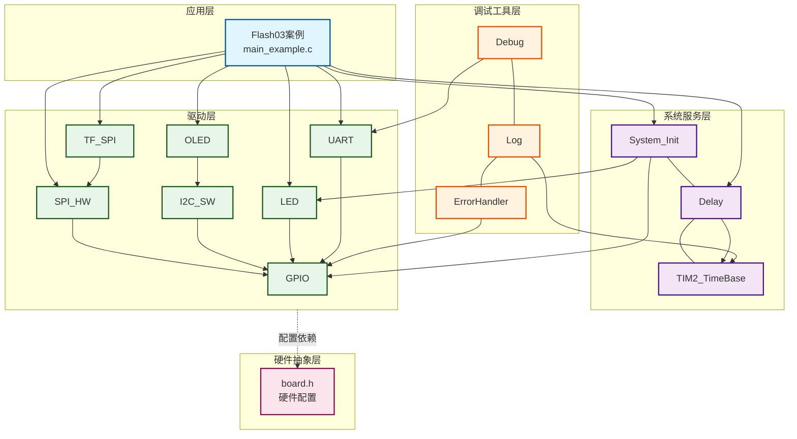
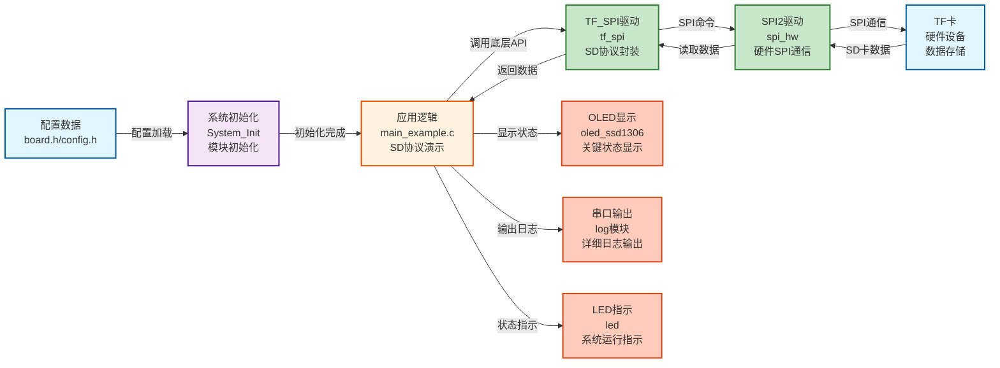

# Flash03 - TF卡（MicroSD卡）SPI读写示例

## ? 案例目的

- **核心目标**：演示完整的SD协议生命周期，包括上电复位、版本识别、初始化、设备识别、状态查询、块读写和验证，展示底层SD协议命令的使用方法

### 核心功能

1. **上电复位**：发送74+个时钟脉冲完成卡上电复位，CMD0进入SPI模式
2. **版本识别**：CMD8判断SDv2.0，CMD58读取OCR识别电压范围
3. **初始化**：循环ACMD41等待卡就绪，识别SDHC/SDXC容量类型
4. **设备识别**：CMD9读取CSD寄存器获取容量、速度等级，CMD10读取CID寄存器获取厂商ID、OEM、产品名
5. **状态查询**：CMD13发送状态查询，通过R1/R2响应判断卡状态（写入保护、锁定、错误标志）
6. **块写入**：单块（512字节）和多块写入，展示写入令牌（0xFE/0xFC）机制与CRC校验
7. **块读取**：单块/多块读取，处理起始令牌（0xFE）和错误令牌（0x0X），支持任意地址随机读取
8. **数据验证**：写入后回读对比，使用memcmp()验证数据一致性

### 学习重点

- 理解SD卡SPI协议的基本特性和操作流程
- 掌握SD协议生命周期（复位→识别→初始化→读写→验证）
- 学习底层SD命令的使用方法（CMD0/CMD8/CMD9/CMD10/CMD13/CMD17/CMD24等）
- 了解SD卡类型识别（SDSC/SDHC/SDXC）
- 学习CSD/CID寄存器解析方法
- 掌握块读写操作和验证方法

### 应用场景

适用于需要SD卡存储的应用，如数据日志、配置存储、固件备份、参数保存等场景。

**?? 重要说明**：
- 本示例使用TF_SPI模块的底层命令访问接口，展示SD协议底层细节
- 实际应用应使用TF_SPI模块的高级API（如`TF_SPI_Init()`、`TF_SPI_ReadBlock()`等）
- 底层命令接口主要用于教学演示和调试

## ? 硬件要求

### 必需外设

- **LED1**：连接到 `PA1`（系统状态指示）

### 传感器/模块

#### TF卡（MicroSD卡）模块

| 引脚 | STM32连接 | 说明 |
|------|-----------|------|
| CS | PA8 | 片选信号（软件NSS模式） |
| SCK | PB13 | SPI2时钟信号 |
| MISO | PB14 | SPI2主入从出（数据接收） |
| MOSI | PB15 | SPI2主出从入（数据发送） |
| VCC | 3.3V | **?? 重要：必须使用3.3V，不能使用5V！** |
| GND | GND | 电源地 |

**?? 重要提示**：
- TF卡使用3.3V供电，使用5V会损坏卡
- CS引脚使用软件NSS模式，由软件控制拉低/拉高
- 确保电源稳定，避免写入过程中断电
- 初始化时使用低速（≤400kHz），初始化完成后可以切换到高速

#### OLED显示屏（软件I2C接口）

| 引脚 | STM32连接 | 说明 |
|------|-----------|------|
| SCL | PB8 | 软件I2C时钟线 |
| SDA | PB9 | 软件I2C数据线 |
| VCC | 3.3V | 电源 |
| GND | GND | 电源地 |

#### UART1（用于详细日志输出）

| 引脚 | STM32连接 | 说明 |
|------|-----------|------|
| TX | PA9 | UART1发送 |
| RX | PA10 | UART1接收 |
| 波特率 | 115200 | 串口通信波特率 |

**连接说明**：将UART1连接到USB转串口模块，用于查看详细日志输出。

## ? 模块依赖

### 模块依赖关系图

### 模块列表

本案例使用以下模块：

- **`tf_spi`**：TF卡SPI驱动模块（核心模块）
- **`spi_hw`**：硬件SPI驱动模块（TF卡使用SPI2）
- **`gpio`**：GPIO驱动模块（SPI、I2C、UART、LED依赖）
- **`led`**：LED驱动模块（状态指示）
- **`oled_ssd1306`**：OLED显示模块（关键信息显示）
- **`uart`**：UART驱动模块（详细日志输出）
- **`i2c_sw`**：软件I2C驱动模块（OLED使用）
- **`delay`**：延时模块（非阻塞延时）
- **`error_handler`**：错误处理模块（统一错误处理）
- **`log`**：日志模块（分级日志输出）

## ? 实现流程

### 整体逻辑

本案例通过SPI2接口与TF卡通信，演示完整的SD协议生命周期。程序执行分为以下几个阶段：

1. **系统初始化阶段**：
   - 调用`System_Init()`初始化系统基础模块（GPIO、LED、delay、TIM2）
   - 初始化UART1用于串口日志输出
   - 初始化Debug和Log模块
   - 初始化软件I2C和OLED用于状态显示
   - 初始化SPI2（TF卡使用，PB13/14/15，PA8作为CS）

2. **上电复位阶段**：
   - 发送74+个时钟脉冲（10个0xFF）
   - 发送CMD0进入SPI模式
   - 验证R1响应为IDLE_STATE

3. **版本识别阶段**：
   - 发送CMD8检查电压兼容性
   - 读取R7响应（5字节）
   - 发送CMD58读取OCR
   - 解析OCR识别电压范围和卡类型

4. **初始化阶段**：
   - 循环发送ACMD41等待卡就绪
   - 读取OCR确认初始化完成
   - 识别SDHC/SDXC（通过OCR的CCS位）

5. **设备识别阶段**：
   - 发送CMD9读取CSD寄存器
   - 解析CSD获取容量、速度等级、块大小等信息
   - 发送CMD10读取CID寄存器
   - 解析CID获取厂商ID、OEM、产品名、序列号等信息

6. **状态查询阶段**：
   - 发送CMD13查询卡状态
   - 读取R1或R2响应
   - 解析状态位（写保护、锁定、错误标志等）

7. **块读写测试阶段**：
   - 单块写入测试（CMD24）
   - 单块读取测试（CMD17）
   - 多块写入测试（CMD25）
   - 多块读取测试（CMD18）

8. **数据验证阶段**：
   - 写入测试数据到指定块地址
   - 从同一块地址回读数据
   - 使用memcmp()对比512字节数据
   - 显示验证结果和错误信息

### 数据流向图

### 关键方法

1. **SD协议生命周期**：
   - 完整的SD协议流程：复位→识别→初始化→读写→验证
   - 每个阶段都有对应的测试函数，展示SD协议的底层细节
   - 使用TF_SPI模块的底层命令访问接口，展示SD命令的发送和响应处理

2. **底层命令访问**：
   - 使用`TF_SPI_SendCMD()`发送SD命令（CMD0/CMD8/CMD9/CMD10/CMD13等）
   - 使用`TF_SPI_ReadCSD()`读取CSD寄存器
   - 使用`TF_SPI_ReadCID()`读取CID寄存器
   - 使用`TF_SPI_ReadOCR()`读取OCR寄存器
   - 使用`TF_SPI_SendStatus()`查询卡状态

3. **寄存器解析**：
   - CSD寄存器解析（CSD版本1.0和2.0）
   - CID寄存器解析（厂商ID、OEM、产品名、序列号）
   - OCR寄存器解析（电压范围、CCS位）

4. **块读写操作**：
   - 使用TF_SPI模块的高级API进行块读写（`TF_SPI_ReadBlock()`、`TF_SPI_WriteBlock()`等）
   - 支持单块和多块读写
   - 数据验证使用memcmp()对比

### 工作流程示意图

```mermaid
flowchart TD
    START([系统启动]) --> INIT[系统初始化<br/>System_Init]
    INIT --> UART[UART初始化]
    UART --> DEBUG[Debug初始化]
    DEBUG --> LOG[Log初始化]
    LOG --> I2C[软件I2C初始化]
    I2C --> OLED[OLED初始化]
    OLED --> SPI[SPI2初始化<br/>PB13/14/15, PA8]
    
    SPI --> TEST1[上电复位测试<br/>CMD0]
    TEST1 --> TEST2[版本识别测试<br/>CMD8, CMD58]
    TEST2 --> TEST3[初始化测试<br/>ACMD41循环]
    TEST3 --> TEST4[设备识别测试<br/>CMD9, CMD10]
    TEST4 --> TEST5[状态查询测试<br/>CMD13]
    TEST5 --> TEST6[单块写入测试<br/>CMD24]
    TEST6 --> TEST7[单块读取测试<br/>CMD17]
    TEST7 --> TEST8[多块写入测试<br/>CMD25]
    TEST8 --> TEST9[多块读取测试<br/>CMD18]
    TEST9 --> TEST10[数据验证测试<br/>写入后回读对比]
    
    TEST10 --> LOOP[主循环<br/>LED闪烁]
    LOOP --> LOOP
    
    %% 样式
    style START fill:#e1f5ff,stroke:#01579b,stroke-width:2px
    style INIT fill:#f3e5f5,stroke:#4a148c,stroke-width:2px
    style TEST1 fill:#fff3e0,stroke:#e65100,stroke-width:2px
    style TEST2 fill:#fff3e0,stroke:#e65100,stroke-width:2px
    style TEST3 fill:#fff3e0,stroke:#e65100,stroke-width:2px
    style TEST4 fill:#fff3e0,stroke:#e65100,stroke-width:2px
    style TEST5 fill:#fff3e0,stroke:#e65100,stroke-width:2px
    style TEST6 fill:#fff3e0,stroke:#e65100,stroke-width:2px
    style TEST7 fill:#fff3e0,stroke:#e65100,stroke-width:2px
    style TEST8 fill:#fff3e0,stroke:#e65100,stroke-width:2px
    style TEST9 fill:#fff3e0,stroke:#e65100,stroke-width:2px
    style TEST10 fill:#fff3e0,stroke:#e65100,stroke-width:2px
    style LOOP fill:#c8e6c9,stroke:#2e7d32,stroke-width:2px
```

## ? 关键函数说明

### TF_SPI模块相关函数

- **`TF_SPI_SendCMD()`**：发送SD命令（底层接口）
  - 在本案例中用于发送各种SD命令（CMD0/CMD8/CMD9/CMD10/CMD13等）
  - 主要用于教学演示和调试，实际应用应使用高级API
  - 返回R1响应值

- **`TF_SPI_ReadCSD()`**：读取CSD寄存器（底层接口）
  - 在本案例中用于读取CSD寄存器，解析容量、速度等级等信息
  - 返回16字节CSD数据

- **`TF_SPI_ReadCID()`**：读取CID寄存器（底层接口）
  - 在本案例中用于读取CID寄存器，解析厂商ID、OEM、产品名等信息
  - 返回16字节CID数据

- **`TF_SPI_ReadOCR()`**：读取OCR寄存器（底层接口）
  - 在本案例中用于读取OCR寄存器，识别电压范围和卡类型
  - 返回32位OCR值

- **`TF_SPI_SendStatus()`**：发送状态查询命令（CMD13）
  - 在本案例中用于查询卡状态（写保护、锁定、错误标志等）
  - 返回R1响应值

- **`TF_SPI_ReadBlock()`**：读取单个块（高级API）
  - 在本案例中用于读取写入的数据，进行验证
  - 支持任意块地址的读取

- **`TF_SPI_WriteBlock()`**：写入单个块（高级API）
  - 在本案例中用于写入测试数据
  - 支持任意块地址的写入

- **`TF_SPI_ReadBlocks()`**：读取多个块（高级API）
  - 在本案例中用于多块读取测试
  - 支持连续多个块的读取

- **`TF_SPI_WriteBlocks()`**：写入多个块（高级API）
  - 在本案例中用于多块写入测试
  - 支持连续多个块的写入

### OLED相关函数

- **`OLED_Init()`**：初始化OLED显示屏
  - 在本案例中用于初始化OLED，显示关键状态信息
  - 使用软件I2C接口（PB8/9）

- **`OLED_ShowString()`**：显示字符串
  - 在本案例中用于显示设备信息、操作状态、验证结果等
  - 输出内容为全英文ASCII字符，符合项目规范

- **`OLED_Clear()`**：清屏
  - 在本案例中用于清除屏幕内容，准备显示新信息

### UART相关函数

- **`LOG_INFO()`**：Log模块的信息级别输出
  - 在本案例中用于输出详细日志、设备信息、操作进度等
  - 遵循项目规范的串口输出规范（使用Log模块，支持中文GB2312编码）

- **`LOG_ERROR()`**：Log模块的错误级别输出
  - 在本案例中用于输出错误信息、验证失败信息等
  - 支持中文描述，便于开发调试

**详细函数实现和调用示例请参考**：`main_example.c` 中的代码

## ?? 注意事项与重点

### ?? 重要提示

1. **SD协议生命周期**：
   - SD卡必须按照完整的协议流程操作：复位→识别→初始化→读写
   - 跳过任何步骤都可能导致操作失败
   - 初始化时必须等待ACMD41返回0x00（卡就绪）

2. **SPI配置**：
   - 使用SPI2：PB13(SCK), PB14(MISO), PB15(MOSI), PA8(CS)
   - 初始化时使用低速（≤400kHz，建议Prescaler_128或256）
   - 初始化完成后可以切换到高速
   - SPI模式：CPOL=0, CPHA=0（模式0）
   - 使用软件NSS模式，PA8作为CS引脚需要手动配置为GPIO输出

3. **CS控制**：
   - PA8引脚需要手动配置为GPIO输出（推挽输出，50MHz）
   - 使用软件NSS模式，每个命令前后正确控制CS（拉低选中，拉高释放）
   - CS控制错误会导致SD卡无法响应

4. **电源要求**：
   - TF卡使用3.3V供电，**不能使用5V**（会损坏卡）
   - 确保电源稳定，避免写入过程中断电
   - 写入过程中断电可能导致数据损坏

5. **地址模式**：
   - SDSC卡使用字节地址（块地址 × 512）
   - SDHC/SDXC卡使用块地址（直接使用块地址）
   - TF_SPI模块会自动处理地址转换

6. **块擦除管理**：
   - **无需手动4KB扇区擦除**，SD卡控制器会自动管理
   - 但必须理解CMD32/CMD33/CMD38多块擦除协议，体现控制器自动管理特性
   - 写入操作前SD卡会自动擦除目标块

### ? 关键点

1. **SD协议命令格式**：
   - 命令格式：6字节（命令+地址+CRC）
   - 响应格式：R1（1字节）、R2（2字节）、R3/R7（5字节）
   - 数据令牌：0xFE（单块）、0xFC（多块写入开始）、0xFD（多块写入停止）
   - 数据响应：0x05（接受）、0x0B（CRC错误）、0x0D（写入错误）

2. **CSD寄存器解析**：
   - CSD版本1.0（SDSC）：容量计算公式 `(C_SIZE + 1) * 512 * 2^(C_SIZE_MULT + 2)`
   - CSD版本2.0（SDHC/SDXC）：容量计算公式 `(C_SIZE + 1) * 512KB`
   - 速度等级：从CSD寄存器解析

3. **CID寄存器解析**：
   - 厂商ID：CID[0]
   - OEM：CID[1-2]
   - 产品名：CID[3-8]
   - 序列号：CID[9-12]
   - 制造日期：CID[13-14]

4. **状态查询（CMD13）**：
   - R1响应：1字节状态
   - R2响应：2字节状态（包含更多错误信息）
   - 状态位解析：写保护、锁定、错误标志等

5. **数据验证方法**：
   - 写入后必须回读验证
   - 使用memcmp()对比数据，显示详细的错误信息
   - 验证失败时应检查初始化状态、地址模式、CS控制等

## ? 常见问题排查

#### 问题1：CMD0返回非0x01响应

**可能原因**：
- CS控制错误（未正确拉低/拉高）
- SPI通信问题（MISO引脚未正确连接或配置错误）
- 电源问题（未使用3.3V或电源不稳定）

**解决方法**：
1. 检查CS引脚（PA8）是否正确配置为GPIO输出
2. 检查SPI引脚连接（PB13/14/15）
3. 检查电源电压（必须使用3.3V）
4. 检查SPI初始化是否成功

#### 问题2：ACMD41一直返回0x01（IDLE_STATE）

**可能原因**：
- 卡未正确初始化
- 电压不兼容
- 卡损坏

**解决方法**：
1. 检查CMD8的R7响应，确认电压兼容性
2. 增加ACMD41重试次数
3. 检查卡是否损坏（尝试其他卡）

#### 问题3：读取CSD/CID失败

**可能原因**：
- 卡未初始化完成
- SPI通信问题
- 超时时间过短

**解决方法**：
1. 确保ACMD41返回0x00（卡就绪）
2. 检查SPI通信是否正常
3. 增加超时时间

#### 问题4：写入操作失败

**可能原因**：
- 卡写保护
- 地址越界
- 卡未初始化

**解决方法**：
1. 检查CMD13状态，确认写保护状态
2. 检查块地址是否在有效范围内
3. 确保卡已正确初始化

#### 问题5：数据验证失败

**可能原因**：
- 写入操作未完成
- 地址模式错误（SDSC使用字节地址，SDHC/SDXC使用块地址）
- 卡损坏

**解决方法**：
1. 确保写入操作完成（等待卡忙结束）
2. 检查地址模式是否正确
3. 尝试其他块地址
4. 检查卡是否损坏

## ? 扩展练习

### 循序渐进部分

1. **简化功能**：
   - 只实现上电复位和版本识别测试
   - 移除其他测试函数，专注于SD协议基础

2. **修改参数**：
   - 修改测试块地址，测试不同位置的读写
   - 修改多块测试的块数量，测试不同大小的数据传输

3. **添加基础功能**：
   - 添加块擦除测试（虽然SD卡会自动管理，但可以展示CMD32/CMD33/CMD38协议）
   - 添加速度等级显示（从CSD寄存器解析）

### 实际场景坑点部分

4. **边界条件处理**：
   - 测试块地址0和最大块地址的读写
   - 测试单块和多块读写的边界情况
   - 处理地址越界错误

5. **异常情况处理**：
   - 处理卡未插入的情况（CMD0返回0xFF）
   - 处理卡写保护的情况（CMD13状态位）
   - 处理初始化超时的情况

6. **性能优化**：
   - 比较单块读写和多块读写的性能差异
   - 优化SPI时钟频率（初始化后切换到高速）
   - 实现DMA传输（如果支持）

## ? 相关文档

### 模块文档

- **TF_SPI模块**：`Drivers/flash/tf_spi.c/h` - TF卡SPI驱动模块
- **SPI驱动模块**：`Drivers/spi/spi_hw.c/h` - 硬件SPI驱动
- **OLED显示模块**：`Drivers/display/oled_ssd1306.c/h` - OLED显示驱动
- **UART驱动模块**：`Drivers/uart/uart.c/h` - UART驱动

### 业务文档

- **主程序代码**：`Examples/Flash/Flash03_TF_SPI_ReadWrite/main_example.c`
- **硬件配置**：`Examples/Flash/Flash03_TF_SPI_ReadWrite/board.h`
- **模块配置**：`Examples/Flash/Flash03_TF_SPI_ReadWrite/config.h`
- **项目规范**：`PROJECT_KEYWORDS.md`
- **参考案例**：`Examples/Flash/Flash01_W25Q_ReadWrite/` - W25Q Flash示例

### SD协议规范

- **SD卡物理层规范**：SD Physical Layer Specification
- **SD卡SPI模式规范**：SD Card SPI Mode Specification

