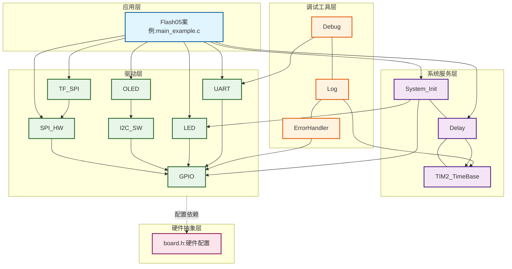
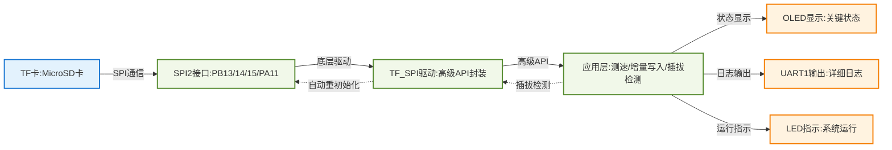
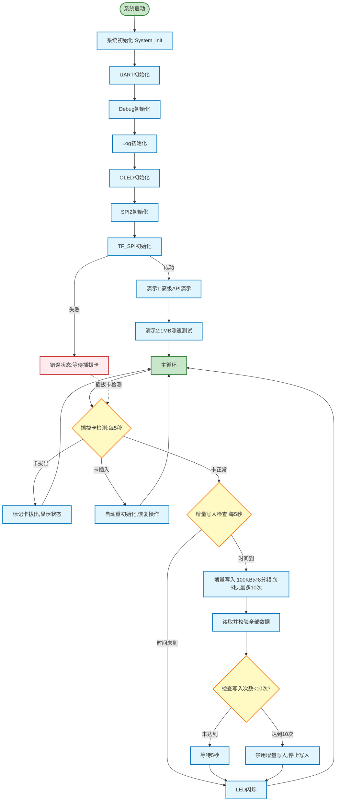

# Flash05 - TF卡（MicroSD卡）读写测速示例

## 📋 案例目的

- **核心目标**：演示TF卡高级API使用、不同分频下的1MB测速、增量写入（100KB）和插拔卡处理

### 核心功能

1. **高级API演示**：展示TF_SPI模块的高级API函数列表和用法
2. **测速测试**：测试不同SPI分频下的1MB读写速度（分频：2, 4, 8, 16, 32, 64, 128, 256）
3. **增量写入**：每5秒写入100KB数据（使用8分频4.5MHz），读取全部并校验数据正确性，最多执行10次
4. **插拔卡处理**：自动检测SD卡插拔状态，实现自动重初始化，保证读写健壮性

### 学习重点

- 理解TF_SPI模块的高级API函数和使用方法
- 掌握不同SPI分频对TF卡读写速度的影响
- 学习数据测试的方法（1MB测试，优化后的高效传输，便于调试）
- 了解增量写入的实现和数据校验方法
- 学习插拔卡检测和自动重初始化的实现
- 掌握健壮性编程方法（状态检查、错误处理、自动恢复）

### 应用场景

适用于需要高性能SD卡存储的应用，如高速数据采集、大容量数据日志、固件备份、参数保存等场景。特别适合需要处理插拔卡的应用场景。

**⚠️ 重要说明**：
- 本示例使用TF_SPI模块的高级API（`TF_SPI_Init()`、`TF_SPI_ReadBlocks()`、`TF_SPI_WriteBlocks()`等）
- 1MB测试数据，使用32块批量传输（约16KB）提高效率，便于调试
- 测速测试已优化，预计每个分频耗时1-3秒
- 插拔卡检测每5秒执行一次，不影响主循环性能

## 🔧 硬件要求

### 必需外设

- **LED1**：连接到 `PA1`（系统状态指示）

### 传感器/模块

#### TF卡（MicroSD卡）模块

| 引脚 | STM32连接 | 说明 |
|------|-----------|------|
| CS | PA11 | 片选信号（软件NSS模式） |
| SCK | PB13 | SPI2时钟信号 |
| MISO | PB14 | SPI2主入从出（数据接收） |
| MOSI | PB15 | SPI2主出从入（数据发送） |
| VCC | 3.3V | **⚠️ 重要：必须使用3.3V，不能使用5V！** |
| GND | GND | 电源地 |

**⚠️ 重要提示**：
- TF卡使用3.3V供电，使用5V会损坏卡
- CS引脚使用软件NSS模式，由软件控制拉低/拉高
- 确保电源稳定，避免写入过程中断电
- 初始化时使用低速（≤400kHz），初始化完成后可以切换到高速
- MISO引脚（PB14）必须添加上拉电阻（10k-50kΩ），CS引脚（PA11）不需要上拉

**⚠️ 读卡器选择（单设备SPI连接方式）**：
- **方法1**：选择有电阻的简单读卡器，不要用带芯片的复杂读卡器
- **方法2**：DO（MISO）电压低于2.8V的一律不用
- 简单读卡器通常只有必要的电阻和电容，适合SPI模式直接连接
- 复杂读卡器可能包含SDIO控制器芯片，不适合SPI模式使用
- DO电压过低可能导致通信不稳定或失败

#### OLED显示屏（软件I2C接口）

| 引脚 | STM32连接 | 说明 |
|------|-----------|------|
| SCL | PB8 | 软件I2C时钟线 |
| SDA | PB9 | 软件I2C数据线 |
| VCC | 3.3V | 电源 |
| GND | GND | 电源地 |

#### UART1（用于详细日志输出）

| 引脚 | STM32连接 | 说明 |
|------|-----------|------|
| TX | PA9 | UART1发送 |
| RX | PA10 | UART1接收 |
| 波特率 | 115200 | 串口通信波特率 |

**连接说明**：将UART1连接到USB转串口模块，用于查看详细日志输出。

## 📦 模块依赖

### 模块依赖关系图

### 模块列表

本案例使用以下模块：

- **`tf_spi`**：TF卡SPI驱动模块（核心模块）
- **`spi_hw`**：硬件SPI驱动模块（TF_SPI使用SPI2）
- **`gpio`**：GPIO驱动模块（SPI、I2C、UART、LED依赖）
- **`led`**：LED驱动模块（状态指示）
- **`oled_ssd1306`**：OLED显示模块（关键信息显示）
- **`uart`**：UART驱动模块（详细日志输出）
- **`i2c_sw`**：软件I2C驱动模块（OLED使用）
- **`delay`**：延时模块（非阻塞延时）
- **`error_handler`**：错误处理模块（统一错误处理）
- **`log`**：日志模块（分级日志输出）

## 🔄 实现流程

### 整体逻辑

本案例通过三个演示功能展示TF卡的高级API使用、性能测试和健壮性处理。程序执行分为以下几个阶段：

1. **系统初始化阶段**：
   - 调用`System_Init()`初始化系统基础模块
   - 初始化UART1用于串口日志输出
   - 初始化Debug和Log模块
   - 初始化软件I2C和OLED用于状态显示
   - 初始化SPI2和TF_SPI模块

2. **演示1：高级API演示**：
   - 展示TF_SPI模块的7个高级API函数
   - 在串口输出函数列表和用法说明
   - 在OLED显示关键信息
   - 获取并显示设备信息

3. **演示2：测速测试**：
   - 循环测试所有SPI分频（2, 4, 8, 16, 32, 64, 128, 256）
   - 每个分频测试1MB数据的写入和读取速度
   - 记录每个分频的耗时和速度
   - 输出详细的速度对比表

### 速度测试结果

本案例在STM32F103C8T6平台上测试的实际速度结果如下：

| 分频 | 写入时间(ms) | 写入速度(KB/s) | 读取时间(ms) | 读取速度(KB/s) |
|------|--------------|---------------|--------------|---------------|
| 2    | 10063        | 101.76        | 4760          | 215.13        |
| 4    | 12264        | 83.50         | 5397          | 189.74        |
| 8    | 11619        | 88.13         | 6600          | 155.15        |
| 16   | 13529        | 75.69         | 8322          | 123.05        |
| 32   | 18113        | 56.53         | 11939         | 85.77         |
| 64   | 23996        | 42.67         | 19095         | 53.63         |
| 128  | 38978        | 26.27         | 33432         | 30.63         |
| 256  | 69128        | 14.81         | 62741         | 16.32         |

**性能说明**：

- 已经达到了STM32F103 + CPU模式 + TF_SPI驱动高级函数自动初始化的性能标准
- 使用SPI1速度能再提升一倍
- 使用手动初始化调用底层接口速度能大幅提升
- 使用DMA能发挥最大速率

**测试条件**：
- 测试数据大小：1MB（2048块，每块512字节）
- 测试方法：使用32块批量传输（约16KB）提高效率
- 测试平台：STM32F103C8T6，系统时钟72MHz，SPI2接口
- 驱动方式：TF_SPI高级API（自动初始化，CPU模式传输）

4. **演示3：增量写入模式**（主循环中持续运行）：
   - 每5秒执行一次增量写入（写入100KB，使用8分频4.5MHz）
   - 每次写入后读取全部数据并校验
   - 显示当前数据容量和写入次数
   - 最多执行10次，便于测试插拔卡功能

5. **插拔卡处理**（主循环中持续运行）：
   - 每5秒检测一次TF卡初始化状态
   - 检测到卡拔出时标记状态
   - 检测到卡插入时自动重新初始化
   - 在OLED和串口显示插拔卡状态

### 数据流向图

### 关键方法

1. **动态SPI分频修改**：
   - 方法：直接操作SPI2的CR1寄存器修改BR位（bit 3-5）
   - 使用场景：测速测试时动态切换分频
   - 注意事项：修改前必须等待SPI总线空闲，修改前禁用SPI，修改后重新使能

2. **大容量数据测试**：
   - 方法：分块处理（每次100块，约50KB），循环写入/读取
   - 使用场景：1MB测速测试（使用32块批量传输，约16KB）
   - 注意事项：使用静态缓冲区避免栈溢出，定期更新进度显示

3. **增量写入实现**：
   - 方法：使用软件定时器（基于Delay_GetTick()），每5秒触发一次
   - 使用场景：持续数据记录，最多执行10次（便于测试插拔卡功能）
   - 注意事项：
     - 记录当前写入位置，数据包含序号和时间戳便于校验
     - 达到最大写入次数（10次）后，自动禁用增量写入功能
     - 写入失败时（如-3706错误），自动尝试重新初始化SD卡
     - 每次写入和校验完成后，等待5秒后继续下一次写入

4. **插拔卡检测**：
   - 方法：定期检查`TF_SPI_IsInitialized()`状态，状态变化时触发重初始化
   - 使用场景：热插拔应用
   - 注意事项：
     - 检测间隔为5秒，避免频繁检测影响性能
     - 检测到变化时及时处理
     - 重初始化前，自动将SPI恢复到初始化速度（256分频），初始化成功后再恢复工作速度

5. **数据校验方法**：
   - 方法：读取数据后检查块地址、序号、数据内容的一致性
   - 使用场景：增量写入后的数据验证
   - 注意事项：校验所有已写入的数据，统计错误数量

### 工作流程示意图

## 📚 关键函数说明

### TF_SPI相关函数

- **`TF_SPI_Init()`**：自动初始化TF卡
  - 在本案例中用于初始化SD卡，自动检测卡类型并配置
  - 支持SDSC/SDHC/SDXC卡类型自动识别
  - 初始化失败时返回错误码，需要检查返回值

- **`TF_SPI_GetInfo()`**：获取设备信息（只读指针）
  - 在本案例中用于获取SD卡容量、块大小、块数量、卡类型等信息
  - 返回NULL表示未初始化，需要先调用`TF_SPI_Init()`

- **`TF_SPI_IsInitialized()`**：检查初始化状态
  - 在本案例中用于插拔卡检测，判断卡是否存在
  - 返回1表示已初始化，0表示未初始化

- **`TF_SPI_ReadBlock()`**：读取单个块（512字节）
  - 在本案例中用于增量写入后的数据校验
  - 块地址范围：0 ~ (block_count - 1)

- **`TF_SPI_WriteBlock()`**：写入单个块（512字节）
  - 在本案例中用于增量写入功能
  - 写入前会自动擦除，无需手动擦除

- **`TF_SPI_ReadBlocks()`**：读取多个块
  - 在本案例中用于1MB测速测试和增量写入数据校验
  - 支持连续读取多个块，提高效率

- **`TF_SPI_WriteBlocks()`**：写入多个块
  - 在本案例中用于1MB测速测试和增量写入功能
  - 支持连续写入多个块，提高效率

### SPI相关函数

- **`SPI_HW_Init()`**：初始化硬件SPI模块
  - 在本案例中用于初始化SPI2接口
  - 必须在`TF_SPI_Init()`之前调用

- **`ChangeSPIPrescaler()`**（案例内部函数）：动态修改SPI分频
  - 在本案例中用于测速测试时动态切换SPI时钟频率
  - 直接操作SPI2的CR1寄存器修改BR位
  - 修改前必须等待SPI总线空闲，修改前禁用SPI，修改后重新使能

### 辅助函数

- **`PerformSpeedTest()`**（案例内部函数）：执行测速测试
  - 在本案例中用于测试不同分频下的1MB读写速度
  - 循环测试所有分频，记录每个分频的耗时和速度
  - 输出详细的速度对比表
  - 测试过程中检测SD卡状态，拔卡时跳过当前分频，继续下一个
  - 测试完成后，自动恢复SPI分频到8分频（增量写入使用的分频）
  - 测试后检查SD卡状态，异常时自动尝试重新初始化

- **`PerformIncrementalWrite()`**（案例内部函数）：执行增量写入
  - 在本案例中用于每5秒写入100KB数据（使用8分频4.5MHz），最多执行10次
  - 数据包含序号、时间戳、块地址等信息便于校验
  - 写入前检查SD卡状态，未初始化时自动尝试重新初始化
  - 写入失败时（如-3706错误），自动清除状态并尝试重新初始化
  - 达到最大写入次数后，自动禁用增量写入功能

- **`VerifyIncrementalData()`**（案例内部函数）：校验增量写入数据
  - 在本案例中用于读取并校验所有已写入的数据
  - 检查数据完整性、序号连续性，统计错误数量

- **`DetectAndHandleCard()`**（案例内部函数）：检测并处理插拔卡
  - 在本案例中用于定期检测SD卡插拔状态
  - 检测到卡拔出时标记状态，检测到卡插入时自动重新初始化

**详细函数实现和调用示例请参考**：`main_example.c` 中的代码

## ⚠️ 注意事项与重点

### ⚠️ 重要提示

1. **标准初始化流程**：必须严格按照 System_Init → UART → Debug → Log → 其他模块 的顺序初始化
2. **SD卡容量要求**：1MB测速测试需要SD卡至少有5MB可用空间（包含测试数据和系统文件）
3. **测速测试耗时**：1MB测试已优化，预计每个分频耗时1-3秒（使用32块批量传输提高效率，便于调试）
4. **插拔卡检测间隔**：每5秒检测一次，避免频繁检测影响性能
5. **增量写入位置**：从块地址1000开始写入，避免覆盖系统区域

### 🔑 关键点

1. **SPI分频动态修改**：直接操作寄存器修改分频，修改前必须等待总线空闲并禁用SPI
2. **大容量数据处理**：使用分块处理避免栈溢出，使用静态缓冲区避免内存分配问题
3. **增量写入数据组织**：每个块包含序号、时间戳、块地址等信息，便于校验和恢复
4. **插拔卡状态管理**：使用状态机管理插拔卡状态，状态变化时及时处理
5. **健壮性保证**：所有读写操作前检查初始化状态，操作失败时尝试重新初始化

## 🔍 常见问题排查

### 问题1：TF卡初始化失败

**可能原因**：
- SD卡未插入或未上电
- SPI引脚连接错误
- CS引脚（PA11）控制问题
- MISO引脚（PB14）缺少上拉电阻
- SPI时钟频率过高（初始化时应≤400kHz）

**解决方法**：
1. 检查SD卡是否正确插入
2. 检查SPI引脚连接（PB13/14/15/PA11）
3. 检查CS引脚控制逻辑（软件NSS模式，GPIO输出）
4. 检查MISO引脚是否添加上拉电阻（10k-50kΩ）
5. 检查SPI初始化时的分频配置（应使用SPI_BaudRatePrescaler_256或更大）

### 问题2：测速测试失败或速度异常

**可能原因**：
- SD卡容量不足（需要至少100MB可用空间）
- SPI分频修改失败
- 写入/读取操作超时
- SD卡质量问题

**解决方法**：
1. 检查SD卡容量是否足够（至少100MB可用空间）
2. 检查SPI分频修改是否成功（查看串口日志）
3. 检查写入/读取操作的返回值
4. 尝试使用其他SD卡测试

### 问题3：增量写入失败

**可能原因**：
- SD卡容量不足
- 写入位置超出容量范围
- 写入操作超时（如-3706错误）
- 插拔卡导致写入中断
- SPI分频设置不当（增量写入使用8分频）

**解决方法**：
1. 检查SD卡容量是否足够
2. 检查当前写入位置是否超出容量范围
3. 检查写入操作的返回值（-3706表示命令执行失败，可能是SD卡状态异常）
4. 检查插拔卡状态，确保卡已插入
5. 写入失败时，系统会自动尝试重新初始化SD卡
6. 如果达到最大写入次数（10次），增量写入会自动停止，这是正常行为

### 问题4：插拔卡检测不工作

**可能原因**：
- 检测间隔设置不当
- 初始化状态检查失败
- 重初始化失败

**解决方法**：
1. 检查检测间隔设置（默认5秒）
2. 检查`TF_SPI_IsInitialized()`返回值
3. 检查重初始化操作的返回值
4. 查看串口日志了解详细状态

### 问题5：数据校验失败

**可能原因**：
- 写入过程中断电或插拔卡
- 数据被其他设备修改
- SD卡质量问题

**解决方法**：
1. 确保写入过程中不断电
2. 确保SD卡不被其他设备访问
3. 检查SD卡质量，尝试使用其他SD卡
4. 查看串口日志了解具体错误位置

## 💡 扩展练习

### 循序渐进部分

1. **调整测速测试**：可以修改测试数据大小（当前1MB），或调整批量传输块数（当前32块）
2. **修改增量写入间隔**：将增量写入间隔从60秒改为30秒，加快数据积累速度
3. **添加数据统计**：统计写入/读取的总数据量、总耗时、平均速度等信息

### 实际场景坑点部分

4. **处理写入中断**：模拟写入过程中断电或插拔卡的情况，实现数据恢复机制
5. **优化插拔卡检测**：实现更精确的插拔卡检测（如使用GPIO检测卡插入信号）
6. **处理容量不足**：当SD卡容量不足时，实现数据循环覆盖或报警机制
7. **多任务并发处理**：在增量写入和插拔卡检测的同时，处理其他任务（如按键响应）

## 📖 相关文档

### 模块文档

- **TF_SPI模块**：`Drivers/flash/tf_spi.c/h` - TF卡SPI驱动模块
- **SPI模块**：`Drivers/spi/spi_hw.c/h` - 硬件SPI驱动模块
- **OLED模块**：`Drivers/display/oled_ssd1306.c/h` - OLED显示驱动模块
- **UART模块**：`Drivers/uart/uart.c/h` - UART驱动模块
- **Log模块**：`Debug/log.c/h` - 日志模块

### 业务文档

- **主程序代码**：`Examples/Flash/Flash05_TF_AutoInitSpeedTest/main_example.c`
- **硬件配置**：`Examples/Flash/Flash05_TF_AutoInitSpeedTest/board.h`
- **模块配置**：`Examples/Flash/Flash05_TF_AutoInitSpeedTest/config.h`
- **项目规范**：`../../../AI/README.md`（AI规则体系） - AI规则与项目约束
- **案例参考**：`Examples/README.md` - 案例参考文档

### 参考案例

- **Flash02_W25Q_SpeedTest**：W25Q Flash测速测试参考
- **Flash03_TF_SPI_AutoInitReadWrite**：TF卡自动初始化参考
- **Flash04_TF_SPI_ManualInitReadWrite**：TF卡手动初始化参考

