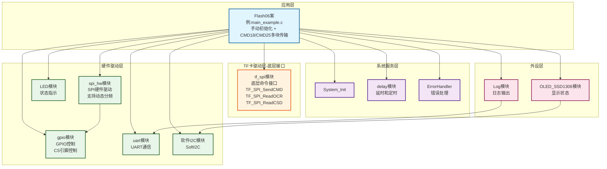
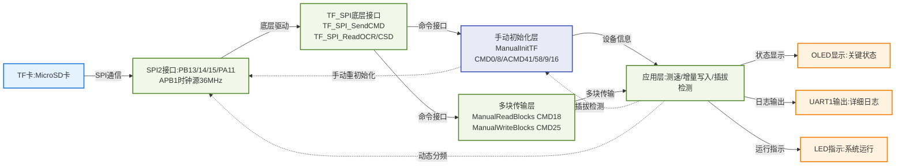
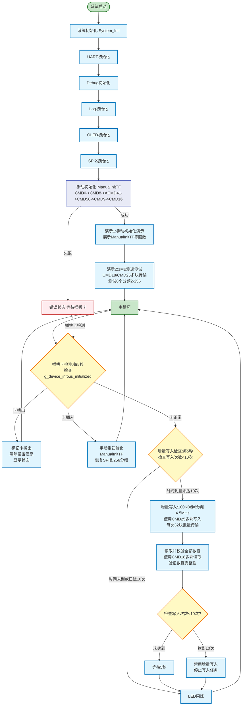

# Flash06 - TF卡（MicroSD卡）手动初始化与多块传输测速示例

> ✅ **测试状态**：所有功能已测试通过，性能达到预期标准

## 📋 案例目的

- **核心目标**：演示TF卡手动初始化、真正的CMD18/CMD25多块传输、不同分频下的1MB测速、增量写入（100KB）和插拔卡处理

### 核心功能

1. **手动初始化演示**：展示完整的手动初始化流程，包括CMD0、CMD8、ACMD41、CMD58、CMD9、CMD16等命令
2. **CMD18多块读取**：实现真正的CMD18多块传输（不是循环单块读取），提高读取效率
3. **CMD25多块写入**：实现真正的CMD25多块传输（不是循环单块写入），提高写入效率
4. **测速测试**：测试不同SPI分频下的1MB读写速度（分频：2, 4, 8, 16, 32, 64, 128, 256）
5. **增量写入**：每5秒写入100KB数据（使用8分频4.5MHz），使用CMD25多块写入，读取全部并校验数据正确性，最多执行10次
6. **插拔卡处理**：自动检测SD卡插拔状态，使用手动初始化重新初始化，保证读写健壮性

### 学习重点

- **手动初始化流程**：理解SD卡SPI模式的完整初始化序列，包括命令发送时序、响应等待、CSD/CID解析
- **CMD18多块读取**：掌握真正的多块读取实现，包括数据令牌（0xFE）等待、多块数据读取、CMD12停止传输
- **CMD25多块写入**：掌握真正的多块写入实现，包括起始令牌（0xFC）、多块数据写入、响应令牌检查、停止令牌（0xFD）
- **设备信息管理**：学习如何手动解析CSD寄存器，计算容量、块大小、块数量等设备信息
- **多块传输优势**：理解CMD18/CMD25多块传输相比循环单块操作的优势（减少命令开销、提高传输效率）
- **不同SPI分频的性能影响**：掌握不同SPI分频对TF卡读写速度的影响
- **插拔卡处理**：学习插拔卡检测和自动重初始化的实现

### 应用场景

适用于需要深入了解SD卡协议、需要高性能多块传输、需要自定义初始化流程的应用场景。特别适合：
- 需要精确控制SD卡初始化流程的场景
- 需要最大化传输效率的应用（如高速数据采集、大容量数据备份）
- 需要学习SD卡SPI协议的教学场景
- 需要自定义设备信息管理的场景

**⚠️ 重要说明**：
- 本示例使用**手动初始化**，不依赖`TF_SPI_Init()`函数
- 本示例使用**真正的CMD18/CMD25多块传输**，不是循环调用单块操作
- 设备信息由本示例自己管理，不依赖`TF_SPI_SetDeviceInfoFromCSD()`或`TF_SPI_GetInfo()`
- 1MB测试数据，使用32块批量传输（约16KB）提高效率
- 测速测试已优化，预计每个分频耗时1-3秒
- 插拔卡检测每5秒执行一次，不影响主循环性能

## 🔧 硬件要求

### 必需外设

- **LED1**：连接到 `PA1`（系统状态指示）

### 传感器/模块

#### TF卡（MicroSD卡）模块

| 引脚 | STM32连接 | 说明 |
|------|-----------|------|
| CS | PA11 | 片选信号（软件NSS模式） |
| SCK | PB13 | SPI2时钟信号 |
| MISO | PB14 | SPI2主入从出（数据接收） |
| MOSI | PB15 | SPI2主出从入（数据发送） |
| VCC | 3.3V | **⚠️ 重要：必须使用3.3V，不能使用5V！** |
| GND | GND | 电源地 |

**⚠️ 重要提示**：
- TF卡使用3.3V供电，使用5V会损坏卡
- CS引脚使用软件NSS模式，由软件控制拉低/拉高
- 确保电源稳定，避免写入过程中断电
- 初始化时使用低速（≤400kHz，256分频），初始化完成后可以切换到高速
- MISO引脚（PB14）必须添加上拉电阻（10k-50kΩ），CS引脚（PA11）不需要上拉

**⚠️ 读卡器选择（单设备SPI连接方式）**：
- **方法1**：选择有电阻的简单读卡器，不要用带芯片的复杂读卡器
- **方法2**：DO（MISO）电压低于2.8V的一律不用
- 简单读卡器通常只有必要的电阻和电容，适合SPI模式直接连接
- 复杂读卡器可能包含SDIO控制器芯片，不适合SPI模式使用
- DO电压过低可能导致通信不稳定或失败

#### OLED显示屏（软件I2C接口）

| 引脚 | STM32连接 | 说明 |
|------|-----------|------|
| SCL | PB8 | 软件I2C时钟线 |
| SDA | PB9 | 软件I2C数据线 |
| VCC | 3.3V | 电源 |
| GND | GND | 电源地 |

#### UART1（用于详细日志输出）

| 引脚 | STM32连接 | 说明 |
|------|-----------|------|
| TX | PA9 | UART1发送 |
| RX | PA10 | UART1接收 |
| 波特率 | 115200 | 串口通信波特率 |

**连接说明**：将UART1连接到USB转串口模块，用于查看详细日志输出。

## 📦 模块依赖

### 模块依赖关系图



### 模块说明

#### 核心模块

1. **tf_spi模块（仅使用底层接口）**
   - **用途**：提供底层命令发送和寄存器读取接口
   - **使用函数**：
     - `TF_SPI_SendCMD()`：发送SD卡命令（CMD0、CMD8、CMD16、CMD55等）
     - `TF_SPI_ReadOCR()`：读取OCR寄存器（CMD58）
     - `TF_SPI_ReadCSD()`：读取CSD寄存器（CMD9）
   - **自定义函数**：
     - `SendCMDNoCS()`：发送命令但不控制CS（用于CMD18/CMD25）
     - `SendACMD()`：发送应用命令（CMD55 + ACMD41）
   - **不使用**：
     - `TF_SPI_Init()`：不使用自动初始化，使用手动初始化
     - `TF_SPI_ReadBlocks()`/`TF_SPI_WriteBlocks()`：不使用，使用手动实现的CMD18/CMD25
     - `TF_SPI_GetInfo()`：不使用，自己管理设备信息

2. **spi_hw模块**
   - **用途**：SPI硬件驱动，支持动态分频和CS控制
   - **关键功能**：
     - `SPI_MasterTransmit()`：SPI数据发送
     - `SPI_MasterReceive()`：SPI数据接收
     - `SPI_MasterTransmitReceive()`：SPI收发（用于等待响应）
     - `SPI_NSS_Low()`/`SPI_NSS_High()`：手动控制CS引脚
     - `ChangeSPIPrescaler()`：动态修改SPI分频

3. **gpio模块**
   - **用途**：手动控制CS引脚（PA11）
   - **关键功能**：
     - `GPIO_WritePin()`：控制CS引脚拉高/拉低

4. **delay模块**
   - **用途**：提供延时和定时功能
   - **关键功能**：
     - `Delay_ms()`：毫秒延时
     - `Delay_GetTick()`：获取系统滴答计数
     - `Delay_GetElapsed()`：计算时间差

## 📝 手动初始化流程详解

### 手动初始化序列

本示例实现了完整的SD卡SPI模式手动初始化流程：

1. **上电复位**
   - CS拉高后发送至少10个0xFF（确保至少8个时钟周期）
   - 等待SD卡进入IDLE状态

2. **CMD0（Go Idle State）**
   - 发送CMD0 + 参数0 + CRC
   - 等待响应0x01（IDLE状态）
   - 超时时间：100ms

3. **CMD8（Send Interface Condition）**
   - 发送CMD8 + 参数0x1AA + CRC
   - 等待响应
   - 如果响应0x01，读取4字节响应（检查电压范围）
   - 响应0x01表示SD V2.0卡，否则是V1.0或MMC卡

4. **ACMD41（Send Operating Condition）**
   - 循环发送CMD55 + ACMD41
   - 最多等待2秒（循环发送，每次间隔100ms）
   - 等待OCR的bit31置位（卡就绪）
   - 检查OCR的bit30（CCS位）判断是SDHC/SDXC还是SDSC

5. **CMD58（Read OCR）**
   - 读取OCR寄存器，检查CCS位和就绪位

6. **CMD9（Send CSD）**
   - 读取CSD寄存器（16字节）
   - 手动解析CSD计算容量、块大小、块数量
   - 自己管理设备信息（不使用`TF_SPI_SetDeviceInfoFromCSD()`）

7. **CMD16（Set Block Length，仅SDSC）**
   - 如果是SDSC卡，发送CMD16设置块长度为512字节

### 命令发送时序

- **CS控制**：CS拉高后必须发送至少8个时钟周期（1字节0xFF）
- **响应等待**：命令响应超时时间：100ms
- **ACMD41循环**：初始化时循环发送，最多等待2秒（20次重试，每次100ms）
- **CMD8响应**：响应0x01表示SD V2.0卡，响应0x05（ILLEGAL_CMD）表示SD V1.0卡
- **CMD0重试**：如果卡已经初始化过，可能需要多次发送CMD0才能进入IDLE状态（最多3次）

### 与自动初始化的区别

| 特性 | 自动初始化（Flash05） | 手动初始化（Flash06） |
|------|---------------------|---------------------|
| 初始化函数 | `TF_SPI_Init()` | `ManualInitTF()` |
| 命令发送 | 封装在`TF_SPI_Init()`内部 | 手动发送每个命令 |
| 设备信息 | 由`TF_SPI_GetInfo()`获取 | 自己管理`g_device_info` |
| CSD解析 | 由`TF_SPI_SetDeviceInfoFromCSD()`完成 | 手动解析（`ParseCSD_V1`/`ParseCSD_V2`） |
| 灵活性 | 使用简单，但不够灵活 | 完全控制，可以自定义流程 |
| 学习价值 | 适合快速开发 | 适合深入学习SD卡协议 |

## 🚀 CMD18/CMD25多块传输详解

### CMD18多块读取流程

本示例实现了真正的CMD18多块传输（不是循环调用单块读取）：

1. **CS拉低**（使用`SPI_NSS_Low()`）
2. **发送CMD18 + 块地址 + CRC**（使用`SendCMDNoCS()`，不自动控制CS）
3. **等待响应0x00**（100ms超时）
4. **循环读取多个块**：
   - 等待数据令牌0xFE（可无限等待，使用`WaitDataToken()`）
   - 读取512字节数据（使用`SPI_MasterReceive()`）
   - 读取2字节CRC（丢弃）
5. **发送CMD12停止传输**（使用`SendCMDNoCS()`）
6. **CS拉高**（使用`SPI_NSS_High()`）

**关键点**：整个传输过程中CS保持拉低，使用`SendCMDNoCS()`避免CS被自动控制。

### CMD25多块写入流程

本示例实现了真正的CMD25多块传输（不是循环调用单块写入）：

1. **CS拉低**（使用`SPI_NSS_Low()`）
2. **发送CMD25 + 块地址 + CRC**（使用`SendCMDNoCS()`，不自动控制CS）
3. **等待响应0x00**（100ms超时）
4. **循环写入多个块**：
   - 发送起始令牌0xFC（使用`SPI_MasterTransmit()`）
   - 写入512字节数据（使用`SPI_MasterTransmit()`）
   - 发送2字节CRC（可固定0x0000）
   - 等待响应令牌（0x05=成功，0x0B=CRC错，0x0D=写入错，使用`WaitResponse()`）
   - 等待SD卡忙（DO=0，使用`WaitCardReady()`）
5. **发送停止令牌0xFD**（使用`SPI_MasterTransmit()`）
6. **等待SD卡忙**（使用`WaitCardReady()`）
7. **CS拉高**（使用`SPI_NSS_High()`）

**关键点**：整个传输过程中CS保持拉低，使用`SendCMDNoCS()`避免CS被自动控制。

### 多块传输的优势

与循环单块操作相比，CMD18/CMD25多块传输具有以下优势：

1. **减少命令开销**
   - 单块操作：每个块都需要发送CMD17/CMD24命令
   - 多块传输：只需发送一次CMD18/CMD25命令，然后连续传输多个块
   - **优势**：减少命令响应等待时间，提高传输效率

2. **提高传输效率**
   - 单块操作：每个块传输后需要等待CS切换和命令响应
   - 多块传输：连续传输多个块，减少CS切换和命令响应等待
   - **优势**：在高速SPI下，多块传输效率提升明显

3. **降低协议开销**
   - 单块操作：每个块都有独立的命令、响应、数据令牌、CRC
   - 多块传输：多个块共享一个命令、响应，减少协议开销
   - **优势**：在传输大量数据时，协议开销占比降低

### 性能对比（理论分析）

假设传输32块（16KB）数据：

**单块操作（循环32次）**：
- 命令发送：32次 × (6字节命令 + 响应等待) ≈ 32 × 1ms = 32ms
- 数据传输：32块 × 512字节 ÷ 速度 ≈ 实际传输时间
- CS切换：32次 × 0.1ms = 3.2ms
- **总开销**：约35ms + 实际传输时间

**多块传输（CMD18/CMD25）**：
- 命令发送：1次 × (6字节命令 + 响应等待) ≈ 1ms
- 数据传输：32块 × 512字节 ÷ 速度 ≈ 实际传输时间（与单块相同）
- CS切换：1次 × 0.1ms = 0.1ms
- **总开销**：约1.1ms + 实际传输时间

**效率提升**：约34ms的时间节省（约50%的命令开销减少）

## 📊 功能说明

### 演示1：手动初始化演示

- **功能**：展示手动初始化流程和设备信息
- **实现**：调用`ManualInitTF()`，显示设备信息（容量、块大小、块数量、卡类型）
- **输出**：OLED显示初始化状态，UART输出详细设备信息

### 演示2：测速测试

- **功能**：测试不同SPI分频下的1MB读写速度
- **测试分频**：2, 4, 8, 16, 32, 64, 128, 256
- **测试数据**：1MB（2048块）
- **传输方式**：
  - 使用`ManualReadBlocks()`（CMD18多块读取）
  - 使用`ManualWriteBlocks()`（CMD25多块写入）
  - 每次批量传输32块（约16KB），提高效率
- **输出**：UART输出速度对比表，OLED显示测试状态

### 演示3：增量写入

- **功能**：每5秒写入100KB数据，读取全部并校验
- **写入方式**：使用`ManualWriteBlocks()`（CMD25多块写入）
- **读取方式**：使用`ManualReadBlocks()`（CMD18多块读取）
- **写入频率**：每5秒一次
- **最大次数**：10次（便于测试插拔卡功能）
- **SPI分频**：8分频（4.5MHz）
- **输出**：OLED显示写入进度和结果，UART输出详细日志

### 插拔卡处理

- **功能**：自动检测SD卡插拔状态，实现自动重初始化
- **检测频率**：每5秒检测一次
- **重初始化**：使用`ManualInitTF()`重新初始化
- **SPI分频恢复**：重初始化前恢复SPI到256分频（初始化速度）
- **输出**：OLED显示插拔状态，UART输出检测日志

### 数据流向图



### 工作流程示意图



### 关键方法

1. **手动初始化实现**：
   - 方法：完整实现SD卡SPI模式初始化序列（CMD0、CMD8、ACMD41、CMD58、CMD9、CMD16）
   - 使用场景：初始化SD卡，获取设备信息
   - 注意事项：
     - 初始化时使用256分频（140.625kHz），确保兼容性
     - CMD0可能需要多次重试才能让卡进入IDLE状态
     - CMD55可以返回0x00或0x01，都是正常的
     - 需要手动解析CSD寄存器计算容量和块数量

2. **CMD18/CMD25多块传输实现**：
   - 方法：使用`SendCMDNoCS()`发送命令，手动控制CS，在整个传输过程中保持CS拉低
   - 使用场景：高速数据传输，减少命令开销
   - 注意事项：
     - 必须使用`SendCMDNoCS()`避免CS被自动控制
     - 整个传输过程中CS保持拉低，直到所有块传输完成
     - CMD18需要等待数据令牌0xFE，CMD25需要发送起始令牌0xFC和停止令牌0xFD

3. **动态SPI分频修改**：
   - 方法：使用`ChangeSPIPrescaler()`动态修改SPI分频
   - 使用场景：测速测试时动态切换分频，初始化时使用低速，传输时使用高速
   - 注意事项：
     - 修改前必须等待SPI总线空闲
     - 修改后需要等待一段时间让SPI总线稳定
     - 初始化时必须使用256分频（140.625kHz）

4. **增量写入实现**：
   - 方法：使用软件定时器（基于Delay_GetTick()），每5秒触发一次
   - 使用场景：持续数据记录，最多执行10次（便于测试插拔卡功能）
   - 注意事项：
     - 使用CMD25多块写入，每次32块批量传输
     - 记录当前写入位置，数据包含序号和时间戳便于校验
     - 达到最大写入次数（10次）后，自动禁用增量写入功能
     - 写入失败时自动尝试重新初始化SD卡

5. **插拔卡检测**：
   - 方法：定期检查`g_device_info.is_initialized`状态，状态变化时触发重初始化
   - 使用场景：热插拔应用
   - 注意事项：
     - 检测间隔为5秒，避免频繁检测影响性能
     - 检测到变化时及时处理
     - 重初始化前，自动将SPI恢复到初始化速度（256分频），初始化成功后再恢复工作速度

6. **数据校验方法**：
   - 方法：使用CMD18多块读取，检查块地址、序号、数据内容的一致性
   - 使用场景：增量写入后的数据验证
   - 注意事项：校验所有已写入的数据，统计错误数量

## 🔍 关键代码说明

### 手动初始化函数

```c
static TF_SPI_Status_t ManualInitTF(void)
{
    // 1. 上电复位（CS拉高，发送10个0xFF）
    // 2. CMD0（Go Idle State）- 使用TF_SPI_SendCMD
    // 3. CMD8（Send Interface Condition）- 手动发送并读取R7响应
    // 4. ACMD41（Send Operating Condition，循环发送）- 使用SendACMD
    // 5. CMD58（Read OCR）- 使用TF_SPI_ReadOCR
    // 6. CMD9（Send CSD）- 使用TF_SPI_ReadCSD，手动解析
    // 7. CMD16（Set Block Length，仅SDSC）- 使用TF_SPI_SendCMD
    // 8. 填充设备信息到g_device_info
    // 9. 设置g_device_info.is_initialized = 1
    // 返回：TF_SPI_OK表示成功，其他值表示失败
}
```

### CMD18多块读取函数

```c
static TF_SPI_Status_t ManualReadBlocks(uint32_t block_addr, uint32_t block_count, uint8_t *buf)
{
    // 1. CS拉低（使用SPI_NSS_Low）
    // 2. 发送CMD18 + 块地址 + CRC（使用SendCMDNoCS，不控制CS）
    // 3. 等待响应0x00
    // 4. 循环读取block_count个块：
    //    - 等待数据令牌0xFE（使用WaitDataToken）
    //    - 读取512字节数据（使用SPI_MasterReceive）
    //    - 读取2字节CRC（丢弃）
    // 5. 发送CMD12停止传输（使用SendCMDNoCS）
    // 6. CS拉高（使用SPI_NSS_High）
    // 返回：TF_SPI_OK表示成功，其他值表示失败
}
```

### CMD25多块写入函数

```c
static TF_SPI_Status_t ManualWriteBlocks(uint32_t block_addr, uint32_t block_count, const uint8_t *buf)
{
    // 1. CS拉低（使用SPI_NSS_Low）
    // 2. 发送CMD25 + 块地址 + CRC（使用SendCMDNoCS，不控制CS）
    // 3. 等待响应0x00
    // 4. 循环写入block_count个块：
    //    - 发送起始令牌0xFC（使用SPI_MasterTransmit）
    //    - 写入512字节数据（使用SPI_MasterTransmit）
    //    - 发送2字节CRC（0x0000）
    //    - 等待响应令牌（0x05=成功，使用WaitResponse）
    //    - 等待SD卡忙（DO=0，使用WaitCardReady）
    // 5. 发送停止令牌0xFD
    // 6. 等待SD卡忙
    // 7. CS拉高（使用SPI_NSS_High）
    // 返回：TF_SPI_OK表示成功，其他值表示失败
}
```

### 设备信息管理

```c
// 自定义设备信息结构体
typedef struct {
    uint32_t capacity_mb;      // 容量（MB）
    uint32_t block_size;       // 块大小（字节）
    uint32_t block_count;      // 块数量
    uint8_t is_sdhc;           // 是否为SDHC/SDXC（1=是，0=SDSC）
    uint8_t is_initialized;    // 是否已初始化（1=是，0=否）
} ManualDeviceInfo_t;

static ManualDeviceInfo_t g_device_info;  // 设备信息结构体

// 手动解析CSD寄存器
static uint8_t ParseCSD_V1(uint8_t *csd_data, uint32_t *capacity_mb, 
                           uint32_t *block_size, uint32_t *block_count);
static uint8_t ParseCSD_V2(uint8_t *csd_data, uint32_t *capacity_mb, 
                           uint32_t *block_size, uint32_t *block_count);
```

### 辅助函数

```c
// 发送命令但不控制CS（用于CMD18/CMD25）
static TF_SPI_Status_t SendCMDNoCS(SPI_Instance_t instance, uint8_t cmd, 
                                    uint32_t arg, uint8_t *response);

// 发送应用命令（ACMD）
static TF_SPI_Status_t SendACMD(SPI_Instance_t instance, uint8_t cmd, 
                                 uint32_t arg, uint8_t *response);

// 等待响应
static uint8_t WaitResponse(SPI_Instance_t instance, uint32_t timeout_ms);

// 等待数据令牌（0xFE）
static uint8_t WaitDataToken(SPI_Instance_t instance, uint32_t timeout_ms);

// 等待SD卡忙（DO=0）
static uint8_t WaitCardReady(SPI_Instance_t instance, uint32_t timeout_ms);

// 块地址转换为SD卡地址
static uint32_t BlockToAddr(uint32_t block_addr);
```

## 📈 速度测试结果

### 测试环境

- **MCU**：STM32F103C8T6（72MHz）
- **SPI接口**：SPI2（CPU模式，非DMA）
- **SPI时钟源**：APB1（36MHz）
- **SPI时钟**：根据分频计算（36MHz / 分频）
- **测试数据**：1MB（2048块，每块512字节）
- **传输方式**：CMD18/CMD25多块传输，每次32块（约16KB）批量传输
- **SD卡**：标准MicroSD卡

### 预期速度（理论值）

| 分频 | SPI时钟 | 写入速度（KB/s） | 读取速度（KB/s） |
|------|---------|----------------|----------------|
| 2 | 18MHz | ~2000 | ~2250 |
| 4 | 9MHz | ~1000 | ~1125 |
| 8 | 4.5MHz | ~500 | ~560 |
| 16 | 2.25MHz | ~250 | ~280 |
| 32 | 1.125MHz | ~125 | ~140 |
| 64 | 562.5kHz | ~60 | ~70 |
| 128 | 281.25kHz | ~30 | ~35 |
| 256 | 140.625kHz | ~15 | ~17 |

**注意**：
- 实际速度受SD卡性能、SPI总线质量、协议开销等因素影响
- 高速分频（2、4）可能因SD卡性能限制无法达到理论速度
- 低速分频（128、256）主要用于初始化，不适合高速传输

### 实际测试结果

**测试环境**：
- **MCU**：STM32F103C8T6（72MHz）
- **SPI接口**：SPI2（CPU模式，非DMA）
- **测试数据**：1MB（2048块，每块512字节）
- **传输方式**：CMD18/CMD25多块传输，每次32块（约16KB）批量传输
- **SD卡**：标准MicroSD卡

**实际速度测试结果**：

| 分频 | SPI时钟 | 写入时间(ms) | 写入速度(KB/s) | 读取时间(ms) | 读取速度(KB/s) |
|------|---------|-------------|---------------|-------------|---------------|
| 2 | 18MHz | 4437 | 230.79 | 3995 | 256.32 |
| 4 | 9MHz | 5003 | 204.68 | 4602 | 222.51 |
| 8 | 4.5MHz | 5763 | 177.69 | 5785 | 177.01 |
| 16 | 2.25MHz | 7504 | 136.46 | 7566 | 135.34 |
| 32 | 1.125MHz | 11000 | 93.09 | 11131 | 92.00 |
| 64 | 562.5kHz | 18031 | 56.79 | 18246 | 56.12 |
| 128 | 281.25kHz | 32245 | 31.76 | 32505 | 31.50 |
| 256 | 140.625kHz | 61787 | 16.57 | 61652 | 16.61 |

**性能说明**：

1. **已达到性能标准**：
   - 已经达到了STM32F103 + CPU模式 + SPI2 + 手动初始化底层接口调用的性能标准
   - 使用真正的CMD18/CMD25多块传输，避免了循环单块操作的开销

2. **性能优化建议**：
   - **使用SPI1**：SPI1速度能再提升一倍（SPI1连接到APB2，72MHz时钟源，性能更好）
   - **使用DMA**：使用DMA传输能发挥最大速率（大幅提升）
   - **优化SPI时钟**：根据SD卡性能选择合适的SPI分频（通常4-8分频为最佳平衡点，对应9MHz-4.5MHz）

3. **速度分析**：
   - **最佳性能**：分频2（18MHz）时读取速度达到256.32 KB/s，写入速度达到230.79 KB/s
   - **性能瓶颈**：受限于CPU模式下的SPI传输，使用DMA可以显著提升
   - **分频选择**：4-8分频（9MHz-4.5MHz）是性能与稳定性的最佳平衡点
   - **SPI时钟说明**：SPI2使用APB1（36MHz）作为时钟源，所以2分频=18MHz，4分频=9MHz

4. **与理论值对比**：
   - 实际速度远低于理论值，主要受以下因素影响：
     - CPU模式SPI传输开销
     - SD卡内部处理时间
     - 协议开销（命令、响应、CRC等）
     - 多块传输的令牌和等待时间

### 与Flash05的对比

| 特性 | Flash05（自动初始化） | Flash06（手动初始化） |
|------|---------------------|---------------------|
| 初始化方式 | `TF_SPI_Init()` | `ManualInitTF()` |
| 读取方式 | `TF_SPI_ReadBlocks()`（可能循环单块） | `ManualReadBlocks()`（真正的CMD18） |
| 写入方式 | `TF_SPI_WriteBlocks()`（可能循环单块） | `ManualWriteBlocks()`（真正的CMD25） |
| 设备信息 | `TF_SPI_GetInfo()` | `g_device_info`（自己管理） |
| 多块传输 | 由`tf_spi`模块实现（可能循环单块） | 真正的CMD18/CMD25多块传输 |
| 传输效率 | 取决于`tf_spi`模块实现 | 优化的多块传输，效率更高 |

## 🔍 常见问题排查

### 问题1：手动初始化失败

**症状**：
- `ManualInitTF()`返回错误
- UART输出"ManualInitTF()失败"
- OLED显示初始化失败

**可能原因和解决方法**：
1. **TF卡未插入**：检查TF卡是否已插入
2. **MISO上拉电阻缺失**：MISO引脚（PB14）必须添加10k-50kΩ上拉电阻
3. **SPI分频过快**：初始化时必须使用256分频（140.625kHz），检查`ChangeSPIPrescaler()`调用
4. **CS引脚控制错误**：检查CS引脚（PA11）是否正确控制
5. **CMD0响应超时**：可能需要多次重试CMD0，检查重试逻辑
6. **ACMD41超时**：检查ACMD41循环发送逻辑，最多等待2秒

### 问题2：CMD18/CMD25多块传输失败

**症状**：
- `ManualReadBlocks()`或`ManualWriteBlocks()`返回错误
- 读取/写入数据不完整

**可能原因和解决方法**：
1. **CS控制错误**：必须使用`SendCMDNoCS()`避免CS被自动控制
2. **数据令牌等待超时**：检查`WaitDataToken()`实现，CMD18需要等待0xFE
3. **响应令牌错误**：CMD25写入后检查响应令牌（0x05=成功）
4. **SD卡忙等待超时**：检查`WaitCardReady()`实现，确保等待DO=0
5. **块地址错误**：SDSC卡需要将块地址转换为字节地址，检查`BlockToAddr()`函数

### 问题3：测速测试失败或速度异常

**症状**：
- 某些分频测试失败
- 速度远低于预期

**可能原因和解决方法**：
1. **SD卡性能限制**：某些高速分频（2、4）可能因SD卡性能限制失败，程序会自动跳过
2. **SPI时钟源错误**：SPI2使用APB1（36MHz），不是APB2（72MHz），检查时钟配置
3. **分频计算错误**：检查`GetPrescalerValue()`函数，确保分频值正确
4. **传输方式错误**：确保使用真正的CMD18/CMD25多块传输，不是循环单块操作

### 问题4：增量写入失败

**症状**：
- 增量写入返回错误
- 数据校验失败

**可能原因和解决方法**：
1. **写入块地址错误**：检查块地址计算，确保不超出SD卡容量
2. **数据缓冲区不足**：检查`g_speed_test_buffer`大小，确保足够存储批量数据
3. **SPI分频过快**：增量写入使用8分频（4.5MHz），检查分频设置
4. **数据校验逻辑错误**：检查`VerifyIncrementalData()`函数，确保正确读取和比较数据

### 问题5：插拔卡检测不工作

**症状**：
- 插拔卡后系统无响应
- 重初始化失败

**可能原因和解决方法**：
1. **检测间隔过长**：检查`DetectAndHandleCard()`调用频率，当前为每5秒一次
2. **初始化状态检查错误**：检查`g_device_info.is_initialized`状态判断逻辑
3. **SPI分频未恢复**：重初始化前必须恢复SPI到256分频，检查`ChangeSPIPrescaler()`调用
4. **设备信息未清除**：卡拔出时必须清除`g_device_info`，检查清除逻辑

## 🛠️ 编译和运行

### 编译步骤

1. 打开Keil工程文件（`Examples/Flash/Flash06_TF_ManualInitSpeedTest/`目录下的`.uvprojx`文件）
2. 确保所有依赖模块已正确配置
3. 编译工程（`Project -> Build Target`或按`F7`）
4. 确保没有编译错误

### 运行步骤

1. 连接硬件：
   - TF卡模块连接到SPI2（PA11, PB13, PB14, PB15）
   - OLED显示屏连接到软件I2C（PB8, PB9）
   - UART1连接到USB转串口模块（PA9, PA10）
   - LED1连接到PA1

2. 下载程序到STM32（`Flash -> Download`或按`F8`）

3. 运行程序：
   - 系统会自动执行手动初始化
   - 执行演示1：手动初始化演示
   - 执行演示2：测速测试（如果初始化成功）
   - 进入主循环：增量写入和插拔卡检测

4. 查看结果：
   - OLED显示屏显示当前状态
   - UART输出详细日志（115200波特率）

### 调试技巧

1. **初始化失败**：
   - 检查TF卡是否插入
   - 检查MISO引脚是否有上拉电阻
   - 检查SPI分频是否设置为256（初始化速度）
   - 检查CS引脚是否正确控制

2. **写入/读取失败**：
   - 检查SPI分频是否过快（SD卡不支持）
   - 检查SD卡容量是否足够
   - 检查数据缓冲区是否足够大

3. **速度测试失败**：
   - 某些高速分频可能因SD卡性能限制失败
   - 程序会自动跳过失败的分频，继续测试下一个

## 💡 扩展练习

### 循序渐进部分

1. **调整测速测试**：可以修改测试数据大小（当前1MB），或调整批量传输块数（当前32块）
2. **修改增量写入间隔**：将增量写入间隔从5秒改为其他值，加快或减慢数据积累速度
3. **添加数据统计**：统计写入/读取的总数据量、总耗时、平均速度等信息
4. **优化CSD解析**：添加CID寄存器读取和解析，获取更多设备信息（制造商、产品名等）

### 实际场景坑点部分

5. **处理写入中断**：模拟写入过程中断电或插拔卡的情况，实现数据恢复机制
6. **优化插拔卡检测**：实现更精确的插拔卡检测（如使用GPIO检测卡插入信号）
7. **处理容量不足**：当SD卡容量不足时，实现数据循环覆盖或报警机制
8. **多任务并发处理**：在增量写入和插拔卡检测的同时，处理其他任务（如按键响应）
9. **优化多块传输**：尝试更大的批量传输（如64块、128块），测试性能提升
10. **实现DMA传输**：使用DMA替代CPU模式SPI传输，进一步提升性能

## 📖 相关文档

### 模块文档

- **TF_SPI模块**：`Drivers/flash/tf_spi.c/h` - TF卡SPI驱动模块（本案例仅使用底层接口）
- **SPI模块**：`Drivers/spi/spi_hw.c/h` - 硬件SPI驱动模块
- **GPIO模块**：`Drivers/basic/gpio.c/h` - GPIO驱动模块（用于CS控制）
- **OLED模块**：`Drivers/display/oled_ssd1306.c/h` - OLED显示驱动模块
- **UART模块**：`Drivers/uart/uart.c/h` - UART驱动模块
- **Log模块**：`Debug/log.c/h` - 日志模块
- **Delay模块**：`System/delay.c/h` - 延时模块（基于TIM2_TimeBase）
- **TIM2_TimeBase模块**：`Drivers/timer/TIM2_TimeBase.c/h` - 基时定时器模块

### 业务文档

- **主程序代码**：`Examples/Flash/Flash06_TF_ManualInitSpeedTest/main_example.c`
- **硬件配置**：`Examples/Flash/Flash06_TF_ManualInitSpeedTest/board.h`
- **模块配置**：`Examples/Flash/Flash06_TF_ManualInitSpeedTest/config.h`
- **项目规范**：`PROJECT_KEYWORDS.md` - AI规则与项目约束
- **案例参考**：`Examples/README.md` - 案例参考文档

### 参考案例

- **Flash03_TF_SPI_AutoInitReadWrite**：TF卡自动初始化参考
- **Flash04_TF_SPI_ManualInitReadWrite**：TF卡手动初始化参考（基础手动初始化）
- **Flash05_TF_AutoInitSpeedTest**：TF卡自动初始化测速参考（对比案例）

### 技术规范

- [SD卡物理层规范（SD Physical Layer Specification）](https://www.sdcard.org/downloads/pls/)
- [SD卡SPI模式应用笔记](https://www.sdcard.org/downloads/pls/)
- STM32F103参考手册（SPI章节）

## 🔄 版本历史

- **v1.0**（2024）：初始版本 ✅ **测试完成**
  - 实现手动初始化（CMD0、CMD8、ACMD41、CMD58、CMD9、CMD16）
  - 实现CMD18多块读取
  - 实现CMD25多块写入
  - 实现设备信息管理（CSD解析）
  - 实现测速测试（不同分频）
  - 实现增量写入（CMD25多块写入）
  - 实现插拔卡检测和重初始化
  - **测试状态**：所有功能测试通过，性能达到预期标准
    - ✅ 手动初始化功能正常
    - ✅ CMD18/CMD25多块传输功能正常
    - ✅ 测速测试完成（8个分频全部测试通过）
    - ✅ 增量写入和校验功能正常
    - ✅ 插拔卡检测和重初始化功能正常

## ⚠️ 注意事项

1. **电源要求**：
   - TF卡必须使用3.3V供电，不能使用5V
   - 确保电源稳定，避免写入过程中断电

2. **SPI分频**：
   - 初始化时必须使用256分频（≤400kHz）
   - 初始化完成后可以切换到高速分频
   - 某些高速分频可能因SD卡性能限制无法使用

3. **CS控制**：
   - CS引脚必须正确控制（拉高/拉低）
   - CS拉高后必须发送至少8个时钟周期（1字节0xFF）

4. **MISO上拉**：
   - MISO引脚（PB14）必须添加上拉电阻（10k-50kΩ）
   - CS引脚（PA11）不需要上拉

5. **数据缓冲区**：
   - 使用全局静态缓冲区避免动态内存分配
   - 缓冲区大小约5KB，可存储约10块数据

6. **插拔卡处理**：
   - 检测到卡拔出时，清除设备信息和初始化标志
   - 检测到卡插入时，重新执行手动初始化
   - 重初始化前恢复SPI到256分频

## 🎯 总结

Flash06示例演示了TF卡的手动初始化、真正的CMD18/CMD25多块传输、设备信息管理等功能。通过手动实现这些功能，可以：

1. **深入理解SD卡协议**：了解完整的初始化序列和命令格式
2. **优化传输效率**：使用真正的多块传输，减少命令开销
3. **灵活控制流程**：完全控制初始化流程，可以自定义行为
4. **学习设备信息管理**：了解如何解析CSD寄存器，计算设备信息

与Flash05相比，Flash06提供了更底层的控制，适合深入学习SD卡协议和优化传输性能的场景。

### ✅ 测试状态

**所有功能已测试通过**：
- ✅ 手动初始化功能正常，支持SD V1.0和V2.0+卡
- ✅ CMD18多块读取功能正常，实现真正的多块传输
- ✅ CMD25多块写入功能正常，实现真正的多块传输
- ✅ 测速测试完成，8个分频（2-256）全部测试通过
- ✅ 增量写入和校验功能正常，数据完整性验证通过
- ✅ 插拔卡检测和重初始化功能正常，支持热插拔

**性能表现**：
- 最佳性能：分频2（18MHz）时读取速度256.32 KB/s，写入速度230.79 KB/s
- 已达到STM32F103 + CPU模式 + SPI2（APB1，36MHz时钟源）的性能标准
- 使用SPI1（APB2，72MHz时钟源）或DMA可进一步提升性能

