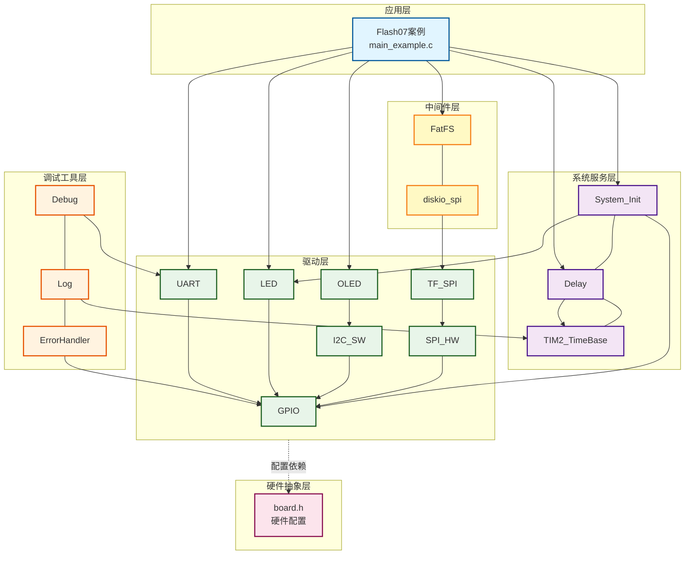
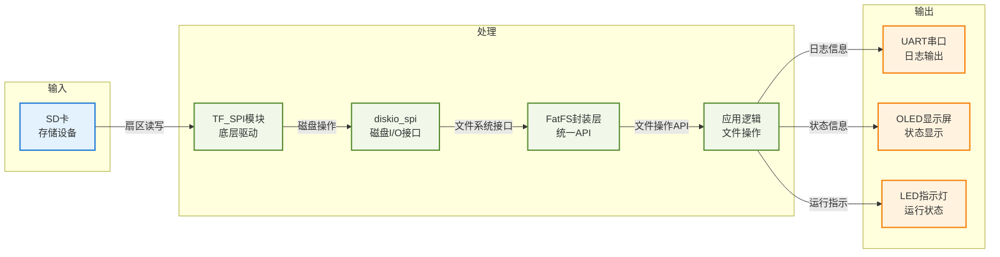
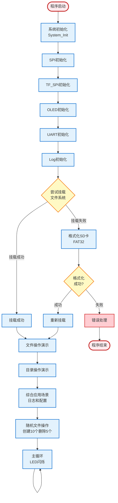

# Flash07 - TF卡集成FatFS文件系统示例（标准格式化）

## 📋 案例目的

- **核心目标**：演示FatFS文件系统的标准格式化方式，整个SD卡格式化为FAT32文件系统

### 核心功能

1. **标准格式化**：整个SD卡格式化为FAT32文件系统，无预留区域
2. **文件系统操作**：挂载、卸载、格式化、获取文件系统信息
3. **文件操作**：创建、读取、写入、删除、重命名文件
4. **目录操作**：创建目录、遍历目录、删除目录
5. **综合应用场景**：数据日志记录、配置文件存储
6. **随机文件操作**：按编号顺序创建10个文件，删除编号小的5个，保留编号大的5个，并遍历根目录验证

### 学习重点

- 理解FatFS文件系统的使用流程（格式化、挂载、文件操作）
- 掌握标准格式化的实现方法
- 学习文件操作、目录操作的基本方法
- 了解实际应用场景的实现（数据日志、配置文件）
- 学习批量文件操作的实现方法（创建、删除、遍历）

### 应用场景

适用于需要纯文件系统存储的应用，如数据日志记录、配置文件管理、固件存储、参数保存等场景。

**⚠️ 重要说明**：
- 本示例使用FatFS封装层（`fatfs_wrapper.h`），提供统一的错误码和接口
- 使用标准格式化策略，整个SD卡用于文件系统
- 需要修改`ffconf.h`启用`FF_USE_MKFS`
- 逻辑：尝试挂载`"0:"`，如果失败（无文件系统）则格式化整个SD卡

## 🔧 硬件要求

### 必需外设

- **LED1**：连接到 `PA1`（系统状态指示）

### 传感器/模块

#### TF卡（MicroSD卡）模块

| 引脚 | STM32连接 | 说明 |
|------|-----------|------|
| CS | PA11 | 片选信号（软件NSS模式） |
| SCK | PB13 | SPI2时钟信号 |
| MISO | PB14 | SPI2主入从出（数据接收） |
| MOSI | PB15 | SPI2主出从入（数据发送） |
| VCC | 3.3V | **⚠️ 重要：必须使用3.3V，不能使用5V！** |
| GND | GND | 电源地 |

**⚠️ 重要提示**：
- TF卡使用3.3V供电，使用5V会损坏卡
- CS引脚使用软件NSS模式，由软件控制拉低/拉高
- 确保电源稳定，避免写入过程中断电

#### OLED显示屏（软件I2C接口）

| 引脚 | STM32连接 | 说明 |
|------|-----------|------|
| SCL | PB8 | 软件I2C时钟线 |
| SDA | PB9 | 软件I2C数据线 |
| VCC | 3.3V | 电源 |
| GND | GND | 电源地 |

#### UART1（用于详细日志输出）

| 引脚 | STM32连接 | 说明 |
|------|-----------|------|
| TX | PA9 | UART1发送 |
| RX | PA10 | UART1接收 |
| 波特率 | 115200 | 串口通信波特率 |

## 📦 模块依赖

### 模块依赖关系图

### 模块列表

| 模块分类 | 模块名称 | 用途 | 依赖关系 |
|---------|---------|------|---------|
| 中间件层 | FatFS | 文件系统（封装层） | diskio_spi |
| 中间件层 | diskio_spi | SPI磁盘I/O接口 | TF_SPI |
| 驱动层 | TF_SPI | TF卡SPI驱动 | SPI |
| 驱动层 | SPI | SPI硬件驱动 | GPIO |
| 驱动层 | OLED | OLED显示驱动 | I2C_SW |
| 驱动层 | I2C_SW | 软件I2C驱动 | GPIO |
| 驱动层 | LED | LED驱动 | GPIO |
| 驱动层 | UART | UART驱动 | GPIO |
| 系统服务层 | System_Init | 系统初始化 | GPIO, LED |
| 系统服务层 | Delay | 延时服务 | TIM2_TimeBase |
| 调试工具层 | Debug | printf重定向 | UART |
| 调试工具层 | Log | 分级日志系统 | Debug |
| 调试工具层 | ErrorHandler | 错误处理框架 | - |

## 🔄 实现流程

### 整体逻辑

程序执行流程分为以下几个阶段：

1. **系统初始化阶段**：初始化系统、SPI、TF_SPI、OLED、UART、Debug、Log等模块
2. **文件系统初始化阶段**：尝试挂载`"0:"`，如果失败（无文件系统）则格式化整个SD卡，然后挂载文件系统
3. **文件操作演示阶段**：演示文件的创建、读写、删除、重命名等操作
4. **目录操作演示阶段**：演示目录的创建、遍历、删除等操作
5. **综合应用场景阶段**：演示数据日志记录和配置文件存储
6. **随机文件操作演示阶段**：按编号顺序创建10个文件（F0000000.TXT到F0000009.TXT），删除编号小的5个（F0000000到F0000004），保留编号大的5个（F0000005到F0000009），并遍历根目录验证
7. **主循环阶段**：LED闪烁指示系统运行

### 数据流向图

### 关键方法

1. **文件系统初始化**
   - 方法：先尝试挂载`"0:"`，如果失败则格式化后重新挂载
   - 使用场景：首次使用SD卡或SD卡未格式化时
   - 注意事项：格式化会清空SD卡所有数据，需要提示用户

2. **文件操作**
   - 方法：使用FatFS封装层API进行文件操作
   - 使用场景：读写文件、追加数据、文件管理
   - 注意事项：写入后调用`FatFS_FileSync()`确保数据写入磁盘

3. **目录操作**
   - 方法：使用FatFS封装层API进行目录操作
   - 使用场景：创建目录、遍历目录、文件管理
   - 注意事项：删除目录前需要先删除目录中的所有文件

4. **批量文件操作**
   - 方法：循环创建多个文件，按编号顺序命名，删除指定文件
   - 使用场景：批量文件管理、文件系统压力测试
   - 注意事项：文件名需符合8.3格式（FF_USE_LFN=0时），删除编号小的文件避免命名冲突

### 工作流程示意图

## 📚 关键函数说明

### 文件系统操作相关函数

- **`FatFS_Mount()`**：挂载文件系统
  - 在本案例中用于挂载SPI接口的文件系统（`"0:"`）
  - 如果文件系统不存在，返回`FATFS_ERROR_NO_FILESYSTEM`错误
  - 挂载成功后可以开始文件操作

- **`FatFS_Format()`**：格式化文件系统
  - 在本案例中用于标准格式化
  - 将整个SD卡格式化为FAT32文件系统
  - 格式化会清空SD卡所有数据

- **`FatFS_GetFreeSpace()`**：获取空闲空间
  - 在本案例中用于显示文件系统信息
  - 返回空闲簇数和总簇数
  - 可以计算空闲空间大小

### 文件操作相关函数

- **`FatFS_FileOpen()`**：打开文件
  - 在本案例中用于打开文件进行读写操作
  - 支持多种打开模式（FA_READ、FA_WRITE、FA_OPEN_ALWAYS等）
  - 追加写入时使用FA_WRITE | FA_OPEN_ALWAYS，然后定位到文件末尾

- **`FatFS_FileWrite()`**：写入文件
  - 在本案例中用于写入文件数据
  - 写入后需要调用`FatFS_FileSync()`确保数据写入磁盘

- **`FatFS_FileRead()`**：读取文件
  - 在本案例中用于读取文件内容
  - 读取的数据需要手动添加字符串结束符

- **`FatFS_FileSeek()`**：定位文件指针
  - 在本案例中用于定位到文件末尾进行追加写入
  - 使用`f_size()`获取文件大小，然后定位到文件末尾

- **`FatFS_FileSync()`**：同步文件
  - 在本案例中用于确保数据写入磁盘
  - 写入后必须调用，确保数据不丢失

- **`FatFS_FileDelete()`**：删除文件
  - 在本案例中用于删除文件
  - 删除前需要确保文件已关闭

- **`FatFS_FileRename()`**：重命名文件
  - 在本案例中用于重命名文件
  - 注意：在某些FatFS配置下可能不稳定，返回FATFS_ERROR_INVALID_NAME

### 目录操作相关函数

- **`FatFS_DirCreate()`**：创建目录
  - 在本案例中用于创建目录
  - 如果目录已存在，返回FATFS_ERROR_EXIST（可以忽略）

- **`FatFS_DirOpen()`**：打开目录
  - 在本案例中用于打开目录进行遍历
  - 打开根目录使用`"0:"`路径

- **`FatFS_DirRead()`**：读取目录项
  - 在本案例中用于遍历目录
  - 读取到空文件名（fname[0] == 0）表示目录遍历完成
  - 需要跳过"."和".."目录项

- **`FatFS_DirClose()`**：关闭目录
  - 在本案例中用于关闭打开的目录

- **`FatFS_DirDelete()`**：删除目录
  - 在本案例中用于删除目录
  - 删除前需要先删除目录中的所有文件

### 随机文件操作相关函数

- **`TestRandomFileOperations()`**：随机文件操作演示
  - 按编号顺序创建10个文件（F0000000.TXT到F0000009.TXT）
  - 每个文件写入随机内容（50-200字节）
  - 删除编号小的5个文件（F0000000到F0000004）
  - 保留编号大的5个文件（F0000005到F0000009）
  - 遍历根目录验证剩余文件

**详细函数实现和调用示例请参考**：`main_example.c` 中的代码

## ⚠️ 注意事项与重点

### ⚠️ 重要提示

1. **FatFS配置修改**
   - 需要修改`Middlewares/storage/fatfs/ffconf.h`：
     - `#define FF_USE_MKFS         1`（启用格式化功能）
   - 不需要启用`FF_MULTI_PARTITION`（标准格式化不需要多分区支持）

2. **格式化警告**
   - 格式化会清空SD卡所有数据，需要提示用户
   - 建议在格式化前备份重要数据
   - 格式化过程可能需要较长时间（取决于SD卡容量）
   - 格式化过程中LED会闪烁，表示程序正在运行

3. **文件路径格式**
   - 使用`"0:filename"`格式（挂载到`"0:"`）

4. **文件系统检测逻辑**
   - 尝试挂载`"0:"`
   - 如果返回`FATFS_ERROR_NO_FILESYSTEM`，则格式化整个SD卡
   - 格式化后重新挂载

5. **文件名格式限制**
   - 由于`FF_USE_LFN = 0`，只支持8.3格式文件名
   - 主文件名最多8个字符，扩展名最多3个字符
   - 文件名需使用大写字母（FatFS会自动转换）
   - 随机文件操作使用格式：`F0000000.TXT`（8.3格式）

6. **格式化进度提示**
   - 格式化过程中LED会闪烁（每50次写入闪烁一次）
   - 格式化大容量SD卡可能需要几分钟，请耐心等待
   - 如果LED长时间不闪烁，可能是格式化卡住

### 🔑 关键点

1. **文件同步**
   - 写入文件后必须调用`FatFS_FileSync()`确保数据写入磁盘
   - 频繁同步会影响性能，根据需要决定同步频率
   - 关闭文件前建议同步，确保数据不丢失

2. **错误处理**
   - 所有FatFS操作都要检查返回值
   - 使用`ErrorHandler_Handle()`处理错误
   - 根据错误码判断错误类型，采取相应措施

3. **内存管理**
   - 文件读写缓冲区要足够大
   - 目录遍历需要足够的栈空间

4. **追加写入实现**
   - 使用`FA_WRITE | FA_OPEN_ALWAYS`打开文件
   - 使用`f_size()`获取文件大小，然后使用`FatFS_FileSeek()`定位到文件末尾
   - 定位后再写入数据

5. **目录遍历优化**
   - 跳过"."和".."目录项
   - 检测重复文件名，避免无限循环
   - 设置最大遍历条目数限制

## 🔍 常见问题排查

### 1. 文件系统挂载失败

**可能原因**：
- SD卡未插入或损坏
- SD卡未格式化
- SPI通信失败
- TF_SPI初始化失败

**解决方法**：
1. 检查SD卡是否正确插入
2. 检查SPI和TF_SPI初始化是否成功
3. 检查硬件连接（CS、SCK、MISO、MOSI）
4. 检查SD卡是否损坏（尝试在其他设备上使用）
5. 查看串口日志，确认具体错误信息

### 2. 格式化失败

**可能原因**：
- SD卡写保护
- SD卡损坏
- 未启用FF_USE_MKFS

**解决方法**：
1. 检查SD卡写保护开关
2. 检查SD卡是否损坏
3. 检查`ffconf.h`配置（FF_USE_MKFS）
4. 查看串口日志，确认具体错误信息

### 3. 文件操作失败

**可能原因**：
- 文件路径错误
- 文件系统未挂载
- 磁盘空间不足
- 文件已打开或锁定
- 文件名不符合8.3格式（FF_USE_LFN=0时）

**解决方法**：
1. 检查文件路径格式（`"0:filename"`）
2. 检查文件系统是否已挂载
3. 检查磁盘空间（使用`FatFS_GetFreeSpace()`）
4. 确保文件已正确关闭
5. 检查文件名是否符合8.3格式（主文件名最多8字符，扩展名最多3字符）
6. 查看串口日志，确认具体错误信息

### 4. 随机文件操作失败

**可能原因**：
- 文件名格式不符合8.3格式
- 磁盘空间不足
- 文件创建失败

**解决方法**：
1. 检查文件名格式（使用8.3格式：主文件名8字符，扩展名3字符）
2. 检查磁盘空间是否足够
3. 查看串口日志，确认文件创建和删除的详细过程
4. 检查文件是否成功创建（通过遍历目录验证）

### 5. 重命名功能失败

**可能原因**：
- FatFS配置问题（FF_USE_LFN=0可能导致某些操作不稳定）
- 文件系统状态问题
- 文件还在使用中

**解决方法**：
1. 这是已知问题，在某些FatFS配置下重命名可能不稳定
2. 程序已处理重命名失败的情况，会优雅地跳过并继续执行
3. 如需重命名功能，可以考虑启用长文件名支持（FF_USE_LFN=1或2）

## 💡 扩展练习

### 循序渐进部分

1. **添加文件搜索功能**
   - 实现文件搜索功能（根据文件名查找文件）
   - 支持通配符匹配（如"*.txt"）
   - 在目录树中递归搜索

2. **实现文件复制功能**
   - 实现文件复制功能（从一个文件复制到另一个文件）
   - 支持大文件复制（分块读取和写入）
   - 显示复制进度

### 实际场景坑点部分

3. **处理文件系统满的情况**
   - 检测磁盘空间不足的情况
   - 实现文件删除策略（删除最旧的文件）
   - 处理写入失败的情况

4. **实现文件系统完整性检查**
   - 检测文件系统是否损坏
   - 实现文件系统修复功能
   - 处理异常断电后的恢复

5. **优化批量文件操作**
   - 实现文件创建失败时的重试机制
   - 优化文件删除顺序，避免碎片化
   - 实现文件操作的原子性（要么全部成功，要么全部回滚）

## 📖 相关文档

### 模块文档

- **FatFS模块**：`Middlewares/storage/fatfs/README.md`
- **TF_SPI模块**：`Drivers/flash/tf_spi.h`
- **SPI模块**：`Drivers/spi/spi_hw.h`
- **OLED模块**：`Drivers/display/oled_ssd1306.h`
- **UART模块**：`Drivers/uart/uart.h`

### 业务文档

- **主程序代码**：`main_example.c`
- **硬件配置**：`board.h`
- **模块配置**：`config.h`
- **项目规范**：`PROJECT_KEYWORDS.md`

## 📝 更新日志

### v1.1.0 (2024-01-01)
- 新增随机文件操作演示功能
- 按编号顺序创建10个文件（F0000000.TXT到F0000009.TXT）
- 删除编号小的5个文件，保留编号大的5个文件
- 遍历根目录验证剩余文件
- 修复文件名格式问题（使用8.3格式）
- 修复目录遍历重复文件名警告
- 改进追加写入功能（使用f_size定位到文件末尾）
- 添加格式化进度提示（LED闪烁）
- 修复g_fatfs_mounted未使用警告

### v1.0.0 (2024-01-01)
- 初始版本
- 实现标准格式化（整个SD卡格式化为FAT32）
- 实现文件操作演示（创建、读写、删除、重命名）
- 实现目录操作演示（创建、遍历、删除）
- 实现综合应用场景（数据日志、配置文件）
