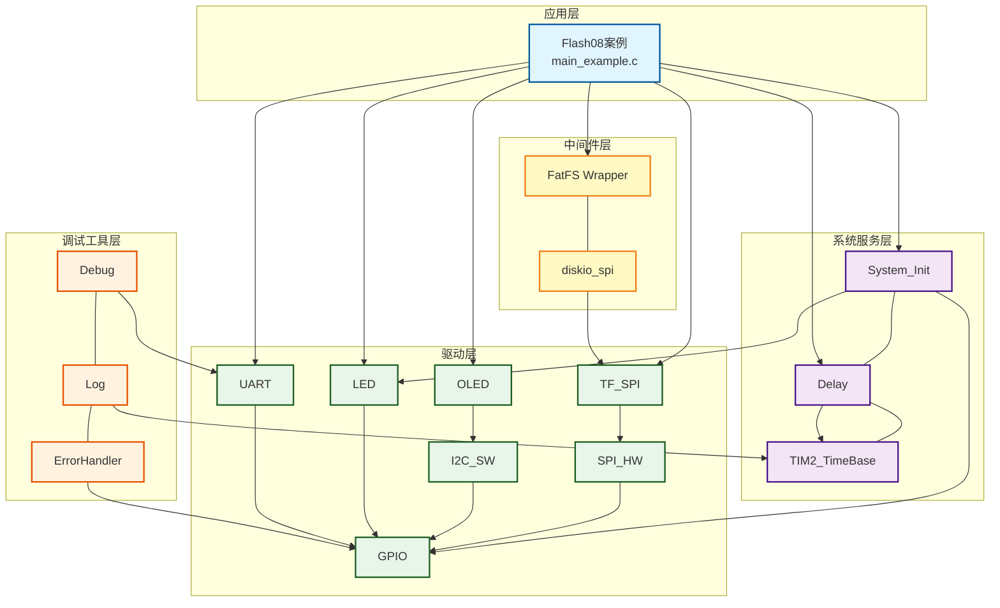
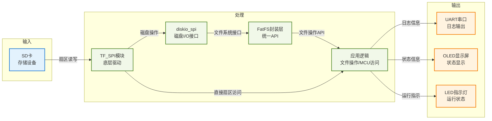

# Flash08 - TF卡集成FatFS文件系统示例（单分区方案）

## 📋 案例目的

- **核心目标**：演示FatFS文件系统的单分区方案，创建MBR分区表，实现MBR + 保留区 + STM32直接访问区 + FAT32单分区的混合存储方案

### 核心功能

1. **单分区格式化**：创建MBR分区表，包含一个FAT32分区（从扇区206848开始）
2. **混合存储方案**：
   - 扇区0：MBR分区表
   - 扇区1-2047：保留区（约1MB）
   - 扇区2048-206847：STM32直接访问区（100MB）
   - 扇区206848-结束：FAT32分区
3. **文件系统操作**：挂载、卸载、格式化、获取文件系统信息
4. **MCU直接访问**：演示预留区域的直接扇区访问（访问扇区2048-206847）
5. **文件操作**：创建、读取、写入、追加、重命名、删除文件
6. **目录操作**：创建目录、删除目录
7. **插拔卡检测**：支持SD卡热插拔检测与自动重新挂载
8. **MBR分区表清除**：程序结束前清除MBR分区表

### 学习重点

- 理解FatFS文件系统的单分区方案实现
- 掌握MBR分区表的创建方法
- 学习文件系统与MCU直接访问的混合使用
- 了解分区布局设计（MBR + 保留区 + MCU区 + FAT32分区）
- 学习插拔卡检测与自动恢复机制
- 理解扇区映射与分区缓存机制

### 应用场景

适用于需要文件系统存储且需要MCU直接访问部分扇区的应用，如：
- 固件存储（MCU直接访问区）
- 配置数据存储（MCU直接访问区）
- 用户数据存储（FAT32分区）
- 日志记录（FAT32分区）
- 需要热插拔支持的应用

**⚠️ 重要说明**：
- 本示例使用FatFS封装层（`fatfs_wrapper.h`），提供统一的错误码和接口
- 使用单分区方案，创建MBR分区表
- 需要修改`ffconf.h`启用`FF_MULTI_PARTITION`和`FF_USE_MKFS`
- 挂载路径：`"0:"`（自动映射到分区1）
- 文件操作使用相对路径（已挂载到`"0:"`）

## 🔧 硬件要求

### 必需外设

- **LED1**：连接到 `PA1`（系统状态指示）

### 传感器/模块

#### TF卡（MicroSD卡）模块

| 引脚 | STM32连接 | 说明 |
|------|-----------|------|
| CS | PA11 | 片选信号（软件NSS模式） |
| SCK | PB13 | SPI2时钟信号 |
| MISO | PB14 | SPI2主入从出（数据接收） |
| MOSI | PB15 | SPI2主出从入（数据发送） |
| VCC | 3.3V | **⚠️ 重要：必须使用3.3V，不能使用5V！** |
| GND | GND | 电源地 |

**⚠️ 重要提示**：
- TF卡使用3.3V供电，使用5V会损坏卡
- CS引脚使用软件NSS模式，由软件控制拉低/拉高
- 确保电源稳定，避免写入过程中断电
- MISO引脚（PB14）需要上拉电阻（10k-50kΩ）

#### OLED显示屏（软件I2C接口）

| 引脚 | STM32连接 | 说明 |
|------|-----------|------|
| SCL | PB8 | 软件I2C时钟线 |
| SDA | PB9 | 软件I2C数据线 |
| VCC | 3.3V | 电源 |
| GND | GND | 电源地 |

#### UART1（用于详细日志输出）

| 引脚 | STM32连接 | 说明 |
|------|-----------|------|
| TX | PA9 | UART1发送 |
| RX | PA10 | UART1接收 |
| 波特率 | 115200 | 串口通信波特率 |

## 📦 模块依赖

### 模块依赖关系图

### 模块列表

| 模块分类 | 模块名称 | 用途 | 依赖关系 |
|---------|---------|------|---------|
| 中间件层 | FatFS Wrapper | 文件系统封装层 | diskio_spi |
| 中间件层 | diskio_spi | SPI磁盘I/O接口 | TF_SPI |
| 驱动层 | TF_SPI | TF卡SPI驱动 | SPI |
| 驱动层 | SPI_HW | SPI硬件驱动 | GPIO |
| 驱动层 | OLED | OLED显示驱动 | I2C_SW |
| 驱动层 | I2C_SW | 软件I2C驱动 | GPIO |
| 驱动层 | LED | LED驱动 | GPIO |
| 驱动层 | UART | UART驱动 | GPIO |
| 系统服务层 | System_Init | 系统初始化 | GPIO, LED |
| 系统服务层 | Delay | 延时服务 | TIM2_TimeBase |
| 调试工具层 | Debug | printf重定向 | UART |
| 调试工具层 | Log | 分级日志系统 | Debug |
| 调试工具层 | ErrorHandler | 错误处理框架 | - |

## 🔄 实现流程

### 整体逻辑

程序执行流程分为以下几个阶段：

1. **系统初始化阶段**：初始化系统、SPI、TF_SPI、OLED、UART、Debug、Log等模块
2. **SD卡检测阶段**：检测SD卡是否存在，检查SD卡是否满足使用要求
3. **文件系统初始化阶段**：尝试挂载`"0:"`，如果失败（无文件系统）则创建MBR分区表并格式化FAT32分区，然后挂载文件系统
4. **测试环节阶段**：
   - 文件夹测试（创建、重复创建处理）
   - 文件测试（创建、覆盖、追加、读取）
   - 重命名测试
   - 删除测试（文件、文件夹）
   - STM32直接操作区边界测试（开始位置、结束位置）
5. **循环运行阶段**：运行300次循环（约30秒），测试插拔卡检测与自动重新挂载
6. **倒计时阶段**：倒计时5秒
7. **清除分区表阶段**：清除MBR分区表
8. **程序结束阶段**：LED闪烁提示，进入死循环

### 数据流向图

### 工作流程示意图

```mermaid
%%{init: {'flowchart': {'curve': 'basis'}}}%%
flowchart TD
    START([程序启动]) --> SYS_INIT[系统初始化<br/>System_Init]
    SYS_INIT --> UART_INIT[UART初始化]
    UART_INIT --> DEBUG_INIT[Debug初始化]
    DEBUG_INIT --> LOG_INIT[Log初始化]
    LOG_INIT --> LED_INIT[LED初始化]
    LED_INIT --> I2C_INIT[软件I2C初始化]
    I2C_INIT --> OLED_INIT[OLED初始化]
    OLED_INIT --> SPI_INIT[SPI初始化]
    SPI_INIT --> SD_CHECK{检测SD卡}
    
    SD_CHECK -->|未插入| WAIT_SD[等待SD卡插入]
    WAIT_SD --> SD_CHECK
    SD_CHECK -->|已插入| SD_USABLE{检查SD卡<br/>是否可用}
    
    SD_USABLE -->|不可用| WAIT_CHANGE[等待更换SD卡]
    WAIT_CHANGE --> SD_CHECK
    SD_USABLE -->|可用| TRY_MOUNT{尝试挂载<br/>文件系统}
    
    TRY_MOUNT -->|挂载成功| MOUNT_OK[挂载成功]
    TRY_MOUNT -->|挂载失败| CHECK_FORMAT{检查是否需要<br/>格式化}
    
    CHECK_FORMAT -->|需要格式化| CREATE_MBR[创建MBR分区表]
    CREATE_MBR --> FORMAT_FAT32[格式化FAT32分区]
    FORMAT_FAT32 --> MOUNT_AFTER_FORMAT[重新挂载]
    MOUNT_AFTER_FORMAT --> MOUNT_OK
    
    MOUNT_OK --> TEST_DIR[文件夹测试]
    TEST_DIR --> TEST_FILE[文件测试]
    TEST_FILE --> TEST_RENAME[重命名测试]
    TEST_RENAME --> TEST_DELETE[删除测试]
    TEST_DELETE --> TEST_MCU[STM32直接操作区<br/>边界测试]
    
    TEST_MCU --> LOOP_START[进入循环<br/>300次]
    LOOP_START --> LOOP_CHECK{检查SD卡}
    LOOP_CHECK -->|已拔出| HANDLE_REMOVAL[处理SD卡拔出]
    HANDLE_REMOVAL --> WAIT_REINSERT[等待重新插入]
    WAIT_REINSERT --> HANDLE_REMOVAL
    LOOP_CHECK -->|已插入| LOOP_MOUNT{检查挂载}
    LOOP_MOUNT -->|未挂载| LOOP_REMOUNT[重新挂载]
    LOOP_REMOUNT --> LOOP_COUNT{循环计数}
    LOOP_MOUNT -->|已挂载| LOOP_COUNT
    LOOP_COUNT -->|未完成| LOOP_CHECK
    LOOP_COUNT -->|已完成| COUNTDOWN[倒计时5秒]
    
    COUNTDOWN --> CLEAR_MBR[清除MBR分区表]
    CLEAR_MBR --> END([程序结束])
    
    %% 样式
    classDef startEnd fill:#ffebee,stroke:#c62828,stroke-width:3px
    classDef process fill:#e3f2fd,stroke:#1976d2,stroke-width:2px
    classDef decision fill:#fff9c4,stroke:#f57f17,stroke-width:2px
    classDef test fill:#e8f5e9,stroke:#2e7d32,stroke-width:2px
    
    class START,END startEnd
    class SYS_INIT,UART_INIT,DEBUG_INIT,LOG_INIT,LED_INIT,I2C_INIT,OLED_INIT,SPI_INIT,WAIT_SD,WAIT_CHANGE,CREATE_MBR,FORMAT_FAT32,MOUNT_AFTER_FORMAT,MOUNT_OK,HANDLE_REMOVAL,WAIT_REINSERT,LOOP_REMOUNT,COUNTDOWN,CLEAR_MBR process
    class SD_CHECK,SD_USABLE,TRY_MOUNT,CHECK_FORMAT,LOOP_CHECK,LOOP_MOUNT,LOOP_COUNT decision
    class TEST_DIR,TEST_FILE,TEST_RENAME,TEST_DELETE,TEST_MCU,LOOP_START test
```

### 关键方法

1. **单分区格式化**
   - 方法：使用`CreateMBRPartition()`创建MBR分区表，然后使用`FormatFAT32Partition()`在分区1上创建文件系统
   - 分区布局：
     - 扇区0：MBR分区表
     - 扇区1-2047：保留区（约1MB）
     - 扇区2048-206847：STM32直接访问区（100MB）
     - 扇区206848-结束：FAT32分区（分区1）
   - 需要启用`FF_MULTI_PARTITION`和`FF_USE_MKFS`
   - 注意事项：MBR分区表位于扇区0，必须保护，不能覆盖

2. **文件系统初始化**
   - 方法：先尝试挂载`"0:"`，如果失败（`FATFS_ERROR_NO_FILESYSTEM`）则创建MBR分区表并格式化FAT32分区，然后重新挂载
   - 使用场景：首次使用SD卡或SD卡未格式化时
   - 注意事项：格式化会清空SD卡所有数据，需要提示用户

3. **MCU直接访问**
   - 方法：使用`TF_SPI_ReadBlock()`和`TF_SPI_WriteBlock()`直接访问STM32直接访问区的扇区
   - 使用场景：需要存储固件、配置数据等，不通过文件系统
   - 访问范围：扇区2048-206847（100MB）
   - 注意事项：确保不访问扇区0（MBR分区表）和扇区206848之后的区域（FAT32分区）

4. **插拔卡检测**
   - 方法：使用`CheckSDCardRemoved()`检测SD卡是否拔出，使用`HandleSDCardRemoval()`处理拔卡情况
   - 检测机制：通过`TF_SPI_SendStatus()`发送CMD13检查SD卡状态
   - 恢复机制：等待SD卡重新插入，重新初始化并挂载文件系统
   - 注意事项：拔卡后需要卸载文件系统，重新插入后需要重新初始化TF_SPI模块

5. **文件操作**
   - 方法：使用FatFS封装层API进行文件操作
   - 使用场景：读写文件、追加数据、文件管理
   - 注意事项：使用相对路径（已挂载到`"0:"`），写入后调用`FatFS_FileSync()`确保数据写入磁盘

## 📚 关键函数说明

### 分区格式化相关函数

- **`CreateMBRPartition()`**：创建MBR分区表
  - 在本案例中用于创建单分区MBR分区表
  - 直接读取/写入物理扇区0（MBR），不使用`disk_read`/`disk_write`避免扇区映射
  - 创建分区1：FAT32分区，从扇区206848开始
  - 设置MBR签名（0x55AA）

- **`FormatFAT32Partition()`**：格式化FAT32分区
  - 在本案例中用于在分区1上创建FAT32文件系统
  - 使用`f_mkfs("0:1:", ...)`格式化分区1
  - 格式化前清除分区缓存，格式化后设置分区缓存
  - 格式化后恢复MBR中的正确分区扇区数（`f_mkfs`可能会修改MBR）

- **`FormatPartition()`**：格式化分区（单分区方案）
  - 在本案例中用于执行完整的格式化流程
  - 先创建MBR分区表，再格式化FAT32分区

- **`ClearMBRPartitionTable()`**：清除MBR分区表
  - 在本案例中用于程序结束前清除MBR分区表
  - 清空分区表数据（保留MBR签名）
  - 检查SD卡状态，如果SD卡不可用则跳过清除操作

### 文件系统操作相关函数

- **`MountFileSystem()`**：挂载文件系统并处理错误
  - 在本案例中用于挂载分区1（`"0:"`）
  - 如果文件系统不存在，自动执行格式化
  - 挂载成功后可以开始文件操作

- **`FatFS_Mount()`**：挂载文件系统
  - 在本案例中用于挂载分区1（`"0:"`）
  - 如果文件系统不存在，返回`FATFS_ERROR_NO_FILESYSTEM`错误

- **`FatFS_GetFreeSpace()`**：获取空闲空间
  - 在本案例中用于显示文件系统信息
  - 返回空闲簇数和总簇数
  - 可以计算空闲空间大小

### MCU直接访问相关函数

- **`TF_SPI_ReadBlock()`**：读取扇区
  - 在本案例中用于读取STM32直接访问区的扇区
  - 直接访问，不通过文件系统
  - 访问范围：扇区2048-206847

- **`TF_SPI_WriteBlock()`**：写入扇区
  - 在本案例中用于写入STM32直接访问区的扇区
  - 直接访问，不通过文件系统
  - 访问范围：扇区2048-206847

- **`TestMCUAreaBoundary()`**：STM32直接操作区边界测试
  - 在本案例中用于测试MCU直接访问区的边界
  - 测试开始位置写入1MB（扇区2048-4095）
  - 测试结束位置写入1MB（扇区204800-206847）
  - 验证数据正确性

### 文件操作相关函数

- **`FatFS_FileOpen()`**：打开文件
  - 在本案例中用于打开文件进行读写操作
  - 支持多种打开模式（FA_READ、FA_WRITE、FA_CREATE_ALWAYS、FA_OPEN_ALWAYS等）
  - 追加写入时使用FA_WRITE | FA_OPEN_ALWAYS，然后定位到文件末尾

- **`FatFS_FileWrite()`**：写入文件
  - 在本案例中用于写入文件数据
  - 写入后需要调用`FatFS_FileSync()`确保数据写入磁盘

- **`FatFS_FileRead()`**：读取文件
  - 在本案例中用于读取文件内容
  - 读取的数据需要手动添加字符串结束符

- **`FatFS_FileSeek()`**：定位文件指针
  - 在本案例中用于定位到文件末尾进行追加写入
  - 使用`f_size()`获取文件大小，然后定位到文件末尾

- **`FatFS_FileSync()`**：同步文件
  - 在本案例中用于确保数据写入磁盘
  - 写入后必须调用，确保数据不丢失

- **`FatFS_FileDelete()`**：删除文件
  - 在本案例中用于删除文件
  - 删除前需要确保文件已关闭

- **`FatFS_FileRename()`**：重命名文件
  - 在本案例中用于重命名文件
  - 重命名成功后验证新文件存在

### 目录操作相关函数

- **`FatFS_DirCreate()`**：创建目录
  - 在本案例中用于创建目录
  - 如果目录已存在，返回FATFS_ERROR_EXIST（可以忽略）

- **`FatFS_DirDelete()`**：删除目录
  - 在本案例中用于删除目录
  - 删除前需要确保目录为空

### 插拔卡检测相关函数

- **`CheckSDCardPresent()`**：检测SD卡是否存在
  - 在本案例中用于初始化时检测SD卡
  - 尝试初始化SD卡，如果成功则说明SD卡存在

- **`CheckSDCardUsable()`**：检查SD卡是否满足使用要求
  - 在本案例中用于检查SD卡容量和状态
  - 检查容量是否足够（至少200MB）
  - 检查SD卡状态（CMD13）

- **`CheckSDCardRemoved()`**：检测SD卡是否已拔出
  - 在本案例中用于循环中检测SD卡拔出
  - 使用`TF_SPI_SendStatus()`检查SD卡状态

- **`HandleSDCardRemoval()`**：处理SD卡拔卡情况
  - 在本案例中用于处理SD卡拔出后的恢复
  - 卸载文件系统，反初始化TF_SPI
  - 等待SD卡重新插入，重新初始化并挂载

**详细函数实现和调用示例请参考**：`main_example.c` 中的代码

## ⚠️ 注意事项与重点

### ⚠️ 重要提示

1. **FatFS配置修改**
   - 需要修改`Middlewares/storage/fatfs/ffconf.h`：
     - `#define FF_MULTI_PARTITION  1`（启用多分区支持）
     - `#define FF_USE_MKFS         1`（启用格式化功能）

2. **分区布局配置**
   - 分区布局在`config.h`中配置：
     - `FATFS_RESERVED_AREA_SECTORS = 2047`（保留区扇区数）
     - `FATFS_MCU_DIRECT_AREA_MB = 100`（STM32直接访问区大小，MB）
     - `FATFS_PARTITION_START_SECTOR = 206848`（FAT32分区起始扇区）
   - 计算公式：`FATFS_PARTITION_START_SECTOR = 1 + FATFS_RESERVED_AREA_SECTORS + (FATFS_MCU_DIRECT_AREA_MB * 1024 * 1024 / 512)`

3. **格式化警告**
   - 格式化会清空SD卡所有数据，需要提示用户
   - 建议在格式化前备份重要数据
   - 格式化过程可能需要较长时间（取决于SD卡容量）
   - 格式化过程中LED会闪烁，表示程序正在运行

4. **文件路径格式**
   - 挂载路径：`"0:"`（自动映射到分区1）
   - 文件操作：使用相对路径（如`"test.txt"`），因为已挂载到`"0:"`

5. **MCU直接访问注意事项**
   - STM32直接访问区与FAT32分区必须隔离，避免数据冲突
   - 使用TF_SPI模块直接访问STM32直接访问区，不通过文件系统
   - **⚠️ 重要：分区表保护**
     - MBR分区表位于扇区0，包含分区信息，**绝对不能覆盖或损坏**
     - MCU直接访问时，必须从扇区2048开始（跳过MBR和保留区），避免覆盖MBR分区表
     - 如果分区表损坏，整个SD卡的分区信息将丢失，需要重新创建分区表
   - 确保访问的扇区在STM32直接访问区范围内（扇区2048-206847）

6. **插拔卡检测**
   - 支持SD卡热插拔检测
   - 拔卡后自动卸载文件系统，重新插入后自动重新挂载
   - 如果SD卡不满足使用要求，会等待更换

### 🔑 关键点

1. **分区表保护（最重要）**
   - MBR分区表位于扇区0，包含所有分区信息
   - **绝对禁止**通过MCU直接访问覆盖或修改扇区0
   - MCU直接访问时，必须从扇区2048开始（跳过MBR和保留区）
   - 建议在代码中添加扇区地址检查，确保不会访问扇区0
   - 如果分区表损坏，需要重新创建分区表并格式化，所有数据将丢失

2. **扇区映射机制**
   - FatFS的逻辑扇区0映射到物理扇区`FATFS_PARTITION_START_SECTOR`（206848）
   - `disk_read`/`disk_write`会自动进行扇区映射
   - 直接访问MBR（扇区0）时，必须使用`TF_SPI_ReadBlock(0, ...)`和`TF_SPI_WriteBlock(0, ...)`，不能使用`disk_read`/`disk_write`

3. **分区缓存机制**
   - `disk_ioctl(GET_SECTOR_COUNT)`会从MBR读取分区扇区数
   - 使用缓存机制避免频繁读取MBR
   - 格式化前清除缓存，格式化后设置缓存

4. **文件同步**
   - 写入文件后必须调用`FatFS_FileSync()`确保数据写入磁盘
   - 频繁同步会影响性能，根据需要决定同步频率
   - 关闭文件前建议同步，确保数据不丢失

5. **错误处理**
   - 所有FatFS操作都要检查返回值
   - 使用`ErrorHandler_Handle()`处理错误
   - 根据错误码判断错误类型，采取相应措施

6. **内存管理**
   - 文件读写缓冲区要足够大
   - 格式化工作缓冲区使用静态变量避免栈溢出

## 🔍 常见问题排查

### 1. 文件系统挂载失败

**可能原因**：
- SD卡未插入或损坏
- 分区未格式化
- SPI通信失败
- TF_SPI初始化失败
- 未启用FF_MULTI_PARTITION
- MBR分区表损坏

**解决方法**：
1. 检查SD卡是否正确插入
2. 检查SPI和TF_SPI初始化是否成功
3. 检查硬件连接（CS、SCK、MISO、MOSI）
4. 检查`ffconf.h`配置（FF_MULTI_PARTITION、FF_USE_MKFS）
5. 检查MBR分区表是否正确（使用`TF_SPI_ReadBlock(0, ...)`读取扇区0）
6. 查看串口日志，确认具体错误信息

### 2. MBR分区表创建失败

**可能原因**：
- SD卡写保护
- SD卡损坏
- 未启用FF_MULTI_PARTITION
- 未启用FF_USE_MKFS
- SPI通信失败

**解决方法**：
1. 检查SD卡写保护开关
2. 检查SD卡是否损坏
3. 检查`ffconf.h`配置（FF_MULTI_PARTITION、FF_USE_MKFS）
4. 检查SPI通信是否正常
5. 查看串口日志，确认具体错误信息

### 3. MCU直接访问失败

**可能原因**：
- 扇区地址超出STM32直接访问区范围
- 访问了扇区0（MBR分区表）
- 访问了FAT32分区区域
- TF_SPI模块未初始化

**解决方法**：
1. 检查扇区地址是否在STM32直接访问区范围内（扇区2048-206847）
2. **⚠️ 重要**：确保不会访问扇区0（MBR分区表）
3. 检查TF_SPI模块是否已初始化
4. 查看串口日志，确认具体错误信息

### 4. 文件操作失败

**可能原因**：
- 文件路径错误（未使用相对路径）
- 文件系统未挂载
- 磁盘空间不足
- 文件已打开或锁定

**解决方法**：
1. 检查文件路径格式（使用相对路径，因为已挂载到`"0:"`）
2. 检查文件系统是否已挂载
3. 检查磁盘空间（使用`FatFS_GetFreeSpace()`）
4. 确保文件已正确关闭
5. 查看串口日志，确认具体错误信息

### 5. 分区表损坏

**可能原因**：
- MCU直接访问时意外覆盖了扇区0
- SD卡异常断电导致分区表损坏
- 硬件故障

**解决方法**：
1. **预防措施**：在代码中添加扇区地址检查，确保不会访问扇区0
2. **恢复措施**：重新创建分区表并格式化，所有数据将丢失
3. 检查硬件连接和电源稳定性
4. 查看串口日志，确认具体错误信息

### 6. 插拔卡检测失败

**可能原因**：
- SD卡状态检查超时
- TF_SPI模块状态异常
- 重新挂载失败

**解决方法**：
1. 检查SD卡是否正确插入
2. 检查TF_SPI模块状态
3. 检查文件系统挂载状态
4. 查看串口日志，确认具体错误信息

## 💡 扩展练习

### 循序渐进部分

1. **修改分区布局**
   - 尝试修改保留区大小
   - 尝试修改STM32直接访问区大小
   - 观察不同布局对文件系统的影响

2. **实现分区信息查询**
   - 实现查询MBR分区表信息的功能
   - 显示每个分区的起始扇区、大小等信息
   - 验证分区信息是否正确

3. **优化文件操作**
   - 实现文件追加写入功能
   - 实现文件读取验证功能
   - 实现文件大小查询功能

### 实际场景坑点部分

4. **处理分区表损坏的情况**
   - 检测分区表是否损坏
   - 实现分区表修复功能
   - 处理异常断电后的恢复

5. **优化MCU直接访问性能**
   - 使用多扇区读写优化性能
   - 实现扇区缓存机制
   - 处理并发访问的情况

6. **实现分区表保护机制**
   - 在MCU直接访问函数中添加扇区地址检查
   - 实现分区表备份和恢复功能
   - 处理分区表损坏时的自动修复

7. **优化插拔卡检测**
   - 实现更快的插拔卡检测
   - 优化重新挂载流程
   - 处理多次插拔的情况

## 📖 相关文档

### 模块文档

- **FatFS模块**：`Middlewares/storage/fatfs/README.md`
- **TF_SPI模块**：`Drivers/flash/tf_spi.h`
- **SPI模块**：`Drivers/spi/spi_hw.h`
- **OLED模块**：`Drivers/display/oled_ssd1306.h`
- **UART模块**：`Drivers/uart/uart.h`

### 业务文档

- **主程序代码**：`main_example.c`
- **硬件配置**：`BSP/board.h`
- **模块配置**：`config.h`
- **项目规范**：`PROJECT_KEYWORDS.md`
