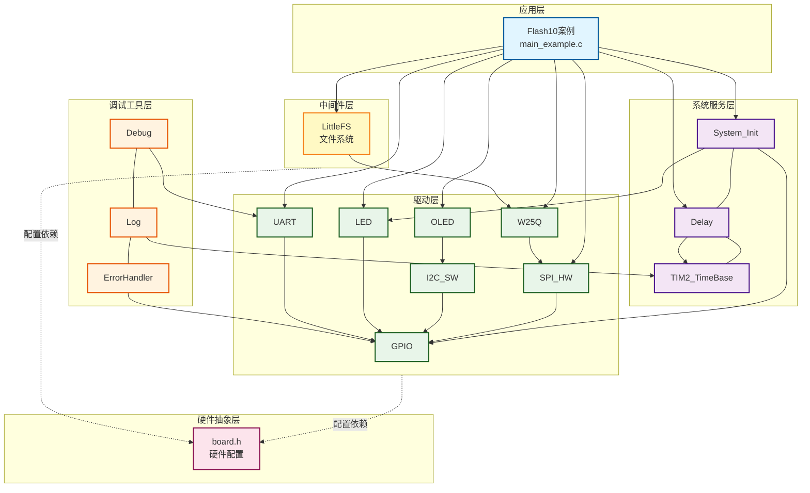
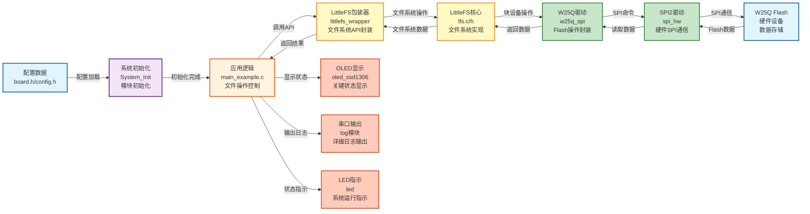

# Flash10 - LittleFS文件系统W25Q读写测试案例

## 📋 案例目的

- **核心目标**：演示如何使用LittleFS文件系统在W25Q SPI Flash上进行基本的文件读写操作，包括文件创建、写入、读取、验证、目录操作和文件系统信息查询

### 核心功能

1. **文件系统初始化**：初始化LittleFS文件系统，支持挂载和格式化操作
2. **文件操作**：
   - **文件创建与写入**：创建文件并写入数据，使用文件同步确保数据落盘
   - **文件读取与验证**：读取文件内容并与写入数据对比验证
   - **文件存在性检查**：使用`lfs_stat`检查文件是否存在
3. **目录操作**：
   - **目录创建**：创建测试目录
   - **目录列表**：列出根目录下的所有文件和目录
4. **文件系统信息**：查询文件系统的总空间和空闲空间

### 学习重点

- 理解LittleFS文件系统的基本特性和操作流程
- 掌握LittleFS文件操作API的使用方法（打开、写入、读取、关闭、同步）
- 学习目录操作API的使用方法（创建、列表）
- 了解文件系统挂载和格式化的时机和条件
- 掌握文件句柄的正确使用方法（清零、独立缓存缓冲区）
- 学习文件系统信息查询方法

### 应用场景

适用于需要在外部Flash上实现文件系统功能的应用，如数据日志存储、配置文件管理、固件更新、参数保存等场景。

## 🔧 硬件要求

### 必需外设

- **LED1**：连接到 `PA1`（系统状态指示）

### 传感器/模块

#### W25Q SPI Flash模块

| 引脚 | STM32连接 | 说明 |
|------|-----------|------|
| CS | PA11 | 片选信号（软件NSS模式） |
| SCK | PB13 | SPI2时钟信号 |
| MISO | PB14 | SPI2主入从出（数据接收） |
| MOSI | PB15 | SPI2主出从入（数据发送） |
| VCC | 3.3V | **⚠️ 重要：必须使用3.3V，不能使用5V！** |
| GND | GND | 电源地 |

**⚠️ 重要提示**：
- W25Q系列Flash使用3.3V供电，使用5V会损坏芯片
- CS引脚使用软件NSS模式，由软件控制拉低/拉高
- 确保电源稳定，避免写入过程中断电

#### OLED显示屏（软件I2C接口）

| 引脚 | STM32连接 | 说明 |
|------|-----------|------|
| SCL | PB8 | 软件I2C时钟线 |
| SDA | PB9 | 软件I2C数据线 |
| VCC | 3.3V | 电源 |
| GND | GND | 电源地 |

#### UART1（用于详细日志输出）

| 引脚 | STM32连接 | 说明 |
|------|-----------|------|
| TX | PA9 | UART1发送 |
| RX | PA10 | UART1接收 |
| 波特率 | 115200 | 串口通信波特率 |

**连接说明**：将UART1连接到USB转串口模块，用于查看详细日志输出。

## 📦 模块依赖

### 模块依赖关系图

### 模块列表

本案例使用以下模块：

- **`littlefs_wrapper`**：LittleFS文件系统包装器模块（核心模块）
- **`w25q_spi`**：W25Q SPI Flash驱动模块（LittleFS底层存储）
- **`spi_hw`**：硬件SPI驱动模块（W25Q使用SPI2）
- **`gpio`**：GPIO驱动模块（SPI、I2C、UART、LED依赖）
- **`led`**：LED驱动模块（状态指示）
- **`oled_ssd1306`**：OLED显示模块（关键信息显示）
- **`uart`**：UART驱动模块（详细日志输出）
- **`i2c_sw`**：软件I2C驱动模块（OLED使用）
- **`delay`**：延时模块（非阻塞延时）
- **`error_handler`**：错误处理模块（统一错误处理）
- **`log`**：日志模块（分级日志输出）

## 🔄 实现流程

### 整体逻辑

本案例通过LittleFS文件系统在W25Q Flash上实现文件操作功能。程序执行分为以下几个阶段：

1. **系统初始化阶段**：
   - 调用`System_Init()`初始化系统基础模块（GPIO、LED、delay、TIM2）
   - 初始化UART1用于串口日志输出
   - 初始化Debug和Log模块
   - 初始化软件I2C和OLED用于状态显示
   - 初始化SPI2和W25Q模块

2. **文件系统初始化阶段**：
   - 初始化LittleFS文件系统
   - 尝试挂载文件系统
   - 如果挂载失败或启用强制格式化模式，则格式化文件系统
   - 重新挂载文件系统

3. **文件系统信息查询阶段**：
   - 查询文件系统的总空间和空闲空间
   - 在OLED和UART上显示文件系统信息

4. **文件操作测试阶段**：
   - **文件创建与写入**：创建文件`test.txt`，写入测试数据"Hello LittleFS!"
   - **文件同步**：调用`LittleFS_FileSync()`确保数据落盘
   - **文件存在性检查**：使用`lfs_stat`检查文件是否存在
   - **文件读取**：读取文件内容
   - **数据验证**：对比写入和读取的数据

5. **目录操作测试阶段**：
   - **目录创建**：创建测试目录`testdir`
   - **目录列表**：列出根目录下的所有文件和目录

6. **主循环阶段**：
   - LED闪烁指示系统运行
   - OLED显示运行状态和循环计数

### 数据流向图

### 关键方法

1. **文件系统挂载与格式化**：
   - 首次使用或文件系统损坏时需要格式化
   - 支持强制格式化模式（`CONFIG_LITTLEFS_FORCE_FORMAT`）
   - 使用场景：初始化时自动检测，挂载失败时自动格式化
   - 注意事项：格式化会清除所有数据，仅在必要时使用

2. **文件句柄清零**：
   - 每次使用文件句柄前必须清零（`memset(&file, 0, sizeof(file))`）
   - 使用场景：所有文件操作前
   - 注意事项：避免脏数据导致文件操作失败

3. **文件同步机制**：
   - 写入后必须调用`LittleFS_FileSync()`确保数据落盘
   - 使用场景：所有写入操作后
   - 注意事项：未同步的数据可能在断电后丢失

4. **文件路径格式**：
   - 使用相对路径（如`"test.txt"`），不要使用绝对路径（如`"/test.txt"`）
   - 使用场景：所有文件操作
   - 注意事项：路径格式错误会导致文件操作失败（返回`LFS_ERR_NOENT`）

5. **文件存在性检查**：
   - 使用`lfs_stat`检查文件是否存在
   - 使用场景：读取文件前检查文件是否存在
   - 注意事项：文件不存在时返回`LFS_ERR_NOENT`

6. **目录操作**：
   - 使用`LittleFS_DirOpen`打开目录（使用`"."`表示当前目录）
   - 使用`LittleFS_DirRead`循环读取目录项
   - 使用场景：列出目录内容、遍历文件系统
   - 注意事项：目录读取完成后必须关闭

### 工作流程示意图

```mermaid
flowchart TD
    START([程序启动]) --> SYS_INIT[系统初始化<br/>System_Init]
    SYS_INIT --> UART_INIT[UART初始化<br/>UART_Init]
    UART_INIT --> DEBUG_INIT[Debug初始化<br/>Debug_Init]
    DEBUG_INIT --> LOG_INIT[Log初始化<br/>Log_Init]
    LOG_INIT --> LED_INIT[LED初始化<br/>LED_Init]
    LED_INIT --> I2C_INIT[软件I2C初始化<br/>I2C_SW_Init]
    I2C_INIT --> OLED_INIT[OLED初始化<br/>OLED_Init]
    OLED_INIT --> SPI_INIT[SPI2初始化<br/>SPI_HW_Init]
    SPI_INIT --> W25Q_INIT[W25Q初始化<br/>W25Q_Init]
    W25Q_INIT --> LITTLEFS_INIT[LittleFS初始化<br/>LittleFS_Init]
    
    LITTLEFS_INIT --> MOUNT[尝试挂载文件系统<br/>LittleFS_Mount]
    MOUNT --> MOUNT_CHECK{挂载结果}
    MOUNT_CHECK -->|成功| FS_INFO[显示文件系统信息<br/>总空间和空闲空间]
    MOUNT_CHECK -->|失败| FORMAT_CHECK{强制格式化模式}
    
    FORMAT_CHECK -->|是| FORMAT[格式化文件系统<br/>LittleFS_Format]
    FORMAT_CHECK -->|否| FORMAT
    FORMAT --> REMOUNT[重新挂载文件系统<br/>LittleFS_Mount]
    REMOUNT --> FS_INFO
    
    FS_INFO --> FILE_CREATE[创建文件<br/>test.txt]
    FILE_CREATE --> FILE_WRITE[写入数据<br/>Hello LittleFS!]
    FILE_WRITE --> FILE_SYNC[文件同步<br/>LittleFS_FileSync]
    FILE_SYNC --> FILE_CLOSE_WRITE[关闭文件]
    
    FILE_CLOSE_WRITE --> FILE_STAT[检查文件存在性<br/>lfs_stat]
    FILE_STAT --> FILE_OPEN_READ[打开文件读取<br/>LittleFS_FileOpen]
    FILE_OPEN_READ --> FILE_READ[读取文件内容]
    FILE_READ --> FILE_VERIFY[验证数据一致性]
    FILE_VERIFY --> FILE_CLOSE_READ[关闭文件]
    
    FILE_CLOSE_READ --> DIR_CREATE[创建目录<br/>testdir]
    DIR_CREATE --> DIR_OPEN[打开根目录<br/>LittleFS_DirOpen]
    DIR_OPEN --> DIR_READ[读取目录项<br/>循环读取]
    DIR_READ --> DIR_CLOSE[关闭目录<br/>LittleFS_DirClose]
    
    DIR_CLOSE --> MAIN_LOOP[主循环<br/>LED闪烁指示]
    MAIN_LOOP --> MAIN_LOOP
    
    %% 样式
    style START fill:#e1f5ff,stroke:#01579b,stroke-width:2px
    style SYS_INIT fill:#f3e5f5,stroke:#4a148c,stroke-width:2px
    style W25Q_INIT fill:#c8e6c9,stroke:#2e7d32,stroke-width:2px
    style LITTLEFS_INIT fill:#fff9c4,stroke:#f57f17,stroke-width:2px
    style MOUNT fill:#fff9c4,stroke:#f57f17,stroke-width:2px
    style FORMAT fill:#fff9c4,stroke:#f57f17,stroke-width:2px
    style FS_INFO fill:#fff3e0,stroke:#e65100,stroke-width:2px
    style FILE_CREATE fill:#fff3e0,stroke:#e65100,stroke-width:2px
    style FILE_WRITE fill:#fff3e0,stroke:#e65100,stroke-width:2px
    style FILE_SYNC fill:#fff3e0,stroke:#e65100,stroke-width:2px
    style FILE_READ fill:#fff3e0,stroke:#e65100,stroke-width:2px
    style FILE_VERIFY fill:#fff3e0,stroke:#e65100,stroke-width:2px
    style DIR_CREATE fill:#fff3e0,stroke:#e65100,stroke-width:2px
    style DIR_READ fill:#fff3e0,stroke:#e65100,stroke-width:2px
    style MAIN_LOOP fill:#e1f5ff,stroke:#01579b,stroke-width:2px
```

## 📚 关键函数说明

### LittleFS相关函数

- **`LittleFS_Init()`**：初始化LittleFS文件系统
  - 在本案例中用于初始化LittleFS，配置块设备回调函数和文件系统参数
  - 必须在使用LittleFS前调用，初始化失败时返回错误码

- **`LittleFS_Mount()`**：挂载文件系统
  - 在本案例中用于挂载文件系统，如果文件系统不存在或损坏会返回错误
  - 挂载成功后才能进行文件操作

- **`LittleFS_Format()`**：格式化文件系统
  - 在本案例中用于格式化文件系统，清除所有数据
  - 仅在挂载失败或启用强制格式化模式时使用

- **`LittleFS_GetInfo()`**：获取文件系统信息
  - 在本案例中用于查询文件系统的总空间和空闲空间
  - 返回文件系统的容量和可用空间信息

- **`LittleFS_FileOpen()`**：打开文件
  - 在本案例中用于打开文件进行读写操作
  - 支持多种打开模式（`LFS_O_RDONLY`、`LFS_O_WRONLY`、`LFS_O_CREAT`等）
  - **⚠️ 重要**：文件句柄在使用前必须清零（`memset(&file, 0, sizeof(file))`）

- **`LittleFS_FileWrite()`**：写入文件
  - 在本案例中用于写入测试数据
  - 写入后必须调用`LittleFS_FileSync()`确保数据落盘

- **`LittleFS_FileSync()`**：同步文件
  - 在本案例中用于确保写入的数据落盘到Flash
  - **⚠️ 重要**：所有写入操作后必须调用此函数，否则数据可能在断电后丢失

- **`LittleFS_FileRead()`**：读取文件
  - 在本案例中用于读取文件内容进行验证
  - 返回实际读取的字节数

- **`LittleFS_FileClose()`**：关闭文件
  - 在本案例中用于关闭文件，释放资源
  - 所有文件操作完成后必须关闭文件

- **`LittleFS_DirCreate()`**：创建目录
  - 在本案例中用于创建测试目录
  - 如果目录已存在，返回`LITTLEFS_ERROR_EXIST`

- **`LittleFS_DirOpen()`**：打开目录
  - 在本案例中用于打开根目录（使用`"."`表示当前目录）
  - 目录句柄在使用前必须清零

- **`LittleFS_DirRead()`**：读取目录项
  - 在本案例中用于循环读取目录项，列出所有文件和目录
  - 目录读取完成后返回`LITTLEFS_ERROR_NOENT`

- **`LittleFS_DirClose()`**：关闭目录
  - 在本案例中用于关闭目录，释放资源
  - 所有目录操作完成后必须关闭目录

### W25Q相关函数

- **`W25Q_Init()`**：初始化W25Q模块
  - 在本案例中用于初始化W25Q，自动识别型号、配置4字节模式（如果需要）
  - 必须在使用W25Q前调用

- **`W25Q_GetInfo()`**：获取设备信息
  - 在本案例中用于读取设备容量等信息
  - 返回只读指针，包含设备的所有信息

### OLED相关函数

- **`OLED_Init()`**：初始化OLED显示屏
  - 在本案例中用于初始化OLED，显示关键状态信息
  - 使用软件I2C接口（PB8/9）

- **`OLED_ShowString()`**：显示字符串
  - 在本案例中用于显示文件系统信息、操作状态、验证结果等
  - 输出内容为全英文ASCII字符，符合项目规范

- **`OLED_Clear()`**：清屏
  - 在本案例中用于清除屏幕内容，准备显示新信息

### UART相关函数

- **`LOG_INFO()`**：Log模块的信息级别输出
  - 在本案例中用于输出详细日志、文件系统信息、操作进度等
  - 遵循项目规范的串口输出规范（使用Log模块，支持中文GB2312编码）

- **`LOG_ERROR()`**：Log模块的错误级别输出
  - 在本案例中用于输出错误信息、验证失败信息等
  - 支持中文描述，便于开发调试

**详细函数实现和调用示例请参考**：`main_example.c` 中的代码

## ⚠️ 注意事项与重点

### ⚠️ 重要提示

1. **文件句柄清零**：
   - 每次使用文件句柄前必须清零（`memset(&file, 0, sizeof(file))`）
   - 未清零的文件句柄可能包含脏数据，导致文件操作失败
   - 目录句柄同样需要清零

2. **文件同步机制**：
   - 所有写入操作后必须调用`LittleFS_FileSync()`确保数据落盘
   - 未同步的数据可能在断电后丢失
   - 文件关闭前建议先同步

3. **文件路径格式**：
   - 使用相对路径（如`"test.txt"`），不要使用绝对路径（如`"/test.txt"`）
   - 路径格式错误会导致文件操作失败（返回`LFS_ERR_NOENT`）
   - 与目录列表中的路径格式保持一致

4. **文件系统挂载**：
   - 首次使用或文件系统损坏时需要格式化
   - 格式化会清除所有数据，仅在必要时使用
   - 支持强制格式化模式（`CONFIG_LITTLEFS_FORCE_FORMAT`）

5. **电源要求**：
   - W25Q系列Flash使用3.3V供电，**不能使用5V**（会损坏芯片）
   - 确保电源稳定，避免写入过程中断电
   - 写入过程中断电可能导致数据损坏或文件系统损坏

6. **SPI配置**：
   - 本案例使用SPI2，引脚：PB13(SCK), PB14(MISO), PB15(MOSI), PA11(CS)
   - 使用软件NSS模式，CS引脚由软件控制
   - SPI模式：CPOL=Low, CPHA=1Edge（模式0）

### 🔑 关键点

1. **文件操作流程**：
   - 打开文件 → 写入/读取数据 → 同步（写入时） → 关闭文件
   - 文件句柄必须清零，文件同步确保数据落盘

2. **目录操作流程**：
   - 打开目录 → 循环读取目录项 → 关闭目录
   - 目录句柄必须清零，读取完成后返回`LITTLEFS_ERROR_NOENT`

3. **文件系统状态管理**：
   - 文件系统必须先挂载才能进行文件操作
   - 挂载失败时需要格式化，格式化后重新挂载

4. **数据验证方法**：
   - 写入后必须读取验证
   - 使用`strcmp()`或`memcmp()`对比数据
   - 验证失败时应检查文件同步、路径格式、文件句柄等

5. **错误处理**：
   - 所有文件操作必须检查返回值
   - 常见错误码：`LITTLEFS_ERROR_NOENT`（文件不存在）、`LITTLEFS_ERROR_NOT_MOUNTED`（未挂载）
   - 使用`ErrorHandler_Handle()`处理错误

## 🔍 常见问题排查

#### 问题1：文件打开失败，返回`LITTLEFS_ERROR_NOENT`（-3905）

**可能原因**：
- **路径格式错误**（最常见！）：使用了绝对路径（`"/test.txt"`）而非相对路径（`"test.txt"`）
- 文件不存在（写入前未创建或文件已被删除）
- 文件系统未挂载

**解决方法**：
1. **检查路径格式**：
   - 使用相对路径（`"test.txt"`），不要使用绝对路径（`"/test.txt"`）
   - 与目录列表中的路径格式保持一致
2. **检查文件是否存在**：
   - 使用`lfs_stat`检查文件是否存在
   - 确保写入操作成功完成
3. **检查文件系统状态**：
   - 确保文件系统已成功挂载（`LittleFS_Mount()`返回`LITTLEFS_OK`）

#### 问题2：文件写入成功，但读取的数据不正确

**可能原因**：
- **文件未同步**（最常见！）：写入后未调用`LittleFS_FileSync()`
- 文件句柄未清零，导致文件操作失败
- 文件系统损坏

**解决方法**：
1. **检查文件同步**：
   - 确保写入后调用`LittleFS_FileSync()`并检查返回值
   - 文件关闭前建议先同步
2. **检查文件句柄**：
   - 确保文件句柄在使用前清零（`memset(&file, 0, sizeof(file))`）
3. **检查文件系统状态**：
   - 尝试重新格式化文件系统
   - 检查Flash是否损坏

#### 问题3：目录列表为空或读取失败

**可能原因**：
- 目录句柄未清零
- 目录打开失败（路径错误或文件系统未挂载）
- 目录读取逻辑错误（未正确处理`LITTLEFS_ERROR_NOENT`）

**解决方法**：
1. **检查目录句柄**：
   - 确保目录句柄在使用前清零（`memset(&dir, 0, sizeof(dir))`）
2. **检查目录路径**：
   - 使用`"."`表示当前目录（根目录）
   - 确保文件系统已成功挂载
3. **检查读取逻辑**：
   - 正确处理`LITTLEFS_ERROR_NOENT`（表示目录读取完成）
   - 循环读取直到返回`LITTLEFS_ERROR_NOENT`

#### 问题4：文件系统挂载失败

**可能原因**：
- 文件系统未格式化（首次使用）
- 文件系统损坏（断电、写入失败等）
- Flash损坏

**解决方法**：
1. **检查格式化状态**：
   - 首次使用需要格式化（挂载失败时自动格式化）
   - 启用强制格式化模式（`CONFIG_LITTLEFS_FORCE_FORMAT=1`）
2. **检查Flash状态**：
   - 检查W25Q初始化是否成功
   - 检查Flash是否损坏（使用Flash01案例测试）
3. **检查电源**：
   - 确保电源稳定，避免写入过程中断电

#### 问题5：文件系统信息查询失败

**可能原因**：
- 文件系统未挂载
- 文件系统损坏

**解决方法**：
1. **检查挂载状态**：
   - 确保文件系统已成功挂载
   - 挂载失败时先格式化再挂载
2. **检查文件系统状态**：
   - 尝试重新格式化文件系统
   - 检查Flash是否损坏

## 💡 扩展练习

### 循序渐进理解本案例

1. **修改测试数据**：尝试写入不同的数据（更长的字符串、二进制数据等），理解文件系统的数据存储特性
2. **测试多文件操作**：创建多个文件，测试文件系统的多文件管理能力
3. **测试目录嵌套**：创建多级目录结构，理解文件系统的目录管理机制

### 实际场景中的常见坑点

4. **文件句柄未清零**（⚠️ 最容易浪费时间的坑点）：
   - 如果文件句柄未清零，可能包含脏数据，导致文件操作失败
   - 症状：文件打开失败、读取数据不正确、文件操作返回错误
   - 如何检测：检查文件句柄是否在使用前清零（`memset(&file, 0, sizeof(file))`）
   - 如何处理：所有文件操作前必须清零文件句柄
   - **教训**：如果不了解文件句柄清零，很容易调试几个小时都找不到问题原因！

5. **文件未同步**：如果写入后未调用`LittleFS_FileSync()`，数据可能未落盘。如何检测和处理这种情况？如何实现自动同步机制？

6. **路径格式错误**：如果使用绝对路径（`"/test.txt"`）而非相对路径（`"test.txt"`），文件操作会失败。如何检测和处理？如何统一路径格式？

7. **目录读取逻辑错误**：如果未正确处理`LITTLEFS_ERROR_NOENT`（表示目录读取完成），会导致无限循环。如何正确实现目录读取逻辑？

8. **文件系统损坏**：如果文件系统损坏，挂载会失败。如何检测文件系统损坏？如何实现自动修复机制？

## 📖 相关文档

- **模块文档**：
  - **LittleFS包装器**：`../../Middlewares/storage/littlefs/littlefs_wrapper.c/h`
  - **LittleFS核心**：`../../Middlewares/storage/littlefs/lfs.c/h`
  - **W25Q驱动**：`../../Drivers/flash/w25q_spi.c/h`
  - **W25Q模块文档**：`../../Drivers/flash/README.md`
  - **SPI驱动**：`../../Drivers/spi/spi_hw.c/h`
  - **OLED驱动**：`../../Drivers/display/oled_ssd1306.c/h`
  - **UART驱动**：`../../Drivers/uart/uart.c/h`
  - **软件I2C驱动**：`../../Drivers/i2c/i2c_sw.c/h`

- **业务文档**：
  - **主程序代码**：`main_example.c`
  - **硬件配置**：`board.h`
  - **模块配置**：`config.h`
  - **项目规范文档**：`../../../AI/README.md`（AI规则体系）
  - **案例参考**：`../../Examples/README.md`
  - **Flash01案例**：`../Flash01_W25Q_ReadWrite/README.md`（W25Q基础操作）
  - **Flash11案例**：`../Flash11_LittleFS_InlineFileFix_And_MemoryConfig/README.md`（LittleFS高级用法）

- **其他模块**：
  - **LED驱动**：`../../Drivers/basic/led.c/h`
  - **GPIO驱动**：`../../Drivers/basic/gpio.c/h`
  - **延时功能**：`../../System/delay.c/h`
  - **系统初始化**：`../../System/system_init.c/h`
  - **错误处理**：`../../Common/error_handler.c/h`
  - **日志模块**：`../../Debug/log.c/h`
