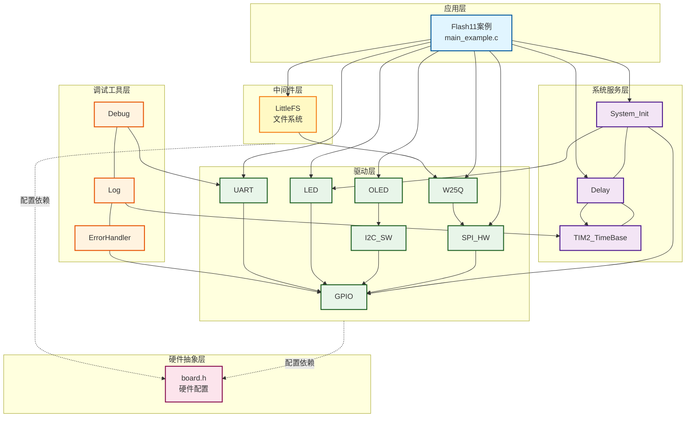
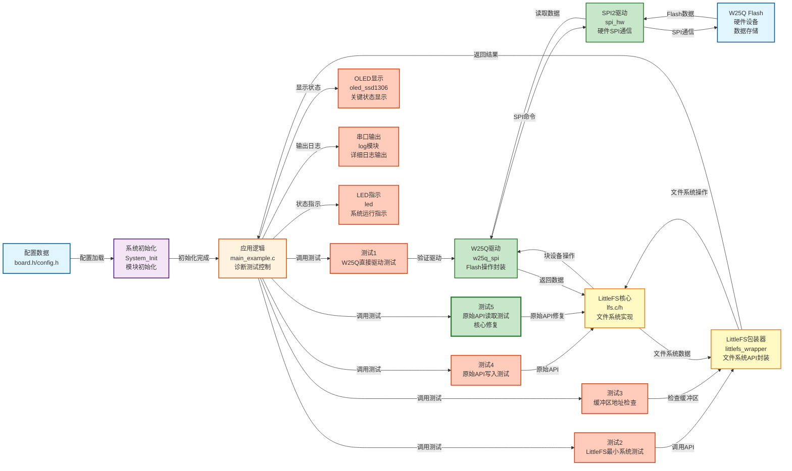

# Flash11 - LittleFS内联文件读取失败问题修复与内存配置建议

## 📋 案例目的

- **核心目标**：诊断和修复LittleFS内联文件读取失败问题，演示如何正确使用LittleFS原始API，并提供针对STM32F103C8T6的内存配置建议

### 核心功能

1. **问题诊断与修复**：
   - **内联文件读取失败修复**：解决了使用原始API `lfs_file_opencfg` 打开内联文件时返回`-2`(LFS_ERR_NOENT)的问题
   - **路径格式修正**：使用相对路径而非绝对路径
   - **独立缓存缓冲区**：为每个文件操作提供独立的缓存缓冲区
   - **文件句柄清零**：确保文件句柄在使用前完全清零

2. **诊断测试套件**：
   - **测试1：W25Q直接驱动测试**：验证底层Flash驱动是否正常
   - **测试2：LittleFS最小系统测试**：验证文件系统基本功能（格式化、挂载、创建目录）
   - **测试3：缓冲区地址检查**：验证缓冲区4字节对齐和地址重叠情况
   - **测试4：原始API写入测试**：使用原始API写入文件，验证写入路径
   - **测试5：原始API读取测试**：使用原始API读取内联文件，验证修复效果

3. **内存配置优化**：
   - **平衡配置**：针对STM32F103C8T6（20KB RAM）优化的配置
   - **缓冲区大小建议**：read_size=256, prog_size=256, cache_size=128, lookahead_size=128
   - **块分配器配置**：block_cycles=500，平衡磨损均衡和空间利用率

### 学习重点

- 理解LittleFS内联文件的特性和读取方法
- 掌握LittleFS原始API的正确使用方法（`lfs_file_opencfg`、`lfs_stat`等）
- 学习文件缓存缓冲区的配置和使用方法
- 了解缓冲区对齐要求和地址检查方法
- 掌握诊断测试的方法和流程
- 学习针对资源受限系统的内存配置优化

### 应用场景

适用于需要诊断和修复LittleFS文件系统问题的场景，特别是内联文件读取失败、内存配置优化、文件系统调试等场景。

## 🔧 硬件要求

### 必需外设

- **LED1**：连接到 `PA1`（系统状态指示）

### 传感器/模块

#### W25Q SPI Flash模块

| 引脚 | STM32连接 | 说明 |
|------|-----------|------|
| CS | PA11 | 片选信号（软件NSS模式） |
| SCK | PB13 | SPI2时钟信号 |
| MISO | PB14 | SPI2主入从出（数据接收） |
| MOSI | PB15 | SPI2主出从入（数据发送） |
| VCC | 3.3V | **⚠️ 重要：必须使用3.3V，不能使用5V！** |
| GND | GND | 电源地 |

**⚠️ 重要提示**：
- W25Q系列Flash使用3.3V供电，使用5V会损坏芯片
- CS引脚使用软件NSS模式，由软件控制拉低/拉高
- 确保电源稳定，避免写入过程中断电

#### OLED显示屏（软件I2C接口）

| 引脚 | STM32连接 | 说明 |
|------|-----------|------|
| SCL | PB8 | 软件I2C时钟线 |
| SDA | PB9 | 软件I2C数据线 |
| VCC | 3.3V | 电源 |
| GND | GND | 电源地 |

#### UART1（用于详细日志输出）

| 引脚 | STM32连接 | 说明 |
|------|-----------|------|
| TX | PA9 | UART1发送 |
| RX | PA10 | UART1接收 |
| 波特率 | 115200 | 串口通信波特率 |

**连接说明**：将UART1连接到USB转串口模块，用于查看详细日志输出。

## 📦 模块依赖

### 模块依赖关系图

### 模块列表

本案例使用以下模块：

- **`littlefs_wrapper`**：LittleFS文件系统包装器模块（核心模块）
- **`w25q_spi`**：W25Q SPI Flash驱动模块（LittleFS底层存储）
- **`spi_hw`**：硬件SPI驱动模块（W25Q使用SPI2）
- **`gpio`**：GPIO驱动模块（SPI、I2C、UART、LED依赖）
- **`led`**：LED驱动模块（状态指示）
- **`oled_ssd1306`**：OLED显示模块（关键信息显示）
- **`uart`**：UART驱动模块（详细日志输出）
- **`i2c_sw`**：软件I2C驱动模块（OLED使用）
- **`delay`**：延时模块（非阻塞延时）
- **`error_handler`**：错误处理模块（统一错误处理）
- **`log`**：日志模块（分级日志输出）

## 🔄 实现流程

### 整体逻辑

本案例通过5个诊断测试逐步定位和修复LittleFS内联文件读取失败问题。程序执行分为以下几个阶段：

1. **系统初始化阶段**：
   - 调用`System_Init()`初始化系统基础模块（GPIO、LED、delay、TIM2）
   - 初始化UART1用于串口日志输出
   - 初始化Debug和Log模块
   - 初始化软件I2C和OLED用于状态显示
   - 初始化SPI2和W25Q模块

2. **诊断测试1阶段**：
   - **W25Q直接驱动测试**：绕开LittleFS，直接验证W25Q驱动是否正常
   - 擦除扇区0，写入256字节测试数据，读取并验证数据一致性

3. **文件系统初始化阶段**：
   - 初始化LittleFS文件系统
   - 尝试挂载文件系统（支持强制格式化模式）

4. **诊断测试2阶段**：
   - **LittleFS最小系统测试**：验证文件系统基本功能
   - 强制格式化、挂载、创建目录、卸载、重新挂载验证

5. **诊断测试3阶段**：
   - **缓冲区地址检查**：检查read_buffer、prog_buffer、lookahead_buffer地址
   - 验证4字节对齐（mod4=0）和缓冲区是否重叠

6. **诊断测试4阶段**：
   - **原始API写入测试**：使用`lfs_file_opencfg`写入文件
   - 验证CTZ元数据写入和文件同步

7. **诊断测试5阶段**（核心修复）：
   - **原始API读取测试**：使用原始API读取内联文件
   - 使用独立的文件缓存缓冲区（128字节，4字节对齐）
   - 使用相对路径（`"test.txt"`而非`"/test.txt"`）
   - 文件句柄清零（`memset(&file, 0, sizeof(file))`）
   - 成功读取内联文件内容

8. **目录操作测试阶段**：
   - 创建目录
   - 列出根目录内容

9. **主循环阶段**：
   - LED闪烁指示系统运行
   - OLED显示运行状态和循环计数

### 数据流向图

### 关键方法

1. **诊断测试方法**：
   - 从底层到上层逐步验证：W25Q驱动 → LittleFS最小系统 → 缓冲区检查 → 原始API测试
   - 使用场景：定位文件系统问题时，按顺序执行诊断测试
   - 注意事项：每个测试都验证一个特定方面，避免问题混淆

2. **内联文件读取修复**：
   - **路径格式修正**：使用相对路径（`"test.txt"`）而非绝对路径（`"/test.txt"`）
   - **独立缓存缓冲区**：为每个文件操作提供独立的缓存缓冲区（大小必须与`cfg->cache_size`匹配）
   - **文件句柄清零**：每次使用前必须清零（`memset(&file, 0, sizeof(file))`）
   - **文件存在性预检查**：使用`lfs_stat`检查文件是否存在

3. **缓冲区对齐要求**：
   - 所有缓冲区地址必须是4的倍数（4字节对齐）
   - 缓冲区之间不能重叠
   - 使用场景：配置LittleFS缓冲区时，必须确保对齐
   - 注意事项：未对齐会导致文件操作失败或数据损坏

4. **原始API使用**：
   - 使用`lfs_file_opencfg`而非`lfs_file_open`，可以指定文件缓存缓冲区
   - 使用`lfs_stat`检查文件存在性和获取文件信息
   - 使用场景：需要精确控制文件操作时，使用原始API
   - 注意事项：原始API需要手动管理缓存缓冲区和文件句柄

5. **内存配置优化**：
   - 针对STM32F103C8T6（20KB RAM）优化的配置
   - 缓冲区大小建议：read_size=256, prog_size=256, cache_size=128, lookahead_size=128
   - 使用场景：资源受限系统需要优化内存占用时
   - 注意事项：缓冲区大小影响性能和内存占用，需要平衡

6. **强制格式化模式**：
   - 支持强制格式化模式（`CONFIG_LITTLEFS_FORCE_FORMAT`）
   - 使用场景：解决NOSPC和碎片化问题时
   - 注意事项：格式化会清除所有数据，仅在调试时使用

### 工作流程示意图

```mermaid
flowchart TD
    START([程序启动]) --> SYS_INIT[系统初始化<br/>System_Init]
    SYS_INIT --> UART_INIT[UART初始化<br/>UART_Init]
    UART_INIT --> DEBUG_INIT[Debug初始化<br/>Debug_Init]
    DEBUG_INIT --> LOG_INIT[Log初始化<br/>Log_Init]
    LOG_INIT --> LED_INIT[LED初始化<br/>LED_Init]
    LED_INIT --> I2C_INIT[软件I2C初始化<br/>I2C_SW_Init]
    I2C_INIT --> OLED_INIT[OLED初始化<br/>OLED_Init]
    OLED_INIT --> SPI_INIT[SPI2初始化<br/>SPI_HW_Init]
    SPI_INIT --> W25Q_INIT[W25Q初始化<br/>W25Q_Init]
    
    W25Q_INIT --> TEST1[测试1<br/>W25Q直接驱动测试<br/>验证底层驱动]
    TEST1 --> TEST1_RESULT{驱动正常?}
    TEST1_RESULT -->|失败| ERROR1[驱动错误<br/>停止运行]
    TEST1_RESULT -->|成功| LITTLEFS_INIT[LittleFS初始化<br/>LittleFS_Init]
    
    LITTLEFS_INIT --> MOUNT[尝试挂载文件系统<br/>LittleFS_Mount]
    MOUNT --> MOUNT_CHECK{挂载结果}
    MOUNT_CHECK -->|成功| TEST2[测试2<br/>LittleFS最小系统测试]
    MOUNT_CHECK -->|失败| FORMAT[格式化文件系统<br/>LittleFS_Format]
    FORMAT --> REMOUNT[重新挂载<br/>LittleFS_Mount]
    REMOUNT --> TEST2
    
    TEST2 --> TEST3[测试3<br/>缓冲区地址检查<br/>验证对齐和重叠]
    TEST3 --> TEST4[测试4<br/>原始API写入测试<br/>验证写入路径]
    TEST4 --> TEST5[测试5<br/>原始API读取测试<br/>核心修复验证]
    
    TEST5 --> TEST5_RESULT{读取成功?}
    TEST5_RESULT -->|失败| ERROR2[修复失败<br/>检查配置]
    TEST5_RESULT -->|成功| DIR_TEST[目录操作测试<br/>创建和列表]
    
    DIR_TEST --> MAIN_LOOP[主循环<br/>LED闪烁指示]
    MAIN_LOOP --> MAIN_LOOP
    
    %% 样式
    style START fill:#e1f5ff,stroke:#01579b,stroke-width:2px
    style SYS_INIT fill:#f3e5f5,stroke:#4a148c,stroke-width:2px
    style W25Q_INIT fill:#c8e6c9,stroke:#2e7d32,stroke-width:2px
    style LITTLEFS_INIT fill:#fff9c4,stroke:#f57f17,stroke-width:2px
    style TEST1 fill:#fff3e0,stroke:#e65100,stroke-width:2px
    style TEST2 fill:#fff3e0,stroke:#e65100,stroke-width:2px
    style TEST3 fill:#fff3e0,stroke:#e65100,stroke-width:2px
    style TEST4 fill:#fff3e0,stroke:#e65100,stroke-width:2px
    style TEST5 fill:#c8e6c9,stroke:#2e7d32,stroke-width:3px
    style DIR_TEST fill:#fff3e0,stroke:#e65100,stroke-width:2px
    style ERROR1 fill:#ffcdd2,stroke:#c62828,stroke-width:2px
    style ERROR2 fill:#ffcdd2,stroke:#c62828,stroke-width:2px
    style MAIN_LOOP fill:#e1f5ff,stroke:#01579b,stroke-width:2px
```

## 📚 关键函数说明

### LittleFS原始API相关函数

- **`lfs_file_opencfg()`**：使用配置打开文件（原始API）
  - 在本案例中用于打开文件并指定文件缓存缓冲区
  - 必须提供`lfs_file_config`结构体，包含独立的缓存缓冲区
  - **⚠️ 重要**：文件句柄在使用前必须清零，缓存缓冲区必须4字节对齐

- **`lfs_stat()`**：获取文件信息（原始API）
  - 在本案例中用于检查文件是否存在和获取文件信息
  - 返回文件大小、类型等信息
  - 文件不存在时返回`LFS_ERR_NOENT`

- **`lfs_file_read()`**：读取文件（原始API）
  - 在本案例中用于读取内联文件内容
  - 返回实际读取的字节数，负数表示错误

- **`lfs_file_write()`**：写入文件（原始API）
  - 在本案例中用于写入测试数据
  - 返回实际写入的字节数，负数表示错误

- **`lfs_file_sync()`**：同步文件（原始API）
  - 在本案例中用于确保数据落盘
  - 写入后必须调用，确保数据写入Flash

- **`lfs_file_close()`**：关闭文件（原始API）
  - 在本案例中用于关闭文件，释放资源
  - 所有文件操作完成后必须关闭文件

### LittleFS包装器API相关函数

- **`LittleFS_GetLFS()`**：获取LittleFS实例指针
  - 在本案例中用于获取`lfs_t`指针，以便使用原始API
  - 返回`lfs_t*`指针，未初始化时返回NULL

- **`LittleFS_GetCacheBuffer()`**：获取缓存缓冲区指针
  - 在本案例中用于获取系统缓存缓冲区（用于写入测试）
  - 返回缓存缓冲区指针，未初始化时返回NULL

- **`LittleFS_GetBufferAddresses()`**：获取缓冲区地址
  - 在本案例中用于检查缓冲区地址和对齐情况
  - 返回read_buffer、prog_buffer、lookahead_buffer的地址

### W25Q相关函数

- **`W25Q_Init()`**：初始化W25Q模块
  - 在本案例中用于初始化W25Q，自动识别型号、配置4字节模式（如果需要）
  - 必须在使用W25Q前调用

- **`W25Q_EraseSector()`**：擦除4KB扇区
  - 在本案例中用于擦除测试扇区，为写入操作做准备
  - 地址必须是4KB对齐

- **`W25Q_Write()`**：写入数据
  - 在本案例中用于写入测试数据（256字节）
  - 自动处理跨页边界

- **`W25Q_Read()`**：读取数据
  - 在本案例中用于读取测试数据，进行验证
  - 支持任意地址和长度的读取

### OLED相关函数

- **`OLED_Init()`**：初始化OLED显示屏
  - 在本案例中用于初始化OLED，显示关键状态信息
  - 使用软件I2C接口（PB8/9）

- **`OLED_ShowString()`**：显示字符串
  - 在本案例中用于显示测试状态、诊断信息等
  - 输出内容为全英文ASCII字符，符合项目规范

- **`OLED_Clear()`**：清屏
  - 在本案例中用于清除屏幕内容，准备显示新信息

### UART相关函数

- **`LOG_INFO()`**：Log模块的信息级别输出
  - 在本案例中用于输出详细日志、诊断信息、测试结果等
  - 遵循项目规范的串口输出规范（使用Log模块，支持中文GB2312编码）

- **`LOG_ERROR()`**：Log模块的错误级别输出
  - 在本案例中用于输出错误信息、诊断失败信息等
  - 支持中文描述，便于开发调试

**详细函数实现和调用示例请参考**：`main_example.c` 中的代码

## ⚠️ 注意事项与重点

### ⚠️ 重要提示

1. **文件路径格式**（⚠️ 最容易浪费时间的坑点）：
   - 使用相对路径（如`"test.txt"`），不要使用绝对路径（如`"/test.txt"`）
   - 路径格式错误会导致文件操作失败（返回`LFS_ERR_NOENT`）
   - 与目录列表中的路径格式保持一致
   - **教训**：如果不了解路径格式，很容易调试几个小时都找不到问题原因！

2. **文件缓存缓冲区配置**：
   - 每个文件操作需要独立的缓存缓冲区，大小必须与`cfg->cache_size`匹配
   - 缓存缓冲区地址必须是4字节对齐（使用`__attribute__((aligned(4)))`）
   - 共享缓存缓冲区可能导致文件操作失败

3. **文件句柄清零**：
   - 每次使用文件句柄前必须清零（`memset(&file, 0, sizeof(file))`）
   - 未清零的文件句柄可能包含脏数据，导致文件操作失败
   - 目录句柄同样需要清零

4. **缓冲区对齐要求**：
   - 所有缓冲区地址必须是4的倍数（4字节对齐）
   - 缓冲区之间不能重叠
   - 未对齐会导致文件操作失败或数据损坏

5. **内存配置限制**：
   - STM32F103C8T6只有20KB RAM，注意缓冲区大小配置
   - 推荐的平衡配置：read_size=256, prog_size=256, cache_size=128, lookahead_size=128
   - 总计约5.3KB RAM占用

6. **强制格式化模式**：
   - 启用后会清除所有数据，仅在调试时使用
   - 用于解决NOSPC和碎片化问题
   - 正常模式只在挂载失败时格式化

### 🔑 关键点

1. **诊断测试顺序**：
   - 从底层到上层逐步验证：W25Q驱动 → LittleFS最小系统 → 缓冲区检查 → 原始API测试
   - 每个测试都验证一个特定方面，避免问题混淆
   - 测试失败时，应检查前一个测试是否通过

2. **内联文件特性**：
   - 小文件（通常小于cache_size）会被存储为内联文件
   - 内联文件读取需要特殊的配置（独立缓存缓冲区、相对路径、文件句柄清零）
   - 内联文件读取失败时，检查路径格式、缓存缓冲区、文件句柄

3. **原始API使用**：
   - 使用`lfs_file_opencfg`而非`lfs_file_open`，可以指定文件缓存缓冲区
   - 使用`lfs_stat`检查文件存在性和获取文件信息
   - 原始API需要手动管理缓存缓冲区和文件句柄

4. **内存配置优化**：
   - 缓冲区大小影响性能和内存占用，需要平衡
   - 针对资源受限系统，建议使用较小的缓存缓冲区
   - 性能与内存占用的权衡：较大的缓存缓冲区提升性能，但占用更多内存

5. **错误诊断方法**：
   - 使用详细的日志输出定位问题
   - 检查缓冲区地址和对齐情况
   - 验证文件存在性和文件信息
   - 检查CTZ元数据状态

## 🔍 常见问题排查

#### 问题1：内联文件读取失败，返回`LFS_ERR_NOENT`（-2）

**可能原因**：
- **路径格式错误**（最常见！）：使用了绝对路径（`"/test.txt"`）而非相对路径（`"test.txt"`）
- 文件不存在（写入前未创建或文件已被删除）
- 文件句柄未清零（包含脏数据）
- 缓存缓冲区配置错误（未提供或大小不匹配）

**解决方法**：
1. **检查路径格式**：
   - 使用相对路径（`"test.txt"`），不要使用绝对路径（`"/test.txt"`）
   - 与目录列表中的路径格式保持一致
   - 使用`lfs_stat`检查文件是否存在
2. **检查文件句柄**：
   - 确保文件句柄在使用前清零（`memset(&file, 0, sizeof(file))`）
3. **检查缓存缓冲区**：
   - 确保提供了独立的缓存缓冲区，大小与`cfg->cache_size`匹配
   - 确保缓存缓冲区地址4字节对齐

#### 问题2：缓冲区未4字节对齐

**可能原因**：
- 缓冲区地址不是4的倍数
- 缓冲区定义时未使用对齐属性

**解决方法**：
1. **检查缓冲区定义**：
   - 使用`__attribute__((aligned(4)))`或`__align(4)`确保对齐
   - 检查缓冲区地址（使用`LittleFS_GetBufferAddresses()`）
2. **验证对齐**：
   - 计算`地址 % 4`，应该等于0
   - 如果未对齐，修改缓冲区定义

#### 问题3：文件写入成功，但读取失败

**可能原因**：
- 文件未同步（未调用`lfs_file_sync()`）
- 文件句柄未清零
- 路径格式错误（写入和读取使用不同的路径格式）

**解决方法**：
1. **检查文件同步**：
   - 确保写入后调用`lfs_file_sync()`并检查返回值
   - 等待同步完成后再读取
2. **检查文件句柄**：
   - 确保文件句柄在使用前清零
3. **检查路径格式**：
   - 确保写入和读取使用相同的路径格式（相对路径）

#### 问题4：诊断测试1失败（W25Q直接驱动测试失败）

**可能原因**：
- SPI通信问题（引脚连接错误、配置错误）
- Flash损坏
- 块保护已启用

**解决方法**：
1. **检查硬件连接**：
   - 检查SPI引脚连接（CS、SCK、MISO、MOSI）
   - 检查电源连接（3.3V，不能使用5V）
2. **检查SPI配置**：
   - 检查SPI模式、时钟频率等配置
   - 检查CS引脚控制
3. **检查Flash状态**：
   - 检查块保护状态（`W25Q_Init()`会自动清除）
   - 尝试重新初始化

#### 问题5：内存不足（RAM溢出）

**可能原因**：
- 缓冲区配置过大（超过可用RAM）
- 多个缓冲区同时存在

**解决方法**：
1. **检查缓冲区大小**：
   - 使用推荐的平衡配置：read_size=256, prog_size=256, cache_size=128, lookahead_size=128
   - 总计约5.3KB RAM占用
2. **优化配置**：
   - 减小缓存缓冲区大小（牺牲性能换取内存）
   - 减小lookahead缓冲区大小

## 💡 扩展练习

### 循序渐进理解本案例

1. **修改测试数据**：尝试写入不同的数据（更长的字符串、二进制数据等），理解内联文件和常规文件的区别
2. **测试不同文件大小**：测试不同大小的文件，观察哪些文件被存储为内联文件
3. **测试缓冲区配置**：尝试不同的缓冲区大小配置，观察性能和内存占用的变化

### 实际场景中的常见坑点

4. **路径格式错误**（⚠️ 最容易浪费时间的坑点）：
   - 如果使用绝对路径（`"/test.txt"`）而非相对路径（`"test.txt"`），文件操作会失败
   - 症状：文件打开失败，返回`LFS_ERR_NOENT`
   - 如何检测：检查路径格式，与目录列表中的路径格式对比
   - 如何处理：使用相对路径，与目录列表中的路径格式保持一致
   - **教训**：如果不了解路径格式，很容易调试几个小时都找不到问题原因！

5. **缓存缓冲区配置错误**：如果缓存缓冲区大小与`cfg->cache_size`不匹配，或未提供独立的缓存缓冲区，文件操作会失败。如何检测和处理？如何实现自动配置？

6. **文件句柄未清零**：如果文件句柄未清零，可能包含脏数据，导致文件操作失败。如何检测和处理？如何实现自动清零？

7. **缓冲区对齐问题**：如果缓冲区地址未4字节对齐，会导致文件操作失败或数据损坏。如何检测和处理？如何实现自动对齐？

8. **内存配置优化**：在实际应用中，如何根据可用RAM动态调整缓冲区大小？如何实现内存配置的自动优化？

## 📖 相关文档

- **模块文档**：
  - **LittleFS包装器**：`../../Middlewares/storage/littlefs/littlefs_wrapper.c/h`
  - **LittleFS核心**：`../../Middlewares/storage/littlefs/lfs.c/h`
  - **W25Q驱动**：`../../Drivers/flash/w25q_spi.c/h`
  - **W25Q模块文档**：`../../Drivers/flash/README.md`
  - **SPI驱动**：`../../Drivers/spi/spi_hw.c/h`
  - **OLED驱动**：`../../Drivers/display/oled_ssd1306.c/h`
  - **UART驱动**：`../../Drivers/uart/uart.c/h`
  - **软件I2C驱动**：`../../Drivers/i2c/i2c_sw.c/h`

- **业务文档**：
  - **主程序代码**：`main_example.c`
  - **硬件配置**：`board.h`
  - **模块配置**：`config.h`
  - **诊断测试文档**：`DIAGNOSTIC_TESTS.md`
  - **项目规范文档**：`../../../AI/README.md`（AI规则体系）
  - **案例参考**：`../../Examples/README.md`
  - **Flash10案例**：`../Flash10_LittleFS_W25Q_ReadWrite/README.md`（基础LittleFS使用）

- **其他模块**：
  - **LED驱动**：`../../Drivers/basic/led.c/h`
  - **GPIO驱动**：`../../Drivers/basic/gpio.c/h`
  - **延时功能**：`../../System/delay.c/h`
  - **系统初始化**：`../../System/system_init.c/h`
  - **错误处理**：`../../Common/error_handler.c/h`
  - **日志模块**：`../../Debug/log.c/h`
