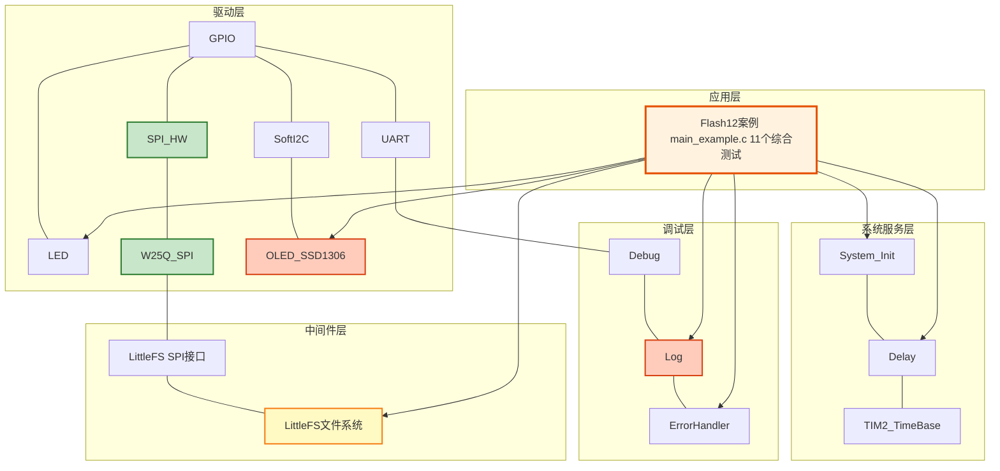

# Flash12 - LittleFS文件系统综合测试案例

## 📋 案例目的

- **核心目标**：通过11个综合功能测试，全面验证LittleFS文件系统在W25Q SPI Flash上的各项功能，包括文件操作、目录操作、文件属性、原子操作和断电保护等高级特性

### 核心功能

1. **测试1：文件系统初始化测试**
   - 检查W25Q是否已初始化
   - 尝试挂载文件系统
   - 如果挂载失败，自动格式化
   - 显示文件系统信息（总空间、空闲空间）

2. **测试2：基础文件操作测试**
   - 创建文件并写入数据
   - 读取并验证数据
   - 演示完整的文件操作流程

3. **测试3：文件定位测试**
   - 使用SEEK_SET定位到文件开头
   - 使用SEEK_CUR定位到中间位置
   - 使用SEEK_END定位到文件末尾
   - 验证定位结果

4. **测试4：追加写入测试**
   - 创建文件并写入第一行数据
   - 使用APPEND模式追加第二行数据
   - 读取并验证完整内容

5. **测试5：文件截断测试**
   - 创建文件并写入大量数据（512字节）
   - 截断文件到指定大小（128字节）
   - 验证文件大小是否正确

6. **测试6：文件重命名测试**
   - 创建文件并重命名
   - 验证旧文件不存在，新文件存在
   - 验证重命名后文件内容完整性

7. **测试7：文件删除测试**
   - 创建文件并删除
   - 验证文件不存在
   - 验证打开已删除文件返回NOENT错误

8. **测试8：目录操作测试**
   - 创建目录
   - 在目录中创建文件
   - 遍历目录，列出所有文件
   - 删除目录中的文件和目录本身

9. **测试9：文件属性测试**
   - 设置文件属性（版本号、创建时间）
   - 获取文件属性并验证
   - 移除文件属性并验证

10. **测试10：原子操作测试**
    - 方式1：原子写入演示（写入后立即同步）
    - 方式2：使用文件属性存储校验和，验证数据完整性

11. **测试11：断电保护测试**
    - 方式1：提示用户手动重启，验证数据保留
      - **⚠️ 重要**：需要物理重启设备（断电或按复位按钮），不能仅软件复位
      - 首次运行：写入关键数据，创建标记文件，提示用户重启
      - 第二次运行：检测到标记文件，验证数据完整性，删除标记文件
    - 方式2：自动检测首次/二次运行，验证数据持久化
      - 使用magic number（0xDEADBEEF）自动判断首次/二次运行
      - 无需手动干预，自动完成验证

### 学习重点

- 全面掌握LittleFS文件系统的各项功能
- 理解文件定位、截断、重命名、删除等高级操作
- 学习目录操作的完整流程
- 掌握文件属性的设置、获取和移除
- 理解原子操作和断电保护机制
- 学习数据完整性验证方法（校验和）

### 应用场景

适用于需要全面验证文件系统功能的应用，如数据日志存储、配置文件管理、固件更新、参数保存、断电保护等场景。

## 🔧 硬件要求

### 必需外设

- **LED1**：连接到 `PA1`（系统状态指示）

### 传感器/模块

#### W25Q SPI Flash模块

| 引脚 | STM32连接 | 说明 |
|------|-----------|------|
| CS | PA11 | 片选信号（软件NSS模式） |
| SCK | PB13 | SPI2时钟信号 |
| MISO | PB14 | SPI2主入从出（数据接收） |
| MOSI | PB15 | SPI2主出从入（数据发送） |
| VCC | 3.3V | **⚠️ 重要：必须使用3.3V，不能使用5V！** |
| GND | GND | 电源地 |

**⚠️ 重要提示**：
- W25Q系列Flash使用3.3V供电，使用5V会损坏芯片
- CS引脚使用软件NSS模式，由软件控制拉低/拉高
- 确保电源稳定，避免写入过程中断电
- **SPI2预分频设置为8（约4.5MHz）**，相比128分频（约0.56MHz）性能提升约8倍

#### OLED显示屏（软件I2C接口）

| 引脚 | STM32连接 | 说明 |
|------|-----------|------|
| SCL | PB8 | 软件I2C时钟线 |
| SDA | PB9 | 软件I2C数据线 |
| VCC | 3.3V | 电源 |
| GND | GND | 电源地 |

#### UART1（用于详细日志输出）

| 引脚 | STM32连接 | 说明 |
|------|-----------|------|
| TX | PA9 | UART1发送 |
| RX | PA10 | UART1接收 |
| 波特率 | 115200 | 串口通信波特率 |

**连接说明**：将UART1连接到USB转串口模块，用于查看详细日志输出。

## 📦 模块依赖

### 模块依赖关系图

### 模块列表

| 模块 | 说明 | 用途 |
|------|------|------|
| System_Init | 系统初始化 | 初始化系统基础模块 |
| Delay | 延时模块 | 提供延时功能 |
| TIM2_TimeBase | 基时定时器 | Delay模块依赖 |
| GPIO | GPIO驱动 | LED、SPI、I2C、UART依赖 |
| LED | LED驱动 | 系统状态指示 |
| SPI_HW | SPI硬件驱动 | W25Q通信接口 |
| W25Q_SPI | W25Q Flash驱动 | Flash存储设备 |
| SoftI2C | 软件I2C驱动 | OLED通信接口 |
| OLED_SSD1306 | OLED显示驱动 | 状态显示 |
| UART | UART驱动 | 串口日志输出 |
| LittleFS | LittleFS文件系统 | 文件系统核心 |
| LittleFS SPI接口 | LittleFS SPI块设备 | W25Q与LittleFS桥接 |
| Debug | Debug模块 | 调试输出 |
| Log | 日志模块 | 日志记录 |
| ErrorHandler | 错误处理模块 | 错误处理 |

## 🔄 实现流程

### 整体逻辑

本案例通过11个综合测试全面验证LittleFS文件系统的各项功能。程序执行分为以下几个阶段：

1. **系统初始化阶段**：
   - 调用`System_Init()`初始化系统基础模块（GPIO、LED、delay、TIM2）
   - 初始化UART1用于串口日志输出
   - 初始化Debug和Log模块
   - 初始化软件I2C和OLED用于状态显示
   - 初始化SPI2和W25Q模块（SPI2预分频8，约4.5MHz）
   - 初始化LittleFS文件系统

2. **测试1：文件系统初始化测试**：
   - 检查W25Q是否已初始化
   - 尝试挂载文件系统
   - 如果挂载失败，自动格式化
   - 显示文件系统信息（总空间、空闲空间）

3. **测试2：基础文件操作测试**：
   - 创建文件`test1.txt`并写入数据
   - 读取并验证数据

4. **测试3：文件定位测试**：
   - 使用SEEK_SET、SEEK_CUR、SEEK_END定位文件
   - 验证定位结果

5. **测试4：追加写入测试**：
   - 创建文件并写入第一行
   - 使用APPEND模式追加第二行
   - 验证完整内容

6. **测试5：文件截断测试**：
   - 写入512字节数据
   - 截断到128字节
   - 验证文件大小

7. **测试6：文件重命名测试**：
   - 创建文件并重命名
   - 验证旧文件不存在，新文件存在

8. **测试7：文件删除测试**：
   - 创建文件并删除
   - 验证文件不存在

9. **测试8：目录操作测试**：
   - 创建目录、在目录中创建文件
   - 遍历目录、删除文件和目录

10. **测试9：文件属性测试**：
    - 设置、获取、移除文件属性

11. **测试10：原子操作测试**：
    - 原子写入演示
    - 使用文件属性存储校验和
    - **配置选项**：`CONFIG_LITTLEFS_REFORMAT_BEFORE_TEST10`（默认启用）
      - 在测试10前重新格式化文件系统，解决NOSPC错误
      - 可通过`config.h`配置启用/禁用
    - **配置选项**：`CONFIG_LITTLEFS_REFORMAT_BEFORE_TEST10`（默认启用）
      - 在测试10前重新格式化文件系统，解决NOSPC错误
      - 可通过`config.h`配置启用/禁用

12. **测试11：断电保护测试**：
    - 提示用户手动重启验证
    - 自动检测首次/二次运行验证

13. **主循环阶段**：
    - LED闪烁指示系统运行
    - OLED显示运行状态和循环计数

### 数据流向图

```mermaid
graph LR
    %% 输入数据
    CONFIG[配置数据 board.h/config.h]
    
    %% 初始化流程
    INIT[系统初始化 System_Init 模块初始化]
    
    %% 应用逻辑
    APP[应用逻辑 main_example.c 11个综合测试]
    
    %% LittleFS包装器
    LITTLEFS_WRAP[LittleFS包装器 littlefs_wrapper 文件系统API封装]
    
    %% LittleFS核心
    LITTLEFS_CORE[LittleFS核心 lfs.c/h 文件系统实现]
    
    %% W25Q驱动
    W25Q_DRV[W25Q驱动 w25q_spi Flash操作封装]
    
    %% SPI接口
    SPI[SPI2驱动 spi_hw 硬件SPI通信 预分频8]
    
    %% 硬件设备
    FLASH[W25Q Flash 硬件设备 数据存储]
    
    %% 输出设备
    OLED[OLED显示 oled_ssd1306 关键状态显示]
    UART[串口输出 log模块 详细日志输出]
    LED[LED指示 led 系统运行指示]
    
    %% 数据流
    CONFIG -->|配置加载| INIT
    INIT -->|初始化完成| APP
    APP -->|调用API| LITTLEFS_WRAP
    LITTLEFS_WRAP -->|文件系统操作| LITTLEFS_CORE
    LITTLEFS_CORE -->|块设备操作| W25Q_DRV
    W25Q_DRV -->|SPI命令| SPI
    SPI -->|SPI通信| FLASH
    FLASH -->|Flash数据| SPI
    SPI -->|读取数据| W25Q_DRV
    W25Q_DRV -->|返回数据| LITTLEFS_CORE
    LITTLEFS_CORE -->|文件系统数据| LITTLEFS_WRAP
    LITTLEFS_WRAP -->|返回结果| APP
    APP -->|显示状态| OLED
    APP -->|输出日志| UART
    APP -->|状态指示| LED
    
    %% 样式
    style CONFIG fill:#e1f5ff,stroke:#01579b,stroke-width:2px
    style INIT fill:#f3e5f5,stroke:#4a148c,stroke-width:2px
    style APP fill:#fff3e0,stroke:#e65100,stroke-width:2px
    style LITTLEFS_WRAP fill:#fff9c4,stroke:#f57f17,stroke-width:2px
    style LITTLEFS_CORE fill:#fff9c4,stroke:#f57f17,stroke-width:2px
    style W25Q_DRV fill:#c8e6c9,stroke:#2e7d32,stroke-width:2px
    style SPI fill:#c8e6c9,stroke:#2e7d32,stroke-width:2px
    style FLASH fill:#e1f5ff,stroke:#01579b,stroke-width:2px
    style OLED fill:#ffccbc,stroke:#d84315,stroke-width:2px
    style UART fill:#ffccbc,stroke:#d84315,stroke-width:2px
    style LED fill:#ffccbc,stroke:#d84315,stroke-width:2px
```

### 关键方法

1. **文件系统挂载与格式化**：
   - 首次使用或文件系统损坏时需要格式化
   - 挂载失败时自动格式化
   - 使用场景：测试1中自动检测和格式化

2. **文件句柄清零**：
   - 每次使用文件句柄前必须清零（`memset(&file, 0, sizeof(file))`）
   - 使用场景：所有文件操作前
   - 注意事项：避免脏数据导致文件操作失败

3. **文件同步机制**：
   - 写入后必须调用`LittleFS_FileSync()`确保数据落盘
   - 使用场景：所有写入操作后
   - 注意事项：未同步的数据可能在断电后丢失

4. **文件定位操作**：
   - 使用`LittleFS_FileSeek()`进行文件定位
   - 支持SEEK_SET（文件开头）、SEEK_CUR（当前位置）、SEEK_END（文件末尾）
   - 使用场景：测试3中演示三种定位方式

5. **追加写入模式**：
   - 使用`LFS_O_APPEND`标志打开文件
   - 写入时自动定位到文件末尾
   - 使用场景：测试4中演示追加写入

6. **文件截断操作**：
   - 使用`LittleFS_FileTruncate()`截断文件
   - 使用`LittleFS_FileSize()`获取文件大小
   - 使用场景：测试5中演示文件截断

7. **文件重命名和删除**：
   - 使用`LittleFS_FileRename()`重命名文件
   - 使用`LittleFS_FileDelete()`删除文件
   - 使用`lfs_stat()`验证文件存在性
   - 使用场景：测试6和测试7

8. **目录操作**：
   - 使用`LittleFS_DirCreate()`创建目录
   - 使用`LittleFS_DirOpen()`打开目录
   - 使用`LittleFS_DirRead()`循环读取目录项
   - 使用`LittleFS_DirDelete()`删除目录
   - 使用场景：测试8

9. **文件属性操作**：
   - 使用`LittleFS_FileSetAttr()`设置文件属性
   - 使用`LittleFS_FileGetAttr()`获取文件属性
   - 使用`LittleFS_FileRemoveAttr()`移除文件属性
   - 使用场景：测试9和测试10

10. **原子操作和断电保护**：
    - 写入后立即同步确保原子性
    - 使用文件属性存储校验和验证数据完整性
    - 使用标记文件检测首次/二次运行
    - 使用场景：测试10和测试11

### 工作流程示意图

```mermaid
flowchart TD
    START([程序启动]) --> SYS_INIT[系统初始化 System_Init]
    SYS_INIT --> UART_INIT[UART初始化 UART_Init]
    UART_INIT --> DEBUG_INIT[Debug初始化 Debug_Init]
    DEBUG_INIT --> LOG_INIT[Log初始化 Log_Init]
    LOG_INIT --> LED_INIT[LED初始化 LED_Init]
    LED_INIT --> I2C_INIT[软件I2C初始化 I2C_SW_Init]
    I2C_INIT --> OLED_INIT[OLED初始化 OLED_Init]
    OLED_INIT --> SPI_INIT[SPI2初始化 SPI_HW_Init 预分频8]
    SPI_INIT --> W25Q_INIT[W25Q初始化 W25Q_Init]
    W25Q_INIT --> LITTLEFS_INIT[LittleFS初始化 LittleFS_Init]
    
    LITTLEFS_INIT --> TEST1[测试1 文件系统初始化 挂载/格式化/信息查询]
    TEST1 --> TEST2[测试2 基础文件操作 创建/写入/读取/验证]
    TEST2 --> TEST3[测试3 文件定位 SEEK_SET/CUR/END]
    TEST3 --> TEST4[测试4 追加写入 APPEND模式]
    TEST4 --> TEST5[测试5 文件截断 Truncate/Size]
    TEST5 --> TEST6[测试6 文件重命名 Rename/验证]
    TEST6 --> TEST7[测试7 文件删除 Delete/验证]
    TEST7 --> TEST8[测试8 目录操作 创建/遍历/删除]
    TEST8 --> TEST9[测试9 文件属性 Set/Get/Remove]
    TEST9 --> TEST10[测试10 原子操作 同步/校验和]
    TEST10 --> TEST11[测试11 断电保护 标记文件/持久化]
    
    TEST11 --> MAIN_LOOP[主循环 LED闪烁指示]
    MAIN_LOOP --> MAIN_LOOP
    
    %% 样式
    style START fill:#e1f5ff,stroke:#01579b,stroke-width:2px
    style SYS_INIT fill:#f3e5f5,stroke:#4a148c,stroke-width:2px
    style W25Q_INIT fill:#c8e6c9,stroke:#2e7d32,stroke-width:2px
    style LITTLEFS_INIT fill:#fff9c4,stroke:#f57f17,stroke-width:2px
    style TEST1 fill:#fff3e0,stroke:#e65100,stroke-width:2px
    style TEST2 fill:#fff3e0,stroke:#e65100,stroke-width:2px
    style TEST3 fill:#fff3e0,stroke:#e65100,stroke-width:2px
    style TEST4 fill:#fff3e0,stroke:#e65100,stroke-width:2px
    style TEST5 fill:#fff3e0,stroke:#e65100,stroke-width:2px
    style TEST6 fill:#fff3e0,stroke:#e65100,stroke-width:2px
    style TEST7 fill:#fff3e0,stroke:#e65100,stroke-width:2px
    style TEST8 fill:#fff3e0,stroke:#e65100,stroke-width:2px
    style TEST9 fill:#fff3e0,stroke:#e65100,stroke-width:2px
    style TEST10 fill:#fff3e0,stroke:#e65100,stroke-width:2px
    style TEST11 fill:#fff3e0,stroke:#e65100,stroke-width:2px
    style MAIN_LOOP fill:#e1f5ff,stroke:#01579b,stroke-width:2px
```

## 📚 关键函数说明

### LittleFS相关函数

#### 文件系统初始化

- **`LittleFS_Init()`**：初始化LittleFS文件系统
  - 在本案例中用于初始化LittleFS，配置块设备回调函数和文件系统参数
  - 返回值：`LITTLEFS_OK`表示成功，其他值表示失败

- **`LittleFS_Mount()`**：挂载文件系统
  - 在本案例中用于挂载已存在的文件系统
  - 返回值：`LITTLEFS_OK`表示成功，其他值表示失败（可能需要格式化）

- **`LittleFS_Format()`**：格式化文件系统
  - 在本案例中用于格式化文件系统（挂载失败时自动调用）
  - 返回值：`LITTLEFS_OK`表示成功，其他值表示失败
  - 注意事项：格式化会清除所有数据

- **`LittleFS_GetInfo()`**：获取文件系统信息
  - 在本案例中用于查询总空间和空闲空间
  - 参数：`total_bytes`（总空间）、`free_bytes`（空闲空间）
  - 返回值：`LITTLEFS_OK`表示成功

#### 文件操作

- **`LittleFS_FileOpen()`**：打开文件
  - 在本案例中用于打开文件进行读写操作
  - 参数：`file`（文件句柄）、`path`（文件路径）、`flags`（打开标志）
  - 打开标志：`LFS_O_RDONLY`（只读）、`LFS_O_WRONLY`（只写）、`LFS_O_RDWR`（读写）、`LFS_O_CREAT`（创建）、`LFS_O_APPEND`（追加）
  - 返回值：`LITTLEFS_OK`表示成功

- **`LittleFS_FileClose()`**：关闭文件
  - 在本案例中用于关闭已打开的文件
  - 参数：`file`（文件句柄）
  - 返回值：`LITTLEFS_OK`表示成功

- **`LittleFS_FileRead()`**：读取文件
  - 在本案例中用于读取文件内容
  - 参数：`file`（文件句柄）、`buffer`（缓冲区）、`size`（读取大小）、`bytes_read`（实际读取字节数）
  - 返回值：`LITTLEFS_OK`表示成功

- **`LittleFS_FileWrite()`**：写入文件
  - 在本案例中用于写入文件内容
  - 参数：`file`（文件句柄）、`buffer`（缓冲区）、`size`（写入大小）、`bytes_written`（实际写入字节数）
  - 返回值：`LITTLEFS_OK`表示成功
  - 注意事项：写入后必须调用`LittleFS_FileSync()`同步

- **`LittleFS_FileSync()`**：同步文件
  - 在本案例中用于确保数据写入Flash
  - 参数：`file`（文件句柄）
  - 返回值：`LITTLEFS_OK`表示成功
  - 注意事项：所有写入操作后必须调用此函数

- **`LittleFS_FileSeek()`**：文件定位
  - 在本案例中用于定位文件指针
  - 参数：`file`（文件句柄）、`offset`（偏移量）、`whence`（定位方式）
  - 定位方式：`LFS_SEEK_SET`（文件开头）、`LFS_SEEK_CUR`（当前位置）、`LFS_SEEK_END`（文件末尾）
  - 返回值：`LITTLEFS_OK`表示成功

- **`LittleFS_FileSize()`**：获取文件大小
  - 在本案例中用于获取文件大小
  - 参数：`file`（文件句柄）、`size`（文件大小）
  - 返回值：`LITTLEFS_OK`表示成功

- **`LittleFS_FileTruncate()`**：截断文件
  - 在本案例中用于截断文件到指定大小
  - 参数：`file`（文件句柄）、`size`（目标大小）
  - 返回值：`LITTLEFS_OK`表示成功

- **`LittleFS_FileRename()`**：重命名文件
  - 在本案例中用于重命名文件
  - 参数：`old_path`（旧路径）、`new_path`（新路径）
  - 返回值：`LITTLEFS_OK`表示成功

- **`LittleFS_FileDelete()`**：删除文件
  - 在本案例中用于删除文件
  - 参数：`path`（文件路径）
  - 返回值：`LITTLEFS_OK`表示成功

#### 目录操作

- **`LittleFS_DirCreate()`**：创建目录
  - 在本案例中用于创建目录
  - 参数：`path`（目录路径）
  - 返回值：`LITTLEFS_OK`表示成功

- **`LittleFS_DirOpen()`**：打开目录
  - 在本案例中用于打开目录进行遍历
  - 参数：`dir`（目录句柄）、`path`（目录路径）
  - 返回值：`LITTLEFS_OK`表示成功

- **`LittleFS_DirRead()`**：读取目录项
  - 在本案例中用于读取目录中的文件和子目录
  - 参数：`dir`（目录句柄）、`info`（目录项信息）
  - 返回值：`LITTLEFS_OK`表示成功，`LITTLEFS_ERROR_NOENT`表示读取完毕

- **`LittleFS_DirClose()`**：关闭目录
  - 在本案例中用于关闭已打开的目录
  - 参数：`dir`（目录句柄）
  - 返回值：`LITTLEFS_OK`表示成功

- **`LittleFS_DirDelete()`**：删除目录
  - 在本案例中用于删除目录（目录必须为空）
  - 参数：`path`（目录路径）
  - 返回值：`LITTLEFS_OK`表示成功

#### 文件属性操作

- **`LittleFS_FileSetAttr()`**：设置文件属性
  - 在本案例中用于设置文件属性（版本号、创建时间、校验和）
  - 参数：`path`（文件路径）、`type`（属性类型，uint8_t，范围0x00-0xFF）、`buffer`（属性数据）、`size`（数据大小）
  - 返回值：`LITTLEFS_OK`表示成功

- **`LittleFS_FileGetAttr()`**：获取文件属性
  - 在本案例中用于获取文件属性
  - 参数：`path`（文件路径）、`type`（属性类型，uint8_t，范围0x00-0xFF）、`buffer`（缓冲区）、`size`（缓冲区大小）、`actual_size`（实际大小）
  - 返回值：`LITTLEFS_OK`表示成功

- **`LittleFS_FileRemoveAttr()`**：移除文件属性
  - 在本案例中用于移除文件属性
  - 参数：`path`（文件路径）、`type`（属性类型，uint8_t，范围0x00-0xFF）
  - 返回值：`LITTLEFS_OK`表示成功

#### 原始API访问

- **`LittleFS_GetLFS()`**：获取LittleFS实例指针
  - 在本案例中用于获取`lfs_t`指针，调用原始API（如`lfs_stat`）
  - 参数：`instance`（实例号）
  - 返回值：`lfs_t*`指针，NULL表示失败

### W25Q相关函数

- **`W25Q_Init()`**：初始化W25Q Flash
  - 在本案例中用于初始化W25Q Flash设备
  - 返回值：`W25Q_OK`表示成功

- **`W25Q_GetInfo()`**：获取W25Q设备信息
  - 在本案例中用于获取W25Q容量等信息
  - 返回值：`w25q_dev_t*`指针，NULL表示未初始化

### OLED相关函数

- **`OLED_Init()`**：初始化OLED显示屏
  - 在本案例中用于初始化OLED显示屏
  - 返回值：`OLED_OK`表示成功

- **`OLED_Clear()`**：清屏
  - 在本案例中用于清空OLED显示内容

- **`OLED_ShowString()`**：显示字符串
  - 在本案例中用于显示测试状态和结果
  - 参数：`line`（行号，1-4）、`col`（列号，1-16）、`str`（字符串）

### UART相关函数

- **`UART_Init()`**：初始化UART
  - 在本案例中用于初始化UART1（115200波特率）
  - 返回值：`UART_OK`表示成功

### Log相关函数

- **`LOG_INFO()`**：输出信息日志
  - 在本案例中用于输出测试过程和结果信息

- **`LOG_ERROR()`**：输出错误日志
  - 在本案例中用于输出错误信息

## ⚠️ 注意事项与重点

### 重要提示

1. **文件句柄清零**：
   - 每次使用文件句柄前必须清零（`memset(&file, 0, sizeof(file))`）
   - 避免脏数据导致文件操作失败
   - 所有测试中都遵循此规则

2. **文件同步**：
   - 所有写入操作后必须调用`LittleFS_FileSync()`确保数据落盘
   - 未同步的数据可能在断电后丢失
   - 测试2、4、5、6、7、10、11中都调用了同步

3. **文件路径格式**：
   - 使用相对路径（如`"test1.txt"`），不要使用绝对路径（如`"/test1.txt"`）
   - 路径格式错误会导致文件操作失败（返回`LFS_ERR_NOENT`）
   - 所有测试中都使用相对路径

4. **文件存在性检查**：
   - 使用`lfs_stat()`检查文件是否存在
   - 文件不存在时返回`LFS_ERR_NOENT`
   - 测试6、7中使用此方法验证文件存在性

5. **目录删除**：
   - 删除目录前必须先删除目录中的所有文件
   - 空目录才能被删除
   - 测试8中演示了完整的目录删除流程

6. **文件属性类型**：
   - 文件属性类型范围为0x00-0xFF（uint8_t类型）
   - 测试9中使用0x10（版本号）和0x11（创建时间）
   - 测试10中使用0x12（校验和）
   - 注意：避开系统保留的类型值（0x00-0x0F建议保留）

7. **文件大小限制**：
   - LittleFS理论最大文件大小：2,147,483,647字节（约2GB）
   - 对于W25Q 8MB Flash，实际可用空间约7-8MB
   - 建议单个文件不超过6-7MB，为文件系统预留空间
   - 文件至少占用一个块（4096字节），小文件也会占用一个块

8. **测试10前重新格式化**：
   - 配置选项：`CONFIG_LITTLEFS_REFORMAT_BEFORE_TEST10`（在`config.h`中）
   - 默认值：1（启用）
   - 作用：在测试10前重新格式化文件系统，解决NOSPC（无空间）错误
   - 使用场景：当文件系统在多次写入后出现碎片化或元数据块已满时

9. **metadata_max配置**：
   - 在`littlefs_wrapper.c`中设置为2048（block_size的一半）
   - 作用：限制元数据对占用的总空间，减少元数据压缩时间
   - 效果：降低NOSPC错误的发生概率，提高文件系统稳定性

10. **断电保护测试（测试11）**：
    - 方式1需要物理重启设备（断电或按复位按钮）才能验证
    - 重启后程序会检测到标记文件存在，然后验证数据完整性
    - 方式2自动检测首次/二次运行，无需手动干预

### 关键点

1. **SPI性能优化**：
   - SPI2预分频设置为8（约4.5MHz），相比128分频（约0.56MHz）性能提升约8倍
   - 在`board.h`中配置：`SPI_BaudRatePrescaler_8`

2. **原子操作**：
   - 写入后立即同步确保原子性
   - 使用文件属性存储校验和验证数据完整性
   - 测试10中演示了两种原子操作方式

3. **断电保护**：
   - 使用标记文件检测首次/二次运行
   - 使用固定地址的标记数据实现持久化
   - 测试11中演示了两种断电保护方式

4. **错误处理**：
   - 所有文件操作都检查返回值
   - 测试失败时记录详细错误信息
   - 使用OLED和UART双重输出便于调试

5. **测试独立性**：
   - 每个测试都是独立的函数
   - 测试之间通过延时分离，便于观察
   - 所有测试按顺序执行，全面验证功能

## 🔍 常见问题排查

### 问题1：文件系统挂载失败

**现象**：`LittleFS_Mount()`返回错误

**可能原因**：
- 文件系统未格式化（首次使用）
- 文件系统损坏（异常断电）

**解决方法**：
- 测试1中自动检测挂载失败并格式化
- 检查W25Q是否正常工作
- 检查SPI通信是否正常

### 问题2：文件操作返回NOENT错误

**现象**：`LittleFS_FileOpen()`返回`LITTLEFS_ERROR_NOENT`

**可能原因**：
- 文件路径格式错误（使用了绝对路径）
- 文件不存在
- 文件系统未挂载

**解决方法**：
- 使用相对路径（如`"test1.txt"`，不要使用`"/test1.txt"`）
- 使用`lfs_stat()`检查文件是否存在
- 确保文件系统已成功挂载

### 问题3：文件截断失败

**现象**：`LittleFS_FileTruncate()`返回错误

**可能原因**：
- 文件未以读写模式打开
- 文件系统空间不足

**解决方法**：
- 使用`LFS_O_RDWR`模式打开文件
- 检查文件系统空闲空间
- 确保文件系统已成功挂载

### 问题4：目录删除失败

**现象**：`LittleFS_DirDelete()`返回错误

**可能原因**：
- 目录不为空（包含文件或子目录）
- 目录不存在

**解决方法**：
- 先删除目录中的所有文件
- 使用`lfs_stat()`检查目录是否存在
- 测试8中演示了完整的删除流程

### 问题5：文件属性操作失败

**现象**：`LittleFS_FileSetAttr()`或`LittleFS_FileGetAttr()`返回错误

**可能原因**：
- 文件不存在
- 属性类型超出范围（必须是0x00-0xFF，uint8_t类型）
- 属性数据大小不匹配

**解决方法**：
- 确保文件已创建
- 使用0x00-0xFF范围内的属性类型（建议使用0x10-0xFF避开系统保留值）
- 确保属性数据大小正确

### 问题6：同步操作返回NOSPC错误（-3912）

**现象**：`LittleFS_FileSync()`返回`LITTLEFS_ERROR_NOSPC`（-3912）

**可能原因**：
- 文件系统碎片化严重
- 元数据块已满
- 文件系统空间不足（虽然显示有空间，但元数据空间不足）

**解决方法**：
1. **启用测试10前重新格式化**：
   - 在`config.h`中设置`CONFIG_LITTLEFS_REFORMAT_BEFORE_TEST10 = 1`
   - 测试10前会自动重新格式化文件系统
2. **检查metadata_max配置**：
   - 确认`littlefs_wrapper.c`中`metadata_max`设置为2048
   - 这可以减少元数据压缩时间，降低NOSPC错误
3. **增加同步后延时**：
   - 同步后增加延时（如1000ms），确保Flash操作完成
4. **检查文件系统状态**：
   - 使用`LittleFS_GetInfo()`检查空闲空间
   - 如果空闲空间小于1KB，建议重新格式化

### 问题7：测试11断电保护测试无法验证

**现象**：测试11方式1显示"Please restart"后，重启设备但无法验证数据

**可能原因**：
- 未物理重启设备（仅软件复位或重新编译下载）
- 标记文件未正确创建
- 数据未正确同步

**解决方法**：
1. **物理重启设备**：
   - 必须断电再上电，或按复位按钮（RESET）
   - 不能仅软件复位或重新编译下载
2. **检查标记文件**：
   - 使用`lfs_stat()`检查`power_test.flag`文件是否存在
   - 确保标记文件创建成功
3. **检查数据同步**：
   - 确保写入后调用了`LittleFS_FileSync()`
   - 同步后增加延时确保Flash操作完成

## 🎯 扩展练习

### 循序渐进

1. **修改测试数据**：
   - 修改测试2中的写入数据，验证不同长度的数据
   - 修改测试5中的截断大小，验证不同大小的截断

2. **测试不同文件大小**：
   - 测试大文件操作（1KB、4KB、16KB、64KB、256KB）
   - 测试小文件操作（1字节、10字节）
   - 注意：文件至少占用一个块（4096字节），小文件也会占用一个块
   - 对于W25Q 8MB Flash，建议单个文件不超过6-7MB

3. **测试嵌套目录**：
   - 创建多级嵌套目录
   - 在嵌套目录中创建文件
   - 遍历嵌套目录结构

### 实际场景坑点

1. **并发文件操作**：
   - 同时打开多个文件进行读写
   - 注意每个文件需要独立的缓存缓冲区

2. **文件系统空间管理**：
   - 监控文件系统空闲空间
   - 实现文件系统空间不足时的处理逻辑

3. **断电保护优化**：
   - 实现更完善的断电保护机制
   - 使用校验和验证关键数据完整性

4. **性能优化**：
   - 优化文件读写性能
   - 减少文件同步次数（批量写入后同步）

5. **错误恢复**：
   - 实现文件系统损坏时的自动恢复
   - 实现关键数据的备份和恢复机制

## 📖 相关文档

### 模块文档

- [LittleFS模块文档](../../../Middlewares/storage/littlefs/README.md)
- [W25Q驱动文档](../../../Drivers/flash/README.md)
- [SPI驱动文档](../../../Drivers/spi/README.md)
- [OLED驱动文档](../../../Drivers/display/README.md)

### 业务文档

- [Flash10案例文档](../Flash10_LittleFS_W25Q_ReadWrite/README.md) - 基础文件操作
- [Flash11案例文档](../Flash11_LittleFS_InlineFileFix_And_MemoryConfig/README.md) - 内联文件修复和内存配置

### 其他模块

- [系统初始化文档](../../../System/README.md)
- [错误处理文档](../../../Common/README.md)
- [日志模块文档](../../../Debug/README.md)

