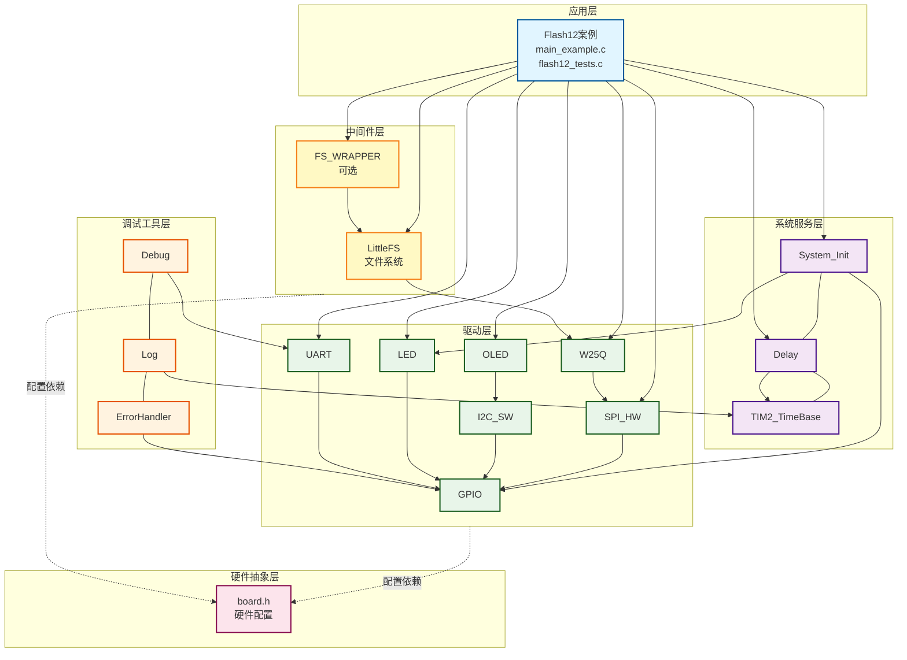
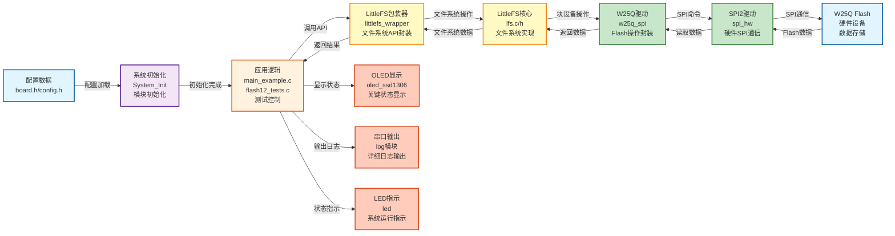

# Flash12 - LittleFS文件系统综合测试案例

## 📋 案例目的

- **核心目标**：演示LittleFS文件系统在W25Q SPI Flash上的完整功能测试，包括文件操作、目录操作、文件属性、原子操作、断电保护等11个综合测试

### 核心功能

1. **文件系统初始化**：初始化LittleFS文件系统，支持挂载和格式化操作
2. **基础文件操作**：
   - **文件创建与写入**：创建文件并写入数据，使用文件同步确保数据落盘
   - **文件读取与验证**：读取文件内容并与写入数据对比验证
   - **文件定位**：使用`LittleFS_FileSeek`定位文件位置
   - **追加写入**：在文件末尾追加数据
3. **文件管理操作**：
   - **文件截断**：使用`LittleFS_FileTruncate`截断文件
   - **文件重命名**：使用`LittleFS_FileRename`重命名文件
   - **文件删除**：使用`LittleFS_FileDelete`删除文件
4. **目录操作**：
   - **目录创建**：创建测试目录
   - **目录列表**：列出目录下的所有文件和目录
   - **目录删除**：删除目录
5. **文件属性操作**：
   - **属性设置**：使用`lfs_setattr`设置文件属性
   - **属性读取**：使用`lfs_getattr`读取文件属性
   - **属性删除**：使用`lfs_removeattr`删除文件属性
6. **高级功能**：
   - **原子操作**：确保数据完整性，防止写入过程中断电导致数据损坏
   - **断电保护**：验证数据在断电后能够正确恢复

### 学习重点

- 理解LittleFS文件系统的完整功能特性和操作流程
- 掌握LittleFS文件操作API的使用方法（打开、写入、读取、关闭、同步、定位、截断、重命名、删除）
- 学习目录操作API的使用方法（创建、列表、删除）
- 了解文件属性操作API的使用方法（设置、读取、删除）
- 掌握原子操作和断电保护机制
- 了解文件系统挂载和格式化的时机和条件
- 掌握文件句柄的正确使用方法（清零、独立缓存缓冲区）
- 学习文件系统信息查询方法

### 应用场景

适用于需要在外部Flash上实现完整文件系统功能的应用，如数据日志存储、配置文件管理、固件更新、参数保存、数据持久化等场景。

## 🔧 硬件要求

### 必需外设

- **LED1**：连接到 `PA1`（系统状态指示）

### 传感器/模块

#### W25Q SPI Flash模块

| 引脚 | STM32连接 | 说明 |
|------|-----------|------|
| CS | PA11 | 片选信号（软件NSS模式） |
| SCK | PB13 | SPI2时钟信号 |
| MISO | PB14 | SPI2主入从出（数据接收） |
| MOSI | PB15 | SPI2主出从入（数据发送） |
| VCC | 3.3V | **⚠️ 重要：必须使用3.3V，不能使用5V！** |
| GND | GND | 电源地 |

**⚠️ 重要提示**：
- W25Q系列Flash使用3.3V供电，使用5V会损坏芯片
- CS引脚使用软件NSS模式，由软件控制拉低/拉高
- 确保电源稳定，避免写入过程中断电

#### OLED显示屏（软件I2C接口）

| 引脚 | STM32连接 | 说明 |
|------|-----------|------|
| SCL | PB8 | 软件I2C时钟线 |
| SDA | PB9 | 软件I2C数据线 |
| VCC | 3.3V | 电源 |
| GND | GND | 电源地 |

#### UART1（用于详细日志输出）

| 引脚 | STM32连接 | 说明 |
|------|-----------|------|
| TX | PA9 | UART1发送 |
| RX | PA10 | UART1接收 |
| 波特率 | 115200 | 串口通信波特率 |

**连接说明**：将UART1连接到USB转串口模块，用于查看详细日志输出。

## 📦 模块依赖

### 模块依赖关系图



### 模块列表

本案例使用以下模块：

- **`littlefs_wrapper`**：LittleFS文件系统包装器模块（核心模块）
- **`w25q_spi`**：W25Q SPI Flash驱动模块（LittleFS底层存储）
- **`spi_hw`**：硬件SPI驱动模块（W25Q使用SPI2）
- **`gpio`**：GPIO驱动模块（SPI、I2C、UART、LED依赖）
- **`led`**：LED驱动模块（状态指示）
- **`oled_ssd1306`**：OLED显示模块（关键信息显示）
- **`uart`**：UART驱动模块（详细日志输出）
- **`i2c_sw`**：软件I2C驱动模块（OLED使用）
- **`delay`**：延时模块（非阻塞延时）
- **`error_handler`**：错误处理模块（统一错误处理）
- **`log`**：日志模块（分级日志输出）
- **`fs_wrapper`**：FS_WRAPPER模块（测试12使用，可选）

## 🔄 实现流程

### 整体逻辑

本案例通过LittleFS文件系统在W25Q Flash上实现完整的文件系统功能测试。程序执行分为以下几个阶段：

1. **系统初始化阶段**（步骤1-10）：
   - 调用`System_Init()`初始化系统基础模块（GPIO、LED、delay、TIM2）
   - 初始化UART1用于串口日志输出
   - 初始化Debug和Log模块
   - 初始化软件I2C和OLED用于状态显示
   - 初始化SPI2和W25Q模块

2. **文件系统初始化阶段**（步骤11-13）：
   - 初始化LittleFS文件系统
   - 尝试挂载文件系统
   - 如果挂载失败或启用强制格式化模式，则格式化文件系统
   - 重新挂载文件系统

3. **底层Flash硬件测试阶段**（步骤14）：
   - 擦除测试扇区
   - 写入测试数据
   - 读取并验证数据一致性
   - 验证底层Flash硬件是否正常工作

4. **综合功能测试阶段**（步骤15）：
   - **测试1**：文件系统初始化测试（查询文件系统信息）
   - **测试2**：基础文件操作测试（创建、写入、读取、验证）
   - **测试3**：文件定位测试（使用`LittleFS_FileSeek`定位文件位置）
   - **测试4**：追加写入测试（在文件末尾追加数据）
   - **测试5**：文件重命名测试（使用`LittleFS_FileRename`重命名文件）
   - **测试6**：文件删除测试（使用`LittleFS_FileDelete`删除文件）
   - **测试7**：目录操作测试（创建、列表、删除目录）
   - **测试8**：文件属性测试（设置、读取、删除文件属性）
   - **测试9前重新格式化**（如果配置了`CONFIG_LITTLEFS_REFORMAT_BEFORE_TEST10`）
   - **测试9**：文件截断测试（使用`LittleFS_FileTruncate`截断文件）
   - **测试10**：原子操作测试（确保数据完整性）
   - **测试11**：断电保护测试（验证数据持久性）
   - **测试12**：FS_WRAPPER接口验证（可选）

5. **主循环阶段**（步骤16-17）：
   - LED闪烁指示系统运行
   - OLED显示运行状态和循环计数

### 详细步骤说明

#### 步骤1：系统初始化

```c
System_Init();
```

- **功能**：初始化系统基础模块（GPIO、LED、delay、TIM2）
- **设计原则**：符合AUTOSAR分层架构，系统服务层统一管理基础模块

#### 步骤2：UART初始化

```c
uart_status = UART_Init(UART_INSTANCE_1);
```

- **功能**：初始化UART1用于串口日志输出（PA9/TX, PA10/RX, 115200）
- **设计原则**：驱动层统一管理硬件外设，错误处理统一

#### 步骤3：Debug模块初始化

```c
debug_status = Debug_Init(DEBUG_MODE_UART, 115200);
```

- **功能**：初始化Debug模块，使用UART模式输出调试信息
- **设计原则**：调试工具层统一管理调试输出

#### 步骤4：Log模块初始化

```c
log_config.level = LOG_LEVEL_INFO;
log_status = Log_Init(&log_config);
```

- **功能**：初始化Log模块，配置日志级别和输出选项
- **设计原则**：配置驱动设计，通过配置结构体灵活配置功能

#### 步骤5：输出初始化信息

```c
LOG_INFO("MAIN", "=== Flash12 - LittleFS文件系统综合测试案例 ===");
```

- **功能**：输出案例标题和初始化状态信息
- **设计原则**：统一日志输出，便于调试和追踪

#### 步骤6：LED初始化

```c
if (LED_Init() != LED_OK) { ... }
```

- **功能**：初始化LED模块，用于系统状态指示
- **设计原则**：驱动层统一管理硬件外设，错误处理统一

#### 步骤7：软件I2C初始化

```c
i2c_status = I2C_SW_Init(SOFT_I2C_INSTANCE_1);
```

- **功能**：初始化软件I2C模块（PB8/SCL, PB9/SDA），OLED需要
- **设计原则**：驱动层统一管理硬件外设，错误处理统一

#### 步骤8：OLED初始化

```c
oled_status = OLED_Init();
OLED_Clear();
OLED_ShowString(1, 1, "Flash12");
```

- **功能**：初始化OLED显示屏，显示初始化状态
- **设计原则**：驱动层统一管理硬件外设，错误处理统一

#### 步骤9：SPI初始化

```c
GPIO_Config(SPI2_NSS_PORT, SPI2_NSS_PIN, GPIO_MODE_OUTPUT_PP, GPIO_SPEED_50MHz);
spi_status = SPI_HW_Init(SPI_INSTANCE_2);
```

- **功能**：配置SPI2 NSS引脚为GPIO输出（软件NSS模式），初始化SPI2（PB13/SCK, PB14/MISO, PB15/MOSI, PA11/CS）
- **设计原则**：使用board.h中定义的宏，避免硬编码，符合配置驱动设计

#### 步骤10：W25Q初始化

```c
w25q_status = W25Q_Init();
const w25q_dev_t* dev_info = W25Q_GetInfo();
```

- **功能**：初始化W25Q模块，自动识别型号、配置4字节模式（如果需要），获取设备信息
- **设计原则**：驱动层统一管理硬件外设，错误处理统一

#### 步骤11：LittleFS初始化

```c
LittleFS_Status_t littlefs_status = LittleFS_Init();
```

- **功能**：初始化LittleFS文件系统，配置块设备回调函数和文件系统参数
- **设计原则**：中间件层统一管理文件系统，错误处理统一

#### 步骤12：挂载前确保CS引脚配置正确

```c
GPIO_EnableClock(SPI2_NSS_PORT);
GPIO_Config(SPI2_NSS_PORT, SPI2_NSS_PIN, GPIO_MODE_OUTPUT_PP, GPIO_SPEED_50MHz);
GPIO_WritePin(SPI2_NSS_PORT, SPI2_NSS_PIN, Bit_SET);
```

- **功能**：确保SPI2 NSS引脚（CS）配置为推挽输出并拉高，避免挂载时CS引脚状态异常
- **设计原则**：使用GPIO模块API，避免直接操作寄存器，符合规范

#### 步骤13：挂载LittleFS文件系统

```c
#ifdef CONFIG_LITTLEFS_FORCE_FORMAT
    littlefs_status = LittleFS_Format();
#endif
littlefs_status = LittleFS_Mount();
if (littlefs_status == LITTLEFS_ERROR_CORRUPT || littlefs_status == LITTLEFS_ERROR_NOSPC) {
    littlefs_status = LittleFS_Format();
    littlefs_status = LittleFS_Mount();
}
```

- **功能**：如果配置了强制格式化，先格式化文件系统；尝试挂载文件系统，如果挂载失败（损坏或NOSPC错误），则格式化后重新挂载
- **设计原则**：配置驱动设计，通过`CONFIG_LITTLEFS_FORCE_FORMAT`控制格式化行为；防御性编程，自动处理挂载失败情况

#### 步骤14：底层Flash硬件测试

```c
W25Q_EraseSector(0x10000);
W25Q_Write(0x10000, test_write, sizeof(test_write));
W25Q_Read(0x10000, test_read, sizeof(test_read));
memcmp(test_write, test_read, sizeof(test_write));
```

- **功能**：擦除测试扇区，写入测试数据，读取并验证数据一致性，验证底层Flash硬件是否正常工作
- **设计原则**：防御性编程，在文件系统测试前验证底层硬件是否正常

#### 步骤15：执行11个综合测试

```c
run_all_flash12_tests();
```

- **功能**：依次执行11个综合测试，验证LittleFS文件系统的完整功能
- **测试顺序**：
  1. **测试1**：文件系统初始化测试（查询文件系统信息）
  2. **测试2**：基础文件操作测试（创建、写入、读取、验证）
  3. **测试3**：文件定位测试（使用`LittleFS_FileSeek`定位文件位置）
  4. **测试4**：追加写入测试（在文件末尾追加数据）
  5. **测试5**：文件重命名测试（使用`LittleFS_FileRename`重命名文件）
  6. **测试6**：文件删除测试（使用`LittleFS_FileDelete`删除文件）
  7. **测试7**：目录操作测试（创建、列表、删除目录）
  8. **测试8**：文件属性测试（设置、读取、删除文件属性）
  9. **测试9前重新格式化**（如果配置了`CONFIG_LITTLEFS_REFORMAT_BEFORE_TEST10`）
  10. **测试9**：文件截断测试（使用`LittleFS_FileTruncate`截断文件）
  11. **测试10**：原子操作测试（确保数据完整性）
  12. **测试11**：断电保护测试（验证数据持久性）
  13. **测试12**：FS_WRAPPER接口验证（可选）
- **设计原则**：模块化设计，每个测试独立实现，便于维护和扩展；测试9前重新格式化确保文件截断测试在干净的文件系统上运行，解决元数据空间不足问题

#### 步骤16：显示初始化完成

```c
OLED_Clear();
OLED_ShowString(1, 1, "Flash12");
OLED_ShowString(2, 1, "All Tests Done");
```

- **功能**：清除OLED屏幕，显示测试完成状态
- **设计原则**：用户界面友好，清晰显示系统状态

#### 步骤17：主循环

```c
while (1) {
    loop_count++;
    LED_Toggle(LED_1);
    if (loop_count % 10 == 0) {
        OLED_ShowString(4, 1, buf);
        LOG_INFO("MAIN", "主循环运行中... (循环 %lu)", (unsigned long)loop_count);
    }
    Delay_ms(500);
}
```

- **功能**：LED闪烁指示系统运行，每10次循环（约5秒）更新一次OLED显示和日志输出
- **设计原则**：非阻塞延时，不影响系统响应性

### 关键设计原则体现

1. **AUTOSAR分层架构**：
   - 应用层（`main_example.c`、`flash12_tests.c`）→ 系统服务层（`System_Init`、`Delay`）→ 驱动层（`SPI_HW`、`W25Q`、`OLED`）→ 中间件层（`LittleFS`）→ 硬件抽象层（`board.h`）
   - 各层职责清晰，依赖关系明确

2. **防御性编程**：
   - 所有函数调用都检查返回值
   - 挂载失败时自动格式化并重新挂载
   - 测试9前重新格式化确保文件截断测试在干净的文件系统上运行
   - 底层Flash硬件测试验证硬件是否正常

3. **配置驱动设计**：
   - 使用`CONFIG_LITTLEFS_FORCE_FORMAT`控制格式化行为
   - 使用`CONFIG_LITTLEFS_REFORMAT_BEFORE_TEST10`控制测试9前是否重新格式化
   - 使用`CONFIG_MODULE_FS_WRAPPER_ENABLED`控制测试12是否执行

4. **统一错误处理**：
   - 使用`ErrorHandler_Handle()`统一处理错误
   - 所有错误都通过Log模块输出详细日志

5. **模块化架构**：
   - 每个测试独立实现，便于维护和扩展
   - 测试函数统一接口，便于调用和管理

### 数据流向图



### 工作流程示意图

```mermaid
flowchart TD
    START([程序启动]) --> SYS_INIT[步骤1: 系统初始化<br/>System_Init]
    SYS_INIT --> UART_INIT[步骤2: UART初始化<br/>UART_Init]
    UART_INIT --> DEBUG_INIT[步骤3: Debug初始化<br/>Debug_Init]
    DEBUG_INIT --> LOG_INIT[步骤4: Log初始化<br/>Log_Init]
    LOG_INIT --> LED_INIT[步骤6: LED初始化<br/>LED_Init]
    LED_INIT --> I2C_INIT[步骤7: 软件I2C初始化<br/>I2C_SW_Init]
    I2C_INIT --> OLED_INIT[步骤8: OLED初始化<br/>OLED_Init]
    OLED_INIT --> SPI_INIT[步骤9: SPI2初始化<br/>SPI_HW_Init]
    SPI_INIT --> W25Q_INIT[步骤10: W25Q初始化<br/>W25Q_Init]
    W25Q_INIT --> LITTLEFS_INIT[步骤11: LittleFS初始化<br/>LittleFS_Init]
    
    LITTLEFS_INIT --> CS_CONFIG[步骤12: 配置CS引脚<br/>GPIO_Config]
    CS_CONFIG --> MOUNT[步骤13: 挂载文件系统<br/>LittleFS_Mount]
    MOUNT --> MOUNT_CHECK{挂载结果}
    MOUNT_CHECK -->|成功| FLASH_TEST[步骤14: 底层Flash硬件测试<br/>W25Q读写验证]
    MOUNT_CHECK -->|失败| FORMAT_CHECK{强制格式化模式}
    
    FORMAT_CHECK -->|是| FORMAT[格式化文件系统<br/>LittleFS_Format]
    FORMAT_CHECK -->|否| FORMAT
    FORMAT --> REMOUNT[重新挂载文件系统<br/>LittleFS_Mount]
    REMOUNT --> FLASH_TEST
    
    FLASH_TEST --> TEST1[步骤15: 测试1<br/>文件系统初始化测试]
    TEST1 --> TEST2[测试2: 基础文件操作]
    TEST2 --> TEST3[测试3: 文件定位]
    TEST3 --> TEST4[测试4: 追加写入]
    TEST4 --> TEST5[测试5: 文件重命名]
    TEST5 --> TEST6[测试6: 文件删除]
    TEST6 --> TEST7[测试7: 目录操作]
    TEST7 --> TEST8[测试8: 文件属性]
    TEST8 --> REFORMAT_CHECK{测试9前重新格式化}
    REFORMAT_CHECK -->|是| REFORMAT[重新格式化文件系统]
    REFORMAT_CHECK -->|否| TEST9
    REFORMAT --> TEST9[测试9: 文件截断]
    TEST9 --> TEST10[测试10: 原子操作]
    TEST10 --> TEST11[测试11: 断电保护]
    TEST11 --> TEST12[测试12: FS_WRAPPER接口验证<br/>可选]
    TEST12 --> MAIN_LOOP[步骤16-17: 主循环<br/>LED闪烁指示]
    MAIN_LOOP --> MAIN_LOOP
    
    %% 样式
    style START fill:#e1f5ff,stroke:#01579b,stroke-width:2px
    style SYS_INIT fill:#f3e5f5,stroke:#4a148c,stroke-width:2px
    style W25Q_INIT fill:#c8e6c9,stroke:#2e7d32,stroke-width:2px
    style LITTLEFS_INIT fill:#fff9c4,stroke:#f57f17,stroke-width:2px
    style MOUNT fill:#fff9c4,stroke:#f57f17,stroke-width:2px
    style FORMAT fill:#fff9c4,stroke:#f57f17,stroke-width:2px
    style FLASH_TEST fill:#fff3e0,stroke:#e65100,stroke-width:2px
    style TEST1 fill:#fff3e0,stroke:#e65100,stroke-width:2px
    style TEST2 fill:#fff3e0,stroke:#e65100,stroke-width:2px
    style TEST3 fill:#fff3e0,stroke:#e65100,stroke-width:2px
    style TEST4 fill:#fff3e0,stroke:#e65100,stroke-width:2px
    style TEST5 fill:#fff3e0,stroke:#e65100,stroke-width:2px
    style TEST6 fill:#fff3e0,stroke:#e65100,stroke-width:2px
    style TEST7 fill:#fff3e0,stroke:#e65100,stroke-width:2px
    style TEST8 fill:#fff3e0,stroke:#e65100,stroke-width:2px
    style REFORMAT fill:#fff9c4,stroke:#f57f17,stroke-width:2px
    style TEST9 fill:#fff3e0,stroke:#e65100,stroke-width:2px
    style TEST10 fill:#fff3e0,stroke:#e65100,stroke-width:2px
    style TEST11 fill:#fff3e0,stroke:#e65100,stroke-width:2px
    style TEST12 fill:#fff3e0,stroke:#e65100,stroke-width:2px
    style MAIN_LOOP fill:#e1f5ff,stroke:#01579b,stroke-width:2px
```



## 📚 关键函数说明

### LittleFS相关函数

- **`LittleFS_Init()`**：初始化LittleFS文件系统
  - 在本案例中用于初始化LittleFS，配置块设备回调函数和文件系统参数
  - 必须在使用LittleFS前调用，初始化失败时返回错误码

- **`LittleFS_Mount()`**：挂载文件系统
  - 在本案例中用于挂载文件系统，如果文件系统不存在或损坏会返回错误
  - 挂载成功后才能进行文件操作

- **`LittleFS_Format()`**：格式化文件系统
  - 在本案例中用于格式化文件系统，清除所有数据
  - 在挂载失败或启用强制格式化模式时使用

- **`LittleFS_Unmount()`**：卸载文件系统
  - 在本案例中用于测试9前卸载文件系统，准备重新格式化
  - 卸载后需要重新挂载才能进行文件操作

- **`LittleFS_GetInfo()`**：获取文件系统信息
  - 在本案例中用于查询文件系统的总空间和空闲空间
  - 返回文件系统的容量和可用空间信息

- **`LittleFS_FileOpen()`**：打开文件
  - 在本案例中用于打开文件进行读写操作
  - 支持多种打开模式（`LFS_O_RDONLY`、`LFS_O_WRONLY`、`LFS_O_CREAT`等）
  - **⚠️ 重要**：文件句柄在使用前必须清零（`memset(&file, 0, sizeof(file))`）

- **`LittleFS_FileWrite()`**：写入文件
  - 在本案例中用于写入测试数据
  - 写入后必须调用`LittleFS_FileSync()`确保数据落盘

- **`LittleFS_FileSync()`**：同步文件
  - 在本案例中用于确保写入的数据落盘到Flash
  - **⚠️ 重要**：所有写入操作后必须调用此函数，否则数据可能在断电后丢失

- **`LittleFS_FileRead()`**：读取文件
  - 在本案例中用于读取文件内容进行验证
  - 返回实际读取的字节数

- **`LittleFS_FileSeek()`**：定位文件位置
  - 在本案例中用于定位文件位置，支持`LFS_SEEK_SET`、`LFS_SEEK_CUR`、`LFS_SEEK_END`
  - 测试3使用此函数验证文件定位功能

- **`LittleFS_FileTruncate()`**：截断文件
  - 在本案例中用于截断文件到指定大小
  - 测试9使用此函数验证文件截断功能

- **`LittleFS_FileRename()`**：重命名文件
  - 在本案例中用于重命名文件
  - 测试5使用此函数验证文件重命名功能

- **`LittleFS_FileDelete()`**：删除文件
  - 在本案例中用于删除文件
  - 测试6使用此函数验证文件删除功能

- **`LittleFS_FileSize()`**：获取文件大小
  - 在本案例中用于获取文件大小，验证文件操作结果
  - 返回文件的实际大小（字节数）

- **`LittleFS_FileClose()`**：关闭文件
  - 在本案例中用于关闭文件，释放资源
  - 所有文件操作完成后必须关闭文件

- **`LittleFS_DirCreate()`**：创建目录
  - 在本案例中用于创建测试目录
  - 如果目录已存在，返回`LITTLEFS_ERROR_EXIST`

- **`LittleFS_DirOpen()`**：打开目录
  - 在本案例中用于打开根目录（使用`"."`表示当前目录）
  - 目录句柄在使用前必须清零

- **`LittleFS_DirRead()`**：读取目录项
  - 在本案例中用于循环读取目录项，列出所有文件和目录
  - 目录读取完成后返回`LITTLEFS_ERROR_NOENT`

- **`LittleFS_DirClose()`**：关闭目录
  - 在本案例中用于关闭目录，释放资源
  - 所有目录操作完成后必须关闭目录

- **`LittleFS_DirDelete()`**：删除目录
  - 在本案例中用于删除目录
  - 测试7使用此函数验证目录删除功能

- **`lfs_setattr()`**：设置文件属性
  - 在本案例中用于设置文件属性（键值对）
  - 测试8使用此函数验证文件属性设置功能

- **`lfs_getattr()`**：读取文件属性
  - 在本案例中用于读取文件属性
  - 测试8使用此函数验证文件属性读取功能

- **`lfs_removeattr()`**：删除文件属性
  - 在本案例中用于删除文件属性
  - 测试8使用此函数验证文件属性删除功能

### W25Q相关函数

- **`W25Q_Init()`**：初始化W25Q模块
  - 在本案例中用于初始化W25Q，自动识别型号、配置4字节模式（如果需要）
  - 必须在使用W25Q前调用

- **`W25Q_GetInfo()`**：获取设备信息
  - 在本案例中用于读取设备容量等信息
  - 返回只读指针，包含设备的所有信息

- **`W25Q_EraseSector()`**：擦除扇区
  - 在本案例中用于底层Flash硬件测试，擦除测试扇区
  - 擦除后需要等待Flash就绪

- **`W25Q_Write()`**：写入数据
  - 在本案例中用于底层Flash硬件测试，写入测试数据
  - 写入后需要等待Flash就绪

- **`W25Q_Read()`**：读取数据
  - 在本案例中用于底层Flash硬件测试，读取测试数据
  - 返回读取的字节数

- **`W25Q_WaitReady()`**：等待Flash就绪
  - 在本案例中用于等待Flash操作完成
  - 擦除和写入后需要等待Flash就绪

### OLED相关函数

- **`OLED_Init()`**：初始化OLED显示屏
  - 在本案例中用于初始化OLED，显示关键状态信息
  - 使用软件I2C接口（PB8/9）

- **`OLED_ShowString()`**：显示字符串
  - 在本案例中用于显示测试状态、操作结果、验证结果等
  - 输出内容为全英文ASCII字符，符合项目规范

- **`OLED_Clear()`**：清屏
  - 在本案例中用于清除屏幕内容，准备显示新信息

### UART相关函数

- **`LOG_INFO()`**：Log模块的信息级别输出
  - 在本案例中用于输出详细日志、文件系统信息、操作进度等
  - 遵循项目规范的串口输出规范（使用Log模块，支持中文GB2312编码）

- **`LOG_ERROR()`**：Log模块的错误级别输出
  - 在本案例中用于输出错误信息、验证失败信息等
  - 支持中文描述，便于开发调试

- **`LOG_WARN()`**：Log模块的警告级别输出
  - 在本案例中用于输出警告信息，如挂载失败时尝试格式化

**详细函数实现和调用示例请参考**：`main_example.c` 和 `flash12_tests.c` 中的代码

## ⚠️ 注意事项与重点

### ⚠️ 重要提示

1. **文件句柄清零**：
   - 每次使用文件句柄前必须清零（`memset(&file, 0, sizeof(file))`）
   - 未清零的文件句柄可能包含脏数据，导致文件操作失败
   - 目录句柄同样需要清零

2. **文件同步机制**：
   - 所有写入操作后必须调用`LittleFS_FileSync()`确保数据落盘
   - 未同步的数据可能在断电后丢失
   - 文件关闭前建议先同步

3. **文件路径格式**：
   - 使用相对路径（如`"/test2.txt"`），不要使用绝对路径（如`"//test2.txt"`）
   - 路径格式错误会导致文件操作失败（返回`LFS_ERR_NOENT`）
   - 与目录列表中的路径格式保持一致

4. **文件系统挂载**：
   - 首次使用或文件系统损坏时需要格式化
   - 格式化会清除所有数据，仅在必要时使用
   - 支持强制格式化模式（`CONFIG_LITTLEFS_FORCE_FORMAT`）
   - 挂载失败时自动格式化并重新挂载（处理`LITTLEFS_ERROR_CORRUPT`和`LITTLEFS_ERROR_NOSPC`）

5. **测试9前重新格式化**：
   - 如果配置了`CONFIG_LITTLEFS_REFORMAT_BEFORE_TEST10`，测试9前会重新格式化文件系统
   - 这确保了文件截断测试在干净的文件系统上运行，解决元数据空间不足问题
   - 测试顺序经过优化，确保每个测试在合适的文件系统状态下运行

6. **电源要求**：
   - W25Q系列Flash使用3.3V供电，**不能使用5V**（会损坏芯片）
   - 确保电源稳定，避免写入过程中断电
   - 写入过程中断电可能导致数据损坏或文件系统损坏

7. **SPI配置**：
   - 本案例使用SPI2，引脚：PB13(SCK), PB14(MISO), PB15(MOSI), PA11(CS)
   - 使用软件NSS模式，CS引脚由软件控制
   - SPI模式：CPOL=Low, CPHA=1Edge（模式0）

### 🔑 关键点

1. **文件操作流程**：
   - 打开文件 → 写入/读取数据 → 同步（写入时） → 关闭文件
   - 文件句柄必须清零，文件同步确保数据落盘

2. **目录操作流程**：
   - 打开目录 → 循环读取目录项 → 关闭目录
   - 目录句柄必须清零，读取完成后返回`LITTLEFS_ERROR_NOENT`

3. **文件系统状态管理**：
   - 文件系统必须先挂载才能进行文件操作
   - 挂载失败时需要格式化，格式化后重新挂载
   - 测试9前重新格式化确保文件截断测试在干净的文件系统上运行

4. **数据验证方法**：
   - 写入后必须读取验证
   - 使用`strcmp()`或`memcmp()`对比数据
   - 验证失败时应检查文件同步、路径格式、文件句柄等

5. **错误处理**：
   - 所有文件操作必须检查返回值
   - 常见错误码：`LITTLEFS_ERROR_NOENT`（文件不存在）、`LITTLEFS_ERROR_NOT_MOUNTED`（未挂载）、`LITTLEFS_ERROR_NOSPC`（空间不足）
   - 使用`ErrorHandler_Handle()`处理错误

6. **测试顺序优化**：
   - 测试顺序经过优化，确保每个测试在合适的文件系统状态下运行
   - 测试9前重新格式化解决元数据空间不足问题
   - 测试5（文件重命名）在测试9（文件截断）之前执行，避免元数据空间不足

## 🔍 常见问题排查

#### 问题1：文件打开失败，返回`LITTLEFS_ERROR_NOENT`（-3905）

**可能原因**：
- **路径格式错误**（最常见！）：使用了错误的路径格式
- 文件不存在（写入前未创建或文件已被删除）
- 文件系统未挂载

**解决方法**：
1. **检查路径格式**：
   - 使用相对路径（如`"/test2.txt"`），不要使用错误的路径格式
   - 与目录列表中的路径格式保持一致
2. **检查文件是否存在**：
   - 使用`lfs_stat`检查文件是否存在
   - 确保写入操作成功完成
3. **检查文件系统状态**：
   - 确保文件系统已成功挂载（`LittleFS_Mount()`返回`LITTLEFS_OK`）

#### 问题2：文件写入成功，但读取的数据不正确

**可能原因**：
- **文件未同步**（最常见！）：写入后未调用`LittleFS_FileSync()`
- 文件句柄未清零，导致文件操作失败
- 文件系统损坏

**解决方法**：
1. **检查文件同步**：
   - 确保写入后调用`LittleFS_FileSync()`并检查返回值
   - 文件关闭前建议先同步
2. **检查文件句柄**：
   - 确保文件句柄在使用前清零（`memset(&file, 0, sizeof(file))`）
3. **检查文件系统状态**：
   - 尝试重新格式化文件系统
   - 检查Flash是否损坏

#### 问题3：目录列表为空或读取失败

**可能原因**：
- 目录句柄未清零
- 目录打开失败（路径错误或文件系统未挂载）
- 目录读取逻辑错误（未正确处理`LITTLEFS_ERROR_NOENT`）

**解决方法**：
1. **检查目录句柄**：
   - 确保目录句柄在使用前清零（`memset(&dir, 0, sizeof(dir))`）
2. **检查目录路径**：
   - 使用`"."`表示当前目录（根目录）
   - 确保文件系统已成功挂载
3. **检查读取逻辑**：
   - 正确处理`LITTLEFS_ERROR_NOENT`（表示目录读取完成）
   - 循环读取直到返回`LITTLEFS_ERROR_NOENT`

#### 问题4：文件系统挂载失败

**可能原因**：
- 文件系统未格式化（首次使用）
- 文件系统损坏（断电、写入失败等）
- Flash损坏

**解决方法**：
1. **检查格式化状态**：
   - 首次使用需要格式化（挂载失败时自动格式化）
   - 启用强制格式化模式（`CONFIG_LITTLEFS_FORCE_FORMAT=1`）
2. **检查Flash状态**：
   - 检查W25Q初始化是否成功
   - 检查Flash是否损坏（使用Flash01案例测试）
3. **检查电源**：
   - 确保电源稳定，避免写入过程中断电

#### 问题5：测试5、9、10、11返回`LITTLEFS_ERROR_NOSPC`（-3912）

**可能原因**：
- 元数据空间不足（文件系统碎片化）
- 前面的测试创建的文件未清理，占用了元数据空间
- 文件截断需要额外的元数据空间来重新组织文件结构

**解决方法**：
1. **检查测试顺序**：
   - 测试顺序已经过优化，测试9前会重新格式化文件系统
   - 确保`CONFIG_LITTLEFS_REFORMAT_BEFORE_TEST10=1`
2. **检查文件系统状态**：
   - 使用`check_filesystem_status()`检查文件系统空间状态
   - 如果元数据空间不足，需要重新格式化
3. **检查测试逻辑**：
   - 确保测试9在重新格式化后执行
   - 测试5（文件重命名）在测试9（文件截断）之前执行

#### 问题6：文件截断测试失败

**可能原因**：
- 文件系统元数据空间不足（文件系统碎片化）
- 文件截断需要额外的元数据空间来重新组织文件结构
- 测试9前未重新格式化文件系统

**解决方法**：
1. **检查重新格式化配置**：
   - 确保`CONFIG_LITTLEFS_REFORMAT_BEFORE_TEST10=1`
   - 测试9前会自动重新格式化文件系统
2. **检查文件系统状态**：
   - 使用`check_filesystem_status()`检查文件系统空间状态
   - 如果元数据空间不足，需要重新格式化
3. **检查测试顺序**：
   - 确保测试9在重新格式化后执行
   - 测试5（文件重命名）在测试9（文件截断）之前执行

## 💡 扩展练习

### 循序渐进理解本案例

1. **修改测试数据**：尝试写入不同的数据（更长的字符串、二进制数据等），理解文件系统的数据存储特性
2. **测试多文件操作**：创建多个文件，测试文件系统的多文件管理能力
3. **测试目录嵌套**：创建多级目录结构，理解文件系统的目录管理机制
4. **测试文件属性**：设置多个文件属性，理解文件属性的存储机制
5. **测试原子操作**：模拟断电场景，验证原子操作的数据完整性

### 实际场景中的常见坑点

6. **文件句柄未清零**（⚠️ 最容易浪费时间的坑点）：
   - 如果文件句柄未清零，可能包含脏数据，导致文件操作失败
   - 症状：文件打开失败、读取数据不正确、文件操作返回错误
   - 如何检测：检查文件句柄是否在使用前清零（`memset(&file, 0, sizeof(file))`）
   - 如何处理：所有文件操作前必须清零文件句柄
   - **教训**：如果不了解文件句柄清零，很容易调试几个小时都找不到问题原因！

7. **文件未同步**：如果写入后未调用`LittleFS_FileSync()`，数据可能未落盘。如何检测和处理这种情况？如何实现自动同步机制？

8. **路径格式错误**：如果使用错误的路径格式，文件操作会失败。如何检测和处理？如何统一路径格式？

9. **目录读取逻辑错误**：如果未正确处理`LITTLEFS_ERROR_NOENT`（表示目录读取完成），会导致无限循环。如何正确实现目录读取逻辑？

10. **文件系统损坏**：如果文件系统损坏，挂载会失败。如何检测文件系统损坏？如何实现自动修复机制？

11. **元数据空间不足**：如果文件系统碎片化，元数据空间可能不足。如何检测和处理？如何优化文件系统使用？

## 📖 相关文档

- **模块文档**：
  - **LittleFS包装器**：`../../Middlewares/storage/littlefs/littlefs_wrapper.c/h`
  - **LittleFS核心**：`../../Middlewares/storage/littlefs/lfs.c/h`
  - **W25Q驱动**：`../../Drivers/flash/w25q_spi.c/h`
  - **W25Q模块文档**：`../../Drivers/flash/README.md`
  - **SPI驱动**：`../../Drivers/spi/spi_hw.c/h`
  - **OLED驱动**：`../../Drivers/display/oled_ssd1306.c/h`
  - **UART驱动**：`../../Drivers/uart/uart.c/h`
  - **软件I2C驱动**：`../../Drivers/i2c/i2c_sw.c/h`

- **业务文档**：
  - **主程序代码**：`main_example.c`
  - **测试代码**：`flash12_tests.c`
  - **测试头文件**：`flash12_tests.h`
  - **硬件配置**：`board.h`
  - **模块配置**：`config.h`
  - **项目规范文档**：`../../PROJECT_KEYWORDS.md`
  - **案例参考**：`../../Examples/README.md`
  - **Flash01案例**：`../Flash01_W25Q_ReadWrite/README.md`（W25Q基础操作）
  - **Flash10案例**：`../Flash10_LittleFS_W25Q_ReadWrite/README.md`（LittleFS基础操作）
  - **Flash11案例**：`../Flash11_LittleFS_InlineFileFix_And_MemoryConfig/README.md`（LittleFS高级用法）

- **其他模块**：
  - **LED驱动**：`../../Drivers/basic/led.c/h`
  - **GPIO驱动**：`../../Drivers/basic/gpio.c/h`
  - **延时功能**：`../../System/delay.c/h`
  - **系统初始化**：`../../System/system_init.c/h`
  - **错误处理**：`../../Common/error_handler.c/h`
  - **日志模块**：`../../Debug/log.c/h`


