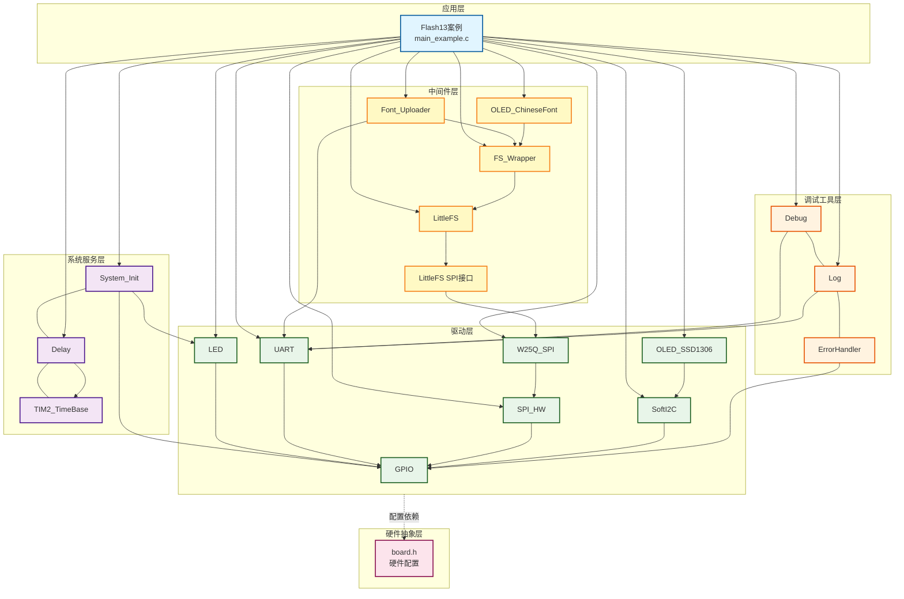

# Flash13 - 字库UART上传示例

## 📋 案例目的

- **核心目标**：演示如何通过UART将字库文件（ASCII和中文字库）上传到STM32，并存储到W25Q Flash的文件系统中，然后使用该字库在OLED上显示

### 核心功能

1. **系统初始化**：
   - 初始化UART、OLED、SPI、W25Q、LittleFS文件系统
   - 配置日志级别为WARN，避免INFO日志干扰串口通信

2. **字库文件上传**：
   - 支持上传两种字库：ASCII字库（`/font/ASCII16.bin`）和中文字库（`/font/chinese16x16.bin`）
   - 通过发送'A'命令上传ASCII字库（8×16点阵，1536字节）
   - 通过发送'C'命令上传中文字库（16×16点阵GB2312，约261KB）
   - 使用自定义协议分段传输
   - 将字库文件写入文件系统

3. **字库初始化**：
   - 上传中文字库后，自动初始化中文字库模块
   - 验证字库文件是否存在和可读

4. **显示测试**：
   - 上传中文字库后，使用GB2312编码显示中文字符串
   - 演示中英文混显功能

### 学习重点

- 掌握UART文件传输协议的设计和实现
- 学习大文件分段传输的方法
- 理解字库的存储和读取机制（ASCII和中文字库）
- 掌握GB2312编码的使用
- 学习OLED中文显示的实现
- 掌握命令驱动的文件上传机制（'A'和'C'命令）

### 应用场景

适用于需要动态更新字库、显示中文信息的应用，如中文菜单系统、中文日志显示、中文参数配置等场景。也适用于需要更新ASCII字库的应用，如自定义字体显示。

## 🔧 硬件要求

### 必需外设

- **LED1**：连接到 `PA1`（系统状态指示）

### 传感器/模块

#### W25Q SPI Flash模块

| 引脚 | STM32连接 | 说明 |
|------|-----------|------|
| CS | PA4 | 片选信号（软件NSS模式，SPI1） |
| SCK | PA5 | SPI1时钟信号 |
| MISO | PA6 | SPI1主入从出（数据接收） |
| MOSI | PA7 | SPI1主出从入（数据发送） |
| VCC | 3.3V | **⚠️ 重要：必须使用3.3V，不能使用5V！** |
| GND | GND | 电源地 |

**⚠️ 重要提示**：
- W25Q系列Flash使用3.3V供电，使用5V会损坏芯片
- CS引脚使用软件NSS模式，由软件控制拉低/拉高
- 确保电源稳定，避免写入过程中断电

#### OLED显示屏（软件I2C接口）

| 引脚 | STM32连接 | 说明 |
|------|-----------|------|
| SCL | PB8 | 软件I2C时钟线 |
| SDA | PB9 | 软件I2C数据线 |
| VCC | 3.3V | 电源 |
| GND | GND | 电源地 |

#### UART1（用于字库文件上传和日志输出）

| 引脚 | STM32连接 | 说明 |
|------|-----------|------|
| TX | PA9 | UART1发送 |
| RX | PA10 | UART1接收 |
| 波特率 | 115200 | 串口通信波特率 |

**连接说明**：将UART1连接到USB转串口模块，用于上传字库文件和查看日志输出。

## 📦 模块依赖

### 模块依赖关系图



### 模块列表

| 模块 | 说明 | 用途 |
|------|------|------|
| System_Init | 系统初始化 | 初始化系统基础模块 |
| Delay | 延时模块 | 提供延时功能 |
| TIM2_TimeBase | 基时定时器 | Delay模块依赖 |
| GPIO | GPIO驱动 | LED、SPI、I2C、UART依赖 |
| LED | LED驱动 | 系统状态指示 |
| SPI_HW | SPI硬件驱动 | W25Q通信接口（SPI1） |
| W25Q_SPI | W25Q Flash驱动 | Flash存储设备 |
| SoftI2C | 软件I2C驱动 | OLED通信接口 |
| OLED_SSD1306 | OLED显示驱动 | 状态显示和中文显示 |
| UART | UART驱动 | 串口通信和字库上传 |
| LittleFS | LittleFS文件系统 | 文件系统核心 |
| LittleFS SPI接口 | LittleFS SPI块设备 | W25Q与LittleFS桥接 |
| FS_Wrapper | 文件系统包装器 | 文件系统应用层接口 |
| Font_Uploader | 字库上传模块 | UART文件传输协议（支持ASCII和中文字库） |
| OLED_ChineseFont | 中文字库模块 | 中文字库读取和显示 |
| Debug | Debug模块 | 调试输出 |
| Log | 日志模块 | 日志记录（级别：WARN） |
| ErrorHandler | 错误处理模块 | 错误处理 |

## 🔄 实现流程

### 整体逻辑

本案例通过UART接收字库文件并写入文件系统，然后使用该字库在OLED上显示。整体流程如下：

1. **系统初始化阶段**：
   - 调用`System_Init()`初始化系统基础模块（GPIO、LED、delay、TIM2_TimeBase）
   - 初始化UART1用于字库文件上传和日志输出
   - 初始化Debug和Log模块（日志级别设置为WARN，避免干扰串口通信）
   - 初始化软件I2C和OLED用于状态显示
   - 初始化SPI1和W25Q模块
   - 初始化LittleFS文件系统
   - 初始化FS_Wrapper文件系统包装器

2. **等待上传命令阶段**：
   - 调用`FontUpload_WaitForCommand()`等待PC端发送'A'或'C'命令
   - 'A'命令：上传ASCII字库（`/font/ASCII16.bin`）
   - 'C'命令：上传中文字库（`/font/chinese16x16.bin`）
   - 收到命令后回复"OK\r\n"

3. **字库文件接收阶段**：
   - 调用`FontUpload_ReceiveFile()`接收字库文件
   - 使用自定义协议分段传输（每包最多256字节）
   - 将接收到的数据写入文件系统
   - 验证文件大小并完成传输

4. **字库初始化与测试阶段**：
   - 如果是中文字库，调用`OLED_ChineseFont_Init()`初始化中文字库模块
   - 使用GB2312编码显示中文字符串进行测试
   - 如果是ASCII字库，仅显示上传成功信息

### 数据流向图

```mermaid
%%{init: {'flowchart': {'curve': 'basis'}}}%%
flowchart LR
    subgraph "PC端"
        PYTHON[Python脚本<br/>send_ASCII_font.py<br/>send_chinese_font.py]
        FONT_FILE[字库文件<br/>ASCII16.bin<br/>chinese16x16.bin]
    end
    
    subgraph "UART传输"
        UART_PROTOCOL[UART传输协议<br/>'A'/'C'命令<br/>CMD_START/DATA/END<br/>分段传输]
    end
    
    subgraph "MCU端接收"
        FONT_UPLOADER[Font_Uploader<br/>接收字库文件]
        FS_WRAPPER[FS_Wrapper<br/>文件系统接口]
    end
    
    subgraph "存储层"
        LITTLEFS[LittleFS<br/>文件系统核心]
        W25Q[W25Q Flash<br/>字库文件存储]
    end
    
    subgraph "显示层"
        CHINESE_FONT[OLED_ChineseFont<br/>中文字库模块]
        OLED[OLED显示屏<br/>显示中文]
    end
    
    PYTHON -->|发送'A'/'C'命令| UART_PROTOCOL
    FONT_FILE -->|读取文件| PYTHON
    UART_PROTOCOL -->|接收命令和文件数据| FONT_UPLOADER
    FONT_UPLOADER -->|写入文件| FS_WRAPPER
    FS_WRAPPER -->|文件系统操作| LITTLEFS
    LITTLEFS -->|存储数据| W25Q
    W25Q -->|读取字库| CHINESE_FONT
    CHINESE_FONT -->|显示字符| OLED
```



### 关键方法

1. **命令驱动的文件上传机制**：
   - 使用'A'或'C'命令选择上传ASCII或中文字库
   - MCU无限等待命令，不会超时
   - 收到命令后回复"OK\r\n"确认

2. **分段传输协议**：
   - 使用CMD_START、CMD_DATA、CMD_END命令控制传输流程
   - 每包最多256字节，平衡传输效率和可靠性
   - MCU在接收数据时同步写入文件系统，减少内存占用

3. **文件系统集成**：
   - 字库文件存储在`/font`目录下
   - ASCII字库：`/font/ASCII16.bin`（1536字节）
   - 中文字库：`/font/chinese16x16.bin`（约261KB）

4. **自动初始化与测试**：
   - 上传中文字库后自动初始化中文字库模块
   - 使用GB2312编码显示中文字符串进行测试
   - 上传ASCII字库后仅显示上传成功信息

### 工作流程示意图

```mermaid
%%{init: {'flowchart': {'curve': 'basis'}}}%%
flowchart TD
    START([程序启动]) --> SYS_INIT[系统初始化 System_Init]
    SYS_INIT --> UART_INIT[UART初始化 UART_Init]
    UART_INIT --> DEBUG_INIT[Debug初始化 Debug_Init]
    DEBUG_INIT --> LOG_INIT[Log初始化 Log_Init<br/>级别WARN]
    LOG_INIT --> LED_INIT[LED初始化 LED_Init]
    LED_INIT --> I2C_INIT[软件I2C初始化 I2C_SW_Init]
    I2C_INIT --> OLED_INIT[OLED初始化 OLED_Init]
    OLED_INIT --> SPI_INIT[SPI1初始化 SPI_HW_Init]
    SPI_INIT --> W25Q_INIT[W25Q初始化 W25Q_Init]
    W25Q_INIT --> LITTLEFS_INIT[LittleFS初始化 LittleFS_Init]
    LITTLEFS_INIT --> FS_INIT[FS_Wrapper初始化 FS_Init]
    
    FS_INIT --> WAIT_CMD[等待上传命令<br/>FontUpload_WaitForCommand]
    WAIT_CMD -->|收到'A'命令| ASCII_CMD[ASCII字库命令]
    WAIT_CMD -->|收到'C'命令| CHINESE_CMD[中文字库命令]
    
    ASCII_CMD --> REPLY_OK1[回复OK]
    CHINESE_CMD --> REPLY_OK2[回复OK]
    
    REPLY_OK1 --> RECEIVE_FILE[接收字库文件<br/>FontUpload_ReceiveFile]
    REPLY_OK2 --> RECEIVE_FILE
    
    RECEIVE_FILE --> RECEIVE_START[接收CMD_START<br/>和文件大小]
    RECEIVE_START --> RECEIVE_DATA[循环接收数据包<br/>CMD_DATA + 数据]
    RECEIVE_DATA --> WRITE_FILE[写入文件系统<br/>FS_AppendFile]
    WRITE_DATA -->|继续接收| RECEIVE_DATA
    WRITE_FILE --> RECEIVE_END[接收CMD_END]
    RECEIVE_END --> CHECK_SIZE{检查文件大小}
    
    CHECK_SIZE -->|大小正确| UPLOAD_OK[上传成功]
    CHECK_SIZE -->|大小错误| UPLOAD_FAIL[上传失败]
    
    UPLOAD_OK --> CHECK_TYPE{检查字库类型}
    CHECK_TYPE -->|中文字库| FONT_INIT[初始化中文字库<br/>OLED_ChineseFont_Init]
    CHECK_TYPE -->|ASCII字库| ASCII_OK[显示ASCII字库上传成功]
    
    FONT_INIT --> DISPLAY_TEST[显示中文测试<br/>OLED_ShowStringGB2312]
    DISPLAY_TEST --> MAIN_LOOP[主循环<br/>LED闪烁]
    ASCII_OK --> MAIN_LOOP
    UPLOAD_FAIL --> MAIN_LOOP
    
    MAIN_LOOP --> END_LOOP([程序运行])
    
    %% 样式
    style START fill:#e1f5ff,stroke:#01579b,stroke-width:2px
    style SYS_INIT fill:#f3e5f5,stroke:#4a148c,stroke-width:2px
    style WAIT_CMD fill:#fff9c4,stroke:#f57f17,stroke-width:2px
    style RECEIVE_FILE fill:#ffccbc,stroke:#d84315,stroke-width:2px
    style UPLOAD_OK fill:#c8e6c9,stroke:#2e7d32,stroke-width:2px
    style UPLOAD_FAIL fill:#ffcdd2,stroke:#c62828,stroke-width:2px
    style FONT_INIT fill:#fff3e0,stroke:#e65100,stroke-width:2px
    style MAIN_LOOP fill:#e1f5ff,stroke:#01579b,stroke-width:2px
    style END_LOOP fill:#e1f5ff,stroke:#01579b,stroke-width:2px
```



## 🚀 使用步骤

### ⚠️ 重要：启动顺序

**先启动MCU程序，再运行Python脚本！**

**原因**：MCU启动后会等待'A'或'C'命令，Python脚本发送命令后开始上传。

### 步骤1：准备字库文件

确保字库文件位于 `Tools` 目录下：

```
Tools/
  ├── ASCII16.bin          (1536字节，8×16点阵ASCII字库，可选)
  ├── chinese16x16.bin     (约261KB，16×16点阵GB2312字库，可选)
  ├── send_ASCII_font.py   (ASCII字库上传脚本)
  └── send_chinese_font.py (中文字库上传脚本)
```

**注意**：
- `send_ASCII_font.py`：一键提取并上传ASCII字库（从C源码提取，自动上传）
- `send_chinese_font.py`：上传中文字库文件

### 步骤2：安装Python依赖

```bash
pip install pyserial
```

### 步骤3：启动MCU程序

1. 编译 `Flash13_ChineseFont_Upload` 工程
2. 烧录到STM32
3. 复位或上电启动

**MCU行为**：
1. 系统初始化（UART、OLED、SPI、W25Q、LittleFS）
2. OLED显示 "Font Upload" 和 "Waiting..."
3. OLED显示 "Send A=ASCII" 和 "Send C=Chinese"
4. 循环等待'A'或'C'命令
5. 收到命令后回复"OK\r\n"，然后等待文件上传
6. 接收文件并写入文件系统
7. 如果是中文字库，初始化并测试显示

### 步骤4：运行Python脚本上传字库

#### 上传ASCII字库

在 `Tools` 目录下运行：

```bash
cd Tools
python send_ASCII_font.py COM4 115200
```

**功能**：
- 自动从`Drivers/display/oled_font_ascii8x16.c`提取ASCII字库
- 自动上传到STM32的`/font/ASCII16.bin`
- 一键完成提取和上传

**参数说明**：
- `COM4`：串口端口号（根据实际情况修改）
- `115200`：波特率（可选，默认115200）

#### 上传中文字库

在 `Tools` 目录下运行：

```bash
cd Tools
python send_chinese_font.py COM4 chinese16x16.bin 115200
```

**参数说明**：
- `COM4`：串口端口号（根据实际情况修改）
- `chinese16x16.bin`：字库文件名（默认在Tools目录下）
- `115200`：波特率（可选，默认115200）

**脚本行为**：
1. 打开串口并清空缓冲区
2. 发送'A'或'C'命令（根据脚本类型）
3. 等待MCU回复"OK\r\n"
4. 开始发送字库文件
5. 显示传输进度

### 步骤5：观察传输过程

**Python脚本输出（中文字库）**：
```
Font file: chinese16x16.bin
File size: 267616 bytes (261.34 KB)
Connected to COM4, baudrate 115200
Sending 'C' command (Chinese font)...
Received 'OK', starting upload...
Sending start command (CMD_START=0xAA)...
ACK received! Starting data transfer...
Progress: 267616/267616 bytes (100.0%)
Transfer complete!
Upload completed successfully!
```

**Python脚本输出（ASCII字库）**：
```
Step 1: Extracting font from C source file...
Extracted 1536 bytes from ../Drivers/display/oled_font_ascii8x16.c
Output file: ASCII16.bin
File size: 1536 bytes (1.50 KB)

Step 2: Uploading font file to STM32...
Font file: ASCII16.bin
File size: 1536 bytes (1.50 KB)
Connected to COM4, baudrate 115200
Sending 'A' command (ASCII font)...
Received 'OK', starting upload...
Sending start command (CMD_START=0xAA)...
ACK received! Starting data transfer...
Progress: 1536/1536 bytes (100.0%)
Transfer complete!
✅ Success! Font extracted and uploaded.
```

**OLED显示**：
- 初始化阶段：显示各模块初始化状态
- 等待上传：显示 "Font Upload"、"Waiting..."、"Send A=ASCII"、"Send C=Chinese"
- 收到命令：显示 "Command OK" 和文件名
- 上传中：显示 "Receiving..."
- 上传成功：显示 "Upload OK!" 和文件名
- 中文字库：显示 "Font Init OK" 和中文测试内容（"测试中文"、"显示成功"）
- ASCII字库：显示 "ASCII Font OK"

## 📡 UART传输协议

### 协议概述

本案例使用自定义UART协议传输字库文件，协议设计简单可靠，支持大文件分段传输。支持通过命令选择上传ASCII字库或中文字库。

### 协议命令

| 命令 | 值 | 说明 | 发送方 |
|------|-----|------|--------|
| 'A'/'a' | 0x41/0x61 | ASCII字库命令 | PC → MCU |
| 'C'/'c' | 0x43/0x63 | 中文字库命令 | PC → MCU |
| "OK\r\n" | 字符串 | 命令确认回复 | MCU → PC |
| CMD_START | 0xAA | 开始传输命令 | PC → MCU |
| CMD_DATA | 0xBB | 数据包命令 | PC → MCU |
| CMD_END | 0xCC | 结束传输命令 | PC → MCU |
| CMD_ACK | 0xDD | 确认命令 | MCU → PC |

### 传输流程

```
1. MCU启动，等待'A'或'C'命令
   ↓
2. PC发送'A'（ASCII字库）或'C'（中文字库）命令
   ↓
3. MCU收到命令后回复"OK\r\n"
   ↓
4. PC发送CMD_START (0xAA)
   ↓
5. PC发送文件大小（4字节，小端序）
   ↓
6. MCU接收文件大小并发送ACK (0xDD)
   ↓
7. 循环传输数据包：
   - PC发送CMD_DATA (0xBB)
   - PC发送数据包大小（2字节，小端序）
   - PC发送数据（最多256字节）
   - MCU接收数据并写入文件系统
   - MCU发送ACK (0xDD)
   ↓
8. PC发送CMD_END (0xCC)
   ↓
9. MCU验证文件大小并完成传输
   ↓
10. 如果是中文字库，MCU自动初始化并测试显示
```

### 数据包格式

#### 文件大小（4字节，小端序）

```
字节0: 文件大小低字节
字节1: 文件大小次低字节
字节2: 文件大小次高字节
字节3: 文件大小高字节
```

示例：文件大小 267616 (0x00041560)
```
0x60 0x15 0x04 0x00
```

#### 数据包大小（2字节，小端序）

```
字节0: 数据包大小低字节
字节1: 数据包大小高字节
```

示例：数据包大小 256 (0x0100)
```
0x00 0x01
```

### 超时设置

| 操作 | 超时时间 | 说明 |
|------|---------|------|
| MCU等待'A'/'C'命令 | 无限等待 | 循环等待，直到收到'A'或'C' |
| PC等待"OK\r\n"回复 | 3秒 | 如果未收到，显示警告但继续 |
| PC等待ACK | 每次重试0.2秒，最多50次 | 约10秒总超时 |
| MCU等待CMD_START | 无限等待 | 循环等待，直到收到0xAA |
| MCU接收文件大小 | 10秒 | 超时返回错误 |
| MCU接收数据包 | 10秒 | 超时返回错误 |

### 错误处理

- **MCU端**：如果传输失败，会显示错误码并继续运行（不阻塞）
- **PC端**：如果传输失败，会显示错误信息并退出

## 📚 关键函数说明

### 字库上传相关函数

#### FontUpload_WaitForCommand

- **函数原型**：`FontUpload_Status_t FontUpload_WaitForCommand(UART_Instance_t uart_instance, char* font_filename)`
- **功能**：等待上传命令（'A'=ASCII字库，'C'=中文字库）并返回对应文件名
- **参数**：
  - `uart_instance`：UART实例（UART_INSTANCE_1）
  - `font_filename`：返回的字库文件名（缓冲区，至少32字节）
- **返回值**：`FONT_UPLOAD_OK`表示成功，其他值表示失败
- **注意事项**：
  - 阻塞式函数，会一直等待直到收到'A'或'C'命令
  - 收到命令后回复"OK\r\n"字符串
  - 'A'或'a' -> "ASCII16.bin"
  - 'C'或'c' -> "chinese16x16.bin"
  - 需要先初始化UART

#### FontUpload_ReceiveFile

- **函数原型**：`FontUpload_Status_t FontUpload_ReceiveFile(UART_Instance_t uart_instance, const char* font_filename)`
- **功能**：通过UART接收字库文件并写入文件系统
- **参数**：
  - `uart_instance`：UART实例（UART_INSTANCE_1）
  - `font_filename`：字库文件名（如"ASCII16.bin"或"chinese16x16.bin"）
- **返回值**：`FONT_UPLOAD_OK`表示成功，其他值表示失败
- **注意事项**：
  - 阻塞式函数，会一直等待直到收到文件或超时
  - 需要先初始化UART和文件系统
  - 会自动忽略所有非协议字节（如调试信息）

### 中文字库相关函数

#### OLED_ChineseFont_Init

- **函数原型**：`OLED_ChineseFont_Status_t OLED_ChineseFont_Init(void)`
- **功能**：初始化中文字库模块
- **返回值**：`OLED_CHINESE_FONT_OK`表示成功
- **注意事项**：
  - 需要先初始化文件系统
  - 会验证字库文件是否存在和可读

#### OLED_ChineseFont_GetData

- **函数原型**：`OLED_ChineseFont_Status_t OLED_ChineseFont_GetData(uint16_t gb2312_code, uint8_t *font_data)`
- **功能**：获取指定GB2312编码的字符字模数据
- **参数**：
  - `gb2312_code`：GB2312编码（双字节）
  - `font_data`：字模数据缓冲区（32字节）
- **返回值**：`OLED_CHINESE_FONT_OK`表示成功

#### OLED_ShowChineseChar

- **函数原型**：`OLED_Status_t OLED_ShowChineseChar(uint8_t line, uint8_t column, uint16_t gb2312_code)`
- **功能**：显示单个中文字符（16x16点阵）
- **参数**：
  - `line`：行号（1~4）
  - `column`：列号（1~8，中文字符占用2列）
  - `gb2312_code`：GB2312编码（双字节）

#### OLED_ShowStringGB2312

- **函数原型**：`OLED_Status_t OLED_ShowStringGB2312(uint8_t line, uint8_t column, const char *str)`
- **功能**：显示GB2312编码字符串（支持中英文混显）
- **参数**：
  - `line`：行号（1~4）
  - `column`：列号（1~16，ASCII字符）或（1~8，中文字符）
  - `str`：GB2312编码字符串指针

### 文件系统相关函数

#### FS_WriteFile

- **函数原型**：`error_code_t FS_WriteFile(fs_dir_t dir, const char* name, const void* buf, uint32_t size)`
- **功能**：写入文件（覆盖模式）
- **参数**：
  - `dir`：目录类型（`FS_DIR_FONT`表示字体目录）
  - `name`：文件名
  - `buf`：数据缓冲区
  - `size`：数据大小

#### FS_AppendFile

- **函数原型**：`error_code_t FS_AppendFile(fs_dir_t dir, const char* name, const void* buf, uint32_t size)`
- **功能**：追加数据到文件
- **参数**：同上
- **注意事项**：
  - 用于分段传输时追加数据
  - 第一次调用使用`FS_WriteFile`，后续使用`FS_AppendFile`

## ⚠️ 注意事项与重点

### 重要提示

1. **启动顺序**：
   - **先启动MCU程序，再运行Python脚本**
   - MCU启动后会等待'A'或'C'命令，Python脚本发送命令后开始上传
   - MCU会无限等待命令，不会超时

2. **串口占用**：
   - 运行Python脚本前，确保串口未被其他程序占用（如串口助手）
   - 如果串口被占用，Python脚本会报错："could not open port 'COMx': PermissionError"

3. **日志级别**：
   - 日志级别设置为WARN（2），INFO日志不会输出
   - 避免INFO日志干扰串口通信协议
   - 如需查看详细日志，可在`config.h`中修改`CONFIG_LOG_LEVEL`

4. **字库文件**：
   - **ASCII字库**：`/font/ASCII16.bin`，8×16点阵，1536字节（96个字符：空格到波浪号）
   - **中文字库**：`/font/chinese16x16.bin`，16×16点阵，约261KB（完整GB2312字符集）
   - 字库文件存储在W25Q Flash的`/font`目录下
   - 可以使用`Tools/send_ASCII_font.py`上传ASCII字库（自动提取并上传）
   - 可以使用`Tools/send_chinese_font.py`上传中文字库

5. **GB2312编码**：
   - 显示中文需要使用GB2312编码的字符串
   - 可以使用`UTF8_2_GB2312.py`工具将UTF-8字符串转换为GB2312编码
   - 示例：`"\xB2\xE2\xCA\xD4"` 表示 "测试"（GB2312编码）

6. **传输超时**：
   - MCU会无限等待CMD_START命令，不会超时
   - 如果传输失败，MCU会显示错误码并继续运行（不阻塞）
   - Python脚本有超时机制，如果长时间未收到ACK会报错

7. **文件系统**：
   - 需要先初始化W25Q和LittleFS文件系统
   - 字库文件写入`/font`目录（由`FS_DIR_FONT`定义）
   - 如果文件系统未初始化，上传会失败

### 关键点

1. **协议设计**：
   - 使用简单的命令-应答协议
   - 支持分段传输，每包最多256字节
   - MCU会自动忽略非协议字节（如调试信息）

2. **错误处理**：
   - MCU端：传输失败会显示错误码，但不阻塞程序运行
   - PC端：传输失败会显示错误信息并退出
   - 建议：如果传输失败，可以重新运行Python脚本和MCU程序

3. **性能优化**：
   - 使用256字节数据包，平衡传输效率和可靠性
   - MCU在接收数据时同步写入文件系统，减少内存占用
   - 传输约261KB文件需要约1-2分钟（取决于波特率）

## 🔍 常见问题排查

### 问题1：Python脚本报错 "could not open port"

**现象**：Python脚本无法打开串口

**可能原因**：
- 串口被其他程序占用（如串口助手）
- 串口端口号错误
- 串口驱动未安装

**解决方法**：
1. 关闭所有占用串口的程序（串口助手、其他Python脚本等）
2. 检查设备管理器中的串口端口号
3. 确认串口驱动已正确安装

### 问题2：Python脚本未收到"OK"回复

**现象**：Python脚本发送'A'或'C'命令后未收到"OK\r\n"回复

**可能原因**：
- MCU程序未启动
- 串口连接错误
- 波特率不匹配

**解决方法**：
1. **先启动MCU程序，再运行Python脚本**
2. 检查串口连接是否正确
3. 检查波特率是否匹配（115200）
4. 如果未收到"OK"回复，Python脚本会显示警告但继续尝试发送

### 问题3：传输失败，MCU显示错误码

**现象**：OLED显示 "Upload Failed!" 和错误码

**可能原因**：
- 文件系统未初始化
- W25Q Flash故障
- 传输过程中数据丢失
- 文件系统空间不足

**解决方法**：
1. 检查W25Q和LittleFS是否初始化成功
2. 检查W25Q Flash是否正常工作
3. 重新运行Python脚本和MCU程序
4. 检查文件系统空闲空间

### 问题4：中文显示乱码或不显示

**现象**：OLED显示乱码或空白

**可能原因**：
- 字库文件未正确上传
- 字库文件格式错误
- GB2312编码错误
- 中文字库未初始化

**解决方法**：
1. 确认字库文件上传成功（OLED显示 "Upload OK!"）
2. 确认中文字库初始化成功（OLED显示 "Font Init OK"）
3. 检查字符串是否为GB2312编码
4. 使用`UTF8_2_GB2312.py`工具转换UTF-8字符串

### 问题5：Python脚本一直等待ACK

**现象**：Python脚本显示 "Waiting for STM32 ACK..."

**可能原因**：
- MCU未收到CMD_START命令
- MCU接收缓冲区被调试信息填满
- 串口通信错误

**解决方法**：
1. 确认MCU程序已启动并发送就绪信号
2. 检查串口连接和波特率
3. 重新运行Python脚本和MCU程序
4. 如果问题持续，检查MCU端代码是否正确处理CMD_START

## 🎯 扩展练习

### 循序渐进

1. **修改字库文件**：
   - 使用不同的字库文件（如12x12、24x24点阵）
   - 修改字库文件名和路径
   - 测试不同大小的字库文件
   - 自定义ASCII字库（修改`oled_font_ascii8x16.c`后重新提取上传）

2. **优化传输协议**：
   - 增加校验和验证
   - 支持断点续传
   - 增加传输进度显示

3. **扩展显示功能**：
   - 实现UTF-8到GB2312的自动转换
   - 支持更多字符集（如繁体中文）
   - 实现字体缓存机制

### 实际场景应用

1. **动态字库更新**：
   - 实现通过UART更新字库文件
   - 支持多个字库文件（不同字体、不同大小）
   - 实现字库版本管理

2. **中文菜单系统**：
   - 使用中文字库实现中文菜单
   - 支持菜单项的中文显示
   - 实现菜单导航和选择

3. **中文日志显示**：
   - 将系统日志转换为中文显示
   - 支持日志级别的中文标识
   - 实现日志滚动显示

## 📖 相关文档

### 模块文档

- [OLED驱动文档](../../../Drivers/display/README.md)
- [中文字库模块文档](../../../Drivers/display/oled_font_chinese16x16.h)
- [UART驱动文档](../../../Drivers/uart/README.md)
- [W25Q驱动文档](../../../Drivers/flash/README.md)
- [LittleFS模块文档](../../../Middlewares/storage/littlefs/README.md)
- [FS_Wrapper模块文档](../../../Middlewares/storage/fs_wrapper/README.md)

### 工具文档

- [ASCII字库上传工具](../../../Tools/send_ASCII_font.py) - 一键提取并上传ASCII字库（从C源码提取，自动上传）
- [中文字库上传工具](../../../Tools/send_chinese_font.py) - 上传中文字库文件
- [UTF-8转GB2312工具](../../../UTF8_2_GB2312.py) - 字符串编码转换工具

### 其他案例

- [Flash12案例文档](../Flash12_LittleFS_ComprehensiveTest/README.md) - LittleFS文件系统综合测试
- [OLED02案例文档](../../OLED/OLED02_ChineseDemo/README.md) - OLED中文显示示例（需要使用本案例上传的字库）
