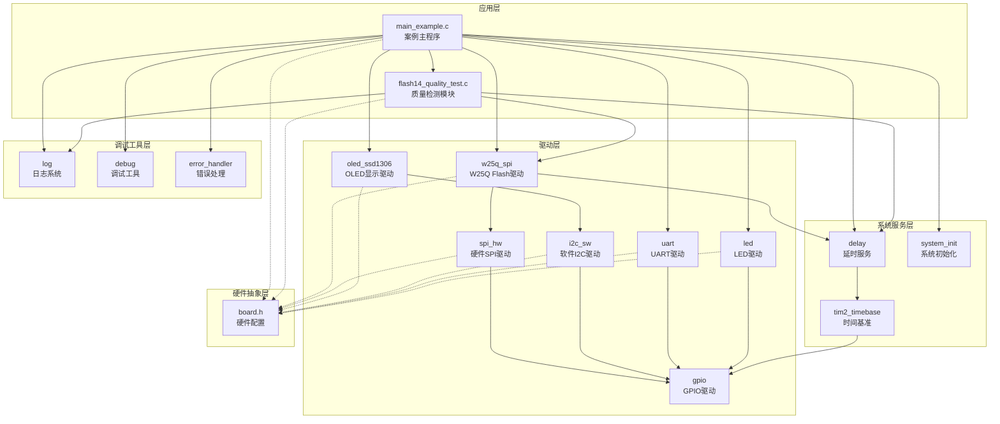
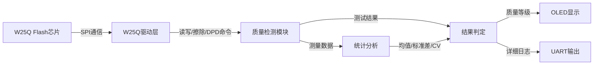
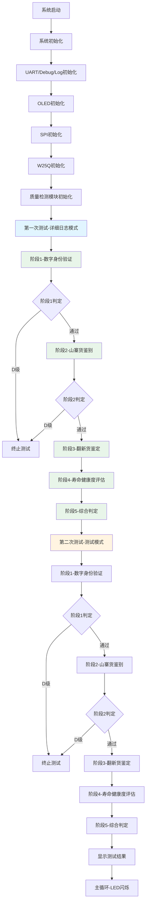

# Flash14 - W25Q品质测试案例

## 📋 案例目的

### 核心目标
演示W25Q系列Flash芯片的纯软件质量检测流程，包括自动化到货抽检、山寨货鉴别、翻新货鉴定和寿命健康度评估。

### 核心功能
- **阶段1：数字身份验证** - 通过JEDEC ID、Unique ID、SFDP表验证芯片身份
- **阶段2：山寨货深度鉴别** - 检测保留位陷阱、非法指令响应、WPS块保护等
- **阶段3：翻新货时序指纹鉴定** - 测量唤醒延迟、擦除延迟、编程延迟的稳定性和变异系数
- **阶段4：寿命健康度量化评估** - 统计坏块、读干扰敏感性、数据完整性、指令响应延迟退化
- **阶段5：综合判定与自动化决策** - 根据各阶段测试结果自动判定质量等级（Grade A/B/C/D）

### 学习重点
- W25Q Flash芯片的Deep Power-Down（DPD）功能测试方法
- 时序测量技术在芯片质量检测中的应用
- 统计分析方法（均值、标准差、变异系数）在硬件测试中的应用
- 多阶段质量检测流程的设计与实现

### 应用场景
- 电子元器件到货抽检
- 翻新芯片识别
- 山寨芯片鉴别
- Flash芯片寿命评估

## 🔧 硬件要求

### 必需外设
- **LED1**：PA1（系统状态指示）
- **UART1**：PA9(TX), PA10(RX), 115200（详细日志输出）
- **OLED显示屏**：PB8(SCL), PB9(SDA)（关键状态显示）

### 传感器/模块
- **W25Q SPI Flash模块**
  - **SPI接口**：
    - CS：PA11
    - SCK：PB13（SPI2_SCK）
    - MISO：PB14（SPI2_MISO）
    - MOSI：PB15（SPI2_MOSI）
  - **电源**：
    - VCC：3.3V
    - GND：GND
  - **⚠️ 重要提示 - 唤醒测试硬件要求**：
    - **必须**在W25Q芯片VCC引脚附近放置**220μF + 0.1μF**的电源去耦电容
    - **220μF**：大容量电解电容，用于提供稳定的电源和瞬态电流
    - **0.1μF**：高频去耦电容，用于滤除高频噪声
    - **位置要求**：电容必须**靠近芯片**（建议距离<2cm），确保电源稳定性
    - **作用**：确保Deep Power-Down（DPD）功能正常工作，提供稳定的唤醒延迟测量
    - **注意事项**：
      - 如果电容容量不足或距离过远，可能导致芯片无法正常进入DPD模式
      - 唤醒延迟测试可能失败，表现为唤醒延迟恒定（标准差为0）
      - 建议使用低ESR（等效串联电阻）的电容，提高电源质量

### 连接说明

| 模块 | 引脚 | STM32引脚 | 说明 |
|------|------|-----------|------|
| W25Q Flash | CS | PA11 | 片选信号 |
| W25Q Flash | SCK | PB13 | SPI时钟 |
| W25Q Flash | MISO | PB14 | SPI主入从出 |
| W25Q Flash | MOSI | PB15 | SPI主出从入 |
| W25Q Flash | VCC | 3.3V | 电源（需220μF+0.1μF去耦电容） |
| W25Q Flash | GND | GND | 地 |
| OLED | SCL | PB8 | I2C时钟 |
| OLED | SDA | PB9 | I2C数据 |
| UART1 | TX | PA9 | 串口发送 |
| UART1 | RX | PA10 | 串口接收 |
| LED1 | - | PA1 | 状态指示 |

## 📦 模块依赖

### 模块依赖关系图

### 模块列表

- **质量检测模块**（`flash14_quality_test.c/h`）：实现5个阶段的完整质量检测流程
- **W25Q Flash驱动**（`w25q_spi.c/h`）：提供Flash读写、擦除、DPD等基础功能
- **硬件SPI驱动**（`spi_hw.c/h`）：提供SPI通信接口
- **OLED显示驱动**（`oled_ssd1306.c/h`）：显示测试状态和结果
- **软件I2C驱动**（`i2c_sw.c/h`）：OLED通信接口
- **UART驱动**（`uart.c/h`）：串口通信，输出详细日志
- **日志系统**（`log.c/h`）：分级日志输出
- **调试工具**（`debug.c/h`）：printf重定向
- **错误处理**（`error_handler.c/h`）：统一错误处理框架
- **延时服务**（`delay.c/h`）：提供延时功能
- **系统初始化**（`system_init.c/h`）：系统级初始化

## 🔄 实现流程

### 整体逻辑

程序执行分为三个阶段：

1. **系统初始化阶段**：
   - 系统基础初始化（GPIO、LED、delay、TIM2）
   - UART、Debug、Log模块初始化
   - OLED、SPI、W25Q Flash初始化
   - 质量检测模块初始化

2. **质量检测阶段**：
   - 执行两次完整测试（第一次：详细日志模式，第二次：测试模式）
   - 阶段1：数字身份验证（JEDEC ID、Unique ID、SFDP表）
   - 阶段2：山寨货深度鉴别（保留位陷阱、非法指令、WPS块保护）
   - 阶段3：翻新货时序指纹鉴定（唤醒延迟、擦除延迟、编程延迟）
   - 阶段4：寿命健康度量化评估（坏块统计、读干扰、数据完整性、延迟退化）
   - 阶段5：综合判定（根据健康度和阶段3结果判定等级）

3. **主循环阶段**：
   - LED闪烁指示系统运行
   - OLED显示测试完成状态

### 数据流向图

### 关键方法

1. **Deep Power-Down（DPD）测试方法**：
   - 使用场景：阶段3唤醒延迟测试
   - 方法：发送0xB9命令进入DPD，等待TDPD时间，发送0xAB命令唤醒，测量tRES1延迟
   - 注意事项：需要220μF+0.1μF去耦电容靠近芯片，确保电源稳定

2. **时序测量方法**：
   - 使用场景：阶段3时序指纹鉴定
   - 方法：使用DWT（Data Watchpoint and Trace）Cycle Counter进行微秒级精确测量
   - 注意事项：测量期间禁用详细日志输出，确保测量精度

3. **统计分析方法**：
   - 使用场景：阶段3擦除延迟CV计算、阶段4延迟退化检测
   - 方法：计算均值、标准差、变异系数（CV），分析数据分布特征
   - 注意事项：过滤无效数据（值为0或负数），确保统计结果准确

4. **多阶段测试流程**：
   - 使用场景：完整质量检测流程
   - 方法：分5个阶段依次执行，每个阶段独立判定，早期失败可提前终止
   - 注意事项：阶段1和阶段2判定为D级时直接终止，不继续后续测试

### 工作流程示意图

## 📚 关键函数说明

### 质量检测模块相关函数

- **`QualityTest_Init()`**：初始化质量检测模块
  - 在本案例中用于初始化质量检测模块，准备测试环境
  - 必须在调用测试函数前初始化

- **`QualityTest_RunFullTest()`**：执行完整质量检测流程
  - 在本案例中用于执行两次完整测试（详细日志模式 + 测试模式）
  - 自动执行5个阶段的测试，并判定质量等级
  - 返回测试结果结构体，包含各阶段测试数据和最终等级

- **`QualityTest_Stage1_DigitalIdentity()`**：阶段1-数字身份验证
  - 在本案例中用于验证芯片的JEDEC ID、Unique ID、SFDP表
  - 判定为D级时直接终止测试

- **`QualityTest_Stage2_FakeDetection()`**：阶段2-山寨货深度鉴别
  - 在本案例中用于检测保留位陷阱、非法指令响应、WPS块保护
  - 判定为D级时直接终止测试

- **`QualityTest_Stage3_RefurbishDetection()`**：阶段3-翻新货时序指纹鉴定
  - 在本案例中用于测量唤醒延迟、擦除延迟、编程延迟
  - 计算统计值（均值、标准差、CV），检测翻新特征

- **`QualityTest_Stage4_LifetimeAssessment()`**：阶段4-寿命健康度量化评估
  - 在本案例中用于统计坏块、读干扰敏感性、数据完整性、延迟退化
  - 计算健康度分数（0-100）

- **`QualityTest_Stage5_Judgment()`**：阶段5-综合判定
  - 在本案例中用于根据健康度和阶段3结果判定最终质量等级
  - 输出Grade A/B/C/D

### W25Q Flash驱动相关函数

- **`W25Q_Init()`**：初始化W25Q Flash芯片
  - 在本案例中用于初始化Flash芯片，识别设备型号和容量
  - 必须在质量检测前初始化

- **`W25Q_ReadID()`**：读取JEDEC ID
  - 在本案例中用于阶段1数字身份验证
  - 返回厂商码和设备ID

- **`W25Q_ReadUniqueID()`**：读取Unique ID
  - 在本案例中用于阶段1数字身份验证
  - 返回64位唯一标识符

- **`W25Q_DeepPowerDown()`**：进入Deep Power-Down模式
  - 在本案例中用于阶段3唤醒延迟测试
  - 发送0xB9命令，使芯片进入低功耗模式

- **`W25Q_ReleasePowerDown()`**：退出Deep Power-Down模式
  - 在本案例中用于阶段3唤醒延迟测试
  - 发送0xAB命令，唤醒芯片

- **`W25Q_EraseSector()`**：擦除扇区
  - 在本案例中用于阶段3擦除延迟测试和阶段4坏块统计
  - 擦除指定扇区（4KB）

- **`W25Q_Write()`**：写入数据
  - 在本案例中用于阶段3编程延迟测试和阶段4数据完整性测试
  - 写入指定地址的数据

- **`W25Q_Read()`**：读取数据
  - 在本案例中用于阶段4数据完整性验证和读干扰测试
  - 读取指定地址的数据

**详细函数实现和调用示例请参考**：`main_example.c` 和 `flash14_quality_test.c` 中的代码

## ⚠️ 注意事项与重点

### ⚠️ 重要提示

1. **唤醒测试硬件要求（必须遵守）**：
   - **必须**在W25Q芯片VCC引脚附近放置**220μF + 0.1μF**的电源去耦电容
   - 电容必须**靠近芯片**（建议距离<2cm），确保电源稳定性
   - 如果电容容量不足或距离过远，可能导致：
     - 芯片无法正常进入Deep Power-Down（DPD）模式
     - 唤醒延迟测试失败（表现为唤醒延迟恒定，标准差为0）
     - 测试结果不准确

2. **标准初始化流程**：
   - 必须按照 System_Init → UART → Debug → Log → 其他模块 的顺序初始化
   - 质量检测模块必须在W25Q Flash初始化成功后初始化

3. **测试时间**：
   - 完整测试流程需要约6分钟（两次测试）
   - 阶段1：约2分钟/片
   - 阶段2：约15秒/片
   - 阶段3：约30秒/片
   - 阶段4：约3分钟/片
   - 阶段5：即时判定

4. **测试区域地址**：
   - 默认测试区域地址为 `0x700000`（8MB芯片的后1MB区域）
   - 确保测试区域未被其他程序使用

5. **日志输出控制**：
   - 第一次测试：输出详细日志（调试模式）
   - 第二次测试：测量期间不输出日志（测试模式），确保测量精度
   - 通过 `g_quality_test_verbose_log` 标志控制

### 🔑 关键点

1. **Deep Power-Down（DPD）功能**：
   - DPD是W25Q芯片的低功耗模式，进入后芯片功耗降至<1μA
   - 唤醒延迟（tRES1）是检测翻新芯片的重要指标
   - 正常芯片的唤醒延迟应在20-200μs范围内，且有正常的标准差

2. **时序测量精度**：
   - 使用DWT Cycle Counter进行微秒级精确测量
   - 测量期间禁用详细日志输出，避免影响测量精度
   - 添加适当的稳定延时，确保芯片状态稳定

3. **统计分析**：
   - 变异系数（CV）用于检测擦除延迟的稳定性
   - 翻新芯片的CV通常>12%，正常芯片的CV<12%
   - 标准差为0表示数据完全一致，可能是测量方法问题

4. **质量等级判定**：
   - Grade A：健康度≥85%，未检测到翻新特征
   - Grade B：健康度70-85%，未检测到翻新特征
   - Grade C：健康度<70%或检测到翻新特征
   - Grade D：山寨货（阶段1或阶段2判定）

5. **错误处理**：
   - 所有模块函数返回错误码，必须检查返回值
   - 使用ErrorHandler统一处理错误
   - 关键错误（如初始化失败）应停止程序运行

## 🔍 常见问题排查

### 问题1：唤醒延迟测试失败，标准差为0

**可能原因**：
- 电源去耦电容不足或距离过远（最常见）
- 芯片未进入Deep Power-Down模式
- 测量方法问题

**解决方法**：
1. **检查硬件**：
   - 确认W25Q芯片VCC引脚附近有**220μF + 0.1μF**去耦电容
   - 确认电容距离芯片<2cm
   - 检查电源连接是否稳定
2. **检查日志**：
   - 查看串口日志中的"芯片可能未进入Deep Power-Down"警告
   - 检查dummy字节是否为0x00（正常应为0xFF）
3. **软件检查**：
   - 确认DPD命令发送时序正确
   - 确认等待时间足够（TDPD时间）

### 问题2：擦除延迟CV超标（>12%）

**可能原因**：
- 电源不稳定
- 芯片质量问题
- 测量方法问题

**解决方法**：
1. **检查硬件**：
   - 确认电源稳定（220μF+0.1μF去耦电容）
   - 检查SPI连接是否稳定
2. **软件检查**：
   - 确认擦除循环之间有足够的稳定延时
   - 检查是否有其他程序干扰

### 问题3：W25Q初始化失败

**可能原因**：
- SPI连接错误
- 芯片型号不支持
- 电源问题

**解决方法**：
1. **检查硬件连接**：
   - 确认SPI引脚连接正确（CS、SCK、MISO、MOSI）
   - 确认电源连接（VCC、GND）
2. **检查配置**：
   - 确认`board.h`中SPI配置正确
   - 确认NSS引脚配置为GPIO输出模式
3. **检查芯片**：
   - 确认芯片型号为W25Q系列
   - 尝试读取JEDEC ID验证连接

### 问题4：测试时间过长

**可能原因**：
- 测试区域地址设置不当
- 测试次数过多

**解决方法**：
1. **调整测试区域**：
   - 确认测试区域地址在芯片容量范围内
   - 避免使用频繁访问的区域
2. **减少测试次数**：
   - 可以修改测试次数（如唤醒延迟测试从10次改为5次）
   - 注意：减少测试次数可能影响统计精度

### 问题5：OLED显示异常

**可能原因**：
- I2C连接错误
- OLED初始化失败
- 显示缓冲区溢出

**解决方法**：
1. **检查硬件连接**：
   - 确认I2C引脚连接正确（SCL、SDA）
   - 确认OLED电源连接
2. **检查初始化**：
   - 确认软件I2C初始化成功
   - 确认OLED初始化成功
3. **检查显示内容**：
   - 确认显示字符串长度不超过16字符
   - 使用`OLED_Clear()`清屏后再显示

## 💡 扩展练习

### 循序渐进部分

1. **简化测试流程**：
   - 只执行阶段1和阶段2测试，跳过阶段3和阶段4
   - 观察测试时间变化和结果判定

2. **修改测试参数**：
   - 调整唤醒延迟测试次数（从10次改为5次或20次）
   - 观察统计结果（均值、标准差）的变化
   - 理解测试次数对统计精度的影响

3. **添加测试区域选择**：
   - 修改测试区域地址，测试不同区域的Flash
   - 观察不同区域的测试结果差异
   - 理解Flash区域对测试结果的影响

### 实际场景坑点部分

4. **处理电源不稳定问题**：
   - 模拟电源不稳定场景（移除或远离去耦电容）
   - 观察测试结果变化（唤醒延迟、擦除CV等）
   - 实现电源稳定性检测和警告机制

5. **优化测试时间**：
   - 分析各阶段测试时间，找出耗时最长的部分
   - 优化测试流程，减少不必要的等待时间
   - 在保证精度的前提下，平衡测试时间和测试质量

6. **处理边界条件**：
   - 测试极端情况（如芯片容量为0、测试区域超出范围）
   - 实现边界条件检查和错误处理
   - 确保程序在异常情况下不会崩溃

## 📖 相关文档

### 模块文档
- **质量检测模块**：`Examples/Flash/Flash14_TestW25QQuality/flash14_quality_test.c/h`
- **W25Q Flash驱动**：`Drivers/storage/w25q_spi.c/h`
- **硬件SPI驱动**：`Drivers/spi/spi_hw.c/h`
- **OLED显示驱动**：`Drivers/display/oled_ssd1306.c/h`
- **软件I2C驱动**：`Drivers/i2c/i2c_sw.c/h`
- **UART驱动**：`Drivers/uart/uart.c/h`
- **日志系统**：`Debug/log.c/h`
- **错误处理**：`Common/error_handler.c/h`

### 业务文档
- **主程序代码**：`Examples/Flash/Flash14_TestW25QQuality/main_example.c`
- **硬件配置**：`Examples/Flash/Flash14_TestW25QQuality/board.h`
- **模块配置**：`Examples/Flash/Flash14_TestW25QQuality/config.h`
- **项目规范**：`PROJECT_KEYWORDS.md`

## 📝 更新日志

### 2024-01-01
- 初始版本
- 实现5个阶段的完整质量检测流程
- 添加Deep Power-Down（DPD）功能测试
- 添加时序测量和统计分析功能
- 添加详细日志和测试模式切换功能
- **重要更新**：明确唤醒测试硬件要求（220μF+0.1μF去耦电容必须靠近芯片）

