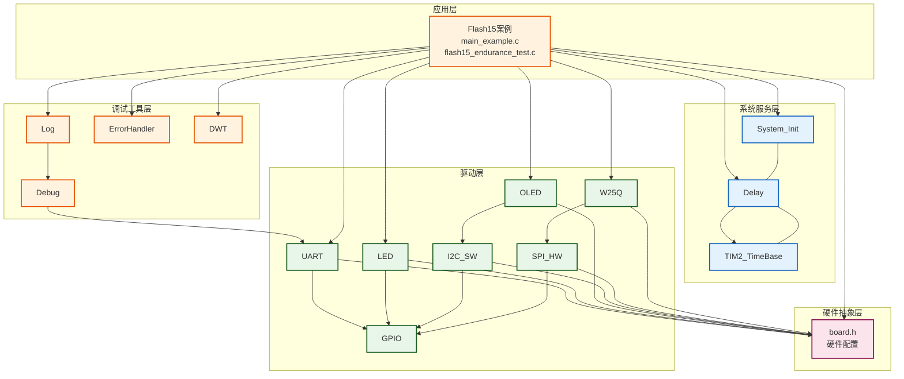
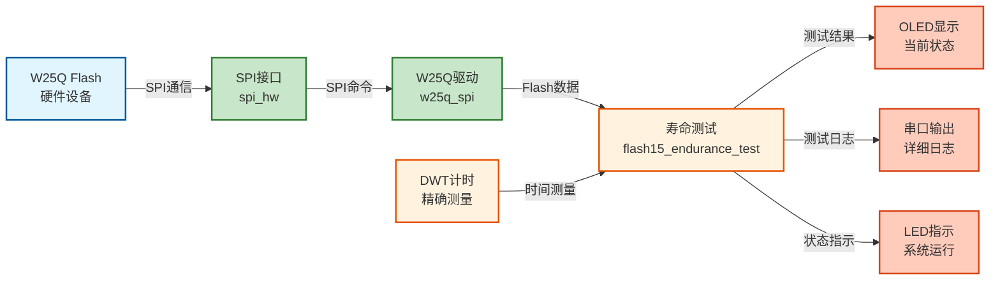
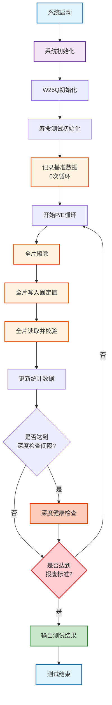

# Flash15 - W25Q寿命测试案例

## 📋 案例目的

- **核心目标**：演示W25Q系列Flash芯片的破坏性寿命极限测试流程，通过持续P/E（Program/Erase）循环将芯片测到报废，获取完整的寿命退化曲线和P/E循环极限值

### 核心功能

1. **基准数据记录**（首次完整P/E循环后）
   - 全片擦除时间测量（作为性能基准）
   - 编程时间统计（100页采样）
   - 读取速度测试
   - 初始错误率检测（首次完整E/W/R循环后的校验结果）
   - 数据自动保存到Flash Block 0

2. **破坏性P/E循环测试**（持续到报废）
   - **连续擦除加速**：支持连续擦除N次后再进行写入和读取（可配置，默认10次）
   - 全片擦除（跳过Block 0，汇总信息存储区域）
   - 全片写入固定值数据（循环编号的低8位，全盘相同值）
   - 全片读取并逐字节校验
   - 实时错误统计（擦除错误、编程错误、校验错误）
   - 坏块统计与标记
   - **OLED实时显示**：动态显示当前操作（Erase.../Write.../Read.../Done）

3. **断点续测功能**（支持断电恢复）
   - **汇总信息持久化**：测试进度自动保存到Flash Block 0
   - **魔数验证**：使用魔数标签（0x464C4153）和版本号（0x0001）验证数据有效性
   - **自动恢复**：系统启动时自动检测并恢复测试状态
   - **数据完整性**：保存前检查，保存后验证
   - **保存时机**：
     - 基准数据记录后立即保存
     - 每次完整的P/E循环完成后保存
     - 连续擦除循环的最后一次擦除后恢复Block 0时更新
   - **⚠️ 重要警告**：擦除操作期间禁止断电，会导致测试数据丢失

4. **性能监测与退化分析**
   - 擦除时间监测（实时统计，计算平均值和退化率）
   - 编程时间监测（采样统计，计算平均值和退化率）
   - 读取速度监测（实时统计，计算平均值和退化率）
   - 性能退化率计算（与基准数据对比，非负约束）
   - 端粒进度计算（按官方标准10万次=100%，可超过100%）

5. **报废判定标准**（自动终止测试）
   - **硬失效标准**（立即终止）：
     - 连续擦除失败次数 ≥ 3次
     - 连续编程失败次数 ≥ 3次
     - 坏块率 > 5%
     - 误码率 > 配置阈值（可配置，默认1e-3，支持不同行业标准）
     - 擦除时间 > 动态阈值（Block数量 × 200ms/块）
   - **软失效标准**（综合判定）：
     - 擦除时间退化率 > 50%
     - 编程时间退化率 > 50%
     - 读取速度退化率 > 50%
   - 达到报废标准后自动记录损坏时数据并保存

6. **数据记录与分析**
   - 实时数据记录（每100次循环输出详细日志）
   - 累计统计（总循环数、总写入数据量、平均时间、错误率）
   - 性能退化率计算（擦除、编程、读取速度）
   - 误码率格式化显示（%、PPM、PPB，自动选择易读格式）
   - 端粒进度计算（按官方标准10万次=100%）

### 学习重点

- 理解Flash芯片寿命测试的完整流程
- 掌握P/E循环测试的实现方法
- 学习Flash性能退化监测技术
- 了解Flash芯片报废判定标准
- 掌握破坏性测试的数据分析方法

### 应用场景

适用于需要评估W25Q Flash芯片寿命的场景，如：
- 芯片寿命摸底测试
- 批次质量一致性验证
- 可靠性工程验证
- 寿命预测模型建立
- 产品设计验证

## ⚠️ 重要警告

**本测试为破坏性测试，会将芯片测到报废，请勿在正常使用的芯片上运行！**

- 测试芯片将被物理损坏，无法恢复
- 建议使用专用测试芯片或报废芯片
- 测试过程可能需要数天至数周（取决于芯片容量和P/E循环次数）
- **⚠️ 擦除操作期间禁止断电或重启**：在擦除（E）状态时断电会导致汇总记录丢失，无法恢复测试进度
- **断点续测保护**：系统支持断电恢复，但必须在安全点（擦除/写入操作完成后）断电
- **电源稳定性要求**：测试过程中必须保持电源稳定，建议使用UPS或稳定的电源适配器

## 🔧 硬件要求

### 必需外设

- **LED1**：连接到 `PA1`（系统状态指示）

### 传感器/模块

#### W25Q SPI Flash模块

| 引脚 | STM32连接 | 说明 |
|------|-----------|------|
| CS | PA11 | 片选信号（软件NSS模式） |
| SCK | PB13 | SPI2时钟信号 |
| MISO | PB14 | SPI2主入从出（数据接收） |
| MOSI | PB15 | SPI2主出从入（数据发送） |
| VCC | 3.3V | **⚠️ 重要：必须使用3.3V，不能使用5V！** |
| GND | GND | 电源地 |

**⚠️ 重要提示**：
- W25Q系列Flash使用3.3V供电，使用5V会损坏芯片
- CS引脚使用软件NSS模式，由软件控制拉低/拉高
- **测试过程中必须保持电源稳定，避免断电导致数据丢失**
- **建议使用专用测试芯片，不要在生产芯片上运行**
- **Flash存储布局**：
  - **Block 0**（地址0x00000000）：汇总信息存储区域，测试过程中跳过此区域
  - **Block 1及以后**：测试数据区域，执行擦除、写入、读取、校验操作

#### OLED显示屏（软件I2C接口）

| 引脚 | STM32连接 | 说明 |
|------|-----------|------|
| SCL | PB8 | 软件I2C时钟线 |
| SDA | PB9 | 软件I2C数据线 |
| VCC | 3.3V | 电源 |
| GND | GND | 电源地 |

#### UART1（用于详细日志输出）

| 引脚 | STM32连接 | 说明 |
|------|-----------|------|
| TX | PA9 | UART1发送 |
| RX | PA10 | UART1接收 |
| 波特率 | 115200 | 串口通信波特率 |

**连接说明**：将UART1连接到USB转串口模块，用于查看详细日志输出。建议使用串口助手软件保存完整日志，便于后续分析。

## 📦 模块依赖

### 模块依赖关系图



### 模块列表

| 模块分类 | 模块名称 | 用途 | 依赖关系 |
|---------|---------|------|---------|
| 应用层 | main_example.c | 主函数入口 | flash15_endurance_test |
| 应用层 | flash15_endurance_test | 寿命测试核心实现 | W25Q, SPI, Delay, DWT |
| 驱动层 | W25Q | W25Q Flash驱动 | SPI |
| 驱动层 | SPI_HW | SPI硬件驱动 | GPIO |
| 驱动层 | OLED | OLED显示驱动 | I2C_SW |
| 驱动层 | I2C_SW | 软件I2C驱动 | GPIO |
| 驱动层 | LED | LED驱动 | GPIO |
| 驱动层 | UART | UART驱动 | GPIO |
| 系统服务层 | System_Init | 系统初始化 | GPIO, LED |
| 系统服务层 | Delay | 延时服务 | TIM2_TimeBase |
| 调试工具层 | Debug | printf重定向 | UART |
| 调试工具层 | Log | 分级日志系统 | Debug |
| 调试工具层 | ErrorHandler | 错误处理框架 | - |
| 调试工具层 | DWT | 数据观察点单元（用于精确计时） | - |

## 🔄 实现流程

### 整体逻辑

程序执行流程分为以下几个阶段：

1. **系统初始化阶段**：
   - 初始化系统、SPI、W25Q、OLED、UART、Debug、Log、DWT等模块
   - **断点续测检测**：尝试从Flash Block 0加载汇总信息
   - 如果汇总信息有效（魔数验证通过），恢复测试状态并继续测试
   - 如果汇总信息无效，从0开始新测试

2. **基准数据记录阶段**（仅新测试时执行）：
   - 执行首次完整P/E循环（擦除→写入→读取→校验）
   - 记录初始性能基准（擦除时间、编程时间、读取速度、初始错误率）
   - 保存汇总信息到Flash Block 0

3. **主循环阶段**：持续执行P/E循环，直至芯片报废
   - **连续擦除模式**（第2轮开始）：
     - 根据配置连续擦除N次（默认10次）
     - 每次擦除后更新循环计数（total_cycles++）
     - 连续擦除完成后，执行一次写入和读取操作
   - **单次循环流程**：
     - 全片擦除（跳过Block 0）→ 全片写入 → 全片读取校验
     - 实时统计：擦除时间、编程时间、错误数量、坏块数量
     - 累计统计：总循环数、总写入数据量、平均时间、错误率
     - 计算性能退化率（与基准数据对比）
     - 计算端粒进度（按官方标准10万次=100%）
   - **数据持久化**：每次完整的P/E循环完成后自动保存汇总信息

4. **定期深度检查阶段**（每1000次循环）：
   - 擦除时间退化分析
   - 编程速度与误码率统计
   - 性能退化率计算

5. **报废判定阶段**：
   - 每次循环完成后检查报废标准
   - 如果达到报废标准，记录损坏时数据
   - 保存汇总信息（包含损坏时数据）
   - 终止测试循环

6. **结果输出阶段**：
   - 输出完整的测试结果和统计数据
   - OLED显示最终结果
   - 串口输出详细报告

### 数据流向图



### 工作流程示意图



## 📚 关键函数说明

### 寿命测试模块相关函数

- **`EnduranceTest_Init()`**：寿命测试模块初始化
  - 检查W25Q是否已初始化
  - 初始化DWT（数据观察点单元）用于精确计时
  - 设置模块初始化标志

- **`EnduranceTest_RecordBaseline()`**：记录基准数据（0次循环）
  - 执行全片擦除，测量初始擦除时间
  - 测试100页编程时间，计算平均编程时间
  - 测试读取速度
  - 检测初始错误率

- **`EnduranceTest_RunSingleCycle()`**：执行单次P/E循环
  - 支持连续擦除模式（第2轮开始）
  - 全片擦除并测量时间（跳过Block 0）
  - 全片写入固定值数据（循环编号的低8位，全盘相同值）
  - 全片读取并逐字节校验
  - 统计错误（擦除错误、编程错误、校验错误）
  - 更新累计统计数据
  - 计算性能退化率和端粒进度
  - 更新OLED显示（动态显示当前操作状态）

- **`EnduranceTest_Run()`**：运行完整寿命测试流程
  - **断点续测**：尝试从Flash Block 0加载汇总信息
  - 如果恢复成功，从断点继续测试；如果失败，从0开始新测试
  - 记录基准数据（仅新测试时）
  - 持续执行P/E循环，直至芯片报废
  - 每次完整的P/E循环完成后自动保存汇总信息
  - 每1000次循环执行深度健康检查
  - 每100次循环记录日志
  - 检查报废判定标准
  - 返回测试结果

- **`EnduranceTest_LoadSummary()`**：从Flash加载汇总信息（断点续测）
  - 读取Flash Block 0的汇总信息结构体
  - 验证魔数标签（0x464C4153）和版本号（0x0001）
  - 恢复测试状态（基准数据、测试结果、损坏时数据）
  - 同步current_cycle和total_cycles

- **`EnduranceTest_SaveSummary()`**：保存汇总信息到Flash（断点续测）
  - 检查Block 0是否需要擦除（读取前16字节，检查是否有0值）
  - 如果需要，擦除Block 0的第一个扇区
  - 构建汇总信息结构体（魔数、版本号、基准数据、测试结果、损坏时数据）
  - 写入Block 0并验证写入成功

- **`EnduranceTest_CheckEndOfLife()`**：检查是否达到报废标准
  - 检查硬失效标准（擦除失败、编程失败、坏块率、误码率、擦除时间）
  - 检查软失效标准（寿命评分、性能退化率）
  - 返回芯片是否已报废

- **`EnduranceTest_CalculateLifetimeScore()`**：计算寿命评分（0-100分）
  - 基于擦除时间退化率、误码率、坏块率、读干扰错误计算综合评分
  - 评分越低表示芯片寿命越接近终点

### 辅助函数

- **`GeneratePattern()`**：生成测试数据模式
  - 使用固定值填充缓冲区（每轮循环值+1）
  - 便于错误检测和调试

- **`CountBitErrors()`**：统计位错误数量
  - 逐字节比较期望值和实际值
  - 统计所有位错误

## 📊 数据解读

### 块擦除时间性能档位参考

| 档位 | 擦除时间 | 性能描述 | 参考型号 | 备注 |
|------|----------|----------|----------|------|
| **优秀** | **≤120ms** | 卓越性能 | W25Q-RV系列 | 高于标准规格，适合高频更新场景 |
| **良好** | **121-180ms** | 正常性能 | W25Q16/32/64/128 | 符合典型值150ms标准，主流水平 |
| **一般** | **181-500ms** | 可接受范围 | 老化芯片/低温环境 | 性能下降但仍可用，建议监控 |
| **偏弱** | **>500ms** | 性能偏低 | 故障风险或极端条件 | 接近2000ms最大值，需排查 |

**说明**：
- 擦除时间指单个Block（64KB）的擦除时间
- 全片擦除时间 = Block数量 × 单Block擦除时间
- 对于8MB芯片（128个Block），全片擦除时间约为：128 × 150ms ≈ 19.2秒
- 测试中显示的擦除时间包含全片擦除时间（秒）和每块平均时间（ms/块）
- **报废判定阈值**：根据芯片容量动态计算，阈值 = Block数量 × 200ms/块
  - 8MB: 128 × 200ms = 25.6秒
  - 16MB: 256 × 200ms = 51.2秒
  - 32MB: 512 × 200ms = 102.4秒
  - 64MB: 1024 × 200ms = 204.8秒
  - 128MB: 2048 × 200ms = 409.6秒

### 关键指标说明

1. **总P/E循环次数**：
   - 表示芯片完成的完整擦写循环次数
   - 典型W25Q芯片寿命：10,000-100,000次P/E循环
   - 测试将持续到芯片报废

2. **总写入数据量**：
   - 计算公式：总循环数 × 芯片容量
   - 例如：1000次循环 × 8MB = 8GB
   - 用于评估芯片累计写入量

3. **擦除时间退化率**：
   - 计算公式：`(当前平均擦除时间 - 基准擦除时间) / 基准擦除时间 × 100%`
   - 正常值：< 30%
   - 预警值：30-50%
   - 危险值：> 50%

4. **误码率**：
   - 计算公式：`校验错误位数 / 总数据位数`
   - 正常值：< 1e-8
   - 预警值：1e-8 - 1e-4
   - 危险值：> 1e-4

5. **坏块率**：
   - 计算公式：`坏块数量 / 总块数量 × 100%`
   - 正常值：0%
   - 预警值：1-5%
   - 危险值：> 5%

6. **寿命评分**：
   - 综合评分：0-100分
   - 计算公式：`100 - (擦除退化率×0.3 + 误码率×0.3 + 坏块率×0.2 + 读干扰×0.2)`
   - 优秀：> 80分
   - 良好：60-80分
   - 一般：40-60分
   - 差：< 40分
   - 报废：< 20分

### 测试结果示例

```
=== 寿命测试完成（芯片已报废） ===

【关键数据 - 总写入数据量】
  总P/E循环次数: 15234 次
  总写入数据量: 121872 MB (119.02 GB)

【时间统计】
  最终擦除时间: 18.45 秒 (144.14 ms/块)
  平均擦除时间: 17.23 秒 (134.61 ms/块)
  最小擦除时间: 16.74 秒 (130.78 ms/块)
  最大擦除时间: 22.15 秒 (172.66 ms/块)
  平均编程时间: 1.504 ms/页

【错误统计】
  擦除错误次数: 0
  编程错误次数: 0
  校验错误次数: 1250 位
  坏块数量: 2
  最终误码率: 1.25e-05
  读干扰错误: 0

【性能退化】
  擦除时间退化率: 2.93%
  编程时间退化率: 0.03%
  基准擦除时间: 16.74 秒
  基准编程时间: 1.504 ms/页

【最终状态】
  最终寿命评分: 95.50
  芯片状态: 已报废（误码率超标）
```

## ⚠️ 注意事项与重点

### ⚠️ 重要提示

1. **破坏性测试警告**：
   - **本测试会将芯片测到报废，请勿在正常使用的芯片上运行！**
   - 测试芯片将被物理损坏，无法恢复
   - 建议使用专用测试芯片或报废芯片
   - 测试前请备份重要数据（如果有）

2. **测试时间**：
   - 单次P/E循环时间：约2-5分钟（取决于芯片容量）
   - 完整测试时间：数天至数周（取决于芯片寿命）
   - 8MB芯片示例：1000次循环约需33-83小时
   - 建议使用稳定的电源和良好的散热

3. **电源稳定性**：
   - **测试过程中必须保持电源稳定，避免断电**
   - 断电可能导致数据丢失和测试中断
   - 建议使用UPS或稳定的电源适配器

4. **散热管理**：
   - 频繁擦写会产生热量
   - 建议在芯片上加装散热片
   - 确保良好的通风环境

5. **数据记录**：
   - 建议使用串口助手保存完整日志
   - 日志文件可用于后续分析和报告生成
   - 每100次循环自动记录数据

6. **芯片适配**：
   - 测试自动适配不同容量的W25Q芯片（8MB、16MB、32MB、64MB、128MB等）
   - 自动识别芯片型号和容量
   - 根据芯片容量动态调整测试参数：
     - 擦除时间阈值：Block数量 × 200ms/块
     - WaitReady超时时间：Block数量 × 200ms/块 × 3（安全系数）
     - 预计时间提示：根据实际容量和页数动态计算
     - 日志信息：显示实际容量、页数、块数，不再硬编码

### 🔑 关键点

1. **固定值写入模式**：
   - 每轮循环写入相同的固定值（循环编号的低8位）
   - 便于快速检测写入错误
   - 读取时立即发现数据不匹配

2. **精确计时**：
   - 使用DWT（数据观察点单元）进行精确计时
   - 分辨率：微秒级
   - 用于测量擦除时间、编程时间、读取时间

3. **实时监控**：
   - OLED显示当前循环数和关键状态
   - UART输出详细日志（每100次循环）
   - LED指示系统运行状态

4. **报废判定**：
   - 硬失效：立即终止（擦除失败、编程失败、坏块率>5%）
   - 软失效：综合评分判定（寿命评分<20）
   - 自动终止测试，避免无效循环

5. **数据统计**：
   - 实时统计：当前循环的错误和时间
   - 累计统计：总循环数、总写入数据量、平均时间
   - 性能退化：擦除时间退化率、编程时间退化率

## 🔍 常见问题排查

### 问题1：测试立即终止

**可能原因**：
- 芯片已损坏
- SPI通信问题
- 电源不稳定

**解决方法**：
- 检查SPI连接是否正确
- 检查电源是否稳定（3.3V）
- 尝试更换测试芯片
- 检查串口日志中的错误信息

### 问题2：擦除时间异常长

**可能原因**：
- 芯片已老化
- 温度过低
- SPI时钟频率设置过低

**解决方法**：
- 检查SPI时钟频率设置（当前为2分频，约18MHz）
- 检查环境温度（建议室温）
- 擦除时间阈值根据芯片容量动态计算（Block数量 × 200ms/块），如果超过阈值，芯片将被判定为报废

### 问题3：误码率持续上升

**可能原因**：
- 芯片寿命接近终点
- 电源不稳定
- 温度过高

**解决方法**：
- 检查电源稳定性
- 检查散热情况
- 这是正常的寿命退化现象，测试会继续直到报废

### 问题4：测试时间过长

**可能原因**：
- 芯片容量大
- SPI时钟频率低
- 循环次数多

**解决方法**：
- 这是正常现象，寿命测试需要较长时间
- **使用连续擦除加速功能**：在`board.h`中配置`ENDURANCE_TEST_CONSECUTIVE_ERASE_COUNT`（默认10次）
  - 设置为10：连续擦除10次后，才进行一次写入和读取操作
  - 可以大幅加快测试速度（约10倍）
  - 注意：第1轮不受此配置影响，总是执行完整的擦除-写入-读取流程
- 可以调整深度检查间隔（默认1000次）
- 可以调整日志记录间隔（默认100次）
- 建议使用串口助手保存日志，然后离线分析

### 问题7：断电后无法恢复测试

**可能原因**：
- 在擦除操作期间断电（危险操作）
- 汇总信息损坏
- 魔数验证失败

**解决方法**：
- **避免在擦除操作期间断电**：擦除操作期间断电会导致汇总记录丢失
- 检查串口日志中的汇总信息加载结果
- 如果魔数验证失败，系统会自动从0开始新测试
- 建议在安全点（擦除/写入操作完成后）断电
- 使用稳定的电源（UPS或稳定的电源适配器）

### 问题8：循环计数不正确

**可能原因**：
- 断电恢复后循环计数未正确同步
- 连续擦除模式下循环计数更新异常

**解决方法**：
- 系统已实现循环计数同步机制，确保`current_cycle`和`total_cycles`正确同步
- 每次完整的P/E循环完成后自动保存汇总信息
- 连续擦除模式下，每次擦除后正确更新`total_cycles++`
- 如果仍有问题，检查串口日志中的汇总信息恢复结果

### 问题5：内存不足

**可能原因**：
- 测试缓冲区过大
- 系统其他模块占用内存过多

**解决方法**：
- 测试已优化内存使用（使用静态缓冲区）
- 如果仍有问题，可以减少测试区域（修改代码）
- STM32F103C8T6有20KB RAM，通常足够使用

### 问题6：芯片未报废但测试停止

**可能原因**：
- 达到硬失效标准（擦除失败、编程失败、坏块率>5%）
- 达到软失效标准（寿命评分<20）
- 擦除时间超过阈值（>120秒）

**解决方法**：
- 检查串口日志中的报废判定原因
- 这是正常的测试终止，芯片已达到报废标准
- 可以查看最终统计数据

## 💡 扩展练习

### 循序渐进部分

1. **观察基准数据**：
   - 运行测试，观察基准数据记录
   - 理解擦除时间、编程时间、读取速度的含义
   - 验证数据是否在正常范围内

2. **监控前几次循环**：
   - 观察前10次循环的数据
   - 检查擦除时间是否稳定
   - 检查是否有错误产生

3. **分析性能退化**：
   - 观察擦除时间退化率的变化
   - 观察误码率的变化趋势
   - 理解性能退化的规律

### 实际场景坑点部分

4. **断点续测功能**（已实现）：
   - ✅ 汇总信息自动保存到Flash Block 0
   - ✅ 系统启动时自动检测并恢复测试状态
   - ✅ 魔数验证机制确保数据完整性
   - ✅ 支持断电后从断点继续测试
   - ⚠️ **重要**：擦除操作期间禁止断电，会导致汇总记录丢失
   - ⚠️ **建议**：在安全点（擦除/写入操作完成后）断电

5. **优化测试速度**：
   - SPI时钟频率：当前为2分频，约18MHz（已优化）
   - 可以进一步优化擦除和写入流程
   - 注意平衡速度和稳定性

6. **多芯片并行测试**：
   - 可以使用多个SPI接口同时测试多片芯片
   - 需要独立的SPI总线和CS信号
   - 可以大幅提高测试效率

7. **数据分析与可视化**：
   - 导出串口日志数据
   - 使用Python/Excel分析数据
   - 绘制擦除时间退化曲线
   - 绘制误码率累计曲线
   - 生成寿命预测模型

## 📖 相关文档

### 模块文档

- **W25Q驱动**：`Drivers/flash/w25q_spi.c/h`
- **SPI驱动**：`Drivers/spi/spi_hw.c/h`
- **Delay模块**：`System/delay.c/h`
- **OLED驱动**：`Drivers/display/oled_ssd1306.c/h`
- **UART驱动**：`Drivers/uart/uart.c/h`
- **Log模块**：`Debug/log.c/h`
- **错误处理**：`Common/error_handler.c/h`
- **DWT模块**：`Debug/debug.c/h`（DWT相关函数）

### 业务文档

- **主程序代码**：`Examples/Flash/Flash15_WARN_W25QLifetime/main_example.c`
- **寿命测试实现**：`Examples/Flash/Flash15_WARN_W25QLifetime/flash15_endurance_test.c/h`
- **硬件配置**：`Examples/Flash/Flash15_WARN_W25QLifetime/board.h`
- **模块配置**：`Examples/Flash/Flash15_WARN_W25QLifetime/config.h`
- **需求规格说明**：`Examples/Flash/Flash15_WARN_W25QLifetime/SRS.md`（完整的需求文档）
- **项目规范**：`../../../AI/README.md`（AI规则体系）
- **相关案例**：`Examples/Flash/Flash14_TestW25QQuality/README.md`（品质测试案例）

### 配置说明

#### 连续擦除配置

在`board.h`中配置`ENDURANCE_TEST_CONSECUTIVE_ERASE_COUNT`：
- **范围**：1-100（默认10）
- **设置为1**：每次擦除后立即进行写入和读取（正常模式）
- **设置为10**：连续擦除10次后，才进行一次写入和读取操作（加速模式）
- **注意**：第1轮（total_cycles == 0）不受此配置影响，总是执行完整的擦除-写入-读取流程

#### 误码率报废阈值配置

在`board.h`中配置`ENDURANCE_TEST_ERROR_RATE_THRESHOLD`：
- **默认值**：1e-3 (0.1%) - 适用于一般应用
- **工业应用**：1e-4 (0.01%)
- **医疗设备（一般）**：1e-6 (1 PPM)
- **医疗设备（关键）/航空航天**：1e-9 (1 PPB)

#### 模拟写入错误配置（仅用于代码验证）

在`board.h`中配置：
- `ENDURANCE_TEST_SIMULATE_WRITE_ERROR_ENABLED`：功能开关（0/1，默认0）
- `ENDURANCE_TEST_SIMULATE_WRITE_ERROR_COUNT`：模拟错误字节数（1-10，默认3）
- **⚠️ 警告**：此功能仅用于验证代码逻辑，正常测试时应禁用（设置为0）

## 📝 测试报告模板

测试完成后，建议记录以下信息：

```
=== W25Q寿命测试报告 ===

【测试信息】
  测试日期：YYYY-MM-DD
  测试芯片型号：W25Q64（8MB）
  测试芯片批次：XXXX
  测试环境温度：XX°C

【测试结果】
  总P/E循环次数：XXXX 次
  总写入数据量：XXXX MB (XX.XX GB)
  测试持续时间：XX小时XX分钟

【性能数据】
  初始擦除时间：XX.XX 秒 (XXX.XX ms/块)
  最终擦除时间：XX.XX 秒 (XXX.XX ms/块)
  擦除时间退化率：XX.XX%
  最终误码率：X.XXe-XX
  坏块数量：X
  最终寿命评分：XX.XX

【报废原因】
  [ ] 擦除失败
  [ ] 编程失败
  [ ] 坏块率超标（>5%）
  [ ] 误码率超标（>1e-3）
  [ ] 擦除时间超标（>120秒）
  [ ] 寿命评分过低（<20）

【结论】
  芯片寿命：XXXX 次P/E循环
  性能评级：[优秀/良好/一般/偏弱]
  建议：[继续使用/监控使用/立即更换]
```

---

## 📋 版本历史

### v1.0.0（2024-01-01）
- 初始版本
- 实现基准数据记录功能
- 实现P/E循环测试功能
- 实现报废判定功能
- 实现性能监测功能
- 实现错误统计功能

### v1.1.0（2024-01-01）
- ✅ 新增断点续测功能
  - 汇总信息自动保存到Flash Block 0
  - 系统启动时自动检测并恢复测试状态
  - 魔数验证机制确保数据完整性
- ✅ 新增连续擦除加速功能
  - 支持连续擦除N次后再进行写入和读取
  - 可配置连续擦除次数（1-100，默认10）
- ✅ 新增OLED动态显示功能
  - 实时显示当前操作状态（Erase.../Write.../Read.../Done）
  - 实时更新循环数和误码率
- ✅ 优化性能退化率计算
  - 非负约束（如果比基准好，显示0.00%）
  - 支持擦除时间、编程时间、读取速度退化率
- ✅ 优化误码率格式化显示
  - 自动选择易读格式（%、PPM、PPB）
- ✅ 新增端粒进度计算
  - 按官方标准10万次=100%
  - 支持超过100%的显示
- ✅ 优化数据持久化机制
  - 每次完整的P/E循环完成后自动保存
  - 连续擦除循环的最后一次擦除后恢复Block 0时更新
- ✅ 新增行业标准适配
  - 支持不同行业标准的误码率报废阈值配置
- ✅ 完善代码注释和文档
  - 添加详细的警告注释（擦除操作期间禁止断电）
  - 创建完整的需求规格说明文档（SRS.md）

---

**最后更新**：2024-01-01（v1.1.0 - 断点续测与功能增强版本）

