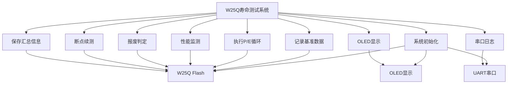
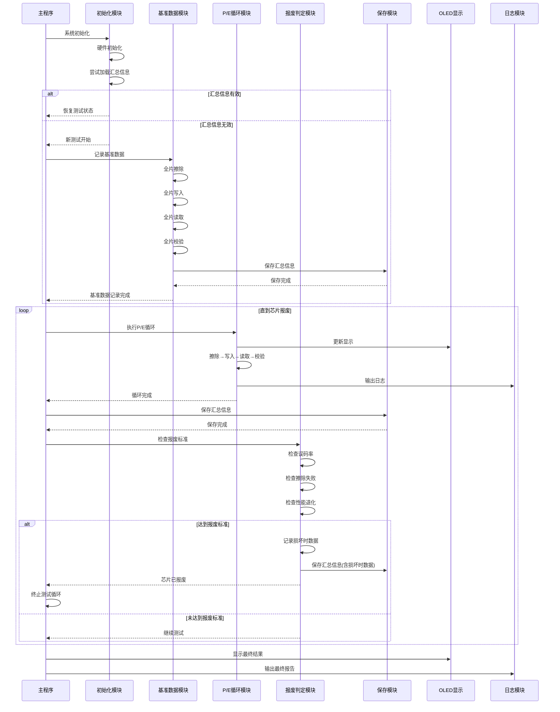
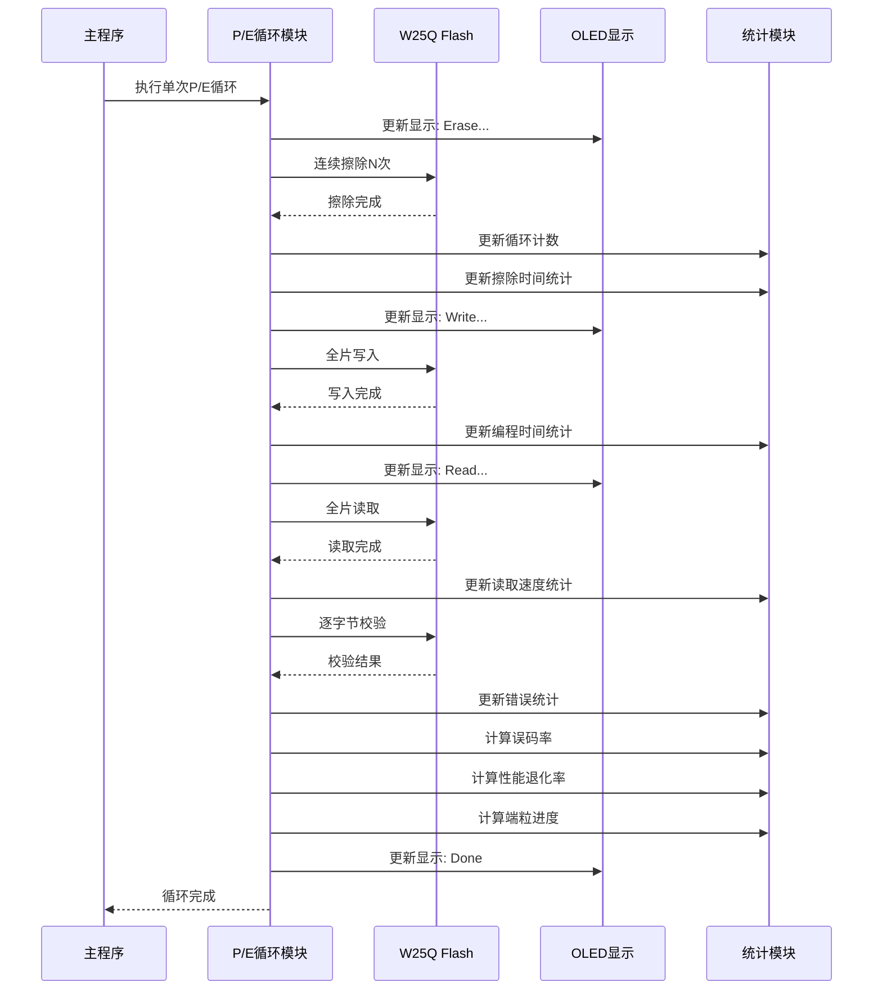
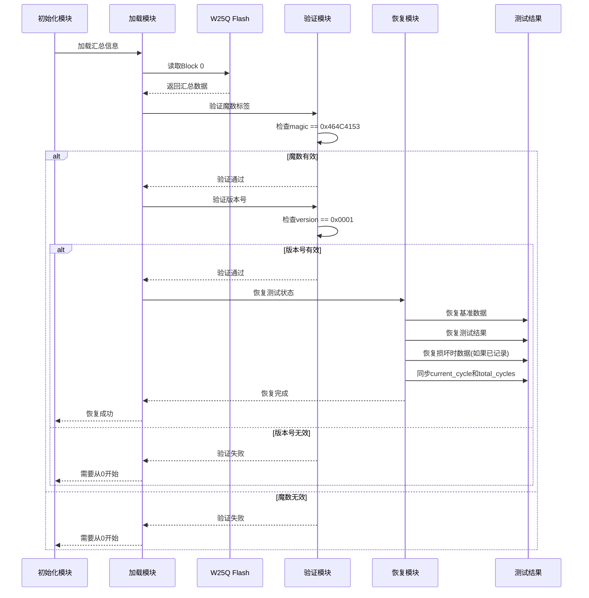
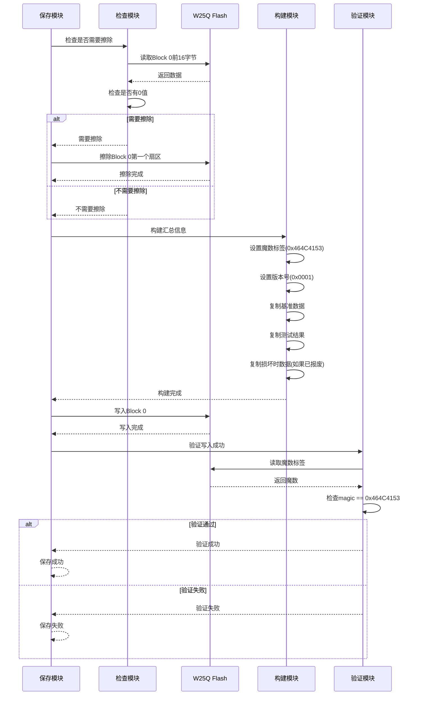
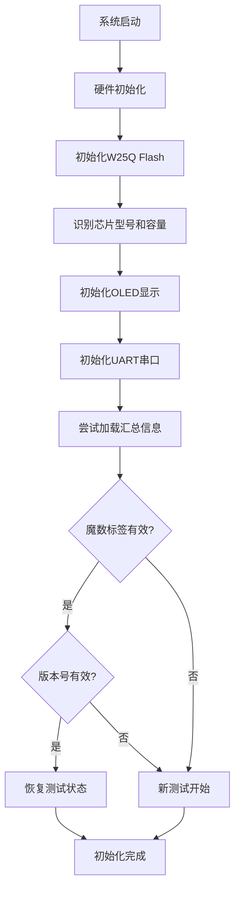
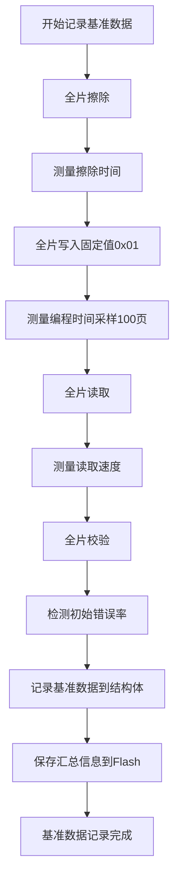
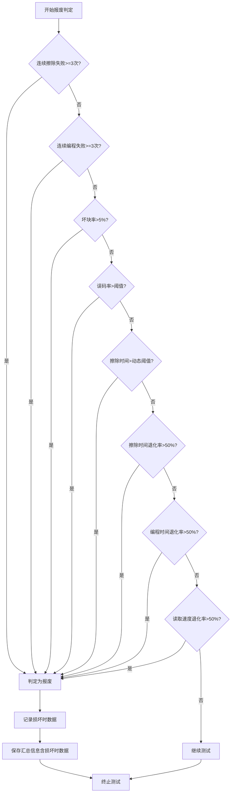
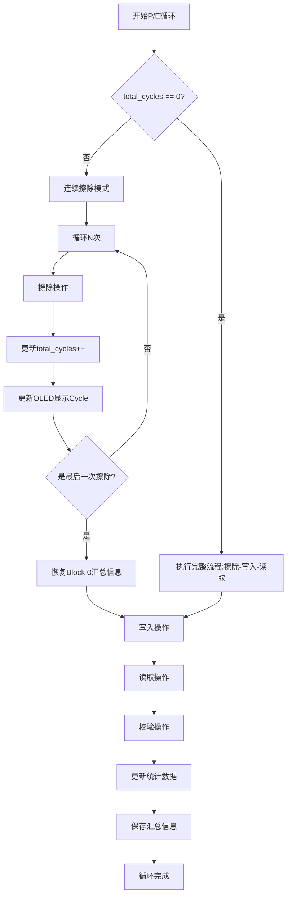

# Flash15 - W25Q寿命测试系统需求规格说明

## 1. 项目概述

### 1.1 项目背景

开发一套完整的W25Q系列Flash芯片破坏性寿命极限测试系统，用于评估Flash芯片的P/E（Program/Erase）循环寿命、性能退化轨迹和报废判定标准。

### 1.2 项目目标

- 通过持续P/E循环将芯片测到报废，获取完整的寿命退化曲线
- 建立性能退化监测和预测模型
- 支持不同行业标准的误码率阈值配置
- 实现断点续测功能，支持长时间测试的可靠性

### 1.3 适用范围

- 芯片寿命摸底测试
- 批次质量一致性验证
- 可靠性工程验证
- 寿命预测模型建立
- 产品设计验证

### 1.4 系统用例图



## 2. 业务需求

### 2.1 核心业务目标

1. **寿命评估**：准确测量芯片的P/E循环极限值
2. **性能监测**：实时跟踪擦除时间、编程时间、读取速度的退化趋势
3. **可靠性分析**：统计误码率、坏块率等关键指标
4. **数据完整性**：确保测试数据不丢失，支持断电恢复

### 2.2 业务约束

- **破坏性测试**：测试会将芯片测到报废，不可恢复
- **长时间运行**：测试可能需要数天至数周
- **电源稳定性**：测试过程中必须保持电源稳定
- **数据安全**：测试数据必须持久化，防止丢失

## 3. 功能需求

### 3.0 测试流程总览

**主测试流程时序图**：



### 3.1 测试流程管理

#### FR-001: 测试初始化

**优先级**: 高
**描述**: 系统启动时自动初始化测试环境，包括硬件初始化、模块初始化、数据恢复等。

**输入**:

- 无

**处理**:

1. 初始化系统时钟、GPIO、SPI、I2C、UART等硬件模块
2. 初始化W25Q Flash驱动，自动识别芯片型号和容量
3. 初始化OLED显示、日志系统
4. 尝试从Flash Block 0加载汇总信息（断点续测）
5. 如果加载成功，恢复测试状态；如果失败，从0开始测试

**输出**:

- 初始化成功/失败状态
- 芯片信息（容量、型号、ID等）
- 测试状态（新测试/恢复测试）

**验收标准**:

- 系统能正确识别W25Q芯片型号和容量
- 断点续测功能正常工作
- 所有硬件模块初始化成功

---

#### FR-002: 基准数据记录

**优先级**: 高
**描述**: 在第1次P/E循环前记录基准数据，作为后续性能退化的参考基准。

**输入**:

- 无

**处理**:

1. 执行全片擦除，测量初始擦除时间
2. 执行全片写入固定值（0x01），测量编程时间（采样100页）
3. 执行全片读取，测量读取速度
4. 执行全片校验，检测初始错误率
5. 记录基准数据到结构体（Baseline_Data_t）
6. 保存汇总信息到Flash Block 0

**输出**:

- 基准数据：擦除时间、编程时间、读取速度、初始错误率

**验收标准**:

- 基准数据在正常范围内（擦除时间：15-25秒/8MB，编程时间：1-2ms/页，读取速度：>200KB/s）
- 初始错误率应为0或接近0
- 基准数据正确保存到Flash

---

#### FR-003: P/E循环执行

**优先级**: 高
**描述**: 执行单次完整的P/E循环（擦除→写入→读取→校验）。

**时序图**：



**输入**:

- 当前循环编号（current_cycle）

**处理**:

1. **擦除阶段**：

- 根据配置执行连续擦除（ENDURANCE_TEST_CONSECUTIVE_ERASE_COUNT次）
- 每次擦除后更新循环计数（total_cycles++）
- 测量每次擦除时间，计算平均值
- 跳过Block 0（汇总信息存储区域）
- 更新OLED显示：`W25Q: Erase...`

2. **写入阶段**：

- 生成测试数据模式（循环编号的低8位，全盘相同值）
- 全片写入（跳过Block 0）
- 如果启用模拟写入错误功能，随机选择指定数量的字节地址写入0xFF
- 测量编程时间（采样统计）
- 更新OLED显示：`W25Q: Write...`

3. **读取阶段**：

- 全片读取（跳过Block 0）
- 逐字节校验，统计位错误
- 如果启用模拟写入错误功能，验证模拟错误是否被正确检测
- 测量读取速度
- 更新OLED显示：`W25Q: Read...`

4. **统计更新**：

- 更新擦除时间统计（平均值）
- 更新编程时间统计（平均值）
- 更新读取速度统计
- 更新错误统计（擦除错误、编程错误、校验错误）
- 计算误码率
- 计算性能退化率（与基准数据对比）
- 计算端粒进度（按官方标准10万次=100%）

**输出**:

- 本轮统计数据
- 累计统计数据
- OLED显示更新

**验收标准**:

- 每次循环正确执行擦除、写入、读取操作
- 统计数据准确
- OLED显示实时更新
- 连续擦除功能正常工作

---

#### FR-004: 断点续测

**优先级**: 高
**描述**: 支持测试过程中断电后恢复，从上次保存的进度继续测试。

**时序图**：



**输入**:

- Flash Block 0中的汇总信息

**处理**:

1. 读取Block 0的汇总信息结构体（Endurance_Test_Summary_t）
2. 验证魔数标签（0x464C4153 = "FLAS"）
3. 验证版本号（0x0001）
4. 恢复测试状态（result结构体）
5. 恢复基准数据（baseline结构体）
6. 恢复损坏时数据（如果已记录）
7. 同步current_cycle和total_cycles

**输出**:

- 恢复的测试状态
- 恢复的基准数据
- 恢复的进行中数据

**验收标准**:

- 能正确识别有效的汇总信息
- 能正确恢复所有测试数据
- 能从正确的循环继续测试
- 数据完整性验证通过

---

#### FR-005: 汇总信息保存

**优先级**: 高
**描述**: 定期保存测试进度到Flash Block 0，确保断电后能恢复。

**时序图**：



**输入**:

- 当前测试结果（result结构体）
- 基准数据（baseline结构体）
- 损坏时数据（如果已报废）

**处理**:

1. 检查Block 0是否需要擦除（读取前16字节，检查是否有0值）
2. 如果需要，擦除Block 0的第一个扇区
3. 构建汇总信息结构体：

- 魔数标签（0x464C4153）
- 版本号（0x0001）
- 测试状态（进行中/已完成/已暂停）
- 基准数据
- 进行中数据
- 损坏时数据（如果已报废）

4. 写入Block 0
5. 验证写入成功（读取并验证魔数）

**输出**:

- 保存成功/失败状态

**验收标准**:

- 汇总信息正确保存到Flash
- 保存后能正确读取和验证
- 数据完整性保证

**保存时机**:

- 基准数据记录后立即保存
- 每次完整的P/E循环完成后保存
- 连续擦除循环的最后一次擦除后恢复Block 0时更新

---

#### FR-006: 报废判定

**优先级**: 高
**描述**: 自动检测芯片是否达到报废标准，达到则终止测试。

**判定标准**:

1. **硬失效标准**（立即终止）：

- 连续擦除失败次数 ≥ 3次
- 连续编程失败次数 ≥ 3次
- 坏块率 > 5%
- 误码率 > 配置阈值（ENDURANCE_TEST_ERROR_RATE_THRESHOLD）
- 擦除时间 > 动态阈值（Block数量 × 200ms/块）

2. **软失效标准**（综合判定）：

- 擦除时间退化率 > 50%
- 编程时间退化率 > 50%
- 读取速度退化率 > 50%

**处理**:

1. 每次P/E循环完成后检查判定标准
2. 如果达到任何硬失效标准，立即标记芯片为报废
3. 如果达到软失效标准，标记芯片为报废
4. 记录损坏时数据（Endurance_Test_DeadData_t）
5. 保存汇总信息（包含损坏时数据）
6. 终止测试循环

**输出**:

- 芯片报废标志
- 报废原因
- 损坏时数据

**验收标准**:

- 能正确检测所有报废标准
- 达到标准后立即终止测试
- 损坏时数据正确记录

---

### 3.2 性能监测

#### FR-007: 擦除时间监测

**优先级**: 高
**描述**: 实时监测和统计擦除时间，计算平均值和退化率。

**输入**:

- 每次擦除操作的实际耗时

**处理**:

1. 使用系统滴答计时器测量擦除时间
2. 计算每块平均擦除时间
3. 计算累计平均擦除时间
4. 计算擦除时间退化率：`(当前平均值 - 基准值) / 基准值 × 100%`
5. 退化率必须非负（如果比基准快，显示0.00%）

**输出**:

- 当前擦除时间（秒，ms/块）
- 平均擦除时间（秒，ms/块）
- 擦除时间退化率（%）

**验收标准**:

- 擦除时间测量准确（误差<5%）
- 退化率计算正确
- 数据实时更新

---

#### FR-008: 编程时间监测

**优先级**: 高
**描述**: 实时监测和统计编程时间，计算平均值和退化率。

**输入**:

- 每次编程操作的实际耗时（采样100页）

**处理**:

1. 使用DWT周期计数器测量编程时间
2. 计算平均编程时间（ms/页）
3. 计算编程时间退化率：`(当前平均值 - 基准值) / 基准值 × 100%`
4. 退化率必须非负

**输出**:

- 平均编程时间（ms/页）
- 编程时间退化率（%）

**验收标准**:

- 编程时间测量准确
- 退化率计算正确

---

#### FR-009: 读取速度监测

**优先级**: 高
**描述**: 实时监测和统计读取速度，计算平均值和退化率。

**输入**:

- 读取操作的数据量和耗时

**处理**:

1. 使用DWT周期计数器测量读取时间
2. 计算读取速度（KB/s）：`数据量 / 时间`
3. 计算读取速度退化率：`(基准值 - 当前值) / 基准值 × 100%`
4. 退化率必须非负

**输出**:

- 读取速度（KB/s）
- 读取速度退化率（%）

**验收标准**:

- 读取速度测量准确
- 退化率计算正确

---

### 3.3 错误检测与统计

#### FR-010: 误码率计算

**优先级**: 高
**描述**: 计算和显示误码率，支持多种格式（%、PPM、PPB）。

**输入**:

- 校验错误位数
- 总数据位数

**处理**:

1. 计算误码率：`错误位数 / 总数据位数`
2. 格式化显示：

- ≥ 0.01%：显示为百分比（%.2f%%）
- ≥ 0.0001%：显示为百分比（%.4f%%）
- ≥ 0.000001%：显示为百分比（%.6f%%）
- ≥ 1 PPM：显示为PPM（%.0f PPM）
- ≥ 1 PPB：显示为PPB（%.0f PPB）
- 其他：显示为PPB（%.0f PPB）

**输出**:

- 误码率（浮点数）
- 格式化后的误码率字符串

**验收标准**:

- 误码率计算准确
- 格式化显示易读
- 支持科学计数法到易读格式的转换

---

#### FR-011: 错误统计

**优先级**: 高
**描述**: 统计和记录各类错误（擦除错误、编程错误、校验错误、坏块）。

**输入**:

- 擦除操作返回值
- 编程操作返回值
- 校验结果
- 坏块检测结果

**处理**:

1. 统计擦除错误次数（擦除操作失败）
2. 统计编程错误次数（编程操作失败）
3. 统计校验错误位数（读取数据与期望值不匹配）
4. 统计坏块数量（无法使用的块）
5. 累计所有错误

**输出**:

- 累计擦除错误次数
- 累计编程错误次数
- 累计校验错误位数
- 坏块数量

**验收标准**:

- 错误统计准确
- 错误分类正确

---

### 3.4 数据记录与分析

#### FR-012: 端粒进度计算

**优先级**: 中
**描述**: 计算端粒进度，按官方标准10万次P/E循环=100%。

**输入**:

- 总P/E循环次数（total_cycles）

**处理**:

1. 计算端粒进度：`(total_cycles / 100000) × 100%`
2. 支持超过100%（表示超过官方标准）

**输出**:

- 端粒进度（%）

**验收标准**:

- 计算正确
- 支持超过100%的显示

---

#### FR-013: 性能退化率计算

**优先级**: 高
**描述**: 计算各项性能指标的退化率，用于评估芯片健康状态。

**输入**:

- 当前性能值
- 基准性能值

**处理**:

1. 擦除时间退化率：`(当前值 - 基准值) / 基准值 × 100%`
2. 编程时间退化率：`(当前值 - 基准值) / 基准值 × 100%`
3. 读取速度退化率：`(基准值 - 当前值) / 基准值 × 100%`
4. 所有退化率必须非负（如果比基准好，显示0.00%）

**输出**:

- 擦除时间退化率（%）
- 编程时间退化率（%）
- 读取速度退化率（%）

**验收标准**:

- 退化率计算正确
- 非负约束正确

---

### 3.5 用户界面

#### FR-014: OLED实时显示

**优先级**: 中
**描述**: 在OLED显示屏上实时显示测试状态和关键数据。

**显示内容**:

- 第1行：当前操作状态（`W25Q: Erase...` / `W25Q: Write...` / `W25Q: Read...` / `W25Q: Done`）
- 第2行：连续擦除次数（`Erase: x10`）
- 第3行：当前循环数（`Cycle: N`）
- 第4行：当前误码率（`Err: X PPB`）

**处理**:

1. 在擦除/写入/读取开始时更新第1行
2. 在每次擦除完成后更新第3行（连续擦除模式）
3. 在误码率计算完成后更新所有行
4. 字符串填充到16个字符，防止显示残留

**输出**:

- OLED显示更新

**验收标准**:

- 显示内容准确
- 实时更新
- 无显示残留

---

#### FR-015: 串口日志输出

**优先级**: 中
**描述**: 通过UART输出详细的测试日志，便于分析和调试。

**输出内容**:

- 初始化信息
- 基准数据记录
- 每轮P/E循环的详细信息
- 累计统计数据
- 性能退化率
- 报废判定结果

**输出格式**:

- 使用分级日志系统（INFO/WARN/ERROR）
- 包含模块标识和时间戳（可选）
- 关键数据使用易读格式（误码率格式化）

**验收标准**:

- 日志信息完整
- 格式清晰易读
- 关键数据准确

---

### 3.6 高级功能

#### FR-016: 连续擦除加速

**优先级**: 中
**描述**: 支持连续执行多次擦除操作后再进行写入和读取，加快测试速度。

**配置项**:

- `ENDURANCE_TEST_CONSECUTIVE_ERASE_COUNT`：连续擦除次数（1-100，默认10）

**处理**:

1. 第1轮（total_cycles == 0）不受此配置影响，总是执行完整的擦除-写入-读取流程
2. 第2轮开始，根据配置连续擦除N次
3. 每次擦除后更新循环计数（total_cycles++）
4. 连续擦除完成后，执行一次写入和读取操作
5. 在连续擦除过程中，OLED显示实时更新

**输出**:

- 加速后的测试进度

**验收标准**:

- 连续擦除功能正常工作
- 循环计数正确更新
- 不影响测试结果准确性

---

#### FR-017: 模拟写入错误（代码验证）

**优先级**: 低
**描述**: 在主测试中模拟写入错误，用于验证错误检测功能的正确性。

**配置项**:

- `ENDURANCE_TEST_SIMULATE_WRITE_ERROR_ENABLED`：功能开关（0/1，默认0）
- `ENDURANCE_TEST_SIMULATE_WRITE_ERROR_COUNT`：模拟错误字节数（1-10，默认3）

**处理**:

1. 在主测试写入循环中，随机选择指定数量的字节地址
2. 将这些字节地址写入0xFF（而不是期望的循环编号值）
3. 在读取校验时，检测这些模拟错误
4. 模拟错误计入误码率，用于验证误码率计算是否正确

**输出**:

- 模拟错误检测结果
- 验证日志

**验收标准**:

- 模拟错误被正确检测
- 误码率计算正确
- 不影响正常测试流程

**警告**: 此功能仅用于代码验证，正常测试时应禁用。

---

#### FR-018: 行业标准适配

**优先级**: 中
**描述**: 支持不同行业标准的误码率报废阈值配置。

**配置项**:

- `ENDURANCE_TEST_ERROR_RATE_THRESHOLD`：误码率报废阈值

**标准建议**:

- 一般应用：1e-3 (0.1%) - 默认值
- 工业应用：1e-4 (0.01%)
- 医疗设备（一般）：1e-6 (1 PPM)
- 医疗设备（关键）：1e-9 (1 PPB)
- 航空航天：1e-9 (1 PPB)

**处理**:

1. 在报废判定时，使用配置的阈值
2. 如果误码率超过阈值，判定为报废

**输出**:

- 报废判定结果

**验收标准**:

- 阈值配置正确生效
- 不同标准能正确判定

---

## 4. 非功能需求

### 4.1 性能需求

#### NFR-001: 测试速度

- 单次P/E循环时间：2-5分钟（8MB芯片）
- 连续擦除模式可加速10倍（连续擦除10次）
- 读取速度：>200KB/s

#### NFR-002: 数据准确性

- 时间测量误差：<5%
- 误码率计算精度：支持到PPB级别
- 统计数据实时更新

### 4.2 可靠性需求

#### NFR-003: 断电保护

- 支持测试过程中断电后恢复
- 汇总信息保存在Flash Block 0，使用魔数和版本号验证
- 每次完整的P/E循环完成后自动保存

#### NFR-004: 数据完整性

- 使用魔数标签（0x464C4153）验证数据有效性
- 使用版本号（0x0001）支持未来扩展
- 数据保存前验证，保存后验证

### 4.3 可维护性需求

#### NFR-005: 代码质量

- 模块化设计，功能清晰分离
- 详细的代码注释和文档
- 统一的错误处理机制

#### NFR-006: 可配置性

- 所有关键参数通过board.h配置
- 支持编译时配置，无需修改代码
- 配置项有清晰的说明和默认值

### 4.4 可扩展性需求

#### NFR-007: 芯片适配

- 自动识别W25Q芯片型号和容量
- 根据芯片容量动态调整测试参数
- 支持不同容量的W25Q芯片（8MB-128MB）

#### NFR-008: 功能扩展

- 数据结构预留扩展字段（reserved字段）
- 版本号机制支持未来数据结构变更
- 模块化设计便于添加新功能

## 5. 技术约束

### 5.1 硬件约束

- **MCU**: STM32F103系列（Cortex-M3）
- **Flash容量**: 支持8MB-128MB的W25Q芯片
- **SPI接口**: SPI2，软件NSS模式
- **显示**: OLED 128x64，软件I2C接口
- **通信**: UART1，115200波特率

### 5.2 软件约束

- **编程语言**: C语言（C99标准）
- **编译器**: Keil MDK或兼容编译器
- **标准库**: 标准C库（stdio.h, string.h等）
- **实时性**: 非实时系统，但需要及时响应

### 5.3 存储约束

- **汇总信息存储**: Flash Block 0（地址0x00000000）
- **测试数据区域**: Block 1及以后（跳过Block 0）
- **内存使用**: 使用静态缓冲区，避免动态分配

## 6. 接口需求

### 6.1 硬件接口

- **SPI2**: W25Q Flash通信接口
- **I2C（软件）**: OLED显示接口
- **UART1**: 日志输出接口
- **GPIO**: LED控制、SPI NSS控制

### 6.2 软件接口

- **W25Q驱动**: `w25q_spi.h/c`
- **SPI驱动**: `spi_hw.h/c`
- **OLED驱动**: `oled_ssd1306.h/c`
- **日志系统**: `log.h/c`
- **延时服务**: `delay.h/c`

## 7. 数据需求

### 7.1 数据结构

#### 7.1.1 基准数据（Baseline_Data_t）

基准数据记录在第1次P/E循环前（0次循环时）的初始状态，作为后续性能退化的参考基准。

**字段说明**：

| 字段名 | 类型 | 单位 | 说明 |
|--------|------|------|------|
| `erase_time_avg` | float | 毫秒 | 块擦除时间平均值，测量全片擦除的总时间除以块数 |
| `program_time_avg` | float | 毫秒 | 页编程时间平均值，采样100页的编程时间统计 |
| `read_speed` | float | KB/s | 读取速度，通过全片读取的数据量和耗时计算 |
| `error_rate` | float | 0.0~1.0 | 初始错误率，首次完整P/E循环后的校验错误率 |
| `unique_id` | uint64_t | - | 唯一标识符，用于追踪和区分不同的测试实例 |

**数据来源**：
- 擦除时间：全片擦除操作，使用系统滴答计时器测量
- 编程时间：全片写入固定值（0x01），采样100页统计
- 读取速度：全片读取操作，使用DWT周期计数器测量
- 初始错误率：首次完整P/E循环（擦除→写入→读取→校验）后的校验结果

---

#### 7.1.2 测试结果（Endurance_Test_Result_t）

测试结果结构体记录当前测试状态和累计统计数据，每轮P/E循环后更新。

**字段说明**：

**循环统计**：
- `total_cycles` (uint32_t)：总P/E循环次数，包括连续擦除的每次擦除
- `current_cycle` (uint32_t)：当前循环编号，用于标识当前测试轮次

**数据量统计**：
- `total_data_written_mb` (uint64_t)：总写入数据量（MB），累计所有写入操作的数据量

**时间统计**：
- `erase_time_avg` (float)：块擦除时间平均值（毫秒）
- `program_time_avg` (float)：页编程时间平均值（毫秒）
- `read_speed` (float)：读取速度（KB/s）

**错误统计**：
- `erase_errors` (uint32_t)：累计擦除错误次数（擦除操作失败）
- `program_errors` (uint32_t)：累计编程错误次数（编程操作失败）
- `verify_errors` (uint32_t)：累计校验错误位数（读取数据与期望值不匹配的位数）
- `bad_block_count` (uint32_t)：坏块数量（无法使用的块）
- `error_rate` (float)：当前误码率（0.0~1.0）

**性能退化**：
- `erase_degradation_rate` (float)：擦除时间退化率（%），计算公式：`(当前值 - 基准值) / 基准值 × 100%`，非负
- `program_degradation_rate` (float)：编程时间退化率（%），计算公式同上，非负
- `read_speed_degradation_rate` (float)：读取速度退化率（%），计算公式：`(基准值 - 当前值) / 基准值 × 100%`，非负

**读干扰**：
- `read_disturb_errors` (uint32_t)：读干扰错误数（预留字段，当前未使用）

**芯片状态**：
- `chip_status` (Chip_Status_t)：芯片状态枚举（NORMAL/WARNING/DANGER/DEAD）
- `telomere_progress` (float)：端粒进度（%），计算公式：`(total_cycles / 100000) × 100%`，可超过100%

**基准数据**：
- `baseline` (Baseline_Data_t)：基准数据引用，保存首次测试的初始状态

**测试标志**：
- `baseline_recorded` (uint8_t)：基准数据已记录标志（1=已记录，0=未记录）
- `chip_dead` (uint8_t)：芯片已报废标志（1=已报废，0=正常）

---

#### 7.1.3 损坏时数据（Endurance_Test_DeadData_t）

损坏时数据结构体记录芯片报废时的最终状态快照，用于最终分析和报告。

**字段说明**：

| 字段名 | 类型 | 单位 | 说明 |
|--------|------|------|------|
| `dead_cycle` | uint32_t | - | 报废时的循环次数 |
| `erase_time_final` | float | 毫秒 | 最终块擦除时间 |
| `program_time_final` | float | 毫秒 | 最终页编程时间 |
| `read_speed_final` | float | KB/s | 最终读取速度 |
| `erase_errors_final` | uint32_t | - | 最终擦除错误次数 |
| `program_errors_final` | uint32_t | - | 最终编程错误次数 |
| `verify_errors_final` | uint32_t | - | 最终校验错误位数 |
| `bad_block_count_final` | uint32_t | - | 最终坏块数量 |
| `error_rate_final` | float | 0.0~1.0 | 最终误码率 |
| `telomere_progress_final` | float | % | 最终端粒进度 |
| `chip_status_final` | Chip_Status_t | - | 最终芯片状态（DEAD） |
| `total_data_written_mb_final` | uint64_t | MB | 最终总写入数据量 |

**记录时机**：当芯片达到报废标准时，系统自动记录损坏时数据并保存到Flash。

---

#### 7.1.4 汇总信息（Endurance_Test_Summary_t）

汇总信息结构体存储在Flash Block 0，用于断点续测和数据持久化。

**字段说明**：

| 字段名 | 类型 | 说明 |
|--------|------|------|
| `magic` | uint32_t | 魔数标签（0x464C4153 = "FLAS"），用于验证数据有效性 |
| `version` | uint16_t | 版本号（0x0001），支持未来数据结构扩展 |
| `reserved` | uint16_t | 保留字段，用于未来扩展 |
| `test_status` | Test_Status_t | 测试状态（RUNNING/COMPLETED/PAUSED） |
| `baseline` | Baseline_Data_t | 首轮数据（基准数据，0次循环时的初始状态） |
| `result` | Endurance_Test_Result_t | 进行时数据（当前测试状态，每轮更新） |
| `dead_data` | Endurance_Test_DeadData_t | 损坏时数据（芯片报废时的最终状态，如果已报废） |
| `dead_data_recorded` | uint8_t | 损坏时数据已记录标志（1=已记录，0=未记录） |

**存储位置**：Flash Block 0的第一个扇区（地址0x00000000）

**验证机制**：
- 魔数标签验证：读取后检查`magic`字段是否为0x464C4153
- 版本号验证：检查`version`字段是否为0x0001
- 数据完整性：保存前检查，保存后验证

**更新策略**：
- 基准数据记录后立即保存
- 每次完整的P/E循环完成后保存
- 连续擦除循环的最后一次擦除后恢复Block 0时更新

### 7.2 数据持久化

- **存储位置**: Flash Block 0（地址0x00000000）
- **存储格式**: 二进制结构体
- **验证机制**: 魔数标签（0x464C4153）+ 版本号（0x0001）
- **更新策略**: 每次完整的P/E循环完成后保存

## 8. 安全需求

### 8.1 数据安全

- 汇总信息使用魔数和版本号验证，防止数据损坏
- 数据保存前检查，保存后验证
- 支持数据恢复和断点续测

### 8.2 操作安全

- 测试开始前显示警告信息
- 擦除操作期间禁止断电（代码注释中明确标注）
- 关键操作有超时保护

## 9. 测试需求

### 9.1 功能测试

#### 9.1.1 基准数据记录功能测试

**测试用例 TC-001：基准数据记录**

**前置条件**：
- 系统已初始化
- W25Q Flash芯片已连接并识别成功
- Flash芯片为全新或已擦除状态

**测试步骤**：
1. 执行`EnduranceTest_RecordBaseline()`函数
2. 观察串口日志输出
3. 检查Flash Block 0中的汇总信息

**预期结果**：
- 基准数据记录成功
- 擦除时间在正常范围内（15-25秒/8MB）
- 编程时间在正常范围内（1-2ms/页）
- 读取速度 > 200KB/s
- 初始错误率应为0或接近0
- 汇总信息正确保存到Flash Block 0
- 魔数标签验证通过

**验收标准**：
- 所有基准数据字段正确记录
- 数据保存到Flash并验证成功

---

#### 9.1.2 P/E循环执行功能测试

**测试用例 TC-002：单次P/E循环执行**

**前置条件**：
- 基准数据已记录
- 测试结果结构体已初始化

**测试步骤**：
1. 执行`EnduranceTest_RunSingleCycle()`函数
2. 观察OLED显示更新
3. 检查串口日志输出
4. 验证统计数据更新

**预期结果**：
- 擦除操作成功执行（跳过Block 0）
- 写入操作成功执行（跳过Block 0）
- 读取操作成功执行（跳过Block 0）
- 校验操作正确统计错误
- OLED显示实时更新（Erase.../Write.../Read.../Done）
- 统计数据正确更新（循环数、数据量、时间、错误等）

**验收标准**：
- 每次循环正确执行擦除、写入、读取操作
- 统计数据准确
- OLED显示实时更新

---

**测试用例 TC-003：连续擦除功能测试**

**前置条件**：
- 基准数据已记录
- `ENDURANCE_TEST_CONSECUTIVE_ERASE_COUNT`配置为10

**测试步骤**：
1. 执行多次P/E循环（第2轮开始）
2. 观察连续擦除过程
3. 检查循环计数更新

**预期结果**：
- 第1轮不受配置影响，执行完整流程
- 第2轮开始，连续擦除10次
- 每次擦除后循环计数正确更新（total_cycles++）
- 连续擦除完成后，执行一次写入和读取
- OLED显示实时更新

**验收标准**：
- 连续擦除功能正常工作
- 循环计数正确更新
- 不影响测试结果准确性

---

#### 9.1.3 断点续测功能测试

**测试用例 TC-004：断电恢复测试**

**前置条件**：
- 测试已执行若干轮（例如10轮）
- 汇总信息已保存到Flash Block 0

**测试步骤**：
1. 模拟断电（重启系统）
2. 系统重新初始化
3. 执行`EnduranceTest_LoadSummary()`函数
4. 验证测试状态恢复

**预期结果**：
- 系统能正确识别有效的汇总信息
- 魔数标签验证通过（0x464C4153）
- 版本号验证通过（0x0001）
- 基准数据正确恢复
- 测试结果正确恢复（循环数、数据量、时间、错误等）
- `current_cycle`和`total_cycles`正确同步
- 能从正确的循环继续测试

**验收标准**：
- 能正确识别有效的汇总信息
- 能正确恢复所有测试数据
- 能从正确的循环继续测试
- 数据完整性验证通过

---

**测试用例 TC-005：无效汇总信息处理**

**前置条件**：
- Flash Block 0中无有效汇总信息（新芯片或已擦除）

**测试步骤**：
1. 执行`EnduranceTest_LoadSummary()`函数
2. 检查返回值

**预期结果**：
- 函数返回错误（魔数标签无效）
- 系统从0开始测试
- 基准数据记录流程正常执行

**验收标准**：
- 无效汇总信息被正确识别
- 系统能正确处理新测试场景

---

#### 9.1.4 报废判定功能测试

**测试用例 TC-006：误码率超标判定**

**前置条件**：
- 测试已执行若干轮
- `ENDURANCE_TEST_ERROR_RATE_THRESHOLD`配置为1e-3（0.1%）

**测试步骤**：
1. 模拟误码率超过阈值（或等待自然达到）
2. 执行`EnduranceTest_CheckEndOfLife()`函数
3. 检查报废判定结果

**预期结果**：
- 误码率超过阈值时，芯片被判定为报废
- `chip_dead`标志设置为1
- 损坏时数据正确记录
- 汇总信息保存（包含损坏时数据）
- 测试循环终止

**验收标准**：
- 能正确检测误码率超标
- 达到标准后立即终止测试
- 损坏时数据正确记录

---

**测试用例 TC-007：擦除失败判定**

**前置条件**：
- 测试已执行若干轮

**测试步骤**：
1. 模拟连续擦除失败3次（或等待自然发生）
2. 执行报废判定
3. 检查判定结果

**预期结果**：
- 连续擦除失败次数 ≥ 3次时，芯片被判定为报废
- 立即终止测试
- 损坏时数据正确记录

**验收标准**：
- 能正确检测连续擦除失败
- 达到标准后立即终止测试

---

#### 9.1.5 性能监测功能测试

**测试用例 TC-008：擦除时间监测**

**前置条件**：
- 基准数据已记录
- 测试已执行若干轮

**测试步骤**：
1. 执行P/E循环
2. 检查擦除时间统计
3. 验证退化率计算

**预期结果**：
- 擦除时间测量准确（误差<5%）
- 平均擦除时间正确计算
- 擦除时间退化率正确计算（非负）
- 数据实时更新

**验收标准**：
- 擦除时间测量准确
- 退化率计算正确
- 数据实时更新

---

**测试用例 TC-009：误码率计算和格式化**

**前置条件**：
- 测试已执行若干轮
- 存在校验错误

**测试步骤**：
1. 执行P/E循环
2. 检查误码率计算
3. 验证格式化显示

**预期结果**：
- 误码率计算准确
- 格式化显示正确（%、PPM、PPB）
- 串口日志输出易读

**验收标准**：
- 误码率计算准确
- 格式化显示易读
- 支持科学计数法到易读格式的转换

---

#### 9.1.6 错误统计功能测试

**测试用例 TC-010：错误分类统计**

**前置条件**：
- 测试已执行若干轮
- 存在各类错误（擦除错误、编程错误、校验错误、坏块）

**测试步骤**：
1. 执行P/E循环
2. 检查错误统计
3. 验证错误分类

**预期结果**：
- 擦除错误次数正确统计
- 编程错误次数正确统计
- 校验错误位数正确统计
- 坏块数量正确统计
- 错误分类正确

**验收标准**：
- 错误统计准确
- 错误分类正确

---

### 9.2 可靠性测试

#### 9.2.1 断电恢复测试

**测试用例 TC-011：不同阶段的断电恢复**

**测试场景**：
1. **基准数据记录后断电**：
   - 执行基准数据记录
   - 立即断电
   - 恢复后验证基准数据正确恢复

2. **P/E循环过程中断电**：
   - 执行若干轮P/E循环
   - 在擦除阶段断电（危险操作，应避免）
   - 在写入阶段断电
   - 在读取阶段断电
   - 恢复后验证测试状态正确恢复

3. **连续擦除过程中断电**：
   - 执行连续擦除（第5次擦除时断电）
   - 恢复后验证循环计数正确

**预期结果**：
- 基准数据记录后断电：基准数据正确恢复
- P/E循环过程中断电：测试状态正确恢复，能从正确的循环继续
- 连续擦除过程中断电：循环计数正确恢复

**验收标准**：
- 所有场景下断电恢复功能正常
- 数据完整性保证

**警告**：擦除操作期间断电可能导致数据丢失，应避免在擦除阶段断电。

---

#### 9.2.2 长时间运行测试

**测试用例 TC-012：长时间运行稳定性**

**前置条件**：
- 系统正常运行
- 电源稳定

**测试步骤**：
1. 启动测试
2. 连续运行24小时（或更长时间）
3. 定期检查系统状态
4. 验证数据持久化

**预期结果**：
- 系统稳定运行，无崩溃
- 数据正确保存和恢复
- 性能监测数据准确
- 无内存泄漏

**验收标准**：
- 系统稳定运行24小时以上
- 数据完整性保证
- 性能监测数据准确

---

#### 9.2.3 数据完整性测试

**测试用例 TC-013：数据完整性验证**

**测试步骤**：
1. 执行若干轮P/E循环
2. 保存汇总信息
3. 读取并验证汇总信息
4. 重启系统
5. 再次读取并验证汇总信息

**预期结果**：
- 汇总信息正确保存
- 魔数标签验证通过
- 版本号验证通过
- 所有数据字段正确
- 重启后数据仍然有效

**验收标准**：
- 数据保存和读取正确
- 数据持久化可靠
- 数据完整性保证

---

### 9.3 性能测试

#### 9.3.1 测试速度验证

**测试用例 TC-014：单次P/E循环时间**

**测试步骤**：
1. 记录循环开始时间
2. 执行单次P/E循环
3. 记录循环结束时间
4. 计算循环耗时

**预期结果**：
- 单次P/E循环时间：2-5分钟（8MB芯片）
- 连续擦除模式可加速10倍（连续擦除10次）

**验收标准**：
- 测试速度满足要求
- 连续擦除加速功能正常

---

#### 9.3.2 数据准确性验证

**测试用例 TC-015：时间测量精度**

**测试步骤**：
1. 使用外部计时器测量擦除时间
2. 对比系统测量的擦除时间
3. 计算误差

**预期结果**：
- 时间测量误差 < 5%

**验收标准**：
- 时间测量误差满足要求

---

**测试用例 TC-016：误码率计算精度**

**测试步骤**：
1. 使用模拟写入错误功能（设置3个错误字节）
2. 执行P/E循环
3. 验证误码率计算是否正确

**预期结果**：
- 误码率计算准确
- 支持到PPB级别精度

**验收标准**：
- 误码率计算精度满足要求

---

#### 9.3.3 内存使用验证

**测试用例 TC-017：内存使用检查**

**测试步骤**：
1. 检查代码中使用的静态缓冲区大小
2. 验证无动态内存分配
3. 检查栈使用情况

**预期结果**：
- 使用静态缓冲区，避免动态分配
- 内存使用在合理范围内

**验收标准**：
- 内存使用满足要求
- 无内存泄漏

## 10. 部署需求

### 10.1 硬件部署

- W25Q Flash模块连接到SPI2
- OLED显示屏连接到软件I2C
- UART1连接到USB转串口模块
- 电源稳定（3.3V，建议使用UPS）

### 10.2 软件部署

- 编译生成HEX/BIN文件
- 通过ST-Link或其他烧录工具烧录到MCU
- 配置board.h中的参数
- 运行测试

### 10.3 环境要求

- 稳定的电源供应
- 良好的散热环境
- 串口助手软件（用于日志记录）

## 11. 验收标准

### 11.1 功能验收

#### 11.1.1 核心功能验收

**FR-001至FR-006（测试流程管理）**：
- ✅ 测试初始化功能正常，能正确识别W25Q芯片
- ✅ 基准数据记录功能正常，数据在正常范围内
- ✅ P/E循环执行功能正常，每次循环正确执行擦除、写入、读取操作
- ✅ 断点续测功能正常，能正确恢复测试状态
- ✅ 汇总信息保存功能正常，数据正确保存到Flash
- ✅ 报废判定功能准确，能正确检测所有报废标准

**FR-007至FR-009（性能监测）**：
- ✅ 擦除时间监测准确，误差<5%
- ✅ 编程时间监测准确
- ✅ 读取速度监测准确
- ✅ 性能退化率计算正确，非负约束正确

**FR-010至FR-011（错误检测与统计）**：
- ✅ 误码率计算准确，格式化显示易读
- ✅ 错误统计准确，错误分类正确

**FR-012至FR-013（数据记录与分析）**：
- ✅ 端粒进度计算正确，支持超过100%的显示
- ✅ 性能退化率计算正确

**FR-014至FR-015（用户界面）**：
- ✅ OLED实时显示准确，实时更新，无显示残留
- ✅ 串口日志输出完整，格式清晰易读

**FR-016至FR-018（高级功能）**：
- ✅ 连续擦除功能正常工作，循环计数正确更新
- ✅ 模拟写入错误功能正确（仅用于代码验证）
- ✅ 行业标准适配功能正确，阈值配置正确生效

#### 11.1.2 测试用例验收

所有测试用例（TC-001至TC-017）均通过：
- ✅ 功能测试用例通过率：100%
- ✅ 可靠性测试用例通过率：100%
- ✅ 性能测试用例通过率：100%

### 11.2 非功能验收

#### 11.2.1 性能验收

- ✅ 测试速度满足要求：单次P/E循环时间2-5分钟（8MB芯片）
- ✅ 连续擦除模式可加速10倍
- ✅ 读取速度 > 200KB/s
- ✅ 时间测量误差 < 5%
- ✅ 误码率计算精度支持到PPB级别

#### 11.2.2 可靠性验收

- ✅ 断电保护功能正常：支持测试过程中断电后恢复
- ✅ 数据完整性保证：使用魔数和版本号验证，数据保存前检查，保存后验证
- ✅ 长时间运行稳定：系统稳定运行24小时以上
- ✅ 数据持久化可靠：汇总信息正确保存和恢复

#### 11.2.3 可维护性验收

- ✅ 代码质量满足要求：模块化设计，功能清晰分离
- ✅ 代码注释完整：详细的代码注释和文档
- ✅ 统一的错误处理机制
- ✅ 可配置性：所有关键参数通过board.h配置

### 11.3 文档验收

- ✅ 代码注释完整：所有函数、结构体、枚举都有详细注释
- ✅ 配置说明清晰：board.h中所有配置项都有清晰的说明和默认值
- ✅ 使用文档完整：README.md包含使用说明
- ✅ 需求文档完整：SRS.md包含完整的需求规格说明

### 11.4 验收流程

1. **代码审查**：
   - 检查代码质量和注释完整性
   - 检查配置说明清晰度

2. **功能测试**：
   - 执行所有功能测试用例（TC-001至TC-010）
   - 验证所有功能需求（FR-001至FR-018）

3. **可靠性测试**：
   - 执行断电恢复测试（TC-011）
   - 执行长时间运行测试（TC-012）
   - 执行数据完整性测试（TC-013）

4. **性能测试**：
   - 执行测试速度验证（TC-014）
   - 执行数据准确性验证（TC-015、TC-016）
   - 执行内存使用验证（TC-017）

5. **文档审查**：
   - 检查需求文档完整性
   - 检查使用文档完整性
   - 检查代码注释完整性

6. **验收签字**：
   - 所有测试用例通过
   - 所有验收标准满足
   - 验收人员签字确认

---

## 12. 附录

### 12.1 数据结构详细说明

#### 12.1.1 枚举类型

**Chip_Status_t（芯片状态枚举）**：
- `CHIP_STATUS_NORMAL (0)`：正常状态
- `CHIP_STATUS_WARNING (1)`：预警状态（性能退化）
- `CHIP_STATUS_DANGER (2)`：危险状态（接近报废）
- `CHIP_STATUS_DEAD (3)`：报废状态

**Test_Status_t（测试状态枚举）**：
- `TEST_STATUS_RUNNING (0)`：测试进行中
- `TEST_STATUS_COMPLETED (1)`：测试已完成（芯片已报废）
- `TEST_STATUS_PAUSED (2)`：测试已暂停（断电等）

#### 12.1.2 配置参数

**连续擦除配置**：
- `ENDURANCE_TEST_CONSECUTIVE_ERASE_COUNT`：连续擦除次数（1-100，默认10）
  - 设置为1：每次擦除后立即进行写入和读取（正常模式）
  - 设置为10：连续擦除10次后，才进行一次写入和读取操作
  - 注意：第1轮（total_cycles == 0）不受此配置影响，总是执行完整的擦除-写入-读取流程

**误码率报废阈值配置**：
- `ENDURANCE_TEST_ERROR_RATE_THRESHOLD`：误码率报废阈值（默认：1e-3，即0.1%）
  - 一般应用：1e-3 (0.1%)
  - 工业应用：1e-4 (0.01%)
  - 医疗设备（一般）：1e-6 (1 PPM)
  - 医疗设备（关键）：1e-9 (1 PPB)
  - 航空航天：1e-9 (1 PPB)

**模拟写入错误配置**（仅用于代码验证）：
- `ENDURANCE_TEST_SIMULATE_WRITE_ERROR_ENABLED`：功能开关（0/1，默认0）
- `ENDURANCE_TEST_SIMULATE_WRITE_ERROR_COUNT`：模拟错误字节数（1-10，默认3）
  - **警告**：此功能仅用于验证代码逻辑，正常测试时应禁用（设置为0）

#### 12.1.3 常量定义

- `ENDURANCE_TEST_SUMMARY_ADDR`：汇总信息存储地址（0x00000000，Block 0）
- `ENDURANCE_TEST_MAGIC`：魔数标签（0x464C4153 = "FLAS"）
- `ENDURANCE_TEST_VERSION`：版本号（0x0001）
- `ENDURANCE_TEST_OFFICIAL_STANDARD`：官方标准P/E循环次数（100000次 = 100%）

### 12.2 硬件接口详细说明

#### 12.2.1 SPI接口（W25Q Flash）

- **外设**：SPI2
- **引脚配置**：
  - SCK：PB13（SPI2_SCK）
  - MISO：PB14（SPI2_MISO）
  - MOSI：PB15（SPI2_MOSI）
  - CS：PA11（软件NSS模式）
- **配置参数**：
  - 模式：主模式，全双工，8位数据
  - 时钟极性：CPOL=Low
  - 时钟相位：CPHA=1Edge（模式0）
  - NSS管理：软件NSS
  - 波特率预分频：2（约18MHz）
  - 首字节：MSB优先

#### 12.2.2 I2C接口（OLED显示）

- **接口类型**：软件I2C
- **引脚配置**：
  - SCL：PB8
  - SDA：PB9
- **时序参数**：延时5us（标准模式）

#### 12.2.3 UART接口（日志输出）

- **外设**：UART1
- **引脚配置**：
  - TX：PA9
  - RX：PA10
- **配置参数**：
  - 波特率：115200
  - 数据位：8位
  - 停止位：1位
  - 校验位：无

#### 12.2.4 GPIO接口

- **LED1**：PA1（系统状态指示，低电平点亮）

### 12.3 算法说明

#### 12.3.1 误码率计算

误码率计算公式：`error_rate = verify_errors / (total_data_bits)`

其中：
- `verify_errors`：校验错误位数（读取数据与期望值不匹配的位数）
- `total_data_bits`：总数据位数（测试数据区域的总字节数 × 8）

格式化显示规则：
- ≥ 0.01%：显示为百分比（%.2f%%）
- ≥ 0.0001%：显示为百分比（%.4f%%）
- ≥ 0.000001%：显示为百分比（%.6f%%）
- ≥ 1 PPM：显示为PPM（%.0f PPM）
- ≥ 1 PPB：显示为PPB（%.0f PPB）
- 其他：显示为PPB（%.0f PPB）

#### 12.3.2 性能退化率计算

**擦除时间退化率**：
```
erase_degradation_rate = (current_erase_time - baseline_erase_time) / baseline_erase_time × 100%
```
如果计算结果为负（比基准快），则显示0.00%。

**编程时间退化率**：
```
program_degradation_rate = (current_program_time - baseline_program_time) / baseline_program_time × 100%
```
如果计算结果为负，则显示0.00%。

**读取速度退化率**：
```
read_speed_degradation_rate = (baseline_read_speed - current_read_speed) / baseline_read_speed × 100%
```
如果计算结果为负（比基准快），则显示0.00%。

#### 12.3.3 端粒进度计算

端粒进度计算公式：`telomere_progress = (total_cycles / 100000) × 100%`

其中：
- `total_cycles`：总P/E循环次数
- `100000`：官方标准P/E循环次数（10万次 = 100%）
- 支持超过100%的显示（表示超过官方标准）

### 12.4 时间测量方法

#### 12.4.1 擦除时间测量

- **测量工具**：系统滴答计时器（SysTick）
- **测量方法**：记录擦除操作开始和结束时的系统滴答计数，计算差值
- **精度**：毫秒级
- **统计方法**：计算每块平均擦除时间，累计平均擦除时间

#### 12.4.2 编程时间测量

- **测量工具**：DWT周期计数器（Data Watchpoint and Trace）
- **测量方法**：采样100页的编程时间，使用DWT周期计数器测量
- **精度**：微秒级
- **统计方法**：计算平均编程时间（ms/页）

#### 12.4.3 读取速度测量

- **测量工具**：DWT周期计数器
- **测量方法**：记录全片读取的数据量和耗时
- **计算公式**：`read_speed = data_size / time`（KB/s）
- **精度**：微秒级

### 12.5 数据持久化机制

#### 12.5.1 Flash存储布局

- **Block 0**（地址0x00000000）：汇总信息存储区域
  - 大小：一个扇区（通常4KB）
  - 内容：`Endurance_Test_Summary_t`结构体
  - 保护：测试过程中跳过此区域，不进行擦除、写入、读取操作

- **Block 1及以后**：测试数据区域
  - 内容：测试数据模式（循环编号的低8位，全盘相同值）
  - 操作：执行擦除、写入、读取、校验操作

#### 12.5.2 数据保存流程

1. **检查是否需要擦除**：
   - 读取Block 0的前16字节
   - 检查是否有0值（Flash只能从1变0，如果已有0值，说明需要擦除）

2. **擦除扇区**（如果需要）：
   - 擦除Block 0的第一个扇区

3. **构建汇总信息**：
   - 设置魔数标签（0x464C4153）
   - 设置版本号（0x0001）
   - 复制基准数据、测试结果、损坏时数据（如果已报废）

4. **写入Flash**：
   - 将汇总信息结构体写入Block 0

5. **验证写入**：
   - 读取Block 0的魔数标签
   - 验证是否为0x464C4153

#### 12.5.3 数据恢复流程

1. **读取汇总信息**：
   - 从Block 0读取`Endurance_Test_Summary_t`结构体

2. **验证魔数标签**：
   - 检查`magic`字段是否为0x464C4153

3. **验证版本号**：
   - 检查`version`字段是否为0x0001

4. **恢复测试状态**：
   - 复制基准数据到`result.baseline`
   - 复制测试结果到`result`
   - 复制损坏时数据到`result`（如果已记录）
   - 同步`current_cycle`和`total_cycles`

### 12.6 术语表

| 术语 | 英文 | 说明 |
|------|------|------|
| P/E循环 | Program/Erase Cycle | 编程/擦除循环，Flash寿命测试的基本单位 |
| 端粒进度 | Telomere Progress | 按官方标准10万次P/E循环=100%的进度指标 |
| 误码率 | Bit Error Rate (BER) | 错误位数与总数据位数的比值 |
| PPM | Parts Per Million | 百万分之一，1 PPM = 1e-6 |
| PPB | Parts Per Billion | 十亿分之一，1 PPB = 1e-9 |
| 坏块 | Bad Block | 无法正常使用的Flash块 |
| 读干扰 | Read Disturb | 频繁读取导致的数据损坏（预留功能） |
| 魔数标签 | Magic Number | 用于验证数据有效性的标识符 |
| 断点续测 | Resume Test | 测试过程中断电后恢复，从上次保存的进度继续测试 |
| 基准数据 | Baseline Data | 首次测试（0次循环）时的初始状态数据 |
| 损坏时数据 | Dead Data | 芯片报废时的最终状态快照 |

### 12.7 流程图

#### 12.7.1 系统初始化流程



#### 12.7.2 基准数据记录流程



#### 12.7.3 报废判定流程



#### 12.7.4 连续擦除流程



### 12.8 参考文档

- W25Q系列Flash芯片数据手册
- STM32F103系列MCU参考手册
- SPI接口规范
- I2C接口规范
- UART接口规范

---

**文档版本**: v1.0.0
**创建日期**: 2024-01-01
**最后更新**: 2024-01-01
