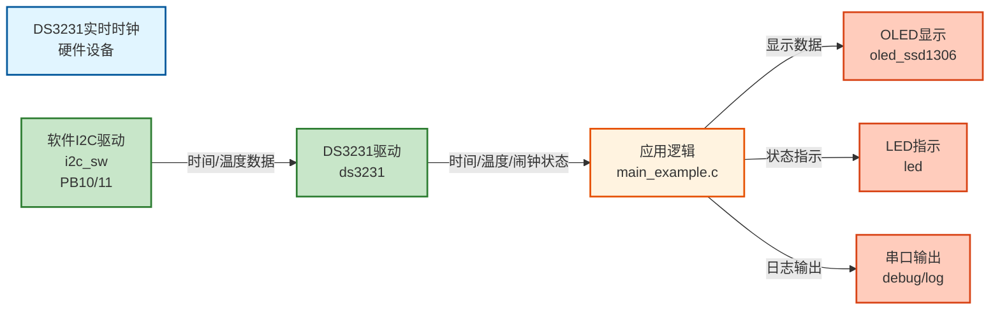

# I2C01 - DS3231实时时钟模块演示（软件I2C接口�?
## 📋 案例目的

- **核心目标**：演示如何使用软件I2C接口与DS3231实时时钟模块通信，展示DS3231的常规配置流程和常用功能
- **学习重点**�?  - 理解软件I2C接口的配置和使用方法
  - 掌握DS3231初始化和配置流程
  - 学习DS3231时间读取和设置方�?  - 了解DS3231温度读取、闹钟配置等功能
  - 学习软件I2C与硬件I2C的区别和适用场景
- **应用场景**：适用于需要实时时钟功能但无硬件I2C外设或需要灵活引脚配置的应用

### 核心功能

1. **DS3231初始化（软件I2C接口�?*
   - 演示软件I2C接口的初始化步骤
   - 展示软件I2C的配置和使用（PB10/11�?
2. **DS3231常规配置流程**
   - 检查并清除振荡器停止标志（OSF�?   - 启动振荡�?   - 配置方波输出
   - 禁用32kHz输出
   - 配置中断模式

3. **DS3231常用功能示例**
   - 时间读取和设�?   - 温度读取
   - 闹钟配置（Alarm 1�?   - 闹钟标志检�?   - 方波输出控制

4. **主循环实时显�?*
   - 每秒读取并显示当前时�?   - LED闪烁指示系统运行

## 🔧 硬件要求

- **LED1**：连接到 `PA1`（系统状态指示）
- **DS3231实时时钟模块**（I2C接口）：
  - SCL：`PB10`（软件I2C�?  - SDA：`PB11`（软件I2C�?  - VCC�?.3V
  - GND：GND
  - **注意**：DS3231模块需要外部上拉电阻（通常4.7kΩ-10kΩ）连接到SCL和SDA
- **OLED显示�?*（软件I2C接口）：
  - SCL：`PB8`（软件I2C�?  - SDA：`PB9`（软件I2C�?  - VCC�?.3V
  - GND：GND

## 📦 模块依赖

### 模块依赖关系�?
展示本案例使用的模块及其依赖关系�?
```mermaid
%%{init: {'flowchart': {'curve': 'basis'}}}%%
flowchart TB
    %% 应用�?    subgraph APP_LAYER[应用层]
        APP[I2C01案例<br/>main_example.c]
    end
    
    %% 系统服务�?    subgraph SYS_LAYER[系统服务层]
        direction LR
        SYS_INIT[System_Init]
        DELAY[Delay]
        BASE_TIMER[TIM2_TimeBase]
        SYS_INIT --- DELAY
        DELAY --- BASE_TIMER
    end
    
    %% 驱动�?    subgraph DRV_LAYER[驱动层]
        direction LR
        GPIO[GPIO]
        I2C_SW[I2C_SW]
        DS3231[DS3231]
        OLED[OLED]
        LED[LED]
    end
    
    %% 调试工具�?    subgraph DEBUG_LAYER[调试工具层]
        direction LR
        DEBUG[Debug]
        LOG[Log]
        ERROR[ErrorHandler]
        DEBUG --- LOG
        LOG --- ERROR
    end
    
    %% 硬件抽象�?    subgraph BSP_LAYER[硬件抽象层]
        BSP[board.h<br/>硬件配置]
    end
    
    %% 应用层依�?    APP --> SYS_INIT
    APP --> I2C_SW
    APP --> DS3231
    APP --> OLED
    APP --> LED
    APP --> DELAY
    
    %% 系统服务层依�?    SYS_INIT --> GPIO
    SYS_INIT --> LED
    DELAY --> BASE_TIMER
    
    %% 驱动层内部依�?    DS3231 --> I2C_SW
    I2C_SW --> GPIO
    OLED --> I2C_SW
    LED --> GPIO
    
    %% 调试工具层依�?    DEBUG --> GPIO
    LOG --> BASE_TIMER
    ERROR --> GPIO
    
    %% BSP配置依赖（统一表示�?    DRV_LAYER -.->|配置依赖| BSP
    
    %% 样式
    classDef appLayer fill:#e1f5ff,stroke:#01579b,stroke-width:2px
    classDef sysLayer fill:#f3e5f5,stroke:#4a148c,stroke-width:2px
    classDef driverLayer fill:#e8f5e9,stroke:#1b5e20,stroke-width:2px
    classDef debugLayer fill:#fff3e0,stroke:#e65100,stroke-width:2px
    classDef bspLayer fill:#fce4ec,stroke:#880e4f,stroke-width:2px
    
    class APP appLayer
    class SYS_INIT,DELAY,BASE_TIMER sysLayer
    class GPIO,I2C_SW,DS3231,OLED,LED driverLayer
    class DEBUG,LOG,ERROR debugLayer
    class BSP bspLayer
```

### 模块列表

本案例使用以下模块：

- `soft_i2c`：软件I2C驱动模块（DS3231使用软件I2C�?- `ds3231`：DS3231实时时钟驱动模块（核心）
- `gpio`：GPIO驱动模块（软件I2C依赖�?- `led`：LED驱动模块（状态指示）
- `oled`：OLED显示模块（默认显示器�?- `delay`：延时模�?- `error_handler`：错误处理模�?- `log`：日志模块（调试输出�?
## 🚀 使用步骤

### 步骤1：硬件连�?
1. 将DS3231模块连接到STM32�?   - DS3231 SCL �?STM32 PB10
   - DS3231 SDA �?STM32 PB11
   - DS3231 VCC �?3.3V
   - DS3231 GND �?GND

2. **重要**：在SCL和SDA线上添加上拉电阻�?.7kΩ-10kΩ）到3.3V

3. 将OLED显示屏连接到STM32�?   - OLED SCL �?STM32 PB8
   - OLED SDA �?STM32 PB9
   - OLED VCC �?3.3V
   - OLED GND �?GND

### 步骤2：配置模块开�?
�?`config.h` 中启用必要模块：

```c
#define CONFIG_MODULE_SOFT_I2C_ENABLED     1   /* 启用软件I2C模块 */
#define CONFIG_MODULE_DS3231_ENABLED        1   /* 启用DS3231模块 */
#define CONFIG_MODULE_OLED_ENABLED         1   /* 启用OLED模块 */
```

### 步骤3：配置硬�?
�?`board.h` 中配置软件I2C�?
```c
#define SOFT_I2C_CONFIGS {                                                                    \
    {GPIOB, GPIO_Pin_10, GPIOB, GPIO_Pin_11, 5, 1}, /* SoftI2C1：PB10(SCL), PB11(SDA)�?us延时，启用（DS3231�?*/ \
}
```

### 步骤4：初始化流程

```c
/* 1. 系统初始�?*/
System_Init();

/* 2. 软件I2C初始化（SoftI2C2: PB10/11�?*/
I2C_SW_Init(SOFT_I2C_INSTANCE_2);

/* 3. DS3231初始化（软件I2C接口�?*/
DS3231_Config_t ds3231_config;
ds3231_config.interface_type = DS3231_INTERFACE_SOFTWARE;
ds3231_config.config.software.soft_i2c_instance = SOFT_I2C_INSTANCE_2;  /* 使用SoftI2C2实例（PB10/11�?*/
DS3231_Init(&ds3231_config);
```

## 📝 代码说明

### 主要区别（与案例11对比�?
1. **I2C接口类型**�?   - 案例11：硬件I2C（I2C2外设�?   - 案例12：软件I2C（GPIO模拟�?
2. **初始化方�?*�?   - 案例11：`I2C_HW_Init(I2C_INSTANCE_2)`
   - 案例12：`I2C_SW_Init(SOFT_I2C_INSTANCE_2)`

3. **DS3231配置**�?   - 案例11：`DS3231_INTERFACE_HARDWARE` + `i2c_instance`
   - 案例12：`DS3231_INTERFACE_SOFTWARE` + GPIO引脚配置

### 功能演示

案例12演示了以下功能（与案�?1相同）：

1. **时间读取和设�?*：读取当前时间并设置新时�?2. **温度读取**：读取DS3231内部温度传感�?3. **闹钟配置**：配置Alarm 1，在每分钟的�?0秒触�?4. **方波输出**：配�?Hz方波输出
5. **32kHz输出控制**：禁�?2kHz输出以节省功�?
## 🔄 实现流程

### 整体逻辑

本案例通过软件I2C接口与DS3231通信，演示DS3231的完整使用流程。整体流程如下：

1. **初始化阶�?*
   - 系统初始�?   - 软件I2C初始化（SoftI2C2: PB10/11�?   - DS3231初始化（配置软件I2C接口�?   - OLED初始化（用于显示时间�?
2. **DS3231配置阶段**
   - 检查并清除振荡器停止标志（OSF�?   - 启动振荡�?   - 配置方波输出�?Hz�?   - 禁用32kHz输出
   - 配置中断模式

3. **功能演示阶段**
   - 设置初始时间
   - 读取并显示时�?   - 读取温度
   - 配置闹钟（Alarm 1�?
4. **主循�?*
   - 每秒读取并显示当前时�?   - 检查闹钟标�?   - LED闪烁指示系统运行

### 数据流向�?


### 关键方法

- **软件I2C接口**：通过GPIO模拟I2C时序，实现I2C通信
- **DS3231配置流程**：按照标准流程配置DS3231，确保正常工�?- **时间格式转换**：处理DS3231的BCD格式和标准时间格式的转换

### 工作流程示意�?
```mermaid
flowchart TD
    %% 初始化阶�?    subgraph INIT[初始化阶段]
        direction TB
        START[系统初始�?br/>System_Init]
        START --> I2C_INIT[软件I2C初始�?br/>I2C_SW_Init<br/>SoftI2C2 PB10/11]
        I2C_INIT --> DS3231_INIT[DS3231初始�?br/>DS3231_Init<br/>软件I2C接口]
        DS3231_INIT --> OLED_INIT[OLED初始�?br/>OLED_Init]
    end
    
    %% 配置阶段
    subgraph CONFIG[配置阶段]
        direction TB
        CHECK_OSF[检查并清除OSF标志<br/>DS3231_CheckOSF]
        CHECK_OSF --> START_OSC[启动振荡�?br/>DS3231_StartOscillator]
        START_OSC --> CONFIG_SQW[配置方波输出<br/>DS3231_SetSquareWave<br/>1Hz]
        CONFIG_SQW --> DISABLE_32K[禁用32kHz输出<br/>DS3231_Enable32kHz]
        DISABLE_32K --> SET_TIME[设置初始时间<br/>DS3231_SetDateTime]
    end
    
    %% 主循环阶�?    subgraph LOOP[主循环阶段]
        direction TB
        MAIN_LOOP[主循环开始]
        MAIN_LOOP --> READ_TIME[读取时间<br/>DS3231_ReadDateTime]
        READ_TIME --> READ_TEMP[读取温度<br/>DS3231_ReadTemperature]
        READ_TEMP --> CHECK_ALARM[检查闹钟标�?br/>DS3231_CheckAlarm1]
        CHECK_ALARM --> UPDATE_OLED[更新OLED显示]
        UPDATE_OLED --> LED_BLINK[LED闪烁指示]
        LED_BLINK --> DELAY[延时1�?br/>Delay_ms]
        DELAY --> MAIN_LOOP
    end
    
    %% 连接
    OLED_INIT --> CHECK_OSF
    SET_TIME --> MAIN_LOOP
    
    %% 样式 - 初始�?    style START fill:#e1f5ff,stroke:#01579b,stroke-width:2px
    style OLED_INIT fill:#e1f5ff,stroke:#01579b,stroke-width:2px
    
    %% 样式 - 配置
    style CHECK_OSF fill:#fff3e0,stroke:#e65100,stroke-width:2px
    style SET_TIME fill:#fff3e0,stroke:#e65100,stroke-width:2px
    
    %% 样式 - 主循�?    style MAIN_LOOP fill:#fff3e0,stroke:#e65100,stroke-width:3px
    style READ_TIME fill:#c8e6c9,stroke:#2e7d32,stroke-width:2px
    style READ_TEMP fill:#c8e6c9,stroke:#2e7d32,stroke-width:2px
    style CHECK_ALARM fill:#c8e6c9,stroke:#2e7d32,stroke-width:2px
    style UPDATE_OLED fill:#ffccbc,stroke:#d84315,stroke-width:2px
    style DELAY fill:#f5f5f5,stroke:#757575,stroke-width:1px
```

## 📚 关键函数说明

### 软件I2C相关函数

- **`I2C_SW_Init()`**：初始化软件I2C接口
  - 在本案例中用于初始化SoftI2C2（PB10/11），供DS3231使用
  - 必须在使用DS3231前调�?
### DS3231相关函数

- **`DS3231_Init()`**：初始化DS3231模块
  - 在本案例中用于初始化DS3231，配置软件I2C接口
  - 需要配置interface_type为DS3231_INTERFACE_SOFTWARE

- **`DS3231_ReadTime()`**：读取DS3231时间
  - 在本案例中用于读取当前时间并显示
  - 返回BCD格式的时间，需要转换为标准格式

- **`DS3231_SetTime()`**：设置DS3231时间
  - 在本案例中用于设置初始时�?  - 需要提供标准格式的时间结构�?
- **`DS3231_ReadTemperature()`**：读取DS3231温度
  - 在本案例中用于读取内部温度传感器�?  - 返回浮点数温度�?
- **`DS3231_SetAlarm1()`**：设置Alarm 1闹钟
  - 在本案例中用于配置闹钟，在每分钟的第30秒触�?
- **`DS3231_CheckAlarm1Flag()`**：检查Alarm 1标志
  - 在本案例中用于检查闹钟是否触�?
### OLED相关函数

- **`OLED_Init()`**：初始化OLED显示�?  - 在本案例中用于初始化OLED，显示时间信�?
- **`OLED_ShowString()`**：显示字符串
  - 在本案例中用于显示时间、温度等信息

**详细函数实现和调用示例请参�?*：`main_example.c` 中的代码

## ⚠️ 注意事项与重�?
### ⚠️ 重要提示

1. **上拉电阻**�?   - DS3231的SCL和SDA线必须连接上拉电阻（4.7kΩ-10kΩ）到3.3V
   - 这是I2C总线的基本要求，否则通信会失�?
2. **引脚冲突**�?   - 确保DS3231（PB10/11）和OLED（PB8/9）使用不同的引脚
   - 两个设备使用不同的软件I2C实例，不会冲�?
3. **时序延时**�?   - 软件I2C的延时参数（`delay_us`）需要根据系统时钟调�?   - 标准模式建议5-10us，快速模式建�?-5us

4. **软件I2C限制**�?   - 软件I2C速度较慢，不适合高速通信
   - 但对于DS3231（标准模�?00kHz）完全足�?
5. **OSF标志**�?   - 如果OSF标志�?，说明振荡器曾经停止，时间可能不准确
   - 需要清除OSF标志并重新设置时�?
### 🔑 关键�?
1. **软件I2C vs 硬件I2C**�?   - 软件I2C：灵活，可配置任意GPIO引脚，但速度较慢
   - 硬件I2C：速度快，但占用硬件外设，引脚固定

2. **DS3231配置顺序**�?   - 先检查OSF标志
   - 再配置其他功能（方波、中断等�?   - 最后设置时�?
3. **时间格式**�?   - DS3231使用BCD格式存储时间
   - 需要转换为标准格式进行显示和计�?
### 💡 调试技�?
1. **I2C通信失败排查**�?   - 检查上拉电阻是否正确连�?   - 检查引脚配置是否正�?   - 检查时序延时参数是否合�?   - 使用示波器检查I2C信号

2. **时间读取异常**�?   - 检查OSF标志，如果为1需要清除并重新设置时间
   - 检查时间格式转换是否正�?
3. **闹钟不触�?*�?   - 检查闹钟配置是否正�?   - 检查中断模式是否已配置
   - 检查闹钟标志是否被清除

## 💡 扩展练习

### 循序渐进理解本案�?
1. **修改时间格式**：尝试不同的时间显示格式�?2小时制�?4小时制等），添加日期显示，理解时间数据的处理和格式化
2. **添加更多闹钟**：配置Alarm 2闹钟，实现多个闹钟功能，理解DS3231的闹钟配置方�?3. **温度监控**：实现温度报警功能，记录温度历史数据，理解DS3231的温度读取功�?
### 实际场景中的常见坑点

4. **I2C通信失败处理**：当I2C通信失败时（如设备未连接、通信干扰等），如何检测和处理？如何实现通信重试机制？如何避免程序因通信失败而卡死？
5. **时间同步问题**：如果系统断电后重新上电，DS3231的时间可能已经更新，但系统时间可能不同步。如何检测和处理时间不同步的情况？如何实现时间同步机制？
6. **多I2C设备冲突**：如果总线上有多个I2C设备，如何避免地址冲突？如何实现多设备的管理和通信？如何处理设备热插拔的情况？

## 🔍 与案�?1的对�?
| 特�?| 案例11（硬件I2C�?| 案例12（软件I2C�?|
|------|------------------|------------------|
| I2C接口 | 硬件I2C2外设 | 软件I2C（GPIO模拟�?|
| 引脚 | PB10/11（固定） | PB10/11（可配置�?|
| 速度 | 硬件控制，可�?00kHz | 软件控制，通常<100kHz |
| 资源占用 | 占用I2C外设 | 仅占用GPIO引脚 |
| 适用场景 | 高速通信、多I2C设备 | 引脚灵活、无硬件I2C外设 |

## 📖 相关文档

- **模块文档**�?  - **DS3231驱动**：`../../Drivers/sensors/ds3231.c/h`
  - **软件I2C驱动**：`../../Drivers/i2c/i2c_sw.c/h`
  - **OLED驱动**：`../../Drivers/display/oled_ssd1306.c/h`
  - **OLED字库**：`../../Drivers/display/oled_font_ascii8x16.c/h`

- **业务文档**�?  - **主程序代�?*：`main_example.c`
  - **硬件配置**：`board.h`
  - **模块配置**：`config.h`
  - **项目规范文档**：`PROJECT_KEYWORDS.md`
  - **案例参�?*：`Examples/README.md`
- **LED驱动**：`../../Drivers/basic/led.c/h`
- **GPIO驱动**：`../../Drivers/basic/gpio.c/h`
- **延时功能**：`../../system/delay.c/h`
- **系统初始�?*：`../../system/system_init.c/h`
- **硬件配置**：案例目录下�?`board.h`
- **模块配置**：案例目录下�?`config.h`
