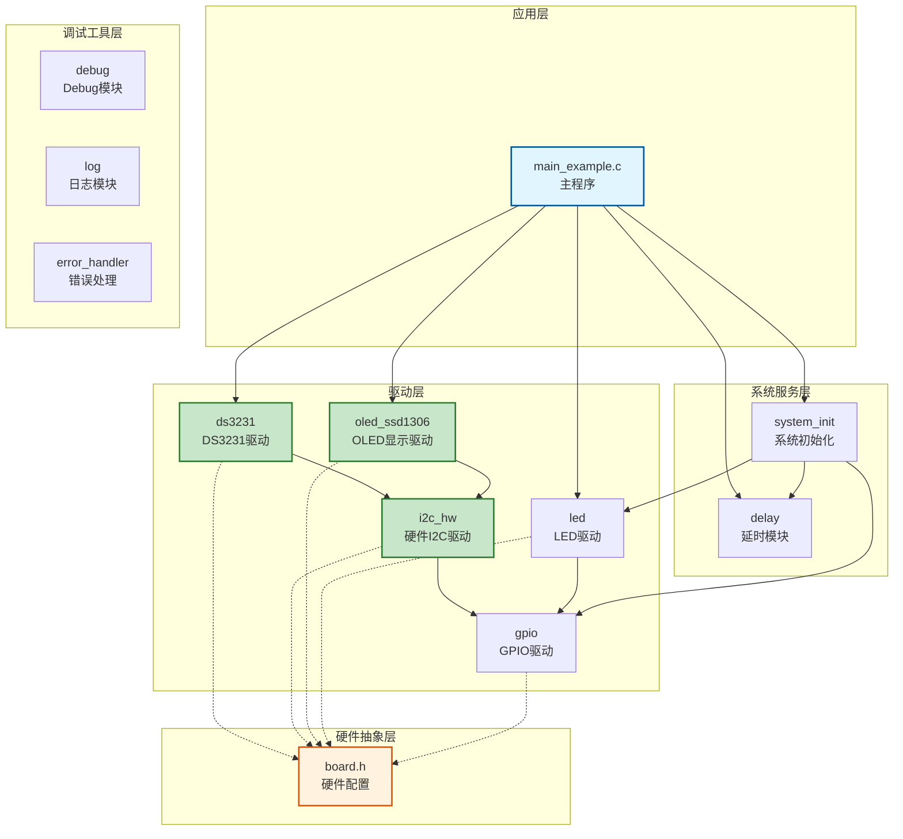
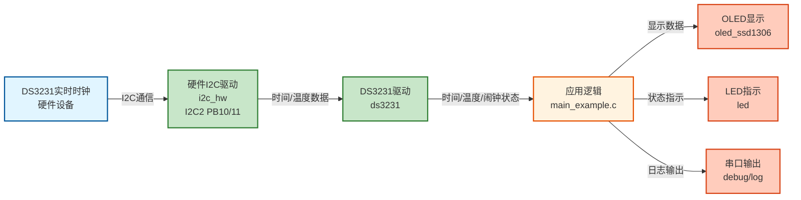

# I2C02 - DS3231实时时钟模块演示（硬件I2C接口）

## 📋 案例目的

- **核心目标**：演示如何使用硬件I2C接口与DS3231实时时钟模块通信，展示DS3231的常规配置流程和常用功能
- **学习重点**：
  - 理解硬件I2C接口的配置和使用方法
  - 掌握DS3231初始化和配置流程
  - 学习DS3231时间读取和设置方法
  - 了解DS3231温度读取、闹钟配置等功能
  - 学习硬件I2C与软件I2C的区别和适用场景
- **应用场景**：适用于需要实时时钟功能且需要高速I2C通信的应用

### 核心功能

1. **DS3231初始化（硬件I2C接口）**
   - 演示硬件I2C接口的初始化步骤
   - 展示I2C2的配置和使用

2. **DS3231常规配置流程**
   - 检查并清除振荡器停止标志（OSF）
   - 启动振荡器
   - 配置方波输出
   - 禁用32kHz输出
   - 配置中断模式

3. **DS3231常用功能示例**
   - 时间读取和设置
   - 温度读取
   - 闹钟配置（Alarm 1）
   - 闹钟标志检查
   - 方波输出控制

4. **主循环实时显示**
   - 每秒读取并显示当前时间
   - LED闪烁指示系统运行

## 🔧 硬件要求

- **LED1**：连接到 `PA1`（系统状态指示）
- **DS3231实时时钟模块**（I2C接口）：
  - SCL：`PB10`（I2C2）
  - SDA：`PB11`（I2C2）
  - VCC：3.3V
  - GND：GND
  - **注意**：DS3231模块需要外部上拉电阻（通常4.7kΩ-10kΩ）连接到SCL和SDA

## 📦 模块依赖

### 模块依赖关系图



### 模块列表

- `i2c`：硬件I2C驱动模块（DS3231使用I2C2）
- `ds3231`：DS3231实时时钟驱动模块（核心）
- `gpio`：GPIO驱动模块（I2C依赖）
- `led`：LED驱动模块（状态指示）
- `delay`：延时模块
- `error_handler`：错误处理模块
- `log`：日志模块（调试输出）

## 🚀 使用步骤

### 步骤1：硬件连接

1. 将DS3231模块连接到STM32：
   - DS3231 SCL → STM32 PB10
   - DS3231 SDA → STM32 PB11
   - DS3231 VCC → 3.3V
   - DS3231 GND → GND

2. **重要**：在SCL和SDA线上添加上拉电阻（4.7kΩ-10kΩ）到3.3V

### 步骤2：配置模块开关

在 `config.h` 中启用必要模块：

```c
#define CONFIG_MODULE_I2C_ENABLED           1   /* 启用I2C模块 */
#define CONFIG_MODULE_DS3231_ENABLED        1   /* 启用DS3231模块 */
```

### 步骤3：配置硬件

在 `board.h` 中配置I2C2：

```c
#define I2C_CONFIGS {                                                                    \
    {I2C2, GPIOB, GPIO_Pin_10, GPIOB, GPIO_Pin_11, 100000, 0x00, 1}, /* I2C2：PB10(SCL), PB11(SDA)，100kHz */ \
}
```

### 步骤4：初始化流程

```c
/* 1. 系统初始化 */
System_Init();

/* 2. I2C初始化（I2C2） */
I2C_HW_Init(I2C_INSTANCE_2);

/* 3. DS3231初始化（硬件I2C接口） */
DS3231_Config_t ds3231_config;
ds3231_config.interface_type = DS3231_INTERFACE_HARDWARE;
ds3231_config.config.hardware.i2c_instance = I2C_INSTANCE_2;
DS3231_Init(&ds3231_config);
```

## 🔄 实现流程

### 整体逻辑

本案例通过硬件I2C接口与DS3231通信，演示DS3231的完整使用流程。整体流程如下：

1. **初始化阶段**
   - 系统初始化
   - 硬件I2C初始化（I2C2: PB10/11）
   - DS3231初始化（配置硬件I2C接口）

2. **DS3231配置阶段**
   - 检查并清除振荡器停止标志（OSF）
   - 启动振荡器
   - 配置方波输出（1Hz）
   - 禁用32kHz输出
   - 配置中断模式

3. **功能演示阶段**
   - 设置初始时间
   - 读取并显示时间
   - 读取温度
   - 配置闹钟（Alarm 1）

4. **主循环**
   - 每秒读取并显示当前时间
   - 检查闹钟标志
   - LED闪烁指示系统运行

### 数据流向图



### 关键方法

- **硬件I2C接口**：使用STM32硬件I2C外设，速度快，资源占用少
- **DS3231配置流程**：按照标准流程配置DS3231，确保正常工作
- **时间格式转换**：处理DS3231的BCD格式和标准时间格式的转换

### 工作流程示意图

```mermaid
flowchart TD
    %% 初始化阶段
    subgraph INIT[初始化阶段]
        direction TB
        START[系统初始化<br/>System_Init]
        START --> I2C_INIT[硬件I2C初始化<br/>I2C_HW_Init<br/>I2C2 PB10/11]
        I2C_INIT --> DS3231_INIT[DS3231初始化<br/>DS3231_Init<br/>硬件I2C接口]
        DS3231_INIT --> OLED_INIT[OLED初始化<br/>OLED_Init]
    end
    
    %% 配置阶段
    subgraph CONFIG[配置阶段]
        direction TB
        CHECK_OSF[检查并清除OSF标志<br/>DS3231_CheckOSF]
        CHECK_OSF --> START_OSC[启动振荡器<br/>DS3231_StartOscillator]
        START_OSC --> CONFIG_SQW[配置方波输出<br/>DS3231_SetSquareWave<br/>1Hz]
        CONFIG_SQW --> DISABLE_32K[禁用32kHz输出<br/>DS3231_Enable32kHz]
        DISABLE_32K --> SET_TIME[设置初始时间<br/>DS3231_SetDateTime]
    end
    
    %% 主循环阶段
    subgraph LOOP[主循环阶段]
        direction TB
        MAIN_LOOP[主循环开始]
        MAIN_LOOP --> READ_TIME[读取时间<br/>DS3231_ReadDateTime]
        READ_TIME --> READ_TEMP[读取温度<br/>DS3231_ReadTemperature]
        READ_TEMP --> CHECK_ALARM[检查闹钟标志<br/>DS3231_CheckAlarm1]
        CHECK_ALARM --> UPDATE_OLED[更新OLED显示]
        UPDATE_OLED --> LED_BLINK[LED闪烁指示]
        LED_BLINK --> DELAY[延时1秒<br/>Delay_ms]
        DELAY --> MAIN_LOOP
    end
    
    %% 连接
    OLED_INIT --> CHECK_OSF
    SET_TIME --> MAIN_LOOP
    
    %% 样式 - 初始化
    style START fill:#e1f5ff,stroke:#01579b,stroke-width:2px
    style OLED_INIT fill:#e1f5ff,stroke:#01579b,stroke-width:2px
    
    %% 样式 - 配置
    style CHECK_OSF fill:#fff3e0,stroke:#e65100,stroke-width:2px
    style SET_TIME fill:#fff3e0,stroke:#e65100,stroke-width:2px
    
    %% 样式 - 主循环
    style MAIN_LOOP fill:#fff3e0,stroke:#e65100,stroke-width:3px
    style READ_TIME fill:#c8e6c9,stroke:#2e7d32,stroke-width:2px
    style READ_TEMP fill:#c8e6c9,stroke:#2e7d32,stroke-width:2px
    style CHECK_ALARM fill:#c8e6c9,stroke:#2e7d32,stroke-width:2px
    style UPDATE_OLED fill:#ffccbc,stroke:#d84315,stroke-width:2px
    style DELAY fill:#f5f5f5,stroke:#757575,stroke-width:1px
```



## 📚 关键函数说明

### 硬件I2C相关函数

- **`I2C_HW_Init()`**：初始化硬件I2C接口
  - 在本案例中用于初始化I2C2（PB10/11），供DS3231使用
  - 必须在使用DS3231前调用

### DS3231相关函数

- **`DS3231_Init()`**：初始化DS3231模块
  - 在本案例中用于初始化DS3231，配置硬件I2C接口
  - 需要配置interface_type为DS3231_INTERFACE_HARDWARE

- **`DS3231_ReadTime()`**：读取DS3231时间
  - 在本案例中用于读取当前时间并显示
  - 返回BCD格式的时间，需要转换为标准格式

- **`DS3231_SetTime()`**：设置DS3231时间
  - 在本案例中用于设置初始时间
  - 需要提供标准格式的时间结构体

- **`DS3231_ReadTemperature()`**：读取DS3231温度
  - 在本案例中用于读取内部温度传感器值
  - 返回浮点数温度值

- **`DS3231_SetAlarm1()`**：设置Alarm 1闹钟
  - 在本案例中用于配置闹钟，在每分钟的第30秒触发

- **`DS3231_CheckAlarm1Flag()`**：检查Alarm 1标志
  - 在本案例中用于检查闹钟是否触发

**详细函数实现和调用示例请参考**：`main_example.c` 中的代码

## 📊 DS3231常规配置流程

### 1. 检查振荡器停止标志（OSF）

```c
uint8_t osf_flag;
DS3231_CheckOSF(&osf_flag);
if (osf_flag)
{
    /* OSF标志被设置，时间可能不准确 */
    DS3231_ClearOSF();  /* 清除OSF标志 */
}
```

### 2. 启动振荡器

```c
DS3231_Start();  /* 确保RTC运行 */
```

### 3. 配置方波输出

```c
/* 设置1Hz方波输出并使能 */
DS3231_SetSquareWave(DS3231_SQW_1HZ, 1);

/* 或禁用方波输出 */
DS3231_DisableSquareWave();
```

### 4. 配置32kHz输出

```c
/* 禁用32kHz输出（节省功耗） */
DS3231_Disable32kHz();

/* 或使能32kHz输出 */
DS3231_Enable32kHz();
```

### 5. 配置中断模式

```c
/* 配置为方波输出模式 */
DS3231_SetInterruptMode(DS3231_INT_MODE_SQUARE_WAVE);

/* 或配置为闹钟中断模式 */
DS3231_SetInterruptMode(DS3231_INT_MODE_ALARM);
```

## 📝 DS3231常用功能示例

### 示例1：读取和设置时间

```c
DS3231_Time_t time;

/* 读取当前时间 */
DS3231_ReadTime(&time);
printf("Time: %04d-%02d-%02d %02d:%02d:%02d\r\n",
       time.year, time.month, time.day,
       time.hour, time.minute, time.second);

/* 设置时间 */
time.year = 2024;
time.month = 1;
time.day = 1;
time.weekday = 1;  /* Monday */
time.hour = 12;
time.minute = 0;
time.second = 0;
DS3231_SetTime(&time);
```

### 示例2：读取温度

```c
int16_t temperature;

/* 读取温度（单位：0.01°C，例如2500表示25.00°C） */
DS3231_ReadTemperature(&temperature);

/* 转换为浮点数 */
float temp_float;
DS3231_ReadTemperatureFloat(&temp_float);
```

### 示例3：配置闹钟1

```c
DS3231_Alarm_t alarm1;

/* 配置为每分钟的第30秒触发 */
alarm1.mode = DS3231_ALARM_MODE_SECOND_MATCH;
alarm1.second = 30;
alarm1.minute = 0x80;  /* 匹配模式 */
alarm1.hour = 0x80;    /* 匹配模式 */
alarm1.day_or_weekday = 0x80;  /* 匹配模式 */

DS3231_SetAlarm1(&alarm1);
DS3231_EnableAlarm1();  /* 使能闹钟中断 */
```

### 示例4：检查闹钟标志

```c
uint8_t alarm_flag;

/* 检查闹钟1标志 */
DS3231_CheckAlarm1Flag(&alarm_flag);
if (alarm_flag)
{
    printf("Alarm 1 triggered!\r\n");
    DS3231_ClearAlarm1Flag();  /* 清除标志 */
}
```

### 示例5：方波输出频率选择

```c
/* 1Hz方波 */
DS3231_SetSquareWave(DS3231_SQW_1HZ, 1);

/* 1.024kHz方波 */
DS3231_SetSquareWave(DS3231_SQW_1024HZ, 1);

/* 4.096kHz方波 */
DS3231_SetSquareWave(DS3231_SQW_4096HZ, 1);

/* 8.192kHz方波 */
DS3231_SetSquareWave(DS3231_SQW_8192HZ, 1);
```

## ⚠️ 注意事项

### 1. I2C上拉电阻

**必须**在SCL和SDA线上添加上拉电阻（4.7kΩ-10kΩ）到3.3V，否则I2C通信会失败。

### 2. 初始化顺序

1. 先初始化I2C模块：`I2C_HW_Init(I2C_INSTANCE_2)`
2. 再初始化DS3231：`DS3231_Init(&config)`

### 3. OSF标志

- 如果检测到OSF标志，说明振荡器曾经停止过，时间可能不准确
- 首次使用或电池耗尽后，需要清除OSF标志并重新设置时间

### 4. 时间格式

- DS3231使用24小时制
- 星期：1=Sunday, 2=Monday, ..., 7=Saturday
- 年份范围：2000-2099

### 5. 闹钟匹配模式

- `DS3231_ALARM_MODE_ONCE_PER_SECOND`：每秒触发
- `DS3231_ALARM_MODE_SECOND_MATCH`：秒匹配
- `DS3231_ALARM_MODE_MIN_SEC_MATCH`：分秒匹配
- `DS3231_ALARM_MODE_HOUR_MIN_SEC_MATCH`：时分秒匹配
- `DS3231_ALARM_MODE_DAY_HOUR_MIN_SEC_MATCH`：日期时分秒匹配
- `DS3231_ALARM_MODE_WEEKDAY_HOUR_MIN_SEC_MATCH`：星期时分秒匹配

### 6. 方波输出

- 方波从INT/SQW引脚输出
- 需要配置中断模式为`DS3231_INT_MODE_SQUARE_WAVE`才能输出方波
- 如果配置为`DS3231_INT_MODE_ALARM`，方波输出会被禁用

## 🔍 测试方法

### 测试1：基本通信测试

1. 编译并下载程序
2. 观察串口输出，应该能看到DS3231初始化成功的消息
3. 如果初始化失败，检查：
   - I2C上拉电阻是否正确连接
   - 硬件连接是否正确
   - I2C地址是否正确（DS3231默认地址：0x68）

### 测试2：时间读取测试

1. 程序会自动读取并显示当前时间
2. 观察串口输出的时间格式是否正确
3. 验证时间是否在合理范围内

### 测试3：时间设置测试

1. 程序会设置时间为2024-01-01 12:00:00
2. 观察串口输出，验证设置是否成功
3. 等待几秒后再次读取，验证时间是否在递增

### 测试4：温度读取测试

1. 程序会自动读取温度
2. 观察串口输出的温度值
3. 温度应该在合理范围内（通常20-40°C）

### 测试5：闹钟测试

1. 程序会配置闹钟1为每分钟的第30秒触发
2. 等待到第30秒，观察是否触发
3. 验证闹钟标志是否正确设置和清除

### 测试6：方波输出测试

1. 使用示波器或逻辑分析仪连接到INT/SQW引脚
2. 配置1Hz方波输出
3. 观察是否输出1Hz方波信号

## 📝 代码结构

```
example11_ds3231_demo/
├── main_example.c      # 主程序文件
├── board.h             # 硬件配置（I2C2配置）
├── config.h            # 模块开关配置
└── README.md           # 本文档
```


## 📌 总结

DS3231实时时钟模块提供了完整的RTC功能，包括：

1. ✅ **时间管理**：精确的时间读取和设置
2. ✅ **温度监控**：内置温度传感器
3. ✅ **闹钟功能**：两个可编程闹钟
4. ✅ **方波输出**：可配置频率的方波信号
5. ✅ **低功耗**：支持电池备份

通过本案例，您可以快速掌握DS3231的使用方法，并将其集成到您的项目中。

**串口输出示例**：
```
========================================
  案例11：DS3231实时时钟模块演示
  硬件I2C接口（I2C2，PB10/11）
========================================

初始化I2C2（PB10/11）...
I2C2初始化成功

初始化DS3231（硬件I2C接口）...
DS3231初始化成功

=== DS3231常规配置流程 ===
1. 检查振荡器停止标志（OSF）...
  OSF标志正常，时间准确
2. 启动振荡器...
  振荡器已启动
3. 配置方波输出（1Hz）...
  方波输出已配置为1Hz
...

Time: 2024-01-01 12:00:00 Mon
Temperature: 25.00 C
...
```

## ⚠️ 注意事项与重点

### ⚠️ 重要提示

1. **上拉电阻**：
   - DS3231的SCL和SDA线必须连接上拉电阻（4.7kΩ-10kΩ）到3.3V
   - 这是I2C总线的基本要求，否则通信会失败

2. **I2C地址**：
   - DS3231的I2C地址固定为0x68（7位地址）
   - 确保没有其他设备使用相同地址

3. **OSF标志**：
   - 如果OSF标志为1，说明振荡器曾经停止，时间可能不准确
   - 需要清除OSF标志并重新设置时间

4. **硬件I2C限制**：
   - 硬件I2C引脚固定（I2C2: PB10/11）
   - 如果需要灵活引脚配置，使用软件I2C

### 🔑 关键点

1. **硬件I2C vs 软件I2C**：
   - 硬件I2C：速度快（可达400kHz），占用硬件外设，引脚固定
   - 软件I2C：灵活，可配置任意GPIO引脚，但速度较慢

2. **DS3231配置顺序**：
   - 先检查OSF标志
   - 再配置其他功能（方波、中断等）
   - 最后设置时间

3. **时间格式**：
   - DS3231使用BCD格式存储时间
   - 需要转换为标准格式进行显示和计算

### 💡 调试技巧

1. **I2C通信失败排查**：
   - 检查上拉电阻是否正确连接
   - 检查引脚配置是否正确
   - 检查I2C地址是否正确（0x68）
   - 使用示波器检查I2C信号

2. **时间读取异常**：
   - 检查OSF标志，如果为1需要清除并重新设置时间
   - 检查时间格式转换是否正确

3. **闹钟不触发**：
   - 检查闹钟配置是否正确
   - 检查中断模式是否已配置
   - 检查闹钟标志是否被清除

## 💡 扩展练习

### 循序渐进理解本案例

1. **修改时间格式**：尝试不同的时间显示格式（12小时制、24小时制等），添加日期显示，理解时间数据的处理和格式化
2. **添加更多闹钟**：配置Alarm 2闹钟，实现多个闹钟功能，理解DS3231的闹钟配置方法
3. **温度监控**：实现温度报警功能，记录温度历史数据，理解DS3231的温度读取功能

### 实际场景中的常见坑点

4. **I2C通信失败处理**：当I2C通信失败时（如设备未连接、通信干扰等），如何检测和处理？如何实现通信重试机制？如何避免程序因通信失败而卡死？
5. **时间同步问题**：如果系统断电后重新上电，DS3231的时间可能已经更新，但系统时间可能不同步。如何检测和处理时间不同步的情况？如何实现时间同步机制？
6. **硬件I2C与软件I2C性能对比**：硬件I2C和软件I2C在性能上有何差异？在什么场景下应该选择硬件I2C，什么场景下选择软件I2C？如何评估和选择？
   - 使用方波输出作为系统时钟源
   - 实现定时功能

5. **优化显示**：
   - 改进显示格式
   - 添加更多信息显示（星期、日期等）

6. **对比软件I2C**：
   - 参考I2C01案例，对比硬件I2C和软件I2C的性能差异
   - 理解两种接口的适用场景

## 📖 相关文档

- **模块文档**：
  - **DS3231驱动**：`../../Drivers/sensors/ds3231.c/h`
  - **硬件I2C驱动**：`../../Drivers/i2c/i2c_hw.c/h`
  - **LED驱动**：`../../Drivers/basic/led.c/h`
  - **GPIO驱动**：`../../Drivers/basic/gpio.c/h`
  - **延时功能**：`../../system/delay.c/h`

- **业务文档**：
  - **主程序代码**：`main_example.c`
  - **硬件配置**：`board.h`
  - **模块配置**：`config.h`
  - **项目规范文档**：`PROJECT_KEYWORDS.md`
  - **案例参考**：`Examples/README.md`
- **系统初始化**：`../../system/system_init.c/h`
- **硬件配置**：案例目录下的 `board.h`
- **模块配置**：案例目录下的 `config.h`

