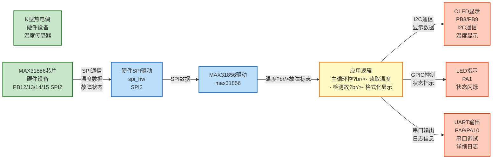

# MAX31856案例 - 热电偶温度传感器读取示例

?**已调试完成，正常工作**

## 📚 重要文档

**⚠️ 调试笔记**：请务必阅读 [`DEBUG_NOTES.md`](DEBUG_NOTES.md)，其中详细记录了所有调试过程中发现的问题、原因分析和解决方案。这是理解为什么代码能正常工作的关键文档?
**关键配置要点**?- ?SR寄存器地址?x0F（故障状态记录寄存器?- ?热电偶温度寄存器地址?x0C-0x0E（LTCBH/LTCBM/LTCBL?- ?冷端温度寄存器地址?x0A-0x0B（CJTH/CJTL?- ?冷端温度数据格式?2位有符号数，分辨?.0625°C
- ?热电偶温度数据格式：19位有符号数，分辨?.0078125°C
- ?转换模式：必须设置CMODE位（bit7? 1启用连续转换
- ?SPI时钟频率?.25MHz（预分频32，不超过5MHz限制?
## ⚠️ 重要说明（必读）

### 📌 术语解释

- **TC（Thermocouple?*：热电偶温度，即热电偶测量点的实际温度（被测温度?  - 显示格式：`TC: 123.45C°`
  - 精度?.0078125°C?/128°C?  - 这是您要测量的目标温?
- **CJ（Cold Junction?*：冷端温度，即MAX31856芯片处的环境温度（用于冷端补偿）
  - 显示格式：`CJ: 25.00C°`
  - 精度?.0625°C?/16°C?  - 用于自动补偿，确保TC温度读数准确

- **Fault（故障状态）**：传感器故障标志
  - 显示格式：`Fault: OK`（无故障）或 `Fault: 0xXX`（有故障?  - 常见故障：热电偶开路、温度过?过低、过?欠压?
### 🔧 热电偶类型配置（重要！）

**必须手动指定热电偶类型，MAX31856不支持自动识别！**

本案例默认配置为 **K型热电偶**，这是最常用的类型?
**如果使用其他类型的热电偶，必须修改代码：**

```c
/* ?MAX31856_InitRoutine() 函数中修?*/
status = MAX31856_SetThermocoupleType(MAX31856_TC_TYPE_K);  // K型（默认?
/* 其他可选类型：
 * MAX31856_TC_TYPE_B  // B型：0°C ~ +1820°C
 * MAX31856_TC_TYPE_E  // E型：-200°C ~ +1000°C
 * MAX31856_TC_TYPE_J  // J型：-210°C ~ +1200°C
 * MAX31856_TC_TYPE_K  // K型：-200°C ~ +1372°C（最常用，本案例默认? * MAX31856_TC_TYPE_N  // N型：-200°C ~ +1300°C
 * MAX31856_TC_TYPE_R  // R型：-50°C ~ +1768°C
 * MAX31856_TC_TYPE_S  // S型：-50°C ~ +1768°C
 * MAX31856_TC_TYPE_T  // T型：-200°C ~ +400°C
 */
```

**为什么需要手动指定？**
- 不同热电偶类型有不同的温?电压特性曲?- MAX31856需要根据类型进行线性化计算
- 芯片无法自动识别物理连接的热电偶类型
- **如果类型设置错误，温度读数会不准确！**

**使用前请确认?*
1. 查看您的热电偶标签或规格，确认实际类?2. 如果使用K型，代码无需修改（已默认配置?3. 如果使用其他类型，请修改 `MAX31856_SetThermocoupleType()` 的参?
---

## 📋 案例目的

- **核心目标**：演示如何使用MAX31856热电偶温度传感器模块，展示MAX31856的初始化、配置和温度读取功能
- **学习重点**?  - 理解MAX31856的基本初始化流程
  - 掌握SPI硬件接口的配置和使用
  - 学习MAX31856的寄存器配置（热电偶类型、转换模式、平均次数）
  - 理解温度读取的基本方法和数据格式
  - 学习完整的错误处理和重试机制
  - 了解故障检测和处理方法
- **应用场景**：适用于需要精确温度测量的应用，如温度监控、工业控制、数据记录等

### 核心功能

1. **MAX31856初始化（硬件SPI接口?*
   - 演示硬件SPI接口的初始化步骤
   - 展示SPI2的配置和使用（PB13/14/15?
2. **MAX31856配置流程**
   - 设置热电偶类型（K型）
   - 设置采样模式?6次平均）
   - 设置转换模式（连续转换）
   - 清除故障状?
3. **温度读取功能**
   - 读取热电偶温度（线性化温度?   - 读取冷端温度（冷端补偿）
   - 故障状态检测和处理

4. **主循环实时显?*
   - ?00ms读取并显示温?   - LED闪烁指示系统运行

## 🔧 硬件要求

- **LED1**：连接到 `PA1`（系统状态指示）
- **MAX31856热电偶温度传感器模块**（SPI接口）：
  - CS：`PB12`
  - SCK：`PB13`（SPI2_SCK?  - SDO：`PB14`（SPI2_MISO?  - SDI：`PB15`（SPI2_MOSI?  - VCC?.3V
  - GND：GND
  - **注意**：MAX31856需要连接K型热电偶

### 📌 外部元件要求

**必需元件?*
- ?**0.1µF陶瓷去耦电?*（VCC到GND，尽量靠近MAX31856芯片?  - 作用：减少电源噪声，提高测量稳定?  - 位置：尽量靠近MAX31856的VCC和GND引脚

**可选元件（根据应用需求）?*
- ?**10µF电解电容**（VCC到GND，用于低频滤波，可选）
- ?**10kΩ上拉电阻**（仅在使用硬件NSS时，本案例不需要）
- ?**100pF~1nF电容**（T+和T-之间，用于高频滤波，仅在强干扰环境）
  - ⚠️ **不会短路?* 电容在直流下是开路的，只对高频噪声有滤波作用
  - 作用：滤除高频电磁干扰，不影响直流温度信?  - 连接：电容一端接T+，另一端接T-（并联在热电偶输入端?- ?**TVS二极?*（T+和T-之间，用于过压保护，仅在恶劣环境?
**注意?*
- 本案例使?*软件NSS控制**，CS引脚由STM32直接控制?*不需要上拉电?*
- 如果使用**硬件NSS控制**，建议在CS引脚和VCC之间连接10kΩ上拉电阻
- 对于大多数应用，**只需?.1µF去耦电?*即可正常工作

### ⚠️ 热电偶线长度说明

**热电偶线长度（如12米）?*
- ?**不需要在程序中配置任何参?*，MAX31856会自动处?- MAX31856芯片内部已经考虑了热电偶线的影响
- 建议使用**屏蔽热电偶线**，减少电磁干?- 12米长度对K型热电偶来说是完全正常的，不会影响测量精?
## 📦 模块依赖

### 模块依赖关系?
展示本案例使用的模块及其依赖关系?
```mermaid
%%{init: {'flowchart': {'curve': 'basis'}}}%%
flowchart TB
    %% 应用?    subgraph APP_LAYER[应用层]
        APP[MAX31856案例<br/>main_example.c]
    end
    
    %% 系统服务?    subgraph SYS_LAYER[系统服务层]
        direction LR
        SYS_INIT[System_Init]
        DELAY[Delay]
        BASE_TIMER[TIM2_TimeBase]
        SYS_INIT --- DELAY
        DELAY --- BASE_TIMER
    end
    
    %% 驱动?    subgraph DRV_LAYER[驱动层]
        direction LR
        GPIO[GPIO]
        SPI_HW[SPI_HW]
        MAX31856[MAX31856]
        I2C_SW[I2C_SW]
        OLED[OLED]
        LED[LED]
        UART[UART]
    end
    
    %% 调试工具?    subgraph DEBUG_LAYER[调试工具层]
        direction LR
        DEBUG[Debug]
        LOG[Log]
        ERROR[ErrorHandler]
        DEBUG --- LOG
        LOG --- ERROR
    end
    
    %% 硬件抽象?    subgraph BSP_LAYER[硬件抽象层]
        BSP[board.h<br/>硬件配置]
    end
    
    %% 应用层依?    APP --> SYS_INIT
    APP --> DEBUG
    APP --> LOG
    APP --> SPI_HW
    APP --> MAX31856
    APP --> OLED
    APP --> LED
    APP --> DELAY
    
    %% 系统服务层依?    SYS_INIT --> GPIO
    SYS_INIT --> LED
    DELAY --> BASE_TIMER
    
    %% 驱动层内部依?    MAX31856 --> SPI_HW
    SPI_HW --> GPIO
    OLED --> I2C_SW
    I2C_SW --> GPIO
    LED --> GPIO
    UART --> GPIO
    
    %% 调试工具层依?    DEBUG --> UART
    LOG --> BASE_TIMER
    ERROR --> UART
    
    %% BSP配置依赖（统一表示?    DRV_LAYER -.->|配置依赖| BSP
    
    %% 样式
    classDef appLayer fill:#e1f5ff,stroke:#01579b,stroke-width:2px
    classDef sysLayer fill:#f3e5f5,stroke:#4a148c,stroke-width:2px
    classDef driverLayer fill:#e8f5e9,stroke:#1b5e20,stroke-width:2px
    classDef debugLayer fill:#fff3e0,stroke:#e65100,stroke-width:2px
    classDef bspLayer fill:#fce4ec,stroke:#880e4f,stroke-width:2px
    
    class APP appLayer
    class SYS_INIT,DELAY,BASE_TIMER sysLayer
    class GPIO,SPI_HW,MAX31856,I2C_SW,OLED,LED,UART driverLayer
    class DEBUG,LOG,ERROR debugLayer
    class BSP bspLayer
```

### 模块列表

本案例使用以下模块：

- `spi`：硬件SPI驱动模块（MAX31856使用SPI2?- `max31856`：MAX31856热电偶温度传感器驱动模块（核心）
- `gpio`：GPIO驱动模块（SPI依赖?- `led`：LED驱动模块（状态指示）
- `oled`：OLED显示模块（温度显示）
- `i2c_sw`：软件I2C驱动模块（OLED使用?- `delay`：延时模?- `error_handler`：错误处理模?- `log`：日志模块（调试输出?- `uart`：UART驱动模块（串口调试）
- `debug`：Debug模块（printf重定向）
- `system_init`：系统初始化模块

## 🔄 实现流程

### 整体逻辑

本案例演示MAX31856热电偶温度传感器的完整使用流程，整体流程如下?
1. **初始化阶?*
   - 系统初始化（时钟、GPIO等）
   - UART初始化（115200波特率）
   - Debug和Log模块初始?   - LED和OLED初始?   - 软件I2C初始化（用于OLED?   - 硬件SPI2初始化（用于MAX31856?   - MAX31856初始化（配置热电偶类型、采样模式、转换模式）

2. **MAX31856配置阶段**
   - 设置热电偶类型（K型）
   - 设置采样模式?6次平均）
   - 设置转换模式（连续转换）
   - 清除故障状?
3. **主循环阶?*
   - ?00ms读取一次温?   - 读取故障状态并显示
   - 读取热电偶温度（TC）并显示
   - 读取冷端温度（CJ）并显示
   - LED闪烁指示系统运行

### 关键方法

- **标准初始化流?*：按照System_Init ?UART ?Debug ?Log ?ErrorHandler ?其他模块的顺序初始化
- **错误处理集成**：通过ErrorHandler模块统一处理错误，并输出错误日志
- **分级日志输出**：通过Log模块实现不同级别的日志输出，便于调试和监?- **实时温度读取**：使用非阻塞延时控制读取频率，每500ms读取一?- **故障检测和处理**：定期检查故障状态，及时发现并处理热电偶开路等问题

### 数据流向?
展示本案例的数据流向：MAX31856设备 ?SPI通信 ?应用逻辑 ?输出显示



**数据流说?*?
1. **输入设备**?   - **K型热电偶**：测量点温度传感器，产生温度信号
   - **MAX31856芯片**：通过SPI接口（PB12/13/14/15）接收温度信号并转换为数字数?
2. **SPI通信**?   - **硬件SPI驱动**：实现SPI通信协议，与MAX31856进行数据交换
   - **MAX31856驱动**：封装MAX31856的读写操作，提供温度读取和故障检测接?
3. **应用逻辑**?   - 主循环中读取MAX31856温度数据（热电偶温度、冷端温度）
   - 检测故障状态并处理
   - 格式化数据用于显?
4. **输出设备**?   - **OLED**：显示热电偶温度（TC）、冷端温度（CJ）、故障状态（实时更新?   - **LED**：闪烁指示系统运行状?   - **UART**：输出详细日志信息（支持中文?
### 工作流程示意

```mermaid
flowchart TD
    %% 初始化阶?    subgraph INIT[初始化阶段]
        direction TB
        START[系统初始?br/>System_Init]
        START --> UART_INIT[UART初始?br/>UART_Init<br/>115200]
        UART_INIT --> DEBUG_INIT[Debug模块初始?br/>Debug_Init]
        DEBUG_INIT --> LOG_INIT[Log模块初始?br/>Log_Init]
        LOG_INIT --> LED_INIT[LED初始?br/>LED_Init]
        LED_INIT --> I2C_INIT[软件I2C初始?br/>I2C_SW_Init]
        I2C_INIT --> OLED_INIT[OLED初始?br/>OLED_Init]
        OLED_INIT --> SPI_INIT[硬件SPI2初始?br/>SPI_HW_Init<br/>PB12/13/14/15]
        SPI_INIT --> MAX31856_INIT[MAX31856初始?br/>MAX31856_InitRoutine<br/>- 设置K型热电偶<br/>- 16次平?br/>- 连续转换模式]
    end
    
    %% 主循环阶?    subgraph LOOP[主循环阶段]
        direction TB
        MAIN_LOOP[主循环开始]
        MAIN_LOOP --> CHECK_TIME{500ms?}
        CHECK_TIME -->|否| LED_BLINK[LED闪烁<br/>状态指示]
        CHECK_TIME -->|是| READ_FAULT[读取故障状?br/>MAX31856_ReadFault]
        READ_FAULT --> DISPLAY_FAULT[显示故障状?br/>OLED显示]
        DISPLAY_FAULT --> CHECK_FAULT{有故?}
        CHECK_FAULT -->|是| CLEAR_FAULT[清除故障<br/>MAX31856_ClearFault]
        CHECK_FAULT -->|否| READ_TC[读取热电偶温?br/>MAX31856_ReadThermocoupleTemperature]
        CLEAR_FAULT --> READ_TC
        READ_TC --> DISPLAY_TC["显示热电偶温?br/>TC: XX.XXC"]
        DISPLAY_TC --> READ_CJ[读取冷端温度<br/>MAX31856_ReadColdJunctionTemperature]
        READ_CJ --> DISPLAY_CJ["显示冷端温度<br/>CJ: XX.XXC"]
        DISPLAY_CJ --> LED_BLINK
        LED_BLINK --> DELAY[延时<br/>Delay_GetElapsed]
        DELAY --> MAIN_LOOP
    end
    
    %% 连接
    MAX31856_INIT --> MAIN_LOOP
    
    %% 样式
    style START fill:#e1f5ff,stroke:#01579b,stroke-width:2px
    style MAX31856_INIT fill:#e1f5ff,stroke:#01579b,stroke-width:2px
    style MAIN_LOOP fill:#fff3e0,stroke:#e65100,stroke-width:3px
    style READ_TC fill:#bbdefb,stroke:#1565c0,stroke-width:2px
    style READ_CJ fill:#bbdefb,stroke:#1565c0,stroke-width:2px
    style DISPLAY_TC fill:#ffccbc,stroke:#d84315,stroke-width:2px
    style DISPLAY_CJ fill:#ffccbc,stroke:#d84315,stroke-width:2px
    style DELAY fill:#f5f5f5,stroke:#757575,stroke-width:1px
```

## 🚀 使用步骤

### 步骤1：硬件连?
1. 将MAX31856模块连接到STM32?   - MAX31856 CS ?STM32 PB12
   - MAX31856 SCK ?STM32 PB13
   - MAX31856 SDO ?STM32 PB14
   - MAX31856 SDI ?STM32 PB15
   - MAX31856 VCC ?3.3V
   - MAX31856 GND ?GND

2. 连接K型热电偶到MAX31856模块

### ⚠️ 硬件连接注意事项

**电阻和电容（重要！）?*

1. **电源去耦电容（强烈建议?*?   - 在MAX31856的VCC和GND之间连接一?**0.1µF陶瓷电容**（尽量靠近芯片）
   - 可选：再并联一?**10µF电解电容**（用于低频滤波）
   - 作用：减少电源噪声，提高测量稳定?
2. **CS引脚上拉电阻（可选）**?   - 如果使用软件NSS控制（本案例使用），**不需?*上拉电阻
   - 如果使用硬件NSS控制，建议在CS引脚和VCC之间连接 **10kΩ上拉电阻**
   - 本案例使用软件NSS，CS引脚由STM32直接控制，无需上拉电阻

3. **SPI信号线（通常不需要电阻）**?   - SCK、MISO、MOSI信号线通常**不需?*上拉/下拉电阻
   - STM32的SPI引脚已配置为复用功能，内部有适当的驱动能?
4. **热电偶输入端（可选保护）**?   - 如果应用环境存在强电磁干扰，可在T+和T-之间连接一?**100pF~1nF电容**（用于高频滤波）
     - ?**不会短路?* 电容的特性：
       - 直流信号：电容相当于**开?*（不导通），不会短?       - 高频噪声：电容相当于**通路**（导通），可以滤除高频干?       - 作用：只滤除高频电磁干扰，不影响直流温度信号
     - 连接方式：电容一端接T+，另一端接T-（并联在热电偶输入端?     - 典型值：100pF（高频滤波）?nF（更强滤波）
   - 如果担心过压，可在T+和T-之间连接一?**TVS二极?*（瞬态电压抑制器?   - 对于大多数应用，MAX31856内部保护已足够，**不需要额外保护电?*

**典型连接示意图：**
```
STM32                    MAX31856模块
PB12 (CS)  ────────────?CS
PB13 (SCK) ────────────?SCK
PB14 (MISO)←──────────── SDO
PB15 (MOSI)────────────?SDI
3.3V      ────────────?VCC ──?                              ?GND       ────────────?GND ──?                          ?                          └── 0.1µF ── GND (去耦电容，靠近芯片)

热电偶连接（可选滤波电容）?K型热电偶 T+ ────────────?T+ ──?                                ?K型热电偶 T- ────────────?T- ──?                                ?                         100pF电容（可选，用于高频滤波?                         注意：不会短路！电容在直流下是开路的
```

**关于100pF电容的说明：**
- ?**不会造成短路**：电容在直流（DC）情况下相当?*开?*，电流无法通过
- ?**只滤除高频噪?*：电容只对高频信号（如电磁干扰）有滤波作?- ?**不影响温度测?*：热电偶信号是直流或低频信号，不受影?- ⚠️ **仅在强干扰环境需?*：如果环境电磁干扰很小，可以不用这个电容

### 步骤2：配置模块开?
?`config.h` 中启用必要模块：

```c
#define CONFIG_MODULE_SPI_ENABLED           1   /* 启用SPI模块 */
#define CONFIG_MODULE_MAX31856_ENABLED     1   /* 启用MAX31856模块 */
```

### 步骤3：配置硬?
?`board.h` 中配置SPI2?
```c
#define SPI_CONFIGS {                                                                                    \
    {NULL, NULL, 0, NULL, 0, NULL, 0, NULL, 0, 0, 0, 0, 0, 0, 0, 0, 0, 0}, /* SPI1：未使用，禁?*/  \
    {SPI2, GPIOB, GPIO_Pin_13, GPIOB, GPIO_Pin_14, GPIOB, GPIO_Pin_15, NULL, 0,                         \
     SPI_Mode_Master, SPI_Direction_2Lines_FullDuplex, SPI_DataSize_8b,                                \
     SPI_CPOL_High, SPI_CPHA_2Edge, SPI_NSS_Soft, SPI_BaudRatePrescaler_32, SPI_FirstBit_MSB, 1},       \
    /* SPI2：PB13(SCK), PB14(MISO), PB15(MOSI)，主模式，全双工?位，模式3(CPOL=High, CPHA=2Edge)，软件NSS，预分频32(2.25MHz，不超过5MHz限制)，MSB，启?*/ \
    {NULL, NULL, 0, NULL, 0, NULL, 0, NULL, 0, 0, 0, 0, 0, 0, 0, 0, 0, 0}, /* SPI3：未使用，禁?*/  \
}
```

### 步骤4：初始化流程

```c
/* 1. 系统初始?*/
System_Init();

/* 2. SPI初始化（SPI2?*/
SPI_HW_Init(SPI_INSTANCE_2);

/* 3. MAX31856初始化（硬件SPI接口?*/
MAX31856_Config_t config;
config.interface_type = MAX31856_INTERFACE_HARDWARE;
config.config.hardware.spi_instance = SPI_INSTANCE_2;
config.config.hardware.cs_port = GPIOB;
config.config.hardware.cs_pin = GPIO_Pin_12;
MAX31856_Init(&config);
```

## 📊 MAX31856配置流程

### 1. 设置热电偶类?
```c
/* 设置K型热电偶 */
MAX31856_SetThermocoupleType(MAX31856_TC_TYPE_K);

/* 支持的热电偶类型? * - MAX31856_TC_TYPE_B：B? * - MAX31856_TC_TYPE_E：E? * - MAX31856_TC_TYPE_J：J? * - MAX31856_TC_TYPE_K：K型（最常用? * - MAX31856_TC_TYPE_N：N? * - MAX31856_TC_TYPE_R：R? * - MAX31856_TC_TYPE_S：S? * - MAX31856_TC_TYPE_T：T? */
```

### 2. 设置采样模式

```c
/* 设置16次平均采?*/
MAX31856_SetAvgMode(MAX31856_AVG_16);

/* 支持的采样模式：
 * - MAX31856_AVG_1?次采? * - MAX31856_AVG_2?次平? * - MAX31856_AVG_4?次平? * - MAX31856_AVG_8?次平? * - MAX31856_AVG_16?6次平均（最精确? */
```

### 3. 设置转换模式

```c
/* 设置连续转换模式 */
MAX31856_SetConvMode(MAX31856_CONV_MODE_CONTINUOUS);

/* 或设置单次转换模?*/
MAX31856_SetConvMode(MAX31856_CONV_MODE_ONE_SHOT);

/* 单次转换模式下，需要触发转?*/
MAX31856_TriggerOneShot();
```

### 4. 清除故障状?
```c
/* 清除所有故障标?*/
MAX31856_ClearFault();
```

## 📝 MAX31856常用功能示例

### 示例1：读取热电偶温度

```c
float temperature;

/* 读取热电偶温度（摄氏度） */
MAX31856_Status_t status = MAX31856_ReadThermocoupleTemperature(&temperature);
if (status == MAX31856_OK)
{
    printf("Thermocouple Temperature: %.2f C\r\n", temperature);
}
```

### 示例2：读取冷端温?
```c
float cj_temperature;

/* 读取冷端温度（摄氏度?*/
MAX31856_Status_t status = MAX31856_ReadColdJunctionTemperature(&cj_temperature);
if (status == MAX31856_OK)
{
    printf("Cold Junction Temperature: %.2f C\r\n", cj_temperature);
}
```

### 示例3：故障检?
```c
uint8_t fault_flags;

/* 读取故障状?*/
MAX31856_Status_t status = MAX31856_ReadFault(&fault_flags);
if (status == MAX31856_OK)
{
    if (fault_flags != 0)
    {
        /* 检查特定故?*/
        uint8_t open_circuit;
        MAX31856_CheckFault(MAX31856_FAULT_OPEN, &open_circuit);
        if (open_circuit)
        {
            printf("Thermocouple open circuit detected!\r\n");
        }
        
        /* 清除故障 */
        MAX31856_ClearFault();
    }
}
```

### 示例4：检查转换完成（单次转换模式?
```c
uint8_t ready;

/* 检查转换是否完?*/
MAX31856_Status_t status = MAX31856_IsConversionReady(&ready);
if (status == MAX31856_OK && ready)
{
    /* 转换完成，可以读取温?*/
    float temperature;
    MAX31856_ReadThermocoupleTemperature(&temperature);
}
```

## ⚠️ 注意事项

### 1. SPI配置

- MAX31856使用SPI模式3（CPOL=High, CPHA=2Edge?- CS引脚使用软件控制（SPI_NSS_Soft?- **SPI时钟频率限制**：MAX31856最高支?MHz，本案例使用2.25MHz（预分频32?- **长线连接注意**：如果SPI连接线较长（>1米），建议：
  - 降低SPI时钟频率（使用预分频64或更大）
  - 使用屏蔽线缆
  - 尽量缩短连接距离（SPI不适合长距离传输，建议<30cm?  - 如果必须长距离，考虑使用RS485或CAN总线等长距离通信方案

### 2. 初始化顺?
1. 先初始化SPI模块：`SPI_HW_Init(SPI_INSTANCE_2)`
2. 再初始化MAX31856：`MAX31856_Init(&config)`

### 3. 热电偶类?
- 必须根据实际使用的热电偶类型进行配置
- K型热电偶最常用，温度范围：-200°C ~ +1372°C
- 不同热电偶类型有不同的温度范围和精度

### 4. 采样模式

- 采样次数越多，精度越高，但转换时间越?- 16次平均模式精度最高，但转换时间约1?- 1次采样模式速度最快，但精度较?
### 5. 转换模式

- **连续转换模式**：自动连续转换，适合实时监控
  - 必须设置CMODE位（bit7? 1才能启用
  - 芯片?00ms自动转换一?  - 本案例使用连续转换模?- **单次转换模式**：需要手动触发，适合低功耗应?  - CMODE位（bit7? 0（关闭模式）
  - 设置1SHOT位（bit6? 1触发转换
  - 转换完成?SHOT位自动清?
### 6. 故障检?
- 定期检查故障状态，及时发现热电偶开路、短路等问题
- 故障标志读取后会自动清除（某些故障需要手动清除）

### 7. 温度精度

- 热电偶温度精度：±0.0078125°C?/128°C?- 冷端温度精度：?.0625°C?/16°C?- 实际精度取决于热电偶类型和采样模?
## 🔍 测试方法

### 测试1：基本通信测试

1. 编译并下载程?2. 观察OLED显示，应该能看到MAX31856初始化成功的消息
3. 如果初始化失败，检查：
   - SPI连接是否正确
   - CS引脚是否正确连接
   - 硬件连接是否正确

### 测试2：温度读取测?
1. 程序会自动读取并显示温度
2. 观察OLED显示的温度?3. 验证温度是否在合理范围内
4. 用手触摸热电偶，观察温度变化

### 测试3：故障检测测?
1. 断开热电偶连?2. 观察是否检测到开路故?3. 重新连接热电?4. 观察故障是否清除

### 测试4：不同热电偶类型测试

1. 修改代码中的热电偶类?2. 重新编译并下?3. 观察温度读数是否合理

## 📝 代码结构

```
MAX31856_01_ReadTemperature/
├── main_example.c      # 主程序文?├── board.h             # 硬件配置（SPI2配置?├── config.h            # 模块开关配?└── README.md           # 本文?```

## 📖 相关文档

- **模块文档**?  - **MAX31856驱动模块**：`../../Drivers/sensors/README.md`
  - **SPI驱动模块**：`../../Drivers/spi/README.md`

- **业务文档**?  - **主程序代?*：`main_example.c`
  - **硬件配置**：`board.h`
  - **模块配置**：`config.h`
  - **项目规范文档**：`PROJECT_KEYWORDS.md`
  - **案例参?*：`Examples/README.md`

## 📌 总结

MAX31856热电偶温度传感器模块提供了完整的温度测量功能，包括：

1. ?**温度测量**：精确的热电偶温度测量（支持8种热电偶类型?2. ?**冷端补偿**：自动冷端温度补?3. ?**故障检?*：开路、短路、超温等故障检?4. ?**高精?*：最高?.0078125°C的温度精?5. ?**灵活配置**：可配置采样模式、转换模式等

通过本案例，您可以快速掌握MAX31856的使用方法，并将其集成到您的项目中?
**OLED显示示例**?```
MAX31856 Reading
TC: 123.45C°
CJ: 25.00C°
Fault: OK
```
