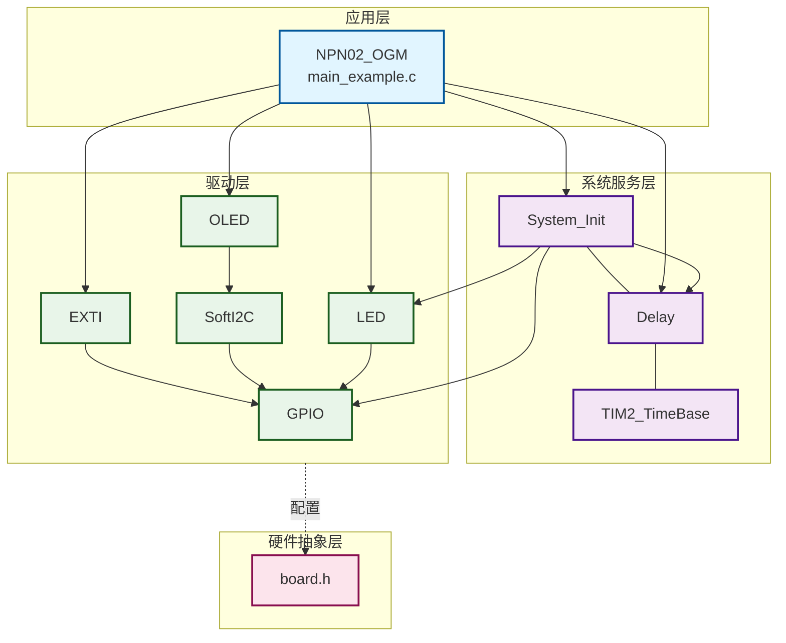
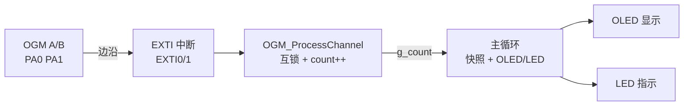
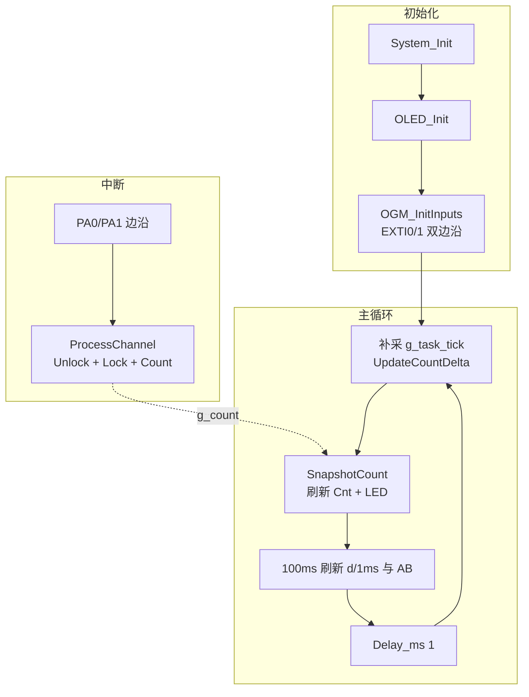

# NPN02 - OGM 双通道 NPN 正交互锁计数示例

演示 OGM 椭圆齿轮流量计双路 NPN 正交脉冲（PA0/PA1）的边沿计数：EXTI 双边沿 + 四边沿互锁算法，一圈 8 边沿，仅累加计数（单方向流量）。

---

## 📋 案例目的

### 功能说明

- **核心目标**：使用 EXTI 采集 OGM 双通道 NPN 脉冲，通过四边沿互锁算法过滤同通道机械抖动，实现一圈 **8 次**稳定计数
- **阶段范围**：阶段一为脉冲检测与累计；瞬时流量/体积换算预留接口（`g_count_delta_ms`），阶段二再实现

### 学习重点

- EXTI 双通道（EXTI0/EXTI1）双边沿配置与回调
- 四边沿独立互锁（A↑/A↓/B↑/B↓）防抖原理
- 中断中只做计数，OLED/LED 在主循环处理
- `volatile` 计数 + 关中断快照，避免主循环与 ISR 竞态
- 1ms 差分采样（`g_task_tick`），为流量换算做准备

### 应用场景

- OGM 椭圆齿轮流量计脉冲采集
- 单方向流量累计（本案例不判反转）
- 需要抗机械抖动、一圈固定 8 边沿的正交 NPN 输入

---

## 🔧 硬件要求

### 必需外设

| 设备 | 说明 |
|------|------|
| STM32F103C8T6 | 主控 |
| OGM 流量计（正交双 NPN） | 通道 A/B，相位差 90°，方波 |
| SSD1306 OLED | 128×64，软件 I2C |
| LED | PB12 状态指示 |

### 传感器信号

- 每路 NPN 开漏：空闲高、导通拉低
- 一圈：A 路 2 脉冲（4 边沿）+ B 路 2 脉冲（4 边沿）= **8 有效边沿**
- 正交：典型时序为 A↑→B↑→A↓→B↓ 交替（也可能 A↑→A↓→B↑→B↓，四边沿互锁均支持）

### 硬件连接

| STM32F103C8T6 | 外设 | 说明 |
|---------------|------|------|
| PA0 | OGM 通道 A | EXTI0，双边沿，上拉输入 |
| PA1 | OGM 通道 B | EXTI1，双边沿，上拉输入 |
| PB12 | LED1 | 低电平点亮 |
| PB8 | OLED SCL | 软件 I2C |
| PB9 | OLED SDA | 软件 I2C |
| 3.3V | OGM VCC | 按传感器规格 |
| GND | GND | 共地 |

**⚠️ 重要提示**：

- 案例为**独立工程**，硬件配置在本目录 `board.h`
- 正交型 OGM **A/B 两路各自需要上拉**；线较长时建议外接 4.7k~10kΩ 到 3.3V
- PA2 在本板用于 485，LED 已迁至 PB12，PA0/PA1 专用于脉冲
- 规范禁止 AI 创建 `.uvprojx`；工程需从 NPN01 等案例复制并改 `OutputName` 为 `NPN02_OGM`

### 硬件配置（board.h）

```c
/* 脉冲引脚（可按接线修改） */
#define OGM_CH_A_PORT GPIOA
#define OGM_CH_A_PIN  GPIO_Pin_0
#define OGM_CH_B_PORT GPIOA
#define OGM_CH_B_PIN  GPIO_Pin_1

/* EXTI：PA0 + PA1，双边沿 */
#define EXTI_CONFIGS { \
    {EXTI_LINE_0, GPIOA, GPIO_Pin_0, EXTI_TRIGGER_RISING_FALLING, EXTI_MODE_INTERRUPT, 1}, \
    {EXTI_LINE_1, GPIOA, GPIO_Pin_1, EXTI_TRIGGER_RISING_FALLING, EXTI_MODE_INTERRUPT, 1}, \
}

/* LED：PB12 */
#define LED_CONFIGS { \
    {GPIOB, GPIO_Pin_12, Bit_RESET, 1}, \
}
```

---

## 📦 模块依赖

### 模块依赖关系图



### 模块列表

| 模块 | 用途 |
|------|------|
| `exti` | PA0/PA1 双边沿中断（核心） |
| `gpio` | 输入上拉、电平读取 |
| `led` | 计数变化指示 |
| `oled_ssd1306` + `i2c_sw` | 显示 Cnt / d/1ms / AB 电平 |
| `delay` | 主循环 1ms 节拍 |
| `TIM2_TimeBase` | `g_task_tick` 1ms 时基 |
| `system_init` | 系统初始化 |
| `error_handler` | EXTI 驱动依赖 |

### config.h 模块开关

| 宏 | 值 |
|----|-----|
| `CONFIG_MODULE_SYSTEM_INIT_ENABLED` | 1 |
| `CONFIG_MODULE_GPIO_ENABLED` | 1 |
| `CONFIG_MODULE_DELAY_ENABLED` | 1 |
| `CONFIG_MODULE_TIM2_TIMEBASE_ENABLED` | 1 |
| `CONFIG_MODULE_LED_ENABLED` | 1 |
| `CONFIG_MODULE_EXTI_ENABLED` | 1 |
| `CONFIG_MODULE_OLED_ENABLED` | 1 |
| `CONFIG_MODULE_SOFT_I2C_ENABLED` | 1 |
| `CONFIG_MODULE_ERROR_HANDLER_ENABLED` | 1 |
| `CONFIG_MODULE_LOG_ENABLED` | 0 |

---

## 🔄 实现流程

### 整体逻辑

1. **初始化**：`System_Init()` → `OLED_Init()` → `OGM_InitInputs()`（读初始电平 + 配置 EXTI0/1）
2. **中断阶段**（自动）：边沿触发 → `EXTI0/1_IRQHandler` → 回调 → `OGM_ProcessChannel()` → 互锁 + `g_count++`
3. **主循环**：1ms 差分采样 → 计数变化刷新 OLED/LED → 100ms 刷新 `d/1ms` 与 AB 电平

### 四边沿互锁规则

| 规则 | 说明 |
|------|------|
| 本边沿加锁 | A↑ 锁 `A↑`，A↓ 锁 `A↓`；B 同理（`g_edge_locks` 位掩码） |
| 对侧解锁 | A 任意有效边沿 → 清除 B↑、B↓ 锁；B 边沿 → 清除 A 侧锁 |
| 已锁不计数 | 同类型边沿重复触发（抖动）只锁/解锁，不 `++` |
| 电平过滤 | `level_new == last_*` 直接返回（非真实边沿） |

**一圈 +8 示例**（正交交替）：A↑(+1) → B↑(+1) → A↓(+1) → B↓(+1) → 再重复四次。

### 数据流向图



### 工作流程示意



---

## 📚 关键函数说明

| 函数 | 说明 |
|------|------|
| `OGM_ProcessChannel(is_a)` | A/B 边沿统一处理：对侧解锁、本边沿互锁、计数 |
| `OGM_InitInputs()` | 读 `last_a/last_b`，初始化 EXTI0/1 |
| `OGM_SnapshotCount()` | 关中断读取 `g_count`，供 OLED 显示 |
| `OGM_UpdateCountDelta()` | 每 1ms 更新 `g_count_delta_ms` |
| `EXTI_HW_Init()` / `EXTI_SetCallback()` / `EXTI_Enable()` | EXTI 标准初始化链 |

**ISR 说明**：`EXTI0_IRQHandler` / `EXTI1_IRQHandler` 已在 `Core/stm32f10x_it.c` 实现，案例只需写回调。

---

## 📝 代码说明

### 中断回调（仅计数，无 OLED）

```c
static void OGM_ProcessChannel(uint8_t is_channel_a)
{
    /* 1. 读电平，与 last 相同则退出 */
    /* 2. 对侧 Unlock（清 g_edge_locks 对应半字节） */
    /* 3. 本边沿锁未置位 → g_count++ 并置锁 */
    /* 4. 更新 last_a 或 last_b */
}
```

### 主循环（显示与差分）

```c
while (1) {
    while (last_flow_tick != g_task_tick) {
        last_flow_tick++;
        OGM_UpdateCountDelta();   /* 1ms 脉冲增量，供流量换算 */
    }
    now_count = OGM_SnapshotCount();
    if (now_count != last_count) {
        OLED_ShowNum(2, 5, now_count, 8);  /* 列5+长8=13 ≤ 16 */
        LED1_Toggle();
    }
    /* 100ms 刷新 d/1ms 与 A/B 电平，降低 I2C 占用 */
    Delay_ms(1);
}
```

### OLED 布局

| 行 | 内容 | 说明 |
|----|------|------|
| 1 | `OGM Dual` | 标题 |
| 2 | `Cnt:` + 8 位数字 | 累计脉冲（无符号） |
| 3 | `d/1ms:` + 4 位 | 近 1ms 新增脉冲数 |
| 4 | `A:H/L  B:H/L` | 实时电平快照 |

---

## 🚀 使用方法

### 步骤 1：准备工程

- 打开 `Examples/NPN/NPN02_OGM/Examples.uvprojx`
- 若无工程：从 `Examples/NPN/NPN01_Flowmeter/` 复制 `Examples.uvprojx`、`Examples.uvoptx`，`OutputName` 改为 **`NPN02_OGM`**

### 步骤 2：硬件连接

- OGM 通道 A → PA0，通道 B → PA1，共 GND
- OLED → PB8/PB9，LED → PB12

### 步骤 3：检查配置

- 核对 `board.h` 引脚与 `EXTI_CONFIGS`
- 核对 `config.h` 模块开关（EXTI/OLED 等为 1）

### 步骤 4：编译下载

- **F7** 编译，目标 `0 Error(s), 0 Warning(s)`
- **F8** 下载运行

### 步骤 5：验证

| 步骤 | 预期 |
|------|------|
| PA1 短接 GND | 第 4 行 `B:L` |
| 慢转一圈 | `Cnt` 约 **+8** |
| 快转 | `Cnt` 连续增加，`d/1ms` 随转速变化 |
| 第 4 行 | 转动时 A/B 均有 H/L 变化 |

---

## 标准初始化流程

本案例遵循项目标准顺序（案例层简化，无 UART/Log）：

```c
int main(void)
{
    System_Init();              /* 1. 必须：TIM2、Delay、LED 等 */

    if (OLED_Init() != OLED_OK) { /* 2. 显示模块 */ }

    if (!OGM_InitInputs()) {    /* 3. 本案例：EXTI + 初始电平 */ }

    /* 4. OLED 界面 + 5. 主循环 */
    while (1) { /* 差分、显示、Delay_ms(1) */ }
}
```

`System_Init()` 必须在 `main()` 开头调用；脉冲计数在 **EXTI 回调**中完成，不在主循环。

---

## 功能限制说明

- **未使用占位空函数**；所用模块均已实现
- **仅单方向累加**：不判反转，`g_count` 为 `uint32_t`，只增不减
- **阶段一无流量/体积显示**：`g_count_delta_ms` 已采样，未乘排量系数
- **依赖正交双通道**：B 未接或常高/常低会导致计数异常
- **勿用通道级互锁**：整通道一把锁会在 A↑→A↓ 连续边沿时漏计（一圈约 6 次）；本案例已用四边沿互锁

---

## ⚠️ 注意事项与重点

1. **ISR 保持简短**：仅读 GPIO、互锁、计数；禁止在回调里写 OLED
2. **OLED 列宽**：`OLED_ShowNum(2, 5, count, 8)`，满足「起始列 + 长度 ≤ 16」
3. **计数快照**：显示前用 `OGM_SnapshotCount()`，避免半字读
4. **独立工程**：修改引脚只改本目录 `board.h`，勿改 `BSP/board.h`

---

## 🔍 常见问题排查

### 无计数 / 计数不变

- 检查 PA0/PA1 上拉与共地
- 确认 `CONFIG_MODULE_EXTI_ENABLED = 1`
- 万用表/ OLED 第 4 行确认边沿是否有 H/L 变化

### B 一直为 H

- PA1 未接、松动或悬空（内部上拉默认 H）
- 短接 PA1→GND 验证软件与引脚

### 一圈只有 6 次

- 多为**通道级互锁**误用；确认使用**四边沿互锁**版本
- 检查 B 通道是否有有效边沿

### 快转漏计

- 检查 PA0/PA1 焊接与上拉
- 确认主循环未在 ISR 中阻塞（本案例计数在 ISR，一般无此问题）

### OLED 数字不更新

- 检查 `ShowNum` 列号 + 长度是否超过 16 列

---

## 💡 扩展练习

1. **瞬时流量**：`流量 = g_count_delta_ms × (单圈排量/8) / 1ms`，在第 3 行显示 L/min
2. **累计体积**：参考 NPN01，用整数运算显示 `Vol:LLLLL.mmm`
3. **P/L 标定**：在 `board.h` 增加 `OGM_PULSES_PER_REV`（8）与毫升/圈系数
4. **ModBus 上报**：结合 PA2（485）将 `g_count` 上传主机
5. **低流速周期法**：ISR 记录边沿时间戳，辅助极低流速测量

---

## 📖 相关文档

- **模块文档**：`Drivers/peripheral/exti.h`、`Drivers/basic/gpio.h`
- **业务代码**：`Examples/NPN/NPN02_OGM/main_example.c`
- **硬件配置**：`Examples/NPN/NPN02_OGM/board.h`
- **模块配置**：`Examples/NPN/NPN02_OGM/config.h`
- **参考案例**：
  - `Examples/NPN/NPN01_Flowmeter/`（单通道 NPN + 体积显示）
  - `Examples/EXTI/EXTI02_RotaryEncoder_Counter/`（双通道 EXTI）
- **案例索引**：`Examples/README.md`

---

## 📝 更新日志

| 日期 | 说明 |
|------|------|
| 2026-06-21 | 四边沿互锁 + 单方向累加；OLED/差分采样优化；文档按案例规范重写 |
| 2026-02-09 | 创建 NPN02_OGM 案例（由 NPN01 衍生） |

**测试状态**：已调试（一圈 +8，四边沿互锁）

**测试项**：

- [x] EXTI 双通道初始化正常
- [x] 一圈计数约 +8
- [x] 四边沿互锁防抖有效
- [x] 快转连续计数
- [x] OLED Cnt / d/1ms / AB 显示正常
