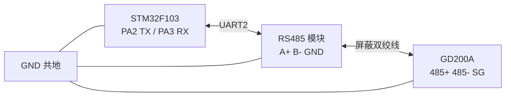
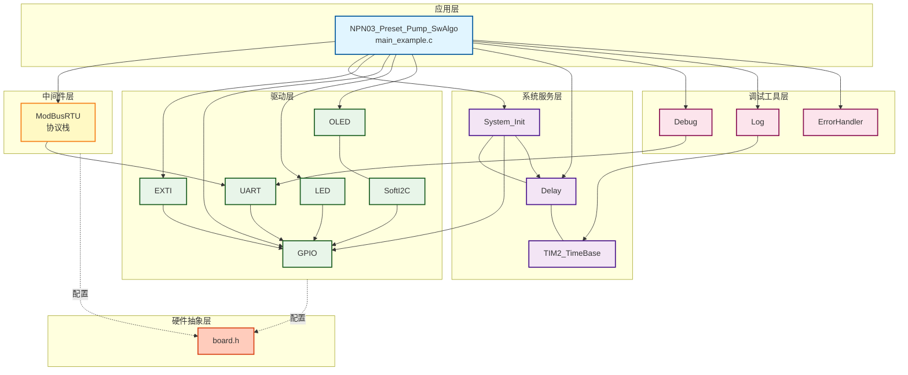
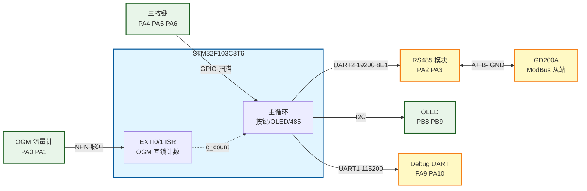
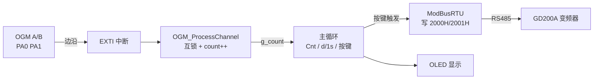
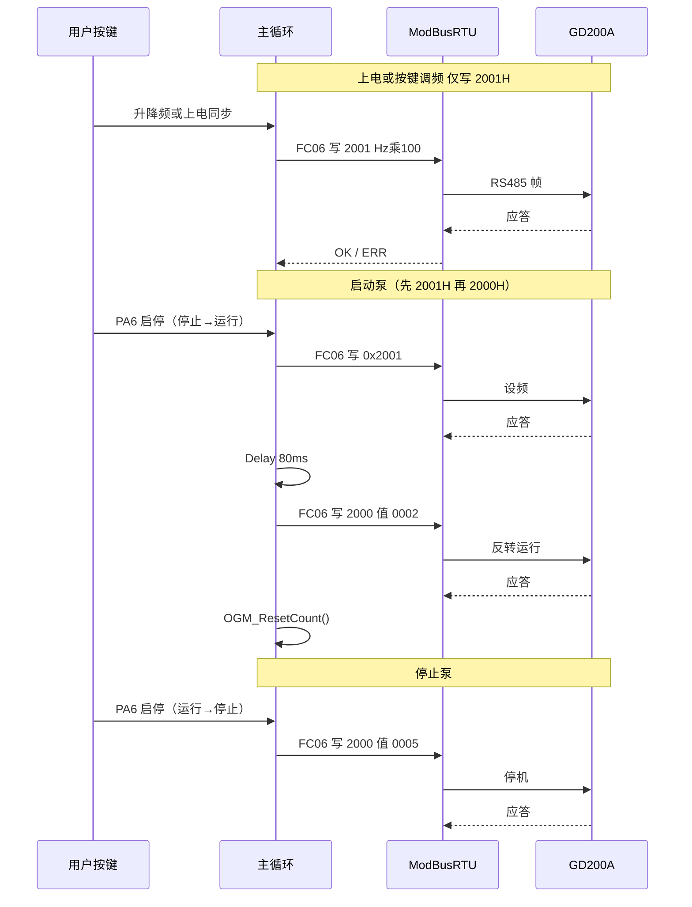

# NPN03 - 预设加油泵（OGM 计量 + GD200A 控泵）

整合 **Bus04_ModBusRTU_Invt_GD200A**（英威腾 GD200A RS485 控泵）与 **NPN02_OGM**（OGM 双通道四边沿互锁计数），通过三按键手动调频/启停，OLED 实时显示脉冲计数与速率。

---

## 📋 案例目的

### 功能说明

- **OGM 脉冲计量**：PA0/PA1 双通道 EXTI 四边沿互锁计数（算法同 NPN02，一圈约 8 次）
- **ModBus 控泵**：经 RS485 写 GD200A `0x2001H` 设频、`0x2000H` 启停（默认反转运行）
- **三按键操作**：PA4 升频 +5Hz、PA5 降频 -5Hz（0~50Hz）、PA6 启停切换
- **485 策略**：无后台轮询；上电同步设频、按键调频、启停时写寄存器
- **体积标定**：`PULSES_PER_LITER` 占位（1000），待现场标定后启用升数显示

### 学习重点

- 多模块独立工程整合（EXTI + ModBus + OLED + GPIO 按键）
- 中断计数与主循环 ModBus 阻塞通讯共存
- GD200A 写寄存器时序（启停：先 2001H → 延时 80ms → 再 2000H；单独调频直接写 2001H）
- 沿数为中心计量思路（Cnt / d/1s），为后续预设停泵标定做准备

### 应用场景

- OGM 流量计 + 变频器控泵的预设加油/加液现场
- 软件互锁脉冲算法 + RS485 控泵联调
- 沿数标定、频率—计数线性验证

---

## 🔧 硬件要求

### 必需外设

| 设备 | 说明 |
|------|------|
| STM32F103C8T6 | 主控 |
| OGM 流量计（正交双 NPN） | 通道 A/B，接 PA0/PA1 |
| RS485 模块 | 接 UART2（PA2/PA3），建议自动方向 |
| 英威腾 GD200A 变频器 | 0.75kW 等，ModBus RTU 从站 |
| SSD1306 OLED | 128×64，软件 I2C（PB8/PB9） |
| 三按键 + LED | PA4/PA5/PA6 上拉输入；PB12 LED |

### USART 参数（须与 GD200A P14 一致）

| 串口 | 引脚 | 波特率 | 格式 | 用途 |
|------|------|--------|------|------|
| UART1 | PA9/PA10 | 115200 | 8N1 | Debug / LOG |
| UART2 | PA2/PA3 | 19200 | 8E1（9 位字长） | ModBus RTU |

### 硬件连接（STM32 ↔ 外设）

| STM32F103C8T6 | 外设/模块 | 说明 |
|---------------|----------|------|
| PA0 | OGM 通道 A | EXTI0，双边沿，上拉输入 |
| PA1 | OGM 通道 B | EXTI1，双边沿，上拉输入 |
| PA2 | RS485 模块 TX | UART2 发送 |
| PA3 | RS485 模块 RX | UART2 接收 |
| PA4 | 升频键 | 上拉，按下接 GND |
| PA5 | 降频键 | 上拉，按下接 GND |
| PA6 | 启停键 | 上拉，按下接 GND |
| PA9 | USB 转串口 RX | UART1 Debug TX |
| PA10 | USB 转串口 TX | UART1 Debug RX |
| PB8 | OLED SCL | 软件 I2C |
| PB9 | OLED SDA | 软件 I2C |
| PB12 | LED1 | 低电平点亮 |
| 3.3V/5V | RS485 / OGM 电源 | 按模块规格 |
| GND | OGM + RS485 + GD200A SG | **必须共地** |

### 一、RS485 与变频器接线

| 变频器端子 | 接法 | 说明 |
|------------|------|------|
| 485+ | 接模块 A+ | 对应 Modbus 的 A 线 |
| 485- | 接模块 B- | 对应 Modbus 的 B 线 |
| SG / 0V | 接模块 GND（隔离型） | 提供共模参考，提高抗干扰能力 |

**注意事项：**

- 使用**屏蔽双绞线**，屏蔽层**单端接地**
- 通信距离较长时，在总线**末端并接 120Ω** 终端电阻
- 变频器端子板上的 **485+ 对应 A，485- 对应 B**；通信不通时对调 A/B 再试
- 案例为**独立工程**，引脚定义在本目录 `board.h`；与接线不符时只改 `board.h`
- 从站地址默认 **1**；若修改 GD200A 地址，须同步改 `main_example.c` 中 `INVT_SLAVE_ADDRESS`
- **安全**：首次启泵前确认转向、管路与负载安全；测试时人在旁监护

**OGM 补充：**

- 正交双 NPN 开漏输出，MCU 侧上拉；线较长时建议外接 4.7k~10kΩ 到 3.3V
- 计数算法详见 `Examples/NPN/NPN02_OGM`

**接线关系图：**



---

## ⚙️ 二、变频器参数配置

参数必须与代码（19200 8E1、地址 1、通讯控泵）**完全一致**。

### 2.1 通讯基本参数（P14 通讯组）

| 功能码 | 名称 | 推荐值 | 说明 |
|--------|------|--------|------|
| P14.00 | 本机通讯地址 | **1**（或 1~247） | 总线上每台变频器地址必须唯一；0 为广播地址 |
| P14.01 | 通讯波特率 | **4**（19200） | 0:1200 / 2:4800 / 3:9600 / **4:19200** / 5:38400 / 6:57600 |
| P14.02 | 数据格式 | **1**（偶校验 8E1） | 0:无校验(N,8,1) / **1:偶校验(E,8,1)** / 2:奇校验(O,8,1) RTU |
| P14.03 | 通讯应答延时 | 5 ms | 变频器接收结束到发送应答的间隔 |
| P14.04 | 通讯超时故障时间 | 0.0 s | 0.0 表示不检测；非零表示两次通讯间隔超时报 CE 故障 |
| P14.05 | 传输错误处理 | **1** | 0:报警自由停车 / **1:不报警继续运行** / 2:不报警按停机方式停机 |
| P14.06 | 通讯处理动作选择 | **0x000** | 个位: 0=写操作有回应；十位: 通讯加密；百位: 机器类型(0=GD200A) |

必须与单片机/上位机的**波特率、数据位、校验位、停止位**完全一致。

### 2.2 运行指令与频率源（P00 组）

要让变频器通过 485 控制启停和调速，必须设置：

| 功能码 | 名称 | 推荐值 | 说明 |
|--------|------|--------|------|
| P00.01 | 运行指令通道 | **2** | 0:键盘 / 1:端子 / **2:通讯** |
| P00.02 | 通讯运行指令通道选择 | **0** | 0: MODBUS 通讯通道 |
| P00.06 | A 频率指令选择 | **8** | **8: MODBUS 通讯设定频率** |
| P00.09 | 设定源组合方式 | **0** | 0: A（仅使用 A 频率源） |

### 本案例最小必查清单

| 参数 | 值 |
|------|-----|
| P14.00 | 1 |
| P14.01 | 4（19200） |
| P14.02 | 1（8E1） |
| P00.01 | 2 |
| P00.02 | 0 |
| P00.06 | 8 |
| P00.09 | 0 |

更多寄存器与 RTU 帧说明见：`Examples/Bus/Bus04_ModBusRTU_Invt_GD200A/开发指令速查.md`

---

## 🎮 按键与操作

| 按键 | 功能 |
|------|------|
| PA4 | 设定频率 +5Hz（最大 50Hz），按下沿立即写 0x2001H |
| PA5 | 设定频率 -5Hz（最小 0Hz），按下沿立即写 0x2001H |
| PA6 | 启停切换：停止→启动（485 成功后清零 Cnt）；运行→停止 |

**行为说明：**

- 上电默认 **25Hz**；485 预检通过后会**自动写 0x2001H** 同步至变频器
- 频率为 **0Hz** 时按启停无效，需先升频
- 运行中调频**仅写 0x2001H**，不停机
- 每次按键触发 485 后 **80ms** 防抖；485 忙时按下会挂起，空闲后补执行
- 降频至 0Hz 且泵在运行时，会自动发送停机命令
- 本案例默认**反转**运行（`0x2000H = 0x0002`）

---

## 📺 OLED 显示

| 行 | 内容 | 示例 |
|----|------|------|
| 1 | 累计互锁计数 | `Cnt:00001234` |
| 2 | 设定频率 + 运行状态 | `F:25 RUN` / `F:25 STOP` |
| 3 | 每秒计数增量 + 按键调试 | `d/1s:000146 K011` |
| 4 | AB 电平 + 485 设频状态 | `A:H B:L Set:25Hz` 或 `485:ERR` |

**说明：**

- `d/1s`：过去 1 秒内互锁计数增量（与设定频率线性相关，用于标定）
- `K` 后三位为升/降/启停键电平调试（0=按下，1=松开），标定完成后可移除
- `Set:xxHz` 表示最近一次 485 写设频成功；失败显示 `485:ERR`
- `F:xx` 为本地设定频率；**以变频器面板通讯设定频率为准**复核

**布局示意：**

```
┌────────────────── 128×64 ──────────────────┐
│ Cnt:00001234                               │  第1行
│ F:25 RUN                                   │  第2行
│ d/1s:000146 K011                           │  第3行
│ A:H B:L        Set:25Hz                    │  第4行
└────────────────────────────────────────────┘
```

---

## 📦 模块依赖

### 模块依赖关系图



### 模块列表

| 模块 | 用途 |
|------|------|
| `exti` | OGM 双通道双边沿中断 |
| `modbus_rtu` + `uart` | GD200A RS485 通讯 |
| `oled_ssd1306` + `soft_i2c` | 现场显示 |
| `gpio` | 按键扫描、OGM 电平 |
| `led` | 运行闪烁 / 485 故障快闪 |
| `delay` + `TIM2_TimeBase` | 1ms 时基、`d/1s` 窗口 |
| `debug` + `log` + `error_handler` | 串口日志与错误处理 |
| `system_init` | 系统初始化 |

### config.h 模块开关

| 宏 | 值 | 说明 |
|----|-----|------|
| `CONFIG_MODULE_SYSTEM_INIT_ENABLED` | 1 | 系统初始化 |
| `CONFIG_MODULE_GPIO_ENABLED` | 1 | GPIO / 按键 |
| `CONFIG_MODULE_DELAY_ENABLED` | 1 | 延时 |
| `CONFIG_MODULE_BASE_TIMER_ENABLED` | 1 | TIM2 1ms 时基 |
| `CONFIG_MODULE_EXTI_ENABLED` | 1 | OGM EXTI（由 `OGM_USE_EXTI` 控制） |
| `CONFIG_MODULE_LED_ENABLED` | 1 | LED |
| `CONFIG_MODULE_OLED_ENABLED` | 1 | OLED |
| `CONFIG_MODULE_SOFT_I2C_ENABLED` | 1 | 软件 I2C |
| `CONFIG_MODULE_UART_ENABLED` | 1 | UART1/2 |
| `CONFIG_MODULE_MODBUS_RTU_ENABLED` | 1 | ModBus RTU |
| `CONFIG_MODULE_LOG_ENABLED` | 1 | 日志 |
| `CONFIG_MODULE_ERROR_HANDLER_ENABLED` | 1 | 错误处理 |

模块开关见本目录 `config.h`；硬件引脚见 `board.h`。

---

## 🔄 实现流程

### 整体逻辑

1. **初始化**：`System_Init()` → `OLED_Init()` → `OGM_InitInputs()` → `Pump_InitComm()` → `Pump_InitButtons()`
2. **上电同步**：485 预检通过后写 `0x2001H`，将默认 25Hz 同步至变频器
3. **中断阶段**（自动）：OGM A/B 边沿 → EXTI 回调 → 四边沿互锁 → `g_count++`
4. **主循环**：1ms 差分采样 `d/1s` → 按键扫描 → OLED/LED 刷新
5. **按键触发 485**：升/降频写 `0x2001H`；启停写 `0x2001H` + `0x2000H`（先设频后运行）

### 系统架构示意



### 数据流向图



### 工作流程示意

```mermaid
flowchart TD
    START([上电]) --> INIT[系统初始化<br/>OLED + OGM EXTI]
    INIT --> COMM[485 通讯预检]
    COMM --> BTN[按键初始化]
    BTN --> SYNC{预检成功?}

    subgraph MAIN[主循环]
        L1[1ms 差分采样]
        L2[扫描按键]
        L3[刷新 OLED LED]
        L1 --> L2 --> L3 --> L1
    end

    SYNC -->|是| WR_FREQ[写 2001H 同步 25Hz]
    SYNC -->|否| L1
    WR_FREQ --> L1

    L2 -->|升降频| FREQ[写 2001H]
    L2 -->|启停| RUN{泵在运行?}
    RUN -->|启动| START_SEQ[设频后写 2000H 反转<br/>清零 Cnt]
    RUN -->|停止| STOP_SEQ[写 2000H 停机]

    FREQ --> L1
    START_SEQ --> L1
    STOP_SEQ --> L1

    subgraph INT[中断 与主循环并行]
        I1[PA0 PA1 边沿] --> I2[四边沿互锁计数]
    end

    I2 -.-> L1
```



### 四边沿互锁规则（同 NPN02）

| 规则 | 说明 |
|------|------|
| 本边沿加锁 | A↑/A↓/B↑/B↓ 各用 1 bit 独立加锁 |
| 对侧解锁 | A 有效边沿清除 B 侧锁；B 边沿清除 A 侧锁 |
| 已锁不计数 | 同类型边沿抖动不重复 `++` |
| 一圈约 +8 | 正交双通道 4 边沿 × 2 路 |

### GD200A 本案例写寄存器

| 寄存器 | 功能 | 本案例用法 |
|--------|------|------------|
| `0x2000` | 通讯运行命令 | `0x0002` 反转运行；`0x0005` 停机 |
| `0x2001` | 通讯设定频率 | 值 = Hz × 100（25Hz → 2500） |

---

## 📡 485 写寄存器时序

| 场景 | 操作 |
|------|------|
| 上电同步 / 按键调频 | 直接写 `0x2001H = 频率(Hz) × 100`（如 25Hz → 2500） |
| 启动泵 | 写 `0x2001H` → 延时 80ms → 写 `0x2000H = 0x0002`（反转） |
| 停止泵 | 立即写 `0x2000H = 0x0005`（停机） |

写超时 1000ms；**0x2001H / 0x2000H 均重试 3 次**（间隔 120ms）；**仅启动完全成功后才清零 Cnt**。

### 485 写操作时序图



---

## 📚 关键函数说明

| 函数 | 说明 |
|------|------|
| `OGM_ProcessChannel()` | OGM 四边沿互锁计数（ISR 回调内） |
| `OGM_SnapshotCount()` | 关中断读取 `g_count` |
| `OGM_UpdateCountDelta()` | 每 1ms 累加 `g_count_delta_1s` |
| `OGM_ResetCount()` | 启动成功后清零计数与差分 |
| `InvtWriteFrequencyHzRetry()` | 写 0x2001H（可选前导 80ms + 3 次重试） |
| `InvtSendRunCmd()` | 写 0x2000H 启停/换向 |
| `Pump_ApplyFrequency()` | 按键调频 / 上电同步设频 |
| `Pump_Start()` / `Pump_Stop()` | 启停序列与状态更新 |
| `Pump_ScanButtons()` | 按下沿检测 + 忙时挂起 + 80ms 防抖 |
| `Pump_RefreshOLED()` | Cnt / F / d/1s / AB / 485 状态 |

**ISR 说明**：`EXTI0_IRQHandler` / `EXTI1_IRQHandler` 在 `Core/stm32f10x_it.c` 中实现，案例只注册 OGM 回调。

---

## 📝 标准初始化流程

```c
int main(void)
{
    System_Init();                    /* 1. TIM2、Delay、LED 等 */

    if (OLED_Init() != OLED_OK) { }   /* 2. OLED */

    if (!OGM_InitInputs()) { }        /* 3. OGM EXTI0/1 */

    Pump_InitComm();                  /* 4. UART/Log + 485 预检 */
    Pump_InitButtons();               /* 5. PA4/5/6 按键（最后配 GPIO） */

    if (g_comm_ok) {
        Delay_ms(80);
        Pump_ApplyFrequency();        /* 6. 上电同步 25Hz → 0x2001H */
    }

    while (1) {
        /* 1ms 差分 + 按键 + OLED + LED */
    }
}
```

---

## ⚠️ 功能限制说明

- **无预设停泵**：当前仅显示 Cnt / d/1s，未实现目标升数自动停机
- **无体积显示**：`PULSES_PER_LITER=1000` 为占位，须现场标定后启用
- **无 485 后台读**：不读 0x3000H 运行频率；`g_pump_running` 为本地状态
- **无变频器故障联动**：通讯失败时 OLED 显示 `485:ERR`，不自动停机保护
- **按键调试 K**：第 3 行末尾为接线调试显示，量产可移除

---

## 🛠️ Keil 工程

1. 从 `Examples/Bus/Bus04_ModBusRTU_Invt_GD200A/` 复制 `Examples.uvprojx` 和 `Examples.uvoptx` 到本目录
2. 确认 `TargetName` / `OutputName` 为 **`NPN03_Preset_Pump_SwAlgo`**
3. 编译前执行 `keilkill.bat` 清理缓存
4. F7 编译，F8 下载

> 规范禁止 AI 新建 `.uvprojx`；工程文件请从 Bus04 复制后手动改名。

---

## ✅ 验证步骤

1. **接线与参数**：按上文完成 RS485 接线，核对 P14 / P00 参数
2. **上电**：OLED 显示 Cnt；485 正常时第 4 行 `Set:25Hz`（非 `485:ERR`）
3. **设频**：按 PA4/PA5 调节，观察 GD200A 通讯设定频率变化（默认 25Hz，步进 5Hz）
4. **启停**：按 PA6 启动，OGM 有脉冲时 Cnt / d/1s 增加；再按 PA6 停止
5. **再次启动**：Cnt 清零重新累计（仅 485 启停全部成功时清零）
6. **串口**：UART1 115200 查看 LOG（含「上电已同步设频」等）

---

## ❓ 常见问题

### 485 预检失败 / OLED 显示 `485:ERR`

- 检查 A+/B- 是否接反、是否共地
- 核对 P14.00=1、P14.01=4、P14.02=1 与代码 19200 8E1 一致
- 长距离总线加 120Ω 终端电阻；不通时对调 A/B

### 写设频成功但电机不转

- 确认 P00.01=2、P00.06=8、P00.02=0
- 启停须按顺序：先 2001H 设频，再 2000H 运行命令
- 检查变频器是否处于故障/键盘锁定状态

### OLED 有 25Hz 但变频器频率不对

- 上电后应自动写 0x2001H；若曾显示 `485:ERR`，按升/降频或启停重试
- OLED `Set:xxHz` 为本地设定成功标志，以变频器面板通讯设定频率为准复核

### Cnt 不增加

- 检查 OGM A/B 接线与共地；OLED 第 4 行 A/B 电平是否随转动变化
- 参考 `NPN02_OGM` 验证四边沿互锁（一圈约 +8）

### 按键无反应

- 观察 OLED 第 3 行 `K` 后三位：按下应为 0
- 80ms 防抖内重复按无效；485 忙时按下会挂起，空闲后补执行

---

## 🔗 相关案例

| 案例 | 说明 |
|------|------|
| `Examples/Bus/Bus04_ModBusRTU_Invt_GD200A` | GD200A ModBus 通讯与寄存器详解 |
| `Examples/NPN/NPN02_OGM` | OGM 四边沿互锁计数（本案例计量算法同源） |
| `Examples/NPN/NPN01_Flowmeter` | 单通道脉冲体积换算参考 |

---

## 📝 更新日志

| 日期 | 说明 |
|------|------|
| 2026-06-21 | 文档终检：补图表、安装说明；代码上电设频/启停重试与 README 对齐 |
| 2026-06-21 | 目录更名 `NPN03_Preset_Pump_SwAlgo`；上电同步 25Hz 至 0x2001H |
| 2026-06-21 | 整合 Bus04 + NPN02；四边沿互锁 + 按键控泵 |

**测试状态**：⏳ 待调试（OGM 沿数标定 / 预设停泵后续实现）

---

**最后更新**：2026-06-21
