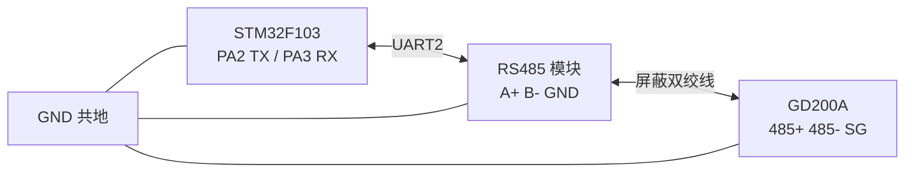
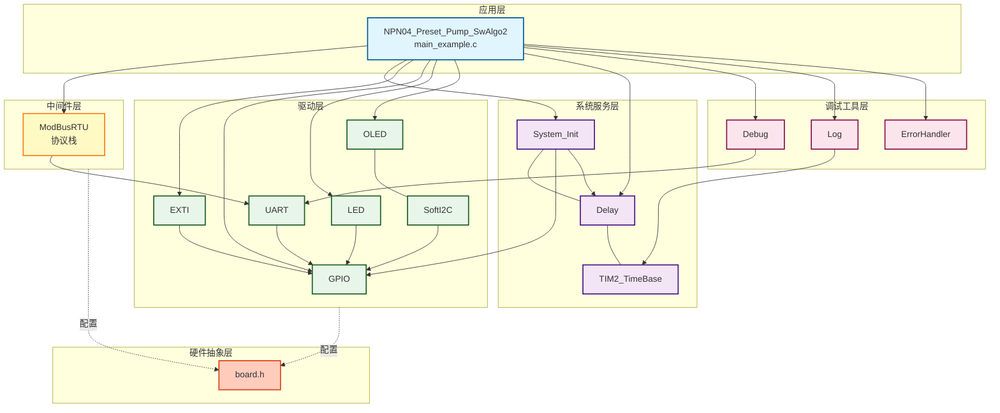
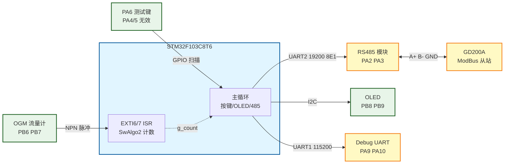
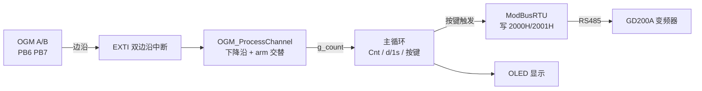
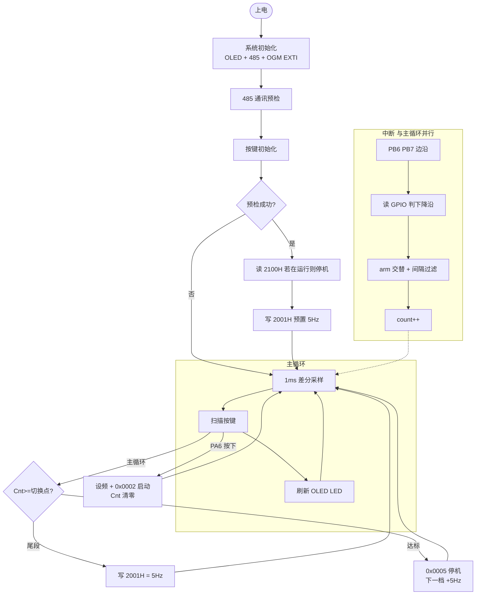
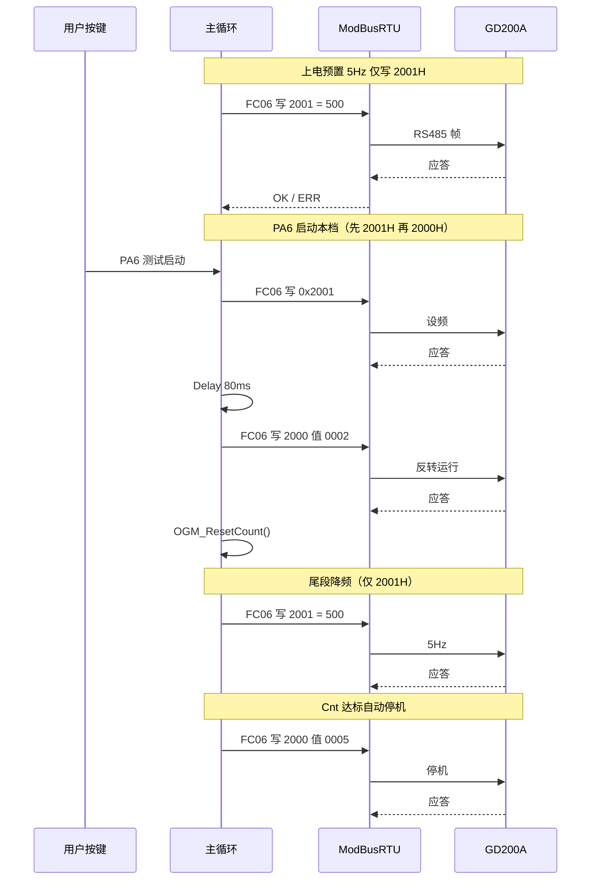

# NPN04 - 预设加油泵（OGM SwAlgo2 + GD200A 控泵）

整合 **Bus04_ModBusRTU_Invt_GD200A**（英威腾 GD200A RS485 控泵）与 **OGM 软件计数 SwAlgo2**（PB6/PB7 EXTI 下降沿 A/B 交替互锁，**双信号线单圈 4 脉冲**）。

**当前固件**：**d/1s 分档标定测试**——PA6 每按一次启动一档（5→50Hz），每档 **1000 cnt** 自动停机；10Hz 及以上尾段降 **5Hz**（规则同 NPN05 README）。PA4/PA5 无效。

与 **NPN03_Preset_Pump_SwAlgo** 共用同一套硬件接线（PB6/PB7 OGM、RS485、按键、OLED），**仅计量算法不同**：NPN03 为四边沿互锁（一圈约 8），本案例为 **仅计下降沿 + A/B 交替 arm**（一圈约 4）。烧录不同固件即可对照 d/1s 与 Cnt，无需改线。

---

## 📋 案例目的

### 功能说明

- **OGM SwAlgo2 计量**：PB6/PB7 双通道 EXTI 双边沿触发，ISR 内读 GPIO 判真实边沿，**仅下降沿参与计数**
- **A/B 交替 arm**：A 下降沿 +1 后 arm A=0、arm B=1；B 下降沿 +1 后反之；上升沿只更新电平缓存
- **双信号线单圈 4 脉冲**：OGM 通道 A/B 双 NPN 输出，仅下降沿交替 arm 下一圈约计 4 次有效边沿
- **脉冲间隔过滤**：`OGM_MIN_PULSE_INTERVAL_US=800` 滤毛刺（基于 TIM2 微秒时间戳）
- **ModBus 控泵**：写 GD200A `0x2001H` 设频、`0x2000H` 启停（PA6 启动时反转 `0x0002`）
- **分档自动测试**：PA6 启动；每档 1000 cnt；尾段降 5Hz；上电读 `2100H` 若在运行则停机
- **485 策略**：无后台轮询；上电预置 5Hz，不自动启泵
- **体积标定**：`PULSES_PER_LITER` 占位（1000），待现场标定后启用升数显示

### 与 NPN03 算法对照

| 项目 | NPN03 SwAlgo | NPN04 SwAlgo2 |
|------|-------------|---------------|
| OGM 引脚 | PB6 / PB7 | **PB6 / PB7**（与 NPN03/NPN05 同接线） |
| EXTI 触发 | 双边沿 | 双边沿（同左） |
| 计数边沿 | 四边沿（升+降） | **仅下降沿** |
| 互锁方式 | 四边沿独立锁位状态机 | **A/B 交替 arm** |
| 双信号线单圈 | 8 脉冲 | **4 脉冲** |
| 一圈计数（典型） | 8 | **4**（约为 NPN03 一半） |
| 消刺 | 互锁 + 间隔 | 交替 arm + 800µs 间隔 |
| CPU 路径 | 每沿 EXTI ISR | 同左（纯软件计数） |

### 学习重点

- 同硬件下两种软件计量算法的差异与对照验证方法
- EXTI 双边沿触发 + ISR 内读 GPIO 区分真实上升/下降沿
- A/B 交替 arm 互锁与最小脉冲间隔联合消刺
- 中断计数与主循环 ModBus 阻塞通讯共存（与 NPN03 相同架构）
- 以 d/1s 为中心验证「调频 → 流量 → OGM 脉冲 → Cnt」物理链

### 应用场景

- 与 NPN03 并排对比 SwAlgo / SwAlgo2 计数差异
- OGM 非标准正交波形下的软件计量方案验证
- 沿数标定、频率—计数线性验证（d/1s 约为 NPN03 一半）
- 为后续预设停泵、硬件计数（HwAlgo）对照积累基线数据

### 定位说明

本案例 **不是 TIM 硬件 CNT 路径**。曾尝试 TIM4 外部时钟/TI12/IC 等方案，对本 OGM 传感器不适用或不稳定；当前固件为经验证可用的 **SwAlgo2 软件变体**。

---

## 🔧 硬件要求

### 必需外设

| 设备 | 说明 |
|------|------|
| STM32F103C8T6 | 主控 |
| OGM 流量计（双 NPN） | 通道 A/B，接 **PB6/PB7**（与 NPN03 相同） |
| RS485 模块 | 接 UART2（PA2/PA3），建议自动方向 |
| 英威腾 GD200A 变频器 | 0.75kW 等，ModBus RTU 从站 |
| SSD1306 OLED | 128×64，软件 I2C（PB8/PB9） |
| 三按键 + LED | PA4/PA5（测试模式无效）/ PA6 测试启动；PB12 LED |

### USART 参数（须与 GD200A P14 一致）

| 串口 | 引脚 | 波特率 | 格式 | 用途 |
|------|------|--------|------|------|
| UART1 | PA9/PA10 | 115200 | 8N1 | Debug / LOG |
| UART2 | PA2/PA3 | 19200 | 8E1（9 位字长） | ModBus RTU |

### 硬件连接（STM32 ↔ 外设）

| STM32F103C8T6 | 外设/模块 | 说明 |
|---------------|----------|------|
| PB6 | OGM 通道 A | EXTI6，双边沿，上拉输入 |
| PB7 | OGM 通道 B | EXTI7，双边沿，上拉输入 |
| PA2 | RS485 模块 TX | UART2 发送 |
| PA3 | RS485 模块 RX | UART2 接收 |
| PA4 | 升频键（测试模式无效） | 上拉，按下接 GND |
| PA5 | 降频键（测试模式无效） | 上拉，按下接 GND |
| PA6 | **测试启动键** | 上拉，按下接 GND |
| PA9 | USB 转串口 RX | UART1 Debug TX |
| PA10 | USB 转串口 TX | UART1 Debug RX |
| PB8 | OLED SCL | 软件 I2C |
| PB9 | OLED SDA | 软件 I2C |
| PB12 | LED1 | 低电平点亮 |
| 3.3V/5V | RS485 / OGM 电源 | 按模块规格 |
| GND | OGM + RS485 + GD200A SG | **必须共地** |

### RS485 与变频器接线

| 变频器端子 | 接法 | 说明 |
|------------|------|------|
| 485+ | 接模块 A+ | 对应 Modbus 的 A 线 |
| 485- | 接模块 B- | 对应 Modbus 的 B 线 |
| SG / 0V | 接模块 GND（隔离型） | 提供共模参考，提高抗干扰能力 |

**注意事项：**

- 使用**屏蔽双绞线**，屏蔽层**单端接地**
- 通信距离较长时，在总线**末端并接 120Ω** 终端电阻
- 案例为**独立工程**，引脚定义在本目录 `board.h`；与接线不符时只改 `board.h`
- 从站地址默认 **1**；若修改 GD200A 地址，须同步改 `main_example.c` 中 `INVT_SLAVE_ADDRESS`
- **安全**：首次启泵前确认转向、管路与负载安全；测试时人在旁监护

**OGM 补充：**

- 双 NPN 开漏输出，MCU 侧上拉；线较长时建议外接 4.7k~10kΩ 到 3.3V
- 本传感器 **非标准正交编码器**（A/B 正反转波形一致），不适用 TI12 四倍频硬件编码器消刺

**接线关系图：**



---

## ⚙️ 变频器参数配置

参数必须与代码（19200 8E1、地址 1、通讯控泵）**完全一致**。详细说明见 [`NPN03_Preset_Pump_SwAlgo/README.md`](../NPN03_Preset_Pump_SwAlgo/README.md) 第二节。

### 本案例最小必查清单

| 参数 | 值 |
|------|-----|
| P14.00 | 1 |
| P14.01 | 4（19200） |
| P14.02 | 1（8E1） |
| P00.01 | 2 |
| P00.02 | 0 |
| P00.06 | 8 |
| P00.09 | 0 |

更多寄存器与 RTU 帧说明见：`Examples/Bus/Bus04_ModBusRTU_Invt_GD200A/开发指令速查.md`

---

## 🎮 按键与操作（分档自动测试模式）

本案例固件为 **d/1s 标定分档测试**：PA6 为测试启动键，PA4/PA5 在本固件中**无效**（频率由测试序列自动控制）。规则与 [NPN05 README](../NPN05_Preset_Pump_HwAlgo/README.md#-按键与操作分档自动测试模式) 一致。

| 按键 | 功能 |
|------|------|
| PA4 | （测试模式无效） |
| PA5 | （测试模式无效） |
| **PA6** | **测试启动**：每按一次启动一档，达标自动停机，下一档须再按 |

### 测试流程

1. 上电待机：读 `2100H`，若在运行则 `0x0005` 停机；预置 **5Hz**（**不自动启泵**）
2. 按 **PA6** → 以 **5Hz** 启动，`Cnt` 清零，反转运行（`0x0002`）
3. `Cnt` 达到 **1000** → 自动停机
4. 再按 **PA6** → 以 **10Hz** 启动；**≥980** 时自动降为 **5Hz** 计完尾段 20 个脉冲
5. 依次 **15 / 20 / … / 50Hz**，每档须 **再按一次 PA6**；**10Hz 及以上**在接近 1000 前按表降 5Hz 尾段
6. **50Hz** 档完成后，下一档回到 **5Hz**（循环）

**尾段降频（避免高 d/1s 超表）：**

| 测试频率 | 尾段脉冲数 | Cnt 达到时改 5Hz |
|:--------:|:----------:|:----------------:|
| 5Hz | 0 | 无（全程 5Hz） |
| 10Hz | 20 | ≥ 980 |
| 15Hz | 40 | ≥ 960 |
| 20Hz | 60 | ≥ 940 |
| 25Hz | 80 | ≥ 920 |
| 30Hz | 100 | ≥ 900 |
| 35Hz | 120 | ≥ 880 |
| 40Hz | 140 | ≥ 860 |
| 45Hz | 160 | ≥ 840 |
| 50Hz | 180 | ≥ **820** |

规律（10~50Hz，步进 5Hz）：`尾段 = (频率 - 10) / 5 × 20 + 20`；`切换点 = 1000 - 尾段`。

尾段仅写 **`0x2001H` 改为 5Hz**，**不停机、不清零**；`Cnt >= 1000` 时写 **`0x2000H = 0x0005`** 停机。

可调宏（`main_example.c`）：`TEST_CNT_TARGET=1000`、`TEST_FREQ_START_HZ=5`、`TEST_FREQ_STEP_HZ=5`、`TEST_FREQ_MAX_HZ=50`、`TEST_FREQ_TAIL_HZ=5`。

485 忙时按键挂起、空闲补执行；运行中按 PA6 **不会**手动停机（仅达标自动停）。

---

## 📺 OLED 显示

| 行 | 内容 | 示例 |
|----|------|------|
| 1 | 累计脉冲计数 | `Cnt:00000820` |
| 2 | 待机：下一档频率；运行：本档+目标；尾段 | `Nx:10Hz idle` / `F:50 T:1000` / `F:50>05 T:1000` |
| 3 | 每秒计数增量 | `d/1s:000157` |
| 4 | 485 通讯状态 | `485:OK` / `485:ERR` |

**说明：**

- `d/1s`：过去 1 秒内计数增量；同流量下约为 **NPN03 的一半**（下降沿交替，一圈约 4）
- `Nx:xxHz idle`：待机，下一档待测频率
- `F:xx T:1000`：本档运行中；`F:xx>05` 表示已进入尾段降频
- 485 预检失败时第 4 行显示 `485:ERR`
- OLED 输出须为 **ASCII 英文**（项目规范）

### LED 指示

| 状态 | 行为 |
|------|------|
| 485 通讯失败 | PB12 快闪（100ms 周期） |
| 有流量（2s 内有脉冲） | PB12 慢闪（400ms 周期） |
| 无流量 / 空闲 | PB12 熄灭 |

**布局示意：**

```
┌────────────────── 128×64 ──────────────────┐
│ Cnt:00000820                               │  第1行
│ F:50>05 T:1000  (或 Nx:10Hz idle)          │  第2行
│ d/1s:000015                                │  第3行（尾段时偏低）
│ 485:OK                                     │  第4行
└────────────────────────────────────────────┘
```

---

## 📦 模块依赖

### 模块依赖关系图



### 模块列表

| 模块 | 用途 |
|------|------|
| `exti` | OGM 双通道双边沿中断（EXTI6/7） |
| `gpio` | 按键扫描、ISR 内读 OGM 电平 |
| `modbus_rtu` + `uart` | GD200A RS485 通讯 |
| `oled_ssd1306` + `soft_i2c` | 现场显示 |
| `led` | 运行闪烁 / 485 故障快闪 |
| `delay` + `TIM2_TimeBase` | 1ms 时基、d/1s 窗口、微秒间隔过滤 |
| `debug` + `log` + `error_handler` | 串口日志与错误处理 |
| `system_init` | 系统初始化 |

### config.h 模块开关

| 宏 | 值 | 说明 |
|----|-----|------|
| `CONFIG_MODULE_SYSTEM_INIT_ENABLED` | 1 | 系统初始化 |
| `CONFIG_MODULE_GPIO_ENABLED` | 1 | GPIO / 按键 |
| `CONFIG_MODULE_DELAY_ENABLED` | 1 | 延时 |
| `CONFIG_MODULE_BASE_TIMER_ENABLED` | 1 | TIM2 1ms 时基 |
| `CONFIG_MODULE_EXTI_ENABLED` | 1 | OGM EXTI6/7 |
| `CONFIG_MODULE_TIMER_ENABLED` | 0 | 不使用 timer 驱动 |
| `CONFIG_MODULE_LED_ENABLED` | 1 | LED |
| `CONFIG_MODULE_OLED_ENABLED` | 1 | OLED |
| `CONFIG_MODULE_SOFT_I2C_ENABLED` | 1 | 软件 I2C |
| `CONFIG_MODULE_UART_ENABLED` | 1 | UART1/2 |
| `CONFIG_MODULE_MODBUS_RTU_ENABLED` | 1 | ModBus RTU |
| `CONFIG_MODULE_LOG_ENABLED` | 1 | 日志 |
| `CONFIG_MODULE_ERROR_HANDLER_ENABLED` | 1 | 错误处理 |

模块开关见本目录 `config.h`；硬件引脚见 `board.h`。

---

## 🔄 实现流程

### 整体逻辑

1. **初始化**：`System_Init()` → `OLED_Init()` → `Pump_InitComm()` → `Pump_InitButtons()` → `OGM_InitExti()`
2. **上电预置**：485 预检 → 读 `2100H` 停机（若在运行）→ 写 `0x2001H` 预置 **5Hz**（不启泵）
3. **中断阶段**（自动）：OGM A/B 边沿 → EXTI 回调 → 读 GPIO → **仅下降沿** → arm 检查 → 间隔过滤 → `g_count++` → 切换 arm
4. **主循环**：1ms 差分采样 `d/1s` → PA6 扫描 → `Pump_CheckTestAutoStop()` → OLED/LED 刷新
5. **PA6 触发 485**：设频 + `0x0002` 启动并清零 Cnt；达标自动 `0x0005` 停机；尾段仅写 5Hz

### 系统架构示意



### 数据流向图



### 工作流程示意



### SwAlgo2 下降沿交替互锁规则

| 步骤 | 说明 |
|------|------|
| EXTI 触发 | PB6/PB7 配置为**双边沿**，上升/下降均进中断 |
| 读 GPIO | ISR 内读当前电平，与 `g_last_a/b` 比较；电平未变则返回（滤重复中断） |
| 更新缓存 | 写入 `g_last_a` 或 `g_last_b` |
| 仅下降沿 | 电平 1→0 才继续；上升沿只更新缓存，**不计数** |
| arm 检查 | A 通道须 `g_arm_a==1`；B 通道须 `g_arm_b==1`，否则返回 |
| 间隔过滤 | `OGM_AcceptInterval()` 要求与上次有效脉冲间隔 ≥ 800µs |
| 计数与切换 | `g_count++`；A 有效则 arm A=0、arm B=1；B 有效则反之 |
| 初始 arm | 上电 `arm_a=1`、`arm_b=0`，从 A 通道下降沿开始计 |
| 双信号线单圈 | **4 脉冲**（A/B 各 1 次下降沿/圈） |
| 一圈约 +4 | 双通道各 1 次下降沿/圈，约为 NPN03 四边沿互锁（+8）的一半 |

### 关键方法

| 方法 | 场景 | 注意 |
|------|------|------|
| EXTI 双边沿 + ISR 读电平 | 区分真实上升/下降 | 不可仅配下降沿 EXTI，否则毛刺会导致 d/1s 异常偏大 |
| A/B 交替 arm | 替代四边沿锁位 | 比 NPN03 状态机更简单，但一圈计数减半 |
| TIM2 微秒时间戳 | 800µs 最小间隔 | `g_task_tick*1000 + TIM2->CNT` |
| 1ms 差分 `d/1s` | 主循环统计速率 | 与 NPN03 相同窗口逻辑 |
| ModBus 写序 | 启停 | 先 2001H 设频 → 延时 80ms → 再 2000H |

### GD200A 本案例写寄存器

| 寄存器 | 功能 | 本案例用法 |
|--------|------|------------|
| `0x2000` | 通讯运行命令 | `0x0002` 反转运行；`0x0005` 停机 |
| `0x2001` | 通讯设定频率 | 值 = Hz × 100（5Hz → 500） |

---

## 📡 485 写寄存器时序

| 场景 | 操作 |
|------|------|
| 上电预置 / PA6 启动 / 尾段降频 | 直接写 `0x2001H = 频率(Hz) × 100`（如 5Hz → 500） |
| 启动泵 | 写 `0x2001H` → 延时 80ms → 写 `0x2000H = 0x0002`（反转） |
| 停止泵 | 立即写 `0x2000H = 0x0005`（停机） |

写超时 1000ms；**0x2001H / 0x2000H 均重试 3 次**（间隔 120ms）；**仅启动完全成功后才清零 Cnt**。

### 485 写操作时序图



---

## 📚 关键函数说明

### OGM 计量相关

| 函数 | 说明 |
|------|------|
| `OGM_ProcessChannel()` | ISR 回调核心：读 GPIO、仅下降沿、arm 交替、间隔过滤后 `g_count++` |
| `OGM_InitExti()` | 初始化 EXTI6/7、注册 A/B 回调、同步初始电平与 arm 状态 |
| `OGM_InitExtiChannel()` | 单通道 EXTI 配置（双边沿 + 上拉输入 + 使能） |
| `OGM_AcceptInterval()` | 基于 TIM2 判断距上次有效脉冲是否 ≥ 800µs |
| `OGM_GetCount()` | 关中断读取 `g_count` |
| `OGM_UpdateCountDelta()` | 每 1ms 累加 `g_count_delta_1s` |
| `OGM_Tick1s()` | 每秒窗口结算，更新 `g_display_delta_1s` |
| `OGM_ResetCount()` | 启动成功后清零计数、差分与 arm 状态 |
| `OGM_IsFlowActive()` | 判断近期是否有脉冲（LED/OLED 刷新策略） |

**ISR 说明**：`EXTI9_5_IRQHandler` 在 `Core/stm32f10x_it.c` 中分发 EXTI6/7，案例通过 `EXTI_SetCallback` 注册 `OGM_ChannelA/B_Callback`。

### 控泵与通讯相关

| 函数 | 说明 |
|------|------|
| `Pump_CommPreflight()` | 上电 485 通讯预检 |
| `Pump_ApplyFrequency()` | 写 0x2001H 同步本地设定频率 |
| `InvtWriteFrequencyHzRetry()` | 写 0x2001H（可选前导 80ms + 3 次重试） |
| `InvtSendRunCmd()` | 写 0x2000H 启停/换向 |
| `Pump_Start()` / `Pump_Stop()` | 启停序列与状态更新 |
| `Pump_InitComm()` | UART/Debug/Log 初始化 + 485 预检（读 0x2001H，300ms 超时） |
| `Pump_InitButtons()` | PA4/5/6 上拉输入初始化 |
| `Pump_PollButtons()` | 主循环入口，内部调用 `Pump_ScanButtons()` |
| `Pump_ScanButtons()` | 按下沿检测 + 忙时挂起 + 80ms 防抖 |
| `Pump_UpdateLed()` | 485 故障快闪 / 有流量慢闪 / 空闲熄灭 |
| `Pump_RefreshOLED()` | Cnt / F / d/1s / 485 状态 |

---

## 📝 标准初始化流程

```c
int main(void)
{
    System_Init();                    /* 1. TIM2、Delay、LED 等 */

    if (OLED_Init() != OLED_OK) { } /* 2. OLED */

    Pump_InitComm();                  /* 3. UART/Log + 485 预检 */
    Pump_InitButtons();               /* 4. PA4/5/6 按键 */

    if (!OGM_InitExti()) { }          /* 5. OGM EXTI6/7 SwAlgo2 PB6/PB7 */

    if (g_comm_ok) {
        Delay_ms(80);
        Pump_ApplyFrequency();        /* 6. 上电预置 5Hz → 0x2001H（不启泵） */
    }

    while (1) {
        /* 1ms 差分 + 按键 + OLED + LED */
    }
}
```

---

## ⚠️ 注意事项与重点

### 重要提示

- **同板对照**：与 NPN03 共用接线，勿同时烧录两个固件；对比时记录同泵频下 d/1s 比值（应约为 1:2）
- **算法差异**：SwAlgo2 只计下降沿，**不可**用 NPN03 的 `OGM_PULSES_PER_REV=8` 直接套用，本案例默认 **4**
- **EXTI 必须双边沿**：仅配下降沿 EXTI 而不在 ISR 读电平，毛刺会导致 d/1s 严重偏大
- **标准初始化**：顺序为 `OLED → Pump_InitComm → Pump_InitButtons → OGM_InitExti`（与 NPN03 不同，NPN03 在通讯前先 `OGM_InitInputs()`）
- **变频器参数**：P00/P14 须与 NPN03 相同，详见上文最小必查清单

### 关键点

- **arm 交替**是 SwAlgo2 相对 NPN03 四边沿锁位的核心简化，代价是一圈计数减半
- **800µs 间隔**与 arm 配合滤毛刺；极限转速下若丢脉冲可适当减小（需实测）
- **d/1s 线性**：升/降频后 d/1s 应随之变化；若不变，先查 485 设频是否成功，再查 OGM 脉冲
- **Cnt 清零时机**：仅 485 启停序列全部成功后才 `OGM_ResetCount()`

### 功能限制说明

- **无预设停泵**：当前仅显示 Cnt / d/1s，未实现目标升数自动停机
- **无体积显示**：`PULSES_PER_LITER=1000` 为占位，须现场标定后启用
- **无 485 后台读**：不轮询 0x3000H；上电仅读 `2100H` 判断是否在运行
- **无变频器故障联动**：通讯失败时 OLED 显示 `485:ERR`，不自动停机保护
- **非硬件计数**：CPU 开销与 NPN03 相当（每沿进 EXTI ISR），非 TIM CNT 零 CPU 方案

---

## 🔧 可调参数（main_example.c）

| 宏 | 默认 | 说明 |
|----|------|------|
| `OGM_MIN_PULSE_INTERVAL_US` | 800 | 有效脉冲最小间隔（µs），滤毛刺 |
| `OGM_PULSES_PER_REV` | 4 | 一圈计数（SwAlgo2 典型值，待标定） |
| `OGM_FLOW_IDLE_MS` | 2000 | 无脉冲判定空闲时长（LED/OLED 刷新） |
| `PULSES_PER_LITER` | 1000 | 升数标定占位 |
| `TEST_CNT_TARGET` | 1000 | 每档目标计数 |
| `TEST_FREQ_START_HZ` | 5 | 首档 / 循环回绕频率 |
| `TEST_FREQ_STEP_HZ` | 5 | 档间步进 |
| `TEST_FREQ_MAX_HZ` | 50 | 最高档 |
| `TEST_FREQ_TAIL_HZ` | 5 | 尾段降频目标 |
| `BTN_DEBOUNCE_MS` | 80 | 两次有效按键最小间隔（ms） |
| `INVT_WRITE_GAP_MS` | 80 | 启停写寄存器间隔 |
| `INVT_WRITE_RETRY_COUNT` | 3 | 写寄存器重试次数 |
| `OGM_DEBUG_LOG_1S` | 0 | 置 1 时串口每秒打印 Cnt/d/1s |

---

## 🛠️ Keil 工程

1. 打开本目录 `Examples.uvprojx`，目标 **`NPN04_Preset_Pump_SwAlgo2`**
2. 编译前执行 `keilkill.bat` 清理缓存
3. 需 `exti.c`、`stm32f10x_exti.c`；**不需要** `timer_encoder.c`
4. F7 编译，F8 下载

> 规范禁止 AI 新建 `.uvprojx`；工程文件请从相邻 NPN/Bus 案例复制后改名。

---

## ✅ 验证步骤

1. **接线与参数**：与 NPN03 相同；核对 P14 / P00 参数
2. **上电**：OLED 第 2 行 `Nx:05Hz idle`；第 4 行 `485:OK`（非 `485:ERR`）；变频器通讯设定约 5Hz，不自动转
3. **首档**：按 PA6 → 5Hz 启动，Cnt 从 0 增加；观察 `d/1s`（下降沿交替，5Hz 约 15–16）
4. **自动停**：Cnt 达 1000 自动停机；再按 PA6 进入 10Hz 档（≥980 时尾段降为 5Hz）
5. **对照 NPN03**：同流量同接线，NPN04 的 d/1s 约为 NPN03 **一半**
6. **全档**：依次跑完 5~50Hz 各档，记录每档 `d/1s` 填标定表
7. **串口**：UART1 115200 查看 LOG（含「上电设频 5 Hz」等）

---

## 🔍 常见问题排查

### d/1s 约为 NPN03 的 2 倍或 10 倍以上

- **2 倍**：可能烧错 NPN03 固件，或算法参数被改回四边沿模式
- **10 倍以上**：EXTI 可能仅配下降沿且未在 ISR 读电平滤毛刺；检查 `OGM_ProcessChannel()` 逻辑
- 静止抖轴时 Cnt 应基本不变；若持续增长，减小 `OGM_MIN_PULSE_INTERVAL_US` 前先查接线与上拉

### d/1s 与泵频无关（调频无反应）

- 检查 485 是否 `485:ERR`；设频失败则流量不变
- 确认 P00.06=8（ModBus 频率源）；OLED `F:xxHz` 仅表示本地设定
- OGM 无脉冲时 d/1s 为 0 属正常

### Cnt 不增加

- 检查 OGM A/B 接线与共地
- 串口 LOG 应出现 SwAlgo2 初始化成功信息
- 对比 NPN03 固件：若 NPN03 有计数而 NPN04 无，查 `OGM_InitExti()` 返回值与 arm 初始状态

### 485 预检失败 / OLED 显示 `485:ERR`

- 检查 A+/B- 是否接反、是否共地
- 核对 P14.00=1、P14.01=4、P14.02=1 与代码 19200 8E1 一致
- 长距离总线加 120Ω 终端电阻；不通时对调 A/B

### PA6 无反应

- 运行中按 PA6 不会手动停机（仅达标自动停）；待机时再按
- 485 忙时按下会挂起，空闲后补执行

---

## 💡 扩展练习

### 循序渐进

1. **并排对照**：同一块板交替烧录 NPN03/NPN04，记录各泵频下 d/1s 与比值
2. **调整间隔**：修改 `OGM_MIN_PULSE_INTERVAL_US`（500~1200），观察静止抖动与高速丢脉冲的平衡
3. **打开调试日志**：将 `OGM_DEBUG_LOG_1S` 置 1，串口每秒打印 Cnt 与 d/1s

### 实际场景坑点

4. **arm 初值**：若上电时 OGM 恰在 B 下降沿，首脉冲可能被 arm 挡住；理解 `OGM_ResetCount()` 如何重置 arm
5. **启停清零**：仅 485 全成功才清零；通讯半失败时 Cnt 残留，现场标定需注意
6. **与 HwAlgo 对照**：本案例为软件路径基线；后续若实现 TIM 硬件计数，可同接线对比 CPU 占用与稳定性

---

## 🔗 相关案例与文档

| 案例 / 文档 | 说明 |
|-------------|------|
| `Examples/NPN/NPN03_Preset_Pump_SwAlgo` | 四边沿互锁对照固件（同接线） |
| `Examples/NPN/NPN02_OGM` | OGM 四边沿互锁算法原型 |
| `Examples/Bus/Bus04_ModBusRTU_Invt_GD200A` | GD200A ModBus 通讯与寄存器详解 |
| `Examples/NPN/NPN01_Flowmeter` | 单通道脉冲体积换算参考 |
| 本目录 `main_example.c` | 完整业务逻辑与 SwAlgo2 实现 |
| 本目录 `board.h` / `config.h` | 硬件引脚与模块开关 |

---

## 📝 更新日志

| 日期 | 说明 |
|------|------|
| 2026-06-22 | OGM 接线改为 PB6/PB7（EXTI6/7），与 NPN03/NPN05 统一；算法不变 |
| 2026-06-21 | 按键优化：忙时挂起补执行、防抖 80ms（原 400ms 易丢边沿） |
| 2026-06-21 | 整合 Bus04 + OGM SwAlgo2；弃用 TIM4 硬件计数路径 |

**测试状态**：✅ SwAlgo2 算法已验证（d/1s 约为 NPN03 一半；调频链正确）

---

**最后更新**：2026-06-22
