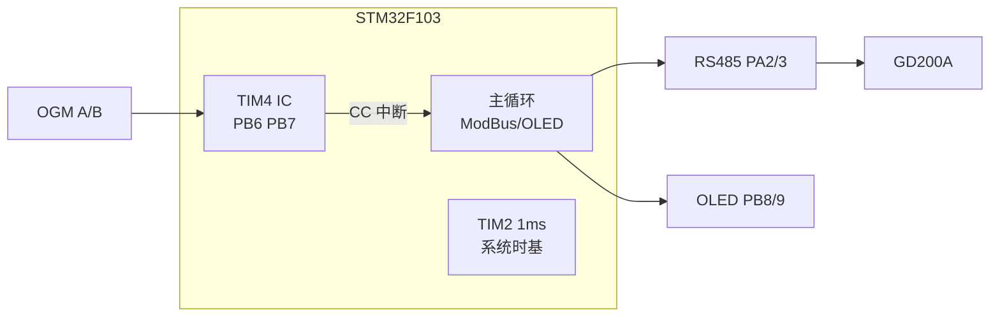
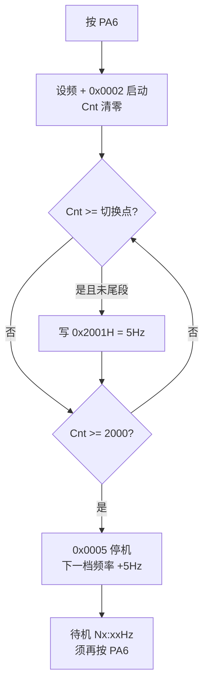
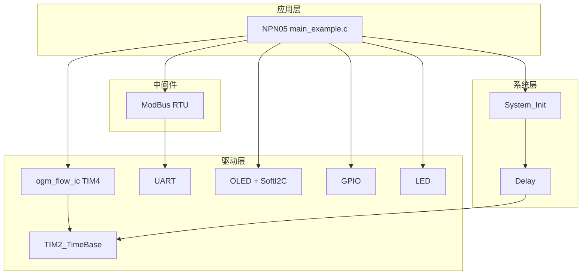
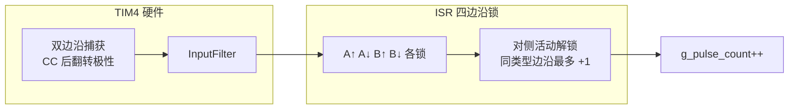

# NPN05 - 预设加油泵（OGM 硬件输入捕获 + GD200A 控泵）

整合 **Bus04_ModBusRTU_Invt_GD200A**（英威腾 GD200A RS485 控泵）与 **OGM 硬件输入捕获 HwAlgo4**（PB6/PB7，TIM4 **双边沿**捕获 + ISR **四边沿互锁**，语义同 NPN03）。

**当前固件**：**d/1s 分档标定测试**——PA6 每按一次启动一档（5→50Hz），每档 **2000 cnt** 自动停机；10Hz 及以上尾段降 **5Hz**。PA4/PA5 无效。

与 **NPN03 / NPN04** 共用泵控、按键、RS485、OLED 接线；**OGM 接 PB6/PB7**。本案例为 **TIM4 双边沿硬件捕获 + 四边沿互锁**（计数语义 **同 NPN03**，一圈约 8）。

---

## 📋 案例目的

### 功能说明

- **OGM HwAlgo4 计量**：TIM4 CH1/CH2（PB6/PB7）**硬件双边沿输入捕获**（CC 中断后翻转极性），ISR **四边沿互锁**（同 NPN03）；升/降每种边沿在对侧解锁前最多 +1
- **非编码器 CNT 模式**：计数为 ISR 内 `g_pulse_count++`，**不是**读 TIM `CNT` 硬件累加（与 `timer_encoder` TI12 不同）
- **双信号线单圈 8 脉冲**：语义同 NPN03
- **ModBus 控泵**：写 GD200A `0x2001H` 设频、`0x2000H` 启停（启动时默认反转 `0x0002`）
- **分档自动测试（本固件）**：PA6 启动键；5~50Hz 步进 5Hz；每档 **2000 cnt** 自动停；尾段降 **5Hz**（见下文）
- **上电 485**：预检 → 读 `2100H` 若在运行则停机 → 写 `0x2001H` 预置 5Hz（**不启泵**）
- **瞬时流量**：`OGM_FlowIC_Process100ms()` 计算 L/min（`OGM_PULSE_FACTOR` 待标定）
- **体积标定**：`PULSES_PER_LITER` 占位（1000），须用 **本案例固件 + PB6/PB7** 单独实测

### 与 NPN03 / NPN04 对照

| 项目 | NPN03 SwAlgo | NPN04 SwAlgo2 | NPN05 HwAlgo4 |
|------|-------------|---------------|---------------|
| OGM 引脚 | PB6 / PB7 | PB6 / PB7 | **PB6 / PB7** |
| 检沿方式 | EXTI 双边沿 + 读 GPIO | EXTI 双边沿 + 读 GPIO | **TIM 硬件双边沿捕获** |
| 计数边沿 | 四边沿（升+降） | 仅下降沿 | **四边沿（升+降）** |
| 互锁位置 | EXTI 回调四边沿锁 | EXTI 回调 A/B arm | **ISR 四边沿锁** |
| 双信号线单圈 | 8 脉冲 | 4 脉冲 | **8 脉冲** |
| 一圈计数（典型） | ~8 | ~4 | **~8** |
| 分档目标 Cnt | 2000 | 1000 | **2000** |
| 消刺 | 四边沿锁 + 间隔 | 交替 arm + 800µs | **InputFilter + 四边沿锁** |
| 定时器 | — | — | **TIM4**（TIM2 专用于 1ms 时基） |
| 依赖模块 | `exti` | `exti` | **`ogm_flow_ic`** |
| OLED 第 4 行 | 485 状态 | 485 状态 | **485 + St（锁位低 4 位）** |
| 本固件操作 | **PA6 分档测试** | **PA6 分档测试** | **PA6 分档测试** |

### 学习重点

- TIM4 双通道输入捕获与系统 TIM2 1ms 时基**分离**，避免与 OGM 引脚/外设冲突
- **硬件检沿 + 软件状态机计数** 的分工（非纯硬件 CNT 正交计数）
- 与 NPN04 软件算法对照验证 d/1s 线性度与标定系数
- 中断计量与主循环 ModBus 阻塞通讯共存

### 应用场景

- OGM + 变频器控泵现场，**硬件捕获**路径验证与 d/1s 分档标定
- 与 NPN03/NPN04/NPN05 **同接线对照**（NPN03/04 为 EXTI 软件路径，本案例为 TIM 硬件捕获）
- 按 PA6 自动跑 5~50Hz 各档，记录 d/1s 与 Cnt，填标定表
- 为 **预设加油量停泵**（P2）积累 `PULSES_PER_LITER`

### 定位说明

| 方案 | 说明 |
|------|------|
| **本案例（NPN05 HwAlgo4）** | TIM **双边沿**输入捕获 + ISR **四边沿互锁**（语义同 NPN03，检沿硬件化、更省 CPU） |
| NPN03 SwAlgo | 同算法，EXTI 软件路径（PB6/PB7），作软件对照 |
| NPN04 SwAlgo2 | 下降沿交替（1K cnt），EXTI 软件路径，作 1K 标定对照 |
| `timer_encoder` TI12 | 正交四倍频硬件 CNT，对本 OGM 波形**不适用**（见 NPN04 README） |

---

## 📊 三种计量算法标定数据（参考）

测试条件：稳态运行下 **OLED `d/1s`**（每秒计数增量）与泵频/功率比线性相关。下表为同管路、同 OGM 工况的**参考实测**（须以现场复测为准）。

### 四边沿互锁（NPN03 软件算法）

| 频率 | 功率比 | 平均沿数 d/1s |
|:----:|:------:|:-------------:|
| 5Hz | 10% | 28–29 |
| 10Hz | 20% | 58–59 |
| 15Hz | 30% | 87–88 |
| 20Hz | 40% | 116–117 |
| 25Hz | 50% | 146–147 |
| 30Hz | 60% | 175–176 |
| 35Hz | 70% | 206–207 |
| 40Hz | 80% | 236–237 |
| 45Hz | 90% | 265–266 |
| 50Hz | 100% | 294–295 |

### 仅下降沿 + 交替 arm（NPN04 软件算法）

| 频率 | 功率比 | 平均沿数 d/1s |
|:----:|:------:|:-------------:|
| 5Hz | 10% | 15–16 |
| 10Hz | 20% | 31–32 |
| 15Hz | 30% | 47–48 |
| 20Hz | 40% | 64–65 |
| 25Hz | 50% | 79–80 |
| 30Hz | 60% | 96–97 |
| 35Hz | 70% | 112–113 |
| 40Hz | 80% | 129–130 |
| 45Hz | 90% | 145–146 |
| 50Hz | 100% | 161–162 |

### 硬件捕获四边沿互锁（本案例 NPN05 HwAlgo4，`CONFIG_OGM_FLOW_IC_ALGO_FOUR_EDGE=1`）

分档停泵目标 **2000 cnt**（与 NPN03 一致）。下表含现场 **5～20Hz** 实测；25～50Hz 待补（预期 d/1s 与 NPN03 同量级）。

| 频率 | 功率比 | 平均沿数 d/1s | 2K 停泵重量 | 相对 NPN03 d/1s |
|:----:|:------:|:-------------:|:-----------:|:---------------:|
| 5Hz | 10% | 27–28 | 10.74 kg | 约 −3% |
| 10Hz | 20% | 60–61 | 10.70 kg | 约 +3% |
| 15Hz | 30% | 90–91 | 10.72 kg | 约 +3% |
| 20Hz | 40% | 123–124 | 10.72 kg | 约 +6% |
| 25Hz | 50% | — | — | 待测 |
| 30Hz | 60% | — | — | 待测 |
| 35Hz | 70% | — | — | 待测 |
| 40Hz | 80% | — | — | 待测 |
| 45Hz | 90% | — | — | 待测 |
| 50Hz | 100% | — | — | 待测 |

**5～20Hz 称重重复性（本表）**：相对平均约 **±2‰**，全档极差约 **4‰**。

<details>
<summary>历史：仅下降沿 A/B 交替（HwAlgo，1K cnt，已弃用）</summary>

`CONFIG_OGM_FLOW_IC_ALGO_FOUR_EDGE=0` 时 d/1s 约为 NPN04 量级（5Hz 约 14–15，50Hz 约 157–158），与四边沿不可混用标定。

</details>

**数据解读：**

- 四边沿 d/1s 约为下降沿交替（NPN04）的 **~1.8–2.0 倍**，符合一圈 8 vs 4
- **NPN05 HwAlgo4 与 NPN03 同语义**；已测低频重量与 NPN03 2K 档接近（约 10.70～10.74 kg）
- 量产推荐 **本案例（NPN05）**；NPN03/04 保留作算法与 EXTI 对照，不必再寻新算法
- `PULSES_PER_LITER` 须按 **四边沿 + 2000 cnt 标定** 单独实测，勿混用 NPN04 的 1K 系数

### 升系数标定方法（配合分档测试）

1. 烧录 **NPN05** 固件，OGM 接 **PB6/PB7**
2. 按 **PA6** 依次跑 5、10、…、50Hz 各档（每档 2000 cnt，高档尾段自动 5Hz）
3. 每档记录稳态 **d/1s**（尾段降频前的主段）及 **Cnt 增量**
4. 需要体积系数时：固定一档（建议 25Hz/50Hz），启泵 `Cnt` 清零，秤/量杯测 **V（L）**，得 `PULSES_PER_LITER = ΔN / V`
5. 多点平均；各档 d/1s 应与 NPN03 或上表接近（±5%）

预设停泵（P2 待实现）条件示例：

```text
OGM_GetCount() >= 目标升数 × PULSES_PER_LITER
```

**注意：** `PULSES_PER_LITER` 必须与 **当前固件算法** 一致，不能混用 NPN03 四边沿系数。

---

## 🔧 硬件要求

### 必需外设

| 设备 | 说明 |
|------|------|
| STM32F103C8T6 | 主控 |
| OGM 流量计（双 NPN 开漏） | 通道 A/B → **PB6 / PB7**（TIM4 CH1/CH2） |
| RS485 模块 | UART2（PA2/PA3），建议自动方向 |
| 英威腾 GD200A 变频器 | ModBus RTU 从站地址 **1** |
| SSD1306 OLED | 128×64，软件 I2C（PB8/PB9） |
| 三按键 + LED | PA4/PA5（本固件无效）/ **PA6 测试启动**；PB12 |

### USART 参数（须与 GD200A P14 一致）

| 串口 | 引脚 | 波特率 | 格式 | 用途 |
|------|------|--------|------|------|
| UART1 | PA9/PA10 | 115200 | 8N1 | Debug / LOG |
| UART2 | PA2/PA3 | 19200 | 8E1（9 位字长） | ModBus RTU |

### 硬件连接（STM32 ↔ 外设）

| STM32F103C8T6 | 外设/模块 | 说明 |
|---------------|----------|------|
| **PB6** | OGM 通道 A | TIM4_CH1，双边沿硬件捕获，上拉输入 |
| **PB7** | OGM 通道 B | TIM4_CH2，双边沿硬件捕获，上拉输入 |
| PA2 | RS485 TX | UART2 发送 |
| PA3 | RS485 RX | UART2 接收 |
| PA4 | 升频键 | 本固件**无效**（测试模式） |
| PA5 | 降频键 | 本固件**无效**（测试模式） |
| PA6 | **测试启动键** | 每按一次启动下一档测试 |
| PA9 | USB 转串口 RX | UART1 Debug TX |
| PA10 | USB 转串口 TX | UART1 Debug RX |
| PB8 | OLED SCL | 软件 I2C |
| PB9 | OLED SDA | 软件 I2C |
| PB12 | LED1 | 低电平点亮 |
| GND | OGM + RS485 + GD200A SG | **必须共地** |

**NPN03/04/05 OGM 接线（已统一）：**

| 信号 | PB6 | PB7 |
|------|-----|-----|
| OGM A | 通道 A | — |
| OGM B | — | 通道 B |

**检沿方式差异：**

| 案例 | PB6/PB7 用法 |
|------|----------------|
| NPN03 / NPN04 | GPIO + **EXTI6/7** 软件计数 |
| NPN05（本案例） | **TIM4 CH1/CH2** 硬件输入捕获 |

**OGM 补充：**

- 双 NPN 开漏输出，MCU 侧 **上拉**（驱动内 `GPIO_MODE_INPUT_PULLUP`）；线较长时建议外接 4.7k~10kΩ 到 3.3V
- 本传感器非标准正交编码器，不适用 `timer_encoder` TI12 四倍频消刺

**接线关系图：**



### RS485 与变频器

变频器 P14 / P00 参数与 NPN03 相同，最小必查：

| 参数 | 值 |
|------|-----|
| P14.00 | 1 |
| P14.01 | 4（19200） |
| P14.02 | 1（8E1） |
| P00.01 | 2（通讯运行） |
| P00.02 | 0 |
| P00.06 | 8（通讯频率） |
| P00.09 | 0 |

详见：`Examples/NPN/NPN03_Preset_Pump_SwAlgo/README.md` 变频器章节，或 `Examples/Bus/Bus04_ModBusRTU_Invt_GD200A/开发指令速查.md`

---

## 🎮 按键与操作（分档自动测试模式）

本案例固件为 **d/1s 标定分档测试**：PA6 为测试启动键，PA4/PA5 在本固件中**无效**（频率由测试序列自动控制）。

| 按键 | 功能 |
|------|------|
| PA4 | （测试模式无效） |
| PA5 | （测试模式无效） |
| **PA6** | **测试启动**：每按一次启动一档，达标自动停机，下一档须再按 |

### 测试流程

1. 上电待机，变频器预置 **5Hz**（不自动启泵）
2. 按 **PA6** → 以 **5Hz** 启动，`Cnt` 清零，反转运行
3. `Cnt` 达到 **2000** → 自动停机
4. 再按 **PA6** → 以 **10Hz** 启动；**≥1960** 时自动降为 **5Hz** 计完尾段 40 个脉冲
5. 依次 **15 / 20 / … / 50Hz**，每档须 **再按一次 PA6**；**10Hz 及以上**在接近 2000 前按表降 5Hz 尾段
6. **50Hz** 档完成后，下一档回到 **5Hz**（循环）

**尾段降频（避免高 d/1s 超表）：**

| 测试频率 | 尾段脉冲数 | Cnt 达到时改 5Hz |
|:--------:|:----------:|:----------------:|
| 5Hz | 0 | 无（全程 5Hz） |
| 10Hz | 40 | ≥ 1960 |
| 15Hz | 80 | ≥ 1920 |
| 20Hz | 120 | ≥ 1880 |
| 25Hz | 160 | ≥ 1840 |
| 30Hz | 200 | ≥ 1800 |
| 35Hz | 240 | ≥ 1760 |
| 40Hz | 280 | ≥ 1720 |
| 45Hz | 320 | ≥ 1680 |
| 50Hz | 360 | ≥ **1640** |

规律（10~50Hz，步进 5Hz）：`尾段 = (频率 - 10) / 5 × 40 + 40`；`切换点 = 2000 - 尾段`。

尾段仅写 **`0x2001H` 改为 5Hz**，**不停机、不清零**；`Cnt >= 2000` 时写 **`0x2000H = 0x0005`** 停机。



可调宏（`main_example.c`）：

| 宏 | 默认 | 说明 |
|----|------|------|
| `TEST_CNT_TARGET` | 2000 | 每档目标计数 |
| `TEST_FREQ_START_HZ` | 5 | 首档 / 循环回绕频率 |
| `TEST_FREQ_STEP_HZ` | 5 | 档间步进 |
| `TEST_FREQ_MAX_HZ` | 50 | 最高档 |
| `TEST_TAIL_PULSE_STEP` | 40 | 尾段步进（×2 于 1K 档） |
| `TEST_TAIL_PULSE_BASE` | 40 | 10Hz 尾段脉冲数 |
| `TEST_FREQ_TAIL_HZ` | 5 | 尾段降频目标 |
| `CONFIG_OGM_FLOW_IC_ALGO_FOUR_EDGE` | 1 | 1=四边沿互锁（默认）；0=下降沿交替旧模式 |

485 忙时按键挂起、空闲补执行；运行中按 PA6 **不会**手动停机（仅达标自动停）。

---

## 📺 OLED 显示

| 行 | 内容 | 示例 |
|----|------|------|
| 1 | 累计有效边沿计数 | `Cnt:00000820` |
| 2 | 待机：下一档频率；运行：本档+目标；尾段 | `Nx:10Hz idle` / `F:50 T:2000` / `F:50>05 T:2000` |
| 3 | 每秒计数增量 | `d/1s:000157` |
| 4 | 485 状态 + 状态机 | `485:OK St:0` |

**说明：**

- `d/1s`：过去 1 秒内有效边沿增量，用于标定与频率线性验证
- `St`：四边沿锁位低 4 位（调试，非 WAIT_A/B）
- OLED 输出须为 **ASCII 英文**（项目规范）

**布局示意：**

```
┌────────────────── 128×64 ──────────────────┐
│ Cnt:00000820                               │  第1行
│ F:50>05 T:2000  (或 Nx:10Hz idle)          │  第2行
│ d/1s:000015                                │  第3行（尾段时偏低）
│ 485:OK St:1                                │  第4行
└────────────────────────────────────────────┘
```

---

## 📦 模块依赖

### 模块依赖关系图



### 模块列表

| 模块 | 路径 | 用途 |
|------|------|------|
| `ogm_flow_ic` | `Drivers/timer/ogm_flow_ic.c` | TIM4 双通道捕获 + ISR 四边沿互锁 |
| `modbus_rtu` + `uart` | 中间件 / 驱动 | GD200A RS485 |
| `oled_ssd1306` + `soft_i2c` | 驱动 | 现场显示 |
| `gpio` / `led` | 驱动 | 按键、状态灯 |
| `TIM2_TimeBase` + `delay` | 系统 / 驱动 | 1ms 时基、d/1s 窗口 |
| `system_init` | 系统 | 统一初始化 |

### config.h 模块开关

| 宏 | 值 | 说明 |
|----|-----|------|
| `CONFIG_MODULE_OGM_FLOW_IC_ENABLED` | 1 | OGM 输入捕获驱动 |
| `CONFIG_MODULE_TIMER_ENABLED` | 1 | 定时器相关 |
| `CONFIG_MODULE_EXTI_ENABLED` | 0 | 不使用 EXTI 计量 |
| `CONFIG_MODULE_BASE_TIMER_ENABLED` | 1 | TIM2 1ms 时基 |
| `CONFIG_MODULE_MODBUS_RTU_ENABLED` | 1 | 变频器通讯 |
| `CONFIG_MODULE_OLED_ENABLED` | 1 | OLED |
| `CONFIG_MODULE_SOFT_I2C_ENABLED` | 1 | 软件 I2C |
| `CONFIG_OGM_FLOW_IC_ALGO_FOUR_EDGE` | 1 | 四边沿互锁（默认）；0=下降沿交替旧模式 |

硬件引脚见本目录 `board.h`；中断入口见 `Core/stm32f10x_it.c`（`TIM4_IRQHandler` → `OGM_FlowIC_IRQHandler`）。

---

## 🔄 实现流程

### 计量原理（硬件 / 软件分工）



| 环节 | 硬件 / 软件 | 说明 |
|------|-------------|------|
| 边沿检测 | **硬件** | TIM4 双边沿捕获（CC 后翻转 `CCxP` 极性） |
| 计数规则 | **四边沿互锁** | 同 NPN03；升/降每种在对侧解锁前最多 +1 |
| 锁位状态 | **软件（ISR）** | `g_edge_locks` + `g_pulse_count++` |
| d/1s / 瞬时流量 | **软件（主循环）** | `OGM_FlowIC_GetCount()` 差分 |

### 初始化顺序

1. `System_Init()`（含 TIM2 1ms 时基）
2. `OLED_Init()` → `Pump_InitComm()` → `Pump_InitButtons()`
   - 485 预检（读 `0x2001H`）
   - 读 **`0x2100H`**：若 `0x0001` 正转 / `0x0002` 反转 → 写 **`0x2000H = 0x0005`** 停机
3. **先 `Pump_RefreshOLED()` 亮屏**，再 `OGM_FlowIC_Init()`
4. 485 正常：写 **`0x2001H` = 5Hz**（不启泵，待机）
5. 主循环：`OGM_FlowIC_Process100ms()` → `Pump_CheckTestAutoStop()`（尾段降频 + 达标停机）→ 按键 → OLED/LED

### 485 写寄存器（本固件）

| 寄存器 | 值 | 时机 |
|--------|-----|------|
| `0x2001H` | Hz×100 | 上电预置 5Hz；PA6 启动；尾段改 5Hz |
| `0x2000H` | `0x0002` | PA6 启动（反转运行） |
| `0x2000H` | `0x0005` | 上电检测到运行；Cnt≥2000 停机 |
| `0x2100H` | 只读 | 上电判断运行状态 |

**不写入**变频器 P00/P14 等功能码（须面板或另工具配置）。

### 驱动要点（`ogm_flow_ic`）

| 配置项 | 默认 | 说明 |
|--------|------|------|
| `OGM_FLOW_IC_INSTANCE` | TIM4 | `board.h` |
| `OGM_FLOW_IC_FILTER` | `0x04` | 输入滤波，可改 `0` 对比 d/1s |
| `OGM_FLOW_IC_BOOT_MASK_MS` | 300ms | 上电后延迟使能 CC 中断，滤上电毛刺 |
| `OGM_PULSE_FACTOR` | `1/450` | 瞬时流量换算，待标定 |

### 驱动 API

| 函数 | 说明 |
|------|------|
| `OGM_FlowIC_Init()` | 须在 `System_Init()` 之后 |
| `OGM_FlowIC_IRQHandler()` | 由 `TIM4_IRQHandler` 调用 |
| `OGM_FlowIC_Process100ms()` | 主循环调用；内部使能 CC 中断并算流量 |
| `OGM_FlowIC_GetCount()` / `ResetCount()` | 读计数 / 启泵清零 |
| `OGM_FlowIC_GetState()` | 读四边沿锁位低 4 位（OLED `St`） |
| `OGM_FlowIC_InjectPulse()` | 单元测试（`CONFIG_OGM_FLOW_IC_TEST_INJECT=1`） |

---

## 🛠️ Keil 工程

本目录已包含 **`Examples.uvprojx`**（Target / 输出：`NPN05_Preset_Pump_HwAlgo`）。

| 操作 | 文件 |
|------|------|
| 已添加 | `Drivers/timer/ogm_flow_ic.c` |
| 已移除 | `Drivers/peripheral/exti.c` |
| 保留 | `Library/stm32f10x_exti.c`（SPL 库） |

1. 打开 `Examples/NPN/NPN05_Preset_Pump_HwAlgo/Examples.uvprojx`
2. 确认 `config.h` 中 `CONFIG_MODULE_OGM_FLOW_IC_ENABLED=1`、`CONFIG_MODULE_EXTI_ENABLED=0`
3. 编译输出：`Build/Keil/Objects/NPN05_Preset_Pump_HwAlgo.hex`

---

## ✅ 测试清单

### 上电自检

- [ ] OLED 待机显示 `Nx:05Hz idle`、`485:OK`
- [ ] UART1 打印 `NPN05 Preset Pump HwAlgo` 与 `PA6 start 5~50Hz`
- [ ] 上电若变频器在转，串口有「检测到运行中…强制停机」
- [ ] `OGM_FlowIC_Init()` 失败时 PB12 LED 快闪（100/100ms）

### 分档测试（PA6）

- [ ] 第 1 次 PA6：5Hz 跑到 2000 cnt 自动停
- [ ] 第 2 次 PA6：10Hz；Cnt≥1960 时第 2 行变为 `F:10>05 T:2000`
- [ ] 50Hz 档：Cnt≥1640 降 5Hz，到 2000 停机；下次 PA6 从 5Hz 重新开始
- [ ] 运行中按 PA6 无效（不会手动停）

### 计量与对照

- [ ] OGM 接 **PB6/PB7**（与 NPN03/04 同线；本固件为 TIM4 捕获）
- [ ] 各档主频段 `d/1s` 与参考表接近（±5%）；尾段 5Hz 时 d/1s 下降属正常
- [ ] 启泵后 `Cnt` 清零；`St` 在 0/1 间随流量变化

### 毛刺与断流

- [ ] 连续同通道乱序边沿不增加 `Cnt`
- [ ] 停泵约 1s 后瞬时流量归零

### 单元测试注入（可选）

`config.h` 设 `CONFIG_OGM_FLOW_IC_TEST_INJECT 1`：

```c
OGM_FlowIC_InjectPulse(0); /* A */
OGM_FlowIC_InjectPulse(1); /* B */
OGM_FlowIC_InjectPulse(0); /* A */
OGM_FlowIC_InjectPulse(1); /* B */
/* 期望 count = 4 */
```

---

## ⚙️ 标定参数速查

| 宏 | 文件 | 说明 |
|----|------|------|
| `OGM_FLOW_IC_INSTANCE` | `board.h` | 默认 `2`（TIM4） |
| `OGM_CH_A/B` | `board.h` | 默认 PB6 / PB7 |
| `OGM_FLOW_IC_FILTER` | `board.h` | TIM 输入滤波 |
| `OGM_FLOW_IC_BOOT_MASK_MS` | `ogm_flow_ic.c` | 上电延迟使能 CC 中断（默认 300ms） |
| `OGM_PULSE_FACTOR` | `board.h` | 瞬时流量 L/min |
| `PULSES_PER_LITER` | `main_example.c` | 体积停泵系数（待实测） |
| `TEST_CNT_TARGET` | `main_example.c` | 每档目标计数（默认 2000） |
| `TEST_FREQ_START_HZ` | `main_example.c` | 首档 / 回绕频率（默认 5Hz） |
| `TEST_FREQ_STEP_HZ` | `main_example.c` | 档间步进（默认 5Hz） |
| `TEST_FREQ_MAX_HZ` | `main_example.c` | 最高档（默认 50Hz） |
| `TEST_FREQ_TAIL_HZ` | `main_example.c` | 尾段降频（默认 5Hz） |
| `INVT_SLAVE_ADDRESS` | `main_example.c` | 变频器地址，默认 1 |

---

## 📌 待办（P2）

- [ ] 恢复 NPN03 式三键调频/启停（与分档测试固件分支或宏切换）
- [ ] 预设加油量达量自动停泵（`Cnt >= 升数 × PULSES_PER_LITER`）
- [ ] Flash 掉电累计保存
- [ ] 40L 实加标定填表（`PULSES_PER_LITER` 定稿）

---

## 📝 修订记录

| 日期 | 说明 |
|------|------|
| 2026-06-22 | README：HwAlgo4 标定表（5～20Hz 称重）、量产选型说明；弃用旧 1K 下降沿表 |
| 2026-06-22 | HwAlgo4：TIM 双边沿捕获 + 四边沿互锁；分档 2000 cnt/档 |
| 2026-06-22 | 分档测试：PA6 启动、尾段降 5Hz；上电读 2100H 强制停机 |
| 2026-06-22 | OGM TIM4 PB6/PB7 硬件捕获；README 与 NPN03/NPN04 对照标定表 |

---

## 🔗 相关案例

| 案例 | 说明 |
|------|------|
| `Examples/NPN/NPN03_Preset_Pump_SwAlgo` | 四边沿互锁 EXTI 对照（PB6/PB7，2K cnt） |
| `Examples/NPN/NPN04_Preset_Pump_SwAlgo2` | 下降沿交替 EXTI 对照（PB6/PB7，1K cnt） |
| `Examples/Bus/Bus04_ModBusRTU_Invt_GD200A` | 变频器通讯 |
| `Drivers/timer/ogm_flow_ic.c` | 本案例核心驱动 |

---

**最后更新**：2026-06-22
