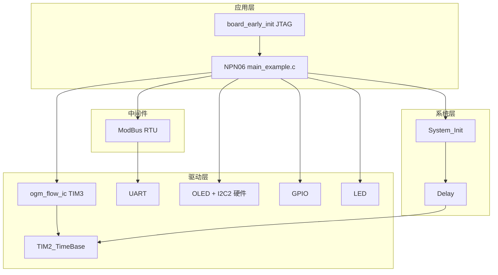
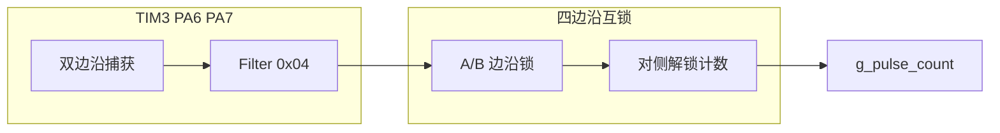
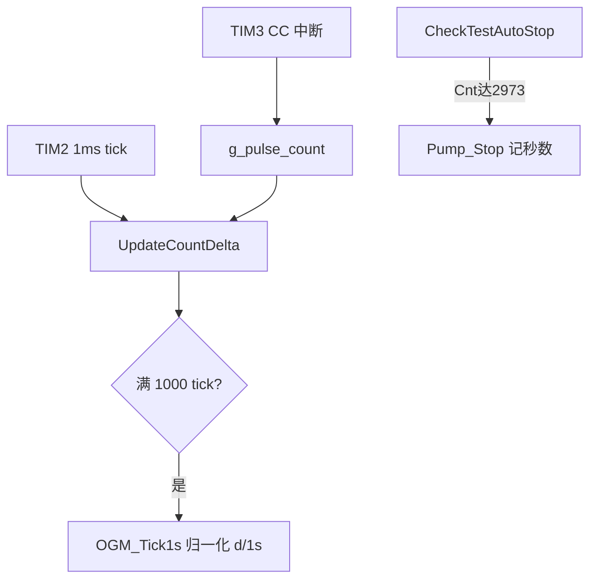
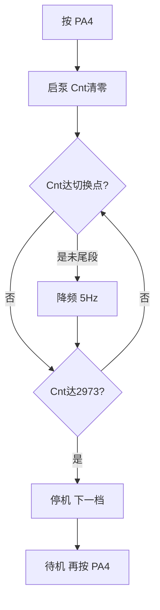

# NPN06 - 预设加油泵（小精灵 STM32F103ZE）

**应用逻辑与 [NPN05](../NPN05_Preset_Pump_HwAlgo/README.md) 完全相同**（共用 `ogm_flow_ic`、分档测试、尾段降频、ModBus 泵控），仅 **板级引脚 / OLED 总线 / 芯片型号** 不同。

**当前固件**：PA4 每按一次启动一档（5→50Hz），每档 **2973 cnt** 自动停机；10Hz 及以上尾段降 **5Hz**。

**停机目标构成**：**标准 2900** + **软管补偿 73** = **2973**。补偿用于抵消软管弹性变形与停泵残余，使秤重接近标准加油量（与 NPN05 相同）。

| 项 | 宏 | 脉冲数 | 说明 |
|----|-----|:------:|------|
| 标准量 | `TEST_CNT_STANDARD` | **2900** | 秤/量杯标定的有效加油脉冲 |
| 软管补偿 | `TEST_CNT_HOSE_COMP` | **73** | 软管弹性、停泵残余等现场补偿 |
| 停机目标 | `TEST_CNT_TARGET` | **2973** | 固件判停值（上两项之和） |

---

## 📋 与 NPN05 差异速查

| 项目 | NPN05（F103C8） | NPN06（F103ZE 小精灵） |
|------|-----------------|------------------------|
| 芯片 / Keil | `STM32F10X_MD`，64KB Flash | **`STM32F10X_HD`**，512KB Flash |
| OGM | TIM4 **PB6 / PB7** | **TIM3 PA6 / PA7**（编码器②） |
| 启动键 | **PA6** | **PA4** |
| OLED | 软件 I2C **PB8 / PB9** | **硬件 I2C2 PB10 / PB11** |
| LED | PB12 | **PC4** |
| USART3 | 未用 | PC10/PC11（485①，PartialRemap，本固件未初始化） |
| 上电 | `System_Init()` | **`Board_EarlyInit()`**（释放 JTAG）+ `System_Init()` |
| 系统时钟 | startup 8MHz×9=72MHz | **同左** |
| 计量算法 | 四边沿互锁 | **相同**（`CONFIG_OGM_FLOW_IC_ALGO_FOUR_EDGE=1`） |
| `TEST_CNT_STANDARD` / `TEST_CNT_HOSE_COMP` | 2900 / 73 | **2900 / 73**（停机 2973） |

**算法无区别**：同一套 `main_example.c` 逻辑、`ogm_flow_ic.c` 驱动、d/1s 归一化与秒数显示。

---

## 🔧 硬件接线

| 功能 | 引脚 | 说明 |
|------|------|------|
| OGM A / B | **PA6 / PA7** | TIM3 CH1/CH2，双边沿捕获 + 四边沿互锁 |
| 485② 变频器 | PA2 / PA3 | USART2，19200 8E1，ModBus 地址 1 |
| TTL 调试 | PA9 / PA10 | USART1，115200 8N1 |
| OLED | PB10 / PB11 | 硬件 I2C2（SSD1306） |
| 启动键 | **PA4** | 上拉，按下接 GND |
| LED | PC4 | 低电平点亮 |
| 继电器（未用） | PD3 | `board.h` 已定义，本固件未驱动 |
| GND | — | OGM、RS485、变频器信号地 **必须共地** |

**OGM 接线注意：**

- 双 NPN 开漏；MCU 内上拉，线长建议外接 4.7k~10kΩ 到 3.3V
- 与 NPN05 的 PB6/PB7 为 **不同物理插座**，接同一流量计时确认 A/B 线序

---

## 🎮 操作（分档测试）

与 NPN05 相同，仅启动键改为 **PA4**：

1. 上电待机，预置 5Hz（不启泵）
2. 按 **PA4** → 5Hz 启动，`Cnt` 清零
3. `Cnt` 达 **2973** → 自动停机
4. 再按 **PA4** → 下一档（+5Hz）；10Hz 及以上接近目标前自动降 **5Hz** 尾段
5. 50Hz 档完成后下一档回绕 **5Hz**

### 尾段切换点（`TEST_CNT_TARGET=2973`）

| 测试频率 | 尾段脉冲数 | Cnt 达到时改 5Hz |
|:--------:|:----------:|:----------------:|
| 5Hz | 0 | 无 |
| 10Hz | 40 | ≥ 2933 |
| 15Hz | 80 | ≥ 2893 |
| 20Hz | 120 | ≥ 2853 |
| 25Hz | 160 | ≥ 2813 |
| 30Hz | 200 | ≥ 2773 |
| 35Hz | 240 | ≥ 2733 |
| 40Hz | 280 | ≥ 2693 |
| 45Hz | 320 | ≥ 2653 |
| 50Hz | 360 | ≥ **2613** |

公式：`尾段 = (频率-10)/5×40+40`；`切换点 = 2973 - 尾段`。

---

## 📺 OLED 显示

| 行 | 内容 | 示例 |
|----|------|------|
| 1 | 累计计数 | `Cnt:00002973` |
| 2 | 待机/运行/尾段 | `Nx:10Hz idle` / `F:50 T:2973` / `F:50>05 T:2973` |
| 3 | 瞬时速率 | `d/1s:000028` |
| 4 | 485 + **本档秒数** | `485:OK  180s` |

### 读数说明（标定必读）

| 显示项 | 含义 |
|--------|------|
| **Cnt** | ISR 真实累计，停机判据 |
| **d/1s** | 最近约 1s 的瞬时速率（已按实际窗口毫秒归一化） |
| **秒数** | 本档启动→停机耗时；运行中递增 |
| **整档平均** | `Cnt ÷ 秒数`（例：2973÷180≈**16.5/s**） |

**常见误解：**

- 主段 d/1s 约 28，但整档平均约 16——**正常**：高档约 12% 计数在 **5Hz 尾段**完成，耗时占比大
- **勿**用 `2973 ÷ d/1s` 估算总时间
- **管路堵塞**会拉低 d/1s 与整档平均；NPN05/NPN06 同条件下应接近

---

## 📦 模块与工程

### config.h 要点

| 宏 | 值 | 说明 |
|----|-----|------|
| `CONFIG_MODULE_OGM_FLOW_IC_ENABLED` | 1 | OGM 输入捕获 |
| `CONFIG_MODULE_I2C_ENABLED` | 1 | 硬件 I2C（OLED） |
| `CONFIG_MODULE_SOFT_I2C_ENABLED` | 0 | 不用软 I2C |
| `CONFIG_OGM_FLOW_IC_ALGO_FOUR_EDGE` | 1 | 四边沿互锁 |

### board.h 要点

| 宏 | 值 |
|----|-----|
| `OGM_FLOW_IC_INSTANCE` | 1（TIM3） |
| `OGM_CH_A/B` | PA6 / PA7 |
| `OGM_FLOW_IC_FILTER` | `0x04` |
| `OLED_I2C_TYPE` | 硬件 I2C2 |
| `UART3_USE_PC10_PC11_REMAP` | 1（预留 485①） |

### 模块依赖关系图



| 模块 | 路径 | 用途 |
|------|------|------|
| `ogm_flow_ic` | `Drivers/timer/ogm_flow_ic.c` | TIM3 双通道捕获 + ISR 四边沿互锁 |
| `modbus_rtu` + `uart` | 中间件 / 驱动 | GD200A RS485 |
| `oled_ssd1306` + `i2c_hw` | 驱动 | 硬件 I2C2 OLED |
| `board_early_init` | 本案例 | 释放 JTAG（PB3/PB4/PA15） |
| `gpio` / `led` | 驱动 | 按键 PA4、LED PC4 |
| `TIM2_TimeBase` + `delay` | 系统 / 驱动 | 1ms 时基、d/1s 窗口、本档秒数 |
| `system_init` | 系统 | 统一初始化 |

硬件引脚见 `board.h`；中断入口见 `Core/stm32f10x_it.c`（`TIM3_IRQHandler` → `OGM_FlowIC_IRQHandler`）。

---

## 🔄 实现流程

> 若 Mermaid 图不显示，请用 VS Code / GitHub / Cursor 预览，或阅读 ASCII 示意与表格。

### 计量原理（硬件 / 软件分工）



```text
OGM PA6/PA7 → TIM3 双边沿捕获 → 四边沿互锁(ISR) → g_pulse_count++
```

| 环节 | 硬件 / 软件 | 说明 |
|------|-------------|------|
| 边沿检测 | **硬件** | TIM3 CH1/CH2（PA6/PA7）双边沿捕获 |
| 计数规则 | **四边沿互锁** | 与 NPN05/NPN03 相同 |
| 停机判据 | **软件（主循环）** | `Cnt >= TEST_CNT_TARGET`（2973 = 2900 标准 + 73 软管补偿） |
| d/1s | **软件（主循环）** | 按 `g_task_tick` 窗口累加后 **÷ window_ms × 1000** 归一化 |
| 本档秒数 | **软件（主循环）** | `Pump_Start` 记时 → `Pump_Stop` 冻结显示 |

### 主循环数据流



```text
TIM2(1ms) → 每 tick 读 Cnt 增量 → 满 1s 窗口算 d/1s（归一化）
TIM3 中断 → g_pulse_count++ → 主循环判 Cnt>=2973 → 停机并显示秒数
```

### 初始化顺序

1. **`Board_EarlyInit()`** — 释放 JTAG（小精灵板 PB3/PB4/PA15）
2. **`System_Init()`** — TIM2 1ms 时基
3. **`OLED_Init()`** → **`Pump_InitComm()`** → **`Pump_InitButtons()`**
   - 485 预检；读 **`0x2100H`**，若在运行则写 **`0x2000H = 0x0005`** 停机
4. **先 `Pump_RefreshOLED()` 亮屏**，再 **`OGM_FlowIC_Init()`**（TIM3 PA6/PA7）
5. 485 正常：写 **`0x2001H` = 5Hz**（不启泵）
6. **主循环**：抽 tick 累加 d/1s → `OGM_FlowIC_Process100ms()` → 尾段/达标停机 → **PA4** 按键 → OLED/LED

### 分档测试状态机



```text
PA4 → 启泵(Cnt=0) → [可选尾段5Hz] → Cnt>=2973 → 停机 → 再按PA4下一档
```

### 485 写寄存器（本固件）

| 寄存器 | 值 | 时机 |
|--------|-----|------|
| `0x2001H` | Hz×100 | 上电预置 5Hz；**PA4** 启动；尾段改 5Hz |
| `0x2000H` | `0x0002` | PA4 启动（反转运行） |
| `0x2000H` | `0x0005` | 上电检测到运行；Cnt≥2973 停机 |
| `0x2100H` | 只读 | 上电判断运行状态 |

### 驱动要点（`ogm_flow_ic`）

| 配置项 | NPN06 默认 | 说明 |
|--------|------------|------|
| `OGM_FLOW_IC_INSTANCE` | TIM3 | `board.h` |
| `OGM_CH_A/B` | PA6 / PA7 | 编码器② |
| `OGM_FLOW_IC_FILTER` | `0x04` | 输入滤波 |
| `OGM_FLOW_IC_BOOT_MASK_MS` | 300ms | 上电延迟使能 CC 中断 |

### 驱动 API

| 函数 | 说明 |
|------|------|
| `OGM_FlowIC_Init()` | 须在 `System_Init()` 之后 |
| `OGM_FlowIC_IRQHandler()` | 由 `TIM3_IRQHandler` 调用 |
| `OGM_FlowIC_Process100ms()` | 主循环；使能 CC 中断并算瞬时流量 |
| `OGM_FlowIC_GetCount()` / `ResetCount()` | 读计数 / 启泵清零 |

更完整的标定表、变频器 P 参数见 [NPN05 README](../NPN05_Preset_Pump_HwAlgo/README.md)。

### 编译烧录

1. 打开 `Examples/NPN/NPN06_Preset_Pump_HwAlgo_STM32F103ZE/Examples.uvprojx`
2. Target：`STM32F103ZE`，宏 `STM32F10X_HD`
3. **Rebuild all** → 烧录 `Build/Keil/Objects/NPN06_Preset_Pump_HwAlgo_STM32F103ZE.hex`

### 上电串口预期

```
NPN06 Preset Pump HwAlgo (F103ZE)
TIM3 PA6/PA7 4-edge lock
PA4 start 5~50Hz step5, 2973 cnt/auto stop
```

---

## ✅ 测试清单

- [ ] OLED 待机：`Nx:05Hz idle`、`485:OK`、`0s`
- [ ] PA4 启动：5Hz 跑到 **2973 cnt** 自动停
- [ ] 50Hz 档：`Cnt≥2613` 显示 `F:50>05`，到 2973 停机
- [ ] 第 4 行秒数与秒表一致；**Cnt÷秒数** 为整档平均
- [ ] 同管路、同档位，d/1s / 平均与 **NPN05** 接近（±5%）
- [ ] `OGM_FlowIC_Init` 失败时 LED（PC4）快闪

更完整的计量原理、标定表、变频器参数见 [NPN05 README](../NPN05_Preset_Pump_HwAlgo/README.md) 的 **实现流程** 章节（TIM4 版，算法相同）。

---

## ⚙️ 可调宏（`main_example.c`）

| 宏 | 当前值 | 说明 |
|----|--------|------|
| `TEST_CNT_STANDARD` | **2900** | 标定标准量（脉冲） |
| `TEST_CNT_HOSE_COMP` | **73** | 软管补偿（脉冲） |
| `TEST_CNT_TARGET` | **2973** | 停机目标（标准 + 补偿） |
| `TEST_FREQ_START_HZ` | 5 | 首档 / 回绕 |
| `TEST_FREQ_STEP_HZ` | 5 | 档间步进 |
| `TEST_FREQ_MAX_HZ` | 50 | 最高档 |
| `TEST_FREQ_TAIL_HZ` | 5 | 尾段频率 |
| `TEST_TAIL_PULSE_STEP` | 40 | 尾段步进 |
| `TEST_TAIL_PULSE_BASE` | 40 | 10Hz 尾段脉冲数 |

---

## 📝 修订记录

| 日期 | 说明 |
|------|------|
| 2026-06-25 | 修复 Mermaid 语法（`++]` 等导致流程图无法渲染） |
| 2026-06-25 | 补充停机目标：标准 2900 + 软管补偿 73 = 2973 |
| 2026-06-25 | 完善文档：秒数显示、d/1s 归一化、读数说明、尾段表、与 NPN05 对照 |
| 2026-06-25 | 初版：F103ZE 小精灵板 TIM3 + 硬 I2C OLED |

---

## 🔗 相关案例

| 案例 | 说明 |
|------|------|
| [NPN05](../NPN05_Preset_Pump_HwAlgo/README.md) | C8 主参考（TIM4 PB6/PB7，软 I2C） |
| `Drivers/timer/ogm_flow_ic.c` | 共用 OGM 驱动 |
| `Examples/Bus/Bus04_ModBusRTU_Invt_GD200A` | GD200A 变频器通讯 |

---

**最后更新**：2026-06-25
