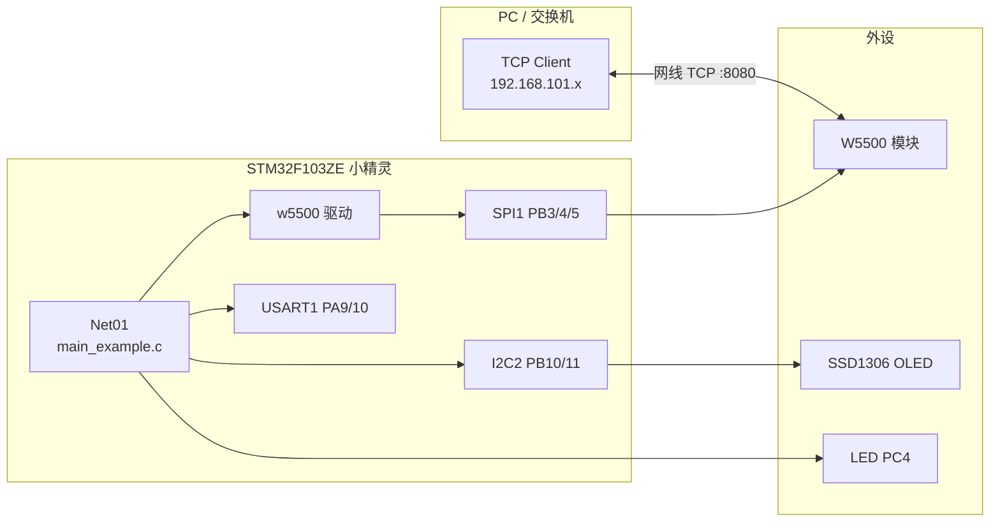
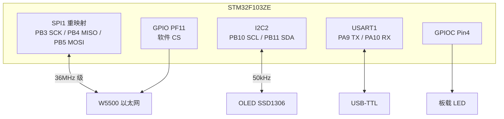
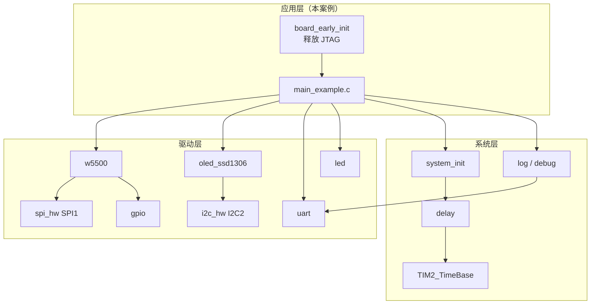
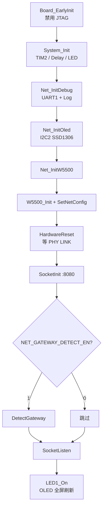
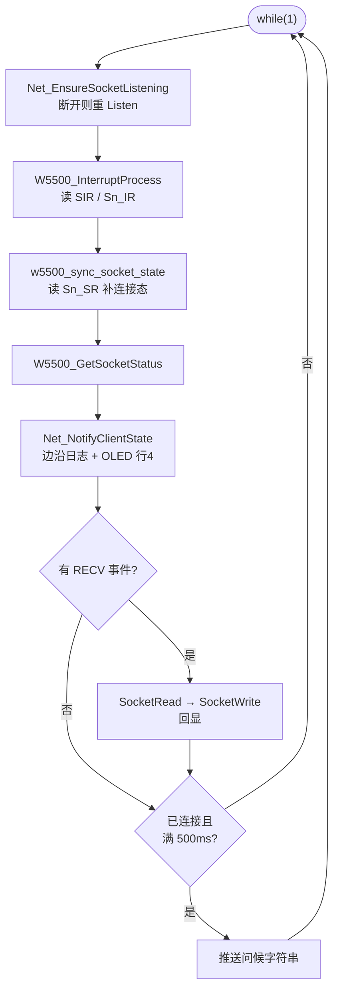
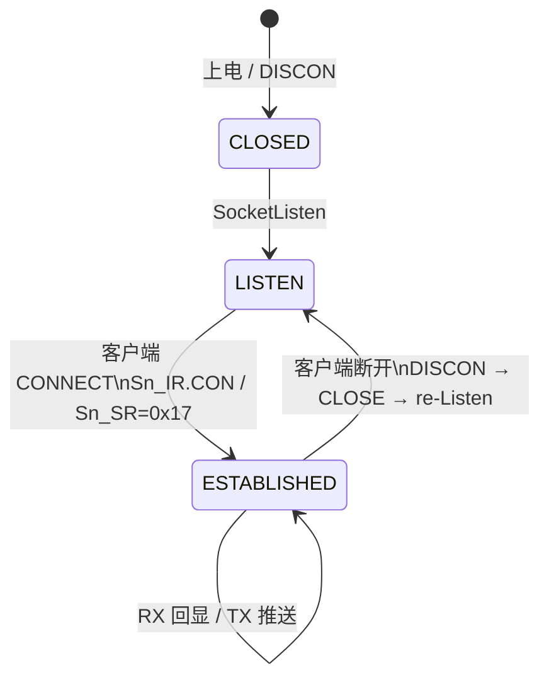
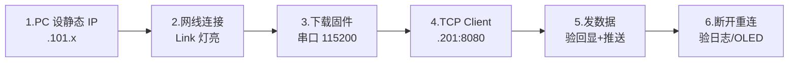

# Net01 - W5500 TCP Server 轮询回显

小精灵 **STM32F103ZE** + **W5500**，TCP Server **8080**，轮询处理 Socket；日志 **UART1**，状态 **OLED（硬件 I2C2）**。

---

## 📋 案例目的

- 验证主工程 `Drivers/network/w5500` 在小精灵板上的可用性
- 演示 **SPI1 重映射 PB3/4/5** + **无 RST GPIO** 的 W5500 接线
- 演示轮询 `W5500_InterruptProcess()`，不依赖 EXTI
- 提供 Net 类案例模板（`board.h` / `config.h` / `main_example.c`）
- 进阶可参考 [Net02](../Net02_W5500_Server_EXTI/README.md)（EXTI 中断模式）

---

## 🎯 功能特性

| 项目 | 说明 |
|------|------|
| 工作模式 | Socket0 **TCP Server**，端口 **8080** |
| IP | 静态 `192.168.101.201` / 网关 `.1` / 掩码 `255.255.255.0` |
| MAC | STM32 UID 算法生成（`0x02` 前缀，每片唯一） |
| 收包 | 客户端数据 **原样回显** |
| 推送 | 已连接每 **500ms** 发 `\r\nW5500 TCP Server OK\r\n` |
| 调试 | USART1 **115200**（PA9/PA10） |
| 显示 | OLED 4 行；PC4 LED 常亮=运行 |

---

## 🔧 硬件接线

### 引脚表

| 功能 | 引脚 | 总线 / 说明 |
|------|------|-------------|
| W5500 SCLK | **PB3** | SPI1 重映射 |
| W5500 MISO | **PB4** | SPI1 重映射 |
| W5500 MOSI | **PB5** | SPI1 重映射 |
| W5500 SCSn | **PF11** | GPIO 片选，低有效 |
| W5500 INTn | **PF9** | 未用（轮询） |
| W5500 RSTn | — | 模块上电复位 |
| OLED | **PB10 / PB11** | **硬件 I2C2**，50kHz |
| UART 调试 | **PA9 / PA10** | USART1 115200 |
| LED | **PC4** | 低电平亮 |

### 系统拓扑



```text
PC(192.168.101.x) ←─网线─→ W5500 ←SPI1─→ STM32 ←I2C2─→ OLED
                                      ←UART1─→ 串口调试
```

### MCU 与外设连接



| 注意 | 说明 |
|------|------|
| JTAG | PB3/4/5 与 JTAG 冲突 → `Board_EarlyInit()` 禁用 JTAG |
| 双总线 | SPI（W5500）与 I2C（OLED）独立，可同时工作 |
| 网段 | PC 须与板子同网段，如 `192.168.101.100` |

---

## 📦 模块与分层

### 模块依赖关系图



| 模块 | 路径 | 用途 |
|------|------|------|
| `w5500` | `Drivers/network/w5500.c` | 寄存器读写、Socket0 TCP、轮询中断 |
| `spi_hw` | `Drivers/spi/spi_hw.c` | SPI1 + PB3 重映射 |
| `oled_ssd1306` | `Drivers/display/` | SSD1306 显示 |
| `i2c_hw` | `Drivers/i2c/i2c_hw.c` | 硬件 I2C2 |
| `board_early_init` | 本案例 | `GPIO_Remap_SWJ_JTAGDisable` |

### 目录结构

```text
Net01_W5500_Server_polling/
├── main_example.c       # 应用：网络参数、轮询、OLED
├── board.h              # 引脚：SPI / I2C / W5500 / UART
├── config.h             # 模块开关
├── board_early_init.c/h # JTAG 释放
├── Examples.uvprojx     # Keil 工程
├── keilkill.bat
└── README.md
```

---

## ⚙️ 配置说明

### 网络参数（`main_example.c`）

```c
#define NET_IP_ADDR             { 192, 168, 101, 201 }
#define NET_GATEWAY             { 192, 168, 101, 1 }
#define NET_SUBNET              { 255, 255, 255, 0 }
#define NET_TCP_PORT            8080U
#define NET_PUSH_INTERVAL_MS    500U
#define NET_GATEWAY_DETECT_EN   0U   /* 1=启动时 ARP 探测网关 */
```

| 宏 | 作用 |
|----|------|
| `NET_IP_ADDR` 等 | 静态四元组 |
| `NET_TCP_PORT` | 监听端口 |
| `NET_PUSH_INTERVAL_MS` | 连接后推送周期 |
| `NET_GATEWAY_DETECT_EN` | `0` 跳过探测（直连推荐） |

### config.h 要点

| 宏 | 值 | 说明 |
|----|-----|------|
| `CONFIG_MODULE_W5500_ENABLED` | 1 | W5500 驱动 |
| `CONFIG_MODULE_SPI_ENABLED` | 1 | 硬件 SPI |
| `CONFIG_MODULE_I2C_ENABLED` | 1 | 硬件 I2C（OLED） |
| `CONFIG_MODULE_OLED_ENABLED` | 1 | SSD1306 |
| `CONFIG_MODULE_SOFT_I2C_ENABLED` | 0 | 不用软 I2C |

---

## 🔄 实现流程

> 若 Mermaid 图不显示，请用 VS Code / GitHub / Cursor 预览，或阅读下方 ASCII 示意与表格。

### 上电初始化顺序



```text
EarlyInit → System_Init → Debug/OLED → W5500_Init → Listen → LED On
```

### 主循环数据流（`Net_PollOnce`）



```text
EnsureListen → InterruptProcess → GetStatus → 连接提示 → 回显 → 周期推送
```

### TCP Server 连接状态机



| 状态 | 硬件 Sn_SR | OLED 行4 | 串口 |
|------|------------|----------|------|
| 监听 | `0x14` LISTEN | `Listen OK` | — |
| 已连接 | `0x17` ESTABLISHED | `Client ON` | `Client connected` |
| 断开后 | 重进 LISTEN | `Listen OK` | `Client disconnected` |

---

## 📺 OLED 显示

| 行 | 示例 | 说明 |
|----|------|------|
| 1 | `Net01 W5500` | 标题 |
| 2 | `192.168.101.201` | IP |
| 3 | `L:UP P:8080` | 链路 + 端口 |
| 4 | `Listen OK` / `Client ON` | 监听 / 已连接 |

**刷新策略**：启动全屏一次；连接/断开**只刷第 4 行**（16 字符空格填充，减雪花）。

---

## 🚀 测试步骤



1. PC：`192.168.101.100`，掩码 `255.255.255.0`
2. 网线接 W5500，Link 灯亮
3. Keil 编译下载，串口见 `version 0x04`、`listening`
4. TCP Client → `192.168.101.201:8080`
5. 发字符串 → 回显 + 约 500ms 周期问候
6. 断开再连 → `Client connected/disconnected`，OLED 行4 切换

---

## 📝 串口日志参考

```text
[INFO ][MAIN] === Net01 W5500 TCP Server polling ===
[INFO ][NET] MAC 02:xx:xx:xx:xx:xx
[INFO ][NET] IP  192.168.101.201 port 8080
[INFO ][NET] W5500 version 0x04
[INFO ][NET] PHY link: UP
[INFO ][NET] TCP Server listening...
[INFO ][NET] Client connected
[INFO ][NET] RX 5 bytes, echo back
[INFO ][NET] Client disconnected
[INFO ][NET] Socket0 re-Listen :8080
```

---

## 🛠️ Keil 工程

| 项 | 值 |
|----|-----|
| 工程 | [`Examples.uvprojx`](Examples.uvprojx) |
| Target | `Net01_W5500_Server_polling` |
| 器件 | STM32F103ZE（`STM32F10X_HD`） |
| 源文件 | `w5500.c` `spi_hw.c` `oled_ssd1306.c` `i2c_hw.c` `stm32f10x_spi/i2c.c` 等 |

不同步时：**Project → Clean Targets** 后重编译。

---

## ❓ 常见问题

| 现象 | 排查 |
|------|------|
| `init fail: -4606` | SPI 接线、PF11 CS、JTAG 释放、W5500 供电 |
| `gateway -4608` | 仅 WARN；默认已关 `NET_GATEWAY_DETECT_EN` |
| TCP 连不上 | 同网段、防火墙、PHY UP、端口 8080 |
| 断开不能再连 | 需含断开后 `re-Listen` 的固件 |
| OLED 雪花 | I2C 50kHz + 只刷行4；查 PB10/11 上拉 |
| OLED 无显示 | 串口是否 `OLED init fail` |
| 串口开头乱码 | 上电瞬间正常；持续则查 115200 |

### W5500 错误码（节选）

| 码 | 宏 | 含义 |
|----|-----|------|
| -4602 | `W5500_ERROR_SPI_FAILED` | SPI 失败 |
| -4606 | `W5500_ERROR_INIT_FAILED` | 版本非 0x04 |
| -4607 | `W5500_ERROR_LINK_DOWN` | 无网线链路 |
| -4608 | `W5500_ERROR_GATEWAY` | 网关探测失败 |

基值 `ERROR_BASE_W5500 = -4600`。

---

## 🔗 相关参考

- [Net 案例索引](../README.md) — Net01 / Net02 对照与复制说明
- [Net02 EXTI 中断版](../Net02_W5500_Server_EXTI/README.md) — PF9/EXTI9 模式
- [`Drivers/network/README.md`](../../../Drivers/network/README.md) — 驱动 API
- [`Drivers/network/w5500.h`](../../../Drivers/network/w5500.h) — 接口

---

**最后更新**：2026-06-30
