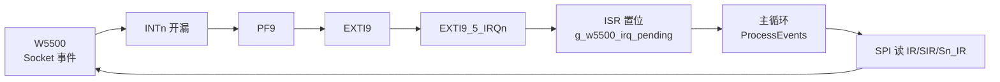
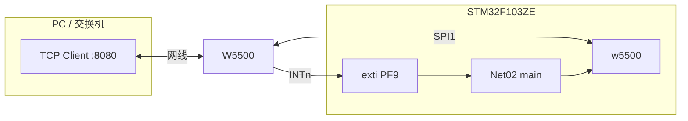
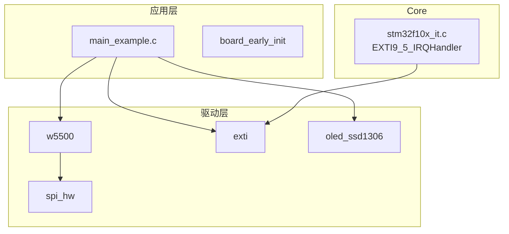
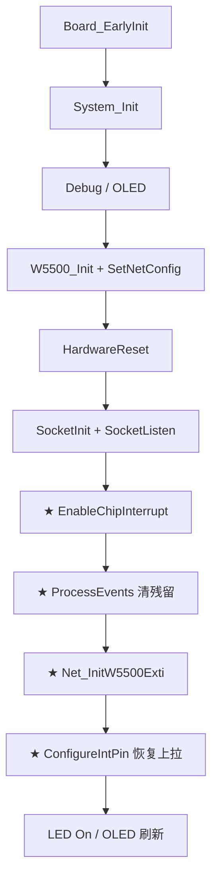
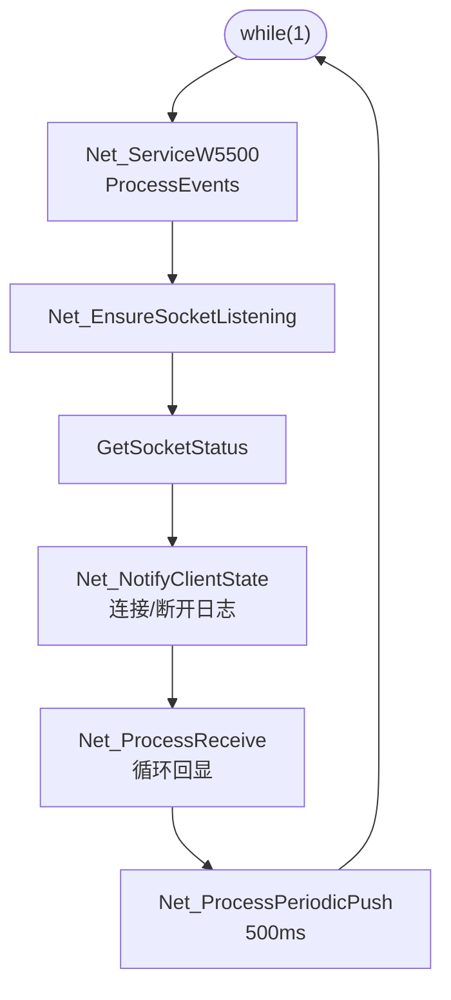
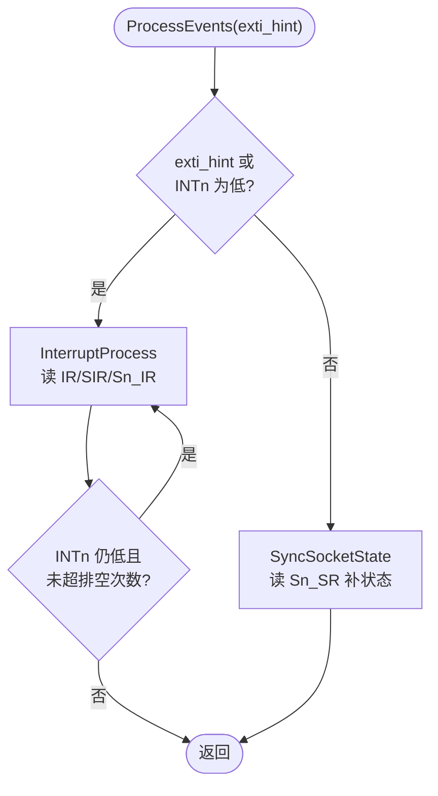
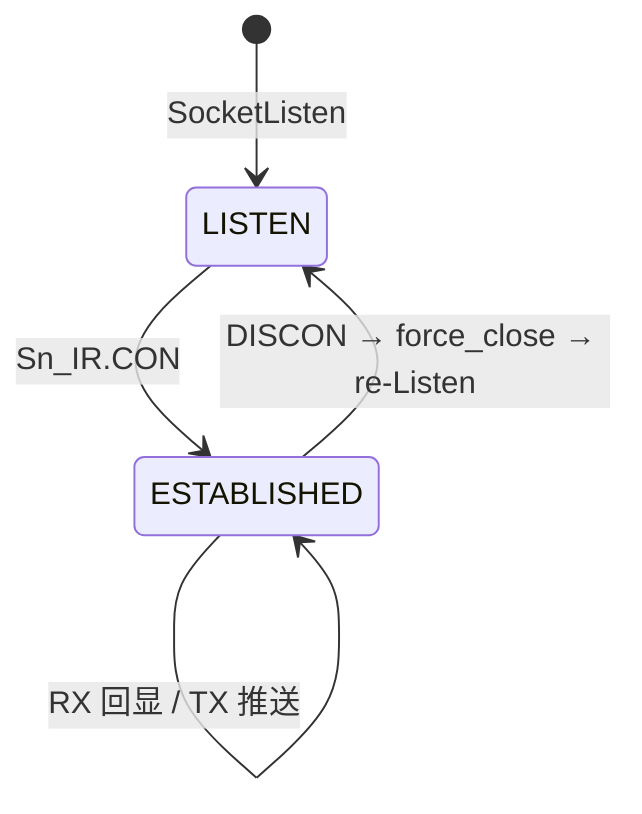

# Net02 - W5500 TCP Server EXTI 中断回显

小精灵 **STM32F103ZE** + **W5500**，TCP Server **8080**。在 [Net01](../Net01_W5500_Server_polling/README.md) 相同业务基础上，使用 **PF9 / EXTI9** 接收 W5500 中断提示，主循环通过 `W5500_ProcessEvents()` 处理 Socket 事件。

---

## 📋 案例目的

- 演示 W5500 **INTn + STM32 EXTI** 协作（非纯轮询）
- 验证 `W5500_EnableChipInterrupt()`、`W5500_ProcessEvents()`、`W5500_ConfigureIntPin()`
- 作为 Net 类 **EXTI 模式**模板（由 Net01 复制后增量修改）

---

## 🎯 功能特性

| 项目 | 说明 |
|------|------|
| 工作模式 | Socket0 **TCP Server**，端口 **8080** |
| IP | 静态 `192.168.101.201` / 网关 `.1` / 掩码 `255.255.255.0` |
| MAC | STM32 UID 算法（`0x02` 前缀） |
| 收包 | 客户端数据 **原样回显**（支持连续多包） |
| 推送 | 已连接每 **500ms** 发 `\r\nW5500 TCP Server OK\r\n` |
| 中断 | W5500 INTn → PF9 EXTI9；ISR 置标志 + INTn 电平排空 |
| 调试 | USART1 **115200** |
| 显示 | OLED 4 行；PC4 LED 常亮=运行 |

---

## 与 Net01 差异

| 对比项 | Net01 轮询 | Net02 EXTI |
|--------|------------|------------|
| 事件入口 | 每圈 `W5500_InterruptProcess()` | `W5500_ProcessEvents(exti_hint)` |
| PF9 INTn | 未接逻辑 | **EXTI9 双边沿** + 低电平检测 |
| `config.h` | `EXTI_ENABLED=0` | `EXTI_ENABLED=1` |
| `board.h` | 无 `EXTI_CONFIGS` | `EXTI_CONFIGS[9]` = PF9 |
| Keil 额外源文件 | — | `exti.c`、`stm32f10x_exti.c` |
| 初始化 | — | `EnableChipInterrupt` → `ProcessEvents` → EXTI → `ConfigureIntPin` |

**业务行为**（IP、端口、回显、500ms 推送、OLED、重 Listen）与 Net01 **一致**。

### 从 Net01 复制修改清单

| 文件 | 修改内容 |
|------|----------|
| `config.h` | `CONFIG_MODULE_EXTI_ENABLED = 1` |
| `board.h` | `#include "exti.h"`，增加 `EXTI_CONFIGS`（索引 9 = PF9） |
| `main_example.c` | EXTI 回调、`Net_InitW5500Exti()`、`Net_ServiceW5500()` |
| `Examples.uvprojx` | Target 改名，加入 `exti.c`、`stm32f10x_exti.c` |
| `README.md` | 本文档 |

---

## 🔧 硬件接线

### 引脚表

| 功能 | 引脚 | 说明 |
|------|------|------|
| W5500 SCLK / MISO / MOSI | **PB3 / PB4 / PB5** | SPI1 重映射 |
| W5500 SCSn | **PF11** | 软件 CS，低有效 |
| W5500 **INTn** | **PF9** | **EXTI9**，开漏低有效，模块侧通常带上拉 |
| W5500 RSTn | — | 模块上电复位 |
| OLED | **PB10 / PB11** | I2C2，50kHz |
| UART | **PA9 / PA10** | USART1 115200 |
| LED | **PC4** | 低电平亮 |

### 中断信号路径



```text
W5500 事件 → INTn↓ → EXTI9 → ISR 置标志 → 主循环 ProcessEvents → SPI 清中断 → INTn↑
```

### 系统拓扑



| 注意 | 说明 |
|------|------|
| JTAG | `Board_EarlyInit()` 释放 PB3/4/5 |
| INT 上拉 | EXTI 初始化会把 PF9 配为浮空，**必须**调用 `W5500_ConfigureIntPin()` |
| 网段 | PC 与板子同网段，如 `192.168.101.100` |

---

## 📦 模块与分层



| 模块 | 路径 | 用途 |
|------|------|------|
| `w5500` | `Drivers/network/w5500.c` | SPI、Socket、中断排空 |
| `exti` | `Drivers/peripheral/exti.c` | PF9 EXTI 配置 |
| `spi_hw` | `Drivers/spi/spi_hw.c` | SPI1 重映射 |
| `stm32f10x_it.c` | `Core/` | 共享向量 `EXTI9_5_IRQHandler` |

### 目录结构

```text
Net02_W5500_Server_EXTI/
├── main_example.c        # EXTI 回调、Net_ServiceW5500、业务逻辑
├── board.h               # W5500 + EXTI_CONFIGS[9]
├── config.h              # EXTI_ENABLED=1
├── board_early_init.c/h
├── Examples.uvprojx
├── keilkill.bat
└── README.md
```

---

## ⚙️ 配置说明

### 网络参数（`main_example.c`）

```c
#define NET_IP_ADDR             { 192, 168, 101, 201 }
#define NET_GATEWAY             { 192, 168, 101, 1 }
#define NET_SUBNET              { 255, 255, 255, 0 }
#define NET_TCP_PORT            8080U
#define NET_PUSH_INTERVAL_MS    500U
#define NET_GATEWAY_DETECT_EN   0U
```

### board.h — EXTI

```c
#define W5500_EXTI_LINE  EXTI_LINE_9

#define EXTI_CONFIGS { \
    /* [0]~[8] 禁用占位 ... */ \
    { EXTI_LINE_9, GPIOF, GPIO_Pin_9, EXTI_TRIGGER_RISING_FALLING, \
      EXTI_MODE_INTERRUPT, 1 }, \
}
```

> `EXTI_CONFIGS` 必须按**线索引**填写，`EXTI_LINE_9` 对应数组下标 **9**。

### config.h 要点

| 宏 | 值 |
|----|-----|
| `CONFIG_MODULE_W5500_ENABLED` | 1 |
| `CONFIG_MODULE_EXTI_ENABLED` | 1 |
| `CONFIG_MODULE_NVIC_ENABLED` | 1 |
| `CONFIG_MODULE_SPI_ENABLED` | 1 |

---

## 🔄 实现流程

### 上电初始化（Net02 特有步骤标 ★）



### 主循环（`Net_ProcessOnce`）



### `W5500_ProcessEvents` 逻辑



| 机制 | 作用 |
|------|------|
| EXTI 置标志 | 快速唤醒主循环 |
| INTn 电平检测 | 弥补电平保持期间无新下降沿 |
| 排空循环（最多 8 次） | 一次主循环处理多个背靠背事件 |
| `SyncSocketState` | 无中断时仍同步连接态，输出 `Client connected` 日志 |

### TCP 状态机



| Sn_SR | 值 | 软件表现 |
|-------|-----|----------|
| LISTEN | `0x14` | `Listen OK` |
| ESTABLISHED | `0x17` | `Client ON` |
| CLOSE_WAIT | `0x1C` | 触发 `re-Listen` |
| CLOSED | `0x00` | `flags=0` → `SocketListen` |

---

## 📺 OLED 显示

| 行 | 内容 |
|----|------|
| 1 | `Net02 W5500` |
| 2 | IP 地址 |
| 3 | `L:UP/DN P:8080` |
| 4 | `Listen OK` / `Client ON` |

连接/断开**仅刷新第 4 行**（16 字符空格填充）。

---

## 🚀 测试步骤

1. PC 静态 IP `192.168.101.x`，掩码 `255.255.255.0`
2. 网线连接，W5500 Link 灯亮
3. Keil 打开 `Examples.uvprojx`，Target 选 **Net02_W5500_Server_EXTI**，编译下载
4. 串口 115200，确认：
   - `W5500 version 0x04`
   - `TCP Server listening...`
   - `W5500 EXTI PF9 edge OK`
5. TCP Client 连接 `192.168.101.201:8080`
6. 发送数据 → 回显 + 约 500ms 周期问候
7. **断开再连** → 应出现 `Client disconnected` → `re-Listen` → `Client connected`

---

## 📝 串口日志参考

```text
[INFO ][MAIN] === Net02 W5500 TCP Server EXTI ===
[INFO ][NET] MAC 02:xx:xx:xx:xx:xx
[INFO ][NET] IP  192.168.101.201 port 8080
[INFO ][NET] W5500 version 0x04
[INFO ][NET] PHY link: UP
[INFO ][NET] TCP Server listening...
[INFO ][NET] W5500 EXTI PF9 edge OK
[INFO ][NET] Client connected
[INFO ][NET] RX 5 bytes, echo back
[INFO ][NET] Client disconnected
[INFO ][NET] Socket0 re-Listen :8080
```

---

## 🛠️ Keil 工程

| 项 | 值 |
|----|-----|
| 工程 | [`Examples.uvprojx`](Examples.uvprojx) |
| Target | `Net02_W5500_Server_EXTI` |
| 器件 | STM32F103ZE（`STM32F10X_HD`） |
| 较 Net01 新增 | `exti.c`、`stm32f10x_exti.c` |

编译报错 `ETH_WKUP_IRQn undefined`：已在本工程 `exti.c` 用 `#ifdef ETH_WKUP_IRQn` 修复（F103 HD 无以太网 MAC）。

---

## ❓ 常见问题

| 现象 | 原因 / 处理 |
|------|-------------|
| 能 Listen，无 `Client connected` | INTn 未处理；查 PF9 接线、`EnableChipInterrupt`、`ConfigureIntPin` |
| 第一次能连，第二次不能 | DISCON 未 `force_close`；使用含 `ProcessEvents` / `force_close` 的固件 |
| 有连接无回显 | `ProcessEvents` 未排空；查 INTn 是否一直为低 |
| `EXTI init fail` | `board.h` 的 `EXTI_CONFIGS[9]` 未启用或端口非 GPIOF |
| `init fail: -4606` | SPI、CS、JTAG、供电 |
| TCP 连不上 | 同网段、防火墙、PHY UP |
| OLED 雪花 | I2C 50kHz；减少全屏刷新 |
| 编译 `ETH_WKUP_IRQn` | 更新 `Drivers/peripheral/exti.c` |

### 关键 API 速查

| API | 调用时机 |
|-----|----------|
| `W5500_EnableChipInterrupt()` | `SocketListen` 成功后 |
| `W5500_ProcessEvents(hint)` | 主循环每圈 |
| `W5500_ConfigureIntPin()` | EXTI 初始化之后 |
| `EXTI_ClearPending(W5500_EXTI_LINE)` | EXTI 使能后清一次挂起 |

---

## 🔗 相关参考

- [Net 案例索引](../README.md)
- [Net03 TCP Client](../Net03_W5500_Client/README.md)
- [Net01 轮询版](../Net01_W5500_Server_polling/README.md)
- [`Drivers/network/README.md`](../../../Drivers/network/README.md) — 驱动 API 全文
- [`Drivers/network/w5500.h`](../../../Drivers/network/w5500.h) — 头文件

---

**最后更新**：2026-06-30
