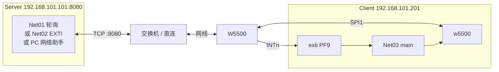
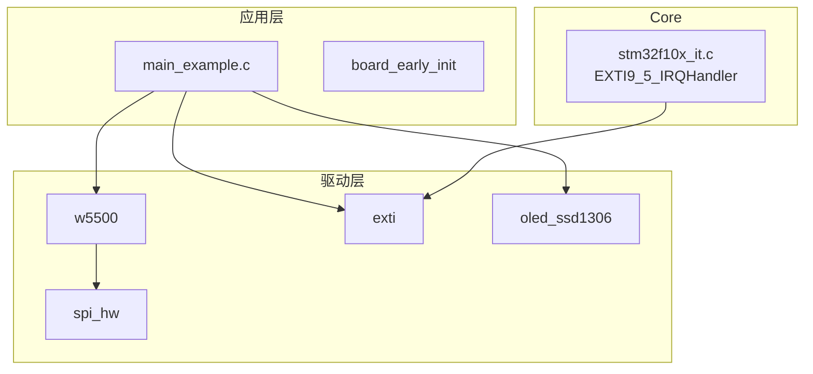
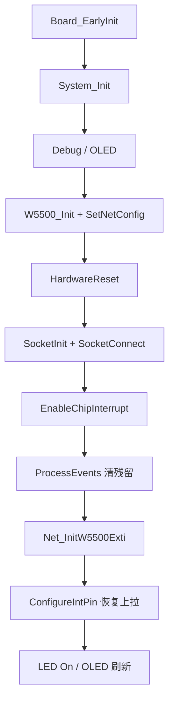
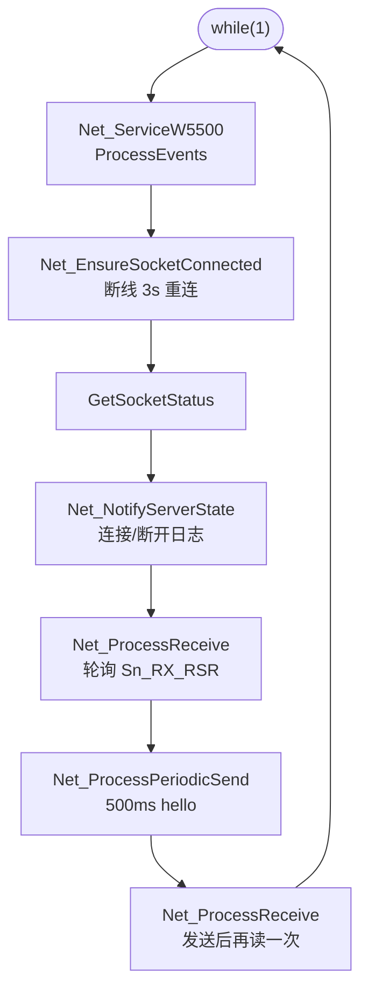
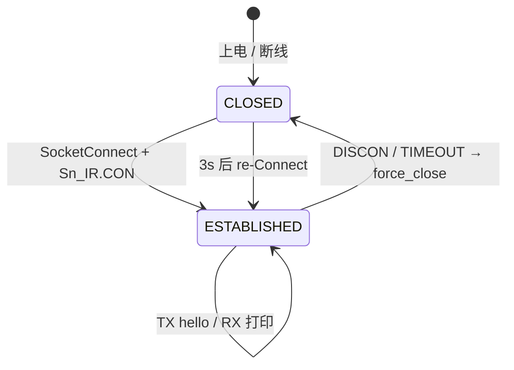

# Net03 - W5500 TCP Client EXTI

小精灵 **STM32F103ZE** + **W5500**，TCP **Client**，通过 EXTI 处理 Socket 事件。默认主动连接 Server **`192.168.101.101:8080`**，本机 IP **`192.168.101.201`**。

---

## 📋 案例目的

- 演示 W5500 **TCP Client** + `W5500_SocketConnect()`
- 与 Net02 相同 **EXTI 中断架构**（`W5500_ProcessEvents`）
- 演示断线后 **自动重连**（默认 3s 间隔）
- 演示 Client 侧 **周期发送 + 收包串口打印**（与 Net01/Net02 Server 联调）

---

## 🎯 功能特性

| 项目 | 说明 |
|------|------|
| 工作模式 | Socket0 **TCP Client**，主动连接远端 Server |
| 本机 IP | 静态 `192.168.101.201` / 网关 `.1` / 掩码 `255.255.255.0` |
| 目标 Server | `192.168.101.101:8080`（`main_example.c` 可改） |
| 本地端口 | `50000`（`SocketInit` 时绑定） |
| MAC | STM32 UID 算法（`0x02` 前缀，每片唯一） |
| 发送 | 已连接每 **500ms** 发 `\r\nW5500 TCP Client hello\r\n` |
| 接收 | 轮询 `Sn_RX_RSR`，原样打印到 **UART1**（115200） |
| 重连 | 断开后 **3s** 再 `SocketConnect`；拔网线由 `W5500_PhyMonitor` 立即恢复 |
| 中断 | W5500 INTn → PF9 EXTI9；`W5500_ProcessEvents(exti_hint)` |
| 调试 | USART1 **115200**（PA9/PA10） |
| 显示 | OLED 4 行；PC4 LED 常亮=运行 |

---

## 🔁 TCP 角色说明（Client / Server）

TCP 连接建立后（`ESTABLISHED`）为**全双工**：双方都能收发，差别只在**谁发起连接**。

| | **Server（Net01/Net02）** | **Client（Net03）** |
|--|---------------------------|---------------------|
| 连接方式 | `SocketListen` → 被动等待 | `SocketConnect` → 主动连对方 |
| 需要知道 | 本机 IP + 监听端口 | 本机 IP + **对方 IP/端口** |
| 连上之后 | `SocketRead` / `SocketWrite` | `SocketRead` / `SocketWrite` |

```text
Server：我在这等着（Listen）
Client：我去找你（Connect）
连上之后：两边都能发、都能收
```

> **注意**：Client 串口有 `TX` 日志、Server 能收到 hello，只说明 **Client→Server** 方向正常。要看到 **RX** 输出，**Server 必须向 Client 发数据**（Net01/Net02 会回显 + 周期推送；PC 网络助手需手动点发送）。

---

## 与 Net01 / Net02 差异

| 对比项 | Net01 轮询 Server | Net02 EXTI Server | **Net03 EXTI Client** |
|--------|-------------------|-------------------|------------------------|
| 角色 | `SocketListen` | `SocketListen` | **`SocketConnect`** |
| 本机 IP | `.201` | `.201` | **`.201`** |
| 断线恢复 | `re-Listen` | `re-Listen` | **`re-Connect`（3s）** |
| 周期任务 | Server 推送问候 | 同左 | **Client 主动发 hello** |
| 收包处理 | 回显给 Client | 回显 + 串口打印 | **串口打印（不回显）** |
| 事件入口 | `InterruptProcess` 每圈 | `ProcessEvents` | `ProcessEvents` |
| OLED 行4 | `Listen OK` / `Client ON` | 同左 | **`Connect...` / `Srv ON`** |

硬件、`board.h`、`config.h`、Keil 工程结构与 Net02 **相同**（仅 Target 名与 `main_example.c` 业务不同）。

### 从 Net02 复制修改清单

| 文件 | 修改内容 |
|------|----------|
| `main_example.c` | `SocketConnect`、目标 IP/端口、`Net_EnsureSocketConnected`、`Net_ProcessPeriodicSend`、`Net_ProcessReceive` |
| `board.h` | 注释改为 Client；引脚与 Net02 一致 |
| `Examples.uvprojx` | Target 改名为 `Net03_W5500_Client` |
| `README.md` | 本文档 |

---

## 🔧 硬件接线

与 [Net02](../Net02_W5500_Server_EXTI/README.md) **完全一致**。

### 引脚表

| 功能 | 引脚 | 说明 |
|------|------|------|
| W5500 SCLK / MISO / MOSI | **PB3 / PB4 / PB5** | SPI1 重映射 |
| W5500 SCSn | **PF11** | 软件 CS，低有效 |
| W5500 **INTn** | **PF9** | **EXTI9**，开漏低有效 |
| W5500 RSTn | — | 模块上电复位 |
| OLED | **PB10 / PB11** | I2C2，50kHz |
| UART | **PA9 / PA10** | USART1 115200 |
| LED | **PC4** | 低电平亮 |

### 联调拓扑



```text
Server(.101:8080) ←──TCP──→ W5500 ←SPI1─→ STM32 Net03(.201)
                                      ←UART1─→ 串口调试
```

| 注意 | 说明 |
|------|------|
| JTAG | `Board_EarlyInit()` 释放 PB3/4/5 |
| INT 上拉 | EXTI 初始化后须调用 `W5500_ConfigureIntPin()` |
| IP 冲突 | 本机 `.201` 与 PC 对端 `.101` 须不同 |
| 网段 | 各方须同网段，如 `192.168.101.x` |

---

## 📦 模块与分层



### 目录结构

```text
Net03_W5500_Client/
├── main_example.c        # Client 连接、发送、收包、重连
├── board.h               # W5500 + EXTI_CONFIGS[9]
├── config.h              # EXTI_ENABLED=1
├── board_early_init.c/h
├── Examples.uvprojx
├── keilkill.bat
└── README.md
```

---

## ⚙️ 配置说明

### 网络参数（`main_example.c`）

```c
#define NET_IP_ADDR             { 192, 168, 101, 201 }   /* 本机 IP */
#define NET_GATEWAY             { 192, 168, 101, 1 }
#define NET_SUBNET              { 255, 255, 255, 0 }
#define NET_SERVER_ADDR         { 192, 168, 101, 101 }   /* 目标 Server */
#define NET_SERVER_PORT         8080U
#define NET_LOCAL_PORT            50000U
#define NET_SEND_INTERVAL_MS    500U
#define NET_RECONNECT_MS        3000U
#define NET_RX_BUF_SIZE         1460U
#define NET_GATEWAY_DETECT_EN   0U
```

修改 Server 地址时，同时改 `NET_SERVER_ADDR` 与 `NET_SERVER_PORT`；若与 Net01/Net02 联调，Server 侧 IP 一般为 `.201`（非 `.101`），按实际环境修改。

### board.h — EXTI

```c
#define W5500_EXTI_LINE  EXTI_LINE_9

#define EXTI_CONFIGS { \
    /* [0]~[8] 禁用占位 ... */ \
    { EXTI_LINE_9, GPIOF, GPIO_Pin_9, EXTI_TRIGGER_RISING_FALLING, \
      EXTI_MODE_INTERRUPT, 1 }, \
}
```

### config.h 要点

| 宏 | 值 |
|----|-----|
| `CONFIG_MODULE_W5500_ENABLED` | 1 |
| `CONFIG_MODULE_EXTI_ENABLED` | 1 |
| `CONFIG_MODULE_NVIC_ENABLED` | 1 |
| `CONFIG_MODULE_SPI_ENABLED` | 1 |

---

## 🔄 实现流程

### 上电初始化



### 主循环（`Net_ProcessOnce`）



### 收包策略（`Net_ProcessReceive`）

| 机制 | 说明 |
|------|------|
| `W5500_SyncSocketState` | 读 `Sn_SR`，保证 `INIT+CONN` 与硬件一致 |
| 轮询 `Sn_RX_RSR` | **不依赖** `W5500_SOCK_EVT_RECEIVE` 软件事件，避免 EXTI 漏检 |
| `Net_UartDumpRx` | `LOG_INFO` 打印字节数 + `Debug_PutChar` 原样输出 + `\r\n` |
| RX 空闲提示 | 已连接但 10s 无收包时 `LOG_DEBUG` 提示 Server 需发数据 |

### TCP 状态机（Client 侧）



| Sn_SR | 值 | 软件表现 |
|-------|-----|----------|
| INIT | `0x13` | 正在连接，`Connect...` |
| ESTABLISHED | `0x17` | `Srv ON`，可收发 |
| CLOSE_WAIT | `0x1C` | 触发重连 |
| CLOSED | `0x00` | `Srv OFF`，3s 后 `SocketConnect` |

---

## 📺 OLED 显示

| 行 | 内容 |
|----|------|
| 1 | `Net03 Client` |
| 2 | 本机 IP（如 `192.168.101.201`） |
| 3 | 目标 Server IP（如 `S:192.168.101.101`） |
| 4 | `Connect...` / `Srv ON` / `Srv OFF` |

连接/断开**仅刷新第 4 行**（16 字符空格填充）。

---

## 🚀 测试步骤

### 场景 A：与 Net01 / Net02 联调（推荐）

1. **Server 板**烧录 Net01 或 Net02，IP 设为 `192.168.101.201`（或你规划的 Server IP），端口 `8080`
2. **Client 板**烧录 Net03，确认 `NET_SERVER_ADDR` 与 Server 实际 IP 一致
3. 网线、同网段交换机连接
4. Client 串口 115200，确认：
   - `W5500 version 0x04`
   - `TCP Client connecting x.x.x.x:8080`
   - `W5500 EXTI PF9 edge OK`
   - `Server connected`
5. 每 500ms 应见 `TX 27 bytes to server`；Server 串口应见 `RX ...` + hello 回显
6. Client 串口应见 Server **回显的 hello** 及 **周期推送** `W5500 TCP Server OK`

### 场景 B：PC 网络助手作 Server

1. PC 静态 IP 如 `192.168.101.101`，开 TCP Server 模式，端口 `8080`
2. Net03 的 `NET_SERVER_ADDR` 指向 PC IP
3. Client 连上后，PC 上应收到周期性 hello
4. **在 PC 发送区手动输入文字并发送** → Client 串口应打印 `RX n bytes from server:`

> PC 助手默认**只显示不收发回显**，不手动发送则 Client 无 RX 日志，属正常现象。

### 场景 C：断线重连（Server 断开）

1. 连接成功后关闭 Server 或断开 TCP
2. Client 串口：`Server disconnected`
3. 约 3s 后：`TCP Client connecting ...` 自动重连
4. Server 恢复后应再次出现 `Server connected`

### 场景 D：拔插网线

1. 连接成功后**拔网线** → `PHY link DOWN`，业务暂停
2. 等待期间每 5s：`waiting PHY link UP...`
3. **插回** → `PHY link UP, recover net` → `TCP Client connecting ...` → `Server connected`
4. 若 Server（Net01/02）仍在 Listen，应恢复 hello / RX

---

## 📝 串口日志参考

### 正常联调（Net01/Net02 作 Server）

```text
[INFO ][MAIN] === Net03 W5500 TCP Client EXTI ===
[INFO ][NET] MAC 02:xx:xx:xx:xx:xx
[INFO ][NET] IP  192.168.101.201
[INFO ][NET] Server 192.168.101.101:8080
[INFO ][NET] W5500 version 0x04
[INFO ][NET] PHY link: UP
[INFO ][NET] TCP Client connecting 192.168.101.101:8080
[INFO ][NET] W5500 EXTI PF9 edge OK
[INFO ][NET] Server connected
[INFO ][NET] TX 27 bytes to server
[INFO ][NET] RX 27 bytes from server:
\r\nW5500 TCP Client hello\r\n
[INFO ][NET] RX 24 bytes from server:
\r\nW5500 TCP Server OK\r\n
[INFO ][NET] TX 27 bytes to server
```

### 已连接但 Server 未发数据（PC 助手只收不发）

```text
[INFO ][NET] Server connected
[INFO ][NET] TX 27 bytes to server
[INFO ][NET] TX 27 bytes to server
[DEBUG][NET] RX idle: server must send data (use Net01/02 echo or PC tool reply)
```

### 断线重连

```text
[INFO ][NET] Server disconnected
[INFO ][NET] TCP Client connecting 192.168.101.101:8080
[INFO ][NET] Server connected
```

### 拔插网线

```text
[WARN ][NET] PHY link DOWN
[INFO ][NET] waiting PHY link UP...
[INFO ][NET] PHY link UP, recover net
[INFO ][NET] TCP Client connecting 192.168.101.101:8080
[INFO ][NET] Server connected
```

---

## ❓ 常见问题

| 现象 | 原因 / 处理 |
|------|-------------|
| 有 `TX`、Server 能收到 hello，但无 `RX` | **Server 未向 Client 发数据**；用 Net01/02 回显，或 PC 助手手动发送 |
| 一直 `Connect...`，无 `Server connected` | Server 未监听、IP/端口错误、防火墙、不同网段 |
| `Server connected` 后很快 `disconnected` | Server 主动断开、网线不稳、IP 冲突 |
| 完全无串口输出 | 查 UART1 接线、波特率 115200、`Net_InitDebug` 是否 FatalBlink |
| 有连接无 `TX` 日志 | `INIT+CONN` 未置位；查 `ProcessEvents`、`SyncSocketState` |
| `SocketConnect fail` | 目标不可达；确认 Server IP 与 `NET_SERVER_ADDR` 一致 |
| `init fail` / version 读失败 | SPI、CS、JTAG、W5500 供电与接线 |
| `EXTI init fail` | `board.h` 的 `EXTI_CONFIGS[9]` 未启用 |
| OLED 雪花 | I2C 50kHz；减少全屏刷新 |
| 拔网线插回无 `Server connected` | 确认 Server 仍在 Listen；查 `W5500_PhyMonitor_Process` |

### 拔插网线（`W5500_PhyMonitor`）

- 主循环 `W5500_PhyMonitor_Process()`；DOWN 时跳过收发
- `W5500_PhyMonitor_SetSocketWatch(..., W5500_PHY_WATCH_TCP_CONN, server_on)` 监视 TCP 连接
- 链路 DOWN / Socket 丢失 → 关 Socket；UP 后回调 `Net_StartTcpClient()` 主动重连

驱动说明见 [`Drivers/network/README.md`](../../../Drivers/network/README.md)。

### 关键 API 速查

| API | 调用时机 |
|-----|----------|
| `W5500_SocketConnect()` | 初始化及断线重连 |
| `W5500_SocketRead()` | 主循环轮询收包（读 `Sn_RX_RSR`） |
| `W5500_SocketWrite()` | 周期发送 hello |
| `W5500_ProcessEvents(hint)` | 主循环每圈 |
| `W5500_PhyMonitor_Process()` | 主循环每圈（拔插网线） |
| `W5500_SyncSocketState()` | 收包前同步 `Sn_SR` |
| `W5500_EnableChipInterrupt()` | `SocketConnect` 启动后 |
| `W5500_ConfigureIntPin()` | EXTI 初始化之后 |

---

## 🛠️ Keil 工程

| 项 | 值 |
|----|-----|
| 工程 | [`Examples.uvprojx`](Examples.uvprojx) |
| Target | `Net03_W5500_Client` |
| 器件 | STM32F103ZE（`STM32F10X_HD`） |
| 源文件 | 与 Net02 相同（含 `exti.c`、`stm32f10x_exti.c`） |

---

## 🔗 相关参考

- [Net02 Server EXTI](../Net02_W5500_Server_EXTI/README.md) — EXTI 模板、硬件接线
- [Net01 Server 轮询](../Net01_W5500_Server_polling/README.md) — 轮询 Server、联调 Server
- [`Drivers/network/README.md`](../../../Drivers/network/README.md) — 驱动 API
- [`Drivers/network/w5500.h`](../../../Drivers/network/w5500.h) — 头文件

---

**最后更新**：2026-06-30
