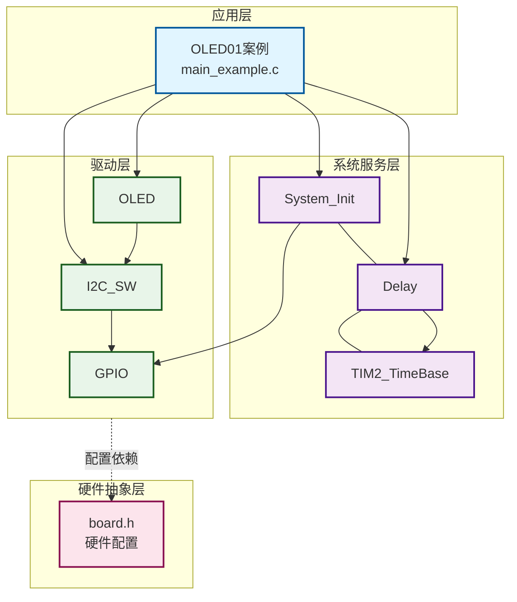
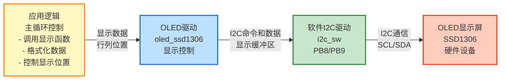
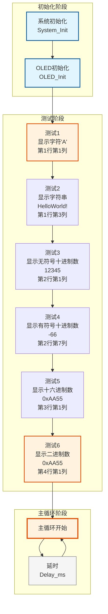

# OLED01 - OLED显示功能测试示例

## 📋 案例目的

- **核心目标**：测试OLED模块的各种显示功能，包括字符、字符串、数字等，演示OLED驱动的基本使用方法
- **学习重点**：
  - 理解OLED驱动模块的基本使用方法
  - 掌握OLED的各种显示函数（字符、字符串、数字等）
  - 学习OLED初始化和配置
  - 了解软件I2C接口的使用
  - 学习OLED显示格式和位置控制
- **应用场景**：适用于需要显示信息的应用，如状态显示、数据监控、用户界面等

## 🔧 硬件要求

### 必需外设

无（仅需要OLED显示屏）

### 传感器/模块

- **OLED显示屏**（SSD1306，I2C接口）
  - SCL：`PB8`
  - SDA：`PB9`
  - VCC：3.3V
  - GND：GND

### 硬件连接

| STM32F103C8T6 | OLED模块 | 说明 |
|--------------|---------|------|
| PB8 | SCL | I2C时钟线 |
| PB9 | SDA | I2C数据线 |
| 3.3V | VCC | 电源 |
| GND | GND | 地线 |

**⚠️ 重要提示**：
- 案例是独立工程，硬件配置在案例目录下的 `board.h` 中
- 如果硬件引脚不同，直接修改 `Examples/OLED/OLED01_helloword/board.h` 中的配置即可
- OLED使用软件I2C接口，需要配置I2C引脚和时序参数

### 硬件配置

**OLED I2C配置**（在 `board.h` 中）：
```c
/* OLED I2C配置 */
#define OLED_I2C_CONFIG {      \
    GPIOB,                     \
    GPIO_Pin_8, /* SCL: PB8 */ \
    GPIOB,                     \
    GPIO_Pin_9, /* SDA: PB9 */ \
}
```

**软件I2C配置**（在 `board.h` 中）：
```c
/* 软件I2C统一配置表 */
#define SOFT_I2C_CONFIGS {                                                                    \
    {GPIOB, GPIO_Pin_8, GPIOB, GPIO_Pin_9, 5, 1}, /* SoftI2C1：PB8(SCL), PB9(SDA)，5us延时，启用（OLED使用） */ \
}
```

**配置说明**：
- SCL和SDA引脚需要根据实际硬件修改
- I2C时序延时建议值：5-10us（标准模式），2-5us（快速模式）

## 📦 模块依赖

### 模块依赖关系图

展示本案例使用的模块及其依赖关系：



### 模块列表

本案例使用以下模块：

- `oled`：OLED显示驱动模块（核心功能）
- `i2c_sw`：软件I2C驱动模块（OLED使用）
- `gpio`：GPIO驱动模块（I2C依赖）
- `delay`：延时模块
- `system_init`：系统初始化模块
- `base_timer`：基时定时器模块（delay依赖）

## 🔄 实现流程

### 整体逻辑

本案例通过测试OLED模块的各种显示功能，演示OLED驱动的基本使用方法。程序分为六个测试阶段：

1. **测试1：显示字符**
   - 在第1行第1列显示字符'A'

2. **测试2：显示字符串**
   - 在第1行第3列显示字符串"HelloWorld!"

3. **测试3：显示无符号十进制数**
   - 在第2行第1列显示十进制数12345

4. **测试4：显示有符号十进制数**
   - 在第2行第7列显示有符号十进制数-66

5. **测试5：显示十六进制数**
   - 在第3行第1列显示十六进制数0xAA55

6. **测试6：显示二进制数**
   - 在第4行第1列显示二进制数0xAA55

### 关键方法

- **分阶段测试**：通过六个测试阶段，逐步演示不同显示函数的功能
- **位置控制**：通过行列参数控制显示位置
- **格式控制**：通过长度参数控制显示格式

### 数据流向图

展示本案例的数据流向：应用逻辑 → OLED驱动 → I2C通信 → OLED显示



**数据流说明**：

1. **应用逻辑**：
   - 主循环中调用OLED显示函数（OLED_ShowChar、OLED_ShowString等）
   - 格式化数据（字符、字符串、数字等）
   - 控制显示位置（行列坐标）

2. **OLED驱动**：
   - **OLED驱动模块**：封装SSD1306的显示控制，管理显示缓冲区
   - 将显示数据转换为I2C命令和数据包

3. **I2C通信**：
   - **软件I2C驱动**：实现I2C通信协议，通过GPIO模拟I2C时序
   - 发送命令和数据到OLED硬件

4. **输出设备**：
   - **OLED显示屏**：SSD1306硬件，显示字符、字符串、数字等信息

### 工作流程示意



## 📚 关键函数说明

### OLED相关函数

- **`OLED_Init()`**：初始化OLED显示屏
  - 在本案例中用于初始化OLED，为显示做准备
  - 必须在使用其他OLED函数前调用
  - 返回OLED_Status_t状态，需要检查是否成功

- **`OLED_ShowChar()`**：显示单个字符
  - 在本案例中用于在第1行第1列显示字符'A'
  - 参数：行号、列号、字符
  - 支持ASCII字符显示

- **`OLED_ShowString()`**：显示字符串
  - 在本案例中用于在第1行第3列显示字符串"HelloWorld!"
  - 参数：行号、列号、字符串指针
  - 自动处理字符串结束符

- **`OLED_ShowNum()`**：显示无符号十进制数
  - 在本案例中用于在第2行第1列显示十进制数12345
  - 参数：行号、列号、数字、显示长度
  - 支持0~4294967295范围

- **`OLED_ShowSignedNum()`**：显示有符号十进制数
  - 在本案例中用于在第2行第7列显示有符号十进制数-66
  - 参数：行号、列号、数字、显示长度
  - 支持负数显示，自动添加负号

- **`OLED_ShowHexNum()`**：显示十六进制数
  - 在本案例中用于在第3行第1列显示十六进制数0xAA55
  - 参数：行号、列号、数字、显示长度
  - 自动添加"0x"前缀

- **`OLED_ShowBinNum()`**：显示二进制数
  - 在本案例中用于在第4行第1列显示二进制数0xAA55
  - 参数：行号、列号、数字、显示长度
  - 以二进制格式显示

- **`OLED_Clear()`**：清屏函数
  - 在本案例中用于清除屏幕内容（如果需要）
  - 清除所有显示内容

### 系统初始化函数

- **`System_Init()`**：系统初始化函数
  - 在本案例中用于初始化SysTick延时模块
  - 自动初始化所有enabled=1的模块

**详细函数实现和调用示例请参考**：`main_example.c` 中的代码

## ⚠️ 注意事项与重点

### ⚠️ 重要提示

1. **硬件配置**：
   - 案例是独立工程，硬件配置在案例目录下的 `board.h` 中
   - 如果硬件引脚不同，需要修改 `board.h` 中的配置

2. **I2C连接**：
   - OLED使用软件I2C接口，需要正确配置SCL和SDA引脚
   - 确保I2C时序延时参数正确（建议5-10us）

3. **OLED初始化**：
   - 必须检查OLED_Init()的返回值
   - 如果初始化失败，程序会进入死循环

4. **显示位置**：
   - OLED屏幕分为4行，每行16个字符
   - 行号范围：1-4，列号范围：1-16
   - 超出范围可能导致显示异常

5. **显示格式**：
   - 数字显示长度参数控制显示的字符数
   - 如果数字位数少于显示长度，会在前面补0或空格

### 🔑 关键点

1. **显示函数选择**：
   - 字符：使用OLED_ShowChar()
   - 字符串：使用OLED_ShowString()
   - 无符号数：使用OLED_ShowNum()
   - 有符号数：使用OLED_ShowSignedNum()
   - 十六进制：使用OLED_ShowHexNum()
   - 二进制：使用OLED_ShowBinNum()

2. **位置控制**：
   - 通过行列参数精确控制显示位置
   - 注意不要超出屏幕范围

3. **格式控制**：
   - 通过长度参数控制显示格式
   - 数字显示会自动格式化

### 💡 调试技巧

1. **OLED不显示排查**：
   - 检查I2C连接是否正确（SCL: PB8, SDA: PB9）
   - 检查软件I2C模块是否已启用（`CONFIG_MODULE_SOFT_I2C_ENABLED = 1`）
   - 检查OLED模块是否已启用（`CONFIG_MODULE_OLED_ENABLED = 1`）
   - 检查I2C时序延时参数是否正确

2. **显示异常排查**：
   - 检查显示位置是否超出范围
   - 检查显示长度参数是否正确
   - 检查字符串是否以'\0'结尾

3. **初始化失败排查**：
   - 检查I2C通信是否正常
   - 检查OLED模块是否正确连接
   - 使用示波器检查I2C信号

## 💡 扩展练习

### 循序渐进理解本案例

1. **修改显示内容**：尝试显示不同的字符、字符串、数字，观察显示效果的变化，理解OLED显示的基本功能
2. **修改显示位置**：尝试在不同的位置显示内容，观察位置控制的效果，理解OLED坐标系统
3. **组合显示**：在同一行显示多个内容，实现更复杂的显示格式，理解OLED显示的组合使用

### 实际场景中的常见坑点

4. **显示刷新频率问题**：如果频繁刷新OLED显示，可能导致I2C通信阻塞，影响程序实时性。如何优化显示刷新策略？如何实现局部刷新（只更新变化的部分）？
5. **I2C通信失败处理**：如果OLED的I2C通信失败（如设备未连接、通信干扰等），可能导致程序卡死。如何检测和处理I2C通信失败？如何实现通信重试机制？
6. **多行显示协调**：当需要同时更新多行显示时，如何保证显示的一致性？如何处理显示更新冲突？如何实现显示缓冲和批量更新？
   - 使用多个显示函数组合

6. **多行显示**：
   - 在多个行显示不同的内容
   - 实现多行信息显示界面

## 📖 相关文档

- **模块文档**：
  - **OLED驱动**：`../../Drivers/display/oled_ssd1306.c/h`
  - **OLED字库**：`../../Drivers/display/oled_font_ascii8x16.c/h`
  - **软件I2C驱动**：`../../Drivers/i2c/i2c_sw.c/h`
  - **GPIO驱动**：`../../Drivers/basic/gpio.c/h`
  - **延时功能**：`../../system/delay.c/h`

- **业务文档**：
  - **主程序代码**：`main_example.c`
  - **硬件配置**：`board.h`
  - **模块配置**：`config.h`
  - **项目规范文档**：`../../AI/README.md`（AI规则体系）
  - **案例参考**：`Examples/README.md`
- **系统初始化**：`../../system/system_init.c/h`
- **基时定时器**：`../../Drivers/timer/TIM2_TimeBase.c/h`
- **硬件配置**：案例目录下的 `board.h`
- **模块配置**：案例目录下的 `config.h`
