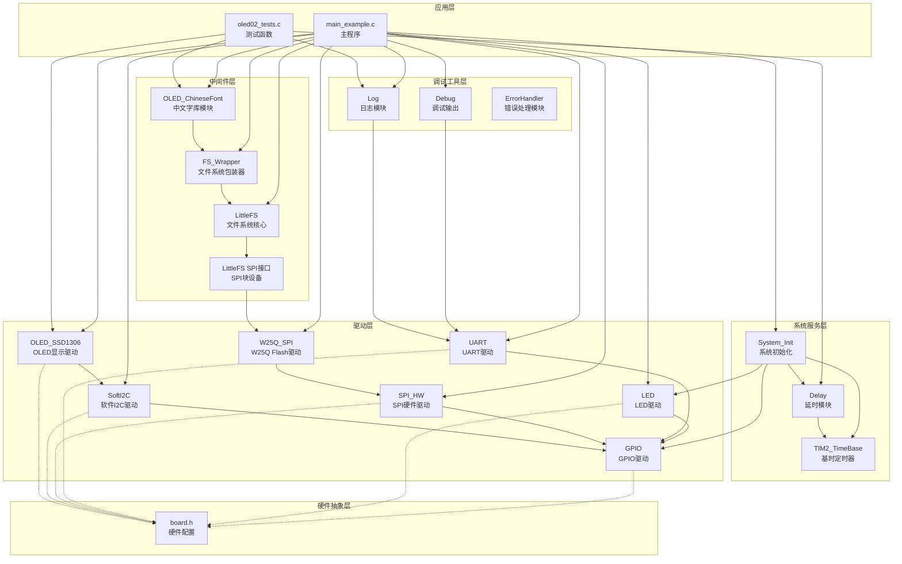

# OLED02 - 中文OLED显示示例

## 📋 案例目的

### 核心目标

演示如何在OLED上显示中文，通过自动循环15种不同的显示方法，找到正确的字模数据解析方式，最终实现正确的中文显示。

### 核心功能

1. **自动循环显示方法**：每3秒自动切换一种显示方法（方法1-15），循环演示
2. **方法编号显示**：第1行显示当前方法编号（Method: 1-15），第2行显示方法名称
3. **中文显示测试**：第3-4行显示"中文显示"四个字符，用于验证显示效果
4. **字模数据解析**：支持15种不同的字模数据解析方式（按行/按列存储、字节顺序、位顺序等组合）
5. **文件系统字库**：ASCII字符和中文字符均从文件系统读取（`/font/ASCII16.bin`和`/font/chinese16x16.bin`）
6. **默认方法1**：默认使用方法1显示中文（已确认正确，是原方法4的左右翻转版本）

### 学习重点

- 掌握中文字库的初始化方法
- 理解GB2312编码的使用
- 学习字模数据格式的解析方法（按行/按列存储、字节顺序、位顺序）
- 理解OLED页寻址模式下的数据发送方式
- 掌握单个中文字符的显示方法

### 应用场景

适用于需要显示中文信息的应用，如中文菜单系统、中文参数显示、中文状态提示、中文日志显示等场景。

## 🔧 硬件要求

### 必需外设

- **LED1**：连接到 `PA1`（系统状态指示）

### 传感器/模块

#### W25Q SPI Flash模块（存储中文字库）

| 引脚 | STM32连接 | 说明 |
|------|-----------|------|
| CS | PA11 | 片选信号（软件NSS模式，SPI2） |
| SCK | PB13 | SPI2时钟信号 |
| MISO | PB14 | SPI2主入从出（数据接收） |
| MOSI | PB15 | SPI2主出从入（数据发送） |
| VCC | 3.3V | **⚠️ 重要：必须使用3.3V，不能使用5V！** |
| GND | GND | 电源地 |

**⚠️ 重要提示**：
- W25Q系列Flash使用3.3V供电，使用5V会损坏芯片
- CS引脚使用软件NSS模式，由软件控制拉低/拉高
- 确保电源稳定，避免写入过程中断电

#### OLED显示屏（软件I2C接口）

| 引脚 | STM32连接 | 说明 |
|------|-----------|------|
| SCL | PB8 | 软件I2C时钟线 |
| SDA | PB9 | 软件I2C数据线 |
| VCC | 3.3V | 电源 |
| GND | GND | 电源地 |

#### UART1（用于详细日志输出）

| 引脚 | STM32连接 | 说明 |
|------|-----------|------|
| TX | PA9 | UART1发送 |
| RX | PA10 | UART1接收 |
| 波特率 | 115200 | 串口通信波特率 |

**连接说明**：将UART1连接到USB转串口模块，用于查看详细日志输出。

## 📦 模块依赖

### 模块依赖关系图

### 模块列表

| 模块 | 说明 | 用途 |
|------|------|------|
| System_Init | 系统初始化 | 初始化系统基础模块 |
| Delay | 延时模块 | 提供延时功能 |
| TIM2_TimeBase | 基时定时器 | Delay模块依赖 |
| GPIO | GPIO驱动 | LED、SPI、I2C、UART依赖 |
| LED | LED驱动 | 系统状态指示 |
| SPI_HW | SPI硬件驱动 | W25Q通信接口（SPI2） |
| W25Q_SPI | W25Q Flash驱动 | Flash存储设备（存储字库） |
| SoftI2C | 软件I2C驱动 | OLED通信接口 |
| OLED_SSD1306 | OLED显示驱动 | 状态显示和中文显示 |
| UART | UART驱动 | 串口日志输出 |
| LittleFS | LittleFS文件系统 | 文件系统核心 |
| LittleFS SPI接口 | LittleFS SPI块设备 | W25Q与LittleFS桥接 |
| FS_Wrapper | 文件系统包装器 | 文件系统应用层接口 |
| OLED_AsciiFont | ASCII字库模块 | ASCII字库读取和显示（文件系统字库，仅OLED02使用） |
| OLED_ChineseFont | 中文字库模块 | 中文字库读取和显示 |
| Debug | Debug模块 | 调试输出 |
| Log | 日志模块 | 日志记录 |
| ErrorHandler | 错误处理模块 | 错误处理 |

## 🔄 实现流程

### 整体逻辑

本案例通过自动循环15种不同的显示方法，演示OLED中文显示功能。程序执行分为以下几个阶段：

1. **系统初始化阶段**：
   - 调用`System_Init()`初始化系统基础模块（GPIO、LED、delay、TIM2）
   - 初始化UART1用于串口日志输出
   - 初始化Debug和Log模块
   - 初始化软件I2C和OLED用于状态显示
   - 初始化SPI2和W25Q模块
   - 初始化LittleFS文件系统
   - 初始化FS_Wrapper文件系统包装器

2. **ASCII字库初始化**：
   - 调用`OLED_AsciiFont_Init()`初始化ASCII字库模块
   - 从文件系统读取`/font/ASCII16.bin`字库文件
   - 如果字库未初始化，英文显示会失败

3. **中文字库初始化**：
   - 调用`OLED_ChineseFont_Init()`初始化中文字库模块
   - 从文件系统读取`/font/chinese16x16.bin`字库文件
   - 验证字库文件是否存在和可读
   - 如果字库未初始化，程序会停止并提示错误

4. **自动循环演示阶段**：
   - 进入`test1_single_chinese_char()`函数
   - 每3秒自动切换一种显示方法（方法1-15）
   - 第1行显示当前方法编号（Method: 1-15）
   - 第2行显示方法名称（自动更新）
   - 第3-4行显示"中文显示"四个字符
   - 默认使用方法1（已确认正确，是原方法4的左右翻转版本）

### 数据流向图

```mermaid
flowchart LR
    subgraph "存储层"
        W25Q["W25Q Flash<br/>字库文件存储"]
    end
    
    subgraph "文件系统层"
        LITTLEFS["LittleFS<br/>文件系统"]
        FS_WRAPPER["FS_Wrapper<br/>文件系统接口"]
    end
    
    subgraph "字库模块"
        FONT_READ["OLED_ChineseFont_GetData<br/>读取字模数据"]
        FONT_DATA["字模数据<br/>32字节"]
    end
    
    subgraph "显示处理"
        METHOD_SELECT["方法选择<br/>1-15种解析方式"]
        DATA_PARSE["字模数据解析<br/>按行/按列/字节/位顺序"]
        PAGE_DATA["页数据<br/>8位×16列"]
    end
    
    subgraph "OLED驱动"
        SET_CURSOR["OLED_SetCursor<br/>设置光标位置"]
        WRITE_DATA["OLED_WriteData<br/>写入显示数据"]
    end
    
    subgraph "硬件层"
        OLED["OLED显示屏<br/>128×64像素"]
    end
    
    W25Q -->|读取字库文件| LITTLEFS
    LITTLEFS -->|文件系统接口| FS_WRAPPER
    FS_WRAPPER -->|读取字模数据| FONT_READ
    FONT_READ -->|32字节字模| FONT_DATA
    FONT_DATA -->|输入| METHOD_SELECT
    METHOD_SELECT -->|选择解析方式| DATA_PARSE
    DATA_PARSE -->|解析后数据| PAGE_DATA
    PAGE_DATA -->|页数据| SET_CURSOR
    SET_CURSOR -->|设置位置| WRITE_DATA
    WRITE_DATA -->|显示数据| OLED
```

### 关键方法

1. **字模数据格式解析**：
   - **按行存储**：32字节 = 16行 × 2字节（每行：左字节+右字节）
   - **按列存储**：32字节 = 16列 × 2字节（每列：页0字节+页1字节）
   - **字节顺序**：正常顺序或反转顺序
   - **位顺序**：正常顺序或反转顺序
   - **组合方式**：15种不同的组合方式

2. **OLED页寻址模式**：
   - OLED使用页寻址模式，每页8行
   - 16×16点阵字符需要2页（页0和页1）
   - 每页需要发送16列数据（每列8位）

3. **自动循环机制**：
   - 使用静态变量存储当前方法编号
   - 使用定时器每3秒切换一次方法
   - 方法切换时自动清除第1行并更新方法编号显示

4. **方法编号说明**（已重新排序）：
   - **方法1**：原方法15，是原方法4的左右翻转版本（默认方法，已确认正确）
   - **方法2**：原方法7
   - **方法3**：原方法14，完整字符左右翻转
   - **方法4**：原方法11
   - **方法5**：原方法12
   - **方法6-15**：原方法6、8、9、10、13、1、2、3、4、5（按顺序排列）

5. **方法1（默认方法，已确认正确）**：
   - 原方法4的基础上增加反转列顺序
   - 实现完整字符的左右翻转
   - 可以正确显示中文

### 工作流程示意图

```mermaid
flowchart TD
    START([程序启动]) --> SYS_INIT[系统初始化 System_Init]
    SYS_INIT --> UART_INIT[UART初始化 UART_Init]
    UART_INIT --> DEBUG_INIT[Debug初始化 Debug_Init]
    DEBUG_INIT --> LOG_INIT[Log初始化 Log_Init]
    LOG_INIT --> LED_INIT[LED初始化 LED_Init]
    LED_INIT --> I2C_INIT[软件I2C初始化 I2C_SW_Init]
    I2C_INIT --> OLED_INIT[OLED初始化 OLED_Init]
    OLED_INIT --> SPI_INIT[SPI2初始化 SPI_HW_Init]
    SPI_INIT --> W25Q_INIT[W25Q初始化 W25Q_Init]
    W25Q_INIT --> LITTLEFS_INIT[LittleFS初始化 LittleFS_Init]
    LITTLEFS_INIT --> FS_INIT[FS_Wrapper初始化 FS_Init]
    FS_INIT --> FONT_INIT[中文字库初始化 OLED_ChineseFont_Init]
    
    FONT_INIT -->|初始化成功| TEST_START[开始测试 test1_single_chinese_char]
    FONT_INIT -->|初始化失败| ERROR_STOP[显示错误并停止]
    
    TEST_START --> CLEAR_SCREEN[清除屏幕 OLED_Clear]
    CLEAR_SCREEN --> SHOW_METHOD_INIT[显示初始方法编号 Method: 1]
    SHOW_METHOD_INIT --> LOOP_START[进入主循环]
    
    LOOP_START --> CHECK_TIMER{检查定时器<br/>是否超过3秒?}
    CHECK_TIMER -->|否| DISPLAY_CHAR[显示中文字符<br/>中文显示]
    CHECK_TIMER -->|是| SWITCH_METHOD[切换方法<br/>方法编号+1]
    
    SWITCH_METHOD --> CLEAR_LINE1[清除第1行所有像素]
    CLEAR_LINE1 --> UPDATE_METHOD[更新方法编号显示]
    UPDATE_METHOD --> DISPLAY_CHAR
    
    DISPLAY_CHAR --> GET_FONT_DATA[获取字模数据<br/>OLED_ChineseFont_GetData]
    GET_FONT_DATA --> SELECT_METHOD[选择显示方法<br/>1-15]
    SELECT_METHOD --> PARSE_DATA[解析字模数据<br/>按方法解析]
    PARSE_DATA --> SEND_PAGE0[发送页0数据<br/>OLED_WriteData]
    SEND_PAGE0 --> SEND_PAGE1[发送页1数据<br/>OLED_WriteData]
    SEND_PAGE1 --> DELAY_200MS[延时200ms]
    DELAY_200MS --> LOOP_START
    
    ERROR_STOP --> END_STOP([程序停止])
    
    %% 样式
    style START fill:#e1f5ff,stroke:#01579b,stroke-width:2px
    style SYS_INIT fill:#f3e5f5,stroke:#4a148c,stroke-width:2px
    style W25Q_INIT fill:#c8e6c9,stroke:#2e7d32,stroke-width:2px
    style LITTLEFS_INIT fill:#fff9c4,stroke:#f57f17,stroke-width:2px
    style FONT_INIT fill:#ffccbc,stroke:#d84315,stroke-width:2px
    style TEST_START fill:#fff3e0,stroke:#e65100,stroke-width:2px
    style LOOP_START fill:#e1f5ff,stroke:#01579b,stroke-width:2px
    style CHECK_TIMER fill:#fff9c4,stroke:#f57f17,stroke-width:2px
    style SELECT_METHOD fill:#ffccbc,stroke:#d84315,stroke-width:2px
    style ERROR_STOP fill:#ffcdd2,stroke:#c62828,stroke-width:2px
    style END_STOP fill:#ffcdd2,stroke:#c62828,stroke-width:2px
```

## 📚 关键函数说明

### ASCII字库相关函数

- **`OLED_AsciiFont_Init()`**：初始化ASCII字库模块
  - 在本案例中用于初始化ASCII字库，从文件系统读取`/font/ASCII16.bin`
  - 需要先初始化文件系统
  - 如果字库文件不存在，返回错误（英文显示会失败）

- **`OLED_AsciiFont_GetIndex()`**：获取字符在字库中的索引
  - 在本案例中用于计算ASCII字符的索引（0-95）
  - 参数：字符（char）、索引指针（uint8_t*）
  - 返回：`OLED_ASCII_FONT_OK`表示成功

- **`OLED_AsciiFont_GetData()`**：获取指定索引的字符字模数据
  - 在本案例中用于从文件系统读取字模数据（16字节，8×16点阵）
  - 参数：字符索引（uint8_t）、字模数据缓冲区（16字节）
  - 返回：`OLED_ASCII_FONT_OK`表示成功

### 中文字库相关函数

- **`OLED_ChineseFont_Init()`**：初始化中文字库模块
  - 在本案例中用于初始化中文字库，从文件系统读取`/font/chinese16x16.bin`
  - 需要先初始化文件系统
  - 如果字库文件不存在，返回错误并停止程序

- **`OLED_ChineseFont_GetData()`**：获取指定GB2312编码的字符字模数据
  - 在本案例中用于从W25Q Flash读取字模数据（32字节）
  - 参数：GB2312编码（双字节）、字模数据缓冲区（32字节）
  - 返回：`OLED_CHINESE_FONT_OK`表示成功

### OLED中文显示函数

- **`OLED_ShowChar()`**：显示单个ASCII字符（8×16点阵）
  - 在本案例中用于显示方法编号和英文提示信息
  - 参数：行号（1~4）、列号（1~16）、字符（char）
  - 内部实现：从文件系统读取`/font/ASCII16.bin`字库数据
  - 注意：OLED02使用文件系统ASCII字库，其他案例使用内置ASCII字库

- **`OLED_ShowChineseChar()`**：显示单个中文字符（16×16点阵）
  - 在本案例中用于显示"中文显示"四个字符
  - 参数：行号（1~4）、列号（1~8，中文字符占用2列）、GB2312编码（双字节）
  - 内部实现：支持15种不同的字模数据解析方式，通过`OLED_CHINESE_METHOD_AUTO_CYCLE`宏启用自动循环
  - 自动循环模式：每3秒切换一次方法（方法1-15），方法切换时自动更新第1行的方法编号显示
  - 默认使用方法1（已确认正确，是原方法4的左右翻转版本）

### 文件系统相关函数

- **`FS_Init()`**：初始化文件系统包装器
  - 在本案例中用于初始化文件系统，为字库读取提供文件系统接口
  - 需要先初始化W25Q和LittleFS
  - 会自动挂载文件系统

### 延时相关函数

- **`Delay_GetTick()`**：获取当前系统时钟计数
  - 在本案例中用于实现自动循环定时器
  - 返回：系统时钟计数（毫秒）

- **`Delay_GetElapsed()`**：计算经过的时间
  - 在本案例中用于判断是否超过3秒，决定是否切换方法
  - 参数：当前时钟计数、上次时钟计数
  - 返回：经过的时间（毫秒）

**详细函数实现和调用示例请参考**：`main_example.c` 和 `oled02_tests.c` 中的代码

## ⚠️ 注意事项与重点

### ⚠️ 重要提示

1. **前置条件**：
   - **必须先运行Flash13案例上传字库文件**
   - **ASCII字库文件路径**：`/font/ASCII16.bin`（8×16点阵，1536字节，96个字符）
   - **中文字库文件路径**：`/font/chinese16x16.bin`（16×16点阵，约261KB，完整GB2312字符集）
   - 如果字库文件不存在，程序会停止并提示错误
   - **注意**：OLED02使用文件系统ASCII字库，其他案例使用内置ASCII字库

2. **GB2312编码**：
   - 显示中文需要使用GB2312编码
   - 字符"中"的GB2312编码：`0xD6D0`
   - 字符"文"的GB2312编码：`0xCEC4`
   - 字符"显"的GB2312编码：`0xCFD4`
   - 字符"示"的GB2312编码：`0xCABE`

3. **字符布局**：
   - ASCII字符：8×16点阵，占用1列（8像素宽度）
   - 中文字符：16×16点阵，占用2列（16像素宽度）
   - OLED显示区域：128×64像素，可显示4行
   - 纯ASCII：每行16个字符
   - 纯中文：每行8个字符

4. **字库文件**：
   - **ASCII字库**：`/font/ASCII16.bin`，8×16点阵，1536字节（96个字符：空格到波浪号）
   - **中文字库**：`/font/chinese16x16.bin`，16×16点阵，约261KB（完整GB2312字符集）
   - 字库文件存储在W25Q Flash的`/font`目录下
   - 可以使用`Tools/send_ASCII_font.py`上传ASCII字库
   - 可以使用`Tools/send_chinese_font.py`上传中文字库

5. **初始化顺序**：
   - 必须先初始化W25Q和LittleFS
   - 然后初始化FS_Wrapper
   - 接着初始化ASCII字库模块（`OLED_AsciiFont_Init()`）
   - 最后初始化中文字库模块（`OLED_ChineseFont_Init()`）
   - 如果顺序错误，会导致初始化失败

### 🔑 关键点

1. **字模数据格式**：
   - 字模数据为32字节（16×16点阵）
   - 可能按行存储或按列存储
   - 字节顺序和位顺序可能不同
   - 需要尝试不同的解析方式找到正确的方法

2. **显示方法选择**：
   - 方法1-15：不同的字模数据解析方式（已重新排序）
   - **方法1**：默认方法，已确认可以正确显示中文（原方法4的左右翻转版本）
   - **方法2-15**：其他解析方式，可通过自动循环测试查看效果
   - 可以通过`OLED_CHINESE_METHOD_AUTO_CYCLE`宏启用自动循环测试
   - 可以通过`METHOD_NUM`宏固定使用特定方法

3. **自动循环机制**：
   - 使用静态变量存储当前方法编号
   - 使用定时器每3秒切换一次方法
   - 方法切换时自动清除第1行并更新方法编号显示
   - 第1行保留用于显示方法编号，禁止显示中文字符

4. **显示性能**：
   - 中文字符需要从W25Q Flash读取字模数据
   - 每次显示字符都会读取32字节数据
   - 可以启用字模缓存提升性能（默认禁用以节省RAM）

5. **错误处理**：
   - 如果字库未初始化，所有中文显示函数会返回错误
   - 程序会检查字库初始化状态并提示错误
   - 建议在显示中文前检查字库是否已初始化

## 🔍 常见问题排查

### 问题1：字库初始化失败

**现象**：OLED显示 "Font Init Fail" 和错误码

**可能原因**：
- 字库文件未上传（未运行Flash13案例）
- 字库文件路径错误
- 文件系统未初始化
- W25Q Flash故障

**解决方法**：
1. 先运行Flash13案例上传ASCII字库（`/font/ASCII16.bin`）和中文字库（`/font/chinese16x16.bin`）
2. 或使用`Tools/send_ASCII_font.py`上传ASCII字库
3. 或使用`Tools/send_chinese_font.py`上传中文字库
4. 检查文件系统是否初始化成功
5. 检查W25Q Flash是否正常工作
6. 使用串口查看详细错误信息

### 问题2：中文显示乱码或不显示

**现象**：OLED显示乱码或空白

**可能原因**：
- GB2312编码错误
- 字库文件损坏
- 字库文件格式不正确
- 显示方法选择错误

**解决方法**：
1. 确认ASCII字库（`/font/ASCII16.bin`）和中文字库（`/font/chinese16x16.bin`）上传成功
2. 检查GB2312编码是否正确
3. 使用自动循环功能测试所有15种方法
4. 确认使用方法1（默认方法，已确认正确）
5. 重新上传字库文件

### 问题3：方法编号显示异常

**现象**：第1行的方法编号后面有残留的中文字符

**可能原因**：
- 方法切换时清除不彻底
- 中文字符被显示在第1行

**解决方法**：
1. 代码已实现清除第1行所有像素的逻辑
2. 代码已禁止在第1行显示中文字符
3. 如果仍有问题，检查清除逻辑是否正确执行

### 问题4：自动循环不工作

**现象**：方法不自动切换，一直显示方法1

**可能原因**：
- `OLED_CHINESE_METHOD_AUTO_CYCLE`宏未定义
- 定时器逻辑错误
- 方法切换条件未满足

**解决方法**：
1. 检查`config.h`中是否定义了`OLED_CHINESE_METHOD_AUTO_CYCLE`
2. 检查定时器逻辑是否正确
3. 使用串口查看日志，确认方法切换逻辑是否执行

### 问题5：文件系统初始化失败

**现象**：OLED显示 "FS Init Fail"

**可能原因**：
- W25Q未初始化
- LittleFS初始化失败
- SPI通信错误

**解决方法**：
1. 检查W25Q初始化是否成功
2. 检查SPI通信是否正常
3. 检查CS引脚配置是否正确
4. 查看串口日志获取详细错误信息

## 💡 扩展练习

### 循序渐进

1. **修改显示内容**：
   - 修改测试中的中文显示内容
   - 尝试显示不同的中文词汇
   - 测试不同长度的中文字符串

2. **固定显示方法**：
   - 禁用自动循环功能（注释掉`OLED_CHINESE_METHOD_AUTO_CYCLE`）
   - 使用`METHOD_NUM`宏固定使用方法1（默认方法，已确认正确）
   - 测试其他显示方法的效果

3. **实现中文菜单**：
   - 创建中文菜单系统
   - 实现菜单项的中文显示
   - 实现菜单导航和选择

### 实际场景坑点

1. **字模数据格式兼容性**：
   - 不同来源的字库文件可能使用不同的数据格式
   - 需要根据实际字库文件格式调整解析方法
   - 测试边界情况：空字符、特殊字符、边界字符

2. **显示性能优化**：
   - 字模数据缓存：实现字模数据缓存，避免重复读取Flash
   - 批量显示优化：实现批量字符显示，减少Flash读取次数
   - 显示刷新优化：避免频繁刷新，使用局部刷新

3. **多行显示处理**：
   - 实现自动换行功能
   - 处理中英文混显时的位置计算
   - 处理超长字符串的截断和滚动显示

4. **错误恢复机制**：
   - 字库读取失败时的降级处理（显示占位符）
   - 文件系统错误时的恢复机制
   - Flash读取超时的重试机制

5. **内存管理**：
   - 字模数据缓冲区的大小管理
   - 避免栈溢出（字模数据使用栈分配）
   - 考虑使用静态缓冲区或动态分配

## 📖 相关文档

### 模块文档

- **OLED驱动**：`Drivers/display/oled_ssd1306.c/h`
- **ASCII字库模块**：`Drivers/display/oled_font_ascii16x16.c/h`（文件系统字库，仅OLED02使用）
- **中文字库模块**：`Drivers/display/oled_font_chinese16x16.c/h`
- **W25Q驱动**：`Drivers/flash/w25q_spi.c/h`
- **LittleFS模块**：`Middlewares/storage/littlefs/`
- **FS_Wrapper模块**：`Middlewares/storage/fs_wrapper/`

### 业务文档

- **主程序代码**：`Examples/OLED/OLED02_ChineseDemo/main_example.c`
- **测试函数代码**：`Examples/OLED/OLED02_ChineseDemo/oled02_tests.c`
- **硬件配置**：`Examples/OLED/OLED02_ChineseDemo/board.h`
- **模块配置**：`Examples/OLED/OLED02_ChineseDemo/config.h`

### 其他案例

- **Flash13案例**：`Examples/Flash/Flash13_ChineseFont_Upload/README.md` - 字库UART上传示例（必须先运行，上传ASCII和中文字库）
- **OLED01案例**：`Examples/OLED/OLED01_helloword/README.md` - OLED基础显示示例

### 工具脚本

- **send_ASCII_font.py**：`Tools/send_ASCII_font.py` - 一键提取并上传ASCII字库（从C源码提取，自动上传）
- **send_chinese_font.py**：`Tools/send_chinese_font.py` - 上传中文字库文件

### 项目规范

- **项目规范文档**：`PROJECT_KEYWORDS.md` - 项目开发规范和约束
