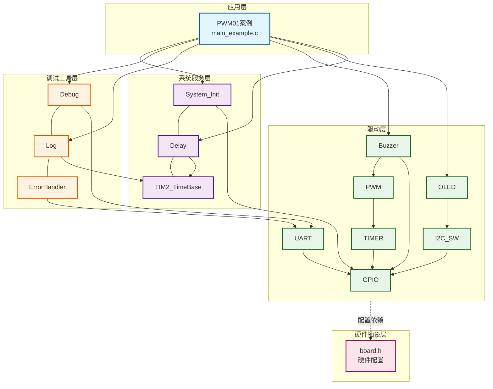
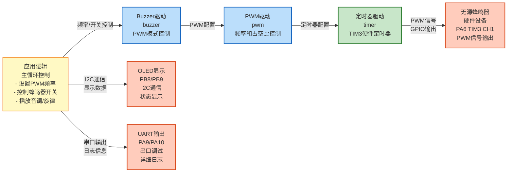
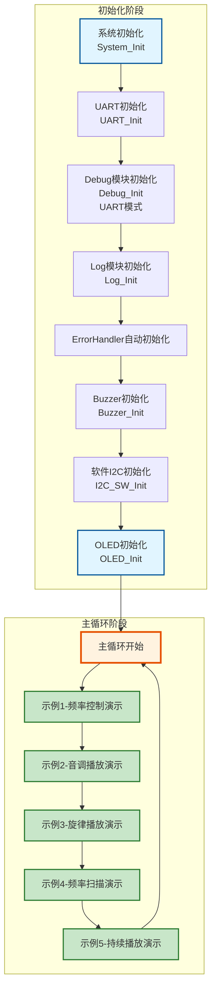

# PWM01 - PWM模式Buzzer控制示例

## 📋 案例目的

- **核心目标**：演示如何使用Buzzer驱动模块进行PWM模式的频率控制、音调播放、旋律播放等功能
- **学习重点**：
  - 理解Buzzer驱动模块的PWM模式使用方法
  - 掌握PWM频率控制和音调播放
  - 学习旋律播放和频率扫描功能
  - 了解OLED显示与Buzzer控制的结合使用
  - 学习系统初始化和延时功能的使用
- **应用场景**：适用于需要音调控制的应用，如音乐播放、报警音效、按键音反馈等

---

## 📋 功能说明

- **PWM模式**：演示频率控制、音调播放、旋律播放、频率扫描等功能
- **OLED显示**：使用OLED显示当前操作状态和提示信息
- 演示Buzzer驱动的PWM模式使用
- 演示系统初始化和延时功能
- 演示Buzzer频率设置和音调播放功能

---

## 🔧 硬件要求

### 必需硬件
- STM32F103C8T6开发板
- Buzzer（**无源蜂鸣器**，必须使用无源蜂鸣器）
- OLED显示屏（SSD1306，I2C接口，用于显示提示信息）
  - SCL连接到PB8
  - SDA连接到PB9

### 硬件连接

**Buzzer（无源蜂鸣器）**：
- Buzzer正极连接到PA6（TIM3 CH1）
- Buzzer负极连接到GND

**⚠️ 重要说明**：
- **必须使用无源蜂鸣器**：无源蜂鸣器需要外部驱动信号，通过改变PWM频率控制音调
- PWM模式支持频率控制和音调播放，可以播放音乐
- 如果使用有源蜂鸣器，请使用Basic01案例（GPIO模式）

**OLED显示屏（用于显示提示信息）**：
- SCL连接到PB8
- SDA连接到PB9

### 硬件配置

**⚠️ 重要说明**：案例是独立工程，硬件配置在案例目录下的 `board.h` 中。
如果硬件引脚不同，直接修改 `Examples/PWM/PWM01_pwm_Buzzer/board.h` 中的配置即可。

**Buzzer配置**（PWM模式）：
```c
/* Buzzer统一配置表 */
#define BUZZER_CONFIGS { \
    {BUZZER_MODE_PWM, NULL, 0, 1, 0, Bit_RESET, 1},  /* PWM模式，TIM3(实例1)通道1，启用 */ \
}
```

**配置说明**：
- `mode`: `BUZZER_MODE_PWM`（PWM模式）
- `port`/`pin`: PWM模式下可为NULL和0（忽略）
- `pwm_instance`: 1表示TIM3（0=TIM1, 1=TIM3, 2=TIM4）
- `pwm_channel`: 0表示通道1（0=CH1, 1=CH2, 2=CH3, 3=CH4）
- `active_level`: `Bit_RESET`为低电平有效，`Bit_SET`为高电平有效
- `enabled`: 1表示启用该Buzzer，0表示禁用

**PWM配置**（已包含在board.h中）：
```c
/* PWM统一配置表 */
#define PWM_CONFIGS { \
    {TIM3, {{GPIOA, GPIO_Pin_6, 1}, {GPIOA, GPIO_Pin_0, 0}, {GPIOA, GPIO_Pin_0, 0}, {GPIOA, GPIO_Pin_0, 0}}, 1}, /* TIM3：PA6(CH1)，启用 */ \
}
```

**OLED配置**（已包含在board.h中）：
```c
/* OLED I2C配置 */
#define OLED_I2C_CONFIG {      \
    GPIOB,                     \
    GPIO_Pin_8, /* SCL: PB8 */ \
    GPIOB,                     \
    GPIO_Pin_9, /* SDA: PB9 */ \
}
```

**UART配置**（已包含在board.h中，新项目必须）：
```c
/* UART统一配置表 - 标准配置：USART1，PA9/PA10，115200，8N1 */
#define UART_CONFIGS { \
    {USART1, GPIOA, GPIO_Pin_9, GPIOA, GPIO_Pin_10, 115200, USART_WordLength_8b, USART_StopBits_1, USART_Parity_No, 1}, \
}
```

**注意**：
- **必须使用无源蜂鸣器**，有源蜂鸣器无法通过PWM控制频率
- 根据实际硬件修改PWM引脚（`GPIO_Pin_6`等）
- 根据实际硬件修改OLED引脚（`GPIO_Pin_8`、`GPIO_Pin_9`等）
- 根据实际硬件修改PWM实例和通道（`pwm_instance`、`pwm_channel`）
- **新项目必须配置UART**：所有新项目（除案例1外）必须包含UART_CONFIGS配置（用于串口调试和日志输出）

---

## 📦 模块依赖

### 模块依赖关系图

展示本案例使用的模块及其依赖关系：



### 模块列表

本案例使用以下模块：

- `buzzer`：Buzzer驱动模块（核心功能，PWM模式）
- `timer`：定时器模块（PWM功能依赖）
- `gpio`：GPIO驱动模块（UART、OLED依赖）
- `uart`：UART驱动模块（串口调试，新项目必须）
- `debug`：Debug模块（printf重定向，新项目必须）
- `log`：日志模块（分级日志系统，新项目必须）
- `error_handler`：错误处理模块（统一错误处理，新项目必须）
- `oled_ssd1306`：OLED显示驱动模块（状态显示）
- `i2c_sw`：软件I2C驱动模块（OLED使用）
- `delay`：延时模块（用于实现时间间隔）
- `system_init`：系统初始化模块

---

## 🚀 使用方法

### 快速开始
1. **打开案例工程**：双击 `Examples/PWM/PWM01_pwm_Buzzer/Examples.uvprojx` 打开Keil工程
2. **检查硬件配置**：确认案例目录下的 `board.h` 中Buzzer配置正确（TIM3 CH1，PA6）
3. **编译下载**：在Keil中编译（F7）并下载到开发板（F8）
4. **观察效果**：
   - OLED显示操作状态
   - 不同频率的鸣响（500Hz、1kHz、2kHz）
   - 播放C4-C5音阶
   - 播放简单旋律（小星星前奏）
   - 频率扫描效果（200Hz-2000Hz）
   - 持续播放音调

### 详细操作流程

**通用操作步骤请参考**：[Examples/README.md](../README.md#-通用操作流程)

**注意**：本案例是独立工程，无需复制文件，直接打开工程文件即可编译运行。

---

## 🔄 实现流程

### 整体逻辑

本案例通过5个示例阶段，全面演示Buzzer PWM模式的各种功能。每个示例阶段展示不同的功能点：

1. **示例1：频率控制**
   - 演示不同频率的鸣响（500Hz、1kHz、2kHz）
   - 展示PWM频率设置和开关控制
   - OLED显示当前频率

2. **示例2：音调播放**
   - 播放C4-C5音阶（8个音调）
   - 展示音调播放功能
   - OLED显示当前音调

3. **示例3：旋律播放**
   - 播放简单旋律（小星星前奏）
   - 展示连续音调播放
   - OLED显示播放状态

4. **示例4：频率扫描**
   - 从200Hz扫描到2000Hz
   - 展示频率动态变化效果
   - OLED显示扫描状态

5. **示例5：持续播放**
   - 持续播放A4音调1秒后停止
   - 展示持续播放和手动停止功能
   - OLED显示播放状态

### 关键方法

- **标准初始化流程**：按照System_Init → UART → Debug → Log → 其他模块的顺序初始化
- **错误处理集成**：通过ErrorHandler模块统一处理错误，并输出错误日志
- **分级日志输出**：通过Log模块实现不同级别的日志输出，便于调试和监控
- **串口与OLED输出分工**：串口输出详细日志（中文），OLED输出简要状态（英文）

### 数据流向图

展示本案例的数据流向：应用逻辑 → PWM控制 → 蜂鸣器输出



**数据流说明**：

1. **应用逻辑**：
   - 主循环中设置PWM频率（Buzzer_SetFrequency）
   - 控制蜂鸣器开关（Buzzer_On/Off）
   - 播放音调、旋律等

2. **Buzzer驱动**：
   - **Buzzer驱动模块**：封装PWM模式控制，提供频率设置和开关接口
   - 调用PWM驱动进行配置

3. **PWM驱动**：
   - **PWM驱动模块**：配置定时器产生PWM信号
   - 设置频率、占空比等参数

4. **定时器驱动**：
   - **定时器驱动**：TIM3硬件定时器，产生PWM波形
   - 通过GPIO输出PWM信号

5. **输出设备**：
   - **无源蜂鸣器**：接收PWM信号，根据频率产生不同音调
   - **OLED**：显示当前频率、音调、播放状态等信息
   - **UART**：输出详细日志信息（支持中文）

### 工作流程示意



---

## 📝 代码说明

### 关键代码

```c
// 系统初始化
System_Init();

// Buzzer初始化
Buzzer_Init();

// OLED初始化
OLED_Init();

// PWM模式：设置频率
Buzzer_SetFrequency(BUZZER_1, 1000);  // 设置1kHz
BUZZER1_On();
Delay_ms(500);
BUZZER1_Off();

// PWM模式：播放音调
Buzzer_PlayTone(BUZZER_1, BUZZER_TONE_A4, 500);  // 播放A4音调500ms

// PWM模式：持续播放（需要手动停止）
Buzzer_PlayTone(BUZZER_1, BUZZER_TONE_A4, 0);  // 持续播放
Delay_ms(1000);
BUZZER1_Stop();  // 手动停止
```

### 完整流程

1. **系统初始化**：`System_Init()` 初始化SysTick和延时模块
2. **Buzzer初始化**：`Buzzer_Init()` 初始化Buzzer驱动（PWM模式）
3. **OLED初始化**：`OLED_Init()` 初始化OLED显示
4. **频率控制**：使用 `Buzzer_SetFrequency()` 设置频率，然后 `BUZZER1_On()` 开启
5. **音调播放**：使用 `Buzzer_PlayTone()` 播放指定音调
6. **延时**：使用 `Delay_ms()` 实现时间间隔

---

## 📚 关键函数说明

### Buzzer相关函数

- **`Buzzer_Init()`**：初始化Buzzer驱动模块
  - 在本案例中用于初始化PWM模式的Buzzer
  - 根据配置表自动初始化所有enabled=1的Buzzer
  - 返回Buzzer_Status_t错误码，需要检查返回值

- **`Buzzer_SetFrequency()`**：设置Buzzer频率（PWM模式）
  - 在本案例中用于设置不同的频率（500Hz、1kHz、2kHz等）
  - 参数：Buzzer编号、频率值（Hz）
  - 返回Buzzer_Status_t错误码，需要检查返回值

- **`Buzzer_PlayTone()`**：播放指定音调（PWM模式）
  - 在本案例中用于播放音调和旋律
  - 参数：Buzzer编号、音调枚举值、持续时间（ms，0表示持续播放）
  - 返回Buzzer_Status_t错误码，需要检查返回值

- **`BUZZER1_On()`**：开启Buzzer（快捷宏）
  - 在本案例中用于开启Buzzer输出
  - 必须在设置频率后调用

- **`BUZZER1_Off()`**：关闭Buzzer（快捷宏）
  - 在本案例中用于关闭Buzzer输出

- **`BUZZER1_Stop()`**：停止Buzzer播放（快捷宏）
  - 在本案例中用于停止持续播放的音调

### UART相关函数

- **`UART_Init()`**：初始化UART外设
  - 在本案例中用于初始化USART1，配置为115200波特率、8N1格式
  - 参数：UART实例索引（UART_INSTANCE_1）
  - 返回UART_Status_t错误码，初始化失败必须停止程序

### Debug模块相关函数

- **`Debug_Init()`**：初始化Debug模块（UART模式）
  - 在本案例中用于初始化Debug模块，配置为UART输出模式
  - 参数：输出模式（DEBUG_MODE_UART）、波特率
  - 返回int类型，0表示成功，非0表示失败，初始化失败必须停止程序

### Log模块相关函数

- **`Log_Init()`**：初始化日志系统
  - 在本案例中用于初始化日志系统，配置日志级别和功能开关
  - 参数：日志配置结构体指针
  - 返回Log_Status_t错误码，初始化失败可以继续运行

- **`LOG_DEBUG()`** / **`LOG_INFO()`** / **`LOG_WARN()`** / **`LOG_ERROR()`**：分级日志宏
  - 在本案例中用于输出不同级别的日志
  - 参数：模块名称、格式字符串、参数列表
  - 串口输出详细日志（支持中文）

### 错误处理相关函数

- **`ErrorHandler_Handle()`**：处理错误
  - 在本案例中用于处理各种错误，并输出错误日志
  - 参数：错误码、模块名称
  - ErrorHandler模块在编译时自动初始化，无需显式调用

### OLED相关函数

- **`OLED_Init()`**：初始化OLED显示模块
  - 在本案例中用于初始化OLED显示
  - 返回OLED_Status_t错误码，需要检查返回值

- **`OLED_Clear()`**：清屏
  - 在本案例中用于清除OLED显示内容

- **`OLED_ShowString()`**：显示字符串
  - 在本案例中用于显示操作状态和提示信息
  - 参数：行号、列号、字符串（全英文，ASCII字符）

**详细函数实现和调用示例请参考**：`main_example.c` 中的代码

---

## 🎯 预期效果

- **OLED显示**：显示当前操作状态和提示信息
- **示例1**：不同频率的鸣响（500Hz、1kHz、2kHz，各500ms）
- **示例2**：播放C4-C5音阶（每个音调300ms）
- **示例3**：播放简单旋律（小星星前奏）
- **示例4**：频率扫描效果（从200Hz扫描到2000Hz）
- **示例5**：持续播放A4音调1秒后停止
- 程序循环执行上述操作

---

## 💡 扩展练习

### 循序渐进理解本案例

1. **修改频率范围**：修改频率扫描的起始和结束频率，理解PWM频率控制的范围和限制
2. **播放完整旋律**：实现完整的小星星或其他歌曲，理解音符序列与音乐旋律的对应关系
3. **添加更多音调**：扩展音调范围（需要修改buzzer.c中的音调频率表），理解音符频率的计算方法

### 实际场景中的常见坑点

4. **频率切换延迟**：当快速切换PWM频率时，如果频率设置函数执行时间较长，可能导致音调不准确或播放不完整。如何处理这种情况，确保每个音调都能准确播放？
5. **节拍精度问题**：使用 `Delay_ms()` 实现的节拍控制精度有限，当TEMPO较高时，误差会累积。如何提高节拍精度，或者如何处理节拍误差的累积？
6. **多Buzzer同步**：如果使用多个Buzzer实现和声，如何保证它们同步播放？如何处理不同Buzzer的频率设置时间差异？

---

## ⚠️ 注意事项与重点

### ⚠️ 重要提示

1. **必须使用无源蜂鸣器**：PWM模式必须使用无源蜂鸣器，有源蜂鸣器无法通过PWM控制频率
2. **PWM配置正确性**：确保PWM实例和通道配置正确（TIM3 CH1对应PA6）
3. **初始化顺序**：必须严格按照 System_Init → UART → Debug → Log → 其他模块 的顺序初始化
4. **UART配置**：新项目必须包含UART_CONFIGS配置（用于串口调试和日志输出）
5. **错误处理**：所有模块初始化函数必须检查返回值，使用ErrorHandler统一处理错误

### 🔑 关键点

1. **标准初始化流程**：
   - 系统初始化（System_Init）
   - UART初始化（UART_Init）
   - Debug模块初始化（Debug_Init，UART模式）
   - Log模块初始化（Log_Init）
   - ErrorHandler自动初始化（无需显式调用）
   - 其他模块初始化（按依赖顺序）

2. **错误处理策略**：
   - UART/Debug初始化失败：必须停止程序（进入死循环）
   - Log初始化失败：可以继续运行（使用UART直接输出）
   - 其他模块初始化失败：根据模块重要性决定是否继续运行

3. **输出分工规范**：
   - **串口（UART）**：详细日志、调试信息、错误详情（支持中文，GB2312编码）
   - **OLED**：关键状态、实时数据、简要提示（全英文，ASCII字符）
   - **双边输出**：系统启动信息、关键错误、重要状态变化

4. **PWM频率控制**：
   - 频率范围：1Hz ~ 72MHz（实际使用建议200Hz-5000Hz）
   - 频率设置后需要调用On/Off控制输出
   - 音调播放使用预定义的音调枚举值

5. **日志输出**：
   - 开发阶段使用LOG_LEVEL_DEBUG（显示所有日志）
   - 发布时改为LOG_LEVEL_INFO或LOG_LEVEL_WARN
   - 日志调用必须包含模块名字符串

### 💡 调试技巧

1. **没有日志输出**：
   - 检查UART是否正确初始化
   - 检查Debug模块是否正确初始化
   - 检查串口助手配置是否正确（115200, 8N1）
   - 检查硬件连接是否正确（PA9/PA10）

2. **Buzzer不响**：
   - 检查蜂鸣器类型（必须使用无源蜂鸣器）
   - 检查PWM配置是否正确（TIM3 CH1，PA6）
   - 检查Buzzer的enabled标志是否为1
   - 检查定时器模块是否已启用

3. **频率不正确**：
   - 检查系统时钟配置是否正确
   - 检查PWM频率设置是否在有效范围内
   - 检查PWM配置是否正确

4. **OLED不显示**：
   - 检查OLED连接是否正确（SCL: PB8, SDA: PB9）
   - 检查软件I2C模块是否已启用
   - 检查OLED模块是否已启用

---

## ⚠️ 常见问题

### Buzzer不响
- **检查蜂鸣器类型**：必须使用**无源蜂鸣器**，有源蜂鸣器无法通过PWM控制频率
- 检查案例目录下的 `board.h` 中的Buzzer配置是否正确
- 检查PWM实例和通道配置（`pwm_instance`、`pwm_channel`）
- 检查PWM配置（`PWM_CONFIGS`）中的引脚是否正确（PA6）
- 检查Buzzer的 `enabled` 标志是否为1
- 检查定时器模块是否已启用（`CONFIG_MODULE_TIMER_ENABLED = 1`）

### 频率不正确
- 检查系统时钟配置是否正确
- 检查PWM频率设置是否在有效范围内（1Hz ~ 72MHz）
- 检查PWM配置是否正确

### OLED不显示
- 检查OLED连接是否正确（SCL: PB8, SDA: PB9）
- 检查软件I2C模块是否已启用（`CONFIG_MODULE_SOFT_I2C_ENABLED = 1`）
- 检查OLED模块是否已启用（`CONFIG_MODULE_OLED_ENABLED = 1`）

### 编译错误
- 确保已包含必要的头文件
- 确保 `System_Init()` 和 `Buzzer_Init()` 已正确调用
- 确保Buzzer模块已启用（`CONFIG_MODULE_BUZZER_ENABLED = 1`）
- 确保定时器模块已启用（`CONFIG_MODULE_TIMER_ENABLED = 1`）
- 确保OLED模块已启用（`CONFIG_MODULE_OLED_ENABLED = 1`）
- 确保软件I2C模块已启用（`CONFIG_MODULE_SOFT_I2C_ENABLED = 1`）

---

## 📖 相关文档

- **模块文档**：
  - **Buzzer驱动**：`Drivers/basic/buzzer.c/h`
  - **PWM驱动**：`Drivers/timer/timer_pwm.c/h`
  - **GPIO驱动**：`Drivers/basic/gpio.c/h`
  - **UART驱动**：`Drivers/uart/uart.c/h`
  - **Debug模块**：`Debug/debug.c/h`
  - **Log模块**：`Debug/log.c/h`
  - **ErrorHandler模块**：`Common/error_handler.c/h`
- **OLED驱动**：`Drivers/display/oled_ssd1306.c/h`
- **OLED字库**：`Drivers/display/oled_font_ascii8x16.c/h`
- **软件I2C驱动**：`Drivers/i2c/i2c_sw.c/h`
- **延时功能**：`System/delay.c/h`
- **系统初始化**：`System/system_init.c/h`
- **硬件配置**：案例目录下的 `board.h`

---

## 🔄 与Basic01的区别

| 特性 | Basic01_ActiveBuzzer | PWM01_pwm_Buzzer |
|------|---------------------|-------------------|
| 驱动模式 | GPIO模式 | PWM模式 |
| 蜂鸣器类型 | 有源蜂鸣器 | 无源蜂鸣器 |
| 频率控制 | ❌ 不支持 | ✅ 支持 |
| 音调播放 | ❌ 不支持 | ✅ 支持 |
| 引脚配置 | 直接GPIO引脚（PA3） | PWM引脚（PA6，TIM3 CH1） |
| 功能 | 简单开关、鸣响 | 频率控制、音调播放、旋律 |

**注意**：本案例与 `Basic02_PWMPassiveBuzzer` 功能相同，但位于PWM分类目录下，更适合作为PWM模块的示例。

---

**最后更新**：2024-01-01


